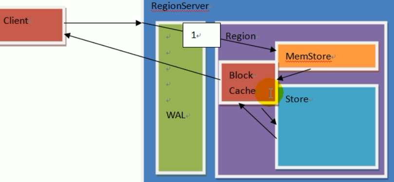
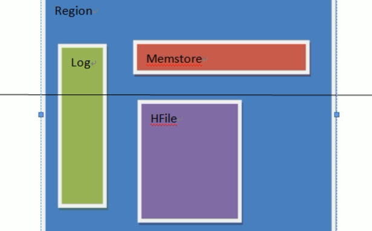

## 读流程

 

- 查看ZK中meta表存储在哪个节点上

```bash
[zk: localhost:2181(CONNECTED) 4] get /hbase/meta-region-server
�regionserver:16020x�4�4�PBUF
 
	hadoop104�}�ɪ��- 
cZxid = 0x400000161
ctime = Sun Sep 22 20:20:41 CST 2019
mZxid = 0x400000161
mtime = Sun Sep 22 20:20:41 CST 2019
pZxid = 0x400000161
cversion = 0
dataVersion = 0
aclVersion = 0
ephemeralOwner = 0x0
dataLength = 62
numChildren = 0
```

- 查看meta表

```bash
hbase(main):010:0> scan 'hbase:meta'
...
test:user,,1569206651505.71f24d column=info:server, timestamp=1569206652247, value=hadoop102:16020             
 03703097287275bc995f710759.
 test:user,,1569206651505.71f24d column=info:serverstartcode, timestamp=1569206652247, value=1569154835683
 03703097287275bc995f710759.
 ...
```

- 整个读取的流程与HMaster无关，HMaster用于管理RegionServer的
- 第5步读取数据细化
  - 先从MemStore（写缓存）中读取
  - 如果没有再从Region的BlockCache（读缓存）中读取
  - 如果没有再从Store中读取
    - Store中读取后放到BlockCache中
    - 由BlockCache返回

 

- 小结
  - Client先访问Zookeeper，读取meta表所在region的位置，然后读取meta表中的数据
    - meta中存储了用户表的region信息
  - 根据namespace、表名和rowkey在meta表中找到对应的region信息
  - ==将region位置信息存储在客户端缓存cache中==
  - 找到这个region对应的regionserver
  - 查找对应的region
    - 先从MemStore中查找数据
      - 没有，到BlockCache中读取
    - BlockCache中没有
      - 到StoreFile中读取数据
      - 为了读取的效率
    - ==如果是从StoreFile中读取的数据，不直接返回给客户端，先写入BlockCache中，再返回给客户端==
  - 返回结果给客户端

  


## 写流程

- rowkey的范围


- 写入的速度比读取快
- Client向HregionServer发送写请求
- HregionServer将数据写到HLog
  - write ahead log
  - 为了数据的持久化和恢复
- HregionServer将数据写到内存MemStore
- 将WAL数据落盘同步到HDFS
  - ==若在同步WAL到HDFS过程中发生异常则rollBack==
    - MemStore中的数据会删除
- 反馈Client写成功
- ==MemStore在flush到HDFS的时候回生成一个HFile==
  - MemStore的默认大小是128M，那么生成的HDFS文件大小也是128M
  - 每个StoreFile(含HFile)就是一个列族


## 数据的flush

- 当MemStore 数据到达阈值
  - 默认128M，老版本64M
  - RegionServer会将数据刷到硬盘
  - 将内存中的数据删除
  - 将HLog中的历史数据删除
- 触发参数如下
  - 注意参数配置都在hbase-default.xml中

```bash
# 单个memstore大小
hbase.hregion.memstore.flush.size=134217728(128M)
# server角度出发，全部memstore大小，堆内存的40%，所有的memstore的总大小，如果超过了，则会写入阻塞
hbase.regionserver.global.memstore.size=0.4
# server角度出发，全部的memstore大小在heap内存的40%的95%的时候(0.38)，可以再次写入
hbase.regionserver.global.memstore.size.lower.limit=0.95
# 内存中的文件自动刷新之前可以存活的时间，默认1h 
hbase.regionserver.optionalcacheflushinterval=3600000
# region的角度出发，memstore超过4*128，则flush
hbase.hregion.memstore.block.multiplie=4
```

- 并将数据存储到HDFS中
- 在HLog中做标记点

 

- WAL，预写日志HLog达到阈值，也会触发memstore的flush


## 数据的合并

- 当数据文件达到一定个数，Hmaster触发合并操作，Region将数据块加载到本地，进行合并
- 一个store中可存的hfile的个数有限，超过一定个数会被写到新的一个hfile里面
- 每个region的每个列族对应的memstore在flush为hfile的时候
  - 默认情况3个hfile的时候就会这些文件进行合并重写为一个新文件
  - 设置个数越大可以减少触发合并的时间，但是每次合并的时间就会越长 

```bash
# 不足3个超过7天也进行合并，一般不设置该值，进行手动合并
hbase.hregion.majorcompaction=604800000(7天)
# 当一个列族的store中的hfile个数超过3个，则会出发合并
hbase.hstore.compactionThreshold=3
```


## 数据的拆分

- 当合并的数据超过256M，进行Region拆分
  - 拆分后的Region分配给不同的HregionServer管理
  - 将HregionServer上的hlog拆分分配给不同的HregionServer加载，修改META表内容
- 注意：HLog会同步到HDFS

 

- 拆分策略
  - 不同版本的拆分策略不一样

```bash
hbase.regionserver.region.split.policy=org.apache.hadoop.hbase.regionserver.IncreasingToUpperBoundRegionSplitPolicy
#HStoreFile最大的大小，当某个region的某个列族超过这个大小会进行region拆分
#默认值10G
hbase.hregion.max.filesize=10737418240
```

- 查看源码分析
  - 在idea添加相应的hbase-server和hbase-client的依赖

```java
shouldSplit()
	// 表中Region的个数
    int tableRegionsCount = getCountOfCommonTableRegions();
    // Get size to check
    // 获取要检查的大小
    long sizeToCheck = getSizeToCheck(tableRegionsCount);
    	// 10G 当tableRegionsCount == 0 || tableRegionsCount > 100
    	getDesiredMaxFileSize
        // 当前是当tableRegionsCount == 1 设置的值小于10G的值如下
        Math.min(getDesiredMaxFileSize(),initialSize * tableRegionsCount * tableRegionsCount * tableRegionsCount)
          	initialSize = 2 * conf.getLong(HConstants.HREGION_MEMSTORE_FLUSH_SIZE,HTableDescriptor.DEFAULT_MEMSTORE_FLUSH_SIZE);

//HREGION_MEMSTORE_FLUSH_SIZE 该值是在hbase-default.xml中配置的hbase.hregion.memstore.flush.size的大小，默认128M
```

- 第一次hfile大小超过256M时进行拆分，第二次tableRegionsCount值为2，那么sizeToCheck=256M*8
  - 每次sizeToCheck是变化的
- 拆分涉及到rowKey的拆分