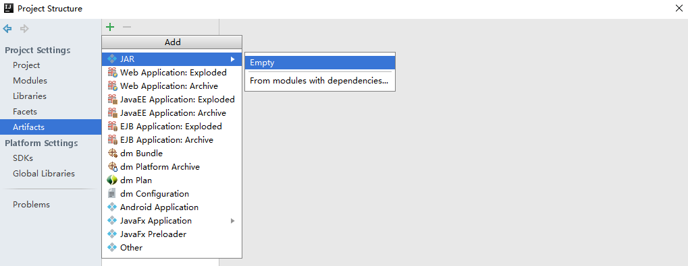
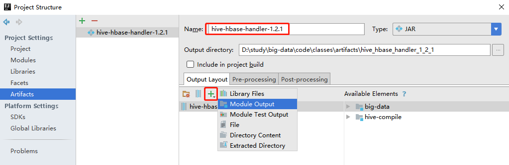
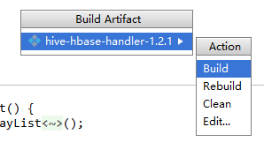

# 与Hive集成


## HBase 与Hive对比

- Hive
  - 数据仓库
    - Hive的本质其实就相当于将HDFS中已经存储的文件在Mysql中做了一个双射关系
    - 使用HQL去管理查询
  - 用于数据分析、清洗
    - Hive适用于离线的数据分析和清洗
  - 延迟较高
  - 基于HDFS、MapReduce
    - Hive存储的数据依旧在DataNode上
    - 编写的HQL语句终将是转换为MapReduce代码执行
- HBase
  - 数据库
    - 是一种面向列存储的非关系型数据库
  - 用于存储结构化和非结构化的数据
    - 适用于单表非关系型数据的存储
    - 不适合做关联查询，类似JOIN等操作
  - 基于HDFS
    - ==数据持久化存储的体现形式是Hfile==，存放于DataNode中，被ResionServer以region的形式进行管理
  - 延迟较低
    - 接入在线业务使用
    - 面对大量的企业数据，==HBase可以直线单表大量数据的存储==
    - 提供了高效的数据访问速度


## HBase与Hive集成使用

- Hive和HBase建立双向连接，Hive创建的表导入数据会生成HBase的表，反之也是

  

### 编译jar包

- HBase与Hive的集成在最新的两个版本中无法兼容
- 可能需要重新编译 hive-hbase-handler-1.2.1.jar
- 创建hive-compile的java工程


- 拷贝\apache-hive-1.2.1-src\hbase-handler\src\java\org源码到java工程中
- 由于缺少依赖的jar包，从hive/lib中拷贝，添加依赖

 

- 打包

 



 

- 点击OK
- 点击Build-->Build Artifacts

 

- 上传编译好的`hive-hbase-handler-1.2.1.jar`上传替换hive/lib下相同的jar包即可

  

### 环境准备

- 后续可能会在操作Hive的同时对HBase也会产生影响，Hive需要持有操作HBase的Jar
  - 拷贝Hive所依赖的Jar包
  - 或者使用软连接的形式
- 输入如下命令，生成软链接
  - 查看hive的lib中可以看到软链接生成

```bash
export HBASE_HOME=/opt/module/hbase
export HIVE_HOME=/opt/module/hive

ln -s $HBASE_HOME/lib/hbase-common-1.3.1.jar  $HIVE_HOME/lib/hbase-common-1.3.1.jar
ln -s $HBASE_HOME/lib/hbase-server-1.3.1.jar $HIVE_HOME/lib/hbase-server-1.3.1.jar
ln -s $HBASE_HOME/lib/hbase-client-1.3.1.jar $HIVE_HOME/lib/hbase-client-1.3.1.jar
ln -s $HBASE_HOME/lib/hbase-protocol-1.3.1.jar $HIVE_HOME/lib/hbase-protocol-1.3.1.jar
ln -s $HBASE_HOME/lib/hbase-it-1.3.1.jar $HIVE_HOME/lib/hbase-it-1.3.1.jar
ln -s $HBASE_HOME/lib/htrace-core-3.1.0-incubating.jar $HIVE_HOME/lib/htrace-core-3.1.0-incubating.jar
ln -s $HBASE_HOME/lib/hbase-hadoop2-compat-1.3.1.jar $HIVE_HOME/lib/hbase-hadoop2-compat-1.3.1.jar
ln -s $HBASE_HOME/lib/hbase-hadoop-compat-1.3.1.jar $HIVE_HOME/lib/hbase-hadoop-compat-1.3.1.jar
```

- 配置`hive-site.xml`
  - 修改zookeeper的属性

```xml
<property>
    <name>hive.zookeeper.quorum</name>
    <value>hadoop102,hadoop103,hadoop104</value>
    <description>The list of ZooKeeper servers to talk to. This is only needed for read/write locks.</description>
</property>
<property>
    <name>hive.zookeeper.client.port</name>
    <value>2181</value>
    <description>The port of ZooKeeper servers to talk to. This is only needed for read/write locks.</description>
</property>
```


### 示例1

- 建立Hive表，关联HBase表，插入数据到Hive表的同时能够影响HBase表
- 在Hive中创建表同时关联HBase
  - stored表示存储方式
  - :key表示rowkey

```sql
CREATE TABLE hive_hbase_emp_table(
empno int,
ename string,
job string,
mgr int,
hiredate string,
sal double,
comm double,
deptno int)
STORED BY 'org.apache.hadoop.hive.hbase.HBaseStorageHandler'
WITH SERDEPROPERTIES ("hbase.columns.mapping" = ":key,info:ename,info:job,info:mgr,info:hiredate,info:sal,info:comm,info:deptno")
TBLPROPERTIES ("hbase.table.name" = "hbase_emp_table");
```

- 完成之后，可以分别进入Hive和HBase查看，都生成了对应的表

 

```bash
hive (default)> show tables;
OK
tab_name
hive_hbase_emp_table
```

- 在Hive中创建临时中间表，用于load文件中的数据
  - 不能将数据直接load进Hive所关联HBase的那张表中

```sql
CREATE TABLE emp(
empno int,
ename string,
job string,
mgr int,
hiredate string,
sal double,
comm double,
deptno int)
row format delimited fields terminated by '\t';
```

- load数据

```bash
hive> load data local inpath '/opt/module/datas/emp.txt' into table emp;
```

```text
7369	SMITH	CLERK	7902	1980-12-17	800.00		20
7499	ALLEN	SALESMAN	7698	1981-2-20	1600.00	300.00	30
7521	WARD	SALESMAN	7698	1981-2-22	1250.00	500.00	30
7566	JONES	MANAGER	7839	1981-4-2	2975.00		20
7654	MARTIN	SALESMAN	7698	1981-9-28	1250.00	1400.00	30
7698	BLAKE	MANAGER	7839	1981-5-1	2850.00		30
7782	CLARK	MANAGER	7839	1981-6-9	2450.00		10
```

- insert数据到hive，到hbase中
  - 通过insert命令将中间表中的数据导入到Hive关联HBase的那张表中

```bash
hive> insert into table hive_hbase_emp_table select * from emp;
```

- 查看Hive以及关联的HBase表中是否已经成功的同步插入了数据

```sql
hive (default)> select * from hive_hbase_emp_table;
OK
hive_hbase_emp_table.empno	hive_hbase_emp_table.ename	hive_hbase_emp_table.job	hive_hbase_emp_table.mgr	hive_hbase_emp_table.hiredate	hive_hbase_emp_table.sal	hive_hbase_emp_table.comm	hive_hbase_emp_table.deptno
7369	SMITH	CLERK	7902	1980-12-17	800.0	NULL	20
7499	ALLEN	SALESMAN	7698	1981-2-20	1600.0	300.0	30
...
```

```bash
hbase> scan ‘hbase_emp_table’

hbase(main):004:0> scan 'hbase_emp_table'
ROW                              COLUMN+CELL
 7369                            column=info:deptno, timestamp=1569339358627, value=20
 7369                            column=info:ename, timestamp=1569339358627, value=SMIT
 7369                            column=info:hiredate, timestamp=1569339358627, value=1980-12-17
 7369                            column=info:job, timestamp=1569339358627, value=CLERK
 7369                            column=info:mgr, timestamp=1569339358627, value=7902    ...
```


### 示例2

- 在HBase中已经存储了某一张表hbase_emp_table，然后在Hive中创建一个外部表来关联HBase中的hbase_emp_table这张表
- 使可以借助Hive来分析HBase这张表中的数据
  - 该示例2紧跟示例1的脚步，所以完成此案例前，请先完成示例1
- 在Hive中创建外部表

```bash
CREATE EXTERNAL TABLE relevance_hbase_emp(
empno int,
ename string,
job string,
mgr int,
hiredate string,
sal double,
comm double,
deptno int)
STORED BY 
'org.apache.hadoop.hive.hbase.HBaseStorageHandler'
WITH SERDEPROPERTIES ("hbase.columns.mapping" = 
":key,info:ename,info:job,info:mgr,info:hiredate,info:sal,info:comm,info:deptno") 
TBLPROPERTIES ("hbase.table.name" = "hbase_emp_table");
```

- 关联后就可以使用Hive函数进行一些分析操作了

```bash
hive (default)> select * from relevance_hbase_emp;
OK
relevance_hbase_emp.empno	relevance_hbase_emp.ename	relevance_hbase_emp.job	relevance_hbase_emp.mgr	relevance_hbase_emp.hiredatrelevance_hbase_emp.sal	relevance_hbase_emp.comm	relevance_hbase_emp.deptno
7369	SMITH	CLERK	7902	1980-12-17	800.0	NULL	20
7499	ALLEN	SALESMAN	7698	1981-2-20	1600.0	300.0	30
7521	WARD	SALESMAN	7698	1981-2-22	1250.0	500.0	30
...
```

