# 知识点准备


## 表的拆分

- 宽表的列拆分
  - 垂直拆分

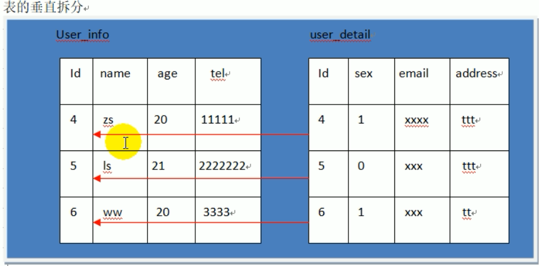

- 高表
  - 数据量太大
    - 一个表超过1000万，查询效率会低
  - 水平拆分
    - id不能自增

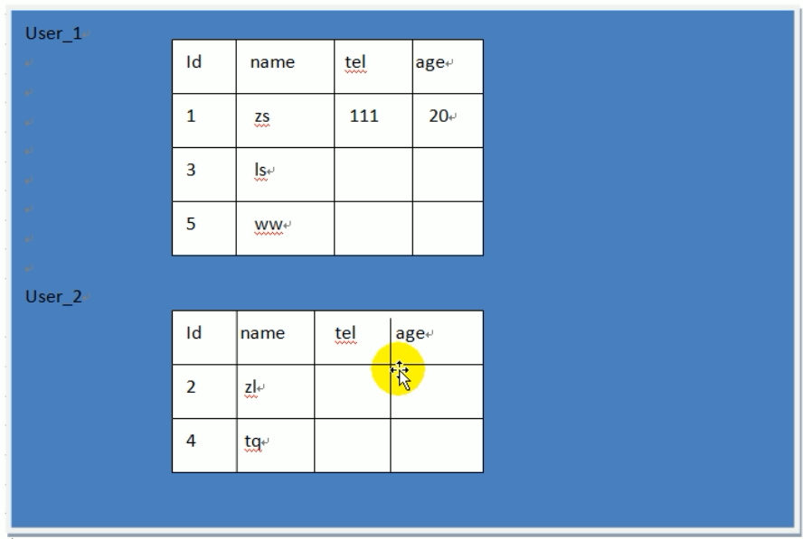

- 增加列
  - 每个表都要加一列？
    - 性能会下降
    - 违反了OCP原则

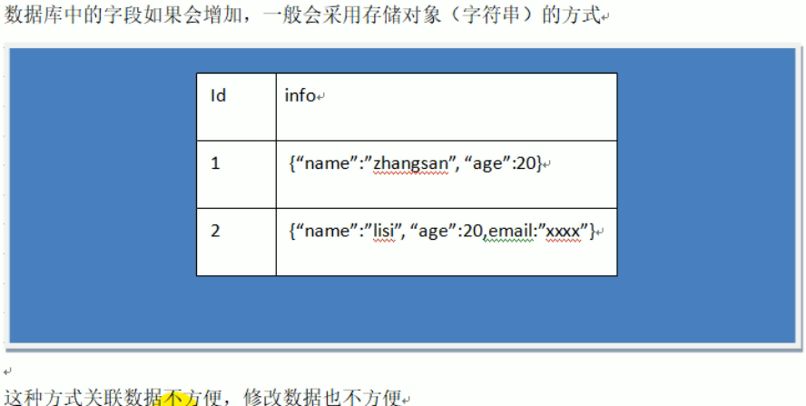

- 缺点：全量修改

合并之后的解决方案


- 缺点：修改是全量修改
  - 考虑到修改没有读取频繁，可以接受
- 当user1大量读取时，会影响到user2的读取
  - 需要进行扩展机器，将user1和user2部署在不同的机器上
  - 新问题，用户如何访问
    - 使用注册中心

- 关于引擎
  - InnoDB
    - 对表空间有限制
    - 64TB
  - MyISaM
    - 最大表限制
    - 256TB

- 大数据数量级PB，使用大数据的存储框架，HBase，依托于Hadoop

- 关于数据库的写入操作
  - 先预写到logFile中，顺序写入，速度快
  - 再放入缓存cache中


- 稀疏表
  - 列不存在，如{"id":1,"name":"zs","age":20} 存储形式就是稀疏表
  - 传统的mysql表示密集表，即使值不存在也是为空


# 介绍


## 是什么

- HBase的原型是Google的BigTable论文，受到了该论文思想的启发
- 作为Hadoop的子项目来开发维护，用于支持结构化的数据存储

- 官方网站：http://hbase.apache.org

- 时间线
  - 2006年Google发表BigTable白皮书
  - 2006年开始开发HBase
  - 2008年HBase成了Hadoop的子项目
  - 2010年HBase成为Apache顶级项目

- 一个==高可靠性、高性能、面向列、可伸缩==的分布式存储系统

  - 高可靠

    - HLog
    - HDFS

  - 高性能

    - MemStore
    - Region

  - 面向列

    - Mysql面向行存储
    - HBase面向列存储
    - 列族
      - info是一个列族
      - 每个列族存储在一个storeFile里
        - 好处，查询一个列族只需要读取一个文件，速度快

    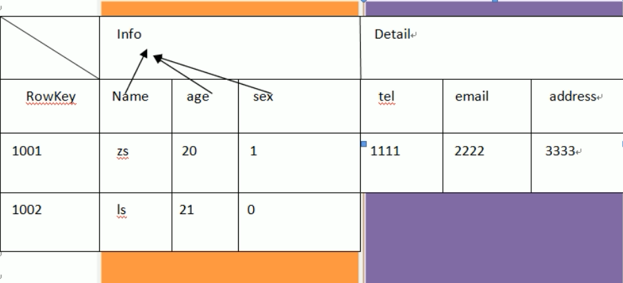

  - 可伸缩

    - Zookeeper
    - RegionServer

- 利用HBASE技术可在廉价PC Server上搭建起大规模结构化存储集群

- 目标是存储并处理大型的数据
  
- 仅需使用普通的硬件配置，就能够处理由成千上万的行和列所组成的大型数据
  
- HBase是Google Bigtable的开源实现，不同之处如下
  - Google Bigtable利用GFS作为其文件存储系统
  - HBase利用Hadoop HDFS作为其文件存储系统
  - Google运行MAPREDUCE来处理Bigtable中的海量数据
  - HBase利用Hadoop MapReduce来处理HBase中的海量数据
  - Google Bigtable利用Chubby作为协同服务
  - HBase利用Zookeeper作为对应


## 特点

- 海量存储
  - HBase适合存储PB级别的海量数据
  - 在PB级别的数据以及采用廉价PC存储的情况下，能在几十到百毫秒内返回数据
  - HBase良好的扩展性，为海量数据的存储提供了便利

- 列式存储
  - 列族存储，HBase是根据==列族==来存储数据的
    - column family
  - 列族下面可以有非常多的列
  - 列族在创建表时必须指定

- 极易扩展
  - 基于上层处理能力（RegionServer）的扩展
  - 基于存储的扩展（HDFS）
  - 通过横向添加RegionSever的机器，进行水平扩展，提升HBase上层的处理能力，提升Hbsae服务更多Region的能力。

- RegionServer的作用是管理region，承接业务的访问
  - 后面会详细的介绍通过横向添加Datanode的机器，进行存储层扩容，提升HBase的数据存储能力和提升后端存储的读写能力

- 高并发
  - 目前大部分使用HBase的架构的都是廉价PC，因此单个IO的延迟其实并不小
    - 一般在几十到上百ms之间
  - 在并发的情况下，HBase的单个IO延迟下降并不，能获得高并发、低延迟的服务

- 稀疏
  - 稀疏主要是针对HBase列的灵活性，在列族中可以指定任意多的列
  - 在列数据为空的情况下，是不会占用存储空间的


## 不足

- 只能通过rowkey进行查询
- 不能像mysql进行某个字段的查询


## 架构


### Client

- 包含了访问HBase的接口
- 维护了对应的cache来加速Hbase的访问
  - 不是一个一个写入，是一批数据的写入
  - 如cache的.META.元数据的信息

### Zookeeper

- HBase通过Zookeeper来做Master的高可用、RegionServer的监控、元数据的入口以及集群配置的维护等工作
  - 通过Zoopkeeper来保证集群中只有1个Master在运行，如果Master异常，会通过竞争机制产生新的Master提供服务
  - 通过Zoopkeeper来监控RegionServer的状态，当RegionSevrer有异常的时候，通过回调的形式通知Master RegionServer上下线的信息
  - 通过Zoopkeeper存储元数据的统一入口地址

### Hmaster

- 为RegionServer分配Region
- 维护整个集群的负载均衡
- 维护集群的元数据信息
- 发现失效的Region，并将失效的Region分配到正常的RegionServer
- 当RegionSever失效的时候，协调对应Hlog的拆分

- 监控RegionServer

- 处理RegionServer故障转移

- 处理元数据的变更

- 处理region的分配或转移

- 在空闲时间进行数据的负载均衡

- 通过Zookeeper发布自己的位置给客户端

  

### HRegionServer

- 直接对接用户的读写请求
  - 管理master为其分配的Region
  - 处理来自客户端的读写请求
  - 负责和底层HDFS的交互，存储数据到HDFS
  - ==负责Region变大以后的拆分==
  - ==负责Storefile的合并工作==

- 负责存储HBase的实际数据

- 处理分配给它的Region

- 刷新缓存到HDFS

- 维护Hlog

- 执行压缩

- 负责处理Region分片


### HDFS

- HDFS为HBase提供最终的底层数据存储服务
- 为HBase提供高可用
  - 提供元数据和表数据的底层分布式存储服务
  - 数据多副本，保证的高可靠和高可用性
- Hlog存储在HDFS


### Write-Ahead logs

- HBase的修改记录，当对HBase读写数据的时候，数据不是直接写进磁盘，它会在内存中保留一段时间
  - 时间以及数据量阈值可以设定
- 把数据保存在内存中可能有更高的概率引起数据丢失，为了解决这个问题，数据会先写在一个叫做 Write-Ahead logfile的文件中，然后再写入内存中
- 在系统出现故障时，数据可通过该日志文件重建


### Region

- Hbase表的分片
- HBase表会根据RowKey值（类似主键）被切分成不同的region存储在RegionServer中
- 在一个RegionServer中可以有多个不同的region


### Store

- HFile存储在Store中
- 一个Store对应HBase表中的一个列族


### MemStore

- 内存存储，位于内存中，用来保存当前的数据操作
- 当数据保存在WAL中之后，RegsionServer会在内存中存储键值对


### StoreFile

- 在磁盘上保存原始数据的实际的物理文件
- 是实际的存储文件
- StoreFile是以Hfile的形式存储在HDFS的
- Hfile是一种文件格式
  - 如txt、orc、parquet等


### 小结

- 等价于MySql中的架构如下
  - 注意HBase的Memstore是在Store中的


# 安装&部署


## ZK部署

- 首先保证Zookeeper集群的正常部署，并启动之

```bash
[ttshe@hadoop102 zookeeper-3.4.10]$ bin/zkServer.sh start
[ttshe@hadoop103 zookeeper-3.4.10]$ bin/zkServer.sh start
[ttshe@hadoop104 zookeeper-3.4.10]$ bin/zkServer.sh start
```


## Hadoop部署

- Hadoop集群的正常部署并启动

```bash
[ttshe@hadoop102 hadoop-2.7.2]$ sbin/start-dfs.sh
[ttshe@hadoop103 hadoop-2.7.2]$ sbin/start-yarn.sh
```


## HBase部署

- 上传压缩文件hbase-1.3.1-bin.tar.gz
- 解压缩

```bash
[ttshe@hadoop102 software]$ tar -zxvf hbase-1.3.1-bin.tar.gz -C /opt/module
[ttshe@hadoop102 module]$ mv hbase-1.3.1/ hbase/
```


### 配置


#### hbase-env.sh

- 添加JDK

```bash
export JAVA_HOME=/opt/module/jdk1.8.0_144
# 设置为true，则使用HBase包含的ZK，设置false，使用自己配置的ZK
export HBASE_MANAGES_ZK=false
```


#### hbase-site.xml

```xml
<configuration>
	<!--在hadoop中增加一个hbase的文件夹-->    
    <property>     
        <name>hbase.rootdir</name>     
        <value>hdfs://hadoop102:9000/hbase</value>               
    </property>

    <property>   
        <name>hbase.cluster.distributed</name>
        <value>true</value>
    </property>

    <!-- 0.98后的新变动，之前版本没有.port,默认端口为60000 -->
    <!--下面的是master的端口,网页端口是16010，在master的端口添加10-->
    <property>
        <name>hbase.master.port</name>
        <value>16000</value>
    </property>
    
	<!--ZK的配置-->
    <property>
        <name>hbase.zookeeper.quorum</name>
        <value>hadoop102,hadoop103,hadoop104</value>
    </property>

    <property>   
        <name>hbase.zookeeper.property.dataDir</name>
        <value>/opt/module/zookeeper-3.4.5/zkData</value>
    </property>
</configuration>
```


#### regionservers

- 配置集群地址

- 修改regionservers文件，添加如下hostname

```bash
hadoop102
hadoop103
hadoop104
```


#### 软链接

- HBase基于Hadoop，将Hadoop的配置文件软链接到HBase中

```bash
[ttshe@hadoop102 module]$ ln -s /opt/module/hadoop-2.7.2/etc/hadoop/core-site.xml /opt/module/hbase/conf/core-site.xml
[ttshe@hadoop102 module]$ ln -s /opt/module/hadoop-2.7.2/etc/hadoop/hdfs-site.xml /opt/module/hbase/conf/hdfs-site.xml
```


- 注意需要进行分发

```bash
[ttshe@hadoop102 module]$ xsync hbase
```


### 启动


#### 单节点启动

```bash
[ttshe@hadoop102 hbase]$ bin/hbase-daemon.sh start master
[ttshe@hadoop102 hbase]$ bin/hbase-daemon.sh start regionserver
```

- 提示
  
- 如果集群之间的节点时间不同步，会导致regionserver无法启动，抛出ClockOutOfSyncException异常
  
- 修复提示

  - 同步时间服务
  - 属性`hbase.master.maxclockskew`设置更大的值

  ```xml
  <property>
          <name>hbase.master.maxclockskew</name>
          <value>180000</value>
          <description>Time difference of regionserver from master</description>
   </property>
  ```


#### 集群启动

```bash
[ttshe@hadoop103 hbase]$ bin/start-hbase.sh 
starting master, logging to /opt/module/hbase/bin/../logs/hbase-ttshe-master-hadoop103.out
hadoop103: starting regionserver, logging to /opt/module/hbase/bin/../logs/hbase-ttshe-regionserver-hadoop103.out
hadoop102: starting regionserver, logging to /opt/module/hbase/bin/../logs/hbase-ttshe-regionserver-hadoop102.out
hadoop104: starting regionserver, logging to /opt/module/hbase/bin/../logs/hbase-ttshe-regionserver-hadoop104.out

# 注意如果有警告，在hbase-env.sh中说明在JDK1.8下可以注释HBASE_MASTER_OPTS和HBASE_REGIONSERVER_OPTS配置
Java HotSpot(TM) 64-Bit Server VM warning: ignoring option PermSize=128m; support was removed in 8.0
```

- 停止

```bash
[ttshe@hadoop102 hbase]$ bin/stop-hbase.sh
```


#### 查看页面

- 查看jps

```bash
[ttshe@hadoop103 hbase]$ jps
61605 Kafka
125783 NodeManager
78231 Jps
77928 HRegionServer
125482 ResourceManager
125130 DataNode
57949 QuorumPeerMain
77759 HMaster
```

- 启动成功后，可以通过“host:port”的方式来访问HBase管理页面
  - 注意hadoop103是HMaster节点
  - 如http://hadoop103:16010


# Shell操作


## 基本操作

- 注意删除字符是ctrl+backspace


### shell

- 进入HBase客户端命令行

```bash
[ttshe@hadoop102 hbase]$ bin/hbase shell
```


### help

- 查看帮助命令

```bash
hbase(main):002:0> help
```


### list

- 查看当前数据库中有哪些表

```bash
hbase(main):003:0> list
TABLE                                                                                                                         
0 row(s) in 0.1810 seconds

=> []
```


## 表的操作


### create

- 创建表

```bash
# student是表名，info是列族名称，列是列族的一部分
hbase(main):004:0> create 'student','info'
0 row(s) in 2.4380 seconds

=> Hbase::Table - student
```

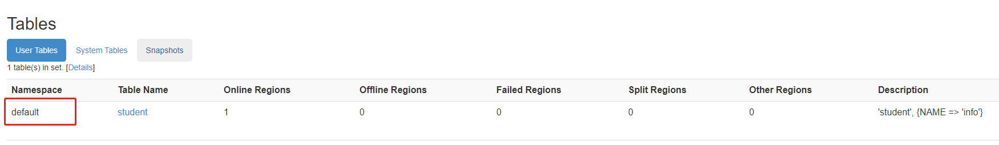

- 重复创建表
  - 同一个命名空间不能创建同名的表

```bash
hbase(main):006:0> create 'student','info'

ERROR: Table already exists: student!

Here is some help for this command:
Creates a table. Pass a table name, and a set of column family
specifications (at least one), and, optionally, table configuration.
Column specification can be a simple string (name), or a dictionary
(dictionaries are described below in main help output), necessarily 
including NAME attribute. 
Examples:

Create a table with namespace=ns1 and table qualifier=t1
  hbase> create 'ns1:t1', {NAME => 'f1', VERSIONS => 5}

Create a table with namespace=default and table qualifier=t1
  hbase> create 't1', {NAME => 'f1'}, {NAME => 'f2'}, {NAME => 'f3'}
  hbase> # The above in shorthand would be the following:
  hbase> create 't1', 'f1', 'f2', 'f3'
  hbase> create 't1', {NAME => 'f1', VERSIONS => 1, TTL => 2592000, BLOCKCACHE => true}
  hbase> create 't1', {NAME => 'f1', CONFIGURATION => {'hbase.hstore.blockingStoreFiles' => '10'}}
  
Table configuration options can be put at the end.
Examples:

  hbase> create 'ns1:t1', 'f1', SPLITS => ['10', '20', '30', '40']
  hbase> create 't1', 'f1', SPLITS => ['10', '20', '30', '40']
  hbase> create 't1', 'f1', SPLITS_FILE => 'splits.txt', OWNER => 'johndoe'
  hbase> create 't1', {NAME => 'f1', VERSIONS => 5}, METADATA => { 'mykey' => 'myvalue' }
  hbase> # Optionally pre-split the table into NUMREGIONS, using
  hbase> # SPLITALGO ("HexStringSplit", "UniformSplit" or classname)
  hbase> create 't1', 'f1', {NUMREGIONS => 15, SPLITALGO => 'HexStringSplit'}
  hbase> create 't1', 'f1', {NUMREGIONS => 15, SPLITALGO => 'HexStringSplit', REGION_REPLICATION => 2, CONFIGURATION => {'hbase.hregion.scan.loadColumnFamiliesOnDemand' => 'true'}}
  hbase> create 't1', {NAME => 'f1', DFS_REPLICATION => 1}

You can also keep around a reference to the created table:

  hbase> t1 = create 't1', 'f1'

Which gives you a reference to the table named 't1', on which you can then
call methods.
```

- 在指定命名空间创建表

```bash
hbase(main):008:0> create 'test:user','info'
0 row(s) in 1.3020 seconds
=> Hbase::Table - test:user
```


- 查看hdfs

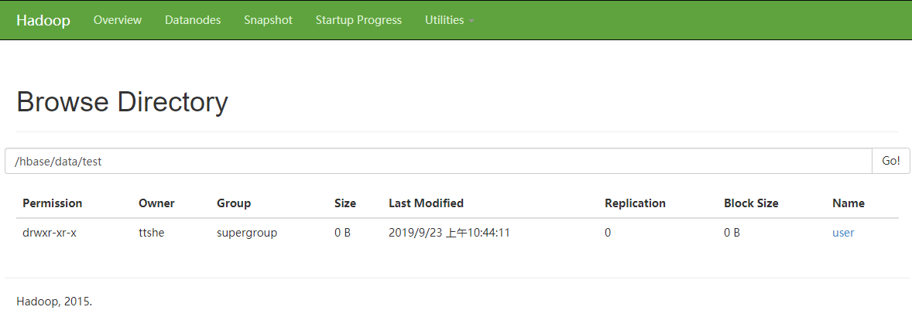


### put

- 新增数据
- 修改数据

- `put <表名>,<rowkey>,<列族:列名称>,<列的值>`

```bash
hbase(main):008:0> put 'student','1001','info:name','zhangsan'
0 row(s) in 0.1940 seconds
hbase(main):004:0> put 'student','1001','info:age','18'
hbase(main):005:0> put 'student','1002','info:name','Janna'
hbase(main):006:0> put 'student','1002','info:sex','female'
hbase(main):007:0> put 'student','1002','info:age','20'
```


### scan

- 扫描查看表数据

```bash
hbase(main):013:0> scan 'student'
ROW                              COLUMN+CELL                                           
 1001                            column=info:age, timestamp=1569157721256, value=18       
 1001                            column=info:name, timestamp=1569157580652,value=zhangsan
 1002                            column=info:age, timestamp=1569157744257, value=20       
 1002                            column=info:name, timestamp=1569157731053, value=Janna   
 1002                            column=info:sex, timestamp=1569157739532, value=female
```

- 按照rowkey进行查询
  - 注意rowkey过滤是字符串比较

```bash
hbase(main):015:0> scan 'student',{STARTROW => '1001', STOPROW  => '1001'}
ROW                              COLUMN+CELL     
 1001                            column=info:age, timestamp=1569157721256, value=18
 1001                            column=info:name, timestamp=1569157580652,value=zhangsan
```

```bash
hbase(main):017:0> scan 'student',{STARTROW => '1002'}
ROW                              COLUMN+CELL
 1002                            column=info:age, timestamp=1569157744257, value=20       
 1002                            column=info:name, timestamp=1569157731053, value=Janna
 1002                            column=info:sex, timestamp=1569157739532, value=female
```


### describe

- 查看表结构

```bash
hbase(main):018:0> describe 'student'
Table student is ENABLED                              
student  
COLUMN FAMILIES DESCRIPTION                          
{NAME => 'info', BLOOMFILTER => 'ROW', VERSIONS => '1', IN_MEMORY => 'false', KEEP_DELETED_CELLS => 'FALSE', DATA_BLOCK_ENCODI
NG => 'NONE', TTL => 'FOREVER', COMPRESSION => 'NONE', MIN_VERSIONS => '0', BLOCKCACHE => 'true', BLOCKSIZE => '65536', REPLIC
ATION_SCOPE => '0'}
```


### get

- 查看“指定行”或“指定列族:列”的数据
  - 列不存在，不报错
  - 列族不存在，报错

```bash
hbase(main):019:0> get 'student','1001'
COLUMN                           CELL
 info:age                        timestamp=1569157721256, value=18
 info:name                       timestamp=1569157580652, value=zhangsan

hbase(main):020:0> get 'student','1001','info:name'
COLUMN                           CELL
 info:name                       timestamp=1569157580652, value=zhangsan

hbase(main):021:0> get 'student','1001','info:name2'
COLUMN                           CELL

hbase(main):022:0> get 'student','1001','info1:name'
COLUMN                           CELL
ERROR: org.apache.hadoop.hbase.regionserver.NoSuchColumnFamilyException: Column family info1 does not exist in region student,,1569156812959.ef591b787b4e0028f796129b13f4d798. in table 'student', {NAME => 'info', BLOOMFILTER => 'ROW', VERSIONS => '1', IN_MEMORY => 'false', KEEP_DELETED_CELLS => 'FALSE', DATA_BLOCK_ENCODING => 'NONE', TTL => 'FOREVER', COMPRESSION => 'NONE', MIN_VERSIONS => '0', BLOCKCACHE => 'true', BLOCKSIZE => '65536', REPLICATION_SCOPE => '0'}
```

```bash
hbase(main):022:0> get 'student','1001',{COLUMN=>'info:name',VERSIONS=>3}
COLUMN                           CELL
 info:name                       timestamp=1569159970828, value=w04
 info:name                       timestamp=1569159965399, value=w03
 info:name                       timestamp=1569159957071, value=w02
```


### count

- 统计表数据行数

```bash
hbase(main):023:0> count 'student'
2 row(s) in 0.0280 seconds
=> 2
```


### alter

- 变更表信息
  - 将info列族中的数据存放3个版本
    - 等价于历史记录
    - 每个cell可以有多个版本

```bash
hbase(main):022:0> alter 'student',{NAME=>'info',VERSIONS=>3}
hbase(main):022:0> get 'student','1001',{COLUMN=>'info:name',VERSIONS=>3}
COLUMN                           CELL
 info:name                       timestamp=1569159970828, value=w04
 info:name                       timestamp=1569159965399, value=w03
 info:name                       timestamp=1569159957071, value=w02
```

- 注意每次put会将最后的一条替换掉，按照时间timestamp判断


### deleteall

- 删除某rowkey的全部数据

```bash
hbase(main):025:0> deleteall 'student','1001'
```


### delete

- 删除某rowkey的某一列数据

```bash
hbase(main):024:0> delete 'student','1001','info:name'
```


### truncate

- 清空表数据
  - 操作顺序为先disable，然后再truncate

```bash
hbase(main):027:0> truncate 'student'
Truncating 'student' table (it may take a while):
 - Disabling table...
 - Truncating table...
0 row(s) in 3.3980 seconds
```


### disable

- 修改表为disable状态

```bash
hbase(main):028:0> disable 'student'
```

```bash
hbase(main):030:0> describe 'student'
Table student is DISABLED
```


### drop

- 首先需要先让该表为disable状态
- 然后才能drop这个表
  - 如果直接drop表，会报错
    - ERROR: Table student is enabled. Disable it first

```bash
hbase(main):031:0> drop 'student'
```


## 命名空间操作


### list_namespace

```bash
hbase(main):006:0> list_namespace
NAMESPACE
default
# 系统表的命名空间
hbase                                                                               
```


### create_namespace

```bash
hbase(main):007:0> create_namespace 'test'
0 row(s) in 0.9880 seconds
```


### drop_namespace

- 当命名空间中有表，则删除会报错

```bash
hbase(main):009:0> drop_namespace 'test'

ERROR: org.apache.hadoop.hbase.constraint.ConstraintException: Only empty namespaces can be removed. Namespace test has 1 tables
```


# 数据结构


## RowKey

- 与nosql数据库们一样,RowKey是用来检索记录的主键
- 访问HBASE table中的行
  - 通过单个RowKey访问
  - 通过RowKey的range（正则）
    - 在初始只有一个Region情况下
    - startKey：负无穷
      - endKey：正无穷
    - 如果有多个Region，则startKey和endKey会再次细分
  - 全表扫描
  
- RowKey行键可以是任意字符串
  - 最大长度是64KB，实际应用中长度一般为 10-100B
- 在HBASE内部RowKey保存为字节数组
  - 存储时，数据按照RowKey的字典序排序存储
    - byte order
    - 升序
  - 设计RowKey时要充分考虑==排序存储==这个特性，将经常一起读取的行存储放到一起
    - 位置相关性


## Column Family

- 列族
  - HBASE表中的每个列，都归属于某个列族
- 列族是表的schema的一部分
  - 列不是
- 必须在使用表之前定义
- 列名都以列族作为前缀
  - 如 courses:history，courses:math都属于courses 这个列族


## Cell

- 由{rowkey, column Family:column,[version]} 唯一确定的单元
- cell中的数据是没有类型的
  - 全部是字节码形式存储
    - 有利于压缩

- 关键字
  - 无类型
  - 字节码


## Time Stamp

- HBASE 中通过rowkey和columns确定的为一个存贮单元称为cell
- 每个 cell都保存着同一份数据的多个版本
  
  - 版本通过时间戳来索引
- 时间戳的类型是 64位整型
- 时间戳可由HBASE在数据写入时自动赋值
  
  - 精确到毫秒的当前系统时间
- 时间戳也可由客户显式赋值
  
  - 如果应用程序要避免数据版本冲突，就必须自己生成具有唯一性的时间戳
- 每个cell中，不同版本的数据按照时间倒序排序

- 为了避免数据存在过多版本的管理负担

  - HBase提供了2种数据版本回收方式
    - 保存数据的最后n个版本
    - 保存最近一段时间内的版本
  - 可以对每个列族进行设置

  

## NameSpace


- Table
  - 表
  - 所有的表都是命名空间的成员
  - 表必属于某个命名空间
    - 如果没有指定，则在default默认的命名空间中

- RegionServer group
  - 一个命名空间包含了默认的RegionServer Group

- Permission
  - 权限
  - 命名空间能够让我们来定义访问控制列表ACL（Access Control List）
    - 如，创建表，读取表，删除，更新等等操作

- Quota
  - 限额
  - 可强制一个命名空间包含的region(表)的数量


# 原理


## 读流程

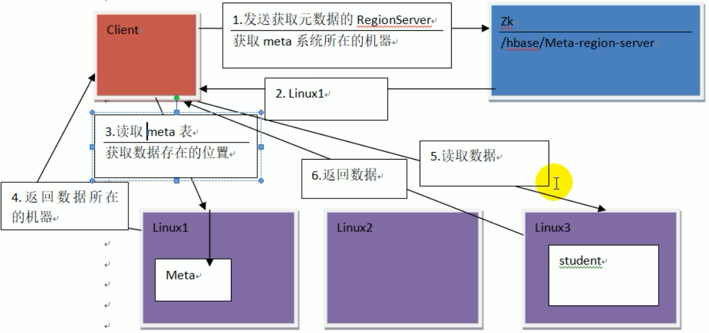

- 查看ZK中meta表存储在哪个节点上

```bash
[zk: localhost:2181(CONNECTED) 4] get /hbase/meta-region-server
�regionserver:16020x�4�4�PBUF
 
	hadoop104�}�ɪ��- 
cZxid = 0x400000161
ctime = Sun Sep 22 20:20:41 CST 2019
mZxid = 0x400000161
mtime = Sun Sep 22 20:20:41 CST 2019
pZxid = 0x400000161
cversion = 0
dataVersion = 0
aclVersion = 0
ephemeralOwner = 0x0
dataLength = 62
numChildren = 0
```

- 查看meta表

```bash
hbase(main):010:0> scan 'hbase:meta'
...
test:user,,1569206651505.71f24d column=info:server, timestamp=1569206652247, value=hadoop102:16020             
 03703097287275bc995f710759.
 test:user,,1569206651505.71f24d column=info:serverstartcode, timestamp=1569206652247, value=1569154835683
 03703097287275bc995f710759.
 ...
```

- 整个读取的流程与HMaster无关，HMaster用于管理RegionServer的

- 第5步读取数据细化
  - 先从MemStore（写缓存）中读取
  - 如果没有再从Region的BlockCache（读缓存）中读取
  - 如果没有再从Store中读取
    - Store中读取后放到BlockCache中
    - 由BlockCache返回


- 小结

  - Client先访问Zookeeper，读取meta表所在region的位置，然后读取meta表中的数据
    - meta中存储了用户表的region信息

  - 根据namespace、表名和rowkey在meta表中找到对应的region信息

  - ==将region位置信息存储在客户端缓存cache中==

  - 找到这个region对应的regionserver

  - 查找对应的region
    - 先从MemStore中查找数据
      - 没有，到BlockCache中读取
    - BlockCache中没有
      - 到StoreFile中读取数据
      - 为了读取的效率
    - ==如果是从StoreFile中读取的数据，不直接返回给客户端，先写入BlockCache中，再返回给客户端==

  - 返回结果给客户端

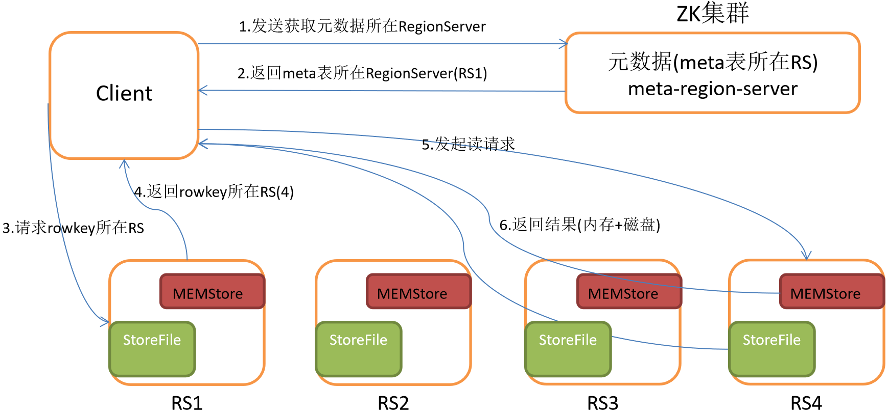


## 写流程

- rowkey的范围


- 写入的速度比读取快
- Client向HregionServer发送写请求
- HregionServer将数据写到HLog
  - write ahead log
  - 为了数据的持久化和恢复
- HregionServer将数据写到内存MemStore
- 将WAL数据落盘同步到HDFS
  - ==若在同步WAL到HDFS过程中发生异常则rollBack==
    - MemStore中的数据会删除
- 反馈Client写成功
- ==MemStore在flush到HDFS的时候回生成一个HFile==
  - MemStore的默认大小是128M，那么生成的HDFS文件大小也是128M
  - 每个StoreFile(含HFile)就是一个列族


## 数据的flush

- 当MemStore 数据到达阈值
  - 默认128M，老版本64M
  - RegionServer会将数据刷到硬盘
  - 将内存中的数据删除
  - 将HLog中的历史数据删除
- 触发参数如下
  - 注意参数配置都在hbase-default.xml中

```bash
# 单个memstore大小
hbase.hregion.memstore.flush.size=134217728(128M)
# server角度出发，全部memstore大小，堆内存的40%，所有的memstore的总大小，如果超过了，则会写入阻塞
hbase.regionserver.global.memstore.size=0.4
# server角度出发，全部的memstore大小在heap内存的40%的95%的时候(0.38)，可以再次写入
hbase.regionserver.global.memstore.size.lower.limit=0.95
# 内存中的文件自动刷新之前可以存活的时间，默认1h 
hbase.regionserver.optionalcacheflushinterval=3600000
# region的角度出发，memstore超过4*128，则flush
hbase.hregion.memstore.block.multiplie=4
```

- 并将数据存储到HDFS中

- 在HLog中做标记点

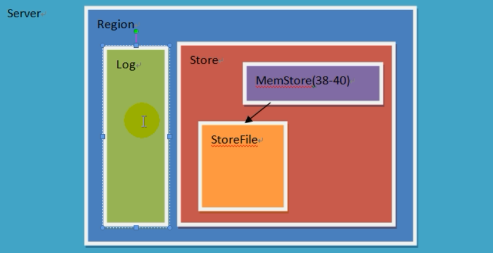

- WAL，预写日志HLog达到阈值，也会出发memstore的flush


## 数据的合并

- 当数据文件达到一定个数，Hmaster触发合并操作，Region将数据块加载到本地，进行合并
- 一个store中可存的hfile的个数有限，超过一定个数会被写到新的一个hfile里面
- 每个region的每个列族对应的memstore在flush为hfile的时候
  - 默认情况3个hfile的时候就会这些文件进行合并重写为一个新文件
  - 设置个数越大可以减少触发合并的时间，但是每次合并的时间就会越长 

```bash
# 不足3个超过7天也进行合并，一般不设置该值，进行手动合并
hbase.hregion.majorcompaction=604800000(7天)
# 当一个列族的store中的hfile个数超过3个，则会出发合并
hbase.hstore.compactionThreshold=3
```


## 数据的拆分

- 当合并的数据超过256M，进行Region拆分
  - 拆分后的Region分配给不同的HregionServer管理
  - 将HregionServer上的hlog拆分分配给不同的HregionServer加载，修改META表内容
- 注意：HLog会同步到HDFS


- 拆分策略
  - 不同版本的拆分策略不一样

```bash
hbase.regionserver.region.split.policy=org.apache.hadoop.hbase.regionserver.IncreasingToUpperBoundRegionSplitPolicy
#HStoreFile最大的大小，当某个region的某个列族超过这个大小会进行region拆分
#默认值10G
hbase.hregion.max.filesize=10737418240
```

- 查看源码分析
  - 在idea添加相应的hbase-server和hbase-client的依赖

```java
shouldSplit()
	// 表中Region的个数
    int tableRegionsCount = getCountOfCommonTableRegions();
    // Get size to check
    // 获取要检查的大小
    long sizeToCheck = getSizeToCheck(tableRegionsCount);
    	// 10G 当tableRegionsCount == 0 || tableRegionsCount > 100
    	getDesiredMaxFileSize
        // 当前是当tableRegionsCount == 1 设置的值小于10G的值如下
        Math.min(getDesiredMaxFileSize(),initialSize * tableRegionsCount * tableRegionsCount * tableRegionsCount)
          	initialSize = 2 * conf.getLong(HConstants.HREGION_MEMSTORE_FLUSH_SIZE,HTableDescriptor.DEFAULT_MEMSTORE_FLUSH_SIZE);

//HREGION_MEMSTORE_FLUSH_SIZE 该值是在hbase-default.xml中配置的hbase.hregion.memstore.flush.size的大小，默认128M
```

- 第一次hfile大小超过256M时进行拆分，第二次tableRegionsCount值为2，那么sizeToCheck=256M*8
  - 每次sizeToCheck是变化的
- 拆分涉及到rowKey的拆分


# API 操作


## pom

```xml
<dependency>
    <groupId>org.apache.hbase</groupId>
    <artifactId>hbase-server</artifactId>
    <version>1.3.1</version>
</dependency>

<dependency>
    <groupId>org.apache.hbase</groupId>
    <artifactId>hbase-client</artifactId>
    <version>1.3.1</version>
</dependency>
```

- 类的命名空间

```java
import org.apache.hadoop.conf.Configuration;
import org.apache.hadoop.hbase.HBaseConfiguration;
import org.apache.hadoop.hbase.TableName;
import org.apache.hadoop.hbase.client.Admin;
import org.apache.hadoop.hbase.client.Connection;
import org.apache.hadoop.hbase.client.ConnectionFactory;
```


## 获取配置对象

- 方式1

```java
// 获取配置对象
public static Configuration config = HBaseConfiguration.create();

static {
    // 配置
    config.set("hbase.zookeeper.quorum","hadoop102");
    config.set("hbase.zookeeper.property.clientPort","2181");
}
```

- 分析源码`HBaseConfiguration.create()`

```java
public static Configuration create() {
    Configuration conf = new Configuration();
    // In case HBaseConfiguration is loaded from a different classloader than
    // Configuration, conf needs to be set with appropriate class loader to resolve
    // HBase resources.
    // 这里使用当前类的类加载器，为了后面加载配置文件做准备
    conf.setClassLoader(HBaseConfiguration.class.getClassLoader());
    return addHbaseResources(conf);
}

// 说明在resource中添加hbase-site.xml，就可以进行参数的配置读取，不用在代码中书写
public static Configuration addHbaseResources(Configuration conf) {
    conf.addResource("hbase-default.xml");
    conf.addResource("hbase-site.xml");

    checkDefaultsVersion(conf);
    HeapMemorySizeUtil.checkForClusterFreeMemoryLimit(conf);
    return conf;
}
```

- 方式2
  - 在resource中添加hbase-site.xml配置

```xml
<?xml version="1.0"?>
<?xml-stylesheet type="text/xsl" href="configuration.xsl"?>
<configuration>
    <property>     
        <name>hbase.rootdir</name>     
        <value>hdfs://hadoop102:9000/hbase</value>               
    </property>

    <property>   
        <name>hbase.cluster.distributed</name>
        <value>true</value>
    </property>

    <!-- 0.98后的新变动，之前版本没有.port,默认端口为60000 -->
    <property>
        <name>hbase.master.port</name>
        <value>16000</value>
    </property>

    <property>
        <name>hbase.zookeeper.quorum</name>
        <value>hadoop102:2181,hadoop103:2181,hadoop104:2181</value>
    </property>

    <property>   
        <name>hbase.zookeeper.property.dataDir</name>
        <value>/opt/module/zookeeper-3.4.5/zkData</value>
    </property>
</configuration>
```

```java
// 直接声明对象即可，不需要配置参数
public static Configuration config = HBaseConfiguration.create();
```


## 获取连接对象

```java
public static Configuration config = HBaseConfiguration.create();
public static ThreadLocal<Admin> adminThreadLocal = new ThreadLocal<>();
public static ThreadLocal<Connection> connThreadLocal = new ThreadLocal<>();

public static Connection getConnection() throws IOException {
    Connection connection = connThreadLocal.get();
    if(connection == null){
        // 建立连接
        connection = ConnectionFactory.createConnection(config);
        connThreadLocal.set(connection);
    }
    return connection;
}

public static Admin getAdmin() throws IOException {
    Admin admin = adminThreadLocal.get();
    if (admin == null){
        // 建立连接,过期的
        // HBaseAdmin admin = new HBaseAdmin(config);
        // 获取admin对象
        admin = getConnection().getAdmin();
        adminThreadLocal.set(admin);
    }
    return admin;
}

public static void close() throws IOException {
    Admin admin = adminThreadLocal.get();
    if(admin != null){
        admin.close();
        adminThreadLocal.remove();
        connThreadLocal.remove();
    }
}
```


## 判断命名空间是否存在

```java
public static boolean isNamespaceExists(String namespaceName){
    try{
        getAdmin().getNamespaceDescriptor(namespaceName);
        return true;
    } catch (NamespaceNotFoundException e) {
        return false;
    } catch (IOException e) {
        throw new RuntimeException(e);
    }
}
```


## 创建命名空间

```java
public static void createNamespace(String namespaceName) throws IOException {
    if(isNamespaceExists(namespaceName)){
        System.out.println("命名空间已存在");
        return;
    }
    getAdmin().createNamespace(
        NamespaceDescriptor
        .create(namespaceName)
        // 添加额外信息
        .addConfiguration("author","stt")
        .build());
}
```


## 判断表是否存在

```java
private static boolean isTableExists(String tableName) throws IOException {
    Admin admin = getAdmin();
    return admin.tableExists(TableName.valueOf(tableName));
}
```

- 测试

```java
public static void main(String[] args) throws Exception {
    String tableName = "student";
    boolean isExists = isTableExists("student");
    // 可以指定命名空间判断
    boolean isExists2 = isTableExists("test:user");
    System.out.println(isExists);
    System.out.println(isExists2);
    // 关闭资源
    close();
}
```


## 创建表

```java
public static void createTable(String tableName,String columnFamily,String ... columnFamilies) throws IOException {
    if(isTableExists(tableName)){
        System.out.println("表已经存在");
        return;
    }
    Admin admin = getAdmin();
    // 获取表格描述器
    HTableDescriptor hTableDescriptor = 
        new HTableDescriptor(TableName.valueOf(tableName));

    // 列族描述器
    HColumnDescriptor family = new HColumnDescriptor(columnFamily);
    // 添加列族
    hTableDescriptor.addFamily(family);
    for (String column : columnFamilies) {
        HColumnDescriptor f = new HColumnDescriptor(column);
        hTableDescriptor.addFamily(f);
    }
    admin.createTable(hTableDescriptor);
}
```

- 测试

```java
public static void main(String[] args) throws Exception {
    createTable("test:createUser","info");
    close();
}
```


## 删除表

```java
public static void dropTable(String tableName) throws IOException {
    if(isTableExists(tableName)){
        Admin admin = getAdmin();
        admin.disableTable(TableName.valueOf(tableName));
        admin.deleteTable(TableName.valueOf(tableName));
    }
}
```

- 测试

```java
public static void main(String[] args) throws Exception {
    dropTable("test:createUser");
    close();
}
```


## 向表中插入数据

- 获取表对象进行操作

```java
public static void addOrUpdateData(String tableName,String rowKey,String family,String column,String value) throws IOException {
    Table table = getConnection().getTable(TableName.valueOf(tableName));

    Put val = new Put(Bytes.toBytes(rowKey))
        .addColumn(Bytes.toBytes(family),Bytes.toBytes(column),Bytes.toBytes(value));
    // 增加数据
    table.put(val);
    // 关闭表格
    table.close();
}
```

- 测试

```java
public static void main(String[] args) throws Exception {
    addOrUpdateData("test:user","1002","info","name","stt");
    close();
}
```


## 删除表中数据

- addColumn删除最新一条记录
  - 本质上添加一条记录，timestamp不变，type=Delete
- addColumns删除所有记录
  - 添加一条记录，type=DeleteColumn
- 注意：
  - 查询是按照timestamp进行倒叙的，timestamp在前的会被查出来
    - 如果一条记录的timestamp的值比type=DeleteColumn记录的timestamp要大，那么会被显示出来

```java
public static void deleteData(String tableName,String rowKey,String family,String column) throws IOException {

    Table table = getConnection().getTable(TableName.valueOf(tableName));
    Delete val = new Delete(Bytes.toBytes(rowKey));

    if(!StringUtils.isBlank(family)){
        if(StringUtils.isBlank(column)){
            val.addFamily(Bytes.toBytes(family));
        }else{
            val.addColumn(Bytes.toBytes(family), Bytes.toBytes(column));
        }
    }

    table.delete(val);
    table.close();
}

public static void deleteRowData(String tableName,String rowKey) throws IOException {
    deleteData(tableName,rowKey,null,null);
}

public static void deleteMultiRowData(String tableName,String ... rowKeys) throws IOException {
    Table table = getConnection().getTable(TableName.valueOf(tableName));
    List<Delete> val = new ArrayList<>();
    for (String rowKey : rowKeys) {
        val.add(new Delete(Bytes.toBytes(rowKey)));
    }
    table.delete(val);
    table.close();
}
```

- 测试

```java
public static void main(String[] args) throws Exception {
    //		addOrUpdateData("test:user","1004","info","name","stt");
    //		addOrUpdateData("test:user","1004","info","age","11");

    //		deleteData("test:user","1004","info","name");
    //		deleteData("test:user","1004","info","age");
    deleteRowData("test:user","1003");
    close();
}
```


## 查询所有数据

```java
public static void getAllData(String tableName) throws IOException {
    Table table = getConnection().getTable(TableName.valueOf(tableName));
    // 全表扫描
    Scan scan = new Scan();
    // 获取结果
    ResultScanner scanner = table.getScanner(scan);
    for (Result result : scanner) {
        Cell[] cells = result.rawCells();
        for (Cell cell : cells) {
            String family = Bytes.toString(CellUtil.cloneFamily(cell));
            String column = Bytes.toString(CellUtil.cloneQualifier(cell));
            String rowKey = Bytes.toString(CellUtil.cloneRow(cell));
            String val = Bytes.toString(CellUtil.cloneValue(cell));
            System.out.println(family+":"+column+":"+rowKey+":"+val);
        }
    }
}
```


## 查询指定行数据

```java
public static void getRowData(String tableName,String rowKey) throws IOException {
    Table table = getConnection().getTable(TableName.valueOf(tableName));
    Get get = new Get(Bytes.toBytes(rowKey));
    //		get.setMaxVersions(); 设置显示所有版本
    //		get.setTimeStamp(); 设置显示指定的时间戳版本
    Result result = table.get(get);
    Cell[] cells = result.rawCells();
    for (Cell cell : cells) {
        String family = Bytes.toString(CellUtil.cloneFamily(cell));
        String column = Bytes.toString(CellUtil.cloneQualifier(cell));
        String val = Bytes.toString(CellUtil.cloneValue(cell));
        System.out.println(family+":"+column+":"+rowKey+":"+val);
    }
}
```


## 获取指定行指定列族:列的数据

```java
public static void getRowQualifier(String tableName,String rowKey,String family,String qualifier) throws IOException {
    Table table = getConnection().getTable(TableName.valueOf(tableName));

    Get get = new Get(Bytes.toBytes(rowKey));
    get.addColumn(Bytes.toBytes(family),Bytes.toBytes(qualifier));

    Result result = table.get(get);
    Cell[] cells = result.rawCells();
    for (Cell cell : cells) {
        String column = Bytes.toString(CellUtil.cloneQualifier(cell));
        String val = Bytes.toString(CellUtil.cloneValue(cell));
        System.out.println(family+":"+column+":"+rowKey+":"+val);
    }
}
```


# MR 操作

- 通过HBase的相关JavaAPI可以实现伴随HBase操作的MapReduce过程
  - 使用MapReduce将数据从本地文件系统导入到HBase的表中
  - 从HBase中读取一些原始数据后使用MapReduce做数据分析


## 环境配置

- 查看HBase的MapReduce任务的执行
  - MR如果要执行HBase中的相关命令，需要如下的jar包配置

```bash
[ttshe@hadoop102 hbase]$ bin/hbase mapredcp

SLF4J: Class path contains multiple SLF4J bindings.
SLF4J: Found binding in [jar:file:/opt/module/hbase/lib/slf4j-log4j12-1.7.5.jar!/org/slf4j/impl/StaticLoggerBinder.class]
SLF4J: Found binding in [jar:file:/opt/module/hadoop-2.7.2/share/hadoop/common/lib/slf4j-log4j12-1.7.10.jar!/org/slf4j/impl/StaticLoggerBinder.class]
SLF4J: See http://www.slf4j.org/codes.html#multiple_bindings for an explanation.
SLF4J: Actual binding is of type [org.slf4j.impl.Log4jLoggerFactory]
/opt/module/hbase/lib/zookeeper-3.4.6.jar:/opt/module/hbase/lib/netty-all-4.0.23.Final.jar:/opt/module/hbase/lib/hbase-client-1.3.1.jar:/opt/module/hbase/lib/metrics-core-2.2.0.jar:/opt/module/hbase/lib/hbase-prefix-tree-1.3.1.jar:/opt/module/hbase/lib/hbase-common-1.3.1.jar:/opt/module/hbase/lib/protobuf-java-2.5.0.jar:/opt/module/hbase/lib/guava-12.0.1.jar:/opt/module/hbase/lib/htrace-core-3.1.0-incubating.jar:/opt/module/hbase/lib/hbase-protocol-1.3.1.jar:/opt/module/hbase/lib/hbase-hadoop-compat-1.3.1.jar:/opt/module/hbase/lib/hbase-server-1.3.1.jar
```


### 临时配置

- 执行环境变量的导入
- 临时生效，在命令行执行下述操作
- 在执行MR命令前，先键入如下命令，此次生效

```bash
$ export HBASE_HOME=/opt/module/hbase
$ export HADOOP_HOME=/opt/module/hadoop-2.7.2
$ export HADOOP_CLASSPATH=`${HBASE_HOME}/bin/hbase mapredcp`
```


### 永久配置

- 修改/etc/profile，添加如下配置
  - 修改完成后注意执行`source  /etc/profile`

```bash
export HBASE_HOME=/opt/module/hbase
export HADOOP_HOME=/opt/module/hadoop-2.7.2
```

- 修改`hadoop-env.sh`添加如下配置
  - 注意在for循环之后
  - 同步一下xsync

```bash
[ttshe@hadoop102 hadoop]$ pwd
/opt/module/hadoop-2.7.2/etc/hadoop
[ttshe@hadoop102 hadoop]$ vim hadoop-env.sh 

export HADOOP_CLASSPATH=$HADOOP_CLASSPATH:/opt/module/hbase/lib/*
```


## 示例


### 官方示例


**统计Student表中有多少行数据**

```bash
[ttshe@hadoop102 hadoop]$ /opt/module/hadoop-2.7.2/bin/yarn jar /opt/module/hbase/lib/hbase-server-1.3.1.jar rowcounter student
# 两个命令效果一样
[ttshe@hadoop102 hadoop]$ hadoop jar /opt/module/hbase/lib/hbase-server-1.3.1.jar rowcounter student
...
org.apache.hadoop.hbase.mapreduce.RowCounter$RowCounterMapper$Counters
ROWS=1
...
```


**使用MapReduce将本地数据导入到HBase**

- 在本地创建一个tsv格式的文件
  - csv用`,` 分隔
  - tsv用`tab`分隔
- 文件格式如下（fruit.tsv）

```bash
1001	Apple	Red
1002	Pear	Yellow
1003	Pineapple	Yellow
```

- 创建HBase表

```bash
hbase(main):025:0> create 'fruit','info'
```

- 在HDFS中创建input_fruit文件夹并上传fruit.tsv文件

```bash
[ttshe@hadoop102 module]$ hadoop fs -mkdir /input_fruit/
[ttshe@hadoop102 module]$ hadoop fs -put /opt/module/datas/fruit.tsv /input_fruit/
```

- 导入到HBase
  - `Dimporttsv.columns` 指示了列的定义

```bash
[ttshe@hadoop102 module]$ hadoop jar /opt/module/hbase/lib/hbase-server-1.3.1.jar importtsv -Dimporttsv.columns=HBASE_ROW_KEY,info:name,info:color fruit hdfs://hadoop102:9000/input_fruit
```

- 查询HBase

```bash
hbase(main):027:0> scan 'fruit'
```


### 自定义MR1

- hbase数据 --> hbase数据

- 将fruit表中的一部分数据，通过MR迁入到fruit_mr表中
  - 创建fruit_mr表

```bash
create 'fruit_mr','info'
```

- 构建ReadDataMapper类，用于读取fruit表中的数

```java
package com.stt.demo.hbase.Ch02_mr01;

import org.apache.hadoop.hbase.Cell;
import org.apache.hadoop.hbase.CellUtil;
import org.apache.hadoop.hbase.client.Put;
import org.apache.hadoop.hbase.client.Result;
import org.apache.hadoop.hbase.io.ImmutableBytesWritable;
import org.apache.hadoop.hbase.mapreduce.TableMapper;
import org.apache.hadoop.hbase.util.Bytes;

import java.io.IOException;

public class ReadDataMapper extends TableMapper<ImmutableBytesWritable,Put> {

	@Override
	protected void map(ImmutableBytesWritable key, Result value, Context context) throws IOException, InterruptedException {
		// 获取rowKey
		byte[] rowKey = key.get();
		// 定义Put
		Put put = new Put(rowKey);
		// 将fruit中name和color进行提取，将每一行数据提出出来放入Put中
		for (Cell cell : value.rawCells()) {
			// 判断列族是需要的info中的name和color，其他的过滤
			if("info".equals(Bytes.toString(CellUtil.cloneFamily(cell)))){
				if("name".equals(Bytes.toString(CellUtil.cloneQualifier(cell)))){
					put.add(cell);
				}
				if("color".equals(Bytes.toString(CellUtil.cloneQualifier(cell)))){
					put.add(cell);
				}
			}
			put.add(cell);
		}
		// 将从fruit读取的数据的每一行写入到context中作为map的输出
		if(!put.isEmpty()){
			context.write(key,put);
		}
	}
}
```

- 构建WriteDataReducer类，用于将读取到的fruit表中的数据写入到fruit_mr表中

```java
package com.stt.demo.hbase.Ch02_mr01;

import org.apache.hadoop.hbase.client.Put;
import org.apache.hadoop.hbase.io.ImmutableBytesWritable;
import org.apache.hadoop.hbase.mapreduce.TableReducer;
import org.apache.hadoop.io.NullWritable;

import java.io.IOException;

public class WriteDataReducer extends TableReducer<ImmutableBytesWritable,Put,NullWritable> {

	@Override
	protected void reduce(ImmutableBytesWritable key, Iterable<Put> values, Context context) throws IOException, InterruptedException {
		// 读出来的每一行数据写入到fruit_mr表中
		for (Put value : values) {
			context.write(NullWritable.get(),value);
		}
	}
}
```

- 构建DriverTool用于组装运行Job任务

```java
package com.stt.demo.hbase.Ch02_mr01;

import org.apache.hadoop.conf.Configuration;
import org.apache.hadoop.hbase.client.Put;
import org.apache.hadoop.hbase.client.Scan;
import org.apache.hadoop.hbase.io.ImmutableBytesWritable;
import org.apache.hadoop.hbase.mapreduce.TableMapReduceUtil;
import org.apache.hadoop.mapreduce.Job;
import org.apache.hadoop.util.Tool;
import org.apache.hadoop.util.ToolRunner;

public class DriverTool extends Configuration implements Tool{

	private Configuration conf;

	@Override
	public int run(String[] args) throws Exception {
		Job job = Job.getInstance(getConf());
		// 设置当前jar包通过那个类读取
		job.setJarByClass(DriverTool.class);
		// 至少1个
		job.setNumReduceTasks(1);
		// 配置Scan
		Scan scan = new Scan().setCacheBlocks(false).setCaching(500);
		// 设置Mapper，注意导入的是mapreduce包下的，不是mapred包下的，后者是老版本
		TableMapReduceUtil.initTableMapperJob(
				"fruit",// 数据源表名
				scan,
				ReadDataMapper.class,
				ImmutableBytesWritable.class, // Mapper的输出Key
				Put.class,// Mapper的输出value
				job
		);
		// 设置reducer
		TableMapReduceUtil.initTableReducerJob(
				"fruit_mr",// 目标的表名
				WriteDataReducer.class,
				job
		);
		return job.waitForCompletion(true) ? 0 : 1;
	}
	@Override
	public void setConf(Configuration conf) {
		this.conf = conf;
	}
	@Override
	public Configuration getConf() {
		return this.conf;
	}
	public static void main(String[] args) throws Exception {
		System.exit(ToolRunner.run(new DriverTool(), args));
	}
}
```

- 打包运行任务
- 注意：将jar依赖的其他jar包可以让hadoop识别到，依赖的jar可以和执行的jar包放在一个文件夹下
  - maven打包
    - 命令：-P local clean package或-P dev clean package install
    - 将第三方jar包一同打包，需要插件：maven-shade-plugin
  - 也可以使用如下方式打包
    - 然后点击ok
    - 点击build--> build artifacts
    
- 执行
```bash
[ttshe@hadoop102 module]$ hadoop jar /opt/module/datas/big-data-0.0.1.jar com.stt.demo.hbase.Ch02_mr01.DriverTool
```


### 自定义MR2

- hdfs 数据->hbase 数据

- hdfs的数据是tsv，使用`tab` 进行分割

```txt
1001	Apple	Red
1002	Pear	Yellow
1003	Pineapple	Yellow
```

- mapper

```java
package com.stt.demo.hbase.Ch02_mr02;

import org.apache.hadoop.hbase.client.Put;
import org.apache.hadoop.hbase.io.ImmutableBytesWritable;
import org.apache.hadoop.hbase.util.Bytes;
import org.apache.hadoop.io.LongWritable;
import org.apache.hadoop.io.Text;
import org.apache.hadoop.mapreduce.Mapper;
import java.io.IOException;

public class ReadDataMapper extends Mapper<LongWritable,Text,ImmutableBytesWritable,Put> {
	@Override
	protected void map(LongWritable key, Text value, Context context) throws IOException, InterruptedException {

		String[] split = value.toString().split("\t");
		byte[] rowKeyByte=Bytes.toBytes(split[0]);
		byte[] family = Bytes.toBytes("info");
		byte[] name = Bytes.toBytes("name");
		byte[] color = Bytes.toBytes("color");
		byte[] nameVal = Bytes.toBytes(split[1]);
		byte[] colorVal = Bytes.toBytes(split[2]);
		Put put = new Put(rowKeyByte)
				.addColumn(family,name,nameVal)
				.addColumn(family,color,colorVal);

		ImmutableBytesWritable rowKey = new ImmutableBytesWritable(rowKeyByte);
		context.write(rowKey,put);
	}
}
```

- reducer

```java
package com.stt.demo.hbase.Ch02_mr02;

import org.apache.hadoop.hbase.client.Put;
import org.apache.hadoop.hbase.io.ImmutableBytesWritable;
import org.apache.hadoop.hbase.mapreduce.TableReducer;
import org.apache.hadoop.io.NullWritable;
import java.io.IOException;

public class WriteDataReducer extends TableReducer<ImmutableBytesWritable,Put,NullWritable> {

	@Override
	protected void reduce(ImmutableBytesWritable key, Iterable<Put> values, Context context) throws IOException, InterruptedException {
		// 读出来的每一行数据写入到fruit_mr表中
		for (Put value : values) {
			context.write(NullWritable.get(),value);
		}
	}
}
```

- driver

```java
package com.stt.demo.hbase.Ch02_mr02;

import org.apache.hadoop.conf.Configuration;
import org.apache.hadoop.fs.FileSystem;
import org.apache.hadoop.fs.Path;
import org.apache.hadoop.hbase.client.Put;
import org.apache.hadoop.hbase.io.ImmutableBytesWritable;
import org.apache.hadoop.hbase.mapreduce.TableMapReduceUtil;
import org.apache.hadoop.mapreduce.Job;
import org.apache.hadoop.mapreduce.lib.input.FileInputFormat;
import org.apache.hadoop.util.Tool;
import org.apache.hadoop.util.ToolRunner;

import java.io.IOException;

public class DriverTool extends Configuration implements Tool{

	private Configuration conf;

	@Override
	public int run(String[] args) throws Exception {
		getConf().set("inputpath",args[0]);

		Job job = Job.getInstance(getConf());
		// 设置当前jar包通过那个类读取
		job.setJarByClass(DriverTool.class);
		// 至少1个
		job.setNumReduceTasks(1);

		// 设置Mapper
		job.setMapperClass(ReadDataMapper.class);
		job.setMapOutputKeyClass(ImmutableBytesWritable.class);
		job.setMapOutputValueClass(Put.class);

		// 设置reducer
		TableMapReduceUtil.initTableReducerJob(
				"fruit_mr",// 目标的表名
				WriteDataReducer.class,
				job
		);

		initJobInputPath(job);

		return job.waitForCompletion(true) ? 0 : 1;
	}

	private void initJobInputPath(Job job) throws IOException {

		Configuration conf = job.getConfiguration();

		// 对输入路径进行判断是否存在，不存在抛出异常
		FileSystem fs = FileSystem.get(conf);
		String inputPathStr = conf.get("inputpath");
		Path in = new Path(inputPathStr);
		if(!fs.exists(in)){
			throw new RuntimeException(inputPathStr + " is not exists");
		}
		FileInputFormat.addInputPath(job,in);
	}

	@Override
	public void setConf(Configuration conf) {
		this.conf = conf;
	}

	@Override
	public Configuration getConf() {
		return this.conf;
	}

	public static void main(String[] args) throws Exception {
		System.exit(ToolRunner.run(new DriverTool(), args));
	}
}
```

- 打包执行

```bash
[ttshe@hadoop102 module]$ hadoop jar /opt/module/datas/big-data-0.0.4.jar com.stt.demo.hbase.Ch02_mr02.DriverTool /input_fruit/
```


# 与Hive集成


## HBase 与Hive对比

- Hive
  - 数据仓库
    - Hive的本质其实就相当于将HDFS中已经存储的文件在Mysql中做了一个双射关系
    - 使用HQL去管理查询
  - 用于数据分析、清洗
    - Hive适用于离线的数据分析和清洗
  - 延迟较高
  - 基于HDFS、MapReduce
    - Hive存储的数据依旧在DataNode上
    - 编写的HQL语句终将是转换为MapReduce代码执行

- HBase
  - 数据库
    - 是一种面向列存储的非关系型数据库
  - 用于存储结构化和非结构化的数据
    - 适用于单表非关系型数据的存储
    - 不适合做关联查询，类似JOIN等操作
  - 基于HDFS
    - 数据持久化存储的体现形式是Hfile，存放于DataNode中，被ResionServer以region的形式进行管理
  - 延迟较低
    - 接入在线业务使用
    - 面对大量的企业数据，HBase可以直线单表大量数据的存储
    - 提供了高效的数据访问速度。


## HBase与Hive集成使用

- Hive和HBase建立双向连接，Hive创建的表导入数据会生成HBase的表，反之也是

  

### 编译jar包

- HBase与Hive的集成在最新的两个版本中无法兼容
- 可能需要重新编译 hive-hbase-handler-1.2.1.jar
- 创建hive-compile的java工程

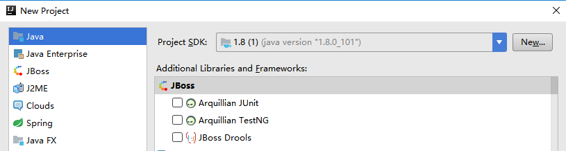

  - 拷贝\apache-hive-1.2.1-src\hbase-handler\src\java\org源码到java工程中
  - 由于缺少依赖的jar包，从hive/lib中拷贝，添加依赖

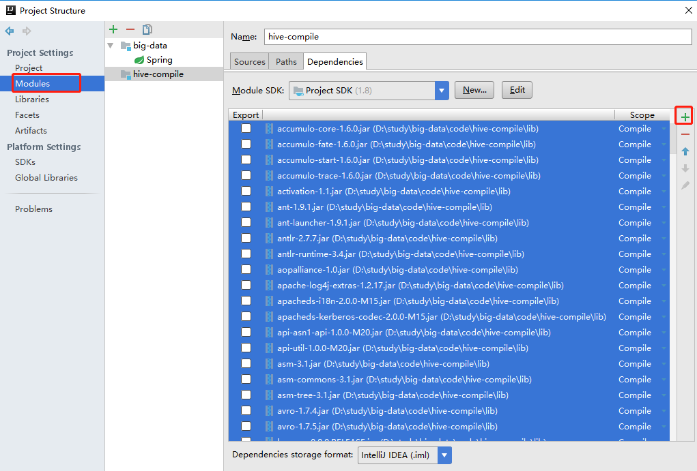

- 打包


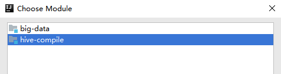

- 点击OK
- 点击Build-->Build Artifacts


- 上传编译好的`hive-hbase-handler-1.2.1.jar`上传替换hive/lib下相同的jar包即可

  

### 环境准备

- 后续可能会在操作Hive的同时对HBase也会产生影响，Hive需要持有操作HBase的Jar
  - 拷贝Hive所依赖的Jar包
  - 或者使用软连接的形式

- 输入如下命令，生成软链接
  - 查看hive的lib中可以看到软链接生成

```bash
export HBASE_HOME=/opt/module/hbase
export HIVE_HOME=/opt/module/hive

ln -s $HBASE_HOME/lib/hbase-common-1.3.1.jar  $HIVE_HOME/lib/hbase-common-1.3.1.jar
ln -s $HBASE_HOME/lib/hbase-server-1.3.1.jar $HIVE_HOME/lib/hbase-server-1.3.1.jar
ln -s $HBASE_HOME/lib/hbase-client-1.3.1.jar $HIVE_HOME/lib/hbase-client-1.3.1.jar
ln -s $HBASE_HOME/lib/hbase-protocol-1.3.1.jar $HIVE_HOME/lib/hbase-protocol-1.3.1.jar
ln -s $HBASE_HOME/lib/hbase-it-1.3.1.jar $HIVE_HOME/lib/hbase-it-1.3.1.jar
ln -s $HBASE_HOME/lib/htrace-core-3.1.0-incubating.jar $HIVE_HOME/lib/htrace-core-3.1.0-incubating.jar
ln -s $HBASE_HOME/lib/hbase-hadoop2-compat-1.3.1.jar $HIVE_HOME/lib/hbase-hadoop2-compat-1.3.1.jar
ln -s $HBASE_HOME/lib/hbase-hadoop-compat-1.3.1.jar $HIVE_HOME/lib/hbase-hadoop-compat-1.3.1.jar
```

- 配置`hive-site.xml`
  - 修改zookeeper的属性

```xml
<property>
    <name>hive.zookeeper.quorum</name>
    <value>hadoop102,hadoop103,hadoop104</value>
    <description>The list of ZooKeeper servers to talk to. This is only needed for read/write locks.</description>
</property>
<property>
    <name>hive.zookeeper.client.port</name>
    <value>2181</value>
    <description>The port of ZooKeeper servers to talk to. This is only needed for read/write locks.</description>
</property>
```


### 示例1

- 建立Hive表，关联HBase表，插入数据到Hive表的同时能够影响HBase表
- 在Hive中创建表同时关联HBase
  - stored表示存储方式
  - :key表示rowkey

```sql
CREATE TABLE hive_hbase_emp_table(
empno int,
ename string,
job string,
mgr int,
hiredate string,
sal double,
comm double,
deptno int)
STORED BY 'org.apache.hadoop.hive.hbase.HBaseStorageHandler'
WITH SERDEPROPERTIES ("hbase.columns.mapping" = ":key,info:ename,info:job,info:mgr,info:hiredate,info:sal,info:comm,info:deptno")
TBLPROPERTIES ("hbase.table.name" = "hbase_emp_table");
```

- 完成之后，可以分别进入Hive和HBase查看，都生成了对应的表

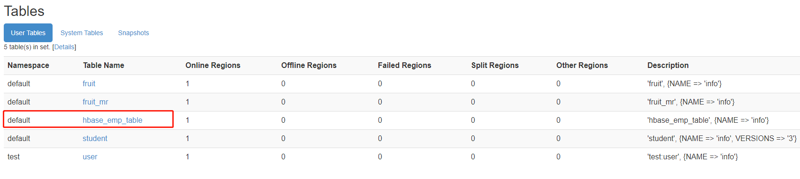

```bash
hive (default)> show tables;
OK
tab_name
hive_hbase_emp_table
```

- 在Hive中创建临时中间表，用于load文件中的数据
  - 不能将数据直接load进Hive所关联HBase的那张表中

```sql
CREATE TABLE emp(
empno int,
ename string,
job string,
mgr int,
hiredate string,
sal double,
comm double,
deptno int)
row format delimited fields terminated by '\t';
```

- load数据

```bash
hive> load data local inpath '/opt/module/datas/emp.txt' into table emp;
```

```text
7369	SMITH	CLERK	7902	1980-12-17	800.00		20
7499	ALLEN	SALESMAN	7698	1981-2-20	1600.00	300.00	30
7521	WARD	SALESMAN	7698	1981-2-22	1250.00	500.00	30
7566	JONES	MANAGER	7839	1981-4-2	2975.00		20
7654	MARTIN	SALESMAN	7698	1981-9-28	1250.00	1400.00	30
7698	BLAKE	MANAGER	7839	1981-5-1	2850.00		30
7782	CLARK	MANAGER	7839	1981-6-9	2450.00		10
```

- insert数据到hive，到hbase中
  - 通过insert命令将中间表中的数据导入到Hive关联HBase的那张表中

```bash
hive> insert into table hive_hbase_emp_table select * from emp;
```

- 查看Hive以及关联的HBase表中是否已经成功的同步插入了数据

```sql
hive (default)> select * from hive_hbase_emp_table;
OK
hive_hbase_emp_table.empno	hive_hbase_emp_table.ename	hive_hbase_emp_table.job	hive_hbase_emp_table.mgr	hive_hbase_emp_table.hiredate	hive_hbase_emp_table.sal	hive_hbase_emp_table.comm	hive_hbase_emp_table.deptno
7369	SMITH	CLERK	7902	1980-12-17	800.0	NULL	20
7499	ALLEN	SALESMAN	7698	1981-2-20	1600.0	300.0	30
...
```

```bash
hbase> scan ‘hbase_emp_table’

hbase(main):004:0> scan 'hbase_emp_table'
ROW                              COLUMN+CELL
 7369                            column=info:deptno, timestamp=1569339358627, value=20
 7369                            column=info:ename, timestamp=1569339358627, value=SMIT
 7369                            column=info:hiredate, timestamp=1569339358627, value=1980-12-17
 7369                            column=info:job, timestamp=1569339358627, value=CLERK
 7369                            column=info:mgr, timestamp=1569339358627, value=7902    ...
```


### 示例2

- 在HBase中已经存储了某一张表hbase_emp_table，然后在Hive中创建一个外部表来关联HBase中的hbase_emp_table这张表
- 使可以借助Hive来分析HBase这张表中的数据
  - 该示例2紧跟示例1的脚步，所以完成此案例前，请先完成示例1
- 在Hive中创建外部表

```bash
CREATE EXTERNAL TABLE relevance_hbase_emp(
empno int,
ename string,
job string,
mgr int,
hiredate string,
sal double,
comm double,
deptno int)
STORED BY 
'org.apache.hadoop.hive.hbase.HBaseStorageHandler'
WITH SERDEPROPERTIES ("hbase.columns.mapping" = 
":key,info:ename,info:job,info:mgr,info:hiredate,info:sal,info:comm,info:deptno") 
TBLPROPERTIES ("hbase.table.name" = "hbase_emp_table");
```

- 关联后就可以使用Hive函数进行一些分析操作了

```bash
hive (default)> select * from relevance_hbase_emp;
OK
relevance_hbase_emp.empno	relevance_hbase_emp.ename	relevance_hbase_emp.job	relevance_hbase_emp.mgr	relevance_hbase_emp.hiredatrelevance_hbase_emp.sal	relevance_hbase_emp.comm	relevance_hbase_emp.deptno
7369	SMITH	CLERK	7902	1980-12-17	800.0	NULL	20
7499	ALLEN	SALESMAN	7698	1981-2-20	1600.0	300.0	30
7521	WARD	SALESMAN	7698	1981-2-22	1250.0	500.0	30
...
```


# 优化


## HMaster高可用

- 在HBase中Hmaster负责监控RegionServer的生命周期，均衡RegionServer的负载，如果Hmaster挂掉了，那么整个HBase集群将陷入不健康的状态，并且此时的工作状态并不会维持太久
- HBase支持对Hmaster的高可用配置

- 关闭HBase集群（如果没有开启则跳过此步）

```bash
[ttshe@hadoop102 hbase]$ bin/stop-hbase.sh
```

- 在conf目录下创建backup-masters文件

```bash
[ttshe@hadoop102 hbase]$ touch conf/backup-masters
```

- 在backup-masters文件中配置高可用HMaster节点

```bash
[ttshe@hadoop102 hbase]$ echo hadoop103 > conf/backup-masters
```

- 将整个conf目录scp到其他节点
  - 或者xsync backup-masters

```bash
[ttshe@hadoop102 hbase]$ scp -r conf/ hadoop103:/opt/module/hbase/
[ttshe@hadoop102 hbase]$ scp -r conf/ hadoop104:/opt/module/hbase/
```

- 启动

```bash
[ttshe@hadoop102 hbase]$ bin/start-hbase.sh
```

- 打开页面测试查看
  - http://hadooo102:16010

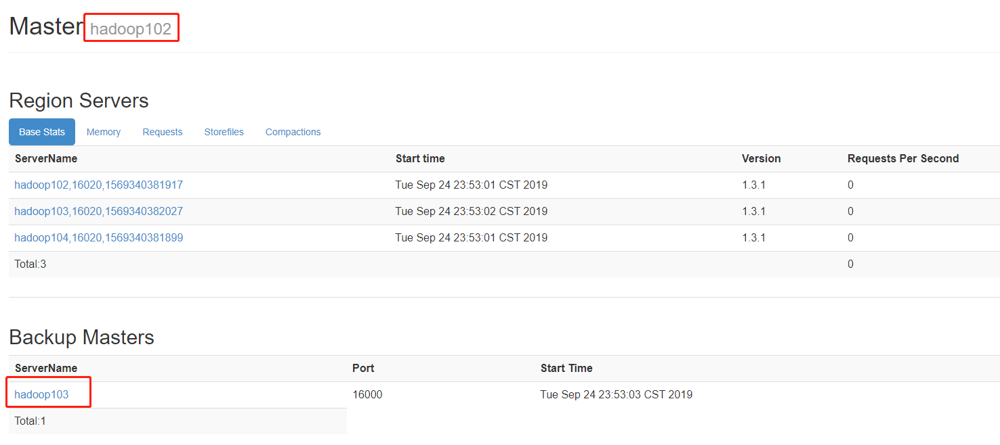


## 预分区

- 每一个region维护着startRow与endRowKey
  - 如果加入的数据符合某个region维护的rowKey范围，则该数据交给这个region维护
- 依照该原则可以将数据所要投放的分区提前大致规划好以提高HBase性能
  - 防止region热点
  - 如rowkey按照时间规则，那么最后一个region始终是热点
- 设置分区键进行预分区


### 手动设定预分区

- 创建staff1表
- 含有2个列族
  - info
  - partition1

```bash
hbase(main):001:0> create 'staff1','info','partition1',SPLITS => ['1000','2000','3000','4000']
```

- 结果
  - 划分5个region

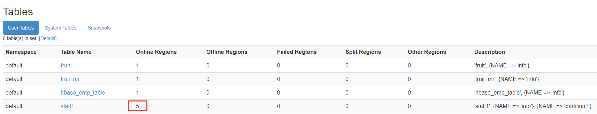


### 生成16进制序列预分区

- 按照字符串的十六进制进行划分

```bash
create 'staff2','info','partition2',{NUMREGIONS => 15,SPLITALGO => 'HexStringSplit'}
```


### 按文件中设置的规则预分区

- 创建分区规则文件split.txt
  - 即使文件中的字典规则不是顺序的，HBase会进行升序排列之后预分区

```text
aaaa
bbbb
dddd
cccc
```

- 执行

```bash
hbase(main):002:0> create 'staff3','info',SPLITS_FILE => '/opt/module/datas/split.txt'
```

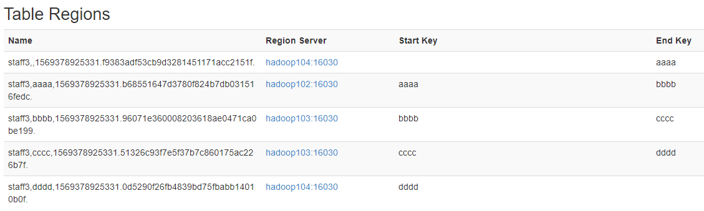


### 用JavaAPI创建预分区

```java
//自定义算法，产生一系列Hash散列值存储在二维数组中
//将byte[]看成一个rowkey 那么byte[][]就是rowKey[]
byte[][] splitKeys = 某个散列值函数
//创建HBaseAdmin实例
HBaseAdmin hAdmin = new HBaseAdmin(HBaseConfiguration.create());
//创建HTableDescriptor实例
HTableDescriptor tableDesc = new HTableDescriptor(tableName);
//通过HTableDescriptor实例和散列值二维数组创建带有预分区的HBase表
hAdmin.createTable(tableDesc, splitKeys);
```


## RowKey设计

- 一条数据的唯一标识就是rowkey
  - 数据存储于哪个分区，取决于rowkey处于哪个一个预分区的区间内
- 设计rowkey是让数据均匀的分布于所有的region中
  - 在一定程度上防止数据倾斜

### 生成随机数、散列值

```text
如：
原本rowKey为1001的，SHA1后变成：dd01903921ea24941c26a48f2cec24e0bb0e8cc7
原本rowKey为3001的，SHA1后变成：49042c54de64a1e9bf0b33e00245660ef92dc7bd
原本rowKey为5001的，SHA1后变成：7b61dec07e02c188790670af43e717f0f46e8913
在做此操作之前，一般我们会选择从数据集中抽取样本，来决定什么样的rowKey来Hash后作为每个分区的临界值
```


### 字符串反转

- 可以在一定程度上散列逐步put进来的数据

```text
20170524000001转成10000042507102
20170524000002转成20000042507102
```


### 字符串拼接

```text
20170524000001_a12e
20170524000001_93i7
```


## 内存优化

- HBase操作过程中需要大量的内存开销，毕竟Table是可以缓存在内存中的，一般会分配整个可用内存的70%给HBase的Java堆
  - 不建议分配非常大的堆内存，因为GC过程持续太久会导致RegionServer处于长期不可用状态
  - 一般16~48G内存，如果因为框架占用内存过高导致系统内存不足，框架一样会被系统服务拖死


## 基础优化

- 允许在HDFS的文件中追加内容
  - hdfs-site.xml、hbase-site.xml

```text
属性：dfs.support.append
解释：开启HDFS追加同步，可以优秀的配合HBase的数据同步和持久化。默认值为true
```

- 优化DataNode允许的最大文件打开数
  - hdfs-site.xml

```text
属性：dfs.datanode.max.transfer.threads
解释：HBase一般都会同一时间操作大量的文件，根据集群的数量和规模以及数据动作，设置为4096或者更高。默认值：4096
```

- 优化延迟高的数据操作的等待时间
  - hdfs-site.xml

```text
属性：dfs.image.transfer.timeout
解释：如果对于某一次数据操作来讲，延迟非常高，socket需要等待更长的时间，建议把该值设置为更大的值（默认60000毫秒），以确保socket不会被timeout掉。
```

- 优化数据的写入效率
  - mapred-site.xml

```text
属性：
mapreduce.map.output.compress
mapreduce.map.output.compress.codec
解释：开启这两个数据可以大大提高文件的写入效率，减少写入时间。第一个属性值修改为true，第二个属性值修改为：org.apache.hadoop.io.compress.GzipCodec或者其他压缩方式。
```

- 设置RPC监听数量
  - hbase-site.xml

```text
属性：hbase.regionserver.handler.count
解释：默认值为30，用于指定RPC监听的数量，可以根据客户端的请求数进行调整，读写请求较多时，增加此值。
```

- 优化HStore文件大小
  - hbase-site.xml

```text
属性：hbase.hregion.max.filesize
解释：默认值10737418240（10GB），如果需要运行HBase的MR任务，可以减小此值，因为一个region对应一个map任务，如果单个region过大，会导致map任务执行时间过长。该值的意思就是，如果HFile的大小达到这个数值，则这个region会被切分为两个Hfile。
```

- 优化hbase客户端缓存
  - hbase-site.xml

```text
属性：hbase.client.write.buffer
解释：用于指定HBase客户端缓存，增大该值可以减少RPC调用次数，但是会消耗更多内存，反之则反之。一般我们需要设定一定的缓存大小，以达到减少RPC次数的目的
```

- 指定scan.next扫描HBase所获取的行数
  - hbase-site.xml

```text
属性：hbase.client.scanner.caching
解释：用于指定scan.next方法获取的默认行数，值越大，消耗内存越大。
```

- flush、compact、split机制
  - 当MemStore达到阈值，将Memstore中的数据Flush进Storefile

  - compact机制则是把flush出来的小文件合并成大的Storefile文件

  - split则是当Region达到阈值，会把过大的Region一分为二

  - 相关属性

    - 128M就是Memstore的默认阈值 `hbase.hregion.memstore.flush.size：134217728`
- 这个参数的作用是当单个HRegion内所有的Memstore大小总和超过指定值时，flush该HRegion的所有memstore。RegionServer的flush是通过将请求添加一个队列，模拟生产消费模型来异步处理的。那这里就有一个问题，当队列来不及消费，产生大量积压请求时，可能会导致内存陡增，最坏的情况是触发OOM
    - `  hbase.regionserver.global.memstore.upperLimit：0.4 hbase.regionserver.global.memstore.lowerLimit：0.3`
    
    - 当MemStore使用内存总量达到hbase.regionserver.global.memstore.upperLimit指定值时，将会有多个MemStores flush到文件中，MemStore flush 顺序是按照大小降序执行的，直到刷新到MemStore使用内存略小于lowerLimit