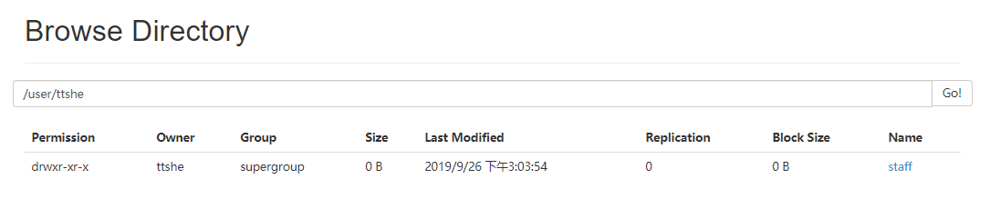
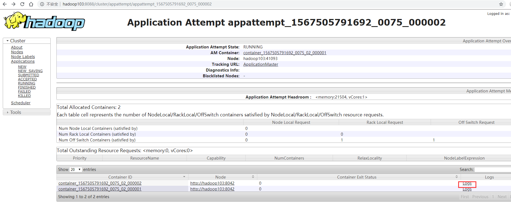
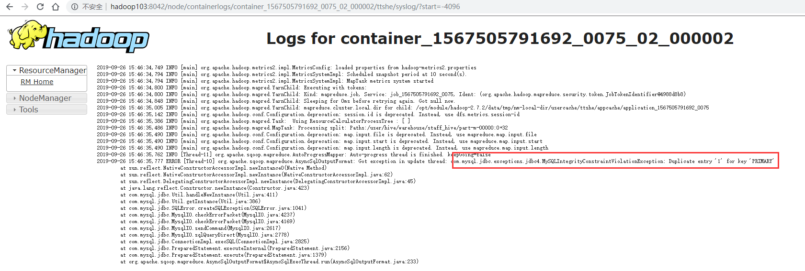

# 导入数据 toBigData

- 导入
- 从非大数据集群（RDBMS-mysql）向大数据集群（HDFS，HIVE，HBASE）中传输数据
- 使用import关键字


- 准备工作
  - 在mysql中插入数据

```bash
$ mysql -uroot -p123456
mysql> create database company;
mysql> create table company.staff(id int(4) primary key not null auto_increment, name varchar(255), sex varchar(255));
mysql> insert into company.staff(name, sex) values('Thomas', 'Male');
mysql> insert into company.staff(name, sex) values('Catalina', 'FeMale');

mysql> select * from company.staff;
+----+----------+--------+
| id | name     | sex    |
+----+----------+--------+
|  1 | Thomas   | Male   |
|  2 | Catalina | FeMale |
+----+----------+--------+
2 rows in set (0.00 sec)
```


## RDBMS 到 HDFS


### 全部导入

- 将msql的表中的数据导入到HDFS中

```bash
bin/sqoop import \
--connect jdbc:mysql://hadoop102:3306/company \
--username root --password 123456 \
--table staff \
--target-dir /user/company \
--delete-target-dir \ 
--num-mappers 1 --fields-terminated-by "\t"
```

```bash
[ttshe@hadoop102 sqoop]$ bin/sqoop import --connect jdbc:mysql://hadoop102:3306/company --username root --password 123456 --table staff --target-dir /user/company --delete-target-dir --num-mappers 1 --fields-terminated-by "\t"
```

- delete-target-dir
  - 在实际工作中不要使用，这里添加用于避免报错
  - 不添加：用于MR中判断文件是否存在，存在则报错

 


### 查询导入 [query]（重点）

- 使用query可以实现其他所有方式的导入

```bash
bin/sqoop import \
--connect jdbc:mysql://hadoop102:3306/company \
--username root \
--password 123456 \
--target-dir /user/company \
--delete-target-dir \
--num-mappers 1 \
--fields-terminated-by "\t" \
--query 'select name,sex from staff where id <=1 and $CONDITIONS;'
```

- must contain '$CONDITIONS' in WHERE clause
  - 如果query后使用的是双引号，则$CONDITIONS前必须加转义符，防止shell识别为自己的变量
  - 必须添加，$CONDITIONS用于保证有序

 


### 导入指定列 [columns]

```bash
bin/sqoop import \
--connect jdbc:mysql://hadoop102:3306/company \
--username root \
--password 123456 \
--table staff \
--target-dir /user/company \
--delete-target-dir \
--num-mappers 1 \
--columns id,sex \
--fields-terminated-by "\t" 
```

- columns中如果涉及到多列，用逗号分隔，分隔时不要添加空格


### 使用sqoop关键字筛选查询导入数据 [where]

```bash
bin/sqoop import \
--connect jdbc:mysql://hadoop102:3306/company \
--username root \
--password 123456 \
--target-dir /user/company \
--delete-target-dir \
--num-mappers 1 \
--fields-terminated-by "\t" \
--table staff \
--where "id=1"
```


## RDBMS 到 Hive

```bash
bin/sqoop import \
--connect jdbc:mysql://hadoop102:3306/company \
--username root \
--password 123456 \
--table staff \
--num-mappers 1 \
--hive-import \
--hive-overwrite \
--fields-terminated-by "\t" \
--hive-table staff_hive
```

- hive-overwrite
  
- 表示覆盖原先的表
  
- 该过程分为两步

  - 第一步将数据导入到HDFS
    - 默认的临时目录是/user/$user/表名(MySQL)
    - 等全部导入完成，零时文件删除

   

  - 第二步将导入到HDFS的数据迁移到Hive仓库
    - 最终存储在HDFS上

   


## RDBMS 到 HBase

```bash
bin/sqoop import \
--connect jdbc:mysql://hadoop102:3306/company \
--username root \
--password 123456 \
--table staff \
--columns "id,name,sex" \
--column-family "info" \
--hbase-create-table \
--hbase-row-key "id" \
--hbase-table "hbase_company" \
--num-mappers 1 \
--split-by "_"
```

- sqoop1.4.6只支持HBase1.0.1之前的版本的自动创建HBase表的功能
  - 其他版本需要手动创建表

```bash
hbase(main):007:0> create 'hbase_company','info'
0 row(s) in 2.6760 seconds
```

说明

- hbase-row-key
  - 当前表中哪些作为rowKey
- split-by
  - 将mysql中的字段复合成为一个rowkey，那么使用split-by进行连接表示分隔
  - 和hbase-row-key配合使用

```bash
--hbase-row-key "id","name"
--split-by "_"
```

验证

- 导入完成后

```bash
hbase(main):009:0> scan 'hbase_company'
```


# 导出数据 toMySQL

- 从大数据集群（HDFS，HIVE，HBASE）向非大数据集群（RDBMS）中传输数据
- 使用export关键字


## Hive/HDFS 导入到MySQL

```bash
bin/sqoop export \
--connect jdbc:mysql://hadoop102:3306/company \
--username root \
--password 123456 \
--table staff \
--num-mappers 1 \
--export-dir /user/hive/warehouse/staff_hive \
--input-fields-terminated-by "\t"
```

- Mysql中如果表不存在，不会自动创建

验证

- 查看进度，始终没有执行完成


- 分析
  - 为了查看日志，需要将当前任务终止
    - 可以尝试关闭MRAppMaster（YarnChild可以不用kill）进程（将当前任务kill掉）
    - 或者等待终止

- 出错，主键冲突
  - 建立mysql的时候，指定id是主键

 

 

- 解决

  - 将mysql的表进行清空

  ```bash
  mysql> truncate company.staff;
  ```

  - kill 掉MRAppMaster和YarnChild
  - 重新执行


# 执行脚本文件

- 使用opt格式的文件打包sqoop命令，然后执行

- 创建一个.opt文件

```bash
$ mkdir opt
$ touch opt/job_hdfs_2_mysql.opt
$ vi opt/job_hdfs_2_mysql.opt
```

```bash
export
--connect
jdbc:mysql://hadoop102:3306/company
--username
root
--password
123456
--table
staff
--num-mappers
1
--export-dir
/user/hive/warehouse/staff_hive
--input-fields-terminated-by
"\t"
```

- 注意
  - 格式必须是换行赋值参数
- 执行
  - 执行前，先truncate一下staff表

```bash
bin/sqoop --options-file opt/job_hdfs_2_mysql.opt
```


