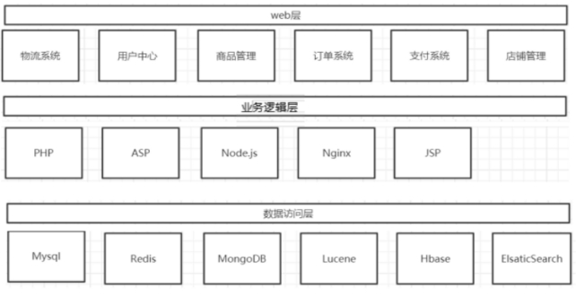
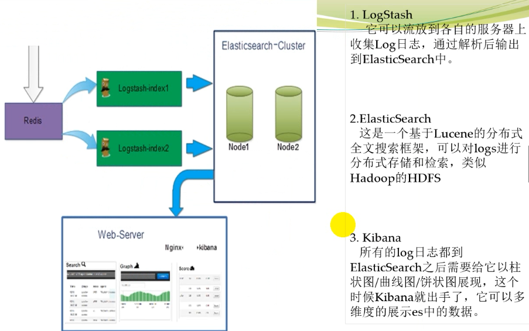

# 概述

- ElasticSearch
  - Java
  - 数据存储和搜索
  - 可以作为数据库，nosql
  - 一个分布式数据搜索引擎，用于全文检索，结构化搜索以及分析
    - 之前的技术：lucene+Solr
  - 分布式
  - 零配置
  - 自动发现
  - 索引自动分片
  - 索引副本机制
  - restful风格接口
  - 多数据源
  - 自动搜索负载
- Logstash
  - Ruby
  - 一个完全开源的数据收集引擎
  - 包含输入、过滤、输出模块
  - 一般在过滤模块中做日志格式化的解析工作
- Kibana
  - JavaScript
  - 为 Logstash 和 ElasticSearch 提供分析平台和可视化的Web平台
  - 帮助汇总、分析和搜索重要数据日志

## 应用

- 关于电商网站项目的体系架构

 

- 关于电商网站项目思考问题
  - 在整个项目中会产生大量日志，例如系统运行日志，用户行为日志等
  - 有没有意义
    - 针对商品的一些指标
      - 商品浏览量：商品详情页的PV
      - 商品查看人次：商品详情页的UV
  - 目前，这些日志数据是如何处理？

- 以上问题解决方案
  - 把日志放在数据库中，保存分析
    - 此方案数据适用小数据量场景
    - 如果量太大，数据库方案不太建议
  - 采用flume+hadoop+Echarts/Superset方案
    - 此方案可行
  - 采用Logstash+Elasticsearch+Kibana方案
    - 此方案可行

 

- 日志收集：Logstash

- 日志存储：ElasticSearch

- 日志展示：Kibana

 