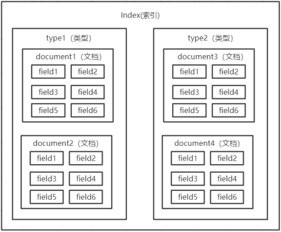

## 全文检索

- 计算机根据用户输入的关键词进行匹配，从已有的数据库中摘录出相关的记录反馈给用户
- 常见的全网搜索引擎，像百度、谷歌，除此以外，搜索技术在垂直领域也有广泛的使用，比如淘宝、京东搜索商品，万芳、知网搜索期刊，都是基于海量数据的搜索

## 如何全文检索

### 传统关系型数据库

- 弊端
  - 对于传统的关系性数据库对于关键词的查询，只能逐字逐行的匹配，性能非常差
  - 匹配方式不合理，比如搜索“小密手机” ，如果用like进行匹配， 根本匹配不到
  - 但是考虑使用者的用户体验的话，除了完全匹配的记录，还应该显示一部分近似匹配的记录，至少应该匹配到“手机”

### 专业全文索引如何处理

- 全文搜索引擎目前主流的索引技术就是==倒排索引==的方式
  - 传统的保存数据的方式
    - 记录→单词
  - 倒排索引的保存数据的方式
    - 单词→记录

## elasticSearch

- Elasticsearch官网： https://www.elastic.co/products/elasticsearch

### 与lucene的关系

- 基于lucene实现处理分词，构建倒排索引等
- lucene是一个提供全文搜索功能类库的核心工具包
- elasticSearch是使用lucene搭建的一个完善的服务框架
  - 类比lucene是类似于jdk，而搜索引擎软件就是tomcat 的
- 目前流行的主流搜索引擎软件
  - elasticsearch
  - solr
  - 都是基于lucene的搭建
  - 可独立部署启动的搜索引擎服务软件
  - 由于内核相同，所以两者除了服务器安装、部署、管理、集群以外，对于数据的操作，修改、添加、保存、查询等等都十分类似
    - 类比于支持sql语言的两种数据库软件
    - 只要学会其中一个另一个很容易上手
- 从实际企业使用情况来看，elasticSearch的市场份额逐步在取代solr
  - 国内百度、京东、新浪都是基于ES实现的搜索功能
  - 国外像维基百科、GitHub、Stack Overflow等等也都是基于ES的

### 使用场景

- 为用户提供按关键字查询的全文搜索功能
- ELK框架(ElasticSearch,Logstash,Kibana)
  - 实现企业海量日志的处理分析的解决方案
  - 大数据领域的重要一份子

### 基本概念

| 属性     | 解释                                                         |
| -------- | ------------------------------------------------------------ |
| cluster  | 整个elasticsearch 默认就是集群状态，整个集群是一份完整、互备的数据 |
| node     | 集群中的一个节点，一般只一个进程就是一个node                 |
| shard    | 分片，即使是一个节点中的数据也会通过hash算法，分成多个片存放，==默认是5片== |
| index    | 相当于rdbms的database, 对于用户来说是一个逻辑数据库，虽然物理上会被分多个shard存放，也可能存放在多个node中。 |
| type     | 类似于rdbms的table，但是与其说像table，其实更像面向对象中的class , 同一Json的格式的数据集合。 |
| document | 类似于rdbms的 row、面向对象里的object                        |
| field    | 相当于字段、属性                                             |

### 结构

- 结构如下（ES6.0之前）
  - ==注意：ES6.0之后，一个索引中只有一个type==
    - index代替了type的功能，type默认推荐使用固定值_doc代替
    - 发展趋势，去除type

 

### 与数据库类比

| 关系型数据库（比如Mysql） | 非关系型数据库（Elasticsearch） |
| ------------------------- | ------------------------------- |
| 数据库Database            | 索引Index                       |
| 表Table                   | 类型Type                        |
| 数据行Row                 | 文档Document                    |
| 数据列Column              | 字段Field                       |
| 约束 Schema               | 映射Mapping                     |

- 索引Index
  - 由具有相同字段的文档列表组成，用于定义字段名和字段值，一个集群或elasticsearch	由多个索引组成，例如可以按照日期生成多个索引，方便数据搜索
- 类型Type
  - 具有相同特征文档的集合（ES6之后一个索引中只能定义一个type）
- 文档document
  - 用户存储在ES中的数据文档
    - 元数据
      - _index
        - 文档所在索引名称
      - _type
        - 文档所在类型名称
      - _id
        - 文档唯一id
      - _uid
        - 组合id，由 _type 和 _id组成
        - 6.x后，_type不再起作用，与 _id
      - _source
        - 文档的原始Json数据，包括每个字段的内容
      - _all
        - 将所有字段内容整合起来
        - 默认禁用
        - 用于对所有字段内容检索
- 字段Field
  - 具有相同特性数据名称
- 与mysql的对比
  - mysql在数据表建立后，手动建立索引
  - es在创建表时，所有字段默认建立索引，数据表存储量可能会扩大到原先的8倍