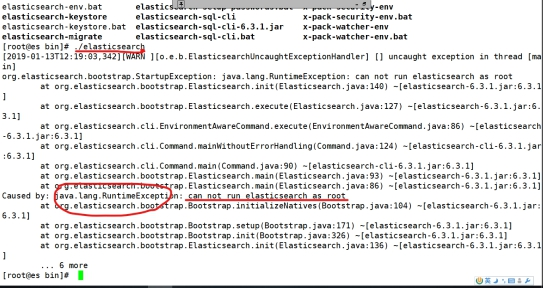

# 安装&配置

- 6.3.1版本
- 安装在hadoop103上
- 注意内存至少2G以上分配
  - 由于ES是注重大数据量搜索，需要使用大量内存


## 准备

- 一台服务器 centOS6.8

- 网络环境配置

- Java8环境安装

  - 删除Centos6.8自带的openJDK

  ```bash
  #查询是否有openJDK
  rpm -qa | grep java
  
  #删除自带openJDK
  rpm -qa | grep java | xargs rpm -e --nodeps
  
  #重新加载配置/etc/profile文件
  source /etc/profile
  ```

  - 安装JDK1.8，配置环境变量

- 创建非root用户

  - ==ES服务不能使用root用户启动，原因是ES有执行脚本能力，因安全问题ES禁止用root用户启动==
  - 此处使用ttshe

```bash
useradd es
passwd es
```

- 演示root启动错误

 


## 修改系统配置

- 为什么要修改linux配置？
  - 默认elasticsearch是单机访问模式，只能自己访问自己
  - 需要设置成允许应用服务器通过网络方式访问
    - elasticsearch会因为单机版的低端默认配置而报错，甚至无法启动
    - 需要把服务器的一些限制打开，能支持更多并发
- ==注意如下修改完后重启==


### limits.conf

- 解决问题：max file descriptors [4096] for elasticsearch process likely too low, increase to at least [65536] elasticsearch
- 原因：系统允许 Elasticsearch 打开的最大文件数需要修改成65536
- 注意：“*” 不要省略掉

```bash
[ttshe@hadoop103 root]$ sudo vi /etc/security/limits.conf
# 添加如下配置
* soft nofile 65536
* hard nofile 131072
* soft nproc 2048
* hard nproc 4096
# 与bootstrap.memory_lock: false 相对应
* hard memlock unlimited
* soft memlock unlimited
```


### 90-nproc.conf

- 解决问题：max number of threads [1024] for user [judy2] likely too low, increase to at least [2048]  （CentOS7.x  不用改）
- 原因：允许最大进程数修该成4096

```bash
[ttshe@hadoop103 elasticsearch]$sudo vi /etc/security/limits.d/90-nproc.conf 
# 修改软连接线程数 4096
*          soft    nproc     4096
root       soft    nproc     unlimited
```


### sysctl.conf

- 解决问题：max virtual memory areas vm.max_map_count [65530] likely too low, increase to at least [262144] （CentOS7.x  不用改）
- 原因：一个进程可以拥有的虚拟内存区域的数量
- 解决：临时提高vm.max_map_count的大小
- 命令：sysctl -w vm.max_map_count=262144
- 上述方法修改之后，如果重启虚拟机将失效，修改sysctl.conf可永久修改

```bash
[ttshe@hadoop103 root]$ sudo vi /etc/sysctl.conf
# 添加如下配置
vm.max_map_count=655360
fs.file-max=655360
```

- 以上参数改完需要重启


## 单机安装

- 解压安装包

```bash
[ttshe@hadoop103 software]$ tar -zvxf elasticsearch-6.3.1.tar.gz -C /opt/module/
[ttshe@hadoop103 module]$ mv elasticsearch-6.3.1/ elasticsearch/
```


### 配置

#### elasticsearch.yml

- ES5.2.0默认bootstrap.system_call_filter为true进行检测SecComp
  - Centos6不支持SecComp
  - 导致检测失败，失败后直接导致ES不能启动
- 在elasticsearch.yml中配置bootstrap.system_call_filter为false，注意要在Memory下面
  - bootstrap.memory_lock: false
    - 默认配置true
      - 会导致硬盘频繁读，IOPS变高
      - 锁定物理内存地址，防止es内存被交换出去
      - 避免es使用swap交换分区，频繁的交换，会导致IOPS变高
  - bootstrap.system_call_filter: false

```bash
[ttshe@hadoop103 config]$ vim elasticsearch.yml
#添加修改设置
bootstrap.memory_lock: false
bootstrap.system_call_filter: false
# 修改为外部访问模式 0.0.0.0 或 hostname
network.host: hadoop102
```


#### jvm.options

- 默认是2G 
- 由于教学实验环境集群启动1G的话个人电脑配置压力较大，所以调整为256m

```bash
[ttshe@hadoop102 config]$ vim jvm.options
# 修改如下配置
- Xms256m
- Xms256m
```


### 启动

- 后台启动需要添加参数 -d 

```bash
[ttshe@hadoop102 elasticsearch]$ bin/elasticsearch
```


### 验证

```bash
[ttshe@hadoop102 ~]$ curl localhost:9200
```


## 安装Kibana

- 参考kibana安装笔记


## 集群安装


### 配置


#### elasticserach.yml

```bash
# 集群名称（不能重复）
cluster.name: my-es#必须相同 
# 节点名称，仅仅是描述名称，用于在日志中区分（自定义）,每个节点必须不同
node.name: es1
#指定了该节点可能成为 master 节点，还可以是数据节点
node.master: true
node.data: true
# 当前节点的IP地址 
network.host: 0.0.0.0
# 关闭bootstrap 自启程序
bootstrap.memory_lock: false
bootstrap.system_call_filter: false
# 数据的默认存放路径（自定义）
path.data: ../data/esData
# 日志的默认存放路径 
path.logs: ../data/esLogs
# 对外提供服务的端口
http.port: 9200 
# 9300为集群服务的端口
transport.tcp.port: 9300
# 集群各个节点IP地址，可使用域名，需要各节点能够解析 
discovery.zen.ping.unicast.hosts: ["hadoop102","hadoop103","hadoop104"] 
# 为了避免脑裂，集群节点数最少为 半数+1
discovery.zen.minimum_master_nodes: 2  
```

- 注意1：编写要有空格，关闭防火墙

- 注意2：discovery.zen.ping.unicast.hosts，

- 注意3：启动前，清空esData和esLogs数据

  

#### jvm.options

- 默认是2G 
- 由于教学实验环境集群启动1G的话个人电脑配置压力较大，所以调整为256m

```bash
[ttshe@hadoop102 config]$ vim jvm.options
# 修改如下配置
- Xms256m
- Xms256m
```


### 启动脚本

```bash
[ttshe@hadoop102 bin]$ vim es.sh
[ttshe@hadoop102 bin]$ chmod 777 es.sh 
```

- 脚本如下

```bash
#!/bin/bash 

es_home=/opt/module/elasticsearch
kibana_home=/opt/module/kibana

case $1 in
 "start") {
  for i in hadoop102 hadoop103 hadoop104
  do
    ssh $i "${es_home}/bin/elasticsearch >/dev/null 2>&1 &"
  done
  nohup ${kibana_home}/bin/kibana >kibana.log 2>&1 &
};;
"stop") {
  ps -ef|grep ${kibana_home} |grep -v grep|awk '{print $2}'|xargs kill
  for i in hadoop102 hadoop103 hadoop104
  do
    ssh $i "ps -ef|grep $es_home |grep -v grep|awk '{print \$2}'|xargs kill" >/dev/null 2>&1
  done
};;
esac
```

- 启动验证

```bash
[ttshe@hadoop102 bin]$ es.sh start
[ttshe@hadoop102 bin]$ curl -XGET 'http://hadoop102:9200/_cat/nodes?pretty'
192.168.1.103 43 54 4 0.36 0.16 0.10 mdi - es2
192.168.1.104 44 52 4 0.52 0.22 0.12 mdi - es3
192.168.1.102 49 26 4 0.66 0.35 0.17 mdi * es1
```

