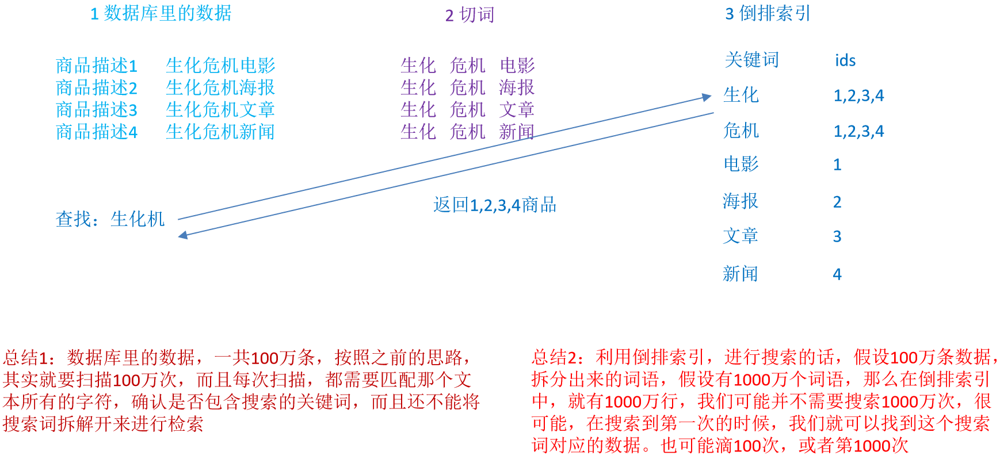
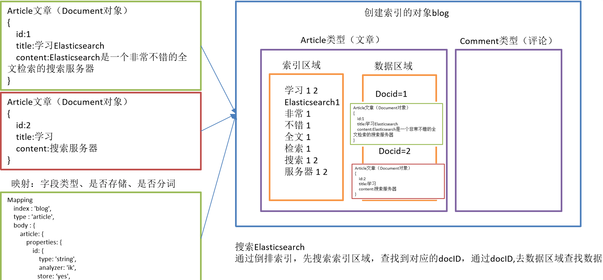

# 特性

- 分词表
  - 在ES的数据库中存储有分词表
  - 用于存储倒排索引
  - 表id 是分词，值是文档id
  - 只查询一次，将所有关联的文档查询出来

## 索引


### 正排索引

- 在mysql中为id建立的索引是正排索引
- 记录文档Id到文档内容的关联关系

- 查询机制
  - 通过id查询时候，会先查询索引库找到id，进而找到文档内容


### 倒排索引（重点）

- 倒排索引（Posting List）
  - 记录单词到**内容列表**的关联信息

- 单词词典（Term DicTionary）
  - 记录所有 文档的单词，一般比较大

 

- 通过内容关键字找到文档的位置
- 每个文档都有自己的多个倒排索引，每个文档有一个正排索引

- 通过给文档记录中的内容分词，将分出的词保存到分词表中，最后查询的时候通过分词表中的词倒推出文档的位置，从而获取文档


### ES数据存储和搜索

 

- 注意在ES6.0以后只能有一个type


# java 调用


- 目前市面上有两类客户端
  - TransportClient 为代表的ES原生客户端，不能执行原生dsl语句必须使用它的Java api方法
  - 以Rest Api为主的missing client，最典型的就是jest
    - 这种客户端可以直接使用dsl语句拼成的字符串，直接传给服务端，然后返回json字符串再解析
  - 两种方式各有优劣，但最近elasticsearch官网宣布计划在7.0以后的版本中废除TransportClient
  - 以RestClient为主


## pom

```xml
<dependency>
   <groupId>org.springframework.boot</groupId>
   <artifactId>spring-boot-starter-data-elasticsearch</artifactId>
</dependency>

<!-- https://mvnrepository.com/artifact/io.searchbox/jest -->
<dependency>
   <groupId>io.searchbox</groupId>
   <artifactId>jest</artifactId>
   <version>5.3.3</version>
</dependency>

<!-- https://mvnrepository.com/artifact/net.java.dev.jna/jna -->
<dependency>
   <groupId>net.java.dev.jna</groupId>
   <artifactId>jna</artifactId>
   <version>4.5.1</version>
</dependency>
```


## application.properties

```properties
spring.elasticsearch.jest.uris=http://hadoop102:9200
```


## 代码

```java
@Autowired
JestClient jestClient;

@Test
public void testEs() throws IOException {
    String query="{\n" +
        "  \"query\": {\n" +
        "    \"match\": {\n" +
        "      \"actorList.name\": \"张译\"\n" +
        "    }\n" +
        "  }\n" +
        "}";
    Search search = new Search.Builder(query).addIndex("movie_chn").addType("movie").build();

    SearchResult result = jestClient.execute(search);

    List<SearchResult.Hit<HashMap, Void>> hits = result.getHits(HashMap.class);

    for (SearchResult.Hit<HashMap, Void> hit : hits) {
        HashMap source = hit.source;
        System.err.println("source = " + source);
    }

}
```


# 问题处理


## 关于seccomp

- 启动过程中容器出现的错误如下

```bash
[ttshe@hadoop103 elasticsearch]$ bin/elasticsearch
[2019-09-29T21:54:38,970][WARN ][o.e.b.JNANatives         ] unable to install syscall filter: 
java.lang.UnsupportedOperationException: seccomp unavailable: CONFIG_SECCOMP not compiled into kernel, CONFIG_SECCOMP and CONFIG_SECCOMP_FILTER are needed
	at org.elasticsearch.bootstrap.SystemCallFilter.linuxImpl(SystemCallFilter.java:341) ~[elasticsearch-6.3.1.jar:6.3.1]
...
```

- seccomp是linux kernel从2.6.23版本开始所支持的一种安全机制
  - 详见：https://en.wikipedia.org/wiki/Seccomp
- 主机操作系统是CentOS release 6.8 (Final)，没有支持seccomp
- 然而ES默认将利用内核的seccomp机制，所以报错

- 解决
  - ES是通过配置参数bootstrap.system_call_filter: true
    - 使用内核seccomp机制的
  - 在开发环境下可以将该参数值设为false

```bash
[es@localhost]$ vim config/elasticsearch.yml
# 默认该参数值不在配置文件中，添加并设置为false即可

bootstrap.system_call_filter: false
```


## 启动后有三个警告

```bash
[ttshe@hadoop103 elasticsearch]$ bin/elasticsearch

[2019-09-29T21:58:50,618][WARN ][o.e.b.BootstrapChecks    ] [9oEk0A8] max file descriptors [4096] for elast too low, increase to at least [65536]
[2019-09-29T21:58:50,618][WARN ][o.e.b.BootstrapChecks    ] [9oEk0A8] max number of threads [1024] for user, increase to at least [4096]
[2019-09-29T21:58:50,618][WARN ][o.e.b.BootstrapChecks    ] [9oEk0A8] max virtual memory areas vm.max_map_c low, increase to at least [262144]
```

- 最大文件描述符配置过低，至少65536

```bash
切换到root用户，编辑limits.conf 添加类似如下内容
vi /etc/security/limits.conf 
添加如下内容:
* soft nofile 65536
* hard nofile 131072
* soft nproc 2048
* hard nproc 4096
```

- 系统配置的线程数过低，至少4096

```bash
切换到root用户，进入limits.d目录下修改配置文件。
vi /etc/security/limits.d/90-nproc.conf 
修改如下内容：
* soft nproc 1024
# 软链接线程数 修改为
* soft nproc 4096
```

- 虚拟内存过低，至少262144

```bash
需要切换到root用户修改配置sysctl.conf
vi /etc/sysctl.conf 
添加下面配置：
vm.max_map_count=655360
fs.file-max=655360
```


