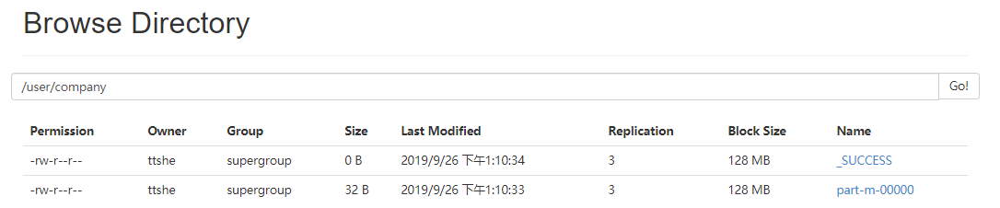
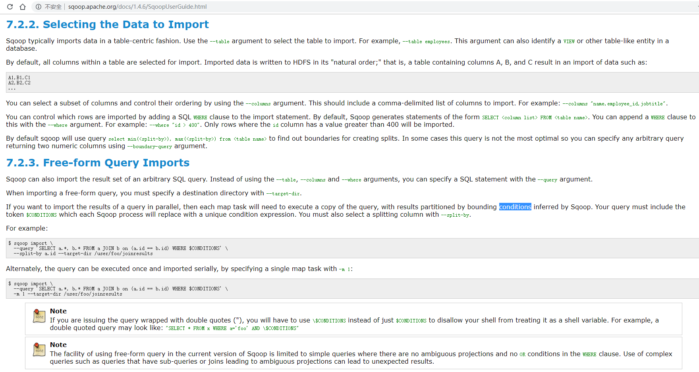
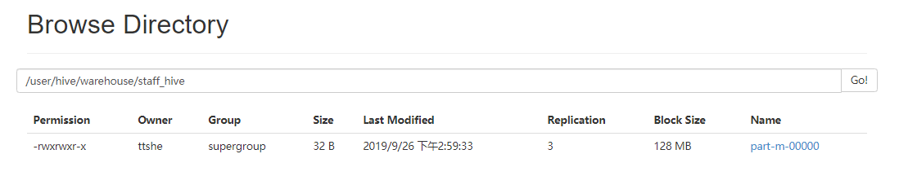
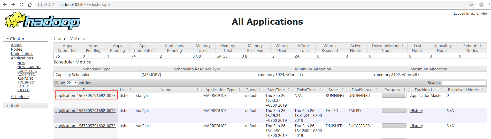

# 简介

- Sqoop是一款开源的工具
- 用于在Hadoop(Hive)与传统的数据库(mysql、postgresql...)间进行数据的传递
  - 将一个关系型数据库中的数据导进到Hadoop的HDFS中，可以将HDFS的数据导进到关系型数据库中
    - 如 MySQL ,Oracle ,Postgres

- Sqoop项目开始于2009年，最早是作为Hadoop的一个第三方模块存在，后来为了让使用者能够快速部署，也为了更快速的迭代开发，Sqoop独立成为一个Apache项目

- Sqoop2的最新版本是1.99.7。请注意，2与1不兼容，且特征不完整，它并不打算用于生产部署
- Sqoop1.4.7与centOS6不兼容
  - 1.4.6可以在CentOS6上使用


# 原理

- 将导入或导出命令翻译成mapreduce程序来实现

- 在翻译出的mapreduce中主要是对inputformat和outputformat进行定制


# 安装

- 安装Sqoop的前提是已经具备Java和Hadoop的环境。


## 下载解压

- 下载地址：http://mirrors.hust.edu.cn/apache/sqoop/1.4.6/
- 上传安装包sqoop-1.4.6.bin__hadoop-2.0.4-alpha.tar.gz到虚拟机中
- 解压sqoop安装包到指定目录

```bash
[ttshe@hadoop102 software]$$ tar -zxf sqoop-1.4.6.bin__hadoop-2.0.4-alpha.tar.gz -C /opt/module/
[ttshe@hadoop102 module]$ mv sqoop-1.4.6.bin__hadoop-2.0.4-alpha/ sqoop/
```


## 配置

- 在sqoop根目录下的conf目录中

- 复制配置文件

```bash
[ttshe@hadoop102 conf]$ cp sqoop-env-template.sh sqoop-env.sh
```


### sqoop-env.sh

- 配置了Hive可以与Hive进行交互
- 配置了HBase可以与HBase进行交互

```bash
export HADOOP_COMMON_HOME=/opt/module/hadoop-2.7.2
export HADOOP_MAPRED_HOME=/opt/module/hadoop-2.7.2
export HIVE_HOME=/opt/module/hive
export ZOOKEEPER_HOME=/opt/module/zookeeper-3.4.5
export ZOOCFGDIR=/opt/module/zookeeper-3.4.5
export HBASE_HOME=/opt/module/hbase
```


### 拷贝JDBC驱动

- 拷贝jdbc驱动到sqoop的lib目录下
  - 注意将mysql-connector-java-5.1.27.tar.gz进行解压

```bash
[ttshe@hadoop102 mysql-connector-java-5.1.27]$ cp mysql-connector-java-5.1.27-bin.jar /opt/module/sqoop/lib/
```


## 验证

```bash
[ttshe@hadoop102 sqoop]$ bin/sqoop help

Warning: /opt/module/sqoop/bin/../../hcatalog does not exist! HCatalog jobs will fail.
Please set $HCAT_HOME to the root of your HCatalog installation.
Warning: /opt/module/sqoop/bin/../../accumulo does not exist! Accumulo imports will fail.
Please set $ACCUMULO_HOME to the root of your Accumulo installation.
19/09/26 12:42:24 INFO sqoop.Sqoop: Running Sqoop version: 1.4.6
usage: sqoop COMMAND [ARGS]

Available commands:
  codegen            Generate code to interact with database records
  create-hive-table  Import a table definition into Hive
  eval               Evaluate a SQL statement and display the results
  export             Export an HDFS directory to a database table
  help               List available commands
  import             Import a table from a database to HDFS
  import-all-tables  Import tables from a database to HDFS
  import-mainframe   Import datasets from a mainframe server to HDFS
  job                Work with saved jobs
  list-databases     List available databases on a server
  list-tables        List available tables in a database
  merge              Merge results of incremental imports
  metastore          Run a standalone Sqoop metastore
  version            Display version information

See 'sqoop help COMMAND' for information on a specific command.
```

- 查看警告，说明HCatalog和Accumulo没有配置，如果不用这些功能，不影响使用


### 测试连接mysql

- 查看mysql

```bash
[ttshe@hadoop102 ~]$ mysql -uroot -p123456

mysql> show databases;
+--------------------+
| Database           |
+--------------------+
| information_schema |
| metastore          |
| mysql              |
| performance_schema |
| renren             |
| test               |
+--------------------+
```

- 使用list-databases通过sqoop查看mysql的库

```bash
[ttshe@hadoop102 sqoop]$ bin/sqoop list-databases --connect jdbc:mysql://hadoop102:3306/ --username root --password 123456

Warning: /opt/module/sqoop/bin/../../hcatalog does not exist! HCatalog jobs will fail.
Please set $HCAT_HOME to the root of your HCatalog installation.
Warning: /opt/module/sqoop/bin/../../accumulo does not exist! Accumulo imports will fail.
Please set $ACCUMULO_HOME to the root of your Accumulo installation.
19/09/26 12:52:44 INFO sqoop.Sqoop: Running Sqoop version: 1.4.6
19/09/26 12:52:44 WARN tool.BaseSqoopTool: Setting your password on the command-line is insecure. Consider using -P instead.
19/09/26 12:52:44 INFO manager.MySQLManager: Preparing to use a MySQL streaming resultset.
information_schema
metastore
mysql
performance_schema
renren
test
```


# 使用


## 导入数据

- 导入
- 从非大数据集群（RDBMS-mysql）向大数据集群（HDFS，HIVE，HBASE）中传输数据
- 使用import关键字


- 准备工作
  - 在mysql中插入数据

```bash
$ mysql -uroot -p123456
mysql> create database company;
mysql> create table company.staff(id int(4) primary key not null auto_increment, name varchar(255), sex varchar(255));
mysql> insert into company.staff(name, sex) values('Thomas', 'Male');
mysql> insert into company.staff(name, sex) values('Catalina', 'FeMale');

mysql> select * from company.staff;
+----+----------+--------+
| id | name     | sex    |
+----+----------+--------+
|  1 | Thomas   | Male   |
|  2 | Catalina | FeMale |
+----+----------+--------+
2 rows in set (0.00 sec)
```


### RDBMS 到 HDFS


#### 全部导入

- 将msql的表中的数据导入到HDFS中

```bash
bin/sqoop import \
--connect jdbc:mysql://hadoop102:3306/company \
--username root --password 123456 \
--table staff \
--target-dir /user/company --delete-target-dir \ 
--num-mappers 1 --fields-terminated-by "\t"
```

```bash
[ttshe@hadoop102 sqoop]$ bin/sqoop import --connect jdbc:mysql://hadoop102:3306/company --username root --password 123456 --table staff --target-dir /user/company --delete-target-dir --num-mappers 1 --fields-terminated-by "\t"
```

- delete-target-dir
  - 在实际工作中不要使用，用于MR中判断文件是否存在，存在则会报错，这里添加用于避免报错




#### 查询导入（重点）

- 使用query可以实现其他所有方式的导入

```bash
bin/sqoop import \
--connect jdbc:mysql://hadoop102:3306/company \
--username root \
--password 123456 \
--target-dir /user/company \
--delete-target-dir \
--num-mappers 1 \
--fields-terminated-by "\t" \
--query 'select name,sex from staff where id <=1 and $CONDITIONS;'
```

- must contain '$CONDITIONS' in WHERE clause
  - 如果query后使用的是双引号，则$CONDITIONS前必须加转义符，防止shell识别为自己的变量
  - 必须添加，$CONDITIONS用于保证有序




#### 导入指定列

```bash
bin/sqoop import \
--connect jdbc:mysql://hadoop102:3306/company \
--username root \
--password 123456 \
--table staff \
--target-dir /user/company \
--delete-target-dir \
--num-mappers 1 \
--columns id,sex \
--fields-terminated-by "\t" 
```

- columns中如果涉及到多列，用逗号分隔，分隔时不要添加空格


#### 使用sqoop关键字筛选查询导入数据

```bash
bin/sqoop import \
--connect jdbc:mysql://hadoop102:3306/company \
--username root \
--password 123456 \
--target-dir /user/company \
--delete-target-dir \
--num-mappers 1 \
--fields-terminated-by "\t" \
--table staff \
--where "id=1"
```


### RDBMS 到 Hive

```bash
bin/sqoop import \
--connect jdbc:mysql://hadoop102:3306/company \
--username root \
--password 123456 \
--table staff \
--num-mappers 1 \
--hive-import \
--hive-overwrite \
--fields-terminated-by "\t" \
--hive-table staff_hive
```

- hive-overwrite
  
- 表示覆盖原先的表
  
- 该过程分为两步

  - 第一步将数据导入到HDFS
    - 默认的临时目录是/user/$user/表名(MySQL)
    - 等全部导入完成，零时文件删除

  

  - 第二步将导入到HDFS的数据迁移到Hive仓库
    - 最终存储在HDFS上

  


### RDBMS 到 HBase

```bash
bin/sqoop import \
--connect jdbc:mysql://hadoop102:3306/company \
--username root \
--password 123456 \
--table staff \
--columns "id,name,sex" \
--column-family "info" \
--hbase-create-table \
--hbase-row-key "id" \
--hbase-table "hbase_company" \
--num-mappers 1 \
--split-by "_"
```

- sqoop1.4.6只支持HBase1.0.1之前的版本的自动创建HBase表的功能
  - 其他版本需要手动创建表

```bash
hbase(main):007:0> create 'hbase_company','info'
0 row(s) in 2.6760 seconds
```


说明

- hbase-row-key
  - 当前表中哪些作为rowKey
- split-by
  - 将mysql中的字段复合成为一个rowkey，那么使用split-by进行连接表示分隔
  - 和hbase-row-key配合使用

```bash
--hbase-row-key "id","name"
--split-by "_"
```


验证

- 导入完成后

```bash
hbase(main):009:0> scan 'hbase_company'
```


## 导出数据

- 导出

- 从大数据集群（HDFS，HIVE，HBASE）向非大数据集群（RDBMS）中传输数据
- 使用export关键字


### Hive/HDFS 导入到MySQL

```bash
bin/sqoop export \
--connect jdbc:mysql://hadoop102:3306/company \
--username root \
--password 123456 \
--table staff \
--num-mappers 1 \
--export-dir /user/hive/warehouse/staff_hive \
--input-fields-terminated-by "\t"
```

- Mysql中如果表不存在，不会自动创建

验证

- 查看进度，始终没有执行完成



- 分析
  - 为了查看日志，需要将当前任务终止
    - 可以尝试关闭MRAppMaster（YarnChild可以不用kill）进程（将当前任务kill掉）
    - 或者等待终止

- 出错，主键冲突
  - 建立mysql的时候，指定id是主键


- 解决

  - 将mysql的表进行清空

  ```bash
  mysql> truncate company.staff;
  ```

  - kill 掉MRAppMaster和YarnChild
  - 重新执行


## 执行脚本文件

- 使用opt格式的文件打包sqoop命令，然后执行

- 创建一个.opt文件

```bash
$ mkdir opt
$ touch opt/job_hdfs_2_mysql.opt
$ vi opt/job_hdfs_2_mysql.opt
```

```bash
export
--connect
jdbc:mysql://hadoop102:3306/company
--username
root
--password
123456
--table
staff
--num-mappers
1
--export-dir
/user/hive/warehouse/staff_hive
--input-fields-terminated-by
"\t"
```

- 注意
  - 格式必须是换行赋值参数
- 执行
  - 执行前，先truncate一下staff表

```bash
bin/sqoop --options-file opt/job_hdfs_2_mysql.opt
```


# 常用命令

| **命令**          | **类**              | **说明**                                                     |
| ----------------- | ------------------- | ------------------------------------------------------------ |
| import            | ImportTool          | 将数据导入到集群                                             |
| export            | ExportTool          | 将集群数据导出                                               |
| codegen           | CodeGenTool         | 获取数据库中某张表数据生成Java并打包Jar                      |
| create-hive-table | CreateHiveTableTool | 创建Hive表                                                   |
| eval              | EvalSqlTool         | 查看SQL执行结果                                              |
| import-all-tables | ImportAllTablesTool | 导入某个数据库下所有表到HDFS中                               |
| job               | JobTool             | 用来生成一个sqoop的任务，生成后，该任务并不执行，除非使用命令执行该任务。 |
| list-databases    | ListDatabasesTool   | 列出所有数据库名                                             |
| list-tables       | ListTablesTool      | 列出某个数据库下所有表                                       |
| merge             | MergeTool           | 将HDFS中不同目录下面的数据合在一起，并存放在指定的目录中     |
| metastore         | MetastoreTool       | 记录sqoop job的元数据信息，如果不启动metastore实例，则默认的元数据存储目录为：~/.sqoop，如果要更改存储目录，可以在配置文件sqoop-site.xml中进行更改。 |
| help              | HelpTool            | 打印sqoop帮助信息                                            |
| version           | VersionTool         | 打印sqoop版本信息                                            |


## 公用参数


### 数据库连接

| **参数**             | **说明**               |
| -------------------- | ---------------------- |
| --connect            | 连接关系型数据库的URL  |
| --connection-manager | 指定要使用的连接管理类 |
| --driver             | Hadoop根目录           |
| --help               | 打印帮助信息           |
| --password           | 连接数据库的密码       |
| --username           | 连接数据库的用户名     |
| --verbose            | 在控制台打印出详细信息 |


### import

| **参数**                        | **说明**                                                     |
| ------------------------------- | ------------------------------------------------------------ |
| --enclosed-by <char>            | 给字段值前加上指定的字符                                     |
| --escaped-by <char>             | 对字段中的双引号加转义符                                     |
| --fields-terminated-by <char>   | 设定每个字段是以什么符号作为结束，默认为逗号                 |
| --lines-terminated-by <char>    | 设定每行记录之间的分隔符，默认是\n                           |
| --mysql-delimiters              | Mysql默认的分隔符设置，字段之间以逗号分隔，行之间以\n分隔，默认转义符是\，字段值以单引号包裹。 |
| --optionally-enclosed-by <char> | 给带有双引号或单引号的字段值前后加上指定字符。               |


### export

| **参数**                              | **说明**                                   |
| ------------------------------------- | ------------------------------------------ |
| --input-enclosed-by <char>            | 对字段值前后加上指定字符                   |
| --input-escaped-by <char>             | 对含有转移符的字段做转义处理               |
| --input-fields-terminated-by <char>   | 字段之间的分隔符                           |
| --input-lines-terminated-by <char>    | 行之间的分隔符                             |
| --input-optionally-enclosed-by <char> | 给带有双引号或单引号的字段前后加上指定字符 |


### hive

| **参数**                        | **说明**                                                  |
| ------------------------------- | --------------------------------------------------------- |
| --hive-delims-replacement <arg> | 用自定义的字符串替换掉数据中的\r\n和\013 \010等字符       |
| --hive-drop-import-delims       | 在导入数据到hive时，去掉数据中的\r\n\013\010这样的字符    |
| --map-column-hive <arg>         | 生成hive表时，可以更改生成字段的数据类型                  |
| --hive-partition-key            | 创建分区，后面直接跟分区名，分区字段的默认类型为string    |
| --hive-partition-value <v>      | 导入数据时，指定某个分区的值                              |
| --hive-home <dir>               | hive的安装目录，可以通过该参数覆盖之前默认配置的目录      |
| --hive-import                   | 将数据从关系数据库中导入到hive表中                        |
| --hive-overwrite                | 覆盖掉在hive表中已经存在的数据                            |
| --create-hive-table             | 默认是false，即，如果目标表已经存在了，那么创建任务失败。 |
| --hive-table                    | 后面接要创建的hive表,默认使用MySQL的表名                  |
| --table                         | 指定关系数据库的表名                                      |


## 特有参数


### import

- 将关系型数据库中的数据导入到HDFS（包括Hive，HBase）中
- 如导入的是Hive，那么当Hive中没有对应表时，则自动创建
- 导入数据到hive中

```bash
$ bin/sqoop import \
--connect jdbc:mysql://hadoop102:3306/company \
--username root \
--password 000000 \
--table staff \
--hive-import
```

- 增量导入数据到hive中，mode=append
  - 提示
    - append不能与--hive-等参数同时使用（Append mode for hive imports is not yet supported. Please remove the parameter --append-mode）

```bash
append导入：
$ bin/sqoop import \
--connect jdbc:mysql://hadoop102:3306/company \
--username root \
--password 000000 \
--table staff \
--num-mappers 1 \
--fields-terminated-by "\t" \
--target-dir /user/hive/warehouse/staff_hive \
--check-column id \
--incremental append \
--last-value 3
```

- 增量导入数据到hdfs中，mode=lastmodified
  - 提示
    - 使用lastmodified方式导入数据要指定增量数据是要--append（追加）还是要--merge-key（合并）
    - last-value指定的值是会包含于增量导入的数据中

```bash
先在mysql中建表并插入几条数据：
mysql> create table company.staff_timestamp(id int(4), name varchar(255), sex varchar(255), last_modified timestamp DEFAULT CURRENT_TIMESTAMP ON UPDATE CURRENT_TIMESTAMP);
mysql> insert into company.staff_timestamp (id, name, sex) values(1, 'AAA', 'female');
mysql> insert into company.staff_timestamp (id, name, sex) values(2, 'BBB', 'female');

先导入一部分数据：
$ bin/sqoop import \
--connect jdbc:mysql://hadoop102:3306/company \
--username root \
--password 000000 \
--table staff_timestamp \
--delete-target-dir \
--m 1

再增量导入一部分数据：
mysql> insert into company.staff_timestamp (id, name, sex) values(3, 'CCC', 'female');
$ bin/sqoop import \
--connect jdbc:mysql://hadoop102:3306/company \
--username root \
--password 000000 \
--table staff_timestamp \
--check-column last_modified \
--incremental lastmodified \
--last-value "2017-09-28 22:20:38" \
--m 1 \
--append
```

| **参数**                        | **说明**                                                     |
| ------------------------------- | ------------------------------------------------------------ |
| --append                        | 将数据追加到HDFS中已经存在的DataSet中，如果使用该参数，sqoop会把数据先导入到临时文件目录，再合并。 |
| --as-avrodatafile               | 将数据导入到一个Avro数据文件中                               |
| --as-sequencefile               | 将数据导入到一个sequence文件中                               |
| --as-textfile                   | 将数据导入到一个普通文本文件中                               |
| --boundary-query <statement>    | 边界查询，导入的数据为该参数的值（一条sql语句）所执行的结果区间内的数据。 |
| --columns <col1, col2, col3>    | 指定要导入的字段                                             |
| --direct                        | 直接导入模式，使用的是关系数据库自带的导入导出工具，以便加快导入导出过程。 |
| --direct-split-size             | 在使用上面direct直接导入的基础上，对导入的流按字节分块，即达到该阈值就产生一个新的文件 |
| --inline-lob-limit              | 设定大对象数据类型的最大值                                   |
| --m或–num-mappers               | 启动N个map来并行导入数据，默认4个。                          |
| --query或--e <statement>        | 将查询结果的数据导入，使用时必须伴随参--target-dir，--hive-table，如果查询中有where条件，则条件后必须加上$CONDITIONS关键字 |
| --split-by <column-name>        | 按照某一列来切分表的工作单元，不能与--autoreset-to-one-mapper连用（请参考官方文档） |
| --table <table-name>            | 关系数据库的表名                                             |
| --target-dir <dir>              | 指定HDFS路径                                                 |
| --warehouse-dir <dir>           | 与14参数不能同时使用，导入数据到HDFS时指定的目录             |
| --where                         | 从关系数据库导入数据时的查询条件                             |
| --z或--compress                 | 允许压缩                                                     |
| --compression-codec             | 指定hadoop压缩编码类，默认为gzip(Use Hadoop codec default gzip) |
| --null-string <null-string>     | string类型的列如果null，替换为指定字符串                     |
| --null-non-string <null-string> | 非string类型的列如果null，替换为指定字符串                   |
| --check-column <col>            | 作为增量导入判断的列名                                       |
| --incremental <mode>            | mode：append或lastmodified                                   |
| --last-value <value>            | 指定某一个值，用于标记增量导入的位置                         |


### export

- 从HDFS（包括Hive和HBase）中奖数据导出到关系型数据库中

```bash
$ bin/sqoop export \
--connect jdbc:mysql://hadoop102:3306/company \
--username root \
--password 000000 \
--table staff \
--export-dir /user/company \
--input-fields-terminated-by "\t" \
--num-mappers 1
```

| **参数**                              | **说明**                                                     |
| ------------------------------------- | ------------------------------------------------------------ |
| --direct                              | 利用数据库自带的导入导出工具，以便于提高效率                 |
| --export-dir <dir>                    | 存放数据的HDFS的源目录                                       |
| -m或--num-mappers <n>                 | 启动N个map来并行导入数据，默认4个                            |
| --table <table-name>                  | 指定导出到哪个RDBMS中的表                                    |
| --update-key <col-name>               | 对某一列的字段进行更新操作                                   |
| --update-mode <mode>                  | updateonlyallowinsert(默认)                                  |
| --input-null-string <null-string>     | 请参考import该类似参数说明                                   |
| --input-null-non-string <null-string> | 请参考import该类似参数说明                                   |
| --staging-table <staging-table-name>  | 创建一张临时表，用于存放所有事务的结果，然后将所有事务结果一次性导入到目标表中，防止错误。 |
| --clear-staging-table                 | 如果第9个参数非空，则可以在导出操作执行前，清空临时事务结果表 |


### codegen

- 将关系型数据库中的表映射为一个Java类，在该类中有各列对应的各个字段

```bash
$ bin/sqoop codegen \
--connect jdbc:mysql://hadoop102:3306/company \
--username root \
--password 000000 \
--table staff \
--bindir /home/admin/Desktop/staff \
--class-name Staff \
--fields-terminated-by "\t"
```

| **参数**                           | **说明**                                                     |
| ---------------------------------- | ------------------------------------------------------------ |
| --bindir <dir>                     | 指定生成的Java文件、编译成的class文件及将生成文件打包为jar的文件输出路径 |
| --class-name <name>                | 设定生成的Java文件指定的名称                                 |
| --outdir <dir>                     | 生成Java文件存放的路径                                       |
| --package-name <name>              | 包名，如com.z，就会生成com和z两级目录                        |
| --input-null-non-string <null-str> | 在生成的Java文件中，可以将null字符串或者不存在的字符串设置为想要设定的值（例如空字符串） |
| --input-null-string <null-str>     | 将null字符串替换成想要替换的值（一般与5同时使用）            |
| --map-column-java <arg>            | 数据库字段在生成的Java文件中会映射成各种属性，且默认的数据类型与数据库类型保持对应关系。该参数可以改变默认类型，例如：--map-column-java id=long, name=String |
| --null-non-string <null-str>       | 在生成Java文件时，可以将不存在或者null的字符串设置为其他值   |
| --null-string <null-str>           | 在生成Java文件时，将null字符串设置为其他值（一般与8同时使用） |
| --table <table-name>               | 对应关系数据库中的表名，生成的Java文件中的各个属性与该表的各个字段一一对应 |


### create-hive-table

- 生成与关系数据库表结构对应的hive表结构

```bash
$ bin/sqoop create-hive-table \
--connect jdbc:mysql://hadoop102:3306/company \
--username root \
--password 000000 \
--table staff \
--hive-table hive_staff
```

| **参数**            | **说明**                                              |
| ------------------- | ----------------------------------------------------- |
| --hive-home <dir>   | Hive的安装目录，可以通过该参数覆盖掉默认的Hive目录    |
| --hive-overwrite    | 覆盖掉在Hive表中已经存在的数据                        |
| --create-hive-table | 默认是false，如果目标表已经存在了，那么创建任务会失败 |
| --hive-table        | 后面接要创建的hive表                                  |
| --table             | 指定关系数据库的表名                                  |


### eval

- 可以快速的使用SQL语句对关系型数据库进行操作，经常用于在import数据之前，了解一下SQL语句是否正确，数据是否正常，并可以将结果显示在控制台

```bash
$ bin/sqoop eval \
--connect jdbc:mysql://hadoop102:3306/company \
--username root \
--password 000000 \
--query "SELECT * FROM staff"
```

| **参数**     | **说明**          |
| ------------ | ----------------- |
| --query或--e | 后跟查询的SQL语句 |


### import-all-tables

- 将RDBMS中的所有表导入到HDFS中，每一个表都对应一个HDFS目录

```bash
$ bin/sqoop import-all-tables \
--connect jdbc:mysql://hadoop102:3306/company \
--username root \
--password 000000 \
--warehouse-dir /all_tables
```

| **参数**                | 说明                                   |
| ----------------------- | -------------------------------------- |
| --as-avrodatafile       | 这些参数的含义均和import对应的含义一致 |
| --as-sequencefile       |                                        |
| --as-textfile           |                                        |
| --direct                |                                        |
| --direct-split-size <n> |                                        |
| --inline-lob-limit <n>  |                                        |
| --m或—num-mappers <n>   |                                        |
| --warehouse-dir <dir>   |                                        |
| -z或--compress          |                                        |


### job

- 用来生成一个sqoop任务，生成后不会立即执行，需要手动执行

```bash
$ bin/sqoop job \
 --create myjob -- import-all-tables \
 --connect jdbc:mysql://hadoop102:3306/company \
 --username root \
 --password 000000
$ bin/sqoop job \
--list
$ bin/sqoop job \
--exec myjob
```

- 提示
  - 注意import-all-tables和它左边的--之间有一个空格
  - 如果需要连接metastore，则--meta-connect
  - jdbc:hsqldb:hsql://hadoop102:16000/sqoop

| **参数**                  | **说明**                 |
| ------------------------- | ------------------------ |
| --create <job-id>         | 创建job参数              |
| --delete <job-id>         | 删除一个job              |
| --exec <job-id>           | 执行一个job              |
| --help                    | 显示job帮助              |
| --list                    | 显示job列表              |
| --meta-connect <jdbc-uri> | 用来连接metastore服务    |
| --show <job-id>           | 显示一个job的信息        |
| --verbose                 | 打印命令运行时的详细信息 |

- 提示
  - 在执行一个job时，如果需要手动输入数据库密码，可以做如下优化

```xml
<property>
	<name>sqoop.metastore.client.record.password</name>
	<value>true</value>
	<description>If true, allow saved passwords in the metastore.</description>
</property>
```


### list-databases

- 参数：与公用参数一样

```bash
$ bin/sqoop list-databases \
--connect jdbc:mysql://hadoop102:3306/ \
--username root \
--password 000000
```


### list-tables

- 参数：与公用参数一样

```bash
$ bin/sqoop list-tables \
--connect jdbc:mysql://hadoop102:3306/company \
--username root \
--password 000000
```


### merge

- 将HDFS中不同目录下面的数据合并在一起并放入指定目录中

```bash
new_staff
1       AAA     male
2       BBB     male
3       CCC     male
4       DDD     male
old_staff
1       AAA     female
2       CCC     female
3       BBB     female
6       DDD     female
```

- 提示
  - 上边数据的列之间的分隔符应该为\t，行与行之间的分割符为\n，如果直接复制，请检查之

- 创建bean

```bash
$ bin/sqoop codegen \
--connect jdbc:mysql://hadoop102:3306/company \
--username root \
--password 000000 \
--table staff \
--bindir /home/admin/Desktop/staff \
--class-name Staff \
--fields-terminated-by "\t"

开始合并：
$ bin/sqoop merge \
--new-data /test/new/ \
--onto /test/old/ \
--target-dir /test/merged \
--jar-file /home/admin/Desktop/staff/Staff.jar \
--class-name Staff \
--merge-key id
结果：
1	AAA	MALE
2	BBB	MALE
3	CCC	MALE
4	DDD	MALE
6	DDD	FEMALE
```

| **参数**             | **说明**                                               |
| -------------------- | ------------------------------------------------------ |
| --new-data <path>    | HDFS 待合并的数据目录，合并后在新的数据集中保留        |
| --onto <path>        | HDFS合并后，重复的部分在新的数据集中被覆盖             |
| --merge-key <col>    | 合并键，一般是主键ID                                   |
| --jar-file <file>    | 合并时引入的jar包，该jar包是通过Codegen工具生成的jar包 |
| --class-name <class> | 对应的表名或对象名，该class类是包含在jar包中的         |
| --target-dir <path>  | 合并后的数据在HDFS里存放的目录                         |


### metastore

- 记录了Sqoop job的元数据信息，如果不启动该服务，那么默认job元数据的存储目录为~/.sqoop，可在sqoop-site.xml中修改
- 启动sqoop的metastore服务

```bash
$ bin/sqoop metastore
```

| **参数**   | **说明**      |
| ---------- | ------------- |
| --shutdown | 关闭metastore |

