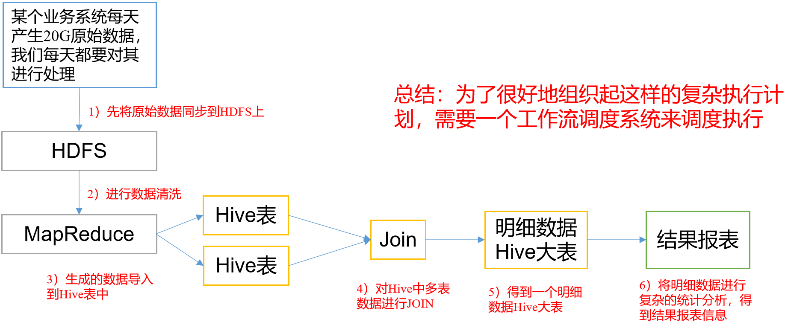

# 概述

## 为什么需要工作流调度系统

- 一个完整的数据分析系统通常都是由大量任务单元组成
  - shell脚本程序，java程序，mapreduce程序、hive脚本等
- 各任务单元之间存在时间先后及前后依赖关系
- 为了很好地组织起这样的复杂执行计划，需要一个工作流调度系统来调度执行
  - 如有这样一个需求，某个业务系统每天产生20G原始数据，每天都要对其进行处理
    - 通过Hadoop先将原始数据上传到HDFS上
      - HDFS的操作
    - 使用MapReduce对原始数据进行清洗
      - MapReduce的操作
    - 将清洗后的数据导入到hive表中
      - hive的导入操作
    - 对Hive中多个表的数据进行JOIN处理，得到一张hive的明细表
      - 创建中间表
    - 通过对明细表的统计和分析，得到结果报表信息
      - hive的查询操作
         
- 常见工作流调度系统
  - 简单的任务调度
    - 直接使用crontab实现
  - 复杂的任务调度
    - 开发调度平台或使用现成的开源调度系统
      - 如ooize、azkaban

## 什么是azkaban

- Azkaban是由Linkedin公司推出的一个批量工作流任务调度器
- 用于在一个工作流内以一个特定的顺序运行一组工作和流程
- 配置是通过简单的key:value对的方式
- 通过配置中的dependencies 来设置依赖关系
- Azkaban使用job配置文件建立任务之间的依赖关系
- 提供一个易于使用的web用户界面维护和跟踪你的工作流

- 区别

  - Oozie

    - workflow.xml，action节点，ok to
    - coordinator.xml 定时调度
    - 所有的信息存储在hdfs上，==依赖hadoop版本==
    - 调用hadoop接口

  - azkaban

    - a.job，dependencies=b.job

    - web

    - 所有调度信息存在mysql上，不依赖hadoop版本

    - 调用hadoop的shell命令

      

## 特点

- 兼容任何版本的hadoop
- 易于使用的Web用户界面
- 简单的工作流的上传
- 方便设置任务之间的关系
- 调度工作流
- 模块化和可插拔的插件机制
- 认证/授权(权限的工作)
- 能够杀死并重新启动工作流
- 有关失败和成功的电子邮件提醒

## 架构

 

- AzkabanWebServer
  - 是整个Azkaban工作流系统的主要管理者
  - 用户登录认证、负责project管理、定时执行工作流、跟踪工作流执行进度等一系列任务
- AzkabanExecutorServer
  - 负责具体的工作流的提交、执行，它们通过mysql数据库来协调任务的执行
- 关系型数据库
  - MySQL
  - 存储大部分执行流状态

