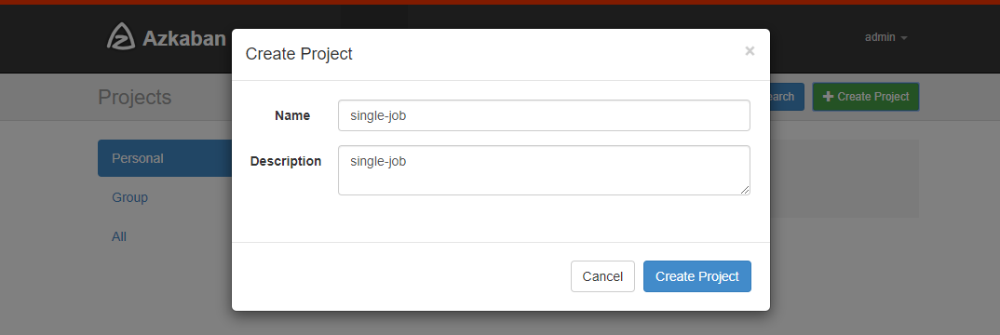
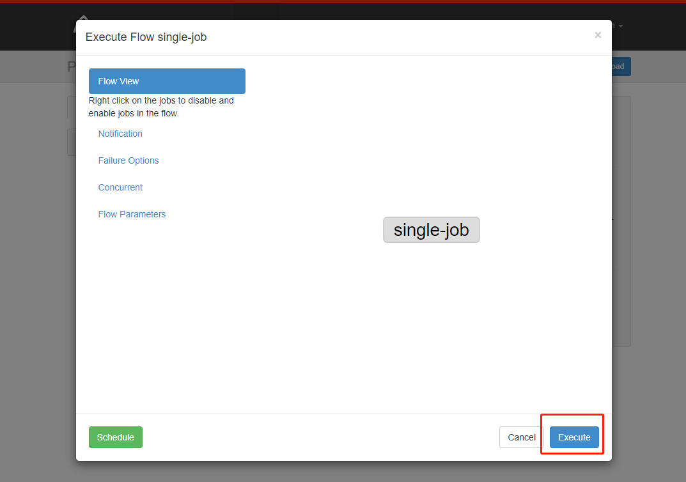
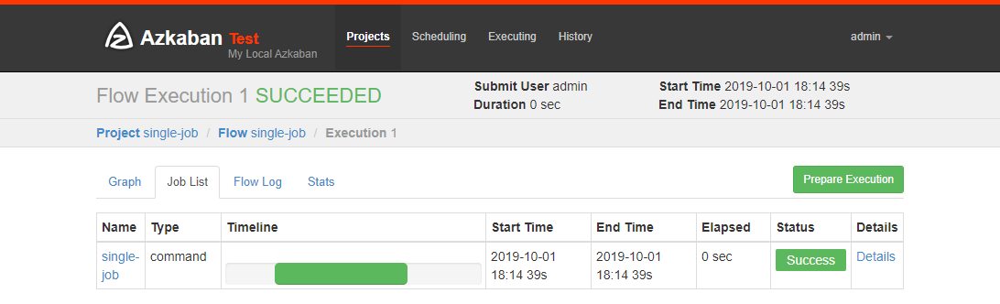
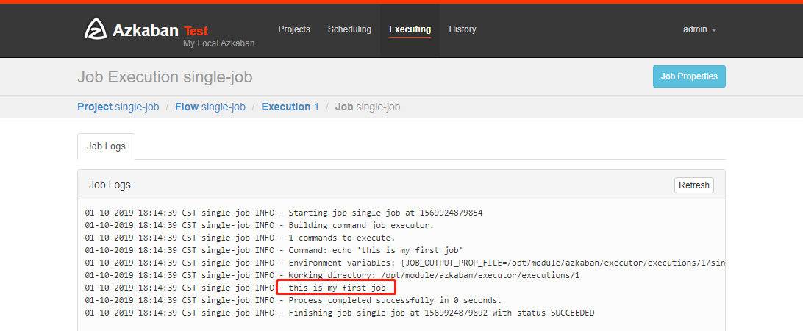
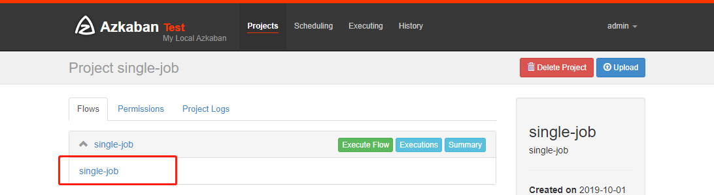
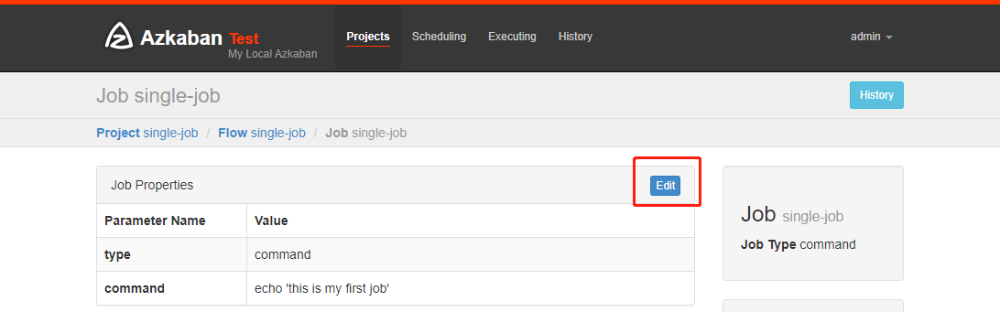
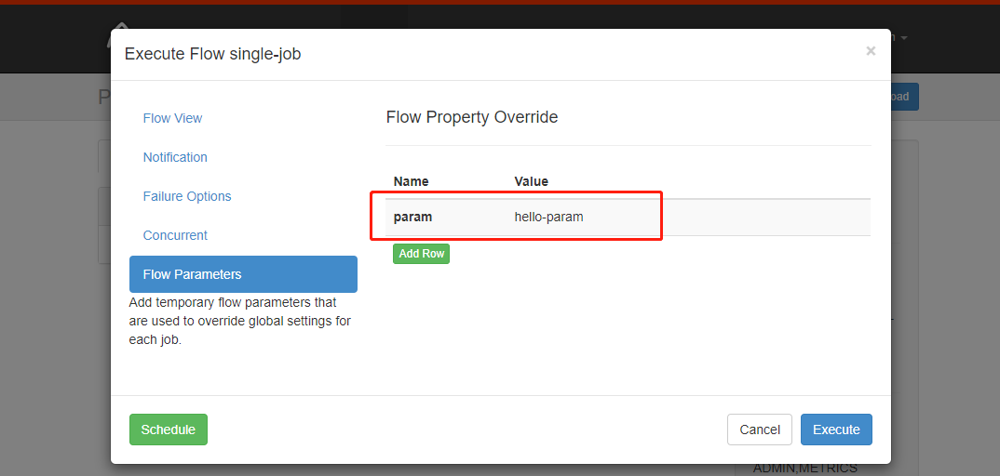

# 使用

- Azkaba内置的任务类型支持
  - command
  - java
- 需要其他类型需要安装插件


## 单一job

- 创建job描述文件

```bash
[ttshe@hadoop103 server]$ mkdir job
[ttshe@hadoop103 server]$ cd job
[ttshe@hadoop103 job]$ vim single-job.job
```

```bash
type=command
command=echo 'this is my first job'
```

- 将job压缩成zip文件

```bash
[ttshe@hadoop103 job]$ zip single-job.zip single-job.job 
  adding: single-job.job (deflated 10%)
```

- Azkaban上传的工作流文件只支持xxx.zip文件
- zip应包含xxx.job运行作业所需的文件和任何文件
  - 文件名后缀必须以.job结尾，否则无法识别
  - 作业名称在项目中必须是唯一的

- 通过azkaban的web管理平台创建project并上传job的zip包
- 创建project

 

- 上传zip文件

 

- 执行工作流

 

- 执行

 

- 点击继续

 

- 执行成功

 

- 点击detail可以查看日志

 


### 页面修改job命令

- 从web页面中修改job，再执行






- 执行之前添加参数，再点击执行




## 多job

- 创建有依赖关系的多个job描述
- start.job

```bash
[ttshe@hadoop102 jobs]$ vim start.job
#start.job
type=command
command=touch /opt/module/kangkang.txt
```

- step1.job
  - step1.job依赖start.job

```bash
[ttshe@hadoop102 jobs]$ vim step1.job
#step1.job
type=command
dependencies=start
command=echo "this is step1 job"
```

- step2.job
  - step2.job依赖start.job

```bash
[ttshe@hadoop102 jobs]$ vim step2.job
#step2.job
type=command
dependencies=start
command=echo "this is step2 job"
```

- finish.job
  - finish.job依赖step1.job和step2.job

```bash
[ttshe@hadoop102 jobs]$ vim finish.job
#finish.job
type=command
dependencies=step1,step2
command=echo "this is finish job"
```

- 将所有job资源文件打到一个zip包中

```bash
[ttshe@hadoop102 jobs]$ zip jobs.zip start.job step1.job step2.job finish.job
updating: start.job (deflated 16%)
  adding: step1.job (deflated 12%)
  adding: step2.job (deflated 12%)
  adding: finish.job (deflated 14%) 
```

- 在azkaban的web管理界面创建工程并上传zip包


- 点击执行，查看结果


- 思考：将student.txt文件上传到hdfs，根据所传文件创建外部表，再将表中查询到的结果写入到本地文件


## java操作任务

- 使用Azkaban调度java程序

```java
import java.io.IOException;

public class AzkabanTest {
	public void run() throws IOException {
        // 根据需求编写具体代码
		FileOutputStream fos = new FileOutputStream("/opt/module/azkaban/output.txt");
		fos.write("this is a java progress".getBytes());
		fos.close();
    }

	public static void main(String[] args) throws IOException {
		AzkabanTest azkabanTest = new AzkabanTest();
		azkabanTest.run();
	}
}
```

- 方式1
  - 将java程序打成jar包，创建lib目录，将jar放入lib内
  - 编写job文件

```bash
[ttshe@hadoop103 azkaban]$ mkdir lib
[ttshe@hadoop103 azkaban]$ cd lib/
[ttshe@hadoop104 lib]$ ll

-rw-r--r--. 1 ttshe ttshe 170136 10月  1 20:01 big-data-0.0.1.jar
```

```text
[atguigu@hadoop102 jobs]$ vim azkabanJava.job
#azkabanJava.job
type=javaprocess
java.class=com.stt.azkaban.AzkabanTest
classpath=/opt/module/azkaban/lib/big-data-0.0.1.jar
```

- 方式2
  - 将java程序的jar包和job文件生成一个zip文件
  - 此时的job文件

```bash
type=javaprocess
java.class=com.stt.demo.azkaban.AzkabanTest
classpath=./big-data-0.0.1.jar
```


## HDFS操作任务

- job文件

```bash
[atguigu@hadoop102 jobs]$ vim fs.job
#hdfs job
type=command
command=/opt/module/hadoop-2.7.2/bin/hadoop fs -mkdir /azkaban
```

- 将job资源文件打包成zip文件
- 通过azkaban的web管理平台创建project并上传job压缩包
- 启动执行该job
- 查看结果


## MapReduce任务

- mapreduce任务依然可以使用azkaban进行调度

- 创建job描述文件，及mr程序jar包

```bash
[atguigu@hadoop102 jobs]$ vim mapreduce.job

type=command
command=/opt/module/hadoop-2.7.2/bin/hadoop jar /opt/module/hadoop-2.7.2/share/hadoop/mapreduce/hadoop-mapreduce-examples-2.7.2.jar wordcount /wordcount/input /wordcount/output
```

- 将所有job资源文件打到一个zip包

- 在azkaban的web管理界面创建工程并上传zip包

- 启动job

- 查看结果


## Hive脚本任务

- 创建job描述文件和hive脚本

- Hive脚本：student.sql

```sql
[atguigu@hadoop102 jobs]$ vim student.sql
use default;
drop table student;
create table student(id int, name string)
row format delimited fields terminated by '\t';
load data local inpath '/opt/module/datas/student.txt' into table student;
insert overwrite local directory '/opt/module/datas/student'
row format delimited fields terminated by '\t'
select * from student;
```

- Job描述文件：hive.job

```job
[atguigu@hadoop102 jobs]$ vim hive.job

type=command
command=/opt/module/hive/bin/hive -f /opt/module/azkaban/jobs/student.sql
```

- 将所有job资源文件打到一个zip包中
- 在azkaban的web管理界面创建工程并上传zip包
- 启动job
- 查看结果

```bash
[atguigu@hadoop102 student]$ cat /opt/module/datas/student/000000_0 

1001    yangyang
1002    huihui
1003    banzhang
1004    pengpeng
```


