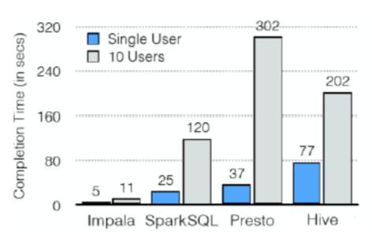
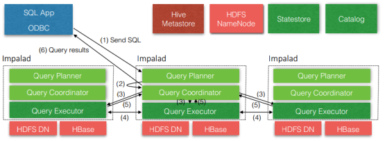
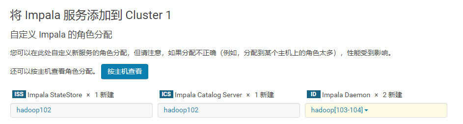
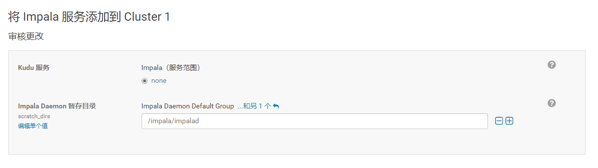
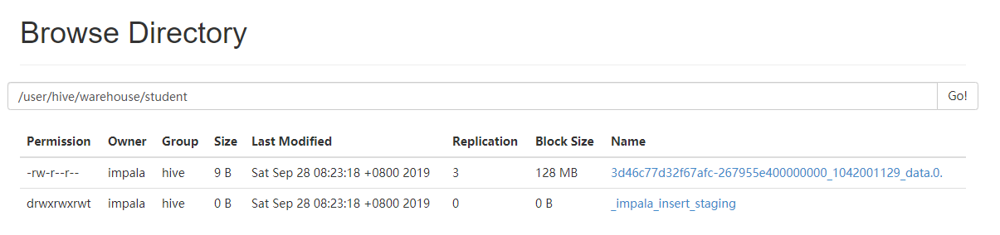
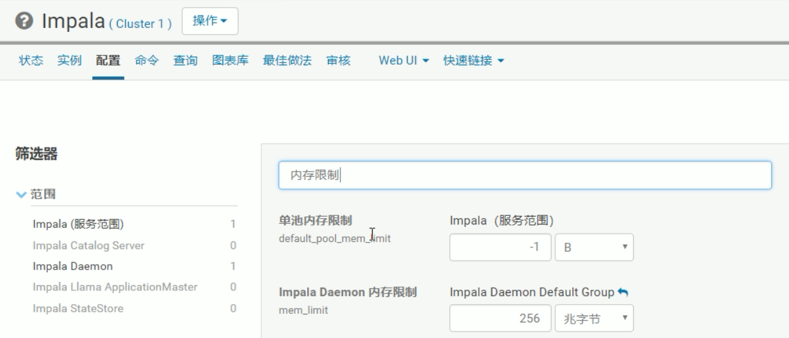

# 概述

- Cloudera公司推出
- 提供对HDFS、Hbase数据的高性能、低延迟的交互式SQL查询功能

- ==基于Hive==，使用==内存计算==，兼顾数据仓库、具有实时、批处理、多并发等优点

- CDH平台首选的PB级大数据实时查询分析引擎


## 优点

- 基于内存运算，不需要把中间结果写入磁盘，省掉了大量的I/O开销

- 无需转换为Mapreduce，直接访问存储在HDFS，HBase中的数据进行作业调度，速度快

- 使用了支持Data locality的I/O调度机制，尽可能地将数据和计算分配在同一台机器上进行，减少了网络开销

- 支持各种文件格式
  - TEXTFILE 
  - SEQUENCEFILE 
  - RCFile
    - orc格式是该格式的优化
  - Parquet
    - 推荐格式

- 可访问hive的metastore，对hive数据直接做数据分析




## 缺点

- 对内存的依赖大，且完全依赖于hive

- 实践中，分区超过1万，性能严重下降
  - 此处分区不是hadoop的分区概念
  - 同hive的分区概念

- 只能读取文本文件，而不能直接读取自定义二进制文件

- 每当新的记录/文件被添加到HDFS中的数据目录时，该表==需要被刷新==
  - 手动刷新
- 不支持hive中的复杂数据类型


## 架构



- 三个模块
  - Impalad
    - 接收client的请求、Query执行并返回给中心协调节点
    - 子节点上的守护进程，负责向statestore保持通信，汇报工作
  - Statestore
    - 负责收集分布在集群中各个impalad进程的资源信息、各节点健康状况，同步节点信息
    - 负责query的协调调度
  - Catalog
    - 从Hive Metastore中获取表元数据
    - 分发表的元数据信息到各个impalad中
    - 接收来自statestore的所有请求
- 依赖
  - Hive Metastore
  - HDFS


## 流程

- Send SQL
  - 客户端发送sql语句给impalad
- Query Planner
  - 接收sql语句，将sql转换为查询计划，给中心协调器

- Query Coordinator
  - 协调器收到查询计划交给执行器
  - 如果查询的数据在当前Coordinator节点上，则直接本地执行器
  - 如果在另外的节点上，则交给另外节点的执行器
  - 将最终结果返回给客户端
- Query Executor
  -  接收到协调器查询请求，查询结果后返回给协调器
  - 执行器之间需要进行交互
    - 数据可能存储在多个节点上


# 安装


## 地址

- impala的官网 http://impala.apache.org/

- Impala文档查看 http://impala.apache.org/impala-docs.html

- 下载地址 http://impala.apache.org/downloads.html


## cdh安装

- 推荐

- 添加服务，选择impala
- 考虑到impala 的daemon占用内存多，因此不部署在hadoop2上
- 最好将StateStore和CataLog Sever单独部署在同一节点上



- 配置



- 点击继续，完成安装


## 手动安装

- 复杂
- 兼容性问题


# 监护管理

- 通过下面的链接来访问Impala的监护管理页面
  - 查看StateStore
    - http://hadoop102:25020/
  - 查看Catalog
    - http://hadoop102:25010/


# 使用


## 连接

```bash
[root@hadoop102 bin]# pwd
/opt/cloudera/parcels/CDH/bin
[root@hadoop102 bin]# impala-shell
# 连接失败，由于hadoop102没有安装impala-deamon

[root@hadoop103 bin]# impala-shell 
Starting Impala Shell without Kerberos authentication
Connected to hadoop103:21000
```

- 使用帮助查看连接

```bash
[root@hadoop102 bin]# impala-shell -help
Usage: impala_shell.py [options]

Options:
  -h, --help            show this help message and exit
  -i IMPALAD, --impalad=IMPALAD
                        <host:port> of impalad to connect to
                        [default: hadoop102:21000]
  -q QUERY, --query=QUERY
                        Execute a query without the shell [default: none]
  -f QUERY_FILE, --query_file=QUERY_FILE
                        Execute the queries in the query file, delimited by ;
                        [default: none]
  -k, --kerberos        Connect to a kerberized impalad [default: False]
  -o OUTPUT_FILE, --output_file=OUTPUT_FILE
                        If set, query results are written to the given file.
                        Results from multiple semicolon-terminated queries
                        will be appended to the same file [default: none]
  -B, --delimited       Output rows in delimited mode [default: False]
  --print_header        Print column names in delimited mode when pretty-
                        printed. [default: False]
  --output_delimiter=OUTPUT_DELIMITER
                        Field delimiter to use for output in delimited mode
                        [default: \t]
  -s KERBEROS_SERVICE_NAME, --kerberos_service_name=KERBEROS_SERVICE_NAME
                        Service name of a kerberized impalad [default: impala]
  -V, --verbose         Verbose output [default: True]
  -p, --show_profiles   Always display query profiles after execution
                        [default: False]
  --quiet               Disable verbose output [default: False]
  -v, --version         Print version information [default: False]
  -c, --ignore_query_failure
                        Continue on query failure [default: False]
  -r, --refresh_after_connect
                        Refresh Impala catalog after connecting
                        [default: False]
  -d DEFAULT_DB, --database=DEFAULT_DB
                        Issues a use database command on startup
                        [default: none]
  -l, --ldap            Use LDAP to authenticate with Impala. Impala must be
                        configured to allow LDAP authentication.
                        [default: False]
  -u USER, --user=USER  User to authenticate with. [default: root]
  --ssl                 Connect to Impala via SSL-secured connection
                        [default: False]
  --ca_cert=CA_CERT     Full path to certificate file used to authenticate
                        Impala's SSL certificate. May either be a copy of
                        Impala's certificate (for self-signed certs) or the
                        certificate of a trusted third-party CA. If not set,
                        but SSL is enabled, the shell will NOT verify Impala's
                        server certificate [default: none]
  --config_file=CONFIG_FILE
                        Specify the configuration file to load options. File
                        must have case-sensitive '[impala]' header. Specifying
                        this option within a config file will have no effect.
                        Only specify this as a option in the commandline.
                        [default: /root/.impalarc]
  --live_summary        Print a query summary every 1s while the query is
                        running. [default: False]
  --live_progress       Print a query progress every 1s while the query is
                        running. [default: False]
  --auth_creds_ok_in_clear
                        If set, LDAP authentication may be used with an
                        insecure connection to Impala. WARNING: Authentication
                        credentials will therefore be sent unencrypted, and
                        may be vulnerable to attack. [default: none]
  --ldap_password_cmd=LDAP_PASSWORD_CMD
                        Shell command to run to retrieve the LDAP password
                        [default: none]
  --var=KEYVAL          Define variable(s) to be used within the Impala
                        session. [default: none]
```

- 使用-i进行连接

```bash
[root@hadoop102 bin]# impala-shell -i hadoop104
Starting Impala Shell without Kerberos authentication
Connected to hadoop104:21000
Server version: impalad version 2.9.0-cdh5.12.1 RELEASE (build 5131a031f4aa38c1e50c430373c55ca53e0517b9)
***********************************************************************************
Welcome to the Impala shell.
(Impala Shell v2.9.0-cdh5.12.1 (5131a03) built on Thu Aug 24 09:27:32 PDT 2017)

To see a summary of a query's progress that updates in real-time, run 'set
LIVE_PROGRESS=1;'.
***********************************************************************************
```


## 简单操作

- 创建数据库，创建表

```bash
[hadoop103:21000] > show databases;
Query: show databases
+------------------+----------------------------------------------+
| name             | comment                                      |
+------------------+----------------------------------------------+
| _impala_builtins | System database for Impala builtin functions |
| default          | Default Hive database                        |
+------------------+----------------------------------------------+
Fetched 2 row(s) in 0.18s

[hadoop103:21000] > use default;
Query: use default

[hadoop103:21000] > show tables;
Query: show tables

Fetched 0 row(s) in 0.02s

[hadoop103:21000] > create table student(id int,name string)
                  > row format delimited
                  > fields terminated by '\t';
Query: create table student(id int,name string)
row format delimited
fields terminated by '\t'

Fetched 0 row(s) in 0.34s

[hadoop103:21000] > show tables;
Query: show tables
+---------+
| name    |
+---------+
| student |
+---------+
Fetched 1 row(s) in 0.01s
```

- 插入数据
  - 与Hive的区别，没有MR过程

```sql
[hadoop103:21000] > insert into table student values (1001,"stt");
Query: insert into table student values (1001,"stt")
Query submitted at: 2019-09-28 08:23:18 (Coordinator: http://hadoop103:25000)
Query progress can be monitored at: http://hadoop103:25000/query_plan?query_id=3d46c77d32f67afc:267955e400000000
Modified 1 row(s) in 3.62s
```

- 查看创建表的文件夹
  - 注意：如果没有修改文件夹的权限，会有创建表失败的情况



- 查询

```sql
[hadoop103:21000] > select * from student;
```

- 退出

```sql
[hadoop103:21000] > quit;
```

- 注意
  - 关闭（修改hdfs的配置dfs.permissions为false）或修改hdfs的权限，否则impala没有写的权限
  - Impala不支持将本地文件导入到表中

```bash
[hdfs@hadoop103 ~]$ hadoop fs -chmod -R 777 /
```

- 导入数据

```bash
[hadoop103:21000] > load data inpath '/student.txt' into table student;
```

- 查看版本

```bash
[root@hadoop102 bin]# impala-shell -v
Impala Shell v2.9.0-cdh5.12.1 (5131a03) built on Thu Aug 24 09:27:32 PDT 2017
```


# 操作命令


## 外部shell

- 进入impala之前的命令

| 选项                                    | 描述                                                         |
| --------------------------------------- | ------------------------------------------------------------ |
| -h, --help                              | 显示帮助信息                                                 |
| -v or --version                         | 显示版本信息                                                 |
| -i hostname, --impalad=hostname         | 指定连接运行 impalad 守护进程的主机；默认端口是 21000        |
| -q query, --query=query                 | ==从命令行中传递一个shell 命令。执行完这一语句后 shell 会立即退出== |
| -f query_file, --query_file= query_file | ==传递一个文件中的 SQL 查询。文件内容必须以分号分隔==        |
| -o filename or --output_file filename   | ==保存所有查询结果到指定的文件。通常用于保存在命令行使用 -q 选项执行单个查询时的查询结果== |
| -c                                      | 查询执行失败时继续执行                                       |
| -d default_db or --database=default_db  | 指定启动后使用的数据库，与建立连接后使用use语句选择数据库作用相同，如果没有指定，那么使用default数据库 |
| -r or --refresh_after_connect           | ==建立连接后刷新 Impala 元数据==                             |
| -p, --show_profiles                     | ==对 shell 中执行的每一个查询，显示其查询执行计划==          |
| -B（--delimited）                       | 去格式化输出                                                 |
| --output_delimiter=character            | 指定分隔符                                                   |
| --print_header                          | 打印列名                                                     |
| -V --verbose                            | 显示详细信息，默认开启                                       |
|                                         | 不打印详细信息，与-V相反                                     |


### 连接指定主机

```bash
[root@hadoop102 bin]# impala-shell -i hadoop103
```


### 使用-q查询-o导出

```bash
[root@hadoop102 bin]# impala-shell -i hadoop103 -q 'select * from student;'
Starting Impala Shell without Kerberos authentication
Connected to hadoop103:21000
Server version: impalad version 2.9.0-cdh5.12.1 RELEASE (build 5131a031f4aa38c1e50c430373c55ca53e0517b9)
Query: select * from student
Query submitted at: 2019-09-28 08:56:13 (Coordinator: http://hadoop103:25000)
Query progress can be monitored at: http://hadoop103:25000/query_plan?query_id=e042749a45f4004d:3cf9e6d000000000
+------+------+
| id   | name |
+------+------+
| 1001 | stt  |
+------+------+
Fetched 1 row(s) in 0.13s

[root@hadoop102 bin]# impala-shell -i hadoop103 -q 'select * from student;' -o /opt/software/impala.txt
[root@hadoop102 bin]# cat /opt/software/impala.txt 
+------+------+
| id   | name |
+------+------+
| 1001 | stt  |
+------+------+
```


### 使用-f执行sql脚本

```bash
[root@hadoop102 bin]# vim /opt/software/impala-sql.txt
[root@hadoop102 bin]# cat /opt/software/impala-sql.txt 
select * from student;
select * from stu;
select * from student;

[root@hadoop102 bin]# impala-shell -i hadoop103 -f /opt/software/impala-sql.txt
Starting Impala Shell without Kerberos authentication
Connected to hadoop103:21000
Server version: impalad version 2.9.0-cdh5.12.1 RELEASE (build 5131a031f4aa38c1e50c430373c55ca53e0517b9)
Query: select * from student
Query submitted at: 2019-09-28 09:00:22 (Coordinator: http://hadoop103:25000)
Query progress can be monitored at: http://hadoop103:25000/query_plan?query_id=e14b86b04a6ea763:93c6393400000000
+------+------+
| id   | name |
+------+------+
| 1001 | stt  |
+------+------+
Fetched 1 row(s) in 0.12s
Query: select * from stu
Query submitted at: 2019-09-28 09:00:23 (Coordinator: http://hadoop103:25000)
ERROR: AnalysisException: Could not resolve table reference: 'stu'

Could not execute command: select * from stu
```


### 失败后继续执行-c

- 上例中有失败的情况
  - -c 表示跳过失败查询

```bash
[root@hadoop102 bin]# impala-shell -i hadoop103 -c -f /opt/software/impala-sql.txt
Starting Impala Shell without Kerberos authentication
Connected to hadoop103:21000
Server version: impalad version 2.9.0-cdh5.12.1 RELEASE (build 5131a031f4aa38c1e50c430373c55ca53e0517b9)
Query: select * from student
Query submitted at: 2019-09-28 09:01:38 (Coordinator: http://hadoop103:25000)
Query progress can be monitored at: http://hadoop103:25000/query_plan?query_id=dd48105bf5a2a518:eb0ad3c700000000
+------+------+
| id   | name |
+------+------+
| 1001 | stt  |
+------+------+
Fetched 1 row(s) in 0.12s
Query: select * from stu
Query submitted at: 2019-09-28 09:01:39 (Coordinator: http://hadoop103:25000)
ERROR: AnalysisException: Could not resolve table reference: 'stu'

Could not execute command: select * from stu
Query: select * from student
Query submitted at: 2019-09-28 09:01:39 (Coordinator: http://hadoop103:25000)
Query progress can be monitored at: http://hadoop103:25000/query_plan?query_id=bc428ae48c3cdb01:b1bae83400000000
+------+------+
| id   | name |
+------+------+
| 1001 | stt  |
+------+------+
Fetched 1 row(s) in 0.12s
```


### 去结果显示格式-B

- 去除了头部
- 添加分隔符号是\t

```bash
[root@hadoop102 bin]# impala-shell -i hadoop103 -q "select * from student;" -B
...
1001	stt
Fetched 1 row(s) in 0.13s
```

- 指定分隔符
  - --quiet 表示不打印详细过程

```bash
[root@hadoop102 bin]# impala-shell -i hadoop103 -q "select * from student;" -B --output_delimiter=':' --quiet
Starting Impala Shell without Kerberos authentication
1001:stt
```

- 显示头部

```bash
[root@hadoop102 bin]# impala-shell -i hadoop103 -q "select * from student;" -B --output_delimiter=':' --print_header
...
id:name
1001:stt
Fetched 1 row(s) in 0.12s
```


### 刷新元数据 -r 

- 使用hive创建一个表

```bash
hive> create table stu(id int,name string);
```

- 查询

```bash
[root@hadoop102 bin]# impala-shell -i hadoop103
[hadoop103:21000] > show tables;
Query: show tables
+---------+
| name    |
+---------+
| student |
+---------+

[root@hadoop102 bin]# impala-shell -r -i hadoop103
[hadoop103:21000] > show tables;
Query: show tables
+---------+
| name    |
+---------+
| stu     |
| student |
+---------+
```


### 显示执行计划 -p

```bash
[root@hadoop102 bin]# impala-shell -i hadoop103 -p
[hadoop103:21000] > select * from student;
Query: select * from student
Query submitted at: 2019-09-28 09:18:28 (Coordinator: http://hadoop103:25000)
Query progress can be monitored at: http://hadoop103:25000/query_plan?query_id=e446a2f64d5cb720:4cdfa00800000000
+------+------+
| id   | name |
+------+------+
| 1001 | stt  |
+------+------+
Fetched 1 row(s) in 0.12s
Query Runtime Profile:
Query (id=e446a2f64d5cb720:4cdfa00800000000):
  Summary: # 摘要
    Session ID: 5446b12cbfa2b30d:21509234cc022586
    Session Type: BEESWAX
    Start Time: 2019-09-28 09:18:32.624079000
    End Time: 2019-09-28 09:18:32.745490000
    Query Type: QUERY
    Query State: FINISHED
    Query Status: OK
    Impala Version: impalad version 2.9.0-cdh5.12.1 RELEASE (build 5131a031f4aa38c1e50c430373c55ca53e0517b9)
    User: root
    Connected User: root
    Delegated User: 
    Network Address: ::ffff:192.168.1.102:39384
    Default Db: default
    Sql Statement: select * from student
    Coordinator: hadoop103:22000
    Query Options (non default): MT_DOP=0
    Plan: 
----------------
Per-Host Resource Reservation: Memory=0B
Per-Host Resource Estimates: Memory=32.00MB
WARNING: The following tables are missing relevant table and/or column statistics.
default.student
...

F01:PLAN FRAGMENT [UNPARTITIONED] hosts=1 instances=1
PLAN-ROOT SINK
|  mem-estimate=0B mem-reservation=0B
|
01:EXCHANGE [UNPARTITIONED]
|  mem-estimate=0B mem-reservation=0B
|  tuple-ids=0 row-size=19B cardinality=unavailable
|
F00:PLAN FRAGMENT [RANDOM] hosts=1 instances=1
00:SCAN HDFS [default.student, RANDOM]
...
# 每步执行的时间和占用的内存
Operator       #Hosts  Avg Time  Max Time  #Rows  Est. #Rows  Peak Mem  Est. Peak Mem  Detail          
-------------------------------------------------------------------------------------------------------
01:EXCHANGE         1   6.483us   6.483us      1          -1         0              0  UNPARTITIONED   
00:SCAN HDFS        1  11.943ms  11.943ms      1          -1  43.00 KB       32.00 MB  default.student 
...

```


### 进入数据库-d

- 在连接时，定义连接的数据库


## 内部shell

- 进入impala之后的命令

| 选项                | 描述                                                  |
| ------------------- | ----------------------------------------------------- |
| help                | 显示帮助信息                                          |
| explain <sql>       | 显示执行计划                                          |
| profile             | (查询完成后执行） 查询最近一次查询的底层信息          |
| shell <shell>       | ==不退出impala-shell执行shell命令==                   |
| version             | 显示版本信息（同于impala-shell -v）                   |
| connect             | 连接impalad主机，默认端口21000（同于impala-shell -i） |
| refresh <tablename> | ==增量刷新元数据库==                                  |
| invalidate metadata | ==全量刷新元数据库（慎用，同于 impala-shell -r）==    |
| history             | 历史命令                                              |


### 查看帮助

- 分为有文档和无文档

```bash
[hadoop103:21000] > help;

Documented commands (type help <topic>):
========================================
compute  describe  explain  profile  select  shell  tip    use     version
connect  exit      history  quit     set     show   unset  values  with   

Undocumented commands:
======================
alter   delete  drop  insert  source  summary  upsert
create  desc    help  load    src     update 

```


### 查看版本

```bash
[hadoop103:21000] > version;
Shell version: Impala Shell v2.9.0-cdh5.12.1 (5131a03) built on Thu Aug 24 09:27:32 PDT 2017
Server version: impalad version 2.9.0-cdh5.12.1 RELEASE (build 5131a031f4aa38c1e50c430373c55ca53e0517b9)
```

#### 注意

- 这里显示的版本和外部shell的显示的版本信息不同
- 之后升级需要考虑到impala Shell的版本要与Server的版本之间的兼容


### 连接

- 连接其他的节点，与外部shell的-i功能类似

```bash
[hadoop103:21000] > connect hadoop104;
Connected to hadoop104:21000
Server version: impalad version 2.9.0-cdh5.12.1 RELEASE (build 5131a031f4aa38c1e50c430373c55ca53e0517b9)
[hadoop104:21000] > 
```


### 设置&取消设置参数

- 查看可以设置的参数

```bash
[hadoop104:21000] > set;
Query options (defaults shown in []):
	ABORT_ON_DEFAULT_LIMIT_EXCEEDED: [0]
	ABORT_ON_ERROR: [0]
	ALLOW_UNSUPPORTED_FORMATS: [0]
...
```

- 取消设置

```bash
unset xxx;
```


### 显示执行计划摘要

```sql
[hadoop103:21000] > explain select * from student;
Query: explain select * from student
+------------------------------------------------------------------------------------+
| Explain String                                                                     |
+------------------------------------------------------------------------------------+
| Per-Host Resource Reservation: Memory=0B                                           |
| Per-Host Resource Estimates: Memory=32.00MB                                        |
| WARNING: The following tables are missing relevant table and/or column statistics. |
| default.student                                                                    |
|                                                                                    |
| PLAN-ROOT SINK                                                                     |
| |                                                                                  |
| 01:EXCHANGE [UNPARTITIONED]                                                        |
| |                                                                                  |
| 00:SCAN HDFS [default.student]                                                     |
|    partitions=1/1 files=1 size=9B                                                  |
+------------------------------------------------------------------------------------+
Fetched 11 row(s) in 0.01s
```


### 显示执行计划详细

- 与外部shell的-p功能一致

```bash
[hadoop103:21000] > select * from student;
...
[hadoop103:21000] > profile ;

Query Runtime Profile:
Query (id=5474ff38116471b:b18f546000000000):
  Summary:
    Session ID: 31419f99f3ca96ee:8f46cd763e1170ac
    Session Type: BEESWAX
    Start Time: 2019-09-28 09:27:14.347046000
    End Time: 2019-09-28 09:27:14.466954000
    Query Type: QUERY
    Query State: FINISHED
    Query Status: OK
    Impala Version: impalad version 2.9.0-cdh5.12.1 RELEASE (build 5131a031f4aa38c1e50c430373c55ca53e0517b9)
    User: root
    Connected User: root
    Delegated User: 
    Network Address: ::ffff:192.168.1.103:37332
    Default Db: default
    Sql Statement: select * from student
    Coordinator: hadoop103:22000
    Query Options (non default): MT_DOP=0
    Plan: 
----------------
Per-Host Resource Reservation: Memory=0B
Per-Host Resource Estimates: Memory=32.00MB
WARNING: The following tables are missing relevant table and/or column statistics.
default.student

F01:PLAN FRAGMENT [UNPARTITIONED] hosts=1 instances=1
PLAN-ROOT SINK
|  mem-estimate=0B mem-reservation=0B
|
01:EXCHANGE [UNPARTITIONED]
|  mem-estimate=0B mem-reservation=0B
|  tuple-ids=0 row-size=19B cardinality=unavailable
|
F00:PLAN FRAGMENT [RANDOM] hosts=1 instances=1
00:SCAN HDFS [default.student, RANDOM]
...
Operator       #Hosts  Avg Time  Max Time  #Rows  Est. #Rows  Peak Mem  Est. Peak Mem  Detail          
-------------------------------------------------------------------------------------------------------
01:EXCHANGE         1   9.005us   9.005us      1          -1         0              0  UNPARTITIONED   
00:SCAN HDFS        1  11.051ms  11.051ms      1          -1  43.00 KB       32.00 MB  default.student 
...
```


### 执行shell命令


#### 查看hdfs

```bash
[hadoop103:21000] > shell hadoop fs -ls /;
Found 3 items
-rw-r--r--   3 root supergroup      72312 2019-09-28 03:30 /manifest.json
drwxrwxrwt   - hdfs supergroup          0 2019-09-28 03:22 /tmp
drwxrwxrwx   - hdfs supergroup          0 2019-09-28 07:40 /user
--------
Executed in 1.53s
```


#### 执行 ls /

```bash
[hadoop103:21000] > shell ls /;
bin   dev  etc	 impala  lib64	     media  mnt  opt   root  selinux  sys  usr	yarn
boot  dfs  home  lib	 lost+found  misc   net  proc  sbin  srv      tmp  var
--------
Executed in 0.00s
```


### 刷新数据

```bash
hive> load data local inpath '/opt/module/datas/student.txt' into table student;

[hadoop103:21000] > select * from student;
[hadoop103:21000] > refresh student;
[hadoop103:21000] > select * from student;
```

- 使用hive插入数据之后，impala查询需要进行刷新操作


### 查看历史

```bash
[hadoop103:21000] > history;
```


# 数据类型

- 与Hive基本一致

| Hive数据类型 | Impala数据类型 | 长度                                             |
| ------------ | -------------- | ------------------------------------------------ |
| TINYINT      | TINYINT        | 1byte有符号整数                                  |
| SMALINT      | SMALINT        | 2byte有符号整数                                  |
| INT          | INT            | ==4byte有符号整数==                              |
| BIGINT       | BIGINT         | ==8byte有符号整数==，java中是Long                |
| BOOLEAN      | BOOLEAN        | 布尔类型，true或者false                          |
| FLOAT        | FLOAT          | 单精度浮点数                                     |
| DOUBLE       | DOUBLE         | ==双精度浮点数==                                 |
| STRING       | STRING         | ==字符系列。可指定字符集，使用单引号或者双引号== |
| TIMESTAMP    | TIMESTAMP      | 时间类型                                         |
| BINARY       | ==不支持==     | 字节数组                                         |

- Impala支持array，map，struct复杂数据类型
  - 支持并不完全，一般处理方法，将复杂类型转化为基本类型，通过hive创建表
  - 使用hive的复杂数据类型以Parquet格式存储
    - 可以查询到基本数据类型的值，复杂数据类型的值忽略
    - 如果不是Parquet格式存储，则含有复杂数据类型会报错


# DDL


## 创建数据库

```sql
CREATE DATABASE [IF NOT EXISTS] database_name
  [COMMENT database_comment]
  [LOCATION hdfs_path];
```

- impala不支持WITH DBPROPERTIE…语法

```sql
[hadoop103:21000] > create database db_hive WITH DBPROPERTIES('name' = 'ttt');
Query: create database db_hive
WITH DBPROPERTIES('name' = 'ttt')
ERROR: AnalysisException: Syntax error in line 2:
WITH DBPROPERTIES('name' = 'ttt')
^
Encountered: WITH
Expected: COMMENT, LOCATION
```

- 正常创建

```bash
create database impala_db
location '/impala_db';
```


## 查询数据库信息

- 基本信息

```bash
[hadoop104:21000] > desc database impala_db ;
Query: describe database impala_db
+-----------+---------------------------------+---------+
| name      | location                        | comment |
+-----------+---------------------------------+---------+
| impala_db | hdfs://hadoop102:8020/impala_db |         |
+-----------+---------------------------------+---------+
Fetched 1 row(s) in 0.02s
```

- 详细信息

```bash
[hadoop104:21000] > desc database extended impala_db;
```


## 显示数据库

```bash
[hadoop104:21000] > show databases;

Query: show databases
+------------------+----------------------------------------------+
| name             | comment                                      |
+------------------+----------------------------------------------+
| _impala_builtins | System database for Impala builtin functions |
| default          | Default Hive database                        |
| impala_db        |                                              |
+------------------+----------------------------------------------+
Fetched 3 row(s) in 0.00s

[hadoop104:21000] > show databases like 'impala*';

Query: show databases like 'impala*'
+-----------+---------+
| name      | comment |
+-----------+---------+
| impala_db |         |
+-----------+---------+
Fetched 1 row(s) in 0.01s
```

- Impala不支持alter database语法


## 删除数据库

```bash
[hadoop103:21000] > drop database impala_db;
# 强制删除
[hadoop103:21000] > drop database hive_db cascade;
```

- 注意：当数据库被 USE 语句选中时，无法删除


## 内部表（管理表）

- 与Hive相同

```bash
[hadoop103:21000] > create table if not exists student2(
                  > id int, name string
                  > )
                  > row format delimited fields terminated by '\t'
                  > stored as textfile
                  > location '/user/hive/warehouse/student2';
[hadoop103:21000] > desc formatted student2;
```

- 注意：一般不要创建内部表
  - 删除之后hdfs会被删除
  - location不要直接写"/"


## 外部表

```bash
[hadoop103:21000] > create external table stu_external(
                  > id int, 
                  > name string) 
                  > row format delimited fields terminated by '\t' ;
```


## 查看表的信息

```bash
[hadoop104:21000] > desc formatted stu;
```


## 分区表

- 分区字段是伪列，不能是创建的列元素

### 创建

```sql
create table stu_par(id int,name string)
partitioned by (month string)
row format delimited
fields terminated by '\t';
```


### 导入数据

```bash
[hadoop103:21000] > alter table stu_par add partition (month='201810');
[hadoop103:21000] > load data inpath '/student.txt' into table stu_par partition(month='201810');
[hadoop103:21000] > insert into table stu_par partition (month = '201811')
                  > select * from student;
```

- 如果分区没有，load data导入数据时，不能自动创建分区
- 不支持load local 本地导入数据
- 支持hdfs导入数据


### 查询

```sql
[hadoop103:21000] > select * from stu_par where month = '201811';
```


### 增加多个分区

- 同Hive

```sql
[hadoop103:21000] > alter table stu_par add partition (month='201812') partition (month='201813');
```


### 删除分区

- 不支持同时删除多个分区操作

```bash
[hadoop103:21000] > alter table stu_par drop partition (month='201812');
```


### 查看分区

```sql
[hadoop103:21000] > show partitions stu_par;
```


# DML


## 数据导入

- 注意：impala不支持load data local inpath…
- 基本同Hive


## 数据导出

- impala不支持insert overwrite…语法导出数据
- Impala 不支持export和import命令
- impala 数据导出一般使用 impala -o

```sql
[root@hadoop103 ~]# impala-shell -q 'select * from student' -B --output_delimiter="\t" -o output.txt
[root@hadoop103 ~]# cat output.txt 
1001    tignitgn
1002    yuanyuan
1003    haohao
1004    yunyun
```


# 查询

- 基本的语法跟hive的查询语句大体一样

- Impala
  - 不支持CLUSTER BY, DISTRIBUTE BY, SORT BY
  - 不支持分桶表
  - 不支持COLLECT_SET(col)和explode（col）函数
  - 由于Impala没有MR，因此不支持

- Impala支持开窗函数

```sql
[hadoop103:21000] > select name,orderdate,cost,sum(cost) over(partition by month(orderdate)) from business;
```


# 函数


## 自定义函数

- 和Hive的自定义函数类似

### pom

```xml
<dependencies>
    <!-- https://mvnrepository.com/artifact/org.apache.hive/hive-exec -->
    <dependency>
        <groupId>org.apache.hive</groupId>
        <artifactId>hive-exec</artifactId>
        <version>1.2.1</version>
    </dependency>
</dependencies>
```


### java

```java
package com.atguigu.hive;
import org.apache.hadoop.hive.ql.exec.UDF;
public class Lower extends UDF {
	public String evaluate (final String s) {
		if (s == null) {
			return null;
		}
		return s.toLowerCase();
	}
}
```


### 操作

- 打成jar包上传到服务器/opt/module/jars/ hive_udf-0.0.1-SNAPSHOT.jar
- 将jar包上传到hdfs的指定目录

```bash
hadoop fs -put hive_udf-0.0.1-SNAPSHOT.jar /
```


### 创建函数

- 这里与Hive有所区别

```bash
[hadoop103:21000] > create function mylower(string) returns string location '/hive_udf-0.0.1-SNAPSHOT.jar' symbol='com.atguigu.hive_udf.Hive_UDF';
```


### 使用

```sql
[hadoop103:21000] > select ename, mylower(ename) from emp;
```

- 通过show functions查看自定义的函数

```bash
[hadoop103:21000] > show functions;
Query: show functions
+-------------+-----------------+-------------+---------------+
| return type | signature       | binary type | is persistent |
+-------------+-----------------+-------------+---------------+
| STRING      | mylower(STRING) | JAVA        | false         |
+-------------+-----------------+-------------+---------------+
```


# 存储和压缩

- 存储格式不支持ORC

| 文件格式     | 压缩编码                     | Impala是否可直接创建                                         | 是否可直接插入                                               |
| ------------ | ---------------------------- | ------------------------------------------------------------ | ------------------------------------------------------------ |
| Parquet      | Snappy（默认）, GZIP;        | Yes                                                          | 支持：CREATE TABLE, INSERT, 查询                             |
| TextFile     | LZO，gzip，bzip2，snappy     | Yes. 不指定 STORED AS 子句的 CREATE TABLE 语句，默认的文件格式就是未压缩文本 | 支持：CREATE TABLE, INSERT, 查询。如果使用 LZO 压缩，则必须在 Hive 中创建表和加载数据 |
| RCFile       | Snappy, GZIP, deflate, BZIP2 | Yes.                                                         | 支持CREATE，查询，在 Hive 中加载数据                         |
| SequenceFile | Snappy, GZIP, deflate, BZIP2 | Yes.                                                         | 支持：CREATE TABLE, INSERT, 查询。需设置                     |

- impala不支持ORC格式

- 创建parquet格式并插入数据进行查询

```bash
[hadoop104:21000] > create table student2(id int, name string)
                  > row format delimited 
                  > fields terminated by '\t'
                  > stored as PARQUET;
[hadoop104:21000] > insert into table student2 values(1001,'zhangsan');
[hadoop104:21000] > select * from student2;
```

- 创建sequenceFile格式的表，插入数据时报错

```bash
[hadoop104:21000] > create table student3(id int, name string)
                  > row format delimited 
                  > fields terminated by '\t'
                  > stored as sequenceFile;
[hadoop104:21000] > insert into table student3 values(1001,'zhangsan');
Query: insert into table student3 values(1001,'zhangsan')
Query submitted at: 2018-10-25 20:59:31 (Coordinator: http://hadoop104:25000)
Query progress can be monitored at: http://hadoop104:25000/query_plan?query_id=da4c59eb23481bdc:26f012ca00000000
WARNINGS: Writing to table format SEQUENCE_FILE is not supported. Use query option ALLOW_UNSUPPORTED_FORMATS to override.
[hadoop104:21000] > set ALLOW_UNSUPPORTED_FORMATS=true;
[hadoop104:21000] > insert into table student3 values(1001,'zhangsan');
```

- 设置压缩格式
  - 设置压缩格式为gzip
  - 注意导入数据和存储的格式是两个独立的配置
  - 恢复默认配置使用unset

```bash
set COMPRESSION_CODEC=gzip;
```


# 优化

- 尽量将StateStore和Catalog单独部署到同一个节点，保证他们正常通信

- 通过对Impala Daemon内存限制（默认256M）及StateStore工作线程数，来提高Impala的执行效率




- SQL优化，使用之前调用执行计划

- 选择合适的文件格式进行存储，提高查询效率

- 避免产生很多小文件
  - 如果有其他程序产生的小文件，使用中间表，将小文件数据存放到中间表，然后通过insert…select…方式中间表的数据插入到最终表中

- 使用合适的分区技术，根据分区粒度测算

- 使用compute stats进行表信息搜集，当一个内容表或分区明显变化，重新计算统计相关数据表或分区
  - 行和不同值的数量差异可能导致impala选择不同的连接顺序时进行查询

```bash
[hadoop104:21000] > show table stats student;
Query: show table stats student
+-------+--------+------+--------------+-------------------+--------+-------------------+---------------------------------------------------+
| #Rows | #Files | Size | Bytes Cached | Cache Replication | Format | Incremental stats | Location                                          |
+-------+--------+------+--------------+-------------------+--------+-------------------+---------------------------------------------------+
| -1    | 1      | 67B  | NOT CACHED   | NOT CACHED        | TEXT   | false             | hdfs://hadoop102:8020/user/hive/warehouse/student |
+-------+--------+------+--------------+-------------------+--------+-------------------+---------------------------------------------------+
[hadoop104:21000] > compute stats student;
Query: compute stats student
+-----------------------------------------+
| summary                                 |
+-----------------------------------------+
| Updated 1 partition(s) and 2 column(s). |
+-----------------------------------------+
[hadoop104:21000] > show table stats student;
Query: show table stats student
+-------+--------+------+--------------+-------------------+--------+-------------------+---------------------------------------------------+
| #Rows | #Files | Size | Bytes Cached | Cache Replication | Format | Incremental stats | Location                                          |
+-------+--------+------+--------------+-------------------+--------+-------------------+---------------------------------------------------+
| 6     | 1      | 67B  | NOT CACHED   | NOT CACHED        | TEXT   | false             | hdfs://hadoop102:8020/user/hive/warehouse/student |
+-------+--------+------+--------------+-------------------+--------+-------------------+---------------------------------------------------+
```

- 网络io的优化
  - 避免把整个数据发送到客户端
  - 尽可能的做条件过滤
  - 使用limit字句
  - 输出文件时，避免使用美化输出
  - 尽量少用全量元数据的刷新

- 使用profile输出底层信息计划，在做相应环境优化