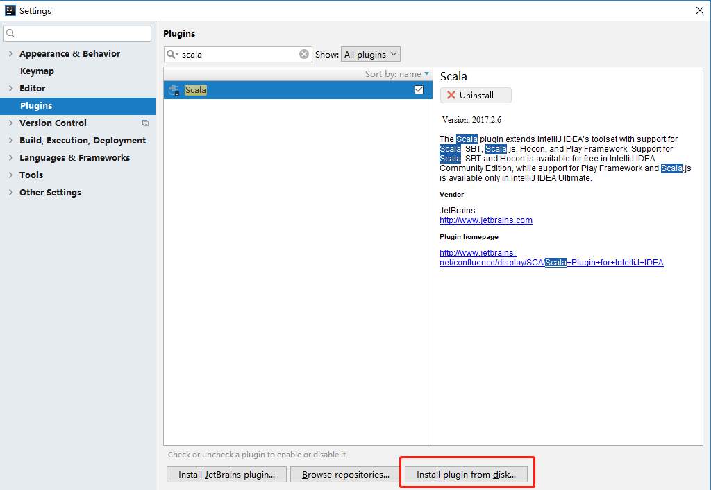
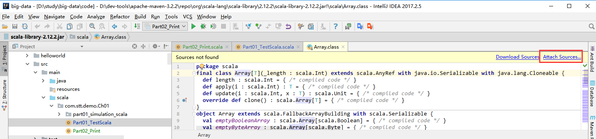
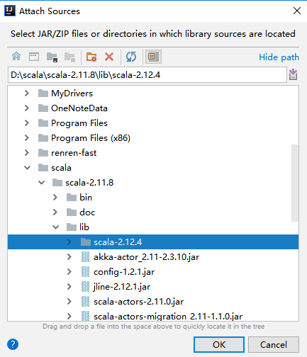

 


# 是什么

- Scalable Language
- 一门多范式编程
  - 范式
    - 编程方式
      - 面向对象
      - 函数式编程
- Spark 新一代内存级大数据计算框架，使用Scala编写
- 作者
  - Martin Odersky
    - 2001开始设计
    - 2003年推出
    - 2016年开始关注


# 与Java的关系

  


# 特点

- 以java虚拟机（JVM）为运行环境
- 将==面向对象==和==函数式编程==的最佳特性结合在一起的静态类型编程语言

- 一门多范式 (multi-paradigm) 的编程语言，Scala支持面向对象和函数式编程
- scala 单作为一门语言来看， 非常的简洁高效
  - 无（三元运算， ++ ， --）
- Scala 在设计时，马丁·奥德斯基 是参考了Java的设计思想
- Scala是源于java，同时马丁·奥德斯基 也加入了自己的思想，将函数式编程语言的特点融合到JAVA中,
- 在学习Scala的过程中搞清楚Scala 和 java相同点和不同点，就可快速的掌握Scala这门语言
- 快速有效掌握Scala的建议 
  - 学习scala特有的语法
  - 搞清楚 scala 和java 区别 
  - 如何规范的使用scala


# 安装

- 在http://www.scala-lang.org/ 下载Scala2.11.8程序安装包

 


## window

- 安装jdk1.8

- 下载对应的scala安装文件 scala-2.11.8.zip

- 可解压到 d:/scala

- 配置scala 的环境变量
  - 配置SCALA_HOME= D:\scala\scala-2.11.8
  - 在path中添加`%SCALA_HOME%\bin`

- 在cmd中输入scala查看是否配置成功

```bash
C:\Users\Administrator> scala
Welcome to Scala 2.11.8 (Java HotSpot(TM) 64-Bit Server VM, Java 1.8.0_101).
Type in expressions for evaluation. Or try :help.
```


## linux

- 下载对应的scala的安装软件.scala-2.11.8.tgz
- 通过远程登录工具，将安装软件上传到对应的linux系统（xshell5  xftp5）
- mkdir /usr/local/scala  创建目录
- tar -xvzf scala-2.11.8.tgz && mv scala-2.11.8 /usr/local/scala/  将安装文件解压，并且移动到 /usr/local/scala
- 配置环境变量 vim /etc/profile

- 在该文件中配置 scala的bin目录 /usr/local/scala/scala-2.11.8/bin

```bash
export SCALA_HOME=/opt/module/scala
export PATH=$PATH:$SCALA_HOME/bin
```

- source /etc/profile


# 开发工具


## REPL

- 命令行工具
  - 在cmd中输入scala
  - 打开scala命令行窗口
- Read->Evaluation->Print->Loop
- 交互式解释器
  - 在命令行窗口中输入scala指令代码时，解释器会读取指令代码(R)并计算对应的值(E)，然后将结果打印出来(P)，接着循环等待用户输入指令(L)
  - 从技术上讲，这里其实并不是一个解释器，而是指令代码被快速的编译成Java字节码并被JVM加载执行
  - 最终将执行结果输出到命令行中


## IDEA

- 安装idea
- 安装scala插件
  - scala-intellij-bin-2017.2.6.zip
    - 注意idea版本需要在2017.2.5
  - 建议该插件文件放到scala的安装目录
  - 打开idea，找到安装插件位置 file->setting->plugins



- 选择插件的安装包后重启


# Helloworld


## java

- 先编写java代码，从编译的角度看待区别

```java
public class HelloJava{
	public static void main(String[] args) {
		System.out.println("hello.java");
	}
}
```

- 进行编译运行
  - 生成HelloJava.class文件

```bash
Administrator@PC-201902252208 MINGW64 /d/study/big-data/code/scala-demo/helloworld (master)
$ javac HelloJava.java
Administrator@PC-201902252208 MINGW64 /d/study/big-data/code/scala-demo/helloworld (master)
$ java HelloJava
hello.java
```


## scala

- 编写文件HelloScala.scala

```scala
// object 表示一个伴生对象，可简单的理解成一个对象
// HelloScala 对象的名称，底层对应的类名是HelloScala$
// 对象是HelloScala$类型的一个静态对象MODULE$
object HelloScala{
    
   // def 表示是一个方法，是一个关键字
   // main 表示方法的名称，表示程序的入口
   // args: Array[String] 表示形参，参数名称在前，类型在后
   // Array[String] 表示类型是数组
   // Unit 表示该函数的返回值为空 
   // 可以理解在main中写的代码在放在Hello$ 的main,
   // 在底层执行scala编译器做了一个包装
  def main(args: Array[String]): Unit = {
    println("hello scala");
  }
}
```

- 编译scala文件
  - 生成了HelloScala.class文件，==伴生类==
  - 生成了HelloScala$.class文件

```bash
Administrator@PC-201902252208 MINGW64 /d/study/big-data/code/scala-demo/helloworld (master)
$ scalac HelloScala.scala

Administrator@PC-201902252208 MINGW64 /d/study/big-data/code/scala-demo/helloworld (master)
$ scala HelloScala
hello scala
```

- 使用jd-gui.exe对HelloScala$.class文件进行反编译查看内容

```java
import scala.Predef.;

public final class HelloScala$
{
  public static final  MODULE$;

  static
  {
    new ();
  }

  public void main(String[] args)
  {
    Predef..MODULE$.println("hello scala");
  }
  private HelloScala$() { MODULE$ = this; }

}
```
- 反编译HelloScala.class文件
```java
import scala.reflect.ScalaSignature;

@ScalaSignature(bytes="\006\001\025:Q!\001\002\t\002\025\t!\002S3mY>\0346-\0317b\025\005\031\021a\002\037f[B$\030PP\002\001!\t1q!D\001\003\r\025A!\001#\001\n\005)AU\r\0347p'\016\fG.Y\n\003\017)\001\"a\003\b\016\0031Q\021!D\001\006g\016\fG.Y\005\003\0371\021a!\0218z%\0264\007\"B\t\b\t\003\021\022A\002\037j]&$h\bF\001\006\021\025!r\001\"\001\026\003\021i\027-\0338\025\005YI\002CA\006\030\023\tABB\001\003V]&$\b\"\002\016\024\001\004Y\022\001B1sON\0042a\003\017\037\023\tiBBA\003BeJ\f\027\020\005\002 E9\0211\002I\005\003C1\ta\001\025:fI\0264\027BA\022%\005\031\031FO]5oO*\021\021\005\004")
public final class HelloScala
{
  public static void main(String[] paramArrayOfString)
  {
    HelloScala..MODULE$.main(paramArrayOfString);
  }
}
```

- 当编写一个object HelloScala底层会生成2个.class文件
  - HelloScala
  - HelloScala$
- scala的运行流程如下

```java
// 先从HelloScala的main开始执行
public static void main(String[] paramArrayOfString){
    HelloScala$.MODULE$.main(paramArrayOfString);
}
// 然后调用HelloScala$类方法HelloScala$.MODULE$.main
public void main(String[] args){
    Predef..MODULE$.println("hello scala");
}
```

- 注意：使用scala的编译器可以执行java编写代码，反过来不行


### 使用idea开发

- 新建maven项目
- 创建一个scala文件夹，设置为Sources Root
  - 和java目录同级
- 默认情况下不能写scala程序，需要加入scala框架
  -  选择项目：右键：选择add Frameworks Support：勾选Scala：选择对应的库


- 创建一个object文件，并执行

```scala
package com.stt.demo.Ch01
// object TestScala对应的是一个TestScala$的一个静态对象MODULE$
// 在程序中是一个单例
object TestScala {
  def main(args: Array[String]): Unit = {
    println("hello scala")
  }
}
```


### 用java模拟scala运行

```java
package com.stt.demo.Ch01.simulation_scala;

public class TestScala {
	public static void main(String[] args) {
		TestScala$.MODULE$.main(args);
	}
}

final class TestScala${
	// MODULE$ 是一个单例的
	public static final TestScala$ MODULE$;
	static {
		MODULE$ = new TestScala$();
	}
	public void main(String[] args){
		System.out.println("hello scala");
	}
}
```


# 执行流程


# 注意事项

- 源文件以 “.scala" 为扩展名

- 程序的执行入口是main()函数
  - 等价于入口函数，但实际上是包装了一层

- 语言严格区分大小写

- 方法由一条条语句构成，每个语句后不需要分号
  - Scala语言会在每行后自动加分号
  - 如果在同一行有多条语句，除了最后一条语句不需要分号，其它语句需要分号


# 转义字符

```scala
\t  	：一个制表位，实现对齐的功能
\n  	：换行符
\\  	：一个\
\"  	：一个"
\r  	：一个回车  println("hello\rk");
```


# 语言输出

- 字符串通过+号连接（类似java）
- printf用法 （类似C语言）字符串通过 % 传值
- 字符串通过$引用(类似PHP）

```scala
package com.stt.demo.Ch01

object Part02_Print {
  def main(args: Array[String]): Unit = {
    var str1 : String = "hello"
    var str2 : String = "world"
    println(str1+str2)

    var name : String = "tom"
    var age : Int = 10
    var sal : Float = 10.67f
    var height : Double = 100.89
    // 格式化输出
    printf("name=%s age=%d salary=%.2f height=%.3f",name,age,sal,height)

    // scala 支持使用$输出内容，编译器会自动解析$对应变量
    // 使用s开头 表示解析$，可以对变量进行运算
    println(s"\nname=$name age=$age salary=${sal+10} height=$height")
  }
}
// 结果
helloworld
name=tom age=10 salary=10.67 height=100.890
name=tom age=10 salary=20.67 height=100.89
```


# 源码关联

- 将scala-sources-2.12.4.tar.gz拷贝到scala的lib下，解压2次
- 点击Attach Sources进行关联






# 注释

- 同java

  - // 单行注释

    /**/ 多行注释

- 注释内容可以被工具 scaladoc 所解析，生成一套以网页文件形式体现的该程序的说明文档


# 规范

- 使用一次tab操作，实现缩进,默认整体向右边移动，时候用shift+tab整体向左移
- 或者使用 ctrl + alt + L 来进行格式化 [演示]
- 运算符两边习惯性各加一个空格
  - 比如：2 + 4 * 5
- 一行最长不超过80个字符，超过的请使用换行展示，尽量保持格式优雅