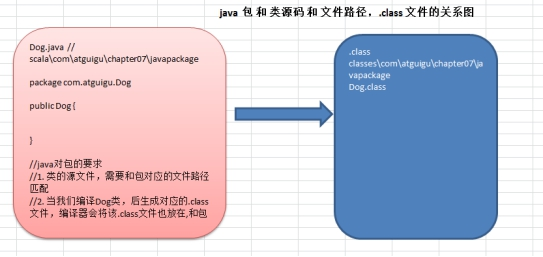
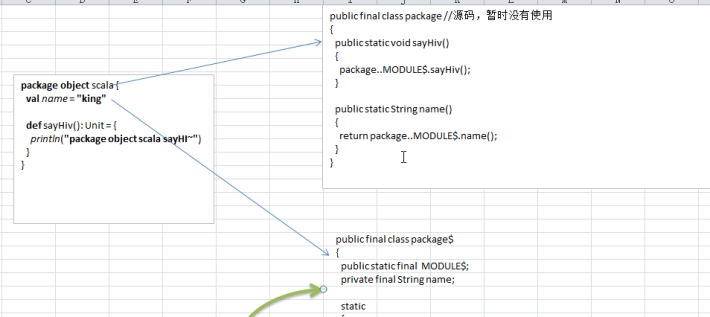
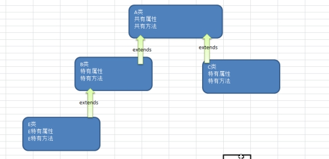

# 类与对象

- 问题的描述看一个养猫猫问题

张老太养了只猫猫:一只名字叫小白,今年3岁,白色。还有一只叫小花,今年10岁,花色。请编写一个程序，当用户输入小猫的名字时，就显示该猫的名字，年龄，颜色。如果用户输入的小猫名错误，则显示 张老太没有这只猫猫。

 

- 问题

猫有三个属性，类型不一样.如果使用普通的变量就不好管理使用一种新的数据类型((1) 可以管理多个不同类型的数据 [属性]) (2) 可以对属性进行操作-方法 ，因此类与对象


## Scala面向对象

- Java是面向对象的编程语言，由于历史原因，Java中还存在着非面向对象的内容
  - 基本类型 ，null，静态方法等

- Scala语言来自于Java，所以天生就是面向对象的语言，而且Scala是纯粹的面向对象的语言，即在Scala中，一切皆为对象

```scala
object CatDemo {
    def main(args: Array[String]): Unit = {

        //创建一只猫
        val cat = new Cat
        //给猫的属性赋值

        //说明
        //1. cat.name = "小白" 其实不是直接访问属性，而是  cat.name_$eq("小白")
        //2. cat.name 等价于 cat.name()
        cat.name = "小白" //等价
        cat.age = 10
        cat.color = "白色"
        println("ok~")
        printf("\n小猫的信息如下: %s %d %s", cat.name, cat.age, cat.color)
    }
}

//定义一个类Cat
//一个class Cat 对应的字节码文件只有一个 Cat.class ,默认是public
class Cat {
    //定义/声明三个属性
    //说明
    //1. 当我们声明了 var name :String时, 在底层对应 private name
    //2. 同时会生成 两个public方法 name() <=类似=> getter  public name_$eq() => setter
    var name: String = "" //给初始值
    var age: Int = _ // _ 表示给age 一个默认的值 ，如果Int 默认就是0
    var color: String = _ // _ 给 color 默认值，如果String ,默认是就是""
}

/* 反编译查看
public class Cat
{
  private String name = "";
  private int age;
  private String color;

  public String name()
  {
    return this.name; }
  public void name_$eq(String x$1) { this.name = x$1; }
  public int age() { return this.age; }
  public void age_$eq(int x$1) { this.age = x$1; }
  public String color() { return this.color; }
  public void color_$eq(String x$1) { this.color = x$1; }

}
```


## 类和对象的区别和联系

- 类是抽象的，概念的，代表一类事物,比如人类,猫类.
- 对象是具体的，实际的，代表一个具体事物
- 类是对象的模板，对象是类的一个个体，对应一个实例
- Scala中类和对象的区别和联系 和 Java是一样的


## 定义类

- scala语法中，类并不声明为public
  - 默认public
  - 手动添加public报错
  - 所有这些类都具有公有可见性(即默认就是public),[修饰符在后面再详解].

- 一个Scala源文件可以包含多个类.,而且默认都是public


## 属性

- 属性是类的一个组成部分，一般是值数据类型,也可是引用类型
  - 如前面定义猫类 的 age  就是属性

```scala
class Dog{
    var name = "jack"
    var lover = new Fish
}
class Fish{
}
```


## 成员变量

- 属性的定义语法同变量，示例：[访问修饰符] var 属性名称 [：类型] = 属性值

- 属性的定义类型可以为任意类型，包含值类型或引用类型[案例演示]

- Scala中声明一个属性,必须显示的初始化，然后根据初始化数据的类型自动推断，属性类型可以省略(这点和Java不同)。[案例演示] 	

- 如果赋值为null,则一定要加类型，因为不加类型, 那么该属性的类型就是Null类型.

- 如果在定义属性时，暂时不赋值，也可以使用符号_(下划线)，让系统分配默认值.

| **类型**            | **_** **对应的值** |
| ------------------- | ------------------ |
| Byte Short Int Long | 0                  |
| Float Double        | 0.0                |
| String 和 引用类型  | null               |
| Boolean             | false              |

```scala
class A {
    var var1 :String = _  // null
    var var2 :Byte = _  // 0
    var var3 :Double = _  //0.0
    var var4 :Boolean = _  //false
}
```

- 不同对象的属性是独立，互不影响，一个对象对属性的更改，不影响另外一个


## 创建对象

- 基本语法
  - val | var 对象名 [：类型]  = new 类型()
- 说明
  - 如果不希望改变对象的引用(即：内存地址), 应该声明为val 性质的，否则声明为var
  - 推荐使用val 一般在程序中只是改变对象属性的值，而不是改变对象的引用
  - 在声明对象变量时，可根据创建对象的类型自动推断，所以类型声明可以省略，**但当类型和后面new 对象类型有继承关系即多态时**，就必须写

```scala
object CreateObj {
    def main(args: Array[String]): Unit = {
        val emp = new Emp // emp 类型就是Emp
        //如果我们希望将子类对象，交给父类的引用，这时就需要写上类型
        val emp2: Person = new Emp

    }
}

class Person {

}

class Emp extends Person {
}
```


## 类和对象的内存分配机制

```scala
object MemState {
    def main(args: Array[String]): Unit = {
        val p1 = new Person2
        p1.name = "jack"
        p1.age = 10

        val p2 = p1
        println(p1 == p2) // true
        p1.name = "tom"
        println("p2.name=" + p2.name)
    }
}

class Person2 {
    var name = ""
    var age: Int  = _ //如果是用 _ 方式给默认值，则属性必须指定类型
}
```


# 方法

- Scala中的方法其实就是函数，声明规则请参考函数式编程中的函数声明

```scala
def 方法名(参数列表) [：返回值类型] = { 
	方法体
}
```

```scala
object MethodDemo01 {
    def main(args: Array[String]): Unit = {
       
        val dog = new Dog
        println(dog.cal(10, 20))
    }
}

class Dog {
    private var sal: Double = _
    var food: String = _

    //方法
    def cal(n1: Int, n2: Int): Int = {
        return n1 + n2
    }
}
```

- 练习

```scala
object MethodDemo02 {
    def main(args: Array[String]): Unit = {
        /*
    编写类(MethodExec)，编程一个方法，方法不需要参数，在方法中打印一个
10*8 的矩形，在main方法中调用该方法。
     */
        val m = new MethodExec
        m.printRect()
        /*
    修改上一个程序，编写一个方法中，方法不需要参数，计算该矩形的面积，并将其作为方法返回值。在main方法中调用该方法，接收返回的面积值并打印(结果保留小数点2位)
    分析
    1. 我们的矩形的长和宽需要设计成属性
     */

        m.width = 2.1
        m.len = 3.4
        println("面积=" + m.area())
    }
}

class MethodExec {
    //属性
    var len = 0.0
    var width = 0.0

    def printRect(): Unit = {
        for (i <- 0 until 10) {
            for (j <- 0 until 8) {
                print("*")
            }
            println()
        }
    }

    //计算面积的方法
    def area(): Double = {
        (this.len * this.width).formatted("%.2f").toDouble
    }
}
```

```scala
object DogCaseTest {
    def main(args: Array[String]): Unit = {
        val dog = new Dog
        dog.name = "tomcat"
        dog.age = 2
        dog.weigth = 6
        println(dog.say())
    }
}

/*
小狗案例

编写一个Dog类，包含name(String)、age(Int)、weight(Double)属性
类中声明一个say方法，返回String类型，方法返回信息中包含所有属性值。

在另一个DogCaseTest类中的main方法中，创建Dog对象，并访问say方法和所有
属性，将调用结果打印输出。

 */
class Dog{
    var name = ""
    var age = 0
    var weigth = 0.0
    def say(): String = {
        "小狗信息如下: name=" + this.name + "\t age=" +
        this.age + " weight=" + this.weigth
    }
}
```


# 构造器

- 前面我们在创建Person的对象时，是先把一个对象创建好后，再给他的年龄和姓名属性赋值，如果现在我要求，在创**建人类的对象时，就直接指定这个对象的年龄和姓名**，该怎么做? 这时就可以使用构造方法/构造器


## java构造器

```java
[修饰符] 方法名(参数列表){
	构造方法体
}
```

- 特点
  - 在Java中一个类可以定义多个不同的构造方法，构造方法重载
  - 如果程序员没有定义构造方法，系统会自动给类生成一个默认无参构造方法
    - 默认构造器
    - 如 Person (){}
  - 一旦定义了自己的构造方法（构造器）,默认的构造方法就覆盖
    - 不能再使用默认的无参构造方法，除非显示的定义一下
      - 即Person(){};

- 在前面定义的Person类中添加两个构造器：
  - 第一个无参构造器
    - 利用构造器设置所有人的age属性初始值都为18
  - 第二个带name和age两个参数的构造器
    - 使得每次创建Person对象的同时初始化对象的age属性值和name属性值

```java
class Person{
    public String name;
    public int age;
    public String getInfo(){
        return name+"\t"+age;
    }
    public Person(){
        age = 18;
    }
    public Person(String name,int age){
        this.name = name;
        this.age = age;
    }
}
```


## scala构造器

- 和Java一样，Scala构造对象也需要调用构造方法，并且可以有任意多个构造方法
  
- 即scala中构造器也支持重载
  
- Scala类的构造器包括

  - 主构造器
  - 辅助构造器

  

### 基本语法

```scala
class 类名(形参列表) {  // 主构造器
    // 类体
    def  this(形参列表) {  // 辅助构造器
    }
    def  this(形参列表) {  //辅助构造器可以有多个...
    }
} 
```

- 辅助构造器 函数的名称this, 可以有多个，编译器通过不同参数来区分
- 示例

```scala
object ConDemo01 {
    def main(args: Array[String]): Unit = {
        //    val p1 = new Person("jack", 20)
        //    println(p1)
        //
        //    val a = new A
        //    val a2 = new A()

        //下面这句话就会调用def this(name:String)
        val p2 = new Person("tom")
        println(p2)
    }
}

//构造器的快速入门
//创建Person对象的同时初始化对象的age属性值和name属性值
class Person(inName:String,inAge:Int) {
    var name: String = inName
    var age: Int = inAge
    age += 10
    println("~~~~~~~~~~")

    //重写了toString，便于输出对象的信息
    override def toString: String = {
        "name=" + this.name + "\t age" + this.age
    }

    println("ok~~~~~")
    println("age=" + age)

    def this(name:String) {
        //辅助构造器，必须在第一行显式调用主构造器(可以是直接，也可以是间接)
        this("jack", 10)
        //this
        this.name = name //重新赋值
    }
}

class A() {

}
```


### 注意事项

- Scala构造器作用是完成对新对象的初始化，构造器没有返回值

- 主构造器的声明直接放置于类名之后 [可反编译查看]

- ==主构造器会执行类定义中的所有语句==，这里可以体会到Scala的函数式编程和面向对象编程融合在一起，即：构造器也是方法（函数）
  - 传递参数和使用方法和前面的函数部分内容没有区别【案例演示+反编译】

- 如果主构造器无参数，小括号可省略，构建对象时调用的构造方法的小括号也可以省略

```scala
class A{
   
}
var a = new AA
var a2 = new AA()
```

- 辅助构造器名称为this（这个和Java是不一样的）
  - 多个辅助构造器通过不同参数列表进行区分
  - 在底层是构造器重载【案例演示+反编译】

```scala
object ConDemo03 {
    def main(args: Array[String]): Unit = {
        //xxx
        val p1 = new Person2()
    }
}

//定义了一个Person类
//Person 有几个构造器 4
class Person2() {
    var name: String = _
    var age: Int = _

    def this(name : String) {
        //辅助构造器无论是直接或间接，最终都一定要调用主构造器，执行主构造器的逻辑
        //而且需要放在辅助构造器的第一行[这点和java一样，java中一个构造器要调用同类的其它构造器，也需要放在第一行]
        this()  //直接调用主构造器
        this.name = name
    }

    //辅助构造器
    def this(name : String, age : Int) {
        this() //直接调用主构造器
        this.name = name
        this.age = age
    }

    def this(age : Int) {
        this("匿名") //调用主构造器,因为 def this(name : String) 中调用了主构造器
        this.age = age
    }
    def showInfo(): Unit = {
        println("person信息如下:")
        println("name=" + this.name)
        println("age=" + this.age)
    }
}
```

- 如果想让主构造器变成私有的，可以在()之前加上private
  - 只能通过辅助构造器来构造对象了【反编译】
  - class Person2 private() {}

- 辅助构造器的声明不能和主构造器的声明一致,会发生错误
  - 即构造器名重复


### 构造器参数

- Scala类的主构造器的形参未用任何修饰符修饰，那么这个参数是局部变量

- 如果参数使用**val关键字声明**
  - Scala会将参数作为类的私有的只读属性使用 【案例+反编译】

- 如果参数使用**var关键字声明**
  - Scala会将参数作为类的成员属性使用
  - 提供属性对应的xxx()[类似getter]/xxx_$eq()[类似setter]方法
  - 这时的成员属性是私有的，但是可读写。【案例+反编译】

```scala
object ConDemo04 {
    def main(args: Array[String]): Unit = {

        val worker = new Worker("smith")
        worker.name //不能访问 inName

        val worker2 = new Worker2("smith2")
        worker2.inName  //可以访问 inName
        println("hello!")

        val worker3 = new Worker3("jack")
        worker3.inName = "mary"
        println(worker3.inName)
    }
}

//1. 如果 主构造器是Worker(inName: String) ,inName就是一个局部变量

class Worker(inName: String) {
    var name = inName
}
//. 如果 主构造器是Worker2(val inName: String) ,inName就是Worker2的一个private的只读属性
class Worker2(val inName: String) {
    var name = inName
}

// 如果 主构造器是Worker3(var inName: String) ,inName就是Worker3的一个
// 一个private 的可以读写属性
class Worker3(var inName: String) {
    var name = inName
}
```


### Bean属性

- JavaBeans规范定义了Java的属性是像getXxx（）和setXxx（）的方法
- 许多Java工具（框架）都依赖这个命名习惯
- 将Scala字段加@BeanProperty时会自动生成规范的 setXxx/getXxx 方法
- 可使用对象.setXxx() 和 对象.getXxx() 来调用属性

- 注意：给某个属性加入@BeanPropetry注解后，会生成getXXX和setXXX的方法
  - 对原来**底层自动生成类似xxx(),xxx_$eq()方法，没有冲突，二者可以共**存

```scala
import scala.beans.BeanProperty

object BeanPropertDemo {
    def main(args: Array[String]): Unit = {
        val car = new Car
        car.name = "宝马"
        println(car.name)

        //使用 @BeanProperty 自动生成 getXxx 和 setXxx
        car.setName("奔驰")
        println(car.getName())
    }
}


class Car {
    @BeanProperty var name: String = null
}
```


# 对象创建的流程分析

```scala
class Person {
    var age: Short = 90
    var name: String = _
    def this(n: String, a: Int) {
        this()
        this.name = n
        this.age = a
    }}
var p : Person = new Person("小倩",20)
```

- 加载类的信息(属性信息，方法信息)

- 在内存中(堆)开辟空间

- 使用父类的构造器(主和辅助)进行初始

- 使用主构造器对属性进行初始化 【age:90, naem nul】

- 使用辅助构造器对属性进行初始化 【 age:20, naem 小倩 】

- 将开辟的对象的地址赋给 p这个引用


# 包

- 应用场景

  - 现在有两个程序员共同开发一个项目,程序员xiaoming希望定义一个类取名 Dog ,程序员xiaoqiang也想定义一个类也叫 Dog。两个程序员为此还吵了起来,怎么办? 

    - 使用包即可以解决这个问题

      

## java中的包

- 作用
  - 区分相同名字的类
  - 当类很多时,可以很好的管理类
  - 控制访问范围
- 语法
  - package com.ttshe;

- 本质
  - 实际上就是创建不同的文件夹来保存类文件



- 示例
  - 使用打包技术来解决上面的问题，不同包下Dog类

```java
package com.atguigu.chapter07.javapackage;

public class TestTiger {
    public static void main(String[] args) {
        //使用xm的Tiger
        com.atguigu.chapter07.javapackage.xm.Tiger tiger01 = new com.atguigu.chapter07.javapackage.xm.Tiger();
        //使用xh的Tiger
        com.atguigu.chapter07.javapackage.xh.Tiger tiger02 = new com.atguigu.chapter07.javapackage.xh.Tiger();

        System.out.println("tiger01=" + tiger01 + "tiger02=" + tiger02);
    }
}
```


## scala中的包

- 和Java一样，Scala中管理项目可以使用包
- **Scala中的包的功能更加强大**

```scala
package com.atguigu.chapter07.scalapackage

object TestTiger {
    def main(args: Array[String]): Unit = {
        //使用xh的Tiger
        val tiger1 = new com.atguigu.chapter07.scalapackage.xh.Tiger
        //使用xm的Tiger
        val tiger2 = new com.atguigu.chapter07.scalapackage.xm.Tiger
        println(tiger1 + " " + tiger2)
    }
}
```


### 特点

- Scala包的三大作用(和Java一样)
  - 区分相同名字的类
  - 当类很多时,可以很好的管理类
  - 控制访问范围
  - 可以对类的功能进行扩展

- Scala中**包名和源码所在的系统文件目录结构要可以不一致**
- **编译后的字节码文件路径和包名会保持一致**
  - 这个工作由编译器完成

```scala
package com.atguigu.chapter07.scalapackage.hello2

object TestTiger {
    def main(args: Array[String]): Unit = {
        //使用xh的Tiger
        val tiger1 = new com.atguigu.chapter07.scalapackage.xh.Tiger
        //使用xm的Tiger
        val tiger2 = new com.atguigu.chapter07.scalapackage.xm.Tiger
        println(tiger1 + " " + tiger2)

    }
}

class Employee {

}
```


### 命名

- 规则
  - 只能包含数字、字母、下划线、小圆点.,但不能用数字开头, 也不要使用关键字
    - demo.class.exec1  //错误 , 因为class是关键字
    - demo.12a    // 错误，因为不能以数字开头
- 规范
  - 一般是小写字母+小圆点一般是 
    - com.公司名.项目名.业务模块名
      - 如com.atguigu.oa.model
      - com.atguigu.oa.controller
      - com.sina.edu.user
      - com.sohu.bank.order 

### 自动引入的包

- java.lang.*
- scala包
- Predef包


### 注意事项

- scala进行package 打包时，可如下形式

```scala
////代码说明
//1. package com.atguigu{}  表示我们创建了包 com.atguigu ,在{}中
//   我们可以继续写它的子包 scala //com.atguigu.scala, 还可以写类,特质trait,还可以写object
//2. 即sacla支持，在一个文件中，可以同时创建多个包，以及给各个包创建类,trait和object

package com.atguigu {  //包 com.atguigu
    package scala { //包 com.atguigu.scala

        class Person { // 表示在 com.atguigu.scala下创建类 Person
            val name = "Nick"

            def play(message: String): Unit = {
                println(this.name + " " + message)
            }
        }
        object Test100 { //表示在 com.atguigu.scala 创建object Test
            def main(args: Array[String]): Unit = {
                println("ok")
            }
        }
    }

}
```

- 包也可以像嵌套类那样嵌套使用（**包中有包**）
- 好处
  - **可在同一个文件中，将类(class / object)、trait 创建在不同的包中**
  - 灵活

```scala
//代码说明
//1. package com.atguigu{}  表示我们创建了包 com.atguigu ,在{}中
//   我们可以继续写它的子包 scala //com.atguigu.scala, 还可以写类,特质trait,还可以写object
//2. 即sacla支持，在一个文件中，可以同时创建多个包，以及给各个包创建类,trait和object

package com.atguigu {  //包 com.atguigu

    class User { // 在com.atguigu包下创建个 User类
    }

    package scala2 { // 创建包 com.atguigu.scala2
        class User { // 在com.atguigu.scala2 包下创建个 User类
        }
    }

    package scala { //包 com.atguigu.scala

        class Person { // 表示在 com.atguigu.scala下创建类 Person
            val name = "Nick"

            def play(message: String): Unit = {
                println(this.name + " " + message)
            }
        }
        object Test100 { //表示在 com.atguigu.scala 创建object Test
            def main(args: Array[String]): Unit = {
                println("ok")
            }
        }
    }
}
```

- 作用域原则
  - 可以直接向上访问
  - Scala中子包中直接访问父包中的内容, 大括号体现作用域
  - 提示：Java中子包使用父包的类，需要import
  - 在子包和父包 类重名时，默认采用就近原则，如果希望指定使用某个类，则带上包名即可

```scala
////代码说明
//1. package com.atguigu{}  表示我们创建了包 com.atguigu ,在{}中
//   我们可以继续写它的子包 scala //com.atguigu.scala, 还可以写类,特质trait,还可以写object
//2. 即sacla支持，在一个文件中，可同时创建多个包，以及给各个包创建类,trait和object

package com.atguigu {  //包 com.atguigu

    class User { // 在com.atguigu包下创建个 User类

    }
    package scala2 { // 创建包 com.atguigu.scala2
        class User { // 在com.atguigu.scala2 包下创建个 User类
        }
    }

    package scala { //包 com.atguigu.scala

        class Person { // 表示在 com.atguigu.scala下创建类 Person
            val name = "Nick"

            def play(message: String): Unit = {
                println(this.name + " " + message)
            }
        }

        class User {

        }

        object Test100 { //表示在 com.atguigu.scala 创建object Test
            def main(args: Array[String]): Unit = {
                println("ok")
                //可以直接使用父包的内容
                //1.如果有同名的类，则采用就近原则来使用内容(比如包)
                //2.如果是要使用父包的类，则指定路径即可
                val user = new User
                println("user=" + user) //
                val user2 = new com.atguigu.User()
                println("user2" + user2)

            }
        }
    }
}
```

- 父包要访问子包的内容时，需要import对应的类

```scala
package com.atguigu {  //包 com.atguigu

    class User { // 在com.atguigu包下创建个 User类
        def sayHello(): Unit = {
            //想使用 com.atguigu.scala2包下的 Monster
            import com.atguigu.scala2.Monster
            val monster = new Monster()
        }
    }

    package scala2 { // 创建包 com.atguigu.scala2
        class User { // 在com.atguigu.scala2 包下创建个 User类
        }
        class Monster{ //

        }
    }

    package scala { //包 com.atguigu.scala

        class Person { // 表示在 com.atguigu.scala下创建类 Person
            val name = "Nick"

            def play(message: String): Unit = {
                println(this.name + " " + message)
            }
        }

        class User {

        }

        object Test100 { //表示在 com.atguigu.scala 创建object Test
            def main(args: Array[String]): Unit = {
                println("ok")
                //我们可以直接使用父包的内容
                //1.如果有同名的类，则采用就近原则来使用内容(比如包)
                //2.如果就是要使用父包的类，则指定路径即可
                val user = new User
                println("user=" + user) //
                val user2 = new com.atguigu.User()
                println("user2" + user2)

            }
        }
    }

}
```

- 可以在同一个.scala文件中，声明多个并列的package
  - 建议嵌套的pakage不要超过3层

- 包名可以相对也可以绝对
  - 如访问BeanProperty的绝对路径是
    - `_root_. scala.beans.BeanProperty` 
    - 在一般情况下：使用相对路径来引入包，只有当包名冲突时，使用绝对路径来处理

```scala
package com.atguigu.scala2

import scala.beans.BeanProperty

class Manager(var name: String) {
    //第一种形式 [使用相对路径引入包]
    @BeanProperty var age: Int = _
    //第二种形式, 和第一种一样，都是相对路径引入
    @scala.beans.BeanProperty var age2: Int = _
    //第三种形式, 是绝对路径引入，可以解决包名冲突
    @_root_.scala.beans.BeanProperty var age3: Int = _
}

object TestBean {
    def main(args: Array[String]): Unit = {
        val m = new Manager("jack")
        println("m=" + m)
    }
}
```


### 包对象

- **包可以包含类、对象和特质trait，但不能包含函数/方法或变量的定义**
  - 这是Java虚拟机的局限
  - 为了弥补这一点不足，scala提供了**包对象的概念来解决这个问题**

```scala
package com.atguigu { //包 com.atguigu

    //说明
    //1. 在包中直接写方法，或者定义变量，就错误==>使用包对象的技术来解决
    //2. package object scala 表示创建一个包对象 scala, 他是 com.atguigu.scala这个包对应的包对象
    //3. 每一个包都可以有一个包对象
    //4. 包对象的名字需要和子包一样
    //5. 在包对象中可以定义变量，方法
    //6. 在包对象中定义的变量和方法，就可以在对应的包中使用
    //7. 在底层这个包对象会生成两个类 package.class  和 package$.class
    package object scala {
        var name = "king"

        def sayHiv(): Unit = {
            println("package object scala sayHI~")
        }
    }
    package scala { //包 com.atguigu.scala

        class Person { // 表示在 com.atguigu.scala下创建类 Person
            val name = "Nick"

            def play(message: String): Unit = {
                println(this.name + " " + message)
            }
        }

        class User {
            def testUser(): Unit = {
                println("name = " + name)
                sayHiv()
            }
        }

        object Test100 { //表示在 com.atguigu.scala 创建object Test
            def main(args: Array[String]): Unit = {
                println("name=" + name)
                name = "yy"
                sayHiv()
            }
        }
    }
}
```




- 一个包对象会生成两个类package和package$

- 注意事项
  - 每个包都可以有一个包对象。你需要在父包中定义它
  - 包对象名称需要和包名一致，一般用来对包的功能补充


# 包的可见性


## java中

- java提供四种访问控制修饰符号控制方法和变量的访问权限
  - 公开级别
    - 用public 修饰,对外公开
  - 受保护级别
    - 用protected修饰,对子类和同一个包中的类公开
  - 默认级别
    - 没有修饰符号,向同一个包的类公开
  - 私有级别
    - 用private修饰,只有类本身可以访问,不对外公开


- 修饰符可以用来修饰类中的属性，成员方法以及类

- 只有默认的和public才能修饰类


## scala中

- 在Java中，访问权限分为
  - public，private，protected和默认
- 在Scala中，可通过类似的修饰符达到同样的效果，但使用上有区别

```scala
object Testvisit {
    def main(args: Array[String]): Unit = {
        val  c = new Clerk()
        c.showInfo()
        Clerk.test(c)
    }
}
class Clerk {
    var name : String = "jack"
    private var sal : Double = 9999.9
    def showInfo(): Unit = {
        println(" name " + name + " sal= " + sal)
    }
}
object Clerk{
    def test(c : Clerk): Unit = {
        //这里体现出在伴生对象中，可以访问c.sal
        println("test() name=" + c.name + " sal= " + c.sal)
    }
}
```

- 当==属性访问权限==为默认时，从底层看属性是==private==的，但是因为提供了xxx_$eq()[类似setter]/xxx()[类似getter] 方法，因此从使用效果看是任何地方都可以访问)

- 当==方法访问权限==为默认时，默认为==public==访问权限

- private为私有权限，只在类的内部和伴生对象中可用 【案例演示】

- protected为受保护权限，==scala中受保护权限比Java中更严格==，只能子类访问，同包无法访问 

- 在scala中没有public关键字,即不能用public显式的修饰属性和方法。【案演】

- 包访问权限（表示属性有了限制。同时包也有了限制），这点和Java不一样，体现出Scala包使用的灵活性

```scala
package com.atguigu.chapter07.visit

object Testvisit {
    def main(args: Array[String]): Unit = {
        val c = new Clerk()

        c.showInfo()
        Clerk.test(c)

        //创建一个Person对象
        val p1 = new Person
        println(p1.name)
    }
}

//类
class Clerk {
    var name: String = "jack" //
    private var sal: Double = 9999.9
    protected var age = 10
    var job : String = "大数据工程师"

    def showInfo(): Unit = {
        //在本类可以使用私有的
        println(" name " + name + " sal= " + sal)
    }
}

//当一个文件中出现了 class Clerk 和 object Clerk
//1. class Clerk 称为伴生类
//2. object Clerk 的伴生对象
//3. 因为scala设计者将static拿掉, 就是设计了 伴生类和伴生对象的概念
//4. 伴生类 写非静态的内容 伴生对象 就是静态内容
//5.
object Clerk {
    def test(c: Clerk): Unit = {
        //这里体现出在伴生对象中，可以访问c.sal
        println("test() name=" + c.name + " sal= " + c.sal)
    }
}

class Person {
    //这里我们增加一个包访问权限
    //下面private[visit] ： 1，仍然是private 2. 在visit包(包括子包)下也可以使用name ,相当于扩大访问范围

    protected[visit] val name = "jack"
}
```


# 包的引入

- Scala引入包也是使用import, **基本的原理和机制和Java一样**
- Scala中的import功能更加强大，也更灵活
- 因为Scala语言源自于Java，所以**java.lang**包中的类会自动引入到当前环境中，而Scala中的**scala包和Predef包的类也会自动**引入到当前环境中，即起其下面的类可以直接使用
- 如果想要把其他包中的类引入到当前环境中，需要使用import语言

- 在Scala中，**import语句可以出现在任何地方，并不仅限于文件顶部**
- import语句的作用一直延伸到包含该语句的块末尾
  - 好处：在需要时在引入包，**缩小import 包的作用范围**，提高效率

```scala
class User {
    import scala.beans.BeanProperty
    @BeanProperty var  name : String = ""
}
class Dog {
    @BeanProperty var  name : String = "" //可以吗?
}
```

- Java中如果想要导入包中所有的类，可以通过通配符*，Scala中采用下 _  [案例演示]

- 如果不想要某个包中全部的类，而是其中的几个类，可以采用选取器(大括号)

```scala
def test(): Unit = {
    //可以使用选择器，选择引入包的内容，这里，我们只引入 HashMap, HashSet
    import scala.collection.mutable.{HashMap, HashSet}
    var map = new HashMap()
    var set = new HashSet()
}
```

- 如果引入的多个包中含有相同的类，那么可将不需要的类进行重命名进行区分，这个就是重命名

```scala
def test2(): Unit = {
    //下面的含义是 将 java.util.HashMap 重命名为 JavaHashMap
    import java.util.{ HashMap=>JavaHashMap, List}
    import scala.collection.mutable._
    var map = new HashMap() // 此时的HashMap指向的是scala中的HashMap
    var map1 = new JavaHashMap(); // 此时使用的java中hashMap的别名
}
```

-  如果某个冲突的类根本就不会用到，那么这个类可以直接隐藏掉

```scala
import java.util.{ HashMap=>_, _} // 含义为 引入java.util包的所有类，但是忽略 HahsMap类.
var map = new HashMap() // 此时的HashMap指向的是scala中的HashMap, 而且idea工具，的提示也不会显示java.util的HashMaple 
```


# 面向对象编程


## 抽象


```scala

object BankDemo {
    def main(args: Array[String]): Unit = {
        //开卡
        val account = new Account("gh00001",890.4,"111111")
        account.query("111111")
        account.withDraw("111111", 100.0)
        account.query("111111")

    }
}

//编写一个Account类
class Account(inAccount: String, inBalance: Double, inPwd: String) {
    /*
  属性：
账号，余额，密码
  方法:
查询
取款
存款

   */
    val accountNo = inAccount
    var balance = inBalance
    var pwd = inPwd

    //查询
    def query(pwd: String): Unit = {
        if (!this.pwd.equals(pwd)) {
            println("密码错误")
            return
        }

        printf("账号为%s 当前余额是%.2f\n", this.accountNo, this.balance)
    }

    //取款
    def withDraw(pwd:String,money:Double): Any = {
        if (!this.pwd.equals(pwd)) {
            println("密码错误")
            return
        }
        //判断money是否合理
        if (this.balance < money) {
            println("余额不足")
            return
        }
        this.balance -= money
        money
    }
}
```


## 三大特征

- 面向对象编程有三大特征：封装、继承和多态


### 封装

- 封装(encapsulation)就是把抽象出的数据和对数据的操作封装在一起,数据被保护在内部
- 程序的其它部分只有通过被授权的操作(成员方法),才能对数据进行操作。


- 好处
  - 隐藏实现细节
  - 提可以对数据进行验证，保证安全合理
  - 同时可以加入业务逻辑

- 如何体现封装
  - 对类中的属性进行封装
  - 通过成员方法，包实现封装

- 具体实现
  - 将属性进行私有化
  - 提供一个公共的**set**方法，用于对**属性判断并赋**值
  - 提供一个公共的get方法，用于获取属性的值

```scala
def  setXxx(参数名 : 类型) : Unit = {
    //加入数据验证的业务逻辑
    属性 = 参数名   
}
```

```scala
def getXxx() [: 返回类型] = {
    return 属性
}
```

- 示例
- 不能随便查看人的年龄,工资等隐私，并对输入的年龄进行合理的验证[要求1-120之间]

```scala
class Person {
    var name: String = _
    //var age ; //当是public时，可以随意的进行修改，不安全
    private var age: Int = _
    private var salary: Float = _
    private var job: String = _
    
    def setAge(age: Int): Unit = {
        if (age >= 0 && age <= 120) {
            this.age = age
        } else {
            println("输入的数据不合理");
            //可考虑给一个默认值
            this.age = 20
        }}
}
```

- 前面讲的Scala的封装特性，大家发现和Java是一样的，下面我们看看Scala封装还有哪些特点
- Scala中为了简化代码的开发，当声明属性时，本身就自动提供了对应setter/getter方法
  - 如果属性声明为private的，那么自动生成的setter/getter方法也是private的
  - 如果属性省略访问权限修饰符，那么自动生成的setter/getter方法是public的[案例+反编译+说明]

-  因此我们如果只是对一个属性进行简单的set和get ，只要声明一下该属性(属性使用默认访问修饰符) 不用写专门的getset，默认会创建，访问时，直接对象.变量。这样也是为了保持访问一致性 [案例]

- 从形式上看 dog.food 直接访问属性，其实底层仍然是访问的方法,  看一下反编译的代码就明白

- 有了上面的特性，目前很多新的框架，在进行反射时，也支持对属性的直接反射


### 继承

- 基本语法
  - class 子类名 extends 父类名  { 类体 }
- 继承可以解决代码复用,让我们的编程更加靠近人类思维
  - 当多个类存在相同的属性(变量)和方法时,可以从这些类中抽象出父类(比如Student),在父类中定义这些相同的属性和方法
  - 所有的子类不需要重新定义这些属性和方法，只需要通过extends语句来声明继承父类即可
- 和Java一样，Scala也支持类的单继承



- 示例

```scala
object Extends01 {
    def main(args: Array[String]): Unit = {
        //使用
        val student = new Student
        student.name = "jack" //调用了student.name() //调用到从Person继承的name()
        student.studying()
        student.showInfo()
    }
}

class Person { //Person类
    var name : String = _
    var age : Int = _
    def showInfo(): Unit = {
        println("学生信息如下：")
        println("名字：" + this.name)
    }
}

//Student类继承Person
class Student extends Person {
    def studying(): Unit = {
        //这里可以使用父类的属性
        println(this.name + "学习 scala中....")
    }
}
```

- 好处
  - 代码的复用性提高了
  - 代码的扩展性和维护性提高了
  - 面试官问:当我们修改父类时，对应的子类就会继承相应的方法和属性

- 关于继承的子类
  - 子类继承了所有的属性，只是私有的属性不能直接访问
    - ==私有属性在scala中等价于添加了get和set功能的私有方法，子类无法使用==
  - 需要通过公共的方法去访问

```scala

//说明
//1. 在scala中，子类继承了父类的所有属性
//2. 但是private的属性和方法无法访问
object Extends02 {
  def main(args: Array[String]): Unit = {
    val sub = new Sub()
    sub.sayOk()
    
  }
}

//父类(基类)
class Base {
  var n1: Int = 1 //public n1() , public n1_$eq()
  protected var n2: Int = 2
  private var n3: Int = 3 // private n3() , private n3_$eq()

  def test100(): Unit = { // 默认 public test100()
    println("base 100")
  }

  protected def test200(): Unit = { // ？
    println("base 200")
  }

  private def test300(): Unit = { //private
    println("base 300")
  }
}

//Sub 继承 Base
class Sub extends Base {

  def sayOk(): Unit = {
    this.n1 = 20 //这里访问本质this.n1_$eq()
    this.n2 = 40

    println("范围" + this.n1 + this.n2)

    test100() //
    test200() //
  }
}
```


#### 重写方法

- scala明确规定，重写一个非抽象方法需要用override修饰符
- 调用超类的方法使用super关键字 

```scala
object MethodOverride01 {
    def main(args: Array[String]): Unit = {
        val emp = new Emp100
        emp.printName()
    }
}

//Person类
class Person100 {
    var name: String = "tom"

    def printName() { //输出名字
        println("Person printName() " + name)
    }

    def sayHi(): Unit = {
        println("sayHi...")
    }
}

//继承Person
class Emp100 extends Person100 {
    //这里需要显式的使用override
    override def printName() {
        println("Emp printName() " + name)
        //在子类中需要去调用父类的方法,使用super
        super.printName()
        sayHi()
    }
}
```


#### 类型检查&转换

- 要测试某个对象是否属于某个给定的类，可用isInstanceOf方法
  - obj.isInstanceOf[T]就如同Java的obj instanceof T 判断obj是不是T类型
- 用asInstanceOf方法将引用转换为子类的引用
  - obj.asInstanceOf[T]就如同Java的(T)obj 将obj强转成T类型
- classOf获取对象的类名
  - classOf[String]就如同Java的 String.class 

```scala
object TypeConvert {
    def main(args: Array[String]): Unit = {

        //ClassOf的使用,可以得到类名
        println(classOf[String]) // 输出
        val s = "king"
        println(s.getClass.getName) //使用反射机制

        //isInstanceOf asInstanceOf
        var p1 = new Person200
        var emp = new Emp200
        //将子类引用给父类(向上转型,自动)
        p1 = emp 
        //将父类的引用重新转成子类引用(多态),即向下转型
        var  emp2 = p1.asInstanceOf[Emp200]
        emp2.sayHello()
    }
}


//Person类
class Person200 {
    var name: String = "tom"
    def printName() { //输出名字
        println("Person printName() " + name)
    }
    def sayHi(): Unit = {
        println("sayHi...")
    }
}

//继承Person
class Emp200 extends Person200 {
    //这里需要显式的使用override
    override def printName() {
        println("Emp printName() " + name)
        //在子类中需要去调用父类的方法,使用super
        super.printName()
        sayHi()
    }

    def sayHello(): Unit = {}
}
```

- 类型检查和转换的最大价值在于：可以判断传入对象的类型，然后转成对应的子类对象，进行相关操作，这里也体现出多态的特点

```scala
object TypeConvertCase {
    def main(args: Array[String]): Unit = {
        val stu = new Student400
        val emp = new Emp400
        test(stu) //
        test(emp)
    }

    //写了一个参数多态代码
    //因为在oop中一个父类的引用可以接收所有子类的引用,多态(参数多态)
    def test(p: Person400): Unit = {
        //使用Scala中类型检查和转换
        if (p.isInstanceOf[Emp400]) { //判断
            //p.asInstanceOf[Emp400],对p的类型没有任何变化，而是返回的是Emp400
            p.asInstanceOf[Emp400].showInfo()
        } else if (p.isInstanceOf[Student400]) {
            p.asInstanceOf[Student400].cry()
        } else {
            println("转换失败")
        }
    }
}

class Person400 {
    def printName(): Unit = {
        println("Person400 printName")
    }

    def sayOk(): Unit = {
        println("Person400 sayOk")
    }
}

class Student400 extends Person400 {
    val stuId = 100

    override def printName(): Unit = {
        println("Student400 printName")
    }

    def cry(): Unit = {
        println("学生的id=" + this.stuId)
    }
}

class Emp400 extends Person400 {
    val empId = 800

    override def printName(): Unit = {
        println("Emp400 printName")
    }

    def showInfo(): Unit = {
        println("雇员的id=" + this.empId)
    }
}
```


#### 超类的构造

- java中
  - 创建子类对象时，子类的构造器总是去调用一个父类的构造器(显式或者隐式调用)

```java
public class JavaBaseConstractor {
    public static void main(String[] args) {

        //1.A()
        //2.B()
        B b = new B();


        //1.A(String name) jack
        //2.B(String name) jack
        B b2 = new B("jack");

    }
}

class A {
    public A() {
        System.out.println("A()");
    }
    public A(String name) {
        System.out.println("A(String name)" + name);
    }
}
class B extends A{
    public B() {
        //这里会隐式调用super(); 就是无参的父类构造器A()
        //super();
        System.out.println("B()");
    }
    public B(String name) {
        super(name);
        System.out.println("B(String name)" + name);
    }
}
```

- scala中
  - 类有一个主构器和任意数量的辅助构造器，而每个辅助构造器都必须先调用主构造器(也可以是间接调用.)

```scala
object ScalaBaseConstrator {
    def main(args: Array[String]): Unit = {
        //分析一下他的执行流程
        //1.因为scala遵守先构建父类部分 extends Person700()
        //2.Person...

        val emp = new Emp700()

        //分析一下他的执行流程
        //1.因为scala遵守先构建父类部分 extends Person700()
        //2.Person...
        //3.Emp .... (Emp700的主构造器)
        println("=====================")
        val emp2 = new Emp700("mary")


        println("**************************")
        //分析执行的顺序
        //1.Person...
        //2.默认的名字
        //3.Emp ....
        //4.Emp 辅助构造器~
        val emp3 = new Emp700("smith")
    }
}

//父类Person
class Person700(pName:String) {
    var name = pName
    println("Person...")
    def this() {
        this("默认的名字")
        println("默认的名字")

    }
}

//子类Emp继承Person
class Emp700() extends Person700() {
    println("Emp ....")
    //辅助构造器
    def this(name: String) {
        this // 必须调用主构造器
        this.name = name
        println("Emp 辅助构造器~")
    }
}
```

- 只有主构造器可以调用父类的构造器
- 辅助构造器不能直接调用父类的构造器
- ==在Scala的构造器中，不能调用super(params)==

```scala
class Person(name: String) { //父类的构造器
}
class Emp (name: String) extends Person(name) {// 将子类参数传递给父类构造器,这种写法√

    // super(name)  (×) 没有这种语法
    def  this() {
        super("abc") // (×)不能在辅助构造器中调用父类的构造器
    }
}
```


#### 覆写字段

- 注意scala与java中的区别

- 在Java中只有方法的重写，没有属性/字段的重写
  - 准确的讲，是隐藏字段代替了重写
  - 对于同一个对象
    - 用父类的引用去取值(字段)，会取到父类的字段的值
    - 用子类的引用去取值(字段)，则取到子类字段的值
    - 在实际的开发中，要尽量避免子类和父类使用相同的字段名，否则很容易引入一些不容易发现的bug
  - 动态绑定的机制
    - 如果调用的是方法，则Jvm机会将该方法和对象的内存地址绑定
    - 如果调用的是一个属性，则没有动态绑定机制，在哪里调用，就返回对应值

```java
public class JavaDaynamicBind {
    public static void main(String[] args) {


        //将一个子类的对象地址，交给了一个AA(父类的)引用
        //java的动态绑定机制的小结
        //1.如果调用的是方法，则Jvm机会将该方法和对象的内存地址绑定
        //2.如果调用的是一个属性，则没有动态绑定机制，在哪里调用，就返回对应值
        AA obj = new BB();
        System.out.println(obj.sum());  //40 //? 30
        System.out.println(obj.sum1()); //30 //? 20

    }
}

class AA {
    public int i = 10;
    public int sum() {
        return getI() + 10;
    }
    public int sum1() {
        return i + 10;
    }
    public int getI() {
        return i;
    }
}

class BB extends AA {
    public int i = 20;
    //    public int sum() {
    //        return i + 20;
    //    }
    public int getI() {
        return i;
    }
    //    public int sum1() {
    //        return i + 10;
    //    }
}
```

- 在Scala中，子类改写父类的字段，称为覆写/重写字段
  - 覆写字段需使用 override修饰

```scala
object ScalaFiledOverride {
    def main(args: Array[String]): Unit = {
        val obj1: AAA = new BBB
        val obj2: BBB = new BBB
        //obj1.age => obj1.age() //动态绑定机制
        //obj2.age => obj2.age()
        println("obj1.age=" + obj1.age + "\t obj2.age=" + obj2.age)
    }
}

class AAA {
    val age: Int = 10 // 会生成 public age()
}

class BBB extends AAA {
    override val age: Int = 20 // 会生成 public age()
}
```

- 覆写字段的注意事项和细节
  - ==def只能重写另一个def==
    - 方法只能重写另一个方法
  - ==val只能重写另一个val 属性 或 重写不带参数的def==

```scala
object ScalaFiledOverride {
    def main(args: Array[String]): Unit = {
        val obj1: AAA = new BBB
        val obj2: BBB = new BBB
        //obj1.age => obj1.age() //动态绑定机制
        //obj2.age => obj2.age()
        println("obj1.age=" + obj1.age + "\t obj2.age=" + obj2.age)
    }
}
//如果val age 改成 var 报错
class AAA {
    val age: Int = 10 // 会生成 public age()
}

class BBB extends AAA {
    override val age: Int = 20 // 会生成 public age()
}
```
- 重写不带参数的def 
```scala
object ScalaFieldOverrideDetail02 {
    def main(args: Array[String]): Unit = {
        println("xxx")
        val bbbbb = new BBBBB()
        println(bbbbb.sal) // 0
        val b2:AAAAA = new BBBBB()
        println("b2.sal=" + b2.sal())  // 0
    }
}
class AAAAA {
    def sal(): Int = {
        return 10
    }
}
class BBBBB extends AAAAA {
    override val sal : Int = 0 //底层 public sal
}
```

- var只能重写另一个抽象的var属性

```scala
object ScalaFieldOverrideDetail03 {
    def main(args: Array[String]): Unit = {
        println("hello~")
    }
}

//在A03中，有一个抽象的字段(属性)
//1. 抽象的字段(属性):就是没有初始化的字段(属性)
//2. 当一个类含有抽象属性时，则该类需要标记为abstract
//3. 对于抽象的属性，在底层不会生成对应的属性声明，而是生成两个对应的抽象方法(name name_$eq)
abstract class A03 {
    var name : String  //抽象
    var age: Int = 10
}

class Sub_A03 extends A03 {
    //说明
    //1. 如果我们在子类中去重写父类的抽象属性，本质是实现了抽象方法
    //2. 因此这里我们可以写override ，也可以不写
    override var name : String = ""
}
```

- 抽象属性
  - 声明未初始化的变量就是抽象的属性
  - 抽象属性在抽象类
- var重写抽象的var属性小结
  - 一个属性没有初始化，那么这个属性就是抽象属性
  - 抽象属性在编译成字节码文件时，属性并不会声明，但是会自动生成抽象方法，所以类必须声明为抽象类
  - 如果是覆写一个父类的抽象属性，那么override 关键字可省略
    - 原因：父类的抽象属性，生成的是抽象方法，因此就不涉及到方法重写的概念，因此override可省略


#### 抽象类

- 在Scala中，通过abstract关键字标记不能被实例化的类
- 方法不用标记abstract，只要省掉方法体即可
- 抽象类可以拥有抽象字段
  - 抽象字段/属性就是没有初始值的字段

```scala
object AbstractDemo01 {
    def main(args: Array[String]): Unit = {
        println("xxx")
    }
}

//抽象类
abstract class Animal{
    var name : String //抽象的字段
    var age : Int // 抽象的字段
    var color : String = "black" //普通属性
    def cry() //抽象方法,不需要标记 abstract
}
```


#### 注意事项

- 抽象类不能被实例

```scala
//默认情况下，一个抽象类是不能实例化的，但是你实例化时，动态的实现了抽象类的所有
//抽象方法，也可以先,如下
val animal = new Animal03 {
    override def sayHello(): Unit = {
        println("say hello~~~~")
    }
}
animal.sayHello()
```

- 抽象类不一定要包含abstract方法

```scala
abstract class Animal02 {
    //在抽象类中可以有实现的方法
    def sayHi (): Unit = {
        println("xxx")
    }
}
```

-  一旦类包含了抽象方法或者抽象属性,则这个类必须声明为abstract
- 抽象方法不能有主体，不允许使用abstract修饰
- 如果一个类继承了抽象类，则它必须实现抽象类的所有抽象方法和抽象属性
  - 除非它自己也声明为abstract类

```scala
abstract class Animal03 {
    def sayHello() 
    var food: String
}

class Dog extends Animal03 {
    override def sayHello(): Unit = {
        println("小狗汪汪叫！")
    }
    override var food: String = _
}
```

- 抽象方法和抽象属性不能使用private、final 来修饰，因为这些关键字都是和重写/实现相违背的

- 抽象类中可以有实现的方法.

- 子类重写抽象方法不需要override，写上也不会错


#### 匿名子类

- 和Java一样，可以通过包含带有定义或重写的代码块的方式创建一个匿名的子类

```java
public class NoNameDemo01 {
    public static void main(String[] args) {
        //在java中去创建一个匿名子类对象
        A2 a2 = new A2() {
            @Override
            public void cry() {
                System.out.println("cry...");
            }
        };
        a2.cry();
    }
}

abstract class A2 {
    abstract public void cry();
}
```

- scala匿名子类案例

```scala
object ScalaNoNameDemo02 {
    def main(args: Array[String]): Unit = {
        val monster = new Monster {
            override def cry(): Unit = {
                println("妖怪嗷嗷叫...:)")
            }
            override var name: String = _
        }
        monster.cry()
    }
}

abstract class Monster {
    var name: String
    def cry()
}
```


#### 继承层级


- 对上图的一个小结
  - 在scala中，所有其他类都是AnyRef的子类，类似Java的Object
  - AnyVal和AnyRef都扩展自Any类。Any类是根节点
  - Any中定义了isInstanceOf、asInstanceOf方法，以及哈希方法等
  - Null类型的唯一实例就是null对象。可以将null赋值给任何引用，但不能赋值给值类型的变量[案例演示]
  - Nothing类型没有实例。它对于泛型结构是有用处的，举例：空列表Nil的类型是List[Nothing]，它是List[T]的子类型，T可以是任何类


## 静态属性

- Scala中静态的概念-伴生对象
  - Scala语言是完全面向对象(万物皆对象)的语言，所以并没有静态的操作(即在Scala中没有静态的概念
  - 为了能够和Java语言交互(因为Java中有静态概念)，就产生了一种特殊的对象来模拟类对象，我们称之为类的伴生对象。这个类的所有静态内容都可以放置在它的伴生对象中声明和调用


### 伴生对象

```scala
object AccompanyObject {
    def main(args: Array[String]): Unit = {
        println(ScalaPerson.sex) //true 在底层等价于 ScalaPerson$.MODULE$.sex()
        ScalaPerson.sayHi()//在底层等价于 ScalaPerson$.MODULE$.sayHi()
    }
}

//说明
//1. 当在同一个文件中，有 class ScalaPerson 和 object ScalaPerson
//2. class ScalaPerson 称为伴生类,将非静态的内容写到该类中
//3. object ScalaPerson 称为伴生对象,将静态的内容写入到该对象(类)
//4. class ScalaPerson 编译后底层生成 ScalaPerson类 ScalaPerson.class
//5. object ScalaPerson 编译后底层生成 ScalaPerson$类 ScalaPerson$.class
//6. 对于伴生对象的内容，我们可以直接通过 ScalaPerson.属性 或者方法 .MODULE$.
//伴生类
class ScalaPerson { //
    var name : String = _
}

//伴生对象
object ScalaPerson { //
    var sex : Boolean = true
    def sayHi(): Unit = {
        println("object ScalaPerson sayHI~~")
    }
}
```


- 示例：
  - 设计一个var total Int表示总人数,我们在创建一个小孩时，就把total加1,并且 total是所有对象共享的就ok了!，我们使用伴生对象来解决

```scala

object ChildJoinGame {
    def main(args: Array[String]): Unit = {
        //创建三个小孩
        val child0 = new Child02("白骨精")
        val child1 = new Child02("蜘蛛精")
        val child2 = new Child02("黄鼠狼精")
        Child02.joinGame(child0)
        Child02.joinGame(child1)
        Child02.joinGame(child2)
        Child02.showNum()
    }
}

class Child02(cName: String) {
    var name = cName
}

object Child02 {
    //统计共有多少小孩的属性
    var totalChildNum = 0

    def joinGame(child: Child02): Unit = {
        printf("%s 小孩加入了游戏\n", child.name)
        //totalChildNum 加1
        totalChildNum += 1
    }

    def showNum(): Unit = {
        printf("当前有%d小孩玩游戏\n", totalChildNum)
    }
}
```


#### 小结

- Scala中伴生对象采用object关键字声明，伴生对象中声明的全是 "静态"内容，可以通过伴生对象名称直接调用。

- 伴生对象对应的类称之为伴生类，伴生对象的名称应该和伴生类名一致。

- 伴生对象中的属性和方法都可以通过伴生对象名(类名)直接调用访问

- 从语法角度来讲，所谓的伴生对象其实就是类的静态方法和成员的集合

- 从技术角度来讲，scala还是没有生成静态的内容，只不过是将伴生对象生成了一个新的类，实现属性和方法的调用。[反编译看源码]

- ==从底层原理看，伴生对象实现静态特性是依赖于 public static final  MODULE$实现的==

- 伴生对象的声明应该和伴生类的声明在同一个源码文件中(如果不在同一个文件中会运行错误!)，但是如果没有伴生类，也就没有所谓的伴生对象了，所以放在哪里就无所谓了。

- 如果 class A 独立存在，那么A就是一个类， 如果 object A 独立存在，那么A就是一个"静态"性质的对象[即类对象], 在 object A中声明的属性和方法可以通过 A.属性 和 A.方法 来实现调用
- 当一个文件中，存在伴生类和伴生对象时，文件的图标会发生变化


#### apply方法

- 在伴生对象中定义apply方法，可以实现： 类名(参数) 方式来创建对象实例

```scala
object ApplyDemo01 {
    def main(args: Array[String]): Unit = {
        val list = List(1, 2, 5)
        println(list)

        val pig = new Pig("小花")

        //使用apply方法来创建对象
        val pig2 = Pig("小黑猪") //自动  apply(pName: String)
        val pig3 = Pig() // 自动触发 apply()

        println("pig2.name=" + pig2.name) //小黑猪
        println("pig3.name=" + pig3.name) //匿名猪猪
    }
}

//案例演示apply方法.
class Pig(pName:String) {
    var name: String = pName
}

object Pig {
    //编写一个apply
    def apply(pName: String): Pig = new Pig(pName)
    def apply(): Pig = new Pig("匿名猪猪")
}
```


## 接口-特质

- java的接口
  - 声明接口
    - interface 接口名
  - 实现接口
    - class 类名 implements 接口名1，接口2
  - java接口的使用小结
  - 在Java中, 一个类可以实现多个接口
  - 在Java中，接口之间支持多继承
  - 接口中属性都是常量
  - 接口中的方法都是抽象的

- 特质与接口不同
  - 在java中，子类可以使用父类实现的接口方法
  - 在scala中，子类不能使用父类实现的特质方法

### trait

- 从面向对象来看，接口并不属于面向对象的范畴，Scala是纯面向对象的语言，在Scala中，没有接口。

- Scala语言中，采用特质trait（特征）来代替接口的概念，也就是说，多个类具有相同的特征（特征）时，就可将这个特质（特征）独立出来，采用关键字trait声明
- 理解trait 等价于(interface + abstract class)

```scala
trait 特质名 {
    trait体
}
```

- 命名 一般首字母大写

```scala
Cloneable , Serializable
object T1 extends Serializable {
}
```

- Serializable： 就是scala的一个特质
- 在scala中，java中的接口可以当做特质使用

```scala
object TraitDemo01 {
    def main(args: Array[String]): Unit = {

    }
}

//trait Serializable extends Any with java.io.Serializable
//在scala中，java的接口都可以当做trait来使用(如上面的语法)
object T1 extends Serializable {
}
object T2 extends  Cloneable {
}
```

- 一个类具有某种特质（特征），就意味着这个类满足了这个特质（特征）的所有要素，所以在使用时，也采用了extends关键字，如果有多个特质或存在父类，那么需要采用with关键字连接
  - 没有父类
    	class  类名  extends  特质1  with   特质2  with  特质3..
  - 有父类
      class  类名  extends  父类  with  特质1  with  特质2  with 特质3


```scala
object TraitDemo02 {
    def main(args: Array[String]): Unit = {
        val c = new C()
        val f = new F()
        c.getConnect() // 连接mysql数据库...
        f.getConnect() // 连接oracle数据库..
    }
}

//按照要求定义一个trait
trait Trait01 {
    //定义一个规范
    def getConnect()
}

//先将六个类的关系写出
class A {}

class B extends A {}
class C extends A with Trait01{
    override def getConnect(): Unit = {
        println("连接mysql数据库...")
    }
}

class D {}
class E extends D {}
class F extends D with Trait01 {
    override def getConnect(): Unit = {
        println("连接oracle数据库..")
    }
}
```

- Scala提供了特质（trait），特质可以同时拥有抽象方法和具体方法，一个类可以实现/继承多个
  特质。【案例演示+反编译】

```scala
object TraitDemo03 {
    def main(args: Array[String]): Unit = {
        println("~~~~")
        //创建sheep
        val sheep = new Sheep
        sheep.sayHi()
        sheep.sayHello()
    }
}

//当一个trait有抽象方法和非抽象方法时
//1. 一个trait在底层对应两个 Trait03.class 接口
//2. 还对应 Trait03$class.class Trait03$class抽象类

trait Trait03 {
    //抽象方法
    def sayHi()

    //实现普通方法
    def sayHello(): Unit = {
        println("say Hello~~")
    }
}

//当trait有接口和抽象类是
//1.class Sheep extends Trait03 在底层 对应
//2.class Sheep implements  Trait03
//3.当在 Sheep 类中要使用 Trait03的实现的方法，就通过  Trait03$class
class Sheep extends Trait03 {
    override def sayHi(): Unit = {
        println("小羊say hi~~")
    }
}
```


- 特质中没有实现的方法就是抽象方法。类通过extends继承特质，通过with可以继承多个特质
- 所有的java接口都可以当做Scala特质使用 


### 动态混入

- 除了可以在类声明时继承特质以外，还可以在构建对象时混入特质，扩展目标类的功能【反编译看动态混入本质】

- 此种方式也可以应用于对抽象类功能进行扩展

- 动态混入是Scala特有的方式（java没有动态混入），可在不修改类声明/定义的情况下，扩展类的功能，非常的灵活，耦合性低 。

- 动态混入可以在不影响原有的继承关系的基础上，给指定的类扩展功能。[如何理解]

- 同时要注意动态混入时，如果抽象类有抽象方法，如何混入

```scala
object Test{
    def main(args: Array[String]): Unit = {

        val oracleDB = new OracleDB with Operate
        oracleDB.insert(1)

        // 虽然CommonDB是抽象类，但是实现为空
        val commonDB = new CommonDB with Operate
        commonDB.insert(2)

        // 当抽象类中有方法，则with特质后进行实现
        val mysqlDB = new MySQL_DB with Operate {
            override def query(): Unit = {
                println("mysql..")
            }
        }

        mysqlDB.insert(3)
        mysqlDB.query()

    }
}

trait Operate{
    def insert(id: Int): Unit ={
        println("insert id="+id)
    }
}

class OracleDB{
}

abstract class CommonDB{
}

abstract class MySQL_DB{
    def query()
}
```

- 在Scala中创建对象共有几种方式
  - new 对象
  - apply 创建
  - 匿名子类方式
  - 动态混入
- 本质上是一样的


### 叠加特质（难点）

- 构建对象混入多个特质，称之为叠加特质
- 特质声明顺序从左到右
- 方法执行顺序从右到左
- 示例

  - 分析叠加特质时，**对象的构建顺序**，**和执行方法的顺**序

```scala
object AddTraits{
  def main(args: Array[String]): Unit = {
    //1. 创建 MyTest，动态的混入 SubOperate1 和 SubOperate2
    //研究第一个问题，当我们创建一个动态混入对象时，其顺序是怎样的
    //Scala在叠加特质的时候，会首先从后面的特质开始执行(即从左到右)
    //1.opreate...
    //2.CommonOperate
    //3.SubOperate1
    //4.SubOperate2
    var demo1 = new MyTest with SubOperate1 with SubOperate2
    println(demo1)

    //研究第2个问题，当执行一个动态混入对象的方法，其执行顺序是怎样的
    //顺序是
    // (1)从右到左开始执行
    // (2)当执行到super时，是指的左边的特质
    // (3)如果左边没有特质了，则super就是父特质
    // SubOperate2 insert
    // SubOperate1 insert
    // CommonOperate insert id...
   demo1.insert(1)
  }
}

trait Operate{
  println("opreate...")
  def insert(id: Int) // 抽象方法
}

trait CommonOperate extends Operate{
  println("CommonOperate...")
  override def insert(id: Int): Unit = {
    println("CommonOperate insert id...")
  }
}

trait SubOperate1 extends CommonOperate {
  println("SubOperate1...")

  override def insert(id: Int): Unit = {
    println("subOperate1 insert")
    super.insert(id)
  }
}

trait SubOperate2 extends CommonOperate {
  println("SubOperate2...")
  override def insert(id: Int): Unit = {
    println("SubOperate2 insert")
    //调用了insert方法(难点)
    // 这里super在动态混入时，不一定是父类
    super.insert(id)
  }
}

class MyTest{
  // 普通类
}
```

- 注意细节
  - 特质声明顺序从左到右
  - Scala在执行叠加对象的方法时，会首先从后面的特质(从右向左)开始执
  - Scala中特质中如果调用super，并不是表示调用父特质的方法，而是向前面（左边）继续查找特质，如果找不到，才会去父特质查找
  - 如果想要调用具体特质的方法，可指定：**super[特质].xxx(…).其中的泛型必须是该特质的直接超类类型**


### 富接口

- 该特质中既**有抽象方法**，又有**非抽象方**法

```scala
trait Operate {
    def insert( id : Int ) //抽象
    def pageQuery(pageno:Int, pagesize:Int): Unit = { //实现
        println("分页查询")
    }
}
```


### 特质中的字段

- 特质中可以定义具体字段
  - 初始化了就是具体字段
  - 不初始化就是抽象字段
- 混入该特质的类就具有了该字段，==字段不是继承，而是直接加入类（从编译的文件中查看）==，成为自己的字段

```scala
object MixInPro {
  def main(args: Array[String]): Unit = {
    val mySQL = new MySQL with DB {
      override var sal = 1
    }
  }
}

trait DB  {
  var sal:Int //抽象字段
  var opertype : String = "insert"
  def insert(): Unit = {
  }
}
class MySQL {}
```

- 反编译结果

```java
public final class MixInPro$
{
  public static final  MODULE$;

  static
  {
    new ();
  }

  public void main(String[] args)
  {
    MySQL mySQL = new MySQL() { private int sal;// 特质中的抽象字段在具体类对象中加入
      private String opertype;

      public String opertype() { return this.opertype; } 
      @TraitSetter
      public void opertype_$eq(String x$1) { this.opertype = x$1; } 
      public void insert() { DB.class.insert(this); } 
      public int sal() { return this.sal; } 
      public void sal_$eq(int x$1) { this.sal = x$1; } } ;
  }

  private MixInPro$()
  {
    MODULE$ = this;
  }
}
```

- 关于抽象字段
  - 特质中未被初始化的字段在具体的子类中必须被重写


### 特质构造顺序

- 构造器中的内容由“字段的初始化”和一些其他语句构成


#### 声明类的同时混入特质

- 调用当前类的超类构造器

- 第一个特质的父特质构造器

- 第一个特质构造器

- 第二个特质构造器的父特质构造器, 如果已经执行过，
  就不再执行

- 第二个特质构造器

- . .......重复4,5的步骤(如果有第3个，第4个特质)

-  当前类构造器   [案例演示]

  

#### 在构建对象时动态混入特质

- 调用当前类的超类构造器

- 当前类构造器

- 第一个特质构造器的父特质构造器

- 第一个特质构造器.

- 第二个特质构造器的父特质构造器, 如果已经执行过，就不再执行

- 第二个特质构造器

- .......重复5,6的步骤(如果有第3个，第4个特质)


#### 分析两种方式对构造顺序的影响

- 第1种方式实际是构建类对象, 在混入特质时，**该对象还没有创建**
- 第2种方式实际是构造匿名子类，可理解成在**混入特质时，对象已经创建**

```scala
object MixInSeq {
    def main(args: Array[String]): Unit = {
        //形式 class FF extends EE with CC with DD
        /*
    调用当前类的超类构造器
第一个特质的父特质构造器
第一个特质构造器
第二个特质构造器的父特质构造器, 如果已经执行过，
就不再执行
第二个特质构造器
.......重复4,5的步骤(如果有第3个，第4个特质)
     */
        //1. E...
        //2. A...
        //3. B....
        //4. C....
        //5. D....
        //6. F....
        val ff1 = new FF()

        println(ff1)

        //动态混入
        /*
    先创建 new KK 对象，然后再混入其它特质

    调用当前类的超类构造器
当前类构造器
第一个特质构造器的父特质构造器
第一个特质构造器.
第二个特质构造器的父特质构造器, 如果已经执行过，就不再执行
第二个特质构造器
.......重复5,6的步骤(如果有第3个，第4个特质)
     */
        //1. E...
        //2. K....
        //3. A...
        //4. B
        //5. C
        //6. D
        val ff2 = new KK with CC with DD
        println(ff2)
    }
}

trait AA {
    println("A...")
}

trait BB extends AA {
    println("B....")
}

trait CC extends BB {
    println("C....")
}

trait DD extends BB {
    println("D....")
}

class EE { //普通类
    println("E...")
}

class FF extends EE with CC with DD { //先继承了EE类，然后再继承CC 和DD
    println("F....")
}

class KK extends EE { //KK直接继承了普通类EE
    println("K....")
}
```


### 特质扩展

- 特质可以继承类，以用来拓展该特质的一些功能

```scala
//1. LoggedException 继承了 Exception
//2. LoggedException 特质就可以  Exception 功能
trait LoggedException extends Exception{
    def log(): Unit ={
        println(getMessage()) // 方法来自于Exception类
    }
}
```

- 所有混入该特质的类，会自动成为那个特质所继承的超类的子类

- 如果混入该特质的类，已经继承了另一个类(A类)，则要求A类是特质超类的子类，否则就会出现了多继承现象，发生错误

```scala
object ExtendTraitDemo01 {
    def main(args: Array[String]): Unit = {
        println("haha~~")
    }
}

trait LoggedException extends Exception {
    def log(): Unit = {
        println(getMessage())
    }
}

//因为 UnhappyException 继承了 LoggedException
//而 LoggedException 继承了  Exception
//UnhappyException 就成为 Exception子类
class UnhappyException extends LoggedException{
    // 已经是Exception的子类了，所以可以重写方法
    override def getMessage = "错误消息！"
}

// 如果混入该特质的类，已经继承了另一个类(A类)，则要求A类是特质超类的子类
// 否则就会出现了多继承现象，发生错误。
class UnhappyException2 extends IndexOutOfBoundsException with LoggedException{
    // 已经是Exception的子类了，所以可以重写方法
    override def getMessage = "错误消息！"
}

class C {}

//错误的原因是 CCC 不是 Exception子类
class UnhappyException3 extends C with LoggedException{
    // 已经是Exception的子类了，所以可以重写方法
    override def getMessage = "错误消息！"
}
```


### 自身类型

- 解决特质的循环依赖问题，确保特质在不扩展某个类的情况下，依然可以做到限制混入该特质的类的类型

```scala
//Logger就是自身类型特质,当这里做了自身类型后，那么
// trait Logger extends Exception,要求混入该特质的类也是 Exception子类
trait Logger {
    // 明确告诉编译器，我就是Exception,如果没有这句话，下面的getMessage不能调用
    this: Exception =>
    def log(): Unit ={
        // 既然我就是Exception, 那么就可以调用其中的方法
        println(getMessage)
    }
}

class Console1 extends Logger {} //对吗? 错误
class Console2 extends Exception with Logger {}//对吗?
```


## 嵌套类


### java中

- Java中，类共有五大成员，请说明是哪五大成员
  1.属性
  2.方法
  3.内部类
  4.构造器
  5.代码块

- 在Java中，一个类的内部又完整的嵌套了另一个完整的类结构。被嵌套的类称为内部类(inner class)，嵌套其他类的类称为外部类
  - 内部类最大的特点是==可直接访问私有属性==，并且可以体现类与类之间的包含关系

```scala
class Outer{	//外部类
    class Inner{	//内部类
    }
}
class Other{	//外部其他类
}
```

- 分类

- 从定义在外部类的成员位置上来看，
  1) 成员内部类（没用static修饰）
  2) 和静态内部类（使用static修饰），

  定义在外部类局部位置上（比如方法内）来看：
  分为局部内部类（有类名）
  匿名内部类（没有类名）


```java
public class TestJavaClass {
    public static void main(String[] args) {
        //创建一个外部类对象
        OuterClass outer1 = new OuterClass();
        //创建一个外部类对象
        OuterClass outer2 = new OuterClass();
        // 创建Java成员内部类
        // 说明在Java中，将成员内部类当做一个属性，因此使用下面的方式来创建 outer1.new InnerClass().
        OuterClass.InnerClass inner1 = outer1.new InnerClass();
        OuterClass.InnerClass inner2 = outer2.new InnerClass();

        //下面的方法调用说明在java中，内部类只和类型相关，也就是说,只要是
        //OuterClass.InnerClass 类型的对象就可以传给 形参 InnerClass ic
        inner1.test(inner2);
        inner2.test(inner1);

        // 创建Java静态内部类
        // 因为在java中静态内部类是和类相关的，使用 new OuterClass.StaticInnerClass()
        OuterClass.StaticInnerClass staticInner = new OuterClass.StaticInnerClass();
    }
}
class OuterClass { //外部类
    class InnerClass { //成员内部类
        public void test( InnerClass ic ) {
            System.out.println(ic);
        }
    }
    static class StaticInnerClass { //静态内部类
    }
}
```


### scala中

- 定义Scala 的==成员内部类==和==静态内部类==，并创建相应的对象实例

```scala
class ScalaOuterClass {
    class ScalaInnerClass { //成员内部类
    }
}
object ScalaOuterClass {  //伴生对象
    class ScalaStaticInnerClass { //静态内部类
    }
}

val outer1 : ScalaOuterClass = new ScalaOuterClass();
val outer2 : ScalaOuterClass = new ScalaOuterClass();

// Scala创建内部类的方式和Java不一样，将new关键字放置在前，使用  对象.内部类  的方式创建
val inner1 = new outer1.ScalaInnerClass()
val inner2 = new outer2.ScalaInnerClass()
//创建静态内部类对象
val staticInner = new ScalaOuterClass.ScalaStaticInnerClass()
println(staticInner)
```


### 使用

- **内部类如果想要访问外部类的属性**，可通过外部类对象访问
  - 访问方式：**外部类名.this.属性**名

```scala
//外部类
//内部类访问外部类的属性的方法1 外部类名.this.属性
class ScalaOuterClass {
  //定义两个属性
  var name = "scoot"
  private var sal = 30000.9

  class ScalaInnerClass { //成员内部类
    def info() = {
      // 访问方式：外部类名.this.属性名
      // 怎么理解 ScalaOuterClass.this 就相当于是 ScalaOuterClass 这个外部类的一个实例,
      // 然后通过 ScalaOuterClass.this 实例对象去访问 name 属性
      // 这种写法比较特别，学习java的同学可能更容易理解 ScalaOuterClass.class 的写法.
      println("name = " + ScalaOuterClass.this.name
        + " sal =" + ScalaOuterClass.this.sal)
    }
  }
}
```

- 内部类如果想要访问外部类的属性，也可以通过**外部类别名访问**(推荐)
  - 访问方式：外部类名别名.属性名 

```scala
object ScalaInnerClassDemo {
    def main(args: Array[String]): Unit = {
        //测试1. 创建了两个外部类的实例
        val outer1 : ScalaOuterClass = new ScalaOuterClass();
        val outer2 : ScalaOuterClass = new ScalaOuterClass();

        //在scala中，创建成员内部类的语法是
        //对象.内部类 的方式创建, 语法可以看出在scala中，默认情况下内部类实例和外部对象关联
        val inner1 = new outer1.ScalaInnerClass
        val inner2 = new outer2.ScalaInnerClass

        //测试一下使用inner1 去调用 info()
        inner1.info()

        //创建静态内部类实例
        val staticInner= new ScalaOuterClass.ScalaStaticInnerClass()
    }
}

//外部类
//内部类访问外部类的属性的方法2 使用别名的方式
//1. 将外部类属性，写在别名后面
class ScalaOuterClass {
    myouter => //外部类的别名 看做是外部类的一个实例
    class ScalaInnerClass { //成员内部类
        def info() = {
            // 访问方式：外部类别名.属性名
            // 写法比较特别，学习java的同学可能更容易理解 ScalaOuterClass.class 的写法.
            println("name~ = " + myouter.name
                    + " sal~ =" + myouter.sal)
        }
    }
    //定义两个属性
    var name = "jack"
    private var sal = 800.9
}

object ScalaOuterClass { //伴生对象
    class ScalaStaticInnerClass { //静态内部类
    }
}
```


### 类型投影

```scala
class ScalaOuterClass {
    myouter =>
    class ScalaInnerClass {
        // 这里有一个方法,可接受ScalaInnerClass实例
    	// 下面的 ScalaOuterClass#ScalaInnerClass 类型投影
        // 作用是屏蔽 外部对象对内部类对象的影响
        def test(ic: ScalaOuterClass#ScalaInnerClass): Unit = {
            System.out.println("使用了类型投影" + ic)
        }
    }
}
```

- 类型投影是指
  - 在方法声明上，如果使用  外部类#内部类  的方式，表示忽略内部类的对象关系，等同于Java中内部类的语法操作
  - 将这种方式称之为 类型投影
    - 即：忽略对象的创建方式，只考虑类型