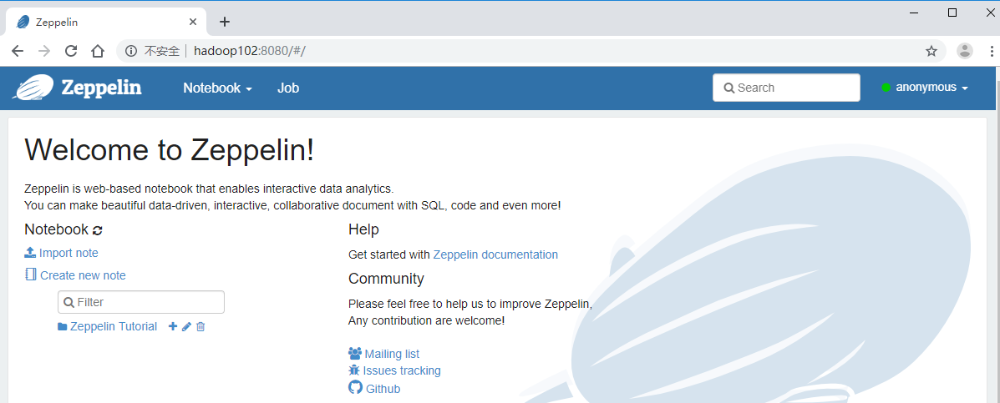
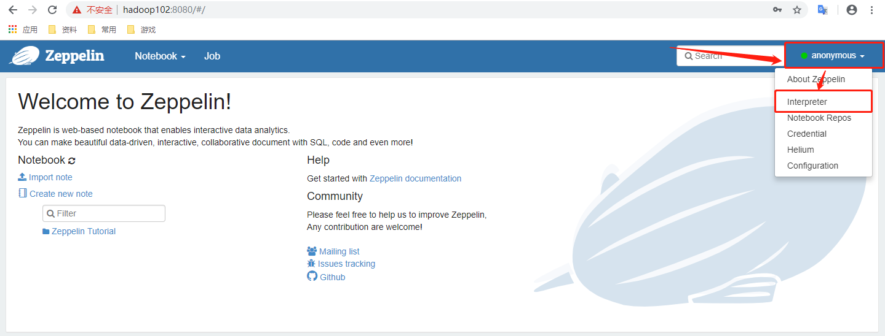
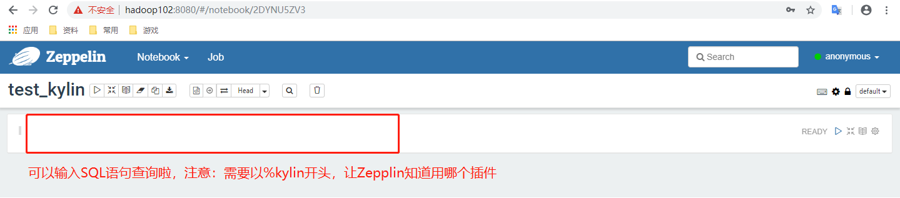
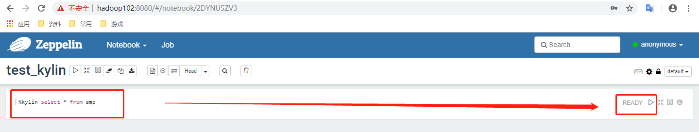
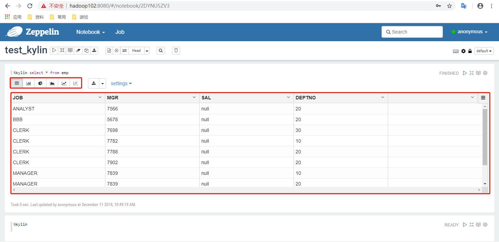

## Zepplin

- 用于查看多种服务组件状态检测


### 安装

- 将zeppelin-0.8.0-bin-all.tgz上传至Linux
- 解压zeppelin-0.8.0-bin-all.tgz之/opt/module

```bash
[ttshe@hadoop102 software]$ tar -zvxf zeppelin-0.8.0-bin-all.tgz -C /opt/module/
[ttshe@hadoop102 module]$ mv zeppelin-0.8.0-bin-all/ zeppelin/
```


### 启动

```bash
[ttshe@hadoop102 zeppelin]$ bin/zeppelin-daemon.sh start
```

- web默认端口号为8080，http://hadoop102:8080




### 配置

- 点击右上角anonymous选择Interpreter



- 搜索Kylin插件并修改相应的配置


- 点击save进行保存


### 使用

- 查询员工详细信息，并使用各种图表进行展示

- 点击Notebook创建新的note


- 填写Note Name点击Create
  - 注意选择默认类型kylin，否则需要每次在脚本中输入%kylin




- 执行查询



- 结果展示



