# 概述

- Apache Kylin是一个开源的分布式==分析引擎==
- 提供Hadoop/Spark之上的SQL查询接口及多维分析（OLAP）能力以支持超大规模数据
- 最初由eBay开发并贡献至开源社区
- 能在亚秒内查询巨大的Hive表


## 特点

- 支持标准SQL接口
  - Kylin是以标准的SQL作为对外服务的接口
- 支持超大规模数据集
  - 对大数据的支撑能力可能是目前所有技术中最为领先的
  - 在2015年eBay的生产环境中就能支持百亿记录的秒级查询
  - 在移动的应用场景中又有了千亿记录秒级查询的案例
- 亚秒级响应
  - 拥有优异的查询相应速度
  - 得益于预计算，很多复杂的计算
    - 如连接、聚合，在离线的预计算过程中就已经完成
    - 大大降低了查询时刻所需的计算量，提高了响应速度
- 可伸缩性
  - 单节点Kylin可实现每秒70个查询
  - 可搭建Kylin的集群
- 高吞吐率
- BI（Business Intelligence 商业智能）工具集成等
  - 与现有的BI工具集成，具体有
    - ODBC
      - 与Tableau、Excel、PowerBI等工具集成
    - JDBC
      - 与Saiku、BIRT等Java工具集成
    - RestAPI
      - 与JavaScript、Web网页集成
  - Kylin开发团队还贡献了**Zepplin**的插件
    - 可使用Zepplin来访问Kylin服务


## 架构

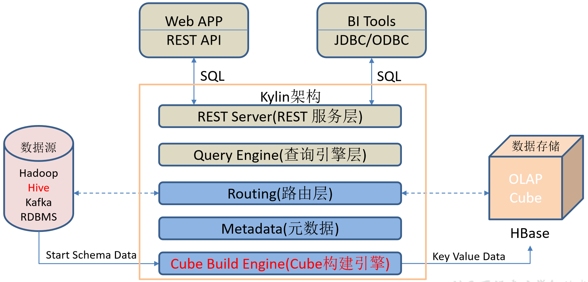

- REST Server
  - 一套面向应用程序开发的入口点
  - 实现针对Kylin平台的应用开发工作
  - 提供查询、获取结果、触发cube构建任务、获取元数据以及获取用户权限等
  - 可通过Restful接口实现SQL查询
- Query Engine
  - 查询引擎
  - 当cube准备就绪后，查询引擎就能够获取并解析用户查询
  - 它随后会与系统中的其它组件进行交互，从而向用户返回对应的结果

- Routing
  - 从==hive中获取数据库的表元数据==
  - 负责将解析的SQL生成的执行计划转换成cube缓存的查询
    - cube是通过预计算，将预计算的==结果缓存在hbase==中
    - 这部分查询可在秒级，毫秒级完成
    - 有一些操作使用过的查询原始数据（存储在Hadoop的hdfs中通过hive查询）这部分查询延迟较高

- Metadata
  - 元数据管理工具
  - Kylin是一款元数据驱动型应用程序
  - 元数据管理工具是一大关键性组件，用于对保存在Kylin当中的所有元数据进行管理
    - 包括最为重要的cube元数据
  - 其它全部组件的正常运作都需以元数据管理工具为基础
  - Kylin的元数据存储在hbase中

- Cube Build Engine
  - 任务引擎
  - 处理所有离线任务，其中包括shell脚本、Java API以及Map Reduce任务等
  - 任务引擎对Kylin当中的全部任务加以管理与协调
  - 确保每一项任务都能得到切实执行并解决其间出现的故障


# 原理

- Apache Kylin的工作原理本质上是MOLAP Cube
  - Multidimension On-Line Analysis Processing
  - 多维立方体分析
  - 是数据分析中非常经典的理论


## 维度

- ==观察数据的角度==
  - 如员工数据
    - 可从性别角度来分析
    - 可以更加细化，从入职时间或者地区的维度来观察
- 是一组离散的值，如
  - 性别中的男和女
  - 时间维度上的每一个独立的日期
- 在统计时将维度值相同的记录聚合在一起，然后应用聚合函数做累加、平均、最大和最小值等聚合计算


## 度量

- 被聚合（观察）的统计值
- ==聚合运算的结果==
- 如
  - 说员工数据中不同性别员工的人数
  - 同一年入职的员工有多少


## Cube&Cuboid

- 一个数据表或者数据模型上的所有字段分两类
  - 维度
  - 度量（可以被聚合）
- 根据维度和度量做预计算的Cube理论

- 给定一个数据模型，可对其上的所有维度进行聚合
  - 对于N个维度来说，组合的所有可能性共有2<sup>n</sup>种
  - 对于每一种维度的组合，将度量值做聚合计算，然后将结果保存为一个物化视图，称为Cuboid
  - 所有维度组合的Cuboid作为一个整体，称为Cube

- 举例
  - 假设有一个电商的销售数据集
  - 其中维度
    - 时间[time]
    - 商品[item]
    - 地区[location]
    - 供应商[supplier]
  - 度量为销售额
  - 所有维度的组合就有2<sup>4</sup> = 16种

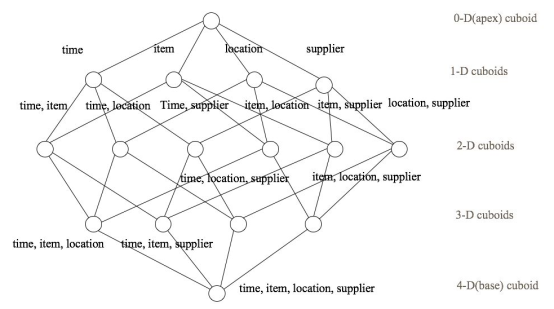


- 一维度（1D）的组合
  - [time]、[item]、[location]和[supplier]4种

- 二维度（2D）的组合
  - [time, item]、[time, location]、[time, supplier]、[item, location]、[item, supplier]、[location, supplier]6种

- 三维度（3D）的组合也有4种

- 零维度（0D）和四维度（4D）各有一种，总共16种

- ==每一种维度组合就是一个Cuboid，16个Cuboid整体就是一个Cube==


## 核心算法

- Kylin的工作原理
  - 对数据模型做Cube==预计算==
  - 利用计算的结果加速查询
- 指定数据模型，定义维度和度量

- 预计算Cube，计算所有Cuboid并保存为物化视图
  - 预计算过程
    - Kylin从Hive中读取原始数据
    - 按照选定的维度进行计算
      - 默认计算引擎为MR
      - 可选Spark作为计算引擎
    - 将结果集保存到Hbase中
    - 一次build的结果称为一个Segment
    - 构建过程中会涉及多个Cuboid的创建
      - ==具体创建过程由`kylin.cube.algorithm`参数决定==
        - 参数值可选`auto`，`layer` 和 `inmem`
        -  默认值为auto
          - 通过采集数据动态地选择一个算法 (layer or inmem)
        - 如果用户很了解 Kylin 和自身的数据、集群，可直接设置喜欢的算法

- 执行查询
  - 读取Cuboid，运行，产生查询结果


### 逐层构建算法 layer

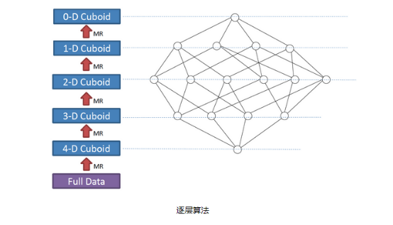

- 一个N维的Cube，是由1个N维子立方体、N个(N-1)维子立方体、N*(N-1)/2个(N-2)维子立方体、......、N个1维子立方体和1个0维子立方体构成，总共有2^N个子立方体组成
- 在逐层算法中，按维度数逐层减少来计算
  - 每个层级的计算是基于它上一层级的结果来计算的
    - ==除了第一层是从原始数据聚合而来==
  - 如，[Group by A, B]的结果，可基于[Group by A, B, C]的结果，去掉C后聚合得来
    - 可减少重复计算
  - 当 0维度Cuboid计算出来的时候，整个Cube的计算完成

- ==每一轮的计算都是一个MapReduce任务，且串行执行==
- ==一个N维的Cube，至少需要N次MapReduce Job==


#### 优点

- 充分利用了MapReduce的能力，处理了中间复杂的排序和洗牌工作
- 算法代码清晰简单，易于维护

- 受益于Hadoop的日趋成熟，此算法对集群要求低，运行稳定
- 在内部维护Kylin的过程中，很少遇到在这几步出错的情况
- 即便是在Hadoop集群比较繁忙的时候，任务也能完成


#### 缺点

- 当Cube有比较多维度的时候，需要的MapReduce任务也相应增加
- 由于Hadoop的任务调度需要耗费额外资源
  - 特别是集群较庞大的时候，反复递交任务造成的额外开销会相当可观

- 由于Mapper不做预聚合，此算法会对Hadoop MapReduce输出较多数据
  - 虽然已经使用了Combiner来减少从Mapper端到Reducer端的数据传输
  - 所有数据依然需要通过Hadoop MapReduce来排序和组合才能被聚合，无形之中增加了集群的压力

- 对HDFS的读写操作较多
  - 由于每一层计算的输出会用做下一层计算的输入，这些Key-Value需要写到HDFS上
  - 当所有计算都完成后，Kylin还需要额外的一轮任务将这些文件转成HBase的HFile格式，以导入到HBase中去

- ==该算法的效率较低，尤其是当Cube维度数较大的时候==


### 快速构建算法 inmem

- 逐段 By Segment 或 逐块 By Split 算法
  - 从**1.5.x**开始引入该算法
- 利用Mapper端计算先完成大部分聚合，再将聚合后的结果交给Reducer
  - 降低对网络瓶颈的压力
- 主要思想
  - 对Mapper所分配的数据块，将它计算成一个完整的小Cube 段（包含所有Cuboid）
  - 每个Mapper将计算完的Cube段输出给Reducer做合并，生成大Cube就是最终结果

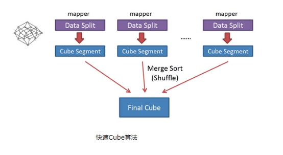

不同于layer

- Mapper会利用内存做预聚合，算出所有组合
- Mapper输出的每个Key都是不同的，减少输出到Hadoop MapReduce的数据量，Combiner也不再需要

- 一轮MapReduce便会完成所有层次的计算，减少Hadoop任务的调配


# 安装


## 地址

- 官网地址 http://kylin.apache.org/cn/

- 官方文档 http://kylin.apache.org/cn/docs/

- 下载地址 http://kylin.apache.org/cn/download/


## 部署

- 将apache-kylin-2.5.1-bin-hbase1x.tar.gz上传到Linux
- 解压apache-kylin-2.5.1-bin-hbase1x.tar.gz到/opt/module

```bash
[ttshe@hadoop102 software]$ tar -zvxf apache-kylin-2.5.1-bin-hbase1x.tar.gz -C /opt/module/
[ttshe@hadoop102 module]$ mv apache-kylin-2.5.1-bin-hbase1x/ kylin
```

- 注意：需要在/etc/profile文件中配置HADOOP_HOME，HIVE_HOME，HBASE_HOME并source使其生效

```bash
export JAVA_HOME=/opt/module/jdk1.8.0_144
export PATH=$PATH:$JAVA_HOME/bin

# HADOOP_HOME
export HADOOP_HOME=/opt/module/hadoop-2.7.2
export PATH=$PATH:$HADOOP_HOME/bin
export PATH=$PATH:$HADOOP_HOME/sbin

#KAFKA_HOME
export KAFKA_HOME=/opt/module/kafka
export PATH=$PATH:$KAFKA_HOME/bin

export HBASE_HOME=/opt/module/hbase
export PATH=$PATH:$HBASE_HOME/bin

export HIVE_HOME=/opt/module/hive
export PATH=$PATH:$HIVE_HOME/bin
```

```bash
source /etc/profile
```


# 使用


## 启动

- 启动Kylin之前要保证HDFS，YARN，ZK，HBASE相关进程是正常运行的

```bash
[atguigu@hadoop102 kylin]$ bin/kylin.sh start
```

- 查看执行情况

```bash
--------------------- hadoop102 ----------------
3360 JobHistoryServer
31425 HMaster
3282 NodeManager
3026 DataNode
53283 Jps
2886 NameNode
44007 RunJar #****
2728 QuorumPeerMain
31566 HRegionServer
--------------------- hadoop103 ----------------
5040 HMaster
2864 ResourceManager
9729 Jps
2657 QuorumPeerMain
4946 HRegionServer
2979 NodeManager
2727 DataNode
--------------------- hadoop104 ----------------
4688 HRegionServer
2900 NodeManager
9848 Jps
2636 QuorumPeerMain
2700 DataNode
2815 SecondaryNameNode
```


## 关闭

```bash
[atguigu@hadoop102 kylin]$ bin/kylin.sh stop
```


## 访问web

- 在http://hadoop102:7070/kylin查看Web页面
- 用户名为：ADMIN
- 密码为：KYLIN
  - 注意是大写


# 示例

- 需求：实现按照维度（工作地点）统计员工信息


## 数据准备

- dept.txt

```text
10	ACCOUNTING	1700
20	RESEARCH	1800
30	SALES	1900
40	OPERATIONS	1700
```

- emp.txt

```text
7369	SMITH	CLERK	7902	1980-12-17	800.00		20
7499	ALLEN	SALESMAN	7698	1981-2-20	1600.00	300.00	30
7521	WARD	SALESMAN	7698	1981-2-22	1250.00	500.00	30
7566	JONES	MANAGER	7839	1981-4-2	2975.00		20
7654	MARTIN	SALESMAN	7698	1981-9-28	1250.00	1400.00	30
7698	BLAKE	MANAGER	7839	1981-5-1	2850.00		30
7782	CLARK	MANAGER	7839	1981-6-9	2450.00		10
7788	SCOTT	ANALYST	7566	1987-4-19	3000.00		20
7839	KING	PRESIDENT		1981-11-17	5000.00		10
7844	TURNER	SALESMAN	7698	1981-9-8	1500.00	0.00	30
7876	ADAMS	CLERK	7788	1987-5-23	1100.00		20
7900	JAMES	CLERK	7698	1981-12-3	950.00		30
7902	FORD	ANALYST	7566	1981-12-3	3000.00		20
7934	MILLER	CLERK	7782	1982-1-23	1300.00		10
```

- 创建数据库，建表

```sql
create database kylin;

create external table if not exists kylin.dept(
deptno int,
dname string,
loc int
)
row format delimited fields terminated by '\t';

create external table if not exists kylin.emp(
empno int,
ename string,
job string,
mgr int,
hiredate string,
sal double,
comm double,
deptno int
)
row format delimited fields terminated by '\t';
```

- 导入数据

```bash
load data local inpath '/opt/module/datas/dept.txt' into table kylin.dept;
load data local inpath '/opt/module/datas/emp.txt' into table kylin.emp;
```

- 查询结果

```bash
select * from emp;
select * from dept;
```

- 然后依次创建项目，创建模块，创建cube


## 创建项目

- 创建工程
  - 填入项目名称，点击submit

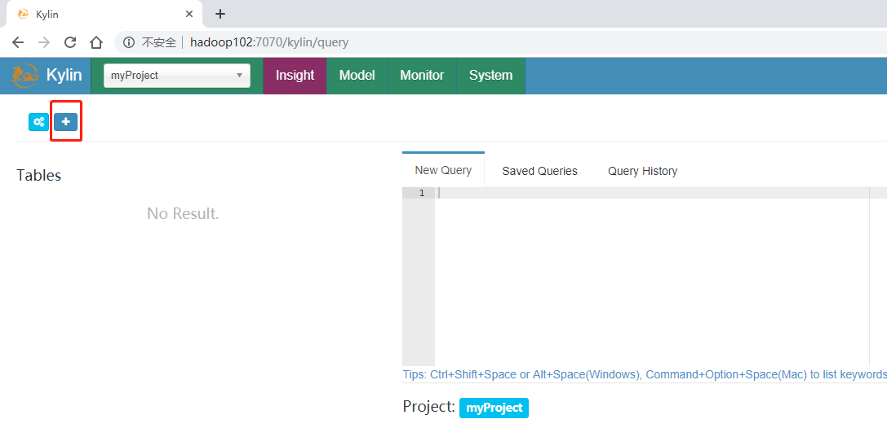

- 选择数据源
  - 注意，这里创建的项目名称是myProject
  - 导入Hive表的信息，在Hive中创建kylin库，从该库中输入表emp和dept

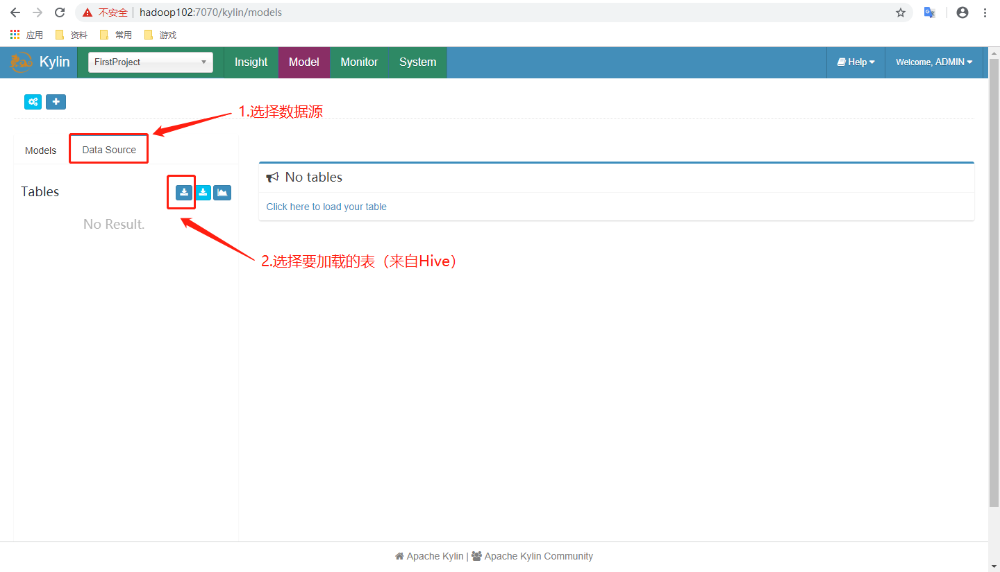

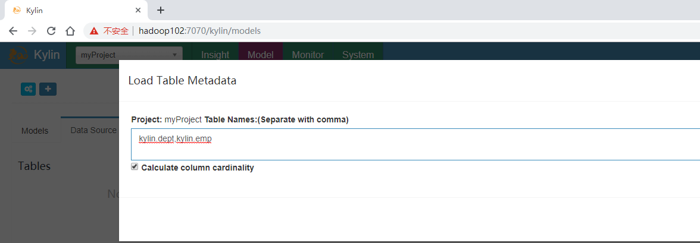

- 点击成功后加载到数据


## 创建Model


- 建立表关系
  - 事实表
    - 只有1个，含有外键
  - 维度表
    - 多个，通过事实表的外键与维度表进行关联
  - 星型模型
    - 只有一级维度表
  - 雪花模型
    - 至少有2级维度表，维度表关联维度表

- 选择事实表

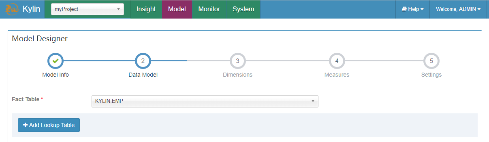

- 选择维度表
  - 添加事实表与维度表之间的关系

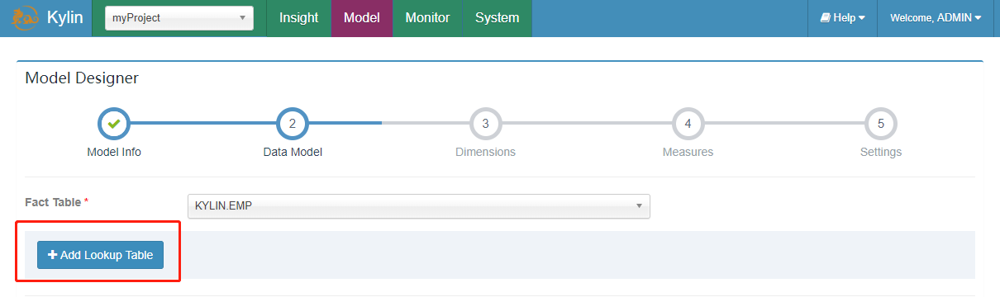

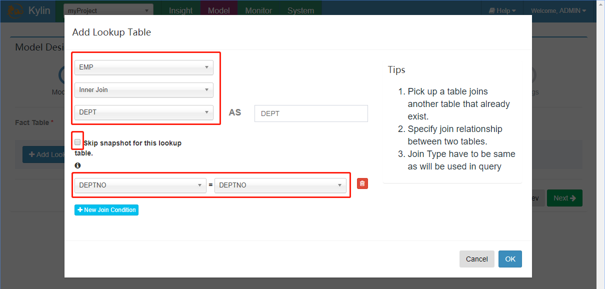

- 只有inner join 和left join ，其他join没有特别的意义
- 点击New Join Condition ，添加选择关联的外键信息

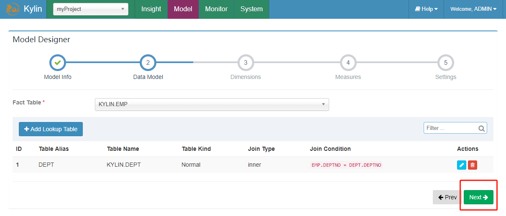

- 选择维度

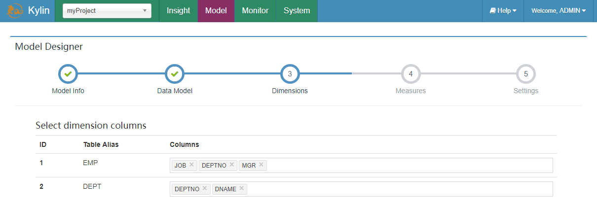

- 选择度量
  - 只有事实表可以选择度量指标
  - 一般选择数值型的列

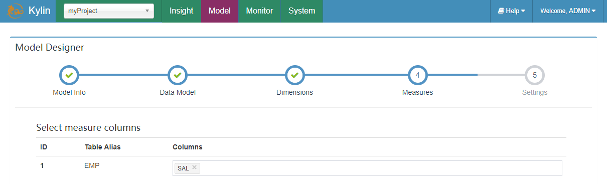

- 分区与过滤
  - 这里没有设置

- 创建完成

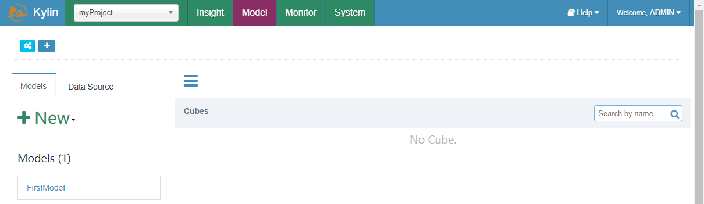


## 创建Cube

- 点击New按钮然后选择New Cube


- 选择Model及填写Cube Name


- 添加维度


- 添加需要做预计算的内容


- 动态更新相关（默认）


- 高阶模块（默认）


- 需要修改的配置


- Cube信息展示


- Cube配置完成


- 触发预计算


- 查看Build进度


- 构建Cube完成


- 查看hbase中存储的元素
```bash
hbase(main):001:0> list                                  
KYLIN_WJNCFM18DS
kylin_metadata
```


# Hive和Kylin性能对比

- 根据部门名称[dname]统计员工薪资总数[sum（sal）]

## Hive查询

```sql
hive (default)> select dname,sum(sal) from emp e join dept d on e.deptno = d.deptno group by dname;
... 执行MR
OK
dname	_c1
ACCOUNTING	8750.0
RESEARCH	10875.0
SALES	9400.0
Time taken: 22.724 seconds, Fetched: 3 row(s)
```


## Kylin查询

- 进入Insight页面

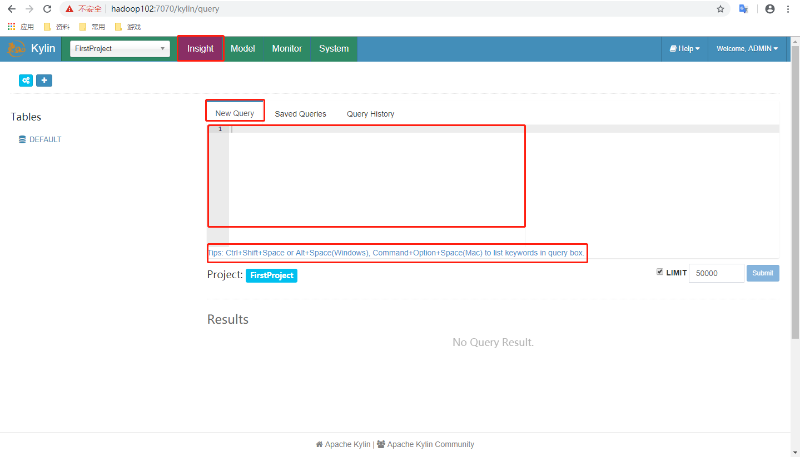

- 查询的前提是有选择度量
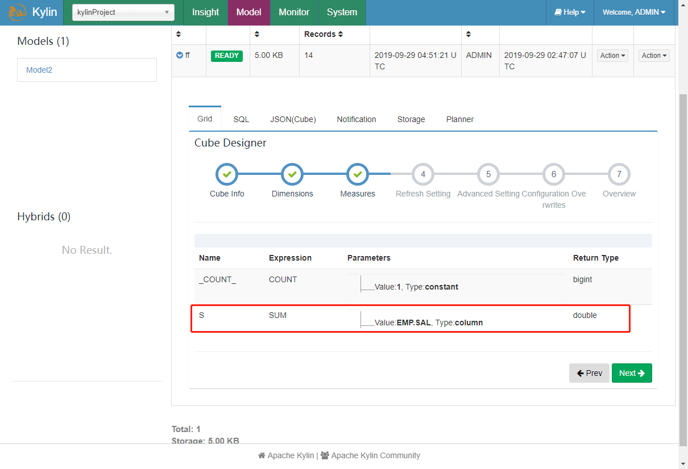

- 在New Query中输入查询语句并Submit

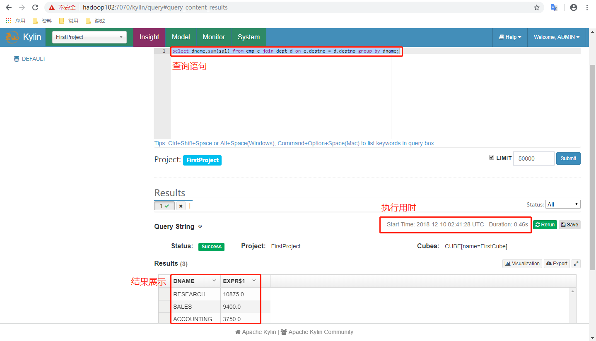

- 数据图表展示及导出

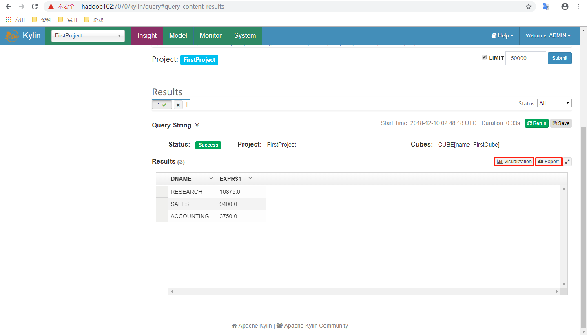

- 查询结果秒级


# 可视化

- 与Kylin结合使用的可视化工具
  - ODBC
    - 与Tableau、Excel、PowerBI等工具集成
  - JDBC
    - 与Saiku、BIRT等Java工具集成
  - RestAPI
    - 与JavaScript、Web网页集成
  - Kylin开发团队还贡献了Zepplin的插件
    - 可使用Zepplin来访问Kylin服务


## JDBC

- 使用JDBC的连接方式进行查询指定的结果

### pom

```xml
<dependency>
    <groupId>org.apache.kylin</groupId>
    <artifactId>kylin-jdbc</artifactId>
    <version>2.5.1</version>
</dependency>
```


### java

```java
package com.stt.demo.kylin;
import java.sql.*;

public class TestKylin {

	public static void main(String[] args) throws ClassNotFoundException, SQLException {

		String driver = "org.apache.kylin.jdbc.Driver";
		String url = "jdbc:kylin://hadoop102:7070/myProject";
		String username = "ADMIN";
		String password = "KYLIN";
		Class.forName(driver);
		// 获取连接
		Connection connection = DriverManager.getConnection(url,username,password);
		// 预编译sql
		String sql = "SELECT SUM(sal) FROM emp GROUP BY deptno";
		PreparedStatement ps = connection.prepareStatement(sql);
		// 执行查询
		ResultSet resultSet = ps.executeQuery();
		// 打印结果
		while(resultSet.next()){
			// 下标从1开始
			System.out.println(resultSet.getDouble(1));
		}
        // 关闭资源
		resultSet.close();
		ps.close();
		connection.close();
	}
}
// 结果
10875.0
8750.0
9400.0
```


## Zepplin

- 可以使用Zepplin进行展示


# Cube构建优化

- 在没有采取任何优化措施的情况下，Kylin会对每一种维度的组合进行预计算，每种维度的组合的预计算结果被称为Cuboid
  - 假设有4个维度，我们最终会有24 =16个Cuboid需要计算
  - 现实情况中用户的维度数量一般远远大于4个
    - 假设用户有10 个维度，那么没有经过任何优化的Cube就会存在210 =1024个Cuboid
    - 如果用户有20个维度，那么Cube中总共会存在220 =1048576个Cuboid
    - 虽然每个Cuboid的大小存在很大的差异，但是单单想到Cuboid的数量就足以让人想象到这样的Cube对构建引擎、存储引擎来说压力有多么巨大
  - 在构建维度数量较多的Cube时要注意Cube的==剪枝优化==
    - 减少Cuboid的生成


## 找到问题的Cube


### 检查Cuboid数量

- 需要在Cube执行完成后，才能分析，不能事先分析

- Kylin提供一个简单的工具，供用户检查Cube中哪些Cuboid 最终被预计算
  - 称其为被物化（Materialized）的Cuboid
    - 给出每个Cuboid所占空间的估计值
  - 该工具需要在对数据进行一定阶段的处理之后才能估算Cuboid的大小
    - 一般来说只能在Cube构建完毕之后再使用该工具
    - 目前这也是该工具的一大不足
  - 由于同一个Cube的不同Segment之间仅是输入数据不同
    - 模型信息和优化策略都是共享的
    - 所以不同Segment中哪些Cuboid被物化哪些没有被物化都是一样的
  - 只要Cube中至少有一个Segment，就能使用如下的命令行工具去检查这个Cube中的Cuboid状态

```bash
bin/kylin.sh org.apache.kylin.engine.mr.common.CubeStatsReader CUBE_NAME
CUBE_NAME：想要查看的cube的名字

[ttshe@hadoop102 kylin]$ bin/kylin.sh org.apache.kylin.engine.mr.common.CubeStatsReader cube1
============================================================================
Statistics of cube1[FULL_BUILD]
Cube statistics hll precision: 14
Total cuboids: 7
Total estimated rows: 51
Total estimated size(MB): 3.027915954589844E-4
Sampling percentage:  100
Mapper overlap ratio: 1.0
Mapper number: 1
Length of dimension KYLIN.EMP.JOB is 1
Length of dimension KYLIN.EMP.MGR is 1
Length of dimension KYLIN.EMP.DEPTNO is 1
|---- Cuboid 111, est row: 10, est MB: 0
    |---- Cuboid 011, est row: 9, est MB: 0, shrink: 90%
        |---- Cuboid 001, est row: 3, est MB: 0, shrink: 33.33%
        |---- Cuboid 010, est row: 7, est MB: 0, shrink: 77.78%
    |---- Cuboid 101, est row: 9, est MB: 0, shrink: 90%
        |---- Cuboid 100, est row: 5, est MB: 0, shrink: 55.56%
    |---- Cuboid 110, est row: 8, est MB: 0, shrink: 80%
----------------------------------------------------------------------------
# 进行了7个Cubeid的计算，注意0维度的省去了
# 逐级构建算法
# 查看shrink 90%以上从Cube进行优化
```

- 从所有的Cuboid及它的分析结果在这棵树中
  - 每个节点代表一个Cuboid，每个Cuboid都由一连串1或0的数字组成
    - 如数字为0，则代表这个Cuboid中不存在相应的维度
    - 如数字为1，则代表这个Cuboid中存在相应的维度
    - 除了最顶端的Cuboid之外，每个Cuboid都有一个父亲Cuboid，且都比父亲Cuboid少了一个“1”
    - 其意义是这个Cuboid就是由它的父亲节点减少一个维度聚合而来的（上卷）
    - 最顶端的Cuboid称为Base Cuboid，它直接由源数据计算而来

- 每行Cuboid的输出中除了0和1的数字串以外，后面还有每个Cuboid 的的行数与父亲节点的对比
  - Shrink值
- 所有Cuboid行数的估计值之和应该等于Segment的行数估计值，每个Cuboid都是在它的父亲节点的基础上进一步聚合而成的
  - 从理论上说每个Cuboid无论是行数还是大小都应该小于它的父亲
- 在这棵树中可以观察每个节点的Shrink值，如果该值接近100%，则说明这个Cuboid虽然比它的父亲Cuboid少了一个维度，但是并没有比它的父亲Cuboid少很多行数据
- 换而言之，即使没有这个Cuboid， 在查询时使用它的父亲Cuboid，也不会有太大的代价
  - ==可以对这个Cuboid进行剪枝操作==


### 检查Cube大小

- 大小扩展比例控制在1000%以内


- 在Web GUI的Model页面选择一个READY状态的Cube，会提示
  - Cube的源数据大小
  - 当前Cube的大小除以源数据大小的比例
    - 膨胀率
    - Expansion Rate

- Cube的膨胀率应该在0%~1000%之间，如果一个Cube的膨胀率超过1000%应当开始挖掘其中的原因
  - Cube中的维度数量较多，且没有进行很好的Cuboid剪枝优化，导致Cuboid数量极多
  - Cube中存在较高基数的维度，导致包含这类维度的每一个Cuboid占用的空间都很大，这些Cuboid累积造成整体Cube体积变大
  - 存在比较占用空间的度量
    - 如Count Distinct，因此需要在Cuboid的每一行中都为其保存一个较大的寄存器，最坏的情况将会导致Cuboid中每一行都有数十KB，从而造成整个Cube的体积变大

- 对于Cube膨胀率居高不下的情况，管理员需要结合实际数据进行分析，灵活地运用接下来介绍的优化方法对Cube进行优化


## 优化构建

- 控制膨胀率
- 查询与基数大小有关


### 使用聚合组

- 聚合组
  - Aggregation Group
  - 强大的剪枝工具
- 聚合组假设一个Cube的所有维度均可以根据业务需求划分成若干组（当然也可以是一个组）
  - 由于同一个组内的维度更可能同时被同一个查询用到，因此会表现出更加紧密的内在关联
- 每个分组的维度集合均是Cube所有维度的一个子集，不同的分组各自拥有一套维度集合它们可能与其他分组有相同的维度，也可能没有相同的维度
- 每个分组各自独立地根据自身的规则贡献出一批需要被物化的Cuboid，所有分组贡献的Cuboid的并集就成为了当前Cube中所有需要物化的Cuboid的集合
- 不同的分组有可能会贡献出相同的Cuboid，构建引擎会察觉到这点，并且保证每一个Cuboid无论在多少个分组中出现，它都只会被物化一次

- 对于每个分组内部的维度，用户可以使用如下三种可选的方式定义，它们之间的关系，具体如下


#### 强制维度（Mandatory）

- 如果一个维度被定义为强制维度，那么这个分组产生的所有Cuboid中每一个Cuboid都会包含该维度
- 每个分组中都可以有0个、1个或多个强制维度
- 如果根据这个分组的业务逻辑，则相关的查询一定会在过滤条件或分组条件中
  - 可在该分组中把该维度设置为强制维

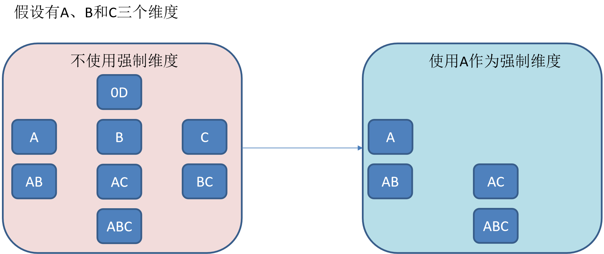


#### 层级维度（Hierarchy）

- 每个层级包含两个或更多个维度。假设一个层级中包含D1，D2…Dn这n个维度，那么在该分组产生的任何Cuboid中， 这n个维度只会以（），（D1），（D1，D2）…（D1，D2…Dn）这n+1种形式中的一种出现
- 每个分组中可以有0个、1个或多个层级，不同的层级之间不应当有共享的维度
- 如果根据这个分组的业务逻辑，则多个维度直接存在层级关系，因此可以在该分组中把这些维度设置为层级维度
- 如A是年，B是月，以A为存在，B单独存在是没有意义的，可以忽略B开始的层级
- 如国家，城市，地区也可以优化

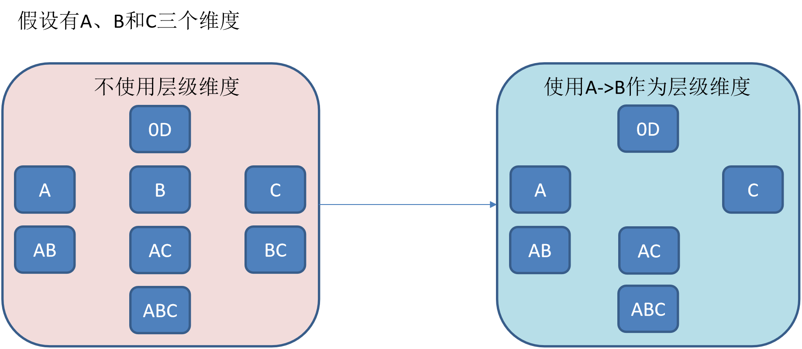


#### 联合维度（Join）

- 是指多个维度与的关系，同时存在或者同时不存在

- 每个分组中可以有0个或多个联合，不同的联合之间不应当有共享的维度
  - 否则它们可以合并成一个联合
- 如根据这个分组的业务逻辑，多个维度在查询中总是同时出现，则在该分组中把这些维度设置为联合维度

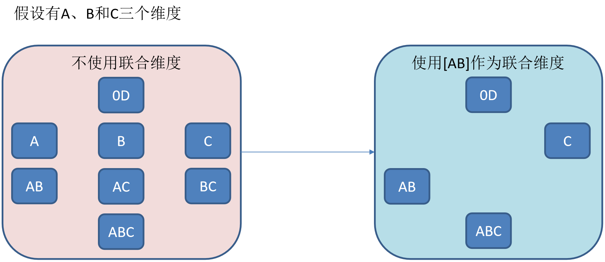


#### 操作

- 在Cube Designer的Advanced Setting中的Aggregation Groups区域完成


- 聚合组的设计非常灵活，甚至可以用来描述一些极端的设计
  - 假设业务需求非常单一，只需要某些特定的Cuboid，那么可以创建多个聚合组，每个聚合组代表一个Cuboid
  - 具体的方法是在聚合组中先包含某个Cuboid所需的所有维度，然后把这些维度都设置为强制维度
    - 当前的聚合组就只能产生那一个Cuboid

- 有时候Cube中有一些==基数非常大的维度==，如果不做特殊处理，它就会和其他的维度进行各种组合，从而产生一大堆包含它的Cuboid
  - 包含高基数维度的Cuboid在行数和体积上往往非常庞大，这会导致整个Cube的膨胀率变大
  - 如果根据业务需求知道这个高基数的维度只会与若干个维度（而不是所有维度）同时被查询到，那么就可以通过聚合组对这个高基数维度做一定的“隔离”
  - 把高基数的维度放入一个单独的聚合组，再把所有可能会与这个高基数维度一起被查询到的其他维度也放进来
    - 高基数的维度就被“隔离”在一个聚合组中
    - 所有不会与它一起被查询到的维度都没有和它一起出现在任何一个分组中，因此也就不会有多余的Cuboid产生
    - 大大减少了包含该高基数维度的Cuboid的数量，有效地控制Cube的膨胀率


### 并发粒度优化

- 当Segment中某一个Cuboid的大小超出一定的阈值时，系统会将该Cuboid的数据分片到多个分区中，以实现Cuboid数据读取的并行化，从而优化Cube的查询速度
- 实现方式
  - 构建引擎根据Segment估计的大小以及参数“kylin.hbase.region.cut”的设置决定Segment在存储引擎中总共需要几个分区来存储
    - 如果存储引擎是HBase，那么分区的数量就对应于HBase中的Region数量
    - kylin.hbase.region.cut
      - 默认值是5.0GB
    - 对于一个大小估计是50GB的Segment，构建引擎会给它分配10个分区
  - 可通过设置kylin.hbase.region.count.min（默认为1）和kylin.hbase.region.count.max（默认为500）两个配置来决定每个Segment最少或最多被划分成多少个分区


# 流式Cube处理

待处理


# 问题处理

- 在创建cube时失败，找到失败的脚本，在hive中执行
  - 发现内存分配不足，扩充机器内存
- `hadoop102:10020 failed on connection exception`
  - 需要启动Job历史服务器