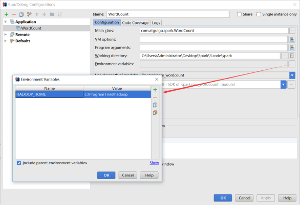

# 案例

Spark Shell仅在测试和验证我们的程序时使用的较多，在生产环境中，通常会在IDE中编制程序，然后打成jar包，然后提交到集群，最常用的是创建一个Maven项目，利用Maven来管理jar包的依赖。


## pom

```xml
<dependencies>
    <dependency>
        <groupId>org.apache.spark</groupId>
        <artifactId>spark-core_2.11</artifactId>
        <version>2.1.1</version>
    </dependency>
</dependencies>
<build>
    <finalName>WordCount</finalName>
    <plugins>
        <plugin>
            <groupId>net.alchim31.maven</groupId>
            <artifactId>scala-maven-plugin</artifactId>
            <version>3.2.2</version>
            <executions>
                <execution>
                    <goals>
                        <goal>compile</goal>
                        <goal>testCompile</goal>
                    </goals>
                </execution>
            </executions>
        </plugin>
        <plugin>
            <groupId>org.apache.maven.plugins</groupId>
            <artifactId>maven-assembly-plugin</artifactId>
            <version>3.0.0</version>
            <configuration>
                <archive>
                    <manifest>
                        <mainClass>WordCount</mainClass>
                    </manifest>
                </archive>
                <descriptorRefs>
                    <descriptorRef>jar-with-dependencies</descriptorRef>
                </descriptorRefs>
            </configuration>
            <executions>
                <execution>
                    <id>make-assembly</id>
                    <phase>package</phase>
                    <goals>
                        <goal>single</goal>
                    </goals>
                </execution>
            </executions>
        </plugin>
    </plugins>
</build>
```


## wordCount

```scala
package com.stt.spark

import org.apache.spark.rdd.RDD
import org.apache.spark.{SparkConf, SparkContext}

object WordCount {
    def main(args: Array[String]): Unit = {
          var path = args(0)
        //var path = "data/spark/wordCount"
        // 创建spark配置对象
        val conf: SparkConf = new SparkConf().setMaster("local")
        .setAppName("WordCount")
        // 创建spark上下文环境
        val sc: SparkContext = new SparkContext(conf)
        // 从开发工具的根目录读取本地文件
        val lines: RDD[String] = sc.textFile(path)
        // 将获取文件的每一行内容扁平化为单词
        val words: RDD[String] = lines.flatMap(_.split(" "))
        // 将每一单词转换为计算的元祖
        val wordAndOnes: RDD[(String, Int)] = words.map((_,1))
        // 根据元组的第一个元素进行聚合统计
        // 将每个Excutor中的结果进行返回汇聚
        val wordAndSum: RDD[(String, Int)] = wordAndOnes.reduceByKey(_+_)
        // 将统计结果收集到内存中展示
        val result: Array[(String, Int)] = wordAndSum.collect()
        // 打印
        result.foreach(println(_))
        // 关闭
        sc.stop()
    }
}
```

- 打成jar包，上传

- 打包到集群测试
  - ==注意是在standalone模式下执行==

```bash
bin/spark-submit \
--class com.stt.spark.WordCount \
--master spark://hadoop102:7077 \
/opt/software/WordCount.jar \
input
```


## 本地调试

本地Spark程序调试需要使用local提交模式，即将本机当做运行环境，Master和Worker都为本机。运行时直接加断点调试即可。如下：

创建SparkConf的时候设置额外属性，表明本地执行

```bash
val conf = new SparkConf().setAppName("WC").setMaster("local[*]")
```

如果本机操作系统是windows，如果在程序中使用了hadoop相关的东西，比如写入文件到HDFS，则会遇到如下异常

 

- 出现这个问题的原因，并不是程序的错误，而是用到了hadoop相关的服务，解决办法是将附加里面的hadoop-common-bin-2.7.3-x64.zip解压到任意目录
  - 在IDEA中配置Run Configuration，添加HADOOP_HOME变量

 


 