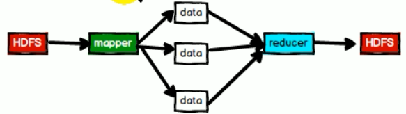
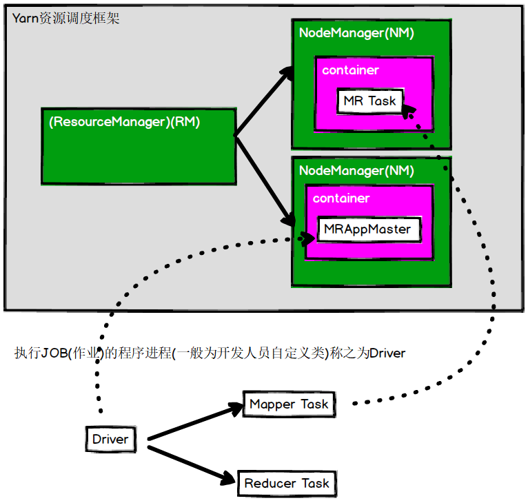
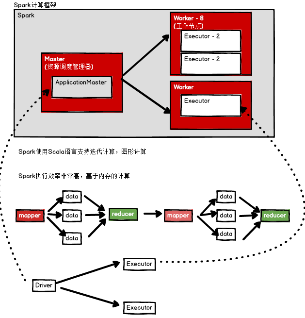
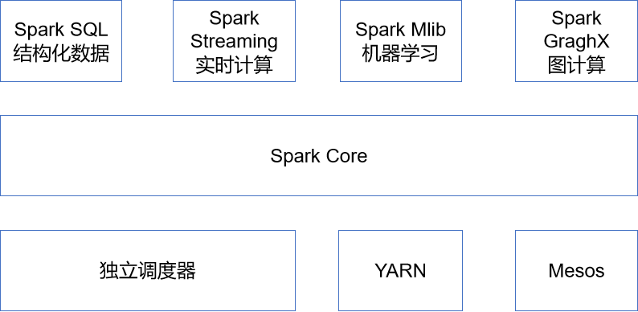

# 介绍

- 博客https://www.iteblog.com/

- 关于Hadoop

  - 2003,2004 google的2篇论文

  - 2006 hadoop作为一个项目开发

  - 2011年1.0版本

  - 2012年3月，稳定版本

  - HDFS存储框架，MapperReduce计算框架

  - 缺点

    - NameNode单点，容易出现单点故障，制约了HDFS的发展

    - NameNode的内存限制影响了HDFS的发展

    - MapperReduce初衷是单一数据计算

      - 将HDFS的数据打散进行reduce处理，但是进行多次MR操作，会有多次IO过程，性能差
        - 每次操作都有IO过程

       

    - MR框架中资源调度存在问题，在早期的版本中

      - 资源调度和任务调度耦合在一起，无法扩展，所以Hadoop1.x只支持MR计算框架
      - JobTracker负责资源和任务的调度
      - JobTracker是单点的

        

  - 2013年10月 Hadoop 2.x版本(Yarn)，用于解决资源调度问题

    - 2.X支持NameNode高可用，与ZK配合使用
    - 2.X支持Yarn资源调度框架，只做资源调度，不进行任务调度
    - MR只做任务调度，可插拔，扩展性强

      

    

- 关于Spark

  - 也是用于解决Hadoop1.x版本中出现的问题，资源调度等问题
    - Spark比Yarn要早，Hadoop2.x与Spark相互参考发展
  - Spark是一种基于==内存==的快速、通用、可扩展的大数据分析引擎
  - 2009年诞生于加州大学伯克利分校AMPLab，项目采用Scala编写
  - 2010年开源;2013年6月成为Apache孵化项目；2014年2月成为Apache顶级项目
  - 是一个计算框架，数据存储由HDFS处理
  - 结构与Hadoop的Yarn类似，相互参考

   


# Spark 内置模块

 

- Spark Core

  - 实现了Spark的基本功能，包含任务调度、内存管理、错误恢复、与存储系统交互等模块
  - 包含了对弹性分布式数据集(Resilient Distributed DataSet，简称RDD)的API定义

- Spark SQL

  - 是Spark用来操作结构化数据的程序包
  - 通过Spark SQL，可使用 SQL或者Apache Hive版本的SQL方言(HQL)来查询数据
  - 支持多种数据源，如Hive表、Parquet以及JSON等

- Spark Streaming

  - 是Spark提供的对实时数据进行流式计算的组件
  - 提供了用来操作数据流的API
  - 与Spark Core中的 RDD API高度对应

- Spark MLlib

  - 提供常见的机器学习(ML)功能的程序库
  - 包括分类、回归、聚类、协同过滤等
  - 提供了模型评估、数据 导入等额外的支持功能

- 集群管理器

  - Spark 设计为可以高效地在一个计算节点到数千个计算节点之间伸缩计算

  - 为了实现这样的要求，同时获得最大灵活性

  - 支持在各种集群管理器(Cluster Manager)上运行

    - Hadoop YARN

    - Apache Mesos

    - Spark自带简易调度器

      - 作独立调度器

        

- Spark得到了众多大数据公司的支持

  - Hortonworks、IBM、Intel、Cloudera、MapR、Pivotal、百度、阿里、腾讯、京东、携程、优酷土豆
  - 当前百度的Spark已应用于大搜索、直达号、百度大数据等业务
  - 阿里利用GraphX构建了大规模的图计算和图挖掘系统，实现了很多生产系统的推荐算法
  - 腾讯Spark集群达到8000台的规模，是当前已知的世界上最大的Spark集群


# 特点

- 快
  - 与Hadoop的MapReduce相比，Spark基于内存的运算要快100倍以上，基于硬盘的运算也要快10倍以上
  - Spark实现了高效的DAG执行引擎，可通过基于内存来高效处理数据流
  - 计算的中间结果是存在于内存中的
- 易用
  - Spark支持Java、Python和Scala的API，支持超过80种高级算法，使用户可以快速构建不同的应用
  - Spark支持交互式的Python和Scala的Shell，可非常方便地在这些Shell中使用Spark集群来验证解决问题的方法
- 通用
  - Spark提供了统一的解决方案
  - Spark可以用于批处理、交互式查询（Spark SQL）、实时流处理（Spark Streaming）、机器学习（Spark MLlib）和图计算（GraphX）
    - 这些不同类型的处理都可以在同一个应用中无缝使用
    - 减少了开发和维护的人力成本和部署平台的物力成本
- 兼容性
  - Spark非常方便地与其他的开源产品进行融合
    - 如Spark可使用Hadoop的YARN和Apache Mesos作为它的资源管理和调度器，并且可以处理所有Hadoop支持的数据，包括HDFS、HBase等
    - 对于已经部署Hadoop集群的用户特别重要，不需要做任何数据迁移就可以使用Spark的强大处理能力

# 地址

- 官网地址http://spark.apache.org/
- 文档查看地址https://spark.apache.org/docs/2.1.1/
- 下载地址https://spark.apache.org/downloads.html


# 集群角色


## Master

- Spark==特有资源调度系统==的Leader
- 掌管着整个集群的资源信息，类似于Yarn框架中的ResourceManager，主要功能
  - 监听Worker，看Worker是否正常工作
  - Master对Worker、Application等的管理
    - 接收worker的注册并管理所有的worker
    - 接收client提交的application
    - (FIFO)调度等待的application并向worker提交


## Worker

- Spark特有资源调度系统的Slave，有多个
- 每个Slave掌管着所在节点的资源信息，类似于Yarn框架中的NodeManager，主要功能
  - 通过RegisterWorker注册到Master
  - 定时发送心跳给Master
  - 根据master发送的application配置进程环境，并启动==StandaloneExecutorBackend==
    - 执行Task所需的临时进程


## Driver 驱动器

- Spark的驱动器是执行开发程序中的main方法的进程
- 负责创建SparkContext、创建RDD，以及进行RDD的转化操作和行动操作代码的执行
  - 如是用spark shell，当启动Spark shell时，系统后台自启了一个Spark驱动器程序，就是在Spark shell中预加载的一个叫作 sc的SparkContext对象
    - 如果驱动器程序终止，那么Spark应用也就结束了
- 主要负责
  - 把用户程序转为任务
  - 跟踪Executor的运行状况
  - 为执行器节点调度任务
  - UI展示应用运行状况


## Executor 执行器

- Spark Executor是一个工作进程，负责在 Spark 作业中运行任务，任务间相互独立
- Spark 应用启动时，Executor节点被同时启动，并且始终伴随着整个 Spark 应用的生命周期而存在
- 如果有Executor节点发生了故障或崩溃，Spark 应用也可以继续执行，会将出错节点上的任务调度到其他Executor节点上继续运行
- 主要负责
  - 运行组成 Spark 应用的任务，并将状态信息返回给驱动器进程
  - 通过自身的块管理器（Block Manager）为用户程序中要求缓存的RDD提供内存式存储
    - RDD是直接缓存在Executor进程内的，因此任务可以在运行时充分利用缓存数据加速运算
- 当executor内存不够，那么该级别的executor不够，降级处理，在同一个worker下的同级别的executor处理（同一个机器中的executor），如果此级别还不够，那么选择同一个机架上的executor
  - 目的，离数据源更近，初始分配时，按照数据源进行分配executor执行的位置


## 小结

- Master和Worker是Spark的守护进程，即Spark在特定模式下正常运行所必须的进程
- Driver和Executor是临时进程，当有具体任务提交到Spark集群才会开启的进程


# 基本语法

```bash
bin/spark-submit \
--class <main-class>
--master <master-url> \
--deploy-mode <deploy-mode> \
--conf <key>=<value> \
... # other options
<application-jar> \
[application-arguments]
```

- 参数说明
  - --master
    - 指定master的地址
      - yarn
      - local
      - spark://hadoop102:7077
  - --class
    - 应用的启动类 (如 org.apache.spark.examples.SparkPi)
  - --deploy-mode
    - 是否发布该驱动到worker节点
      - cluster 
    - 默认值
      - client
      - 作为本地客户端
  - --conf
    - 任意的Spark配置属性
    - 格式key=value
    - 如果值包含空格，可加引号“key=value” 
  - --executor-memory 1G 
    - 指定每个executor可用内存为1G
  - --total-executor-cores 2
    - 指定总的executor使用的cpu核数为2个
  - application-jar
    - 打包好的应用jar,包含依赖. 这个URL在集群中全局可见
    - 如hdfs:// 共享存储系统
    - 如file:// path 则所有节点的path都包含同样的jar
  - application-arguments
    - 传给main()方法的参数