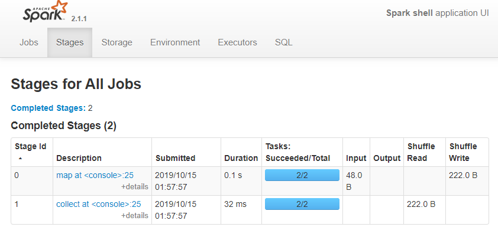
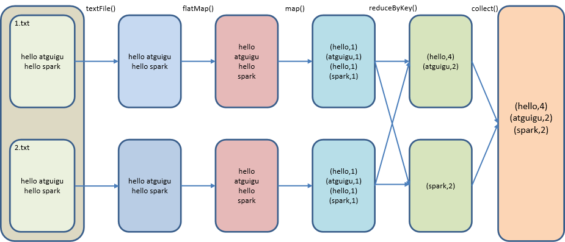
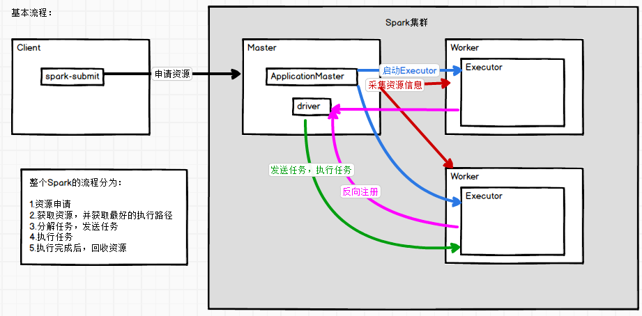
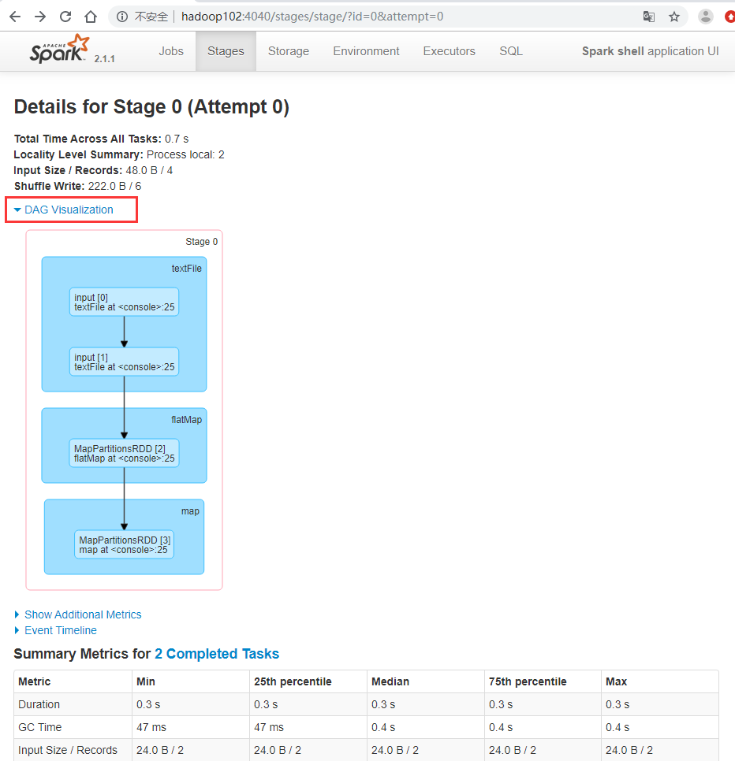
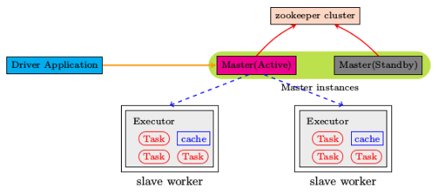
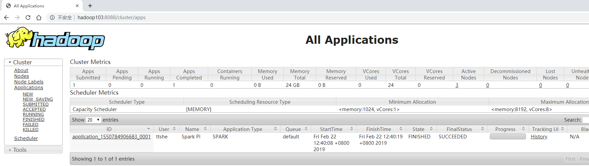
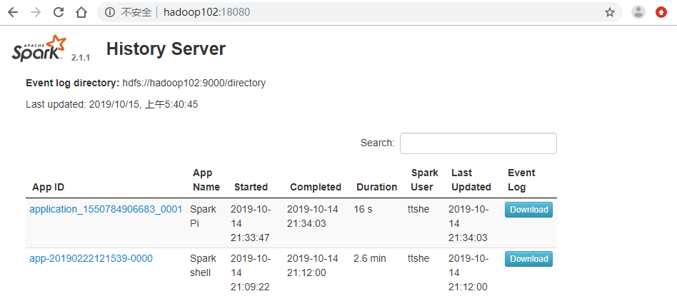

# 安装

- 上传解压
  - **注意**spark的版本与hadoop的版本有关联

```bash
[ttshe@hadoop102 sorfware]$ tar -zxvf spark-2.1.1-bin-hadoop2.7.tgz -C /opt/module/
[ttshe@hadoop102 module]$ mv spark-2.1.1-bin-hadoop2.7 spark
```


# Local 模式

- Local模式就是运行在一台计算机上的模式，通常就是用于在本机上练手和测试
- 通过以下集中方式设置Master
  - local
    - 所有计算都运行在一个线程当中，没有任何并行计算，通常在本机执行一些测试代码
  - local[K]
    - 指定使用几个线程来运行计算
    - 如local[4]就是运行4个Worker线程
    - 通常Cpu有几个Core，就指定几个线程，最大化利用Cpu的计算能力
  - local[*]
    - 直接按照Cpu最多Cores来设置线程数


## spark-submit使用

官方案例

- 注意，在spark中，--class参数不可省略

```bash
[ttshe@hadoop102 spark]$ bin/spark-submit \
--class org.apache.spark.examples.SparkPi \
--executor-memory 1G \
--total-executor-cores 2 \
./examples/jars/spark-examples_2.11-2.1.1.jar \
100
```

- 执行结果
  - 该算法是蒙特·卡罗算法求PI

```bash
...
19/10/15 01:41:25 INFO Executor: Finished task 96.0 in stage 0.0 (TID 96). 1114 bytes result sent to driver
19/10/15 01:41:25 INFO TaskSetManager: Finished task 99.0 in stage 0.0 (TID 99) in 265 ms on localhost (executor driver) (99/100)
19/10/15 01:41:25 INFO TaskSetManager: Finished task 96.0 in stage 0.0 (TID 96) in 391 ms on localhost (executor driver) (100/100)
19/10/15 01:41:25 INFO DAGScheduler: ResultStage 0 (reduce at SparkPi.scala:38) finished in 4.380 s
19/10/15 01:41:25 INFO TaskSchedulerImpl: Removed TaskSet 0.0, whose tasks have all completed, from pool 
19/10/15 01:41:25 INFO DAGScheduler: Job 0 finished: reduce at SparkPi.scala:38, took 4.854334 s
Pi is roughly 3.1415635141563514 # 结果****
19/10/15 01:41:25 INFO SparkUI: Stopped Spark web UI at http://192.168.1.102:4040
19/10/15 01:41:25 INFO MapOutputTrackerMasterEndpoint: MapOutputTrackerMasterEndpoint stopped!
19/10/15 01:41:25 INFO MemoryStore: MemoryStore cleared
19/10/15 01:41:25 INFO BlockManager: BlockManager stopped
19/10/15 01:41:25 INFO BlockManagerMaster: BlockManagerMaster stopped
19/10/15 01:41:25 INFO OutputCommitCoordinator$OutputCommitCoordinatorEndpoint: OutputCommitCoordinator stopped!
19/10/15 01:41:25 INFO SparkContext: Successfully stopped SparkContext
19/10/15 01:41:25 INFO ShutdownHookManager: Shutdown hook called
19/10/15 01:41:25 INFO ShutdownHookManager: Deleting directory /tmp/spark-46dac97b-c56a-4eb9-9998-d538cf58fd80
...
```


## spark-shell使用


### WordCount案例

- 准备文件

```bash
[ttshe@hadoop102 spark]$ mkdir input
[ttshe@hadoop102 spark]$ cd input/
[ttshe@hadoop102 input]$ vim 1.txt
[ttshe@hadoop102 input]$ cat 1.txt
hello spark
hello scala
[ttshe@hadoop102 input]$ cp 1.txt 2.txt
```

- 启动spark-shell

```bash
[ttshe@hadoop102 spark]$ bin/spark-shell
Using Spark's default log4j profile: org/apache/spark/log4j-defaults.properties
Setting default log level to "WARN".
To adjust logging level use sc.setLogLevel(newLevel). For SparkR, use setLogLevel(newLevel).
19/10/15 01:51:24 WARN NativeCodeLoader: Unable to load native-hadoop library for your platform... using builtin-java classes where applicable
19/10/15 01:51:28 WARN ObjectStore: Version information not found in metastore. hive.metastore.schema.verification is not enabled so recording the schema version 1.2.0
19/10/15 01:51:28 WARN ObjectStore: Failed to get database default, returning NoSuchObjectException
19/10/15 01:51:29 WARN ObjectStore: Failed to get database global_temp, returning NoSuchObjectException
# 注意web页面的访问地址
Spark context Web UI available at http://192.168.1.102:4040 
# 注意spark上下文对象 sc
Spark context available as 'sc' (master = local[*], app id = local-1571075485385).
# 注意spark的session对象 spark
Spark session available as 'spark'.
Welcome to
      ____              __
     / __/__  ___ _____/ /__
    _\ \/ _ \/ _ `/ __/  '_/
   /___/ .__/\_,_/_/ /_/\_\   version 2.1.1
      /_/
         
Using Scala version 2.11.8 (Java HotSpot(TM) 64-Bit Server VM, Java 1.8.0_144)
Type in expressions to have them evaluated.
Type :help for more information.

scala> 
```

- 开启另一个CRD窗口

```bash
[ttshe@hadoop102 bin]$ jps
4179 QuorumPeerMain
4949 SparkSubmit # 此时sparkSubmit的进程开启
```

- 运行WordCount程序

```scala
scala> sc.textFile("input").flatMap(_.split(" ")).map((_,1)).reduceByKey(_+_).collect
res0: Array[(String, Int)] = Array((scala,2), (hello,4), (spark,2))
```

- 登录hadoop102:4040查看程序运行

 

 


### WordCount分析

- textFile("input")
  - 读取本地文件input文件夹数据
- `flatMap(_.split(" "))`
  - 压平操作，按照空格分割符将一行数据映射成一个个单词
- `map((_,1))`
  - 对每一个元素操作，将单词映射为元组_
- `reduceByKey(_+_)`
  - 按照key将值进行聚合，相加
- collect
  - 将数据收集到Driver端展示
- 注意
  - 在内存进行了shuffe的过程
    - reduceByKey

  


## 提交操作简易流程

 


# Standalone 模式（重点）


## 运行流程

构建一个由Master+Slave构成的Spark集群，Spark运行在集群中

  

## 配置

- 进入spark安装目录下的conf文件夹

```bash
[ttshe@hadoop102 spark]$ cd conf/
[ttshe@hadoop102 conf]$ cp slaves.template slaves
[ttshe@hadoop102 conf]$ cp spark-env.sh.template spark-env.sh
```

- 修改slave文件，添加work节点

```bash
[ttshe@hadoop102 conf]$ vim slaves
hadoop102
hadoop103
hadoop104
```

- 修改spark-env.sh文件，添加如下配置

```bash
[ttshe@hadoop102 conf]$ vim spark-env.sh

SPARK_MASTER_HOST=hadoop102
SPARK_MASTER_PORT=7077
```

- 分发

```bash
[ttshe@hadoop102 module]$ xsync spark/
```


## 启动

```bash
[ttshe@hadoop102 spark]$ sbin/start-all.sh
starting org.apache.spark.deploy.master.Master, logging to /opt/module/spark/logs/spark-ttshe-org.apache.spark.deploy.master.Master-1-hadoop102.out
hadoop103: starting org.apache.spark.deploy.worker.Worker, logging to /opt/module/spark/logs/spark-ttshe-org.apache.spark.deploy.worker.Worker-1-hadoop103.out
hadoop102: starting org.apache.spark.deploy.worker.Worker, logging to /opt/module/spark/logs/spark-ttshe-org.apache.spark.deploy.worker.Worker-1-hadoop102.out
hadoop104: starting org.apache.spark.deploy.worker.Worker, logging to /opt/module/spark/logs/spark-ttshe-org.apache.spark.deploy.worker.Worker-1-hadoop104.out
[ttshe@hadoop102 spark]$ xcall.sh jps
--------- hadoop102 ----------
27424 Worker
4179 QuorumPeerMain
27507 Jps
3941 NodeManager
27301 Master
3400 NameNode
--------- hadoop103 ----------
55459 DataNode
56885 Jps
56325 QuorumPeerMain
55753 ResourceManager
56809 Worker
55962 NodeManager
--------- hadoop104 ----------
50292 Jps
48629 SecondaryNameNode
48855 NodeManager
48488 DataNode
50216 Worker
49099 QuorumPeerMain
```


## 访问web

- http://hadoop102:8080/

 


## 测试


### spark-submit 官方案例

```bash
[ttshe@hadoop102 spark]$ bin/spark-submit \
--class org.apache.spark.examples.SparkPi \
--master spark://hadoop102:7077 \
--executor-memory 1G \
--total-executor-cores 2 \
./examples/jars/spark-examples_2.11-2.1.1.jar \
100
```


### spark-shell workCount案例

```bash
/opt/module/spark/bin/spark-shell \
--master spark://hadoop102:7077 \
--executor-memory 1g \
--total-executor-cores 2
```

- --master spark://hadoop102:7077指定要连接的集群的master
- 执行wordCount

```bash
scala>sc.textFile("input").flatMap(_.split(" ")).map((_,1)).reduceByKey(_+_).collect
res0: Array[(String, Int)] = Array((hadoop,6), (oozie,3), (spark,3), (hive,3), (atguigu,3), (hbase,6))

scala>
```

- 查看网页可以看到相应的执行情况

 

- 点击进入可以看到执行日志

 

- 注意没有关闭spark-shell，会一直开启进程CoarseGrainedExecutorBackend

```bash
[ttshe@hadoop102 ~]$ xcall.sh jps
--------- hadoop102 ----------
27424 Worker
28241 Jps
4179 QuorumPeerMain
3941 NodeManager
27301 Master
3400 NameNode
27897 CoarseGrainedExecutorBackend
27802 SparkSubmit
--------- hadoop103 ----------
55459 DataNode
57188 Jps
56325 QuorumPeerMain
55753 ResourceManager
56809 Worker
55962 NodeManager
57052 CoarseGrainedExecutorBackend
...
```


## HA配置

 

- zookeeper正常安装并启动
- 修改spark-env.sh文件，添加如下配置

```bash
[ttshe@hadoop102 conf]$ vi spark-env.sh

注释掉如下内容：
#SPARK_MASTER_HOST=hadoop102
#SPARK_MASTER_PORT=7077
添加上如下内容：
export SPARK_DAEMON_JAVA_OPTS="
-Dspark.deploy.recoveryMode=ZOOKEEPER 
-Dspark.deploy.zookeeper.url=hadoop102,hadoop103,hadoop104 
-Dspark.deploy.zookeeper.dir=/spark"
```

- 分发

```bash
[ttshe@hadoop102 conf]$ xsync spark-env.sh
```

- 在==Hadoop102==启动全部节点

```bash
# 如果没有关闭先进行关闭
[ttshe@hadoop102 spark]$ sbin/stop-all.sh 
[ttshe@hadoop102 spark]$ sbin/start-all.sh 
```

- 在==Hadoop103==上单独启动master节点（备份master节点）

```bash
[ttshe@hadoop103 spark]$ sbin/start-master.sh 
```

- 集群访问HA

```bash
/opt/module/spark/bin/spark-shell \
--master spark://hadoop102:7077,hadoop103:7077 \
--executor-memory 2g \
--total-executor-cores 2
```

- 访问hadoop103:8080
  - 当kill掉hadoop102上的master之后访问
  - 当执行一个job时，页面会有各个worker信息

 


## 历史服务

- JobHistoryServer配置
- 修改spark-default.conf.template名称
- 修改spark-default.conf文件，开启Log
- 注意：HDFS上的目录需要提前存在

```bash
[ttshe@hadoop102 spark]$ cd conf/
[ttshe@hadoop102 conf]$ cp spark-defaults.conf.template spark-defaults.conf
[ttshe@hadoop102 conf]$ vim spark-defaults.conf

# 修改如下
spark.eventLog.enabled           true
spark.eventLog.dir               hdfs://hadoop102:9000/directory

[ttshe@hadoop102 conf]$ hadoop fs -mkdir /directory
```

- 修改spark-env.sh文件，添加如下配置

```bash
[ttshe@hadoop102 conf]$ vim spark-env.sh

export SPARK_HISTORY_OPTS="-Dspark.history.ui.port=18080
-Dspark.history.retainedApplications=30 
-Dspark.history.fs.logDirectory=hdfs://hadoop102:9000/directory"
```

- 参数描述
  - spark.eventLog.dir
    - Application在运行过程中所有的信息均记录在该属性指定的路径下
  - spark.history.ui.port=18080
    - WEBUI访问的端口号为18080
  - spark.history.fs.logDirectory=hdfs://hadoop102:9000/directory配置了该属性后，在start-history-server.sh时就无需再显式的指定路径
    - Spark History Server页面只展示该指定路径下的信息
  - spark.history.retainedApplications=30
    - 指定保存Application历史记录的个数，如果超过这个值，旧的应用程序信息将被删除
    - 内存中的应用数，不是页面上显示的应用数
- 分发

```bash
[ttshe@hadoop102 conf]$ xsync spark-defaults.conf
[ttshe@hadoop102 conf]$ xsync spark-env.sh
```

- 启动历史服务

```bash
[ttshe@hadoop102 spark]$ sbin/start-history-server.sh
```

- 再次执行任务

```bash
[ttshe@hadoop102 spark]$ bin/spark-submit \
--class org.apache.spark.examples.SparkPi \
--master spark://hadoop102:7077 \
--executor-memory 1G \
--total-executor-cores 2 \
./examples/jars/spark-examples_2.11-2.1.1.jar \
100
```

- 查看历史服务
  - http://hadoop102:18080/

 

# Yarn 模式（重点）

- Spark客户端直接连接Yarn，不需要额外构建Spark集群
- 有yarn-client和yarn-cluster两种模式
  - ==主要区别在于Driver程序的运行节点==
  - yarn-client
    - Driver程序运行在客户端，适用于交互、调试，希望立即看到app的输出
    - 一般很少在生产中使用
  - yarn-cluster
    - Driver程序运行在由RM（ResourceManager）启动的AM（APPMaster）适用于生产环境


## 模式流程

 

- 客户端提交应用程序
- 让RM启动spark.ApplicationMaster程序，用于spark和yarn资源之间的交互
- AM向RM申请资源，用于启动Executor
- RM获取集群的资源信息（NM）
- RM将资源信息发送给AM，由AM中的Driver判断任务的调度的地址
  - 期间Executor进行反向注册给AM
    - 将Executor所在节点的资源信息返回
  - AM通过资源位置，判断给哪个Executor执行
- 划分任务，将指定的任务发送给Executor执行
- Excutor执行任务，执行完成后，通知Driver
- Driver和AM交互通知RM回收资源

 

## 配置

- 修改hadoop配置文件yarn-site.xml
  - 添加如下内容
  - 在生产中使用默认配置

```xml
[ttshe@hadoop102 hadoop]$ vim yarn-site.xml
<!--是否启动一个线程检查每个任务正使用的物理内存量，如果任务超出分配值，则直接将其杀掉，默认是true -->
<property>
    <name>yarn.nodemanager.pmem-check-enabled</name>
    <value>false</value>
</property>
<!--是否启动一个线程检查每个任务正使用的虚拟内存量，如果任务超出分配值，则直接将其杀掉，默认是true -->
<property>
    <name>yarn.nodemanager.vmem-check-enabled</name>
    <value>false</value>
</property>
# 分发
[ttshe@hadoop102 hadoop]$ xsync yarn-site.xml 
```

- 修改spark-env.sh，添加如下配置

```bash
[ttshe@hadoop102 spark]$ vim conf/spark-env.sh

YARN_CONF_DIR=/opt/module/hadoop-2.7.2/etc/hadoop

[ttshe@hadoop102 module]$ xsync spark/
```


## 测试

- 如果有standalone模式执行的spark可以先关闭
- ==注意在提交任务之前需启动HDFS以及YARN集群==

```bash
[ttshe@hadoop102 spark]$ sbin/stop-all.sh 
[ttshe@hadoop102 spark]$ bin/spark-submit \
--class org.apache.spark.examples.SparkPi \
--master yarn \
--deploy-mode client \
./examples/jars/spark-examples_2.11-2.1.1.jar \
100
```

- 访问页面http://hadoop103:8088/cluster/apps 可以看到执行情况

 

- 访问spark执行历史页面

 


## 历史服务

- ==增加配置将spark的历史服务于Hadoop的历史服务进行关联==
- 修改配置文件spark-defaults.conf

```bash
[ttshe@hadoop102 spark]$ vim conf/spark-defaults.conf
# 增加
spark.yarn.historyServer.address=hadoop102:18080
spark.history.ui.port=18080
```

- 重启spark历史服务

```bash
[ttshe@hadoop102 spark]$ sbin/stop-history-server.sh 
stopping org.apache.spark.deploy.history.HistoryServer
[ttshe@hadoop102 spark]$ sbin/start-history-server.sh 
starting org.apache.spark.deploy.history.HistoryServer, logging to /opt/module/spark/logs/spark-atguigu-org.apache.spark.deploy.history.HistoryServer-1-hadoop102.out
```

- 提交任务到Yarn执行

```bash
[ttshe@hadoop102 spark]$ bin/spark-submit \
--class org.apache.spark.examples.SparkPi \
--master yarn \
--deploy-mode client \
./examples/jars/spark-examples_2.11-2.1.1.jar \
100
```

- ==注意==
  - 若发现yarn模式点击history跳转过去但看不了详细日志，需要在yarn-site.xml中加入以下下配置，并且需要启动mr的历史服务器和spark的历史服务器

```xml
[ttshe@hadoop102 hadoop]$ vim yarn-site.xml 
<property>
    <name>yarn.log.server.url</name>
    <value>http://hadoop102:19888/jobhistory/logs</value>
</property>
[ttshe@hadoop102 hadoop]$ xsync yarn-site.xml 
```

```bash
[ttshe@hadoop102 hadoop-2.7.2]$ sbin/mr-jobhistory-daemon.sh start historyserver
```

- 查看web页面

 


# Mesos 模式

Spark客户端直接连接Mesos；不需要额外构建Spark集群。国内应用比较少，更多的是运用yarn调度


# 模式对比

| 模式       | Spark安装机器数 | 需启动的进程   | 所属者 |
| ---------- | --------------- | -------------- | ------ |
| Local      | 1               | 无             | Spark  |
| Standalone | 3               | Master及Worker | Spark  |
| Yarn       | 1               | Yarn及HDFS     | Hadoop |


# 访问Web


## local-访问job执行

- 可以查看job执行情况
- local模式下

http://hadoop102:4040


## standalone-访问集群主页

- standalone模式下
- 查看集群地址以及内存情况

http://hadoop102:8080/


## all-历史服务

- standalone模式下
- yarn模式下
- 可以查看job执行情况

http://hadoop102:18080/


# idea技巧

- 在idea中，对于变量的类型不清楚的，可以通过设置，生成返回值时添加

 


# [问题]

- 如果遇到 “JAVA_HOME not set” 异常，可以在sbin目录下的spark-config.sh 文件中加入如下配置

```bash
[ttshe@hadoop102 spark]$ $JAVA_HOME
-bash: /opt/module/jdk1.8.0_144: is a directory

export JAVA_HOME=/opt/module/jdk1.8.0_144
```

