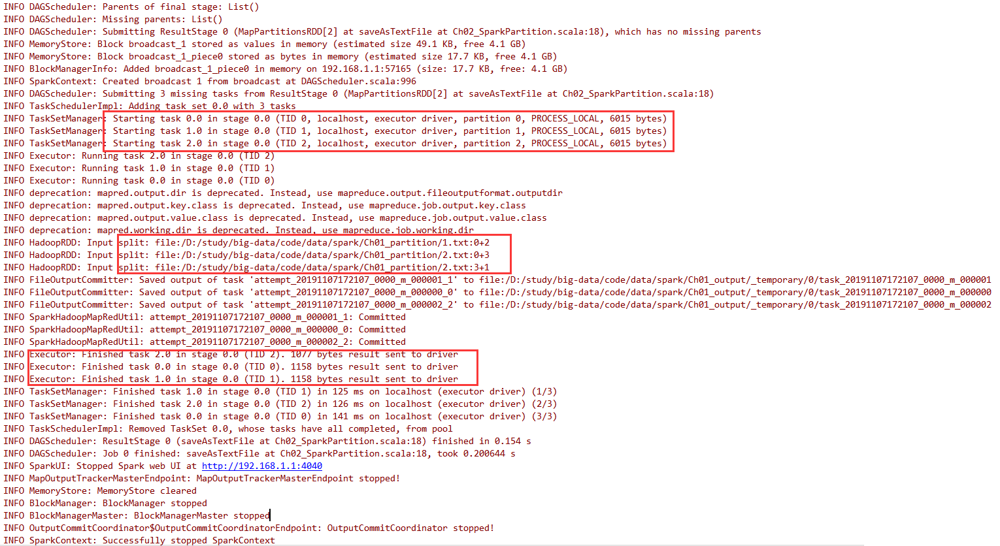

# RDD 创建算子

- 在Spark中创建RDD的创建方式可以分为三种
  - 从集合中创建RDD
  - 从外部存储创建RDD
  - 从其他RDD创建


# 从集合中创建


## parallelize | makeRDD

```scala
scala> sc.parallelize(1 to 10)
res6: org.apache.spark.rdd.RDD[Int] = ParallelCollectionRDD[8] at parallelize at <console>:25

scala> sc.parallelize(Array(1,2,3,4,5,6))
res7: org.apache.spark.rdd.RDD[Int] = ParallelCollectionRDD[9] at parallelize at <console>:25
```

- 在sparkContext.scala中查看源码
  - 直接返回ParallelCollectionRDD对象

```scala
/** Distribute a local Scala collection to form an RDD.
   *
   * @note Parallelize acts lazily. If `seq` is a mutable collection and is altered after the call
   * to parallelize and before the first action on the RDD, the resultant RDD will reflect the
   * modified collection. Pass a copy of the argument to avoid this.
   * @note avoid using `parallelize(Seq())` to create an empty `RDD`. Consider `emptyRDD` for an
   * RDD with no partitions, or `parallelize(Seq[T]())` for an RDD of `T` with empty partitions.
   */
def parallelize[T: ClassTag](
    seq: Seq[T],
    numSlices: Int = defaultParallelism): RDD[T] = withScope {
    assertNotStopped()
    new ParallelCollectionRDD[T](this, seq, numSlices, Map[Int, Seq[String]]())
}
```

- 调用parallelize，说明makeRDD与parallelize是相同的

```scala
/** Distribute a local Scala collection to form an RDD.
   *
   * This method is identical to `parallelize`.
   */
def makeRDD[T: ClassTag](
    seq: Seq[T],
    numSlices: Int = defaultParallelism): RDD[T] = withScope {
    parallelize(seq, numSlices)
}
```


### 并行度-分区设置 [defaultParallelism]

- 在parallelize方法中有`numSlices: Int = defaultParallelism` 设置并行度
  - 默认值`spark.default.parallelism` = max(totalCoreCount,2)
    - totalCoreCount 的默认值是1
      - 如果设置master为local[...]则读取设置决定

```scala
// SparkContext.scala
def defaultParallelism: Int = {
    assertNotStopped()
    taskScheduler.defaultParallelism
}
// taskScheduler.defaultParallelism => TaskScheduler.scala
def defaultParallelism(): Int

// 查看TaskScheduler的实现类TaskSchedulerImpl
override def defaultParallelism(): Int = backend.defaultParallelism()

// SchedulerBackend.scala
def defaultParallelism(): Int

// 找到SchedulerBackend的实现类CoarseGrainedSchedulerBackend
override def defaultParallelism(): Int = {
    // getInt ,如果没有设置值，使用后面的默认值
   conf.getInt("spark.default.parallelism",math.max(totalCoreCount.get(), 2))
}
```


# 从外部存储创建


## textFile


### 从HDFS读取数据

- 包括本地的文件系统，还有所有Hadoop支持的数据集，比如HDFS、Cassandra、HBase等

```scala
scala> val rdd2= sc.textFile("hdfs://hadoop102:9000/RELEASE")
rdd2: org.apache.spark.rdd.RDD[String] = hdfs:// hadoop102:9000/RELEASE MapPartitionsRDD[4] at textFile at <console>:24
```


### 分区设置 [minPartitions]

- 从textFile中有默认值minPartitions的配置
  - 默认defaultMinPartitions = min(defaultParallelism并行度,2)

```scala
// SparkContext.scala
def textFile(
    path: String,
    minPartitions: Int = defaultMinPartitions): RDD[String] = withScope {
    assertNotStopped()
    hadoopFile(path, classOf[TextInputFormat], classOf[LongWritable], classOf[Text],
               minPartitions).map(pair => pair._2.toString).setName(path)
}

// 与并行度有关
def defaultMinPartitions: Int = math.min(defaultParallelism, 2)
```


### textFile读取与Hadoop的关系

- textFile需要和hadoopFile进行关联，注意hdfs的开启，即使是local模式

```scala
/**
   * Read a text file from HDFS, a local file system (available on all nodes), or any
   * Hadoop-supported file system URI, and return it as an RDD of Strings.
   */
def textFile(
    path: String,
    minPartitions: Int = defaultMinPartitions): RDD[String] = withScope {
    assertNotStopped()
    // 注意这里hadoopFile关键字
    hadoopFile(path, classOf[TextInputFormat], classOf[LongWritable], classOf[Text],
               minPartitions).map(pair => pair._2.toString).setName(path)
}
```


# 分区源码解析

- ==Task与Partition是一一对应的关系==
- Partition是变化的，聚合操作之后数据量会变小，分区可能会减少
- 分区的个数决定了任务的个数

 


## local下创建内存RDD分区分析

```scala
package com.stt.spark
import org.apache.spark.{SparkConf, SparkContext}
object Ch01_SparkPartition {
    def main(args: Array[String]): Unit = {

        // 分区个数1
        // val sc = new SparkContext(new SparkConf().setMaster("local").setAppName("ch1_spark_partition"))
        // 分区个数4
        // val sc = new SparkContext(new SparkConf().setMaster("local[4]").setAppName("ch1_spark_partition"))
        // 分区个数12 按照当前cpu核数而来
        val sc = new SparkContext(new SparkConf().setMaster("local[*]").setAppName("ch1_spark_partition"))

        print(sc.makeRDD(Array(1,2,3,4,5)).partitions.length)
        sc.stop()
    }
}
```

- 源码分析
  - local模式运行，则查看LocalSchedulerBackend实现

 

```scala
// SparkContext.scala
def makeRDD[T: ClassTag](
    seq: Seq[T],
    numSlices: Int = defaultParallelism): RDD[T] = withScope {
    parallelize(seq, numSlices)
}

def defaultParallelism: Int = {
    assertNotStopped()
    taskScheduler.defaultParallelism
}
// TaskScheduler.scala
def defaultParallelism(): Int

// 查看TaskScheduler的实现类TaskSchedulerImpl
override def defaultParallelism(): Int = backend.defaultParallelism()

// SchedulerBackend.scala
def defaultParallelism(): Int

// 找到SchedulerBackend的实现类LocalSchedulerBackend
override def defaultParallelism(): Int =
scheduler.conf.getInt("spark.default.parallelism", totalCores)

// 查看totalCores来源
private[spark] class LocalEndpoint(
    override val rpcEnv: RpcEnv,
    userClassPath: Seq[URL],
    scheduler: TaskSchedulerImpl,
    executorBackend: LocalSchedulerBackend,
    private val totalCores: Int)
extends ThreadSafeRpcEndpoint with Logging {}

// 在sparkContext中
private def createTaskScheduler(
    sc: SparkContext,
    master: String,
    deployMode: String): (SchedulerBackend, TaskScheduler) = {
    import SparkMasterRegex._

    // When running locally, don't try to re-execute tasks on failure.
    val MAX_LOCAL_TASK_FAILURES = 1

    master match {
        case "local" =>
        val scheduler = new TaskSchedulerImpl(sc, MAX_LOCAL_TASK_FAILURES, isLocal = true)
        // ***创建LocalSchedulerBackend，传入的是1作为totalCores
        val backend = new LocalSchedulerBackend(sc.getConf, scheduler, 1)
        scheduler.initialize(backend)
        (backend, scheduler)

        case LOCAL_N_REGEX(threads) =>
        def localCpuCount: Int = Runtime.getRuntime.availableProcessors()
        // local[*] estimates the number of cores on the machine; local[N] uses exactly N threads.
        // 如果是local[n],判断n的值，如果n是*，则使用cpu的核数
        val threadCount = if (threads == "*") localCpuCount else threads.toInt
        if (threadCount <= 0) {
            throw new SparkException(s"Asked to run locally with $threadCount threads")
        }
        val scheduler = new TaskSchedulerImpl(sc, MAX_LOCAL_TASK_FAILURES, isLocal = true)
        val backend = new LocalSchedulerBackend(sc.getConf, scheduler, threadCount)
        scheduler.initialize(backend) ...
}  
```

- 如果使用local模式访问spark，默认内存RDD分区为1
- 如果使用local[k]模式访问spark，那么默认的内存RDD分区为k
- 如果使用local[*]模式访问spark，那么默认的内存RDD分区为当前CPU的最大核心数


## local下读取文件创建RDD分区分析

- 创建文件
- 1.txt
  - 大小2个字节

```txt
12
```

- 2.txt
  - 大小4个字节，含有换行\r\n

```txt
3
4
```

- 分析代码

```scala
package com.stt.spark

import org.apache.spark.rdd.RDD
import org.apache.spark.{SparkConf, SparkContext}

object Ch02_SparkPartition {
    def main(args: Array[String]): Unit = {

        val sc = new SparkContext(new SparkConf().setMaster("local[*]").setAppName("ch1_spark_partition"))

        val rdd: RDD[String] = sc.textFile("data/spark/Ch01_partition")
        // 结果是3
        println(rdd.partitions.length)
        // 将结果不做修改的输出到本地
        // 结果3个文件，最后一个文件为空
        rdd.saveAsTextFile("data/spark/Ch01_output")
        sc.stop()
    }
}
```

- 执行日志
  - 分片的规划，最终读取是先按照字节大小然后按行读取
  - 产生了3个任务
  - 在任务结束后发送结果给Driver

 

- 源码分析

```scala
// SparkContext.scala
def textFile(
    path: String,
    minPartitions: Int = defaultMinPartitions): RDD[String] = withScope {
    assertNotStopped()
    hadoopFile(path, classOf[TextInputFormat], classOf[LongWritable], classOf[Text],
               minPartitions).map(pair => pair._2.toString).setName(path)
}
// 与并行度有关，此处defaultParallelism是12，那么defaultMinPartitions是2
def defaultMinPartitions: Int = math.min(defaultParallelism, 2)
```

```java
// 注意hadoopFile对象的使用，那么使用的是hadoop的分片规则，128M的1.1倍作为一个分片
// 查看TextInputFormat 以及FileInputFormat 得到分片函数
public InputSplit[] getSplits(JobConf job, int numSplits)
    throws IOException {
    ... 
        long totalSize = 0;                           // compute total size
    for (FileStatus file: files) {                // check we have valid files
        if (file.isDirectory()) {
            throw new IOException("Not a file: "+ file.getPath());
        }
        // 统计文件的大小，2+4个字节
        totalSize += file.getLen();
    }
    // numSplits 是 defaultMinPartitions 值为2
    long goalSize = totalSize / (numSplits == 0 ? 1 : numSplits); // goalSize是3个字节
    // 值为1B
    long minSize = Math.max(job.getLong(org.apache.hadoop.mapreduce.lib.input.
                                        FileInputFormat.SPLIT_MINSIZE, 1), minSplitSize);
...
        // 每个文件一个分区
        for (FileStatus file: files) {
            Path path = file.getPath();
            long length = file.getLen();
            if (length != 0) {
                FileSystem fs = path.getFileSystem(job);
                BlockLocation[] blkLocations;
                if (file instanceof LocatedFileStatus) {
                    blkLocations = ((LocatedFileStatus) file).getBlockLocations();
                } else {
                    blkLocations = fs.getFileBlockLocations(file, 0, length);
                }
                if (isSplitable(fs, path)) {
                    // 本地文件的块大小是32M，hdfs上是128M
                    long blockSize = file.getBlockSize();
                    // 该当前文件的分片的大小，1B,3B，32MB，最后计算的值是3B
                    long splitSize = Math.max(minSize, Math.min(goalSize, blockSize));
                    long bytesRemaining = length;
                    // 判断文件的大小是否大于3B的1.1倍，从而判断是否要分片
                    // 第一个文件2B，第二个文件4B超过了3B的1.1，进行分区
                    while (((double) bytesRemaining)/splitSize > SPLIT_SLOP) {
                        String[] splitHosts = getSplitHosts(blkLocations,
                                                            length-bytesRemaining, splitSize, clusterMap);
                        // 需要进行分片，进行分片操作
                        splits.add(makeSplit(path, length-bytesRemaining, splitSize,
                                             splitHosts));
                        bytesRemaining -= splitSize;
                    }
...
```

- 为什么最后一个文件的分片是2个，但是后一个文件是空的
  - 最后一个文件4B，读取3B大小，由于读取的是文本，==每次要读取一行==，读取到第三个字节时，正好换行，将第二行4读取完，所以最后一个分区的内容是空
- **分区按照字节大小分，读取按照字节大小一行一行的读取，最终有分区大小的区别**