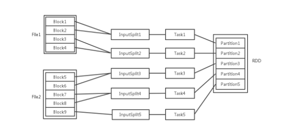

# RDD相关概念关系

   

- 输入可能以多个文件的形式存储在HDFS上，每个File都包含了很多块，称为Block
- 当Spark读取这些文件作为输入时，会根据具体数据格式对应的InputFormat进行解析，一般是将若干个Block合并成一个输入分片，称为InputSplit
  - ==注意InputSplit不能跨越文件==
- 随后将为这些输入分片生成具体的Task
- InputSplit与Task是一一对应的关系，随后这些具体的Task每个都会被分配到集群上的某个节点的某个Executor去执行（放在TaskPool，Executor去取Task）
  - 每个节点可以启一个或多个Executor
  - 每个Executor由若干core组成，每个Executor的每个core一次只能执行一个Task
  - 每个Task执行的结果就是生成了目标RDD的一个partiton
- 注意: ==这里的core是虚拟的core而不是机器的物理CPU核，可理解是Executor的一个工作线程==
  - Task被执行的并发度 = Executor数目 * 每个Executor核数
  - 至于partition的数目，对于数据读入阶段，如sc.textFile，输入文件被划分为多少InputSplit就会需要多少初始Task
  - 在Map阶段partition数目保持不变
    - 窄依赖不更改分区个数
  - 在Reduce阶段，RDD的聚合会触发shuffle操作，聚合后的RDD的partition数目跟具体操作有关
    - 如repartition操作会聚合成指定分区数，还有一些算子是可配置的
    - 如果不指定，会将上一个阶段的分区值移动到下一个阶段

- RDD在计算的时候，每个分区都会起一个task，所以rdd的分区数目决定了总的的task数目
- 申请的计算节点（Executor）数目和每个计算节点核数，决定同一时刻可并行执行的task
  - 如RDD有100个分区
    - 计算时会生成100个task
    - 资源配置为10个计算节点，每个两2个核，同一时刻可并行的task数目为20
    - 计算这个RDD需要5个轮次
    - 如果计算资源不变，有101个task，需要6个轮次，在最后一轮中，只有一个task在执行，其余核都在空转
    - 如果计算资源不变，RDD只有2个分区，那么同一时刻只有2个task运行，其余18个核空转，造成资源浪费
      - ==在spark调优中，增大RDD分区数目，增大任务并行度的做法==

# 总结

 

