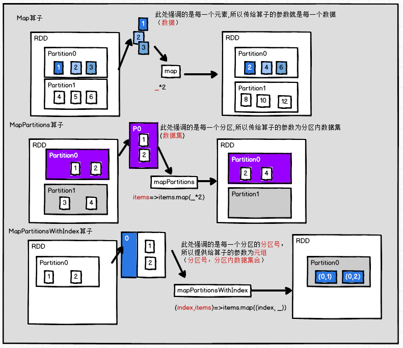
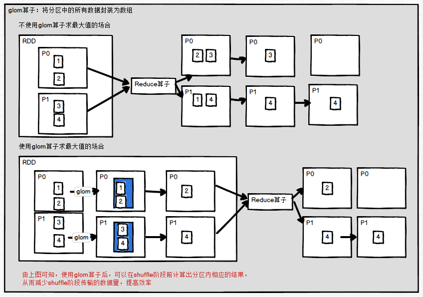
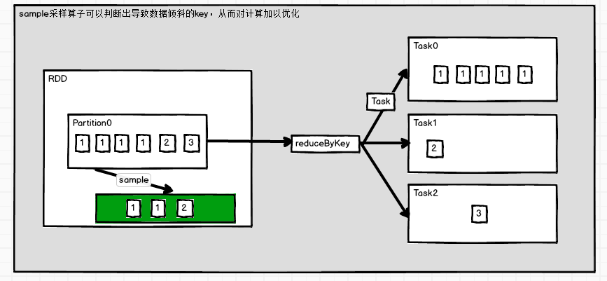
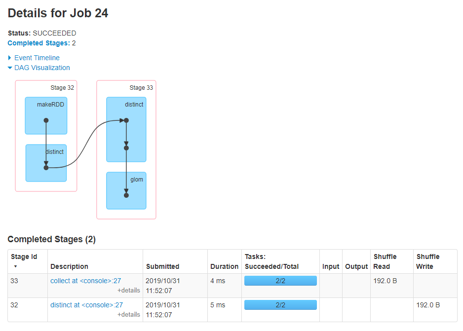
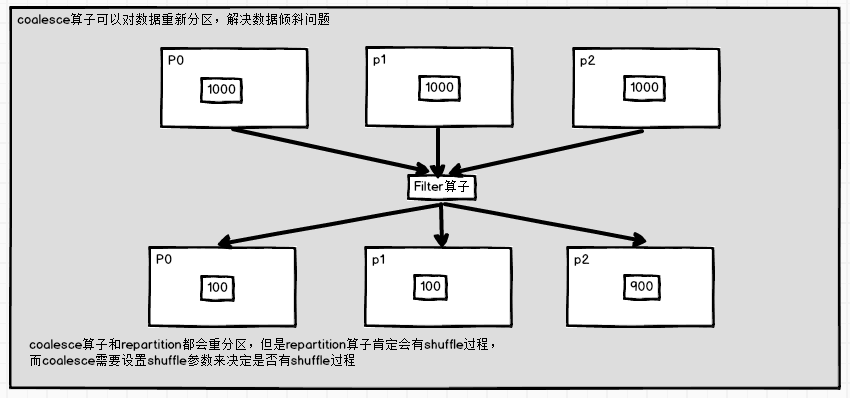
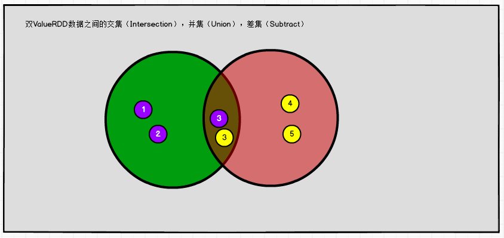
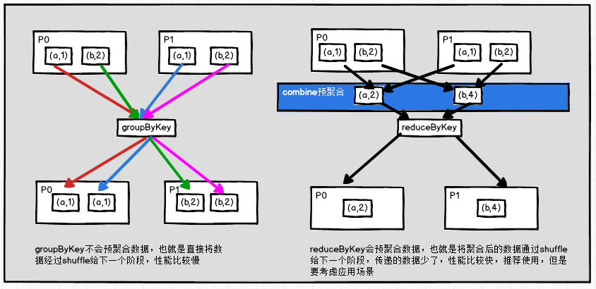
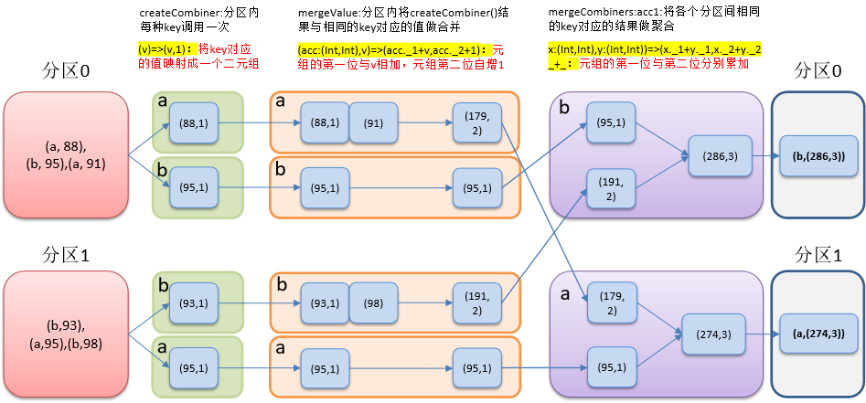

# RDD 转换算子（重点）

RDD整体上分为Value类型和Key-Value类型


# value类型

- 表示每次操作的输入是一个value值


## map

- map(func)
- 返回一个新的RDD，该RDD由每一个输入元素经过func函数转换后组成
- 需求
  - 创建一个1-10数组的RDD，将所有元素*2形成新的RDD

```scala
scala> sc.makeRDD(1 to 10).map(x=>x*2).collect
res0: Array[Int] = Array(2, 4, 6, 8, 10, 12, 14, 16, 18, 20)

scala> val re = sc.makeRDD(1 to 10).map(_*2)
re: org.apache.spark.rdd.RDD[Int] = MapPartitionsRDD[3] at map at <console>:24

scala> re.collect()
res1: Array[Int] = Array(2, 4, 6, 8, 10, 12, 14, 16, 18, 20)
```


## mapPartitions

- mapPartitions(func)
- 类似于map，但独立地在RDD的每一个分片上运行
- 在类型为T的RDD上运行时，func的函数类型必须是Iterator[T] => Iterator[U]
- 假设有N个元素，有M个分区
  - 如果map操作将被调用N次
  - 如果mapPartitions操作被调用M次，一个函数一次处理所有分区
- 需求：创建一个RDD，使每个元素*2组成新的RDD

```scala
scala> sc.makeRDD(1 to 10).mapPartitions(x=>x.map(_*2)).collect
res2: Array[Int] = Array(2, 4, 6, 8, 10, 12, 14, 16, 18, 20)
```


### 与map的区别

- map()
  - 每次处理一条数据
- mapPartitions()
  - 每次处理一个分区的数据，这个分区的数据处理完后，原RDD中分区的数据才能释放
  - 可能导致OOM
- 开发指导：当内存空间较大的时候建议使用mapPartition()，以提高处理效率


## mapPartitionsWithIndex

- mapPartitionsWithIndex(func)
- 类似mapPartitions，但func带有一个整数参数表示分片的索引值
- 在类型为T的RDD上运行时，func的函数类型必须是(Int, Interator[T]) => Iterator[U]

```scala
def mapPartitionsWithIndex[U: ClassTag](
    f: (Int, Iterator[T]) => Iterator[U],
    preservesPartitioning: Boolean = false): RDD[U] = withScope {
```

- 使用场景，需要对每个分区内部进行统计或者计算
- 需求
  - 创建一个RDD，使每个元素跟所在分区形成一个元组组成一个新的RDD

```scala
scala> sc.makeRDD(1 to 10).mapPartitionsWithIndex((index,items)=>items.map(v=>(index,v))).collect
res5: Array[(Int, Int)] = Array((0,1), (1,2), (2,3), (3,4), (3,5), (4,6), (5,7), (6,8), (7,9), (7,10))

// 注意这里index和items不能省略，可省略的前提是可以推断出来
scala> sc.makeRDD(1 to 10,2).mapPartitionsWithIndex((index,items)=>items.map((index,_))).collect
res6: Array[(Int, Int)] = Array((0,1), (0,2), (0,3), (0,4), (0,5), (1,6), (1,7), (1,8), (1,9), (1,10))
```

- 注意默认逻辑分区是8
  - `Spark context available as 'sc' (master = local[*], app id = local-1572459943426).`
  - 使用的是local[*]，在makeRDD中，当前环境是8核>2
- 查看执行的job情况
  - 2个分区就是2个task

 


### 与 map，mapPartition的区别

 


## flatMap

- flatMap(func)
- 类似于map，每一个输入元素可以被映射为0或多个输出元素
- func返回一个序列，不是单一元素
  - TraversableOnce返回值需要是可迭代类型

```scala
def flatMap[U: ClassTag](f: T => TraversableOnce[U]): RDD[U] = withScope {
    val cleanF = sc.clean(f)
    new MapPartitionsRDD[U, T](this, (context, pid, iter) => iter.flatMap(cleanF))
}
```

- 示例1：返回值是一个字符串，而字符串是可迭代的类型

```scala
scala> sc.makeRDD(1 to 6).flatMap(_.toString).collect
res10: Array[Char] = Array(1, 2, 3, 4, 5, 6)
```

- 示例2

```scala
scala> sc.makeRDD(1 to 5).flatMap(1 to _).collect
res18: Array[Int] = Array(1, 1, 2, 1, 2, 3, 1, 2, 3, 4, 1, 2, 3, 4, 5)
```


## glom

- 将==每一个分区形成一个数组==，形成新的RDD类型时RDD[Array[T]]
- 需求
  - 创建一个4个分区的RDD，并将每个分区的数据放到一个数组
  - 将每个分区的数据放到一个数组并收集到Driver端打印

```scala
scala> sc.makeRDD(1 to 16,4).glom.collect
res19: Array[Array[Int]] = Array(Array(1, 2, 3, 4), Array(5, 6, 7, 8), Array(9, 10, 11, 12), Array(13, 14, 15, 16))
```

- 应用：计算最大值
  - 先将分区内的数据进行求最大值，再计算最终的最大值
  - 好处：减少shuffle过程中的数据传输，提高效率

```scala
scala> sc.makeRDD(1 to 4,2).glom.map(items=>items.max).reduce(_.max(_))
res5: Int = 4
```

   


## groupBy

- groupBy(func)
- 分组：按照传入函数的value值进行分组
  - 有shuffle过程
- func是value的分组规则，返回元组数组，元组包含分组的key和同属一个key的value集合
- 需求：创建一个RDD，按照元素模以2的值进行分

```scala
scala> sc.makeRDD(1 to 4).groupBy(_%2).collect
res0: Array[(Int, Iterable[Int])] = Array((0,CompactBuffer(2, 4)), (1,CompactBuffer(1, 3)))
```

- 示例

```scala
scala> sc.makeRDD(Array("abc","def","aaa")).groupBy(_.contains("a")).collect
res8: Array[(Boolean, Iterable[String])] = Array((false,CompactBuffer(def)), (true,CompactBuffer(abc, aaa)))
```


## filter

- filter(func)
- 过滤：返回一个新的RDD，该RDD由经过func函数计算后返回值为true的输入元素组成。
- 需求：创建一个RDD（由字符串组成），过滤出一个新RDD（包含”x”子串）

```scala
scala> sc.makeRDD(Array("xyz","abc","xxx","ttt")).filter(_.contains("x")).collect
res3: Array[String] = Array(xyz, xxx)
```


## sample

- 抽样
  - withReplacement 表示抽出的数据是否放回
    - true抽取放回：Poisson泊松抽样
      - fraction：抽取的次数
    - false抽取不放回：伯努利抽样
      - fraction：抽取概率（0-1），每个元素被抽取的概率
  - seed用于指定随机数生成器种子

```scala
def sample(
    withReplacement: Boolean,
    fraction: Double,
    seed: Long = Utils.random.nextLong): RDD[T] = {
    require(fraction >= 0, s"Fraction must be nonnegative, but got ${fraction}")
    withScope {
        require(fraction >= 0.0, "Negative fraction value: " + fraction)
        if (withReplacement) {
            new PartitionwiseSampledRDD[T, T](this, new PoissonSampler[T](fraction), true, seed)
        } else {
            // fraction 表示抽取出的概率
            new PartitionwiseSampledRDD[T, T](this, new BernoulliSampler[T](fraction), true, seed)
        }
    }
}
```

- 需求：创建一个RDD（1-10），从中选择放回和不放回抽样

```scala
scala> var rdd = sc.makeRDD(1 to 10)

// 0.4 表示40%的概率可以抽取出来
scala> rdd.sample(false,0.4,5).collect
res9: Array[Int] = Array(10)

scala> rdd.sample(false,0.4,3).collect
res10: Array[Int] = Array(1, 4, 10)

scala> rdd.sample(false,0,3).collect
res12: Array[Int] = Array()

scala> rdd.sample(false,1,3).collect
res13: Array[Int] = Array(1, 2, 3, 4, 5, 6, 7, 8, 9, 10)

// 真正随机需要种子是变化的
scala> rdd.sample(false,0.4,System.currentTimeMillis).collect
```

```scala
scala> rdd.sample(true,3,3).collect
res15: Array[Int] = Array(1, 2, 3, 4, 4, 4, 5, 5, 5, 5, 5, 6, 6, 6, 6, 7, 7, 7, 8, 8, 9, 9, 9, 9, 9, 10, 10, 10, 10, 10)
```

- 关于种子

```scala
// 随机算法简化公式，每次计算的结果作为下一个seed
X(seed)*10000.hashCode.toString.getMiddleChar().toInt()
=> 5*10000.hashCode.toString.getMiddleChar().toInt()
=> 9*10000.hashCode.toString.getMiddleChar().toInt()
=> 7*10000.hashCode.toString.getMiddleChar().toInt()
```

- 应用
  - 解决数据热点问题，对数据进行抽样，判断哪个key数据倾斜，然后将key打散（key添加随机数，散列算法等）
  - 需要多次采样进行判断

 


## distinct

- distinct([numTasks])
  - 调用无参方法，并行度与Map阶段相同

```scala
def distinct(numPartitions: Int)(implicit ord: Ordering[T] = null): RDD[T] = withScope {
    // reduceByKey对相同的key的item进行折叠
    map(x => (x, null)).reduceByKey((x, y) => x, numPartitions).map(_._1)
}

def distinct(): RDD[T] = withScope {
    distinct(partitions.length)
}
```

- 对源RDD进行去重后返回一个新的RDD
  - 有shuffle过程
- 默认情况下，只有8个并行任务来操作
  - 可传入一个可选的numTasks参数改变
- 需求：创建一个RDD，使用distinct()对其去重

```scala
scala> sc.makeRDD(Array(6,2,1,3,4,5,3,5,2,1)).distinct().collect
res22: Array[Int] = Array(1, 2, 3, 4, 5, 6)
```

- 示例分析

```scala
scala> var rdd = sc.makeRDD(List(4,3,1,2,2,3,4,5,5),2)
rdd: org.apache.spark.rdd.RDD[Int] = ParallelCollectionRDD[54] at makeRDD at <console>:24

scala> rdd.distinct.collect
res26: Array[Int] = Array(4, 2, 1, 3, 5)

scala> rdd.glom.collect
res27: Array[Array[Int]] = Array(Array(4, 3, 1, 2), Array(2, 3, 4, 5, 5))
// shuffle过程，有分区重组的情况
scala> rdd.distinct.glom.collect
res28: Array[Array[Int]] = Array(Array(4, 2), Array(1, 3, 5))
```

 

- 分为2个stage


## coalesce 合并分区

- coalesce(numPartitions)
- 合并：缩减分区数，用于大数据集过滤后，提高小数据集的执行效率
  - 将分区进行了合并，没有打乱分区内部元素，可没有shuffle过程
- 需求：创建一个4个分区的RDD，对其缩减分区

```scala
scala> var rdd = sc.makeRDD((1 to 16),4)
rdd: org.apache.spark.rdd.RDD[Int] = ParallelCollectionRDD[63] at makeRDD at <console>:24

scala> rdd.glom.collect
res29: Array[Array[Int]] = Array(Array(1, 2, 3, 4), Array(5, 6, 7, 8), Array(9, 10, 11, 12), Array(13, 14, 15, 16))

scala> rdd.partitions.size
res30: Int = 4

scala> var rdd2 = rdd.coalesce(3)
rdd2: org.apache.spark.rdd.RDD[Int] = CoalescedRDD[65] at coalesce at <console>:26
// 最后2个分区进行了合并
scala> rdd2.glom.collect
res31: Array[Array[Int]] = Array(Array(1, 2, 3, 4), Array(5, 6, 7, 8), Array(9, 10, 11, 12, 13, 14, 15, 16))
```


 


## repartition 重分区

- repartition(numPartitions)
- 分配，重新分区：根据分区数，重新通过网络随机洗牌所有数据
- ==有shuffle过程==
- 对coalesce示例进行repartition操作

```scala
scala> var rdd3 = rdd.repartition(3)
rdd3: org.apache.spark.rdd.RDD[Int] = MapPartitionsRDD[70] at repartition at <console>:26

scala> rdd3.glom.collect
res32: Array[Array[Int]] = Array(Array(3, 7, 10, 13, 16), Array(1, 4, 5, 8, 11, 14), Array(2, 6, 9, 12, 15))
```

 

- 有shuffle过程就有2个阶段


### 与coalesce 的关系

- coalesce重新分区，可选择是否进行shuffle过程
  - 由参数shuffle: Boolean 决定
- repartition实际上是调用的coalesce
  - 默认是进行shuffle的

```scala
def repartition(numPartitions: Int)(implicit ord: Ordering[T] = null): RDD[T] = withScope {
    coalesce(numPartitions, shuffle = true)
}

def coalesce(numPartitions: Int, shuffle: Boolean = false,
             partitionCoalescer: Option[PartitionCoalescer] = Option.empty)
(implicit ord: Ordering[T] = null)
: RDD[T] = withScope {
```


## sortBy

- sortBy(func,[ascending], [numTasks])
- 使用func先对数据进行处理，按照处理后的数据比较结果排序
- 默认为正序 asc

```scala
def sortBy[K](
    f: (T) => K,
    // 默认升序
    ascending: Boolean = true,
    // 同上一个阶段的分区数
    numPartitions: Int = this.partitions.length)
(implicit ord: Ordering[K], ctag: ClassTag[K]): RDD[T] = withScope {
    this.keyBy[K](f)
    .sortByKey(ascending, numPartitions)
    .values
}
```

- 需求：创建一个RDD，按照不同的规则进行排序

```scala
scala> var rdd = sc.makeRDD(List(2,51,22,4,6,1))
rdd: org.apache.spark.rdd.RDD[Int] = ParallelCollectionRDD[72] at makeRDD at <console>:24

scala> rdd.sortBy(x=>x).collect
res33: Array[Int] = Array(1, 2, 4, 6, 22, 51)
// 依据计算结果，对之前的数据进行排序
scala> rdd.sortBy(x=>(-1*x)).collect
res34: Array[Int] = Array(51, 22, 6, 4, 2, 1)
// 指定排序规则
scala> rdd.sortBy(_.toString).collect
res35: Array[Int] = Array(1, 2, 22, 4, 51, 6)
```


## pipe

- 管道
- ==针对每个分区==执行一个shell脚本，返回输出的RDD
- ==注意：脚本需要放在Worker节点可以访问到的位置==
- 需求：编写一个脚本，使用管道将脚本作用于RDD上
- 脚本
  - 注意设置权限

```shell
#!/bin/sh
echo "AA"
while read LINE; do
   echo ">>>"${LINE}
done
```

```scala
scala> var rdd=sc.makeRDD(List("aa","bb","cc"),2)
rdd: org.apache.spark.rdd.RDD[String] = ParallelCollectionRDD[92] at makeRDD at <console>:24

scala> rdd.pipe("/opt/software/s.sh").collect
res39: Array[String] = Array(AA, >>>aa, AA, >>>bb, >>>cc)
```


# 双value类型

 


## union

- union(otherDataset)
- 并集：对源RDD和参数RDD求并集后返回一个新的RDD
- 合并分区，不做任何更改，没有shuffle
- 需求：创建两个RDD，求并集

```scala
scala> var rdd1 = sc.makeRDD(1 to 5,2)
rdd1: org.apache.spark.rdd.RDD[Int] = ParallelCollectionRDD[98] at makeRDD at <console>:24

scala> var rdd2 = sc.makeRDD(5 to 10,2)
rdd2: org.apache.spark.rdd.RDD[Int] = ParallelCollectionRDD[99] at makeRDD at <console>:24

scala> rdd1.glom.collect
res42: Array[Array[Int]] = Array(Array(1, 2), Array(3, 4, 5))

scala> rdd2.glom.collect
res43: Array[Array[Int]] = Array(Array(5, 6, 7), Array(8, 9, 10))

scala> rdd1.union(rdd2).collect
res44: Array[Int] = Array(1, 2, 3, 4, 5, 5, 6, 7, 8, 9, 10)

scala> rdd1.union(rdd2).glom.collect
res45: Array[Array[Int]] = Array(Array(1, 2), Array(3, 4, 5), Array(5, 6, 7), Array(8, 9, 10))
```

 


## subtract

- substract(otherDataset)
- 差集：计算差的一种函数，去除两个RDD中相同的元素，不同的RDD将保留下来
- 有shuffle过程
- 需求：创建两个RDD，求第一个RDD与第二个RDD的差集

```scala
// 去除rdd1中与rdd2相同的部分
scala> rdd1.subtract(rdd2).glom.collect
res48: Array[Array[Int]] = Array(Array(2, 4), Array(1, 3))
```

 


## intersection

- subtract (otherDataset)
- 交集：对源RDD和参数RDD求交集后返回一个新的RDD
- 有shuffle过程
- 需求：创建两个RDD，求两个RDD的交集

```scala
scala> rdd1.intersection(rdd2).glom.collect
res49: Array[Array[Int]] = Array(Array(), Array(5))
```

 


## cartesian

- cartesian(otherDataset)
- 笛卡尔积
- ==尽量避免使用==
- 需求：创建两个RDD，计算两个RDD的笛卡尔积

```scala
scala> var rdd1 = sc.makeRDD(1 to 2)
rdd1: org.apache.spark.rdd.RDD[Int] = ParallelCollectionRDD[117] at makeRDD at <console>:24

scala> var rdd2 = sc.makeRDD(3 to 5)
rdd2: org.apache.spark.rdd.RDD[Int] = ParallelCollectionRDD[118] at makeRDD at <console>:24

scala> rdd1.cartesian(rdd2).collect
res50: Array[(Int, Int)] = Array((1,3), (1,4), (1,5), (2,3), (2,4), (2,5))
```

- 一般先筛选，再做关联


## zip 拉链

- zip(otherDataset)
- 拉链：将两个RDD组合成Key/Value形式的RDD
- ==要求2个RDD的元素个数一致，分区个数一致，否则有异常==
  - java.lang.IllegalArgumentException: Can't zip RDDs with unequal numbers of partitions: List(3, 2)
  - scala中的zip没有元素个数一致的要求
- 需求：创建两个RDD，并将两个RDD组合到一起形成一个(k,v) RDD

```scala
scala> var rdd1 = sc.makeRDD(Array(1,2,3),2)
rdd1: org.apache.spark.rdd.RDD[Int] = ParallelCollectionRDD[120] at makeRDD at <console>:24

scala> var rdd2 = sc.makeRDD(Array("a","b","c"),2)
rdd2: org.apache.spark.rdd.RDD[String] = ParallelCollectionRDD[121] at makeRDD at <console>:24

scala> rdd1.zip(rdd2).collect
res51: Array[(Int, String)] = Array((1,a), (2,b), (3,c))
```


# key-value类型


## partitionBy

- 使用分区器进行重分区

- 对pairRDD进行分区操作
- 如果原有的partionRDD和现有的partionRDD是一致则不进行分区， 否则会生成ShuffleRDD
- 产生shuffle过程

```scala
//PairRDDFunctions.scala
def partitionBy(partitioner: Partitioner): RDD[(K, V)] = self.withScope {
    if (keyClass.isArray && partitioner.isInstanceOf[HashPartitioner]) {
        throw new SparkException("HashPartitioner cannot partition array keys.")
    }
    if (self.partitioner == Some(partitioner)) {
        // 如果分区器是自己的分区器，则返回自己
        self
    } else {
        // 新的分区器，进行shuffle转换
        new ShuffledRDD[K, V, V](self, partitioner)
    }
}
```

- 需求：创建一个4个分区的RDD，对其重新分区

```scala
scala> var rdd = sc.makeRDD(Array((1,"a"),(2,"b"),(3,"c"),(4,"d")),4)
rdd: org.apache.spark.rdd.RDD[(Int, String)] = ParallelCollectionRDD[123] at makeRDD at <console>:24

scala> rdd.glom.collect
res52: Array[Array[(Int, String)]] = Array(Array((1,a)), Array((2,b)), Array((3,c)), Array((4,d)))

scala> var rdd2 = rdd.partitionBy(new org.apache.spark.HashPartitioner(2)) // 2个分区的分区器
rdd2: org.apache.spark.rdd.RDD[(Int, String)] = ShuffledRDD[126] at partitionBy at <console>:26

scala> rdd2.glom.collect // 重分区生成2个分区
res54: Array[Array[(Int, String)]] = Array(Array((2,b), (4,d)), Array((1,a), (3,c)))

scala> rdd2.partitioner
res55: Option[org.apache.spark.Partitioner] = Some(org.apache.spark.HashPartitioner@2)

// 使用自身的分区器
scala> var rdd3 = rdd2.partitionBy(rdd2.partitioner.get)
rdd3: org.apache.spark.rdd.RDD[(Int, String)] = ShuffledRDD[126] at partitionBy at <console>:26

scala> rdd3.glom.collect
res56: Array[Array[(Int, String)]] = Array(Array((2,b), (4,d)), Array((1,a), (3,c)))
```


## groupByKey

- 对每个元组的key进行分组操作，只生成一个sequence
- 有shuffle过程
- 需求：创建一个pairRDD，将相同key对应值聚合到一个==sequence中==，并计算相同key对应值的相加结果

```scala
scala> var rdd = sc.makeRDD(Array((1,"a"),(1,"b"),(3,"c"),(4,"d")),4)
rdd: org.apache.spark.rdd.RDD[(Int, String)] = ParallelCollectionRDD[129] at makeRDD at <console>:24

scala> rdd.groupByKey().collect
res57: Array[(Int, Iterable[String])] = Array((4,CompactBuffer(d)), (1,CompactBuffer(a, b)), (3,CompactBuffer(c)))
```

- 统计单词

```scala
scala> var rdd = sc.makeRDD(Array("aa","bb","cc","aa"))
rdd: org.apache.spark.rdd.RDD[String] = ParallelCollectionRDD[131] at makeRDD at <console>:24
// 先生成元组(_,1)
scala> rdd.map((_,1)).groupByKey().map(item=>(item._1,item._2.sum)).collect
res59: Array[(String, Int)] = Array((aa,2), (bb,1), (cc,1))
```


## reduceByKey

- reduceByKey(func, [numTasks])
- 在一个(K,V)的RDD上调用，返回一个(K,V)的RDD，使用指定的reduce函数，将相同key的值聚合到一起
- reduce任务的个数可以通过第二个可选的参数来设置。
- 需求：创建一个pairRDD，计算相同key对应值的相加结果

```scala
scala> val rdd = sc.parallelize(List(("female",1),("male",5),("female",5),("male",2)))
rdd: org.apache.spark.rdd.RDD[(String, Int)] = ParallelCollectionRDD[135] at parallelize at <console>:24

scala> rdd.reduceByKey(_ + _).collect
res60: Array[(String, Int)] = Array((female,6), (male,7))
```


### 与groupByKey的区别

- reduceByKey
  - 按照key进行聚合，在shuffle之前有==combine（预聚合）==操作，返回结果是RDD[k,v]
- groupByKey
  - 按照key进行分组，直接进行shuffle
- 开发指导
  - 建议使用reduceByKey
  - 需要注意是否会影响业务逻辑

 


## aggregateByKey

```scala
// 初始值类型是U，相同key聚合的元素类型是V，U和V可以使同样的类型，但是输出必须是U类型
def aggregateByKey[U: ClassTag](zeroValue: U)(seqOp: (U, V) => U, combOp: (U, U) => U): RDD[(K, U)] = self.withScope {
    aggregateByKey(zeroValue, defaultPartitioner(self))(seqOp, combOp)
}
```

- 在kv对的RDD中，按key将value进行分组合并，合并时，将每个value和初始值作为seq函数的参数，进行计算，返回的结果作为一个新的kv对，然后再将结果按照key进行合并，最后将每个分组的value传递给combine函数进行计算（先将前两个value进行计算，将返回结果和下一个value传给combine函数，以此类推），将key与计算结果作为一个新的kv对输出。
- 参数
  - zeroValue
    - 初始值
    - 分区内相同key进行聚合第一次操作使用
  - seqOp
    - 分区内聚合函数
    - 函数用于在每一个分区中用初始值逐步迭代value
  - combOp
    - 分区间聚合函数
    - 函数用于合并每个分区中的结果
- 需求
  - 创建一个pairRDD，取出每个分区相同key对应值的最大值，然后相加

```scala
scala> var rdd = sc.parallelize(List(("a",3),("a",2),("c",4),("b",3),("c",6),("c",8)),2)

scala> rdd.aggregateByKey(0)((v1,v2)=>v1.max(v2),(v1,v2)=>v1+v2).collect
res63: Array[(String, Int)] = Array((b,3), (a,3), (c,12))

// 写法同上
scala> rdd.aggregateByKey(0)(_ max _,_ + _).collect
```

- 分析

 


## foldByKey

```scala
def foldByKey(
    zeroValue: V,
    partitioner: Partitioner)(func: (V, V) => V): RDD[(K, V)] = self.withScope {
	...
    val cleanedFunc = self.context.clean(func)
    combineByKeyWithClassTag[V]((v: V) => cleanedFunc(createZero(), v),cleanedFunc, cleanedFunc, partitioner)
}

def aggregateByKey[U: ClassTag](zeroValue: U, partitioner: Partitioner)(seqOp: (U, V) => U,combOp: (U, U) => U): RDD[(K, U)] = self.withScope {
    ...
    val cleanedSeqOp = self.context.clean(seqOp)
    combineByKeyWithClassTag[U]((v: V) => cleanedSeqOp(createZero(), v),           cleanedSeqOp, combOp, partitioner)
}

// foldByKey和aggregateByKey 都调用了combineByKeyWithClassTag 注意传入的参数，foldByKey传入的都是cleanedFunc ，而aggregateByKey传入了cleanedSeqOp和combOp
// foldByKey是aggregateByKey的简化操作，seqop和combop相同
```

- 需求：创建一个pairRDD，计算相同key对应值的相加结果

```scala
scala> var rdd = sc.parallelize(List((1,3),(1,2),(1,4),(2,3),(3,6),(3,8)),3)
rdd: org.apache.spark.rdd.RDD[(Int, Int)] = ParallelCollectionRDD[140] at parallelize at <console>:24

scala> rdd.foldByKey(0)(_ + _).collect
res65: Array[(Int, Int)] = Array((3,14), (1,9), (2,3))

// 等价于
rdd.combineByKey(x=>x,(x:Int,y:Int)=>x+y,(x:Int,y:Int)=>x+y).collect
```


## combineByKey

```scala
def combineByKey[C](
    createCombiner: V => C, // 第一次调用，将key的第一个value作为入参，得到结果C
    mergeValue: (C, V) => C, // 转换后C和key的第二个value进行聚合处理
    mergeCombiners: (C, C) => C): RDD[(K, C)] = self.withScope {
    combineByKeyWithClassTag(createCombiner, mergeValue, mergeCombiners)(null)
}
```

- ==combineByKey 是 foldByKey 与 aggregateByKey 操作的全集==
- 对相同K，把V合并成一个集合
- 参数
  - createCombiner
    - ==分区内key的第一个value走该方法==，生成初始值
  - mergeValue
    - 如果这是一个在处理当前分区之前已经遇到的键，它会使用mergeValue()方法将该键的累加器对应的当前值与这个新的值进行合并
    - 类似于分区内聚合函数
  - mergeCombiners
    - 分区间聚合函数
    - 由于每个分区都是独立处理的， 因此对于同一个键可以有多个累加器
    - 如果有两个或者更多的分区都有对应同一个键的累加器， 就需要使用用户提供的 mergeCombiners() 方法将各个分区的结果进行合并
- 需求
  - 创建一个pairRDD，根据key计算每种key的均值
  - 思路：先计算每个key出现的次数以及对应值的总和，再相除得到结果
  - ==注意，需要添加入参的元素类型，此处scala推断不出来==

```scala
scala> var input = sc.parallelize(Array(("a", 88), ("b", 95), ("a", 91), ("b", 93), ("a", 95), ("b", 98)),2)

scala> input.combineByKey(v=>(v,1),(v1:(Int,Int),v2)=>(v1._1+v2,v1._2+1),(v1:(Int,Int),v2:(Int,Int))=>(v1._1+v2._1,v1._2+v2._2)).collect

res75: Array[(String, (Int, Int))] = Array((b,(286,3)), (a,(274,3)))

scala> input.combineByKey(v=>(v,1),(v1:(Int,Int),v2)=>(v1._1+v2,v1._2+1),(v1:(Int,Int),v2:(Int,Int))=>(v1._1+v2._1,v1._2+v2._2)).map{case (k,v)=>(k,v._1/v._2)}.collect

res77: Array[(String, Int)] = Array((b,95), (a,91))

// input.combineByKey(v=>(v,1),(v1:(Int,Int),v2)=>(v1._1+v2,v1._2+1),(v1:(Int,Int),v2:(Int,Int))=>(v1._1+v2._1,v1._2+v2._2)).map(t=>(t._1,t._2._1/t._2._2)).collect
```

- 分析

 


## sortByKey

- sortByKey([ascending], [numTasks])
- 在一个(K,V)的RDD上调用，K必须实现Ordered接口，返回一个按照key进行排序的(K,V)的RDD
- 需求：创建一个pairRDD，按照key的正序和倒序进行排序

```scala
val rdd = sc.parallelize(Array((3,"aa"),(6,"cc"),(2,"bb"),(1,"dd")))

scala> rdd.sortByKey(true).collect
res7: Array[(Int, String)] = Array((1,dd), (2,bb), (3,aa), (6,cc))

scala> rdd.sortByKey(false).collect
res8: Array[(Int, String)] = Array((6,cc), (3,aa), (2,bb), (1,dd))
```


## mapValues

- 针对于(K,V)形式的类型只对V进行操作
- 需求：创建一个pairRDD，并将value添加字符串"|||"

```scala
val rdd = sc.parallelize(Array((1,"a"),(1,"d"),(2,"b"),(3,"c")))

scala> rdd.mapValues(_+"|||").collect
res9: Array[(Int, String)] = Array((1,a|||), (1,d|||), (2,b|||), (3,c|||))
```


## join

- join(otherDataset, [numTasks])
- ==内连接==
- 在类型为(K,V)和(K,W)的2个RDD上调用，返回一个相同key对应的所有元素对在一起的(K,(V,W))的RDD
- 需求：创建两个pairRDD，并将key相同的数据聚合到一个==元组==

```scala
val rdd1 = sc.parallelize(Array((1,"a"),(2,"b"),(3,"c")))
val rdd2 = sc.parallelize(Array((1,4),(2,5),(3,6)))
val rdd3 = sc.parallelize(Array((1,4),(2,5)))

scala> rdd1.join(rdd2).collect
res13: Array[(Int, (String, Int))] = Array((1,(a,4)), (2,(b,5)), (3,(c,6)))

// 内连接
scala> rdd1.join(rdd3).collect
res14: Array[(Int, (String, Int))] = Array((1,(a,4)), (2,(b,5)))
```


## cogroup

- cogroup(otherDataset, [numTasks])
- 类似于right join
- 共同小组，外连接
- 在类型为(K,V)和(K,W)的RDD上调用，返回一个`(K,(Iterable<V>,Iterable<W>))`类型的RDD
- 需求：创建两个pairRDD，并将key相同的数据聚合到一个==迭代器==

```scala
// 使用上一个示例的rdd
// rdd1 left join rdd3
scala> rdd1.cogroup(rdd3).collect

res15: Array[(Int, (Iterable[String], Iterable[Int]))] = Array((1,(CompactBuffer(a),CompactBuffer(4))), (2,(CompactBuffer(b),CompactBuffer(5))), (3,(CompactBuffer(c),CompactBuffer())))

// rdd1 right join rdd3
rdd3.cogroup(rdd1).collect
```


# 案例

- 数据结构
  - 时间戳，省份，城市，用户，广告，中间字段使用空格分割
- 样本

```txt
1516609143867 6 7 64 16
1516609143869 9 4 75 18
1516609143869 1 7 87 12
```

- 需求：统计出每一个省份广告被点击次数的TOP3

```scala
package com.stt.spark

import org.apache.spark.rdd.RDD
import org.apache.spark.{SparkConf, SparkContext}

object Ch03_Practice {
    def main(args: Array[String]): Unit = {

        val sc: SparkContext = new SparkContext(new SparkConf().setMaster("local")
                                                .setAppName("Practice"))

        val lines: RDD[String] = sc.textFile("data/spark/Ch03/input.txt")

        // 将每一行数据转换为一个元组对象((P,A),1)
        // 1516609143867 6 7 64 16 => ((6,16),1)
        val PAToOne: RDD[((String, String), Int)] = lines.map(line => {
            val words: Array[String] = line.split(" ")
            val province = words(1)
            val advertisement = words(4)
            ((province, advertisement), 1)
        })
        // 计算广告点击总个数((P,A),SUM)
        val PAToSum: RDD[((String, String), Int)] = PAToOne.reduceByKey(_+_)
        // 将((P,A),SUM) 转换为(P,(A,SUM))
        val PToASum: RDD[(String, (String, Int))] = PAToSum.map(item => {
            (item._1._1, (item._1._2, item._2))
        })
        // 对(P,(A,SUM))进行分组 => (P,[(A1,SUM1),(A2,SUM2)])
        val pGroup: RDD[(String, Iterable[(String, Int)])] = PToASum.groupByKey()
        // 对分组信息求top3
        val top3: RDD[(String, List[(String, Int)])] = pGroup.mapValues(item=>{
            item.toList.sortWith((item1,item2)=> item1._2 > item2._2).take(3)
        })
        // 对结果进行输出
        //    top3.collect.foreach(println)
        var result = top3.collect()
        result.foreach(item=>{
            item._2.map{
                case (p,sum) => println(item._1+"-"+p+"-"+sum)
            }
        })
        sc.stop()
    }
}
```

