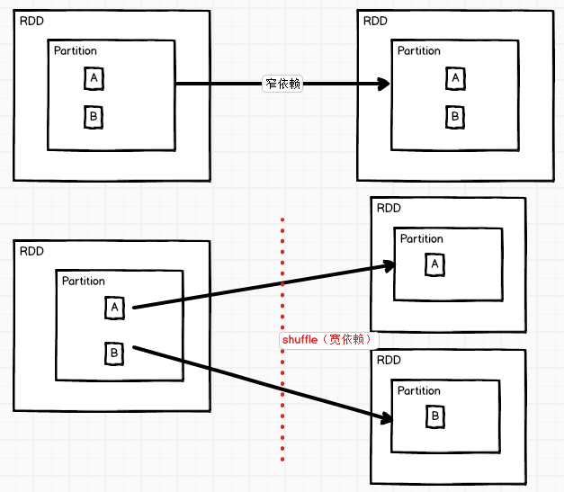
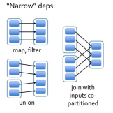
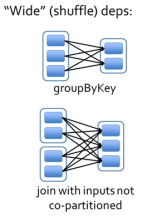
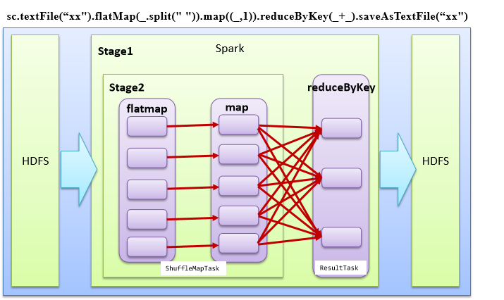

# RDD 的依赖关系

- Spark 作业会划分为多个阶段（Stage）
- 划分的规则是根据RDD依赖关系中的宽窄依赖进行的
- 在整个的依赖关系中，只要碰见宽依赖就会产生一个新的阶段
  - 有shuffle转换就有stage的划分


# Lineage（血缘）

- 血统
- RDD只支持粗粒度转换，即在大量记录上执行的单个操作
- 将创建RDD的一系列Lineage（血统）记录下来，以便恢复丢失的分区
- RDD的Lineage会记录RDD的元数据信息和转换行为
  - 当该RDD的部分分区数据丢失时，可根据这些信息来重新运算和恢复丢失的数据分区

 


## toDebugString

查看血缘


## dependencies

查看依赖关系


- 示例

```scala
scala> var rdd = sc.textFile("file:/opt/software/1.txt").flatMap(_.split(" ")).map((_,1)).reduceByKey(_+_)
rdd: org.apache.spark.rdd.RDD[(String, Int)] = ShuffledRDD[11] at reduceByKey at <console>:24

// 查看Lineage
scala> rdd.toDebugString
res5: String =
(3) ShuffledRDD[11] at reduceByKey at <console>:24 []
+-(3) MapPartitionsRDD[10] at map at <console>:24 []
|  MapPartitionsRDD[9] at flatMap at <console>:24 []
|  file:/opt/software/1.txt MapPartitionsRDD[8] at textFile at <console>:24 []
|  file:/opt/software/1.txt HadoopRDD[7] at textFile at <console>:24 []

// 查看依赖关系
scala> rdd.dependencies
res6: Seq[org.apache.spark.Dependency[_]] = List(org.apache.spark.ShuffleDependency@4ba7a9e4)
```

- 注意：RDD和它依赖的父RDDs的关系有两种不同的类型
  - 窄依赖（narrow dependency）
  - 宽依赖（wide dependency）

 


# 窄依赖

- 窄依赖指的是每一个父RDD的Partition最多被子RDD的一个Partition使用
- 窄依赖我们形象的比喻为独生子女

 

- 源码：union如何判断是窄依赖

```scala
// SparkContext.scala
def union[T: ClassTag](rdds: Seq[RDD[T]]): RDD[T] = withScope {
    val partitioners = rdds.flatMap(_.partitioner).toSet
    if (rdds.forall(_.partitioner.isDefined) && partitioners.size == 1) {
        new PartitionerAwareUnionRDD(this, rdds)
    } else {
        new UnionRDD(this, rdds)
    }
}

// PartitionerAwareUnionRDD.scala
// 注意：OneToOneDependency
class PartitionerAwareUnionRDD[T: ClassTag](
    sc: SparkContext,
    var rdds: Seq[RDD[T]]
) extends RDD[T](sc, rdds.map(x => new OneToOneDependency(x))) {...}

// Dependency.scala
// 继承自NarrowDependency
class OneToOneDependency[T](rdd: RDD[T]) extends NarrowDependency[T](rdd) {
    override def getParents(partitionId: Int): List[Int] = List(partitionId)
}

// 通过UnionRDD查找
class UnionRDD[T: ClassTag](
    sc: SparkContext,
    var rdds: Seq[RDD[T]])
extends RDD[T](sc, Nil) {
    ...
    override def getDependencies: Seq[Dependency[_]] = {
        val deps = new ArrayBuffer[Dependency[_]]
        var pos = 0
        for (rdd <- rdds) {
            deps += new RangeDependency(rdd, 0, pos, rdd.partitions.length)
            pos += rdd.partitions.length
        }
        deps
    }
    ...
}

abstract class RDD[T: ClassTag](
    @transient private var _sc: SparkContext,
    // 此时传入的是Nil，说明是子类实现deps
    @transient private var deps: Seq[Dependency[_]]
) extends Serializable with Logging {}

// 注意 RangeDependency 是窄依赖
class RangeDependency[T](rdd: RDD[T], inStart: Int, outStart: Int, length: Int)
extends NarrowDependency[T](rdd) {
```

- 判断map是窄依赖

```scala
// RDD.scala
def map[U: ClassTag](f: T => U): RDD[U] = withScope {
    val cleanF = sc.clean(f)
    new MapPartitionsRDD[U, T](this, (context, pid, iter) => iter.map(cleanF))
}
// MapPartitionsRDD.scala
private[spark] class MapPartitionsRDD[U: ClassTag, T: ClassTag](
    var prev: RDD[T],
    f: (TaskContext, Int, Iterator[T]) => Iterator[U],  // (TaskContext, partition index, iterator)
    preservesPartitioning: Boolean = false)
extends RDD[U](prev) {...}

// RDD.scala
// 构造函数中，传入的是OneToOneDependency对象
/** Construct an RDD with just a one-to-one dependency on one parent */
def this(@transient oneParent: RDD[_]) =
this(oneParent.context, List(new OneToOneDependency(oneParent)))
```


# 宽依赖

- 宽依赖指的是多个子RDD的Partition会依赖同一个父RDD的Partition，会引起shuffle
- 宽依赖形象的比喻为超生

 


# DAG

- Directed Acyclic Graph
- 有向无环图
- 原始的RDD通过一系列的转换就就形成了DAG，根据RDD之间的依赖关系的不同将DAG划分成不同的Stage
  - 对于窄依赖，partition的转换处理在Stage中完成计算
    - 可以并行处理
  - 对于宽依赖，由于有Shuffle的存在，只能在parent RDD处理完成后，才能开始接下来的计算
    - 需要等待窄依赖数据处理完成后再处理
    - **宽依赖是划分Stage的依据**

 


# 任务划分（重点）

- RDD任务切分中间分为
  - Application：初始化一个SparkContext即生成一个Application
  - Job：一个Action算子就会生成一个Job
  - Stage
    - 根据RDD之间的依赖关系的不同将Job划分成不同的Stage
    - 遇到一个宽依赖则划分一个Stage
    - Stage是一个TaskSet
  - Task
    - ==将Stage划分的结果发送到不同的Executor执行即为一个Task==
- 注意
  - Application->Job->Stage-> Task 
  - ==每一层都是1对n的关系==

 

- Spark 作业会划分为多个阶段（Stage）
- 划分的规则是根据RDD依赖关系中的宽窄依赖进行的
- 在整个的依赖关系中，只要碰见宽依赖就会产生一个新的阶段
  - 执行时，会从ResultStage进行查找上一个Stage，最终找到源头的Stage进行执行
  - 在每个Stage执行时，会进行Task的划分执行

 

- 调用行动算子的时候，会运行作业（JOB），进行阶段（Stage）的划分以及提交阶段（SubmitStage）后的任务（Task）划分，最后提交任务（submitTask）


# 分区-任务-阶段的关系

 

- 一个分区形成一个task
- 创建内存rdd时，分区数依据具体的cpu核数计算，与cpu核保持一致，一般是集群cpu核数(4台16核=64核)的2~3倍