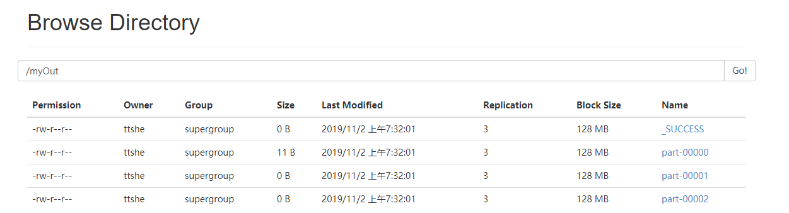

# 数据读取与保存

- Spark的数据读取及数据保存可从两个维度来作区分
  - 文件格式
    - ==Text文件==、==Json文件==、Csv文件、Sequence文件以及Object文件
  - 文件系统
    - 本地文件系统、==HDFS==、==HBASE==、数据库


# 文件格式


## Text [textFile,saveAsTextFile]

- 上传文件到HDFS

```bash
[ttshe@hadoop102 software]$ hadoop fs -put input.txt /
```

- 读取数据

```scala
scala> var rdd = sc.textFile("input.txt")
rdd: org.apache.spark.rdd.RDD[String] = input.txt MapPartitionsRDD[5] at textFile at <console>:25
// 未定义读取类型，默认本地读取，默认路径spark所在路径
scala> rdd.collect
org.apache.hadoop.mapred.InvalidInputException: Input path does not exist: file:/opt/module/spark/input.txt

scala> var rdd = sc.textFile("hdfs://hadoop102:9000/input.txt")
rdd: org.apache.spark.rdd.RDD[String] = hdfs://hadoop102:9000/input.txt MapPartitionsRDD[9] at textFile at <console>:25

scala> rdd.collect
res5: Array[String] = Array(hello word)
```

- 保存数据

```scala
scala> rdd.saveAsTextFile("hdfs://hadoop102:9000/myOut")
```

 


## Json（了解）[textFile,saveAsTextFile]

- 加载import scala.util.parsing.json.JSON

- 如果JSON文件中==每一行就是一个JSON记录==，可通过将JSON文件当做文本文件来读取，利用相关的JSON库对每一条数据进行JSON解析
  - 这里不是完全意义上的json
- 注意
  - ==使用RDD读取JSON文件处理很复杂，同时SparkSQL集成了很好的处理JSON文件的方式，所以应用中多是采用SparkSQL处理JSON文件==
- 数据准备

```json
{"name":"stt","age":22}
{"name":"sds","age":21}
```

- 读取数据

```scala
scala> import scala.util.parsing.json.JSON

scala> var json = sc.textFile("file:/opt/software/person.json")
json: org.apache.spark.rdd.RDD[String] = file:/opt/software/person.json MapPartitionsRDD[22] at textFile at <console>:26

scala> json.map(JSON.parseFull).collect
res12: Array[Option[Any]] = Array(Some(Map(name -> stt, age -> 22.0)), Some(Map(name -> sds, age -> 21.0)))
```


## Sequence [sequenceFile,saveAsSequenceFile]

- SequenceFile文件是Hadoop用来存储二进制形式的key-value对而设计的一种平面文件(Flat File)
- Spark 有专门用来读取 SequenceFile 的接口
- 在 SparkContext 中调用` sequenceFile[ keyClass, valueClass](path)`
- 注意
  - ==SequenceFile文件只针对PairRDD==

```scala
scala> var rdd = sc.makeRDD(Array((1,2),(3,4),(5,6)))
seq: org.apache.spark.rdd.RDD[(Int, Int)] = ParallelCollectionRDD[24] at makeRDD at <console>:26
// 保存为序列文件
scala> rdd.saveAsSequenceFile("file:/opt/software/seqFile")

// 查看，注意是8个分区
[ttshe@hadoop102 software]$ cd seqFile/
[ttshe@hadoop102 seqFile]$ ll
总用量 32
-rw-r--r-- 1 ttshe ttshe  92 11月  2 07:46 part-00000
-rw-r--r-- 1 ttshe ttshe  92 11月  2 07:46 part-00001
-rw-r--r-- 1 ttshe ttshe 108 11月  2 07:46 part-00002
-rw-r--r-- 1 ttshe ttshe  92 11月  2 07:46 part-00003
-rw-r--r-- 1 ttshe ttshe  92 11月  2 07:46 part-00004
-rw-r--r-- 1 ttshe ttshe 108 11月  2 07:46 part-00005
-rw-r--r-- 1 ttshe ttshe  92 11月  2 07:46 part-00006
-rw-r--r-- 1 ttshe ttshe 108 11月  2 07:46 part-00007
-rw-r--r-- 1 ttshe ttshe   0 11月  2 07:46 _SUCCESS

// 读取序列文件，注意类型
scala> var seq = sc.sequenceFile[Int,Int]("file:/opt/software/seqFile")
seq: org.apache.spark.rdd.RDD[(Int, Int)] = MapPartitionsRDD[29] at sequenceFile at <console>:26

scala> seq.collect
res14: Array[(Int, Int)] = Array((3,4), (1,2), (5,6))
```


## 对象文件 [objectFile,saveAsObjectFile]

- 对象文件是将对象序列化后保存的文件，采用Java的序列化机制
- 通过`objectFile[k,v](path)` 函数接收一个路径，读取对象文件，返回对应的 RDD
- 通过`saveAsObjectFile() `实现对对象文件的输出
  - 因是序列化需要指定类型

```scala
scala> var rdd = sc.makeRDD(Array(1,2,3,4))
rdd: org.apache.spark.rdd.RDD[Int] = ParallelCollectionRDD[30] at makeRDD at <console>:26
// 序列化为对象
scala> rdd.saveAsObjectFile("file:/opt/software/objFile")
// 读取对象
scala> var obj = sc.objectFile[Int]("file:/opt/software/objFile")
obj: org.apache.spark.rdd.RDD[Int] = MapPartitionsRDD[34] at objectFile at <console>:26

// 注意读取后顺序是变化的
scala> obj.collect
res16: Array[Int] = Array(3, 1, 2, 4)
```


# 文件系统


## HDFS

- Spark的整个生态系统与Hadoop是完全兼容的
- 对于Hadoop所支持的文件类型或者数据库类型Spark也同样支持
- 由于Hadoop的API有新旧两个版本，Spark为了能够兼容Hadoop所有的版本提供了两套创建操作接口
  - hadoopRDD和newHadoopRDD是最为抽象的两个函数接口，主要包含以下四个参数
    - 输入格式(InputFormat)
      - 数据输入的类型
        - 如TextInputFormat等
      - 新旧两个版本所引用的版本分别是
        - org.apache.hadoop.mapred.InputFormat
        - org.apache.hadoop.mapreduce.InputFormat(NewInputFormat)
    - 键类型:
      - 指定[K,V]键值对中K的类型
    - 值类型:
      - 指定[K,V]键值对中V的类型
    - 分区值
      - 指定由外部存储生成的RDD的partition数量的最小值
      - 如果没有指定，系统使用默认值defaultMinSplits
- 注意
  - 其他创建操作的API接口都是为了方便最终的Spark程序开发者而设置的，是这两个接口的高效实现版
    - 如textFile只有path这个指定文件路径的参数，其他参数在系统内部指定了默认值
  - 在Hadoop中以压缩形式存储的数据，不需要指定解压方式就能够进行读取
    - 因为Hadoop本身有一个解压器会根据压缩文件的后缀推断解压算法进行解压
  - 如果用Spark从Hadoop中读取某种类型的数据不知道怎么读取的时候，上网查找一个使用map-reduce的时候是怎么读取这种这种数据的，然后再将对应的读取方式改写成上面的hadoopRDD和newAPIHadoopRDD两个类就行


## MySQL

- 支持通过Java JDBC访问关系型数据库。需要通过JdbcRDD进行

```xml
<dependency>
    <groupId>mysql</groupId>
    <artifactId>mysql-connector-java</artifactId>
    <version>5.1.27</version>
</dependency>
```

- MySQL读取

```scala
package com.ttshe

import java.sql.DriverManager

import org.apache.spark.rdd.JdbcRDD
import org.apache.spark.{SparkConf, SparkContext}

object MysqlRDD {

    def main(args: Array[String]): Unit = {

        //1.创建spark配置信息
        val conf = new SparkConf().setMaster("local[*]").setAppName("JdbcRDD")
        //2.创建SparkContext
        val sc = new SparkContext(conf)

        //3.定义连接mysql的参数
        val driver = "com.mysql.jdbc.Driver"
        val url = "jdbc:mysql://hadoop102:3306/rdd"
        val userName = "root"
        val passWd = "123456"

        //创建JdbcRDD
        val rdd = new JdbcRDD(
            sc, 
            () => {
                Class.forName(driver)
                DriverManager.getConnection(url, userName, passWd)
            },
            "select * from `rddtable` where `id`>=? and `id<=`?;",
            1, // 下界，表示读取数据的范围每次读取10个
            10,// 上界
            1, // 分区数
            result => (result.getInt(1), result.getString(2)) // 将读取的结果转变成元组
        )

        //打印最后结果
        println(rdd.count())
        rdd.foreach(println)
        sc.stop()
    }
}
```

- MySQL写入

```scala
def main(args: Array[String]) {
    val sparkConf = new SparkConf().setMaster("local[2]").setAppName("HBaseApp")
    val sc = new SparkContext(sparkConf)
    val data = sc.parallelize(List("Female", "Male","Female"))

    data.foreachPartition(insertData)
}

def insertData(iterator: Iterator[String]): Unit = {
    Class.forName ("com.mysql.jdbc.Driver").newInstance()
    val conn = java.sql.DriverManager.getConnection("jdbc:mysql://hadoop102:3306/rdd", "root", "123456")
    iterator.foreach(data => {
        val ps = conn.prepareStatement("insert into rddtable(name) values (?)")
        ps.setString(1, data) 
        ps.executeUpdate()
    })
}
```


## HBase

- 由于 org.apache.hadoop.hbase.mapreduce.TableInputFormat 类的实现，Spark 可以通过Hadoop输入格式访问HBase
- 这个输入格式会返回键值对数据，其中
  - 键的类型为org.apache.hadoop.hbase.io.ImmutableBytesWritable
  - 值的类型为org.apache.hadoop.hbase.client.Result
- pom

```xml
<dependency>
    <groupId>org.apache.hbase</groupId>
    <artifactId>hbase-server</artifactId>
    <version>1.3.1</version>
</dependency>

<dependency>
    <groupId>org.apache.hbase</groupId>
    <artifactId>hbase-client</artifactId>
    <version>1.3.1</version>
</dependency>
```

- 从HBase读取

```scala
package com.ttshe

import org.apache.hadoop.conf.Configuration
import org.apache.hadoop.hbase.HBaseConfiguration
import org.apache.hadoop.hbase.client.Result
import org.apache.hadoop.hbase.io.ImmutableBytesWritable
import org.apache.hadoop.hbase.mapreduce.TableInputFormat
import org.apache.spark.rdd.RDD
import org.apache.spark.{SparkConf, SparkContext}
import org.apache.hadoop.hbase.util.Bytes

object HBaseSpark {

    def main(args: Array[String]): Unit = {

        //创建spark配置信息
        val sparkConf = new SparkConf().setMaster("local[*]").setAppName("JdbcRDD")
        //创建SparkContext
        val sc = new SparkContext(sparkConf)

        //构建HBase配置信息
        val conf: Configuration = HBaseConfiguration.create()
        conf.set("hbase.zookeeper.quorum", "hadoop102,hadoop103,hadoop104")
        conf.set(TableInputFormat.INPUT_TABLE, "rddtable")

        //从HBase读取数据形成RDD
        val hbaseRDD: RDD[(ImmutableBytesWritable, Result)] = 
        sc.newAPIHadoopRDD(
            conf,
            classOf[TableInputFormat],
            classOf[ImmutableBytesWritable],
            classOf[Result]
        )

        val count: Long = hbaseRDD.count()
        println(count)

        //对hbaseRDD进行处理
        hbaseRDD.foreach {
            case (_, result) =>
            val key: String = Bytes.toString(result.getRow)
            val name: String = Bytes.toString(result.getValue(Bytes.toBytes("info"), Bytes.toBytes("name")))
            val color: String = Bytes.toString(result.getValue(Bytes.toBytes("info"), Bytes.toBytes("color")))
            println("RowKey:" + key + ",Name:" + name + ",Color:" + color)
        }
        //关闭连接
        sc.stop()
    }
}
```

- 向HBase写入

```scala
ef main(args: Array[String]) {
    //获取Spark配置信息并创建与spark的连接
    val sparkConf = new SparkConf().setMaster("local[*]").setAppName("HBaseApp")
    val sc = new SparkContext(sparkConf)

    //创建HBaseConf
    val conf = HBaseConfiguration.create()
    val jobConf = new JobConf(conf)
    jobConf.setOutputFormat(classOf[TableOutputFormat])
    jobConf.set(TableOutputFormat.OUTPUT_TABLE, "fruit_spark")

    //构建Hbase表描述器
    val fruitTable = TableName.valueOf("fruit_spark")
    val tableDescr = new HTableDescriptor(fruitTable)
    tableDescr.addFamily(new HColumnDescriptor("info".getBytes))

    //创建Hbase表
    val admin = new HBaseAdmin(conf)
    if (admin.tableExists(fruitTable)) {
        admin.disableTable(fruitTable)
        admin.deleteTable(fruitTable)
    }
    admin.createTable(tableDescr)

    //定义往Hbase插入数据的方法
    def convert(triple: (Int, String, Int)) = {
        val put = new Put(Bytes.toBytes(triple._1))
        put.addImmutable(Bytes.toBytes("info"), Bytes.toBytes("name"), Bytes.toBytes(triple._2))
        put.addImmutable(Bytes.toBytes("info"), Bytes.toBytes("price"), Bytes.toBytes(triple._3))
        // 注意这里要返回一个元组
        (new ImmutableBytesWritable, put)
    }

    //创建一个RDD
    val initialRDD = sc.parallelize(List((1,"apple",11), (2,"banana",12), (3,"pear",13)))

    //将RDD内容写到HBase
    val localData = initialRDD.map(convert)

    localData.saveAsHadoopDataset(jobConf)
}
```


