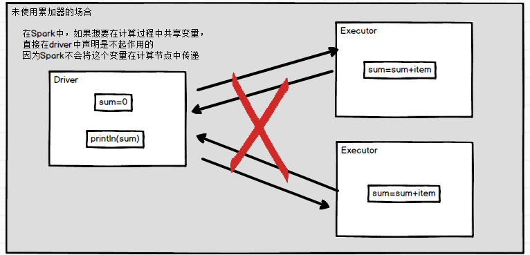
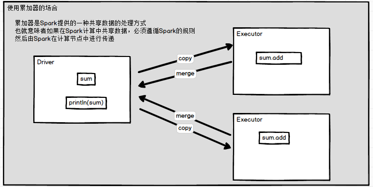

# 累加器

- 对信息进行聚合
- 在向 Spark传递函数时，如使用 map() 函数或者用 filter() 传条件时，使用驱动器程序中定义的变量，但是集群中运行的每个任务都会得到这些变量的一份新的副本，更新这些副本的值也不会影响驱动器中的对应变
- 如要实现所有分片处理时更新共享变量的功能，那么累加器可以实现
- 分析：计算和值

```scala
package com.stt.spark

import org.apache.spark.rdd.RDD
import org.apache.spark.{SparkConf, SparkContext}

object Ch08_Add {
    def main(args: Array[String]): Unit = {

        val sc = new SparkContext(new SparkConf().setMaster("local").setAppName("ch08"))

        val rdd: RDD[Int] = sc.makeRDD(Array(1,2,3,4))

        // 计算和
        var sum = 0
        rdd.map(item =>{
            sum += item
            println(sum)
        }).collect

        println(sum)
        sc.stop()
    }
}
// 结果始终是0
```

- 原因
  - 类似于值传递和引用传递的区别
  - 启动器将task传递给Executor，在Executor中执行sum计算，但是sum不会将计算的值返回给Driver
  - Driver中的sum和Executor的sum不是同一个sum

 

- 使用累加器实现计算和值

```scala
package com.stt.spark

import org.apache.spark.rdd.RDD
import org.apache.spark.util.LongAccumulator
import org.apache.spark.{SparkConf, SparkContext}

object Ch08_Add {
    def main(args: Array[String]): Unit = {

        val sc = new SparkContext(new SparkConf().setMaster("local").setAppName("ch08"))
        val rdd: RDD[Int] = sc.makeRDD(Array(1,2,3,4))

        // 使用采集器（累加器）
        val sum: LongAccumulator = sc.longAccumulator("sum")

        rdd.map(item =>{
            sum.add(item)
        }).collect

        println(sum.value)
        sc.stop()
    }
}
```

- 源码

```scala
def longAccumulator(name: String): LongAccumulator = {
    val acc = new LongAccumulator
    register(acc, name)
    acc
}
```

- 分析累加器可以成功的原因

 


# 系统累加器

- 针对一个输入的日志文件，如果我们想计算文件中所有空行的数量，可以编写以下程序

```scala
scala> val notice = sc.textFile("./NOTICE")
notice: org.apache.spark.rdd.RDD[String] = ./NOTICE MapPartitionsRDD[40] at textFile at <console>:32

scala> val blanklines = sc.accumulator(0)
warning: there were two deprecation warnings; re-run with -deprecation for details
blanklines: org.apache.spark.Accumulator[Int] = 0

scala> val tmp = notice.flatMap(line => {
     |    if (line == "") {
     |       blanklines += 1
     |    }
     |    line.split(" ")
     | })
tmp: org.apache.spark.rdd.RDD[String] = MapPartitionsRDD[41] at flatMap at <console>:36

scala> tmp.count()
res31: Long = 3213

scala> blanklines.value
res32: Int = 171
```

- 通过在驱动器中调用SparkContext.accumulator(initialValue)方法，创建出存有初始值的累加器。返回值为 org.apache.spark.Accumulator[T] 对象，其中 T 是初始值 initialValue 的类型。Spark闭包里的执行器代码可以使用累加器的 += 方法(在Java中是 add)增加累加器的值。 驱动器程序可以调用累加器的value属性(在Java中使用value()或setValue())来访问累加器的值。 

- ==注意==

  - 工作节点上的任务不能访问累加器的值
  - 从这些task任务的角度来看，累加器是一个==只写变量==

- 对于要在行动操作中使用的累加器，Spark只会把每个任务对各累加器的修改应用一次。因此，如果想要一个无论在失败还是重复计算时都绝对可靠的累加器，我们必须把它放在 foreach() 这样的行动操作中。转化操作中累加器可能会发生不止一次更新

  

# 自定义累加器

- 自定义累加器类型的功能在1.X版本中就已经提供了，但是使用起来比较麻烦，在2.0版本后，累加器的易用性有了较大的改进

- 官方还提供一个新的抽象类：AccumulatorV2来提供更加友好的自定义类型累加器的实现方式

- ==注意行动算子会触发累加器的执行==

  

## 示例1

```scala
package com.stt.spark

import org.apache.spark.rdd.RDD
import org.apache.spark.util.{AccumulatorV2, LongAccumulator}
import org.apache.spark.{SparkConf, SparkContext}

object Ch09_CustomerAccumulator {
    def main(args: Array[String]): Unit = {
        val sc = new SparkContext(
            new SparkConf().setMaster("local").setAppName("ch08"))

        val rdd: RDD[Int] = sc.makeRDD(Array(1,2,3,4))

        // 使用采集器（累加器）
        val sum: MyAccumulator = new MyAccumulator

        // 注册累加器
        sc.register(sum,"sum")

        var srdd = rdd.map(item =>{
            sum.add(item)
        })
        
        srdd.collect
        println(sum.value)
		// 如果再执行srdd.collect 累加器会再次执行
        // 需要注意累加器的使用次数
        // 需要注意行动算子的使用，如果使用srdd.foreach也是会再次执行累加器
        sc.stop()
    }
}

// 自定义累加器
class MyAccumulator extends AccumulatorV2[Int,Int]{

    var sum = 0

    // 是否初始状态
    override def isZero: Boolean = sum == 0

    // 执行器执行时，需要拷贝累加器对象
    override def copy(): AccumulatorV2[Int, Int] = {
        val _new = new MyAccumulator()
        _new.synchronized{
            self.sum = 0
        }
        _new
    }
    // 重置数据
    override def reset(): Unit = sum = 0

    // 累加数据
    override def add(v: Int): Unit = sum += v

    // 合并计算的结果数据
    override def merge(other: AccumulatorV2[Int, Int]): Unit = {
        sum += other.value
    }
    // 累加器的结果
    override def value: Int = sum
}
```

- 系统调用AccumulatorV2的`copyAndReset()`顺序：copy->reset->isZero，如果isZero为false，则抛出异常：`copyAndReset must return a zero value copy`

  

## 示例2

- 在程序运行过程中收集一些文本类信息，最终以Set[String]的形式返回

```scala
package com.ttshe.spark

import org.apache.spark.util.AccumulatorV2
import org.apache.spark.{SparkConf, SparkContext}
import scala.collection.JavaConversions._

// 过滤掉带字母的
object LogAccumulator {
    def main(args: Array[String]) {
        val conf=new SparkConf().setAppName("LogAccumulator")
        val sc=new SparkContext(conf)

        val accum = new LogAccumulator
        sc.register(accum, "logAccum")
        
        val sum = sc.parallelize(Array("1", "2a", "3", "4b", "5", "6", "7cd", "8", "9"), 2).filter(line => {
            val pattern = """^-?(\d+)"""
            val flag = line.matches(pattern)
            if (!flag) {
                accum.add(line)
            }
            flag
        }).map(_.toInt).reduce(_ + _)

        println("sum: " + sum)
        for (v <- accum.value) print(v + "")
        println()
        sc.stop()
    }
}

class LogAccumulator extends org.apache.spark.util.AccumulatorV2[String, java.util.Set[String]] {
    private val _logArray: java.util.Set[String] = new java.util.HashSet[String]()

    override def isZero: Boolean = {
        _logArray.isEmpty
    }

    override def reset(): Unit = {
        _logArray.clear()
    }

    override def add(v: String): Unit = {
        _logArray.add(v)
    }

    override def merge(other: AccumulatorV2[String, java.util.Set[String]]): Unit = {
        other match {
            case o: LogAccumulator => _logArray.addAll(o.value)
        }

    }

    override def value: java.util.Set[String] = {
        java.util.Collections.unmodifiableSet(_logArray)
    }

    override def copy(): AccumulatorV2[String, java.util.Set[String]] = {
        val newAcc = new LogAccumulator()
        _logArray.synchronized{
            newAcc._logArray.addAll(_logArray)
        }
        newAcc
    }
}
```


## 示例3

- 收集信息

```scala
package com.stt.spark

import java.util

import org.apache.spark.rdd.RDD
import org.apache.spark.util.{AccumulatorV2, LongAccumulator}
import org.apache.spark.{SparkConf, SparkContext}

object Ch10_CustomerAccumulator {
    def main(args: Array[String]): Unit = {
        val sc = new SparkContext(new SparkConf().setMaster("local").setAppName("ch10"))

        val rdd: RDD[String] = sc.makeRDD(Array("error1","ss","error3","ee"))

        // 使用采集器（累加器）
        val blackList: MyBlackListAccumulator = new MyBlackListAccumulator

        // 注册
        sc.register(blackList)

        rdd.map(item =>{
            blackList.add(item)
            item
        }).collect

        println(blackList.value)

        sc.stop()
    }
}

// 判断运行情况，采集有问题的信息
// 使用HashSet的原因，是错误数据相同的只要记录一个
class MyBlackListAccumulator extends AccumulatorV2[String,util.HashSet[String]]{

    var blackList = new util.HashSet[String]()

    override def isZero: Boolean = blackList.isEmpty

    override def copy(): AccumulatorV2[String, util.HashSet[String]] = new MyBlackListAccumulator()

    override def reset(): Unit = blackList.clear()

    override def add(v: String): Unit = {
        if(v.contains("error")){
            blackList.add(v)
        }
    }

    override def merge(other: AccumulatorV2[String, util.HashSet[String]]): Unit = blackList.addAll(other.value)

    override def value: util.HashSet[String] = blackList
}
```