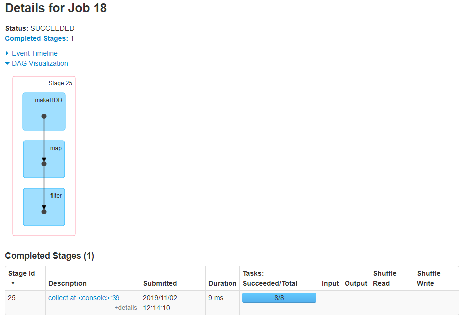

# 分析

- 案例分析：join操作

```scala
scala> var rdd1 = sc.makeRDD(Array((1,"a"),(2,"b"),(3,"c")))
rdd1: org.apache.spark.rdd.RDD[(Int, String)] = ParallelCollectionRDD[35] at makeRDD at <console>:26

scala> var rdd2 = sc.makeRDD(Array((1,"aa"),(2,"bb")))
rdd2: org.apache.spark.rdd.RDD[(Int, String)] = ParallelCollectionRDD[36] at makeRDD at <console>:26

scala> rdd1.join(rdd2).collect
res17: Array[(Int, (String, String))] = Array((1,(a,aa)), (2,(b,bb)))
```

 

- 有shuffle过程，效率不高
- 使用广播变量，将rdd2进行广播到各个Executor内存中，再使用map进行处理

```scala
scala> var rdd3 = sc.broadcast(Array((1,"aa"),(2,"bb")))
rdd3: org.apache.spark.broadcast.Broadcast[Array[(Int, String)]] = Broadcast(33)

scala> rdd1.map(item=>{
    var tmp = (-1,"null")
    for(item2 <- rdd3.value){
        if(item._1 == item2._1){
            tmp = item2
        }
    }
    (tmp._1,(item._2,tmp._2))    
}).filter(_._1 != -1).collect
```

- 使用广播变量后，只有一个stage，同时没有shuffle过程，速度变快



 


# 说明

- 把变量广播给各个Executor，类似于小表join大表，小表在各个Executor中
- 广播变量用来高效分发较大的对象，但不能太大，因为是存储在内存中的
- 向所有工作节点发送一个较大的==只读值==，供一个或多个Spark操作使用
  - 如应用需要向所有节点发送一个较大的只读查询表，甚至是机器学习算法中的一个很大的特征向量，广播变量用起来都很顺手
  - 在多个并行操作中使用同一个变量，但是 Spark会为每个任务分别发送
- 使用广播变量的过程如下
  - 通过对一个类型 T 的对象调用 SparkContext.broadcast 创建出一个 Broadcast[T] 对象
    - 任何可序列化的类型都可以这么实现
  - 通过value属性访问该对象的值
  - 变量只会被发到各个节点一次，应作为只读值处理
    - 修改这个值不会影响到别的节点