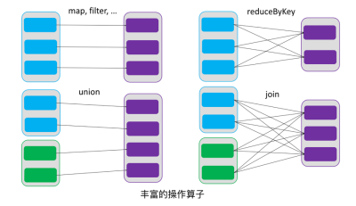
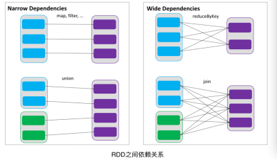
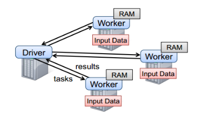
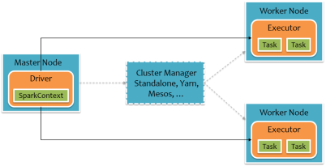
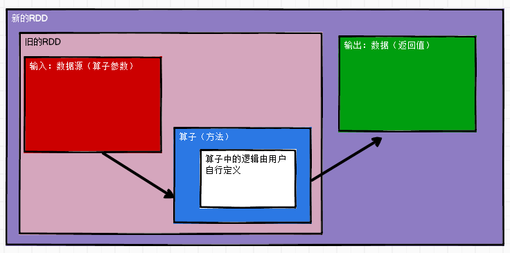

#  IO流回顾

 


# 概述

- RDD
  - Resilient Distributed Dataset
  - 弹性分布式==数据集==
  - Spark中最基本的数据抽象，不是数据的实体
  - 代码中是一个抽象类，代表一个不可变、可分区、里面的元素可并行计算的集合
    - RDD一旦创建好数据不可用变化，只能生成新的RDD
    - 数据热点，通过分区解决

- 体现了装饰者模式
  - 算子
    - 问题（开始=> operator => 中间转换 => operator => 解决）
    - operator
    - 操作

- ==移动数据不如移动计算==
  - 提升性能
  - 如果移动数据涉及到IO访问


# 属性

```scala
Internally, each RDD is characterized by five main properties:
 - A list of partitions
 - A function for computing each split
 - A list of dependencies on other RDDs
 - Optionally, a Partitioner for key-value RDDs (e.g. to say that the RDD is hash-partitioned)
 - Optionally, a list of preferred locations to compute each split on (e.g. block locations for an HDFS file)
```

- 一组分区（Partitions）
  
- 数据集的基本组成单位
  
  ```scala
  @transient private var partitions_ : Array[Partition] = null
  ```
  
-  一个计算每个分片的函数

- RDD之间的依赖关系
  
- 数据与数据之间有依赖关系，如当前数据来自于哪个数据集
  - 入参有deps表示依赖关系集
  
  ```scala
  abstract class RDD[T: ClassTag](
      @transient private var _sc: SparkContext,
      @transient private var deps: Seq[Dependency[_]]
  ) extends Serializable with Logging {
  
      // Our dependencies and partitions will be gotten by calling subclass's methods below, and will
      // be overwritten when we're checkpointed
      private var dependencies_ : Seq[Dependency[_]] = null
  ```
  
- 一个Partitioner
  - 分区器
  - RDD的分区函数
  - 如有3个分区，那么如何确定在哪个分区，分区算法，取模，散列等

- 存储存取每个分区Partition的首选位置列表
  - preferred location
    - 数据生成task在哪个executor上执行，需要发送到首选位置的节点
    - 数据所在的节点是优先位置
      - 如果资源不够，需要降级：查找同一个worker，查找同一个机架


# 特点

- RDD表示只读的分区的数据集，对RDD进行改动，只能通过RDD的==转换操作==
  - 由一个RDD得到一个新的RDD
  - 新的RDD包含了从其他RDD衍生所必需的信息
- RDD之间存在依赖，RDD的执行是按照血缘关系延时计算的
  - 如果血缘关系较长，可通过持久化RDD来切断血缘关系


## 分区

- RDD==逻辑上是分区==的，每个分区的数据是抽象存在的，计算的时候会通过一个compute函数得到每个分区的数据

- RDD通过已有的文件系统构建，则compute函数是读取指定文件系统中的数据

- RDD通过其他RDD转换而来，则compute函数是执行转换逻辑将其他RDD的数据进行转换

  

   

## 只读

- RDD是只读的，要想改变RDD中的数据，只能在现有的RDD基础上==创建新的RDD==
- 数据结构是固定的

 

- 由一个RDD转换到另一个RDD，可以通过丰富的操作算子实现，不再像MapReduce那样只能写map和reduce

 

- RDD的操作算子包括两类
  - transformations
    - 将RDD进行转化
      - 构建RDD的血缘关系
  - actions
    - 触发RDD的计算
      - 得到RDD的相关计算结果或者将RDD保存的文件系统中

## 依赖

- RDDs通过操作算子进行转换，转换得到的新RDD包含了从其他RDDs衍生所必需的信息
- RDDs之间维护着这种血缘关系，也称之为依赖
- 依赖包括两种
  - 窄依赖，RDDs之间分区是一一对应的
    - 一个父RDD对应一个子RDD
      - 可以是2个父RDD对应一个子RDD
  - 宽依赖，下游RDD的每个分区与上游RDD(父RDD)的每个分区都有关，是多对多的关系
    - 一个父对应多个子RDD
  
  - 一父一子是窄，一父多子是宽，宽要shuffle

 

## 缓存

- 缓存在内存中

- 如果在应用程序中多次使用同一个RDD，可以将该RDD缓存起来，该RDD只有在第一次计算的时候会根据血缘关系得到分区的数据，在后续其他地方用到该RDD的时直接从缓存处取而不用再根据血缘关系计算，加速后期的重用
  - RDD-1经过一系列的转换后得到RDD-n并保存到hdfs，RDD-1在这一过程中会有个中间结果，如果将其缓存到内存，那么在随后的RDD-1转换到RDD-m这一过程中，就不会计算其之前的RDD-0了

 

## CheckPoint

- 保存点
- 保存在==文件中==
- 有IO，性能降低
- 虽然RDD的血缘关系天然地可以实现容错
  - 当RDD的某个分区数据失败或丢失，可通过血缘关系重建
- 但是对于长时间迭代型应用来说，随着迭代的进行，RDDs之间的血缘关系会越来越长，一旦在后续迭代过程中出错，则需要通过非常长的血缘关系去重建，影响性能
- 为此，RDD支持checkpoint将数据保存到持久化的存储中，这样就可以切断之前的血缘关系，因为checkpoint后的RDD不需要知道它的父RDDs了，可以从checkpoint处拿数据


# RDD 模型


- 在Spark中，RDD被表示为对象，通过对象上的方法调用来对RDD进行转换
- 经过一系列的transformation算子定义RDD之后，调用action算子触发RDD的计算，action可以是向应用程序返回结果(count, collect等)，或者是向存储系统保存数据(saveAsTextFile等)
- 注意：在Spark中，==只有到action，才依次执行RDD的计算==
  - 延迟计算
  - 懒执行
  - lazy
  - 在运行时可以通过管道的方式传输多个转换
- 要使用Spark，开发者需要编写一个Driver程序，它被提交到集群以调度运行Worker
- Driver中定义了一个或多个RDD，并调用RDD上的action
  - 在main中==创建了SparkContext对象==就是Driver类
- Worker执行RDD分区计算任务
  - 将结果返回给Driver进行汇总

 

 


 

- 通过查看flatMap源码，在MapPartitionsRDD的构造方法中传入this

```scala
/**
   *  Return a new RDD by first applying a function to all elements of this
   *  RDD, and then flattening the results.
   */
def flatMap[U: ClassTag](f: T => TraversableOnce[U]): RDD[U] = withScope {
    val cleanF = sc.clean(f)
    new MapPartitionsRDD[U, T](this, (context, pid, iter) => iter.flatMap(cleanF))
}
```

- 关于懒执行

```scala
scala> sc.textFile("xxx.txt")
// 此时没有报错，还没有执行具体的操作
res1: org.apache.spark.rdd.RDD[String] = xxx.txt MapPartitionsRDD[1] at textFile at <console>:25

scala> res1.collect
// 执行action算子的时候操作后报错
org.apache.hadoop.mapred.InvalidInputException: Input path does not exist: file:/opt/module/spark/xxx.txt
at org.apache.hadoop.mapred.FileInputFormat.singleThreadedListStatus(FileInputFormat.java:287)
at org.apache.hadoop.mapred.FileInputFormat.listStatus(FileInputFormat.java:229)
...
// 执行flatMap和map也不会报错
scala> res1.flatMap(_.split(" ")).map((_,1))
res5: org.apache.spark.rdd.RDD[(String, Int)] = MapPartitionsRDD[7] at map at <console>:27
```


 


# 案例：wordCount的6种实现方式

```scala
var input = sc.textFile("file:/data/input")
var rdd = input.flatMap(_.split(" "))

// 第一种
rdd.map((_,1)).reduceByKey(_+_).collect
```

```scala
// 第二种 groupBy
scala> var rdd = sc.makeRDD(Array("aa","cc","cc","bb"))

scala> rdd.groupBy(x=>x).collect
res80: Array[(String, Iterable[String])] = Array((aa,CompactBuffer(aa)), (bb,CompactBuffer(bb)), (cc,CompactBuffer(cc, cc)))

scala> rdd.groupBy(x=>x).map(t=>(t._1,t._2.size)).collect
res83: Array[(String, Int)] = Array((aa,1), (bb,1), (cc,2))
```

```scala
// 第三种 groupByKey
scala> rdd.map((_,1)).groupByKey().map(t=>(t._1,t._2.size)).collect
```

```scala
// 第四种 aggregateByKey
scala> rdd.map((_,1)).aggregateByKey(0)(_+_,_+_).collect
```

```scala
// 第五种 foldByKey
scala> rdd.map((_,1)).foldByKey(0)(_+_).collect
```

```scala
// 第六种 combineByKey
rdd.map((_,1)).combineByKey(v=>v,(v1:Int,v2:Int)=>v1+v2,(v1:Int,v2:Int)=>v1+v2).collect
```


