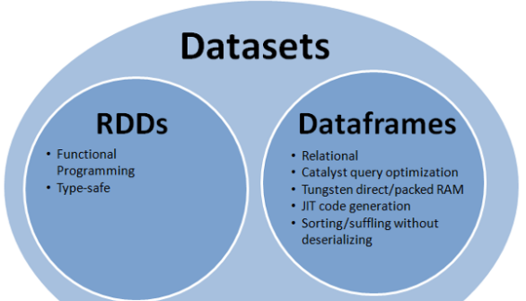

# SparkSession

- 在老的版本中SparkSQL提供两种SQL查询起始点
  - SQLContext
    - 用于Spark自己提供的SQL查询
  - HiveContext
    - 用于连接Hive的查询
- SparkSession是Spark最新的SQL查询起始点
  - 实质上是SQLContext和HiveContext的组合
  - 在SQLContext和HiveContext上可用的API在SparkSession上同样是可以使用
  - SparkSession内部封装了sparkContext，操作实际上由sparkContext完成

```scala
bin/spark-shell
...
Spark context Web UI available at http://192.168.1.102:4040
Spark context available as 'sc' (master = local[*], app id = local-1572751375883).
// 使用sparkSession的对象spark进行操作
Spark session available as 'spark'.
...
// 查看sparkSession支持的操作
scala> spark.
baseRelationToDataFrame   createDataFrame   experimental    range  sql   table     
catalog    createDataset     implicits       read    sqlContext   time
close      emptyDataFrame    listenerManager   readStream   stop  udf
conf       emptyDataset      newSession   sparkContext   streams version

// 使用sparkSession调用sparkContext进行RDD操作
scala> spark.sparkContext.makeRDD(Array(1,2,3,4))
res0: org.apache.spark.rdd.RDD[Int] = ParallelCollectionRDD[0] at makeRDD at <console>:24
```


# DataFrame

- 组成元素是Row对象的集合

## 创建

- 创建DataFrame有三种方式
  - 通过Spark的数据源进行创建
  - 从已存在的RDD进行转换
  - 从Hive Table进行查询返回
- 查看Spark数据源支持的格式
  - 注意：此处的json是一行是完整的json
  - orc与hive有关系
  - parquet 是spark特有
  - orc比parquet性能好一些

```scala
scala> spark.read.
csv   format   jdbc   json   load   option   options   orc   parquet   schema   table   text   textFile
```

- 在/opt/software/创建文件

```json
{"name":"stt","age":22}
{"name":"zhangsan","age":11}
{"name":"lisi","age":31}
```

- 读取文件创建DataFrame

```scala
scala> var df = spark.read.json("file:/opt/software/person.json")
df: org.apache.spark.sql.DataFrame = [age: bigint, name: string]

scala> df.show
+---+--------+
|age|    name|
+---+--------+
| 22|     stt|
| 11|zhangsan|
| 31|    lisi|
+---+--------+

// 将读取的dataFrame转为临时视图
// 查看支持的视图创建
scala> df.create
createGlobalTempView   createOrReplaceTempView   createTempView

scala> df.createOrReplaceTempView("user")
// 使用sparkSql查询
scala> spark.sql("select * from user").show
+---+--------+
|age|    name|
+---+--------+
| 22|     stt|
| 11|zhangsan|
| 31|    lisi|
+---+--------+

scala> spark.sql("select name from user").show
+--------+
|    name|
+--------+
|     stt|
|zhangsan|
|    lisi|
+--------+
```


## 临时表 [createOrReplaceTempView]

```scala
scala> spark.read.json("file:/opt/software/person.json").createOrReplaceTempView("user")

scala> var sqlDF = spark.sql("select * from user")
sqlDF: org.apache.spark.sql.DataFrame = [age: bigint, name: string]

scala> sqlDF.show
+---+--------+
|age|    name|
+---+--------+
| 22|     stt|
| 11|zhangsan|
| 31|    lisi|
+---+--------+

scala> spark.sql("select sum(age) from user").show
+--------+
|sum(age)|
+--------+
|      64|
+--------+
```

- 注意：临时表是Session范围内的，Session退出后，表就失效了

```scala
scala> spark.newSession.sql("select * from user").show
org.apache.spark.sql.AnalysisException: Table or view not found: user; line 1 pos 14
  at org.apache.spark.sql.catalyst.analysis.package$AnalysisErrorAt.failAnalysis(package.scala:42)
...
```


## 全局表 [createGlobalTempView]

- 如果想应用范围内有效使用全局表
  - createGlobalTempView
- 注意：使用全局表时需要全路径访问==global_temp==
- 如：global_temp.people

```scala
scala> var df = spark.read.json("file:/opt/software/person.json")
df: org.apache.spark.sql.DataFrame = [age: bigint, name: string]

scala> df.createGlobalTempView("people")

scala> spark.sql("select * from global_temp.people").show
+---+--------+
|age|    name|
+---+--------+
| 22|     stt|
| 11|zhangsan|
| 31|    lisi|
+---+--------+

scala> spark.newSession.sql("select * from global_temp.people").show
+---+--------+
|age|    name|
+---+--------+
| 22|     stt|
| 11|zhangsan|
| 31|    lisi|
+---+--------+
```


## 元数据信息 [printSchema]

```scala
scala> var df = spark.read.json("file:/opt/software/person.json")
df: org.apache.spark.sql.DataFrame = [age: bigint, name: string]

scala> df.printSchema
root
 |-- age: long (nullable = true)
 |-- name: string (nullable = true)
```


## DSL 语法调用

- DataFrame和DataSet都可以使用

```scala
// 使用select查询
scala> df.select("name").show
+--------+
|    name|
+--------+
|     stt|
|zhangsan|
|    lisi|
+--------+

// 使用 $ 进行数据操作
scala> df.select($"name",$"age"+1).show
+--------+---------+
|    name|(age + 1)|
+--------+---------+
|     stt|       23|
|zhangsan|       12|
|    lisi|       32|
+--------+---------+

// 使用filter进行过滤
scala> df.filter($"age">15).show
+---+----+
|age|name|
+---+----+
| 22| stt|
| 31|lisi|
+---+----+

// 使用groupBy进行分组
scala> df.groupBy("age").
agg   avg   count   max   mean   min   pivot   sum

scala> df.groupBy("name","age").sum("age").show
+--------+---+--------+
|    name|age|sum(age)|
+--------+---+--------+
|zhangsan| 11|      11|
|    lisi| 31|      31|
|     stt| 22|      22|
+--------+---+--------+

scala> df.groupBy("name","age").sum().show
+--------+---+--------+
|    name|age|sum(age)|
+--------+---+--------+
|zhangsan| 11|      11|
|    lisi| 31|      31|
|     stt| 22|      22|
+--------+---+--------+

```


## RDD转DataFrame

- 注意：RDD与DF或者DS之间操作
  - 需要引入 `import spark.implicits._ `
  - ==spark不是包名，而是sparkSession对象的名称==

```scala
scala> import spark.implicits._
import spark.implicits._

scala> var rdd = spark.sparkContext.makeRDD(Array((1,"zhangsan",20),(2,"lisi",34),(3,"wangwu",56)))
rdd: org.apache.spark.rdd.RDD[(Int, String, Int)] = ParallelCollectionRDD[87] at makeRDD at <console>:26

scala> rdd.to
toDF   toDS   toDebugString   toJavaRDD   toLocalIterator   toString   top
```


### toDF

- 手动对RDD增加数据结构，变成DataFrame

```scala
scala> var df = rdd.toDF("id","name","age")
df: org.apache.spark.sql.DataFrame = [id: int, name: string ... 1 more field]
scala> df.createOrReplaceTempView("user")

scala> spark.sql("select sum(age) from user").show
+--------+
|sum(age)|
+--------+
|     110|
+--------+
```


### 反射确定 [样例类]

```scala
scala> case class User(id:Int,name:String,age:Int)
defined class User
// 依据样例类将RDD转换为DataFrame
scala> var df = rdd.map(t=>User(t._1,t._2,t._3)).toDF
df: org.apache.spark.sql.DataFrame = [id: int, name: string ... 1 more field]

scala> df.show
```


### 使用编程方式（了解）

```scala
// 导入所需的类型
scala> import org.apache.spark.sql.types._
import org.apache.spark.sql.types._
// 创建schema
scala> val structType: StructType = StructType(StructField("name", StringType) :: StructField("age", IntegerType) :: Nil)
structType: org.apache.spark.sql.types.StructType = StructType(StructField(name,StringType,true), StructField(age,IntegerType,true))
// 导入所需的类型
scala> import org.apache.spark.sql.Row
import org.apache.spark.sql.Row
// 根据给定的类型创建二元组RDD
scala> val data = peopleRDD.map{ x => val para = x.split(",");Row(para(0),para(1).trim.toInt)}
data: org.apache.spark.rdd.RDD[org.apache.spark.sql.Row] = MapPartitionsRDD[6] at map at <console>:33
// 根据数据及给定的schema创建DataFrame
scala> val dataFrame = spark.createDataFrame(data, structType)
dataFrame: org.apache.spark.sql.DataFrame = [name: string, age: int]
```


## DataFrame转RDD

- 对dataFrame对象直接使用rdd即可

```scala
scala> var df = spark.read.json("file:/opt/software/person.json")
df: org.apache.spark.sql.DataFrame = [age: bigint, name: string]

scala> df.r
randomSplit   randomSplitAsList   rdd   reduce   registerTempTable   repartition   rollup
// 注意返回的是Row对象
scala> var rdd = df.rdd
rdd: org.apache.spark.rdd.RDD[org.apache.spark.sql.Row] = MapPartitionsRDD[105] at rdd at <console>:28
// 注意Row对象的查看数据是从0开始的
scala> rdd.foreach(row=>{println(row.getString(1))})
stt
zhangsan
lisi
```


# DataSet

- Dataset是具有强类型的数据集合，需要提供对应的类型信息

- 组成对象是样例类的集合

## 创建

- 需要声明样例类，使用toDS进行转换

```scala
scala> case class User(id:Int,name:String,age:Int)
defined class User

scala> val ds = Seq(User(1,"ss",22)).toDS
ds: org.apache.spark.sql.Dataset[User] = [id: int, name: string ... 1 more field]

scala> ds.foreach(user=>{println(user.id+"-"+user.name)})
1-ss
```


## RDD转DataSet [toDS]

- SparkSQL能够自动将包含有case类的RDD转换成DataFrame
- case类定义了table的结构，case类属性通过反射变成了表的列名

```scala
scala> var rdd = sc.makeRDD(Array((1,"ss",22),(2,"ee",33),(3,"dd",21)))
rdd: org.apache.spark.rdd.RDD[(Int, String, Int)] = ParallelCollectionRDD[110] at makeRDD at <console>:27

scala> var ds = rdd.map(u=>{User(u._1,u._2,u._3)}).toDS
ds: org.apache.spark.sql.Dataset[User] = [id: int, name: string ... 1 more field]

scala> ds.show
+---+----+---+
| id|name|age|
+---+----+---+
|  1|  ss| 22|
|  2|  ee| 33|
|  3|  dd| 21|
+---+----+---+
```


## DataSet转RDD [rdd]

- 与DF的区别是
  - DF.rdd：RDD的类型是row
  - DS.rdd：RDD的类型是User，是样例类

```scala
scala> var rdd2 = ds.rdd
rdd2: org.apache.spark.rdd.RDD[User] = MapPartitionsRDD[117] at rdd at <console>:33
```


## DataFrame转DataSet [as]

- 注意
  - ==在使用一些特殊的操作时，一定要加上 import spark.implicits._== 
  - 不然toDF、toDS无法使用

```scala
// 导入隐式转换
import spark.implicits._

scala> var df = spark.read.json("file:/opt/software/person.json")
df: org.apache.spark.sql.DataFrame = [age: bigint, name: string]

// 声明一个样例类,注意数值类型声明为Long
scala> case class Person(name:String,age:Long) extends Serializable
defined class Person

// 使用as进行转换
scala> var ds = df.as[Person]
ds: org.apache.spark.sql.Dataset[Person] = [age: bigint, name: string]

scala> ds.show
+---+--------+
|age|    name|
+---+--------+
| 22|     stt|
| 11|zhangsan|
| 31|    lisi|
+---+--------+
```


## DataSet转DataFrame [toDF]

- 只是把case class封装成Row

```scala
// 导入隐式转换
import spark.implicits._

scala> var df2 = ds.toDF
df2: org.apache.spark.sql.DataFrame = [age: bigint, name: string]

scala> df2.show
+---+--------+
|age|    name|
+---+--------+
| 22|     stt|
| 11|zhangsan|
| 31|    lisi|
+---+--------+
```


# RDD-DataFrame-DataSet关系

 


  

- 版本
  - RDD (Spark1.0) —> Dataframe(Spark1.3) —> Dataset(Spark1.6)
- 如果同样的数据都给到这三个数据结构，他们分别计算之后，都会给出相同的结果，不同是的他们的执行效率和执行方式
- 在后期的Spark版本中，DataSet会逐步取代RDD和DataFrame成为唯一的API接口


## 共性

- RDD、DataFrame、Dataset全都是spark平台下的分布式弹性数据集，为处理超大型数据提供便利
- 都有惰性机制
  - 在进行创建、转换，如map方法时，不会立即执行
  - 只有在遇到Action如foreach，show时，三者才会开始遍历运算
- 都会根据spark的内存情况自动缓存运算
  - 即使数据量很大，也不用担心会内存溢出
- 都有partition的概念
- 有许多共同的函数
  - 如filter，排序等
- 在对DataFrame和Dataset进行操作许多操作都需要这个包进行支持 
  - import spark.implicits._
- DataFrame和Dataset均可使用模式匹配获取各个字段的值和类型

```scala
// DataFrame
testDF.map{
    case Row(col1:String,col2:Int)=>
    	println(col1)
    	println(col2)
    	col1
    case _=>
    ""
}
// DataSet
case class Coltest(col1:String,col2:Int) extends Serializable //定义字段名和类型
testDS.map{
    case Coltest(col1:String,col2:Int)=> 
    	println(col1)
    	println(col2)
    	col1
    case _=>
    ""
}
```


## 区别

- RDD

  - 一般和spark mlib同时使用
  - 不支持sparksql操作

- DataFrame

  - 与RDD和Dataset不同，DataFrame每一行的类型固定为Row
  - 每一列的值没法直接访问，只有通过解析才能获取各个字段的值

  ```scala
  testDF.foreach{
    line =>
    val col1=line.getAs[String]("col1")
    val col2=line.getAs[String]("col2")
  }
  ```

  - DataFrame与Dataset一般不与spark mlib同时使用
  - DataFrame与Dataset均支持sparksql的操作，比如select，groupby之类，还能注册临时表/视窗，进行sql语句操作

  ```scala
  dataDF.createOrReplaceTempView("tmp")
  spark.sql("select ROW,DATE from tmp where DATE is not null order by DATE").show(100,false)
  ```

  - DataFrame与Dataset支持一些特别方便的保存方式
    - 如保存成csv，可以带上表头，这样每一列的字段名一目了然

  ```scala
  //保存
  val saveoptions = Map("header" -> "true", "delimiter" -> "\t", "path" -> "hdfs://hadoop102:9000/test")
  datawDF.write.format("com.stt.spark.csv").mode(SaveMode.Overwrite).options(saveoptions).save()
  //读取
  val options = Map("header" -> "true", "delimiter" -> "\t", "path" -> "hdfs://hadoop102:9000/test")
  val datarDF= spark.read.options(options).format("com.stt.spark.csv").load()
  ```

  - 利用这样的保存方式，可以方便的获得字段名和列的对应，而且分隔符（delimiter）可以自由指定

- Dataset

  - Dataset和DataFrame拥有完全相同的成员函数，区别只是每一行的数据类型不同
  - DataFrame也可以叫Dataset[Row]
    - 每一行的类型是Row，不解析，每一行究竟有哪些字段，各个字段又是什么类型都无从得知，只能用上面提到的getAS方法或者模式匹配拿出特定字段
  - Dataset中，每一行是什么类型是一定的，在自定义了case class之后可以很自由的获得每一行的信息

  ```scala
  case class Coltest(col1:String,col2:Int)extends Serializable //定义字段名和类型
  /**
   rdd
   ("a", 1)
   ("b", 1)
   ("a", 1)
  **/
  val test: Dataset[Coltest]=rdd.map{line=>
      Coltest(line._1,line._2)
  }.toDS
  test.map{
      line=>
      println(line.col1)
      println(line.col2)
  }
  ```

  - Dataset在需要访问列中的某个字段时是非常方便的，然而，如果要写一些适配性很强的函数时，如果使用Dataset，行的类型又不确定，可能是各种case class，无法实现适配，这时候用DataFrame即Dataset[Row]就能比较好的解决问题


# IDEA创建SparkSQL程序


## pom

```xml
<dependency>
    <groupId>org.apache.spark</groupId>
    <artifactId>spark-sql_2.11</artifactId>
    <version>2.1.1</version>
</dependency>
```


## 示例

```scala
package com.stt.sparksql

import org.apache.spark.sql.SparkSession
import org.apache.spark.{SparkConf, SparkContext}
import org.slf4j.LoggerFactory

object HelloWorld {

    def main(args: Array[String]) {
        //创建SparkConf()并设置App名称
        val spark = SparkSession
        .builder()
        .appName("Spark SQL basic example")
        .config("spark.some.config.option", "some-value")
        .getOrCreate()

        import spark.implicits._

        val df = spark.read.json("data/people.json")

        // Displays the content of the DataFrame to stdout
        df.show()

        df.filter($"age" > 21).show()
        df.createOrReplaceTempView("persons")
        spark.sql("SELECT * FROM persons where age > 21").show()
        spark.stop()
    }
}
```

```scala
package com.stt.spark.sql

import org.apache.spark.SparkConf
import org.apache.spark.rdd.RDD
import org.apache.spark.sql.{DataFrame, Dataset, SparkSession}

object Ch01_DataFrame {
  def main(args: Array[String]): Unit = {
    val conf = new SparkConf().setMaster("local").setAppName("ch01")
    // 构建SparkSQL上下文，SparkSession构造方法私有，使用builder构建
    val sparkSession: SparkSession = SparkSession.builder().config(conf).getOrCreate()
    // 添加隐式转换
    import sparkSession.implicits._

    val rdd: RDD[(Int, String, Int)] = sparkSession.sparkContext.makeRDD(Array((1,"zhangsan",22),(2,"lisi",23)))
    // 将rdd转换为DataFrame，执行列结构
    val df: DataFrame = rdd.toDF("id","name","age")

    df.show()

    // 将DataFrame转换为DataSet
    val ds: Dataset[User] = df.as[User]
    ds.show()

    sparkSession.stop()
  }
}

case class User(id:Int,name:String,age:Long)
```

- 数据准备

```json
{"id":1,"name":"zhangsan","age":11}
{"id":2,"name":"lisi","age":13}
{"id":3,"name":"wangwu","age":15}
```

```scala
package com.stt.spark.sql

import org.apache.spark.SparkConf
import org.apache.spark.sql.{DataFrame, Dataset, SparkSession}

object Ch02_DataSet {
  def main(args: Array[String]): Unit = {
    val conf = new SparkConf().setMaster("local").setAppName("ch02")
    // 构建SparkSQL上下文，SparkSession构造方法私有，使用builder构建
    val sparkSession: SparkSession = SparkSession.builder().config(conf).getOrCreate()
    // 添加隐式转换
    import sparkSession.implicits._

    val df: DataFrame = sparkSession.read.json("data/spark/sql/Ch01/person.json")

    // 将DataFrame转换为DataSet
    val ds: Dataset[Person] = df.as[Person]
    ds.show()

    sparkSession.stop()
  }
}
// 注意数据类型需要是BigInt，或者Long
case class Person(id:BigInt,name:String,age:BigInt)
```


# 自定义函数

- 在Shell窗口中可以通过spark.udf功能用户可以自定义函数


## 自定义UDF函数

```scala
scala> var df = spark.read.json("file:/opt/software/person.json")
df: org.apache.spark.sql.DataFrame = [age: bigint, name: string]

scala> spark.udf.register("addName",(x:String)=>"Name:"+x)
res35: org.apache.spark.sql.expressions.UserDefinedFunction = UserDefinedFunction(<function1>,StringType,Some(List(StringType)))

scala> df.createOrReplaceTempView("person")

scala> spark.sql("select addName(name) from person").show
+-----------------+
|UDF:addName(name)|
+-----------------+
|         Name:stt|
|    Name:zhangsan|
|        Name:lisi|
+-----------------+
```


## 自定义聚合函数

- 强类型的Dataset和弱类型的DataFrame都提供了相关的聚合函数
  - 如 count()，countDistinct()，avg()，max()，min()
- 除此之外，用户可以设定自己的自定义聚合函数


## 弱类型UDAF（推荐）

- 弱类型用户自定义聚合函数
  - 通过继承UserDefinedAggregateFunction来实现用户自定义聚合函数
  - 类似广播变量和累加器
- 自定义求平均示例

```scala
package com.stt.spark.sql

import org.apache.spark.SparkConf
import org.apache.spark.sql.{DataFrame, Dataset, Row, SparkSession}
import org.apache.spark.sql.expressions.{MutableAggregationBuffer, UserDefinedAggregateFunction}
import org.apache.spark.sql.types.{DataType, DoubleType, LongType, StructType}

object Ch03_UDAF {
    def main(args: Array[String]): Unit = {
        val conf = new SparkConf().setMaster("local").setAppName("ch02")
        // 构建SparkSQL上下文，SparkSession构造方法私有，使用builder构建
        val sparkSession: SparkSession = SparkSession.builder().config(conf).getOrCreate()
        // 添加隐式转换
        import sparkSession.implicits._

        val df: DataFrame = sparkSession.read.json("data/spark/sql/Ch01/person.json")

        val avgUDAF = new AgeAvgUDAF()
        sparkSession.udf.register("ageAvg",avgUDAF)

        // 将DataFrame转换为DataSet
        val ds: Dataset[Person2] = df.as[Person2]
        ds.createTempView("user")

        sparkSession.sql("select * from user").show()
        sparkSession.sql("select ageAvg(age) from user").show()

        sparkSession.stop()
    }
}

case class Person2(id:BigInt,name:String,age:BigInt)

// 统计年龄的平均值
// 弱类型，一般用于DataFrame
class AgeAvgUDAF extends UserDefinedAggregateFunction{

    // 输入的数据的结构
    override def inputSchema: StructType = {
        new StructType().add("age",LongType)
    }

    // 中间的逻辑处理的数据的结构
    override def bufferSchema: StructType = {
        new StructType().add("sum",LongType).add("count",LongType)
    }

    // 处理完成的结果的类型
    override def dataType: DataType = {
        DoubleType
    }

    // 表示当前函数是否稳定（一致性）
    override def deterministic: Boolean = true

    // 数据处理时，中间缓存数据初始化
    override def initialize(buffer: MutableAggregationBuffer): Unit = {
        // 对应的 new StructType().add("sum",LongType).add("count",LongType) 结构赋初始值
        buffer(0) = 0L
        buffer(1) = 0L
    }

    // 通过每次的输入数据，更新缓存数据，分区内更新
    override def update(buffer: MutableAggregationBuffer, input: Row): Unit = {
        buffer(0) = buffer.getLong(0) + input.getLong(0)
        buffer(1) = buffer.getLong(1) + 1
    }

    // 将多个节点的缓存数据合并操作，分区间操作
    override def merge(buffer1: MutableAggregationBuffer, buffer2: Row): Unit = {
        buffer1(0) = buffer1.getLong(0) + buffer2.getLong(0)
        buffer1(1) = buffer1.getLong(1) + buffer2.getLong(1)
    }

    // 计算结果
    override def evaluate(buffer: Row): Any = {
        buffer.getLong(0).toDouble / buffer.getLong(1)
    }
}
```


## 强类型UDAF

- 强类型用户自定义聚合函数
  - 通过继承Aggregator来实现强类型自定义聚合函数

```scala
package com.stt.spark.sql

import org.apache.spark.SparkConf
import org.apache.spark.sql._
import org.apache.spark.sql.expressions.Aggregator

object Ch04_UDAF {
    def main(args: Array[String]): Unit = {
        val conf = new SparkConf().setMaster("local").setAppName("ch04")
        // 构建SparkSQL上下文，SparkSession构造方法私有，使用builder构建
        val sparkSession: SparkSession = SparkSession.builder().config(conf).getOrCreate()
        // 添加隐式转换
        import sparkSession.implicits._

        val df: DataFrame = sparkSession.read.json("data/spark/sql/Ch01/person.json")

        val avgUDAF: TypedColumn[Person3, Double] = new AgeAvgUDAF2().toColumn.name("ageAvg")

        // 将DataFrame转换为DataSet
        val ds: Dataset[Person3] = df.as[Person3]
        ds.createTempView("user")

        ds.select(avgUDAF).show()

        sparkSession.stop()
    }
}

case class Person3(id:Long,name:String,age:Long)
case class BufferAvg(var sum:Long,var count:Long)

// 统计年龄的平均值
// 强类型，适用于DataSet
class AgeAvgUDAF2 extends Aggregator[Person3,BufferAvg,Double]{
    // 中间数据初始值
    override def zero: BufferAvg = BufferAvg(0L,0L)

    // 分区内聚合
    override def reduce(b: BufferAvg, a: Person3): BufferAvg = {
        b.sum += a.age
        b.count += 1
        b
    }

    // 分区间聚合
    override def merge(b1: BufferAvg, b2: BufferAvg): BufferAvg = {
        b1.sum += b2.sum
        b1.count += b2.count
        b1
    }

    // 完成计算
    override def finish(reduction: BufferAvg): Double = {
        reduction.sum.toDouble / reduction.count
    }

    // 节点间传递需要序列化，编码器，对象使用product，常规类型用scalaXXX
    override def bufferEncoder: Encoder[BufferAvg] = Encoders.product
    override def outputEncoder: Encoder[Double] = Encoders.scalaDouble
}
```

