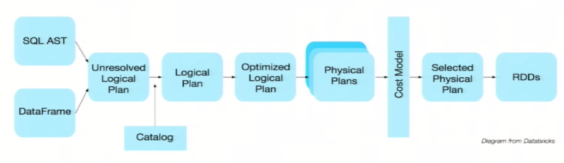
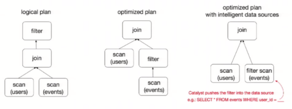

# 概述

- Spark SQL是Spark用来处理结构化数据的一个模块
- 提供了2个编程抽象
  - DataFrame和DataSet
  - 作为分布式SQL查询引擎的作用

- SparkSQL类比Hive
  - 将Hive SQL转换成MapReduce然后提交到集群上执行
  - 简化编写MapReduc的程序的复杂性
    - MapReduce这种计算模型执行效率比较慢
- Spark SQL
  - 可与Hive无缝对接
  - 可直接操作RDD
  - 将Spark SQL转换成RDD，然后提交到集群执行
  - 执行效率非常快


# 特点

- 易整合
- 统一的数据访问方式
- 兼容Hive

 

- 标准数据连接
  - 连接JDBC or ODBC


# 关于DataFrame

- 与RDD类似，DataFrame也是一个分布式数据容器
- DataFrame更像传统数据库的二维表格，除了数据以外，还记录数据的结构信息，即schema
- 与Hive类似，DataFrame也支持嵌套数据类型
  - struct
  - array
  - map
- 从API易用性的角度上看，DataFrame API提供的是一套高层的关系操作，比函数式的RDD API要更加友好

 

- RDD[Person]虽然以Person为类型参数，但Spark框架本身不了解Person类的内部结构
- DataFrame
  - 提供了详细的结构信息，使得Spark SQL可以清楚地知道该数据集中包含哪些列，每列的名称和类型各是什么
  - 为数据提供了Schema的视图
    - 可把它当做数据库中的一张表来对待
  - 是懒执行的，性能上比RDD要高，主要原因
    - 优化的执行计划：查询计划通过Spark catalyst optimiser进行优化

 

- 关于如下执行的优化

```scala
users.join(events,users("id")===events("uid")).filter(events("date") > "2015-01-01")
```

 

- 上图展示的人口数据分析的示例
  - 图中构造了两个DataFrame
    - events
    - users
  - 将它们join之后又做了一次filter操作
  - 如果原封不动地执行这个执行计划，最终的执行效率不高
    - 因为join是一个代价较大的操作，也可能会产生一个较大的数据集
  - 如果将filter下推到 join下方，先对DataFrame进行过滤，再join过滤后的较小的结果集，便可以有效缩短执行时间
  - 如果再将filter放在scan环节，可更好的提高效率
  - Spark SQL的查询优化器正是这样做的
- 逻辑查询计划优化就是一个利用基于关系代数的等价变换，将高成本的操作替换为低成本操作的过程


# 关于DataSet

- 是Dataframe API的一个扩展，是Spark最新的数据抽象

- 用户友好的API风格，既具有类型安全检查也具有Dataframe的查询优化特性

- Dataset支持编解码器，当需要访问非堆上的数据时可以避免反序列化整个对象，提高了效率

- ==样例类==用来在Dataset中定义数据的结构信息
  - 样例类中每个属性的名称直接映射到DataSet中的字段名称

- Dataframe是Dataset的特列
  - DataFrame=Dataset[Row] 
  - 通过as方法将Dataframe转换为Dataset
  - Row是一个类型，跟Car、Person这些的类型一样
  - 所有的表结构信息都可用Row来表示

- DataSet是强类型的
  - 如Dataset[Car]，Dataset[Person]

- DataFrame==只是知道字段，但是不知道字段的类型==
  - 在执行这些操作的时候是没办法在编译的时候检查是否类型失败
  - 如对一个String进行减法操作，在执行的时候才报错
- DataSet知道字段和字段类型
  - 有更严格的错误检查
- DataSet与DataFrame的关系跟JSON对象和类对象之间的类比


