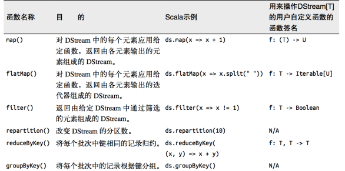
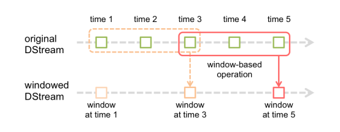
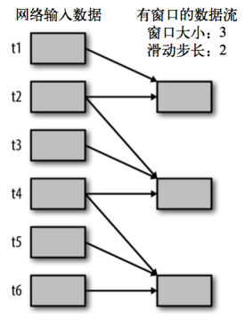
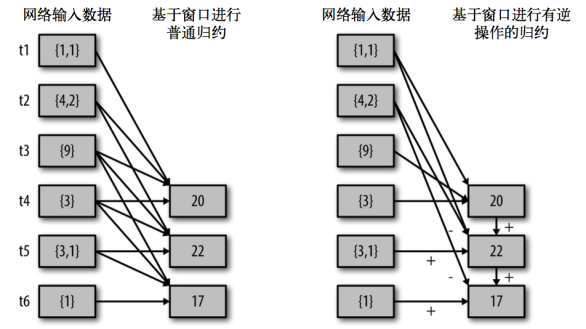

# Dstream 转换

- DStream上的原语与RDD的类似，分为
  - Transformations（转换）
  - Output Operations（输出）
- 此外转换操作中还有一些比较特殊的原语
  - 如：updateStateByKey()、transform()以及各种Window相关的原语


## 无状态转换

无状态转化操作就是把简单的RDD转化操作应用到每个批次上，也就是转化DStream中的每一个RDD

部分无状态转化操作列在了下表中

注意，针对键值对的DStream转化操作(比如 reduceByKey())要添加import StreamingContext._才能在Scala中使用

 

需要记住的是，尽管这些函数看起来像作用在整个流上一样，但事实上每个DStream在内部是由许多RDD(批次)组成，且无状态转化操作是分别应用到每个RDD上的。例如，reduceByKey()会归约每个时间区间中的数据，但不会归约不同区间之间的数据。 

举个例子，在之前的wordcount程序中，我们只会统计5秒内接收到的数据的单词个数，而不会累加。 

无状态转化操作也能在多个DStream间整合数据，不过也是在各个时间区间内。例如，键 值对DStream拥有和RDD一样的与连接相关的转化操作，也就是cogroup()、join()、leftOuterJoin() 等。我们可以在DStream上使用这些操作，这样就对每个批次分别执行了对应的RDD操作。

还可以像在常规的Spark 中一样使用 DStream的union() 操作将它和另一个DStream 的内容合并起来，也可以使用StreamingContext.union()来合并多个流


## 有状态转换（重点）

- 本质上是将各个结果存储在checkPoint上


### updateStateByKey

- SparkStreaming自动将状态保存在==checkPoint==上
- UpdateStateByKey原语用于记录历史记录
  - 需要在 DStream 中跨批次维护状态
    - 如流计算中累加wordcount
  - 针对这种情况updateStateByKey() 提供了对一个状态变量的访问，用于==键值对形式的 DStream==
  - 给定一个由(键，事件)对构成的 DStream，并传递一个指定如何根据新的事件更新每个键对应状态的函数，构建出一个新的 DStream，其内部数据为(键，状态) 对 
- updateStateByKey() 的结果会是一个新的 DStream
  - 内部的 RDD 序列是由每个时间区间对应的(键，状态)对组成的
- 使用这个功能需要做下面两步
  - 定义状态，状态可以是一个任意的数据类型
  - 定义状态更新函数，用此函数阐明如何使用之前的状态和来自输入流的新值对状态进行更新
- **使用updateStateByKey需要对检查点目录进行配置，会使用检查点来保存状态**。
- 示例：更新版的wordcount

```scala
package com.stt.spark.streaming
import org.apache.spark.SparkConf
import org.apache.spark.streaming.{Seconds, StreamingContext}
import org.apache.spark.streaming.dstream.{DStream, ReceiverInputDStream}

object Ch06_StateRDD_updateStateByKey {
    def main(args: Array[String]): Unit = {

        var conf = new SparkConf().setMaster("local[2]").setAppName("Ch06_StateRDD")
        // 3s读取一次
        val context: StreamingContext = new StreamingContext(conf, Seconds(3))
        // 监听指定的端口，3s读取一次数据
        // 返回接收器
        val dstream: ReceiverInputDStream[String] = context.socketTextStream("hadoop102", 9999)
        // 将读取的数据扁平化
        val wordStream: DStream[String] = dstream.flatMap(_.split(" "))

        val tupleDstream: DStream[(String, Int)] = wordStream.map(w => (w, 1))

        // 无状态
        //val result: DStream[(String, Int)] = tupleDstream.reduceByKey(_ + _)

        // 将RDD转换为有状态，必须设置检查点
        context.sparkContext.setCheckpointDir("data/spark/streaming")

        // buffer 是sparkStreaming自动放入检查点的数据，操作后再放入检查点
        // datas是wordStream中元组的_2的数组
        val re: DStream[(String, Int)] = tupleDstream.updateStateByKey(
            (datas: Seq[Int], buffer: Option[Int]) => {
                // 原先有结果取出
                var result: Int = buffer.getOrElse(0)
                var sum = result + datas.sum
                // 返回新的buffer
                Option(sum)
            }
        )

        re.print
        // 开启接收器
        context.start()

        // main的是driver，需要一直启动，等待接收器执行
        context.awaitTermination()
    }
}
```


### window Operations

- 设置窗口的大小和滑动窗口的间隔来动态的获取当前Steaming的允许状态
- 基于窗口的操作会在一个比 StreamingContext 的批次间隔更长的时间范围内，通过整合多个批次的结果，计算出整个窗口的结果

 

- 所有基于窗口的操作都需要两个参数
  - 窗口时长
  - 滑动步长
  - ==两者都必须是 StreamContext 的批次间隔的整数倍==

窗口时长控制每次计算最近的多少个批次的数据，其实就是最近的 windowDuration/batchInterval 个批次。如果有一个以 10 秒为批次间隔的源 DStream，要创建一个最近 30 秒的时间窗口(即最近 3 个批次)，就应当把 windowDuration 设为 30 秒。而滑动步长的默认值与批次间隔相等，用来控制对新的 DStream 进行计算的间隔。如果源 DStream 批次间隔为 10 秒，并且我们只希望每两个批次计算一次窗口结果， 就应该把滑动步长设置为 20 秒。 

假设，你想拓展前例从而每隔十秒对持续30秒的数据生成word count。为做到这个，我们需要在持续30秒数据的(word,1)对DStream上应用reduceByKey。使用操作reduceByKeyAndWindow

```scala
# reduce last 30 seconds of data, every 10 second
windowedWordCounts = pairs.reduceByKeyAndWindow(lambda x, y: x + y, lambda x, y: x -y, 30, 20)
```

 

- 关于Window的操作有如下原语
  - window(windowLength, slideInterval): 基于对源DStream窗化的批次进行计算返回一个新的Dstream
  - countByWindow(windowLength, slideInterval)：返回一个滑动窗口计数流中的元素
  - reduceByWindow(func, windowLength, slideInterval)：通过使用自定义函数整合滑动区间流元素来创建一个新的单元素流
  - reduceByKeyAndWindow(func, windowLength, slideInterval, [numTasks])：当在一个(K,V)对的DStream上调用此函数，会返回一个新(K,V)对的DStream，此处通过对滑动窗口中批次数据使用reduce函数来整合每个key的value值。Note:默认情况下，这个操作使用Spark的默认数量并行任务(本地是2)，在集群模式中依据配置属性(spark.default.parallelism)来做grouping。你可以通过设置可选参数numTasks来设置不同数量的tasks
  - reduceByKeyAndWindow(func, invFunc, windowLength, slideInterval, [numTasks])：这个函数是上述函数的更高效版本，每个窗口的reduce值都是通过用前一个窗的reduce值来递增计算。通过reduce进入到滑动窗口数据并”反向reduce”离开窗口的旧数据来实现这个操作。一个例子是随着窗口滑动对keys的“加”“减”计数。通过前边介绍可以想到，这个函数只适用于”可逆的reduce函数”，也就是这些reduce函数有相应的”反reduce”函数(以参数invFunc形式传入)。如前述函数，reduce任务的数量通过可选参数来配置
    - 注意：为了使用这个操作，检查点必须可用
  - countByValueAndWindow(windowLength,slideInterval, [numTasks])：对(K,V)对的DStream调用，返回(K,Long)对的新DStream，其中每个key的值是其在滑动窗口中频率。如上，可配置reduce任务数量
  - reduceByWindow() 和 reduceByKeyAndWindow() 让我们可以对每个窗口更高效地进行归约操作。它们接收一个归约函数，在整个窗口上执行，比如 +。除此以外，它们还有一种特殊形式，通过只考虑新进入窗口的数据和离开窗口的数据，让 Spark 增量计算归约结果。这种特殊形式需要提供归约函数的一个逆函数，比 如 + 对应的逆函数为 -。对于较大的窗口，提供逆函数可以大大提高执行效率

 

```scala
val ipDStream = accessLogsDStream.map(logEntry => (logEntry.getIpAddress(), 1))
val ipCountDStream = ipDStream.reduceByKeyAndWindow(
    {(x, y) => x + y},
    {(x, y) => x - y},
    Seconds(30),
    Seconds(10))
// 加上新进入窗口的批次中的元素 // 移除离开窗口的老批次中的元素 // 窗口时长// 滑动步长
```

countByWindow()和countByValueAndWindow()作为对数据进行计数操作的简写。countByWindow()返回一个表示每个窗口中元素个数的DStream，而countByValueAndWindow()返回的DStream则包含窗口中每个值的个数

```scala
val ipDStream = accessLogsDStream.map{entry => entry.getIpAddress()}
val ipAddressRequestCount = ipDStream.countByValueAndWindow(Seconds(30), Seconds(10)) 
val requestCount = accessLogsDStream.countByWindow(Seconds(30), Seconds(10))
```

- WordCount第三版：3秒一个批次，窗口12秒，滑步6秒

```scala
package com.atguigu.streaming

import org.apache.spark.SparkConf
import org.apache.spark.streaming.{Seconds, StreamingContext}

object WorldCount {

    def main(args: Array[String]) {

        // 定义更新状态方法，参数values为当前批次单词频度，state为以往批次单词频度
        val updateFunc = (values: Seq[Int], state: Option[Int]) => {
            val currentCount = values.foldLeft(0)(_ + _)
            val previousCount = state.getOrElse(0)
            Some(currentCount + previousCount)
        }

        val conf = new SparkConf().setMaster("local[2]").setAppName("NetworkWordCount")
        val ssc = new StreamingContext(conf, Seconds(3))
        ssc.checkpoint(".")

        // Create a DStream that will connect to hostname:port, like localhost:9999
        val lines = ssc.socketTextStream("hadoop102", 9999)

        // Split each line into words
        val words = lines.flatMap(_.split(" "))

        //import org.apache.spark.streaming.StreamingContext._ // not necessary since Spark 1.3
        // Count each word in each batch
        val pairs = words.map(word => (word, 1))

        val wordCounts = pairs.reduceByKeyAndWindow((a:Int,b:Int) => (a + b),Seconds(12), Seconds(6))

        // Print the first ten elements of each RDD generated in this DStream to the console
        wordCounts.print()

        ssc.start()             // Start the computation
        ssc.awaitTermination()  // Wait for the computation to terminate
        //ssc.stop()
    }

}
```

#### 示例

- 用法1

```scala
package com.stt.spark.streaming

import org.apache.spark.SparkConf
import org.apache.spark.streaming.{Seconds, StreamingContext}
import org.apache.spark.streaming.dstream.{DStream, ReceiverInputDStream}

object Ch07_Window {
    def main(args: Array[String]): Unit = {

        var conf = new SparkConf().setMaster("local[2]").setAppName("Ch07_Window")
        // 3s读取一次
        val context: StreamingContext = new StreamingContext(conf, Seconds(3))
        // 监听指定的端口，3s读取一次数据
        // 返回接收器
        val dstream: ReceiverInputDStream[String] = context.socketTextStream("hadoop102", 9999)
        // 将读取的数据扁平化
        val wordStream: DStream[String] = dstream.flatMap(_.split(" "))

        val tupleDstream: DStream[(String, Int)] = wordStream.map(w => (w, 1))

        // 窗口操作
        val re: DStream[(String, Int)] = tupleDstream.reduceByKeyAndWindow(
            (v1:Int,v2:Int)=>(v1+v2), // 具体操作
            Seconds(9), // 窗口大小
            Seconds(3) // 窗口每次滑动距离
        )

        re.print
        // 开启接收器
        context.start()

        // main的是driver，需要一直启动，等待接收器执行
        context.awaitTermination()
    }
}
```

- 使用2

```scala
package com.stt.spark.streaming

import org.apache.spark.SparkConf
import org.apache.spark.streaming.{Seconds, StreamingContext}
import org.apache.spark.streaming.dstream.{DStream, ReceiverInputDStream}

object Ch07_Window {
    def main(args: Array[String]): Unit = {

        var conf = new SparkConf().setMaster("local[2]").setAppName("Ch07_Window")
        // 3s读取一次
        val context: StreamingContext = new StreamingContext(conf, Seconds(3))
        // 监听指定的端口，3s读取一次数据
        // 返回接收器
        val dstream: ReceiverInputDStream[String] = context.socketTextStream("hadoop102", 9999)
        // 将读取的数据扁平化
        val wordStream: DStream[String] = dstream.flatMap(_.split(" "))

        val tupleDstream: DStream[(String, Int)] = wordStream.map(w => (w, 1))

        // 进行抽口逆向操作需要检查点
        context.sparkContext.setCheckpointDir("data/spark/streaming")

        val re: DStream[(String, Int)] = tupleDstream.reduceByKeyAndWindow(
            (v1:Int,v2:Int)=>(v1+v2), // 具体操作
            (v1:Int,v2:Int)=>(v1-v2), // 窗口的逆向处理函数，将之前的数据做减法处理，需要checkPoint支持,提供该函数属于用法1的优化，减少重复计算量
            Seconds(9), // 窗口大小
            Seconds(3) // 窗口每次滑动距离
        )
        re.print
        // 开启接收器
        context.start()
        // main的是driver，需要一直启动，等待接收器执行
        context.awaitTermination()
    }
}
```


## 其他


### Transform

- Transform原语允许DStream上执行任意的RDD-to-RDD函数
  - 即使这些函数并没有在DStream的API中暴露出来，通过该函数可以方便的扩展Spark API
  - 该函数每一批次调度一次
  - 其实是对DStream中的RDD应用转换
- 如在进行单词统计的时候，想要过滤掉spam的信息

```scala
val spamInfoRDD = ssc.sparkContext.newAPIHadoopRDD(...) 
// RDD containing spam information

val cleanedDStream = wordCounts.transform { rdd =>
    rdd.join(spamInfoRDD).filter(...) 
    // join data stream with spam information to do data cleaning
    ...
}
```


### Join

- 连接操作（leftOuterJoin, rightOuterJoin, fullOuterJoin也可以）
- 可连接Stream-Stream，windows-stream to windows-stream、stream-dataset

#### Stream-Stream Joins

```scala
val stream1: DStream[String, String] = ...
val stream2: DStream[String, String] = ...
val joinedStream = stream1.join(stream2)

val windowedStream1 = stream1.window(Seconds(20))
val windowedStream2 = stream2.window(Minutes(1))
val joinedStream = windowedStream1.join(windowedStream2)
```

#### Stream-dataset joins

```scala
val dataset: RDD[String, String] = ...
val windowedStream = stream.window(Seconds(20))...
val joinedStream = windowedStream.transform { rdd => rdd.join(dataset) }
```

