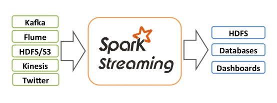
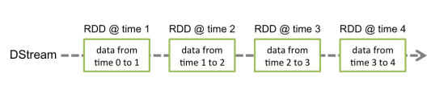
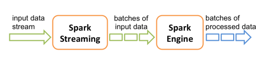

# 概述

- Spark Streaming用于流式数据的处理
- Spark Streaming支持的数据输入源很多
  - 如：Kafka、Flume、Twitter、ZeroMQ和简单的TCP套接字等
  - 数据输入后可用Spark的高度抽象原语如：map、reduce、join、window等进行运算
  - 结果也能保存在很多地方
    - 如HDFS，数据库等

 

- DStream

  - 和Spark基于RDD的概念很相似，Spark Streaming使用离散化流作为抽象表示

  - discretized stream

  - 随时间推移而收到的数据的序列

  - 在内部每个时间区间收到的数据都作为 RDD 存在，而DStream是由这些RDD所组成的序列

  - 离散化

    

## 特点

- 易用

- 容错

- 易整合到Spark体系

  

## 架构

 


# Dstream入门


## wordCount

- 安装netcat
- 启动netcat服务，在9999端口进行运行

```bash
[ttshe@hadoop102 data]$ nc -lk 9999
hello
hello
```

- 代码

```scala
package com.stt.spark.streaming

import org.apache.spark.SparkConf
import org.apache.spark.streaming.dstream.{DStream, ReceiverInputDStream}
import org.apache.spark.streaming.{Seconds, StreamingContext}

object Ch01_WordCount {
    def main(args: Array[String]): Unit = {
		// 注意不要使用local和local[1]执行
        var conf = new SparkConf().setMaster("local[*]").setAppName("Ch01_WordCount")
        // 3s读取一次
        val context: StreamingContext = new StreamingContext(conf,Seconds(3))
        // 监听指定的端口，3s读取一次数据
        // 返回接收器
        val dstream: ReceiverInputDStream[String] = context.socketTextStream("hadoop102",9999)
        // 将读取的数据扁平化
        val wordStream: DStream[String] = dstream.flatMap(_.split(" "))

        val tupleDstream: DStream[(String, Int)] = wordStream.map(w=>(w,1))

        val result: DStream[(String, Int)] = tupleDstream.reduceByKey(_ + _)

        result.print

        // 开启接收器
        context.start()

        // main的是driver，需要一直启动，等待接收器执行
        context.awaitTermination()
    }
}
```

- 无记忆性，不进行累计结果
- 注意：如果程序运行时，log日志太多，可以将spark conf目录下的log4j文件里面的日志级别改成WARN


## 分析

- Discretized 离散化的
- Discretized Stream是Spark Streaming的基础抽象，代表持续性的数据流和经过各种Spark原语操作后的结果数据流
- 在内部实现上，DStream是一系列连续的RDD来表示
- 每个RDD含有一段时间间隔内的数据

 

- 对数据的操作也是按照RDD为单位来进行的

 

- 计算过程由Spark engine来完成

 


