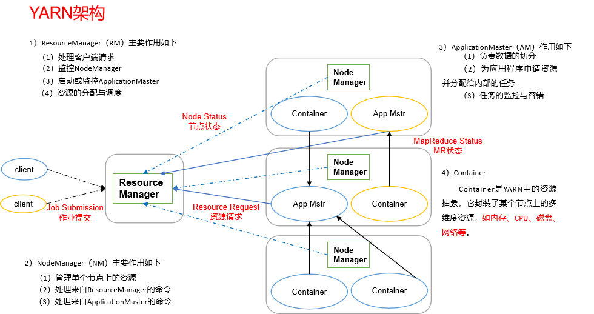

# Yarn调度回顾

 

- Container出现的原因
  - 早期Hadoop没有Yarn作为资源调度
    - 缺点只能使用MapReduce进行处理
    - 不能支持其他计算框架
  - 使用Yarn可以支持其他计算框架
    - 所有计算都在Container中实现


# 引入pom

- 分析源码需要引入pom信息

```xml
<dependency>
    <groupId>org.apache.spark</groupId>
    <artifactId>spark-yarn_2.11</artifactId>
    <version>2.1.1</version>
</dependency>
```


# Spark内核分析 [deploy-mode cluster]


## 查找起点

- 执行命令

```bash
bin/spark-submit \
--class org.apache.spark.examples.SparkPi \
--num-executors 2 \
--master yarn \
--deploy-mode cluster \ # 实际工作中使用
./examples/jars/spark-examples_2.11-2.1.1.jar \
100
```

- 查看spark-submit执行脚本

```bash
[ttshe@hadoop102 bin]$ pwd
/opt/module/spark/bin
[ttshe@hadoop102 bin]$ vim spark-submit
```

```bash
#!/usr/bin/env bash

if [ -z "${SPARK_HOME}" ]; then
source "$(dirname "$0")"/find-spark-home
fi
# disable randomized hash for string in Python 3.3+
export PYTHONHASHSEED=0
exec "${SPARK_HOME}"/bin/spark-class org.apache.spark.deploy.SparkSubmit "$@" 
# $@ 表示命令行的所有参数传递
```

- 分析可以得知调用了spark-class命令
  - 查看spark-class

```bash
...
CMD=("${CMD[@]:0:$LAST}")
# 修改查看调用的命令
echo "${CMD[@]}"
exec "${CMD[@]}"
```

- 得到起点`org.apache.spark.deploy.SparkSubmit`


## 查看SparkSubmit对象

```scala
// SparkSubmit.scala
def main(args: Array[String]): Unit = {
    // 进行submit的参数准备
    val appArgs = new SparkSubmitArguments(args)
    if (appArgs.verbose) {
        // scalastyle:off println
        printStream.println(appArgs)
        // scalastyle:on println
    }
    appArgs.action match {
        case SparkSubmitAction.SUBMIT => submit(appArgs) // 查看执行
        case SparkSubmitAction.KILL => kill(appArgs)
        case SparkSubmitAction.REQUEST_STATUS => requestStatus(appArgs)
    }
}
```


### 参数查看

- 在SparkSubmitArguments中查看参数

```scala
// SparkSubmitArguments
private[deploy] class SparkSubmitArguments(args: Seq[String], env: Map[String, String] = sys.env)
extends SparkSubmitArgumentsParser {
    var master: String = null // 对应调用参数的--master
    var deployMode: String = null
    var executorMemory: String = null
    var executorCores: String = null
    var totalExecutorCores: String = null
    var propertiesFile: String = null
    var driverMemory: String = null
    var driverExtraClassPath: String = null
    var driverExtraLibraryPath: String = null
    var driverExtraJavaOptions: String = null
    var queue: String = null
    var numExecutors: String = null
    var files: String = null
    var archives: String = null
    var mainClass: String = null
    var primaryResource: String = null
    var name: String = null
    var childArgs: ArrayBuffer[String] = new ArrayBuffer[String]()
    var jars: String = null
    var packages: String = null
    var repositories: String = null
    var ivyRepoPath: String = null
    var packagesExclusions: String = null
    var verbose: Boolean = false
    var isPython: Boolean = false
    var pyFiles: String = null
    var isR: Boolean = false
    var action: SparkSubmitAction = null
    val sparkProperties: HashMap[String, String] = new HashMap[String, String]()
    var proxyUser: String = null
    var principal: String = null
    var keytab: String = null

    // Standalone cluster mode only
    var supervise: Boolean = false
    var driverCores: String = null
    var submissionToKill: String = null
    var submissionToRequestStatusFor: String = null
    var useRest: Boolean = true // used internally
```


### 提交函数

```scala
// SparkSubmit.scala
private def submit(args: SparkSubmitArguments): Unit = {
    // 运行环境的准备 --1
    val (childArgs, childClasspath, sysProps, childMainClass) = 
    prepareSubmitEnvironment(args)

    def doRunMain(): Unit = {
        if (args.proxyUser != null) {
            val proxyUser = 
            UserGroupInformation.createProxyUser(args.proxyUser,                                                     UserGroupInformation.getCurrentUser())
            try {
                proxyUser.doAs(new PrivilegedExceptionAction[Unit]() {
                    override def run(): Unit = {
                        // 运行主程序 --3
                        runMain(childArgs, childClasspath, sysProps, childMainClass, args.verbose)
                    }
                })
		...
        } else {
            // 运行主程序 --3
            runMain(childArgs, childClasspath, sysProps, childMainClass, args.verbose)
        }
    }

    if (args.isStandaloneCluster && args.useRest) {
			...
            doRunMain()
    } else {
        doRunMain() // 执行该方法，参数yarn模式 --2
    }
}
```


####  提交环境准备 [prepareSubmitEnvironment]

- 在yarn cluster模式下调用`org.apache.spark.deploy.yarn.Client`的main方法

```scala
private[deploy] def prepareSubmitEnvironment(args: SparkSubmitArguments){
    ...
if (isYarnCluster) {
    childMainClass = "org.apache.spark.deploy.yarn.Client"
    ...
// 返回参数,注意 childMainClass 的返回    
(childArgs, childClasspath, sysProps, childMainClass)  
}
```


#### 运行主程序 [runMain]

```scala
// SparkSubmit.scala
private def runMain(
    childArgs: Seq[String],
    childClasspath: Seq[String],
    sysProps: Map[String, String],
    childMainClass: String,
    verbose: Boolean): Unit = {
    // scalastyle:off println
    if (verbose) {
        printStream.println(s"Main class:\n$childMainClass")
        printStream.println(s"Arguments:\n${childArgs.mkString("\n")}")
        printStream.println(s"System properties:\n${sysProps.mkString("\n")}")
        printStream.println(s"Classpath elements:\n${childClasspath.mkString("\n")}")
        printStream.println("\n")
    }
    // scalastyle:on println

    // 
    val loader =
    if (sysProps.getOrElse("spark.driver.userClassPathFirst", "false").toBoolean) {
        new ChildFirstURLClassLoader(new Array[URL](0),Thread.currentThread.getContextClassLoader)
    } else {
        new MutableURLClassLoader(new Array[URL](0),Thread.currentThread.getContextClassLoader)
    }
    // 设置上下文的类加载器
    Thread.currentThread.setContextClassLoader(loader)

    for (jar <- childClasspath) {
        // 在类路径下加载jar包
        addJarToClasspath(jar, loader)
    }
    for ((key, value) <- sysProps) {
        System.setProperty(key, value)
    }
    var mainClass: Class[_] = null
    try {
        // 通过字符串加载class，此时是client类
        mainClass = Utils.classForName(childMainClass)
    } catch {
        ...
    }
	...
	// 获取yarn.client类的main方法
    val mainMethod = mainClass.getMethod("main", new Array[String](0).getClass)
	...
    try {
        // 反射执行yarn.client的main方法
        // 注意这里不会开启一个进程或者线程执行
        // java XXXX 才会开启一个进程
        mainMethod.invoke(null, childArgs.toArray)
    } catch {
		...
    }
}
```


## yarn.client 执行

- 查看`org.apache.spark.deploy.yarn.Client`的main执行

```scala
// Client.scala
def main(argStrings: Array[String]) {
    ...
    System.setProperty("SPARK_YARN_MODE", "true")
    val sparkConf = new SparkConf
    // SparkSubmit would use yarn cache to distribute files & jars in yarn mode,
    // so remove them from sparkConf here for yarn mode.
    sparkConf.remove("spark.jars")
    sparkConf.remove("spark.files")
    val args = new ClientArguments(argStrings)

    // 在run方法中提交应用
    new Client(args, sparkConf).run()
}

def run(): Unit = {
    // 当前应用的唯一性标识
    this.appId = submitApplication()

    if (!launcherBackend.isConnected() && fireAndForget) {
        val report = getApplicationReport(appId)
        val state = report.getYarnApplicationState
        logInfo(s"Application report for $appId (state: $state)")
        logInfo(formatReportDetails(report))
        if (state == YarnApplicationState.FAILED || state == YarnApplicationState.KILLED) {
            throw new SparkException(s"Application $appId finished with status: $state")
        }
    } else {
        // 监控任务的运行与状态
        val (yarnApplicationState, finalApplicationStatus) = monitorApplication(appId)
        if (yarnApplicationState == YarnApplicationState.FAILED ||
            finalApplicationStatus == FinalApplicationStatus.FAILED) {
            throw new SparkException(s"Application $appId finished with failed status")
        }
        if (yarnApplicationState == YarnApplicationState.KILLED ||
            finalApplicationStatus == FinalApplicationStatus.KILLED) {
            throw new SparkException(s"Application $appId is killed")
        }
        if (finalApplicationStatus == FinalApplicationStatus.UNDEFINED) {
            throw new SparkException(s"The final status of application $appId is undefined")
        }
    }
}


def submitApplication(): ApplicationId = {
    var appId: ApplicationId = null
    try {
        launcherBackend.connect()
        // Setup the credentials before doing anything else,
        // so we have don't have issues at any point.
        setupCredentials()

        // 启动了yarn的客户端
        yarnClient.init(yarnConf)
        yarnClient.start()

        logInfo("Requesting a new application from cluster with %d NodeManagers"
                .format(yarnClient.getYarnClusterMetrics.getNumNodeManagers))

        // Get a new application from our RM

        // 构建application
        val newApp = yarnClient.createApplication()
        val newAppResponse = newApp.getNewApplicationResponse()
        appId = newAppResponse.getApplicationId()
        reportLauncherState(SparkAppHandle.State.SUBMITTED)
        launcherBackend.setAppId(appId.toString)

        new CallerContext("CLIENT", Option(appId.toString)).setCurrentContext()

        // Verify whether the cluster has enough resources for our AM
        verifyClusterResources(newAppResponse)

        // Set up the appropriate contexts to launch our AM
        // 准备运行ApplicationMaster的运行环境
        val containerContext = createContainerLaunchContext(newAppResponse)
        val appContext = createApplicationSubmissionContext(newApp, containerContext)

        // Finally, submit and monitor the application
        logInfo(s"Submitting application $appId to ResourceManager")
        yarnClient.submitApplication(appContext)
        appId
    } catch {
        ...
    }
}

private def createContainerLaunchContext(newAppResponse: GetNewApplicationResponse){
    ...
    // 判断当前的运行模式，本质上两种模式调用方法一样
    val amClass =
    if (isClusterMode) {
        // 集群模式 cluster
  Utils.classForName("org.apache.spark.deploy.yarn.ApplicationMaster").getName
    } else {
        // 客户端模式
   Utils.classForName("org.apache.spark.deploy.yarn.ExecutorLauncher").getName
    }
	// 返回运行指令,类似于如下
    
    "/bin/java" + amClass
}
```

- 在ApplicationMaster中ExecutorLauncher调用的是ApplicationMaster的main方法

```scala
// ApplicationMaster.scala
object ExecutorLauncher {
    def main(args: Array[String]): Unit = {
        ApplicationMaster.main(args)
    }
}
```

- submitApplication

```scala
//Client.scala
def submitApplication(): ApplicationId = {
    ...
    // 将指令通过yarn客户端发送给yarn
    yarnClient.submitApplication(appContext)
    appId
}
// YarnClientImpl.java
@Override
public ApplicationId
submitApplication(ApplicationSubmissionContext appContext)
throws YarnException, IOException {
    ApplicationId applicationId = appContext.getApplicationId();
    appContext.setApplicationId(applicationId);
    SubmitApplicationRequest request =
    Records.newRecord(SubmitApplicationRequest.class);
    request.setApplicationSubmissionContext(appContext);
    // 最终操作
    rmClient.submitApplication(request);

    int pollCount = 0;
    // 不断获取状态
    while (true) {
        YarnApplicationState state =
        getApplicationReport(applicationId).getYarnApplicationState();
        if (!state.equals(YarnApplicationState.NEW) &&
            !state.equals(YarnApplicationState.NEW_SAVING)) {
            break;
        }
        // Notify the client through the log every 10 poll, in case the client
        // is blocked here too long.
        if (++pollCount % 10 == 0) {
            LOG.info("Application submission is not finished, " +
                     "submitted application " + applicationId +
                     " is still in " + state);
        }
        try {
            Thread.sleep(statePollIntervalMillis);
        } catch (InterruptedException ie) {
        }
    }
    LOG.info("Submitted application " + applicationId + " to ResourceManager"
             + " at " + rmAddress);
    return applicationId;
}
```

- 最终client创建了yarn客户端，通知yarn的RM在NM上创建相应的ApplicationMaster


## 分析ApplicationMaster执行

- ApplicationMaster中

```scala
// ApplicationMaster.scala
def main(args: Array[String]): Unit = {
    SignalUtils.registerLogger(log)
    // 将命令行的参数封装成自己的参数
    // 如含有--class参数
    val amArgs = new ApplicationMasterArguments(args)

    // Load the properties file with the Spark configuration and set entries as system properties,
    // so that user code run inside the AM also has access to them.
    // Note: we must do this before SparkHadoopUtil instantiated
    if (amArgs.propertiesFile != null) {
        Utils.getPropertiesFromFile(amArgs.propertiesFile).foreach { 
            case (k, v) => sys.props(k) = v
        }
    }
    SparkHadoopUtil.get.runAsSparkUser { () =>
        // 创建了一个master对象
        master = new ApplicationMaster(amArgs, new YarnRMClient)
        System.exit(master.run())
    }
}

final def run(): Int = {
    try {
        // 获取appId
        val appAttemptId = client.getAttemptId()
        var attemptID: Option[String] = None
        // 判断是否是集群模式
        if (isClusterMode) {
            System.setProperty("spark.ui.port", "0")
            System.setProperty("spark.master", "yarn")
            System.setProperty("spark.submit.deployMode", "cluster")
            System.setProperty("spark.yarn.app.id", appAttemptId.getApplicationId().toString())
            attemptID = Option(appAttemptId.getAttemptId.toString)
        }
        new CallerContext("APPMASTER",
                          Option(appAttemptId.getApplicationId.toString), attemptID).setCurrentContext()

        logInfo("ApplicationAttemptId: " + appAttemptId)
        // yarn在处理时，需要将临时文件放在hadoop中
        val fs = FileSystem.get(yarnConf)
        ...
    }

    if (isClusterMode) {
        // 运行Driver
        // 创建了SparkContext对象的类就是Driver
        // 通过--class传递到userClass对象
        runDriver(securityMgr)
    } else {
        // 客户端模式
        runExecutorLauncher(securityMgr)
    }
} catch {
    ...
}
exitCode
}

private def runDriver(securityMgr: SecurityManager): Unit = {
    addAmIpFilter()
    // 开始启动Driver的线程
    userClassThread = startUserApplication()

    // This a bit hacky, but we need to wait until the spark.driver.port property has
    // been set by the Thread executing the user class.
    logInfo("Waiting for spark context initialization...")
    val totalWaitTime = sparkConf.get(AM_MAX_WAIT_TIME)
    try {
        ...
        rpcEnv = sc.env.rpcEnv

        val driverRef = runAMEndpoint(
            sc.getConf.get("spark.driver.host"),
            sc.getConf.get("spark.driver.port"),
            isClusterMode = true)
        // Driver的引用，注册到AM中，给其他NM中的Executor使用进行反向注册使用
        registerAM(sc.getConf, rpcEnv, driverRef, sc.ui.map(_.appUIAddress).getOrElse(""),
                   securityMgr)

        // 等待userClassThread执行完毕
        userClassThread.join()
    } catch {
        ...
    }
}

private def startUserApplication(): Thread = {
    ...
    // 反射获取Driver中的main方法
    val mainMethod = userClassLoader.loadClass(args.userClass)
    .getMethod("main", classOf[Array[String]])
    // 创建用户线程
    val userThread = new Thread {
        override def run() {
            try {
                // 使用Driver的main方法
                mainMethod.invoke(null, userArgs.toArray)
                finish(FinalApplicationStatus.SUCCEEDED, ApplicationMaster.EXIT_SUCCESS)
                logDebug("Done running users class")
            } catch {
                ...
            }
        }
        userThread.setContextClassLoader(userClassLoader)
        // 给线程命名为Driver
        userThread.setName("Driver")
        // 启动Driver的线程    
        userThread.start()
        userThread
    }
```

- ==Driver本身是运行在ApplicationMaster进程中的一个线程==

- 关于Driver引用的注册

```scala
private def registerAM(
    _sparkConf: SparkConf,
    _rpcEnv: RpcEnv,
    driverRef: RpcEndpointRef,
    uiAddress: String,
    securityMgr: SecurityManager) = {
...
	// YarnRMClient 就是运行在RM上的Client
    allocator = client.register(driverUrl,
                                driverRef,
                                yarnConf,
                                _sparkConf,
                                uiAddress,
                                historyAddress,
                                securityMgr,
                                localResources)
	// 通过资源分配对象对资源进行分配
    allocator.allocateResources()
    // 启动报告线程
    reporterThread = launchReporterThread()
}
```

```scala
// YarnRMClient
def register(
    driverUrl: String,
    driverRef: RpcEndpointRef,
    conf: YarnConfiguration,
    sparkConf: SparkConf,
    uiAddress: String,
    uiHistoryAddress: String,
    securityMgr: SecurityManager,
    localResources: Map[String, LocalResource]
): YarnAllocator = {
    // ApplicationMaster和RM进行联系的client
    amClient = AMRMClient.createAMRMClient()
    amClient.init(conf)
    amClient.start()
    this.uiHistoryAddress = uiHistoryAddress

    logInfo("Registering the ApplicationMaster")
    synchronized {
        // 注册applicationMaster
        amClient.registerApplicationMaster(Utils.localHostName(), 0, uiAddress)
        registered = true
    }
    // 返回Yarn资源分配器，要有driverUrl，用于返回资源信息
    new YarnAllocator(driverUrl, driverRef, conf, sparkConf, amClient, getAttemptId(), securityMgr,localResources, new SparkRackResolver())
}
```

- 资源分配

```scala
def allocateResources(): Unit = synchronized {
    updateResourceRequests()

    val progressIndicator = 0.1f
    // Poll the ResourceManager. This doubles as a heartbeat if there are no pending container requests.
    // 请求并获取资源分配的结果的响应
    val allocateResponse = amClient.allocate(progressIndicator)
	// 从响应中获取可用的NM的容器
    val allocatedContainers = allocateResponse.getAllocatedContainers()
	// 判断容器的个数
    if (allocatedContainers.size > 0) {
        logDebug("Allocated containers: %d. Current executor count: %d. Cluster resources: %s."
                 .format(
                     allocatedContainers.size,
                     numExecutorsRunning,
                     allocateResponse.getAvailableResources))
		// 处理资源 *****
        handleAllocatedContainers(allocatedContainers.asScala)
    }

    val completedContainers = allocateResponse.getCompletedContainersStatuses()
    if (completedContainers.size > 0) {
        logDebug("Completed %d containers".format(completedContainers.size))
        processCompletedContainers(completedContainers.asScala)
        logDebug("Finished processing %d completed containers. Current running executor count: %d."
                 .format(completedContainers.size, numExecutorsRunning))
    }
}
```

- 容器的选择

```scala
// YarnAllocator.scala
def handleAllocatedContainers(allocatedContainers: Seq[Container]): Unit = {
    val containersToUse = new ArrayBuffer[Container](allocatedContainers.size)

    // Match incoming requests by host
    // 先匹配主机
    val remainingAfterHostMatches = new ArrayBuffer[Container]
    for (allocatedContainer <- allocatedContainers) {
        matchContainerToRequest(allocatedContainer, allocatedContainer.getNodeId.getHost,
                                containersToUse, remainingAfterHostMatches)
    }

    // Match remaining by rack
    // 在匹配机架
    val remainingAfterRackMatches = new ArrayBuffer[Container]
    for (allocatedContainer <- remainingAfterHostMatches) {
        val rack = resolver.resolve(conf, allocatedContainer.getNodeId.getHost)
        matchContainerToRequest(allocatedContainer, rack, containersToUse,
                                remainingAfterRackMatches)
    }

    // Assign remaining that are neither node-local nor rack-local
    // 最后匹配其他
    val remainingAfterOffRackMatches = new ArrayBuffer[Container]
    for (allocatedContainer <- remainingAfterRackMatches) {
        matchContainerToRequest(allocatedContainer, ANY_HOST, containersToUse,
                                remainingAfterOffRackMatches)
    }
...
    // 运行要使用的容器
    runAllocatedContainers(containersToUse)
    logInfo("Received %d containers from YARN, launching executors on %d of them."
            .format(allocatedContainers.size, containersToUse.size))
}
```


## 容器运行 [Container]

- runAllocatedContainers
  - 准备容器启动线程，运行线程

```scala
// YarnAllocator.scala
private def runAllocatedContainers(containersToUse: ArrayBuffer[Container]): Unit = {
    for (container <- containersToUse) {
        executorIdCounter += 1
        val executorHostname = container.getNodeId.getHost
        val containerId = container.getId
        val executorId = executorIdCounter.toString
        assert(container.getResource.getMemory >= resource.getMemory)
        logInfo(s"Launching container $containerId on host $executorHostname")

        def updateInternalState(): Unit = synchronized {
            numExecutorsRunning += 1
            executorIdToContainer(executorId) = container
            containerIdToExecutorId(container.getId) = executorId
            val containerSet = allocatedHostToContainersMap.getOrElseUpdate(executorHostname,
                                                                            new HashSet[ContainerId])
            containerSet += containerId
            allocatedContainerToHostMap.put(containerId, executorHostname)
        }
        // 判断目标容器个数和当前容器启动容器个数是否一致
        if (numExecutorsRunning < targetNumExecutors) {
            if (launchContainers) {
                launcherPool.execute(new Runnable {
                    override def run(): Unit = {
                        try {
                            // 构建多个线程启动container
                            new ExecutorRunnable(
                                Some(container),
                                conf,
                                sparkConf,
                                driverUrl,
                                executorId,
                                executorHostname,
                                executorMemory,
                                executorCores,
                                appAttemptId.getApplicationId.toString,
                                securityMgr,
                                localResources
                            ).run()
                            updateInternalState()
                        } catch {
...
    }
}
```

- 启动容器

```scala
// ExecutorRunnable.scala
private[yarn] class ExecutorRunnable(
    container: Option[Container],
    conf: YarnConfiguration,
    sparkConf: SparkConf,
    masterAddress: String,
    executorId: String,
    hostname: String,
    executorMemory: Int,
    executorCores: Int,
    appId: String,
    securityMgr: SecurityManager,
    localResources: Map[String, LocalResource]) extends Logging {

    var rpc: YarnRPC = YarnRPC.create(conf)
    // NodeManager的客户端
    var nmClient: NMClient = _

    def run(): Unit = {
        logDebug("Starting Executor Container")
        nmClient = NMClient.createNMClient()
        nmClient.init(conf)
        nmClient.start()
        // 启动容器
        startContainer()
    }

    def startContainer(): java.util.Map[String, ByteBuffer] = {
        val ctx = Records.newRecord(classOf[ContainerLaunchContext])
        .asInstanceOf[ContainerLaunchContext]
        // 准备环境，http协议，日志等
        val env = prepareEnvironment().asJava
        ...	
        // 准备命令，给NodeManager
        val commands = prepareCommand()

        ctx.setCommands(commands.asJava)
        ctx.setApplicationACLs(
            YarnSparkHadoopUtil.getApplicationAclsForYarn(securityMgr).asJava)
...
        // Send the start request to the ContainerManager
        try {
            // ApplicationMaster发送命令(bin/java CoarseGrainedExecutorBackend)给NM
            nmClient.startContainer(container.get, ctx)
        } catch {...}
    }
    
    private def prepareCommand(): List[String] = {
...
        val commands = prefixEnv ++ Seq(
            // 启动CoarseGrainedExecutorBackend 进程 ****
            YarnSparkHadoopUtil.expandEnvironment(Environment.JAVA_HOME) + "/bin/java",
            "-server") ++
        javaOpts ++
        Seq("org.apache.spark.executor.CoarseGrainedExecutorBackend",
            "--driver-url", masterAddress,
            "--executor-id", executorId,
            "--hostname", hostname,
            "--cores", executorCores.toString,
            "--app-id", appId) ++
        userClassPath ++
        Seq(
            s"1>${ApplicationConstants.LOG_DIR_EXPANSION_VAR}/stdout",
            s"2>${ApplicationConstants.LOG_DIR_EXPANSION_VAR}/stderr")

        // TODO: it would be nicer to just make sure there are no null commands here
        commands.map(s => if (s == null) "null" else s).toList
    }

    ....
```


## Executor 运行 [CoarseGrainedExecutorBackend]

- CoarseGrainedExecutorBackend
  - 消息通信体
  - ==用于信息交互==
- 执行CoarseGrainedExecutorBackend 的main方法

```scala
// CoarseGrainedExecutorBackend.scala
def main(args: Array[String]) {
    var driverUrl: String = null
    var executorId: String = null
    var hostname: String = null
    var cores: Int = 0
    var appId: String = null
    var workerUrl: Option[String] = None
    val userClassPath = new mutable.ListBuffer[URL]()

    var argv = args.toList
    // 参数匹配
    while (!argv.isEmpty) {
        argv match {
            case ("--driver-url") :: value :: tail =>
            driverUrl = value
            argv = tail
            case ("--executor-id") :: value :: tail =>
            executorId = value
            argv = tail
            case ("--hostname") :: value :: tail =>
            hostname = value
            argv = tail
            case ("--cores") :: value :: tail =>
            cores = value.toInt
            argv = tail
            case ("--app-id") :: value :: tail =>
            appId = value
            argv = tail
            ...
        }
    }
    ...
    // 执行
    run(driverUrl, executorId, hostname, cores, appId, workerUrl, userClassPath)
    System.exit(0)
}


private def run(
    driverUrl: String,
    executorId: String,
    hostname: String,
    cores: Int,
    appId: String,
    workerUrl: Option[String],
    userClassPath: Seq[URL]) {

    Utils.initDaemon(log)
	// --1
    SparkHadoopUtil.get.runAsSparkUser { () =>
        // Debug code
        Utils.checkHost(hostname)

        // Bootstrap to fetch the driver's Spark properties.
        val executorConf = new SparkConf
        val port = executorConf.getInt("spark.executor.port", 0)
        val fetcher = RpcEnv.create(
            "driverPropsFetcher",
            hostname,
            port,
            executorConf,
            new SecurityManager(executorConf),
            clientMode = true)
        // 通过URL获取Driver的引用
        val driver = fetcher.setupEndpointRefByURI(driverUrl)
        val cfg = driver.askWithRetry[SparkAppConfig](RetrieveSparkAppConfig)
        val props = cfg.sparkProperties ++ Seq[(String, String)](("spark.app.id", appId))
...
		// 创建Executor的上下文环境
        val env = SparkEnv.createExecutorEnv(driverConf, executorId, hostname, port, cores, cfg.ioEncryptionKey, isLocal = false)
		// 构建Executor对象，本身是CoarseGrainedExecutorBackend对象，和Executor名称关联
        env.rpcEnv.setupEndpoint("Executor", new CoarseGrainedExecutorBackend(
            env.rpcEnv, driverUrl, executorId, hostname, cores, userClassPath, env))
        // WorkerWatcher 监听Executor的执行，用于关闭Executor
        workerUrl.foreach { url =>env.rpcEnv.setupEndpoint("WorkerWatcher", new WorkerWatcher(env.rpcEnv, url))}
        // 等待上面的执行完成
        env.rpcEnv.awaitTermination()
        SparkHadoopUtil.get.stopCredentialUpdater()
    }
}
```

- 关于CoarseGrainedExecutorBackend
  - 其他就是使用rpc通信，使用netty模拟一个inbox，类似于akka通信机制

```scala
private[spark] class CoarseGrainedExecutorBackend(
    override val rpcEnv: RpcEnv,
    driverUrl: String,
    executorId: String,
    hostname: String,
    cores: Int,
    userClassPath: Seq[URL],
    env: SparkEnv)
extends ThreadSafeRpcEndpoint with ExecutorBackend with Logging {
	// CoarseGrainedExecutorBackend 内 Executor对象
    var executor: Executor = null
    
    // 可以和Driver进行通信，RpcEndpointRef表示rpc通信实体
    @volatile var driver: Option[RpcEndpointRef] = None
    
   
```

- 注册Executor

```scala
// NettyRpcEnv.scala
override def setupEndpoint(name: String, endpoint: RpcEndpoint): RpcEndpointRef = {
    dispatcher.registerRpcEndpoint(name, endpoint)
}
```

```scala
// Dispatcher.scala
def registerRpcEndpoint(name: String, endpoint: RpcEndpoint): NettyRpcEndpointRef = {
    val addr = RpcEndpointAddress(nettyEnv.address, name)
    // 构建NettyRpcEndpointRef
    val endpointRef = new NettyRpcEndpointRef(nettyEnv.conf, addr, nettyEnv)
    synchronized {
        if (stopped) {
            throw new IllegalStateException("RpcEnv has been stopped")
        }
        // endpoints 是一个CurrentHashMap的类型
        // EndpointData 终端数据对象
        if (endpoints.putIfAbsent(name, new EndpointData(name, endpoint, endpointRef)) != null) {
            throw new IllegalArgumentException(s"There is already an RpcEndpoint called $name")
        }
        val data = endpoints.get(name)
        endpointRefs.put(data.endpoint, data.ref)
        // inBox处理onStart消息，然后调用CoarseGrainedExecutorBackend的OnStart方法
        receivers.offer(data)  // for the OnStart message
    }
    endpointRef
}

private class EndpointData(
    val name: String,
    val endpoint: RpcEndpoint,
    val ref: NettyRpcEndpointRef) {
    // 收件箱
    val inbox = new Inbox(ref, endpoint)
}
```

```scala
// Inbox.scala 
// 创建Inbox对象就发送了OnStart消息
// OnStart should be the first message to process
inbox.synchronized {
    messages.add(OnStart)
}
```


### 创建Executor

```scala
// CoarseGrainedExecutorBackend.scala
override def onStart() {
    logInfo("Connecting to driver: " + driverUrl)
    rpcEnv.asyncSetupEndpointRefByURI(driverUrl).flatMap { ref =>
        // This is a very fast action so we can use "ThreadUtils.sameThread"
        driver = Some(ref)
        // 请求消息，注册Executor --1
        ref.ask[Boolean](RegisterExecutor(executorId, self, hostname, cores, extractLogUrls))
    }(ThreadUtils.sameThread).onComplete {
        // This is a very fast action so we can use "ThreadUtils.sameThread"
        case Success(msg) =>
        // Always receive `true`. Just ignore it
        case Failure(e) =>
        exitExecutor(1, s"Cannot register with driver: $driverUrl", e, notifyDriver = false)
    }(ThreadUtils.sameThread)
}


// 负责接收和执行任务,参看下面的通信分析 --2
override def receive: PartialFunction[Any, Unit] = {
    case RegisteredExecutor => // --3
    // 反向注册到Driver
    logInfo("Successfully registered with driver")
    try {
        // --4 创建一个Executor对象，实际的计算对象，调度Task
        executor = new Executor(executorId, hostname, env, userClassPath, isLocal = false)
    } catch {
        case NonFatal(e) =>
        exitExecutor(1, "Unable to create executor due to " + e.getMessage, e)
    }

    case RegisterExecutorFailed(message) =>
    exitExecutor(1, "Slave registration failed: " + message)

    // 加载任务，类似于akka中的接收消息的偏函数写法
    case LaunchTask(data) =>
    if (executor == null) {
        exitExecutor(1, "Received LaunchTask command but executor was null")
    } else {
        // 将数据反序列化成任务
        // 远程的Driver将任务序列化发送给Executor
        val taskDesc = ser.deserialize[TaskDescription](data.value)
        logInfo("Got assigned task " + taskDesc.taskId)
        executor.launchTask(this, taskId = taskDesc.taskId, attemptNumber = taskDesc.attemptNumber,taskDesc.name, taskDesc.serializedTask)
    }

    case KillTask(taskId, _, interruptThread) =>
    if (executor == null) {
        exitExecutor(1, "Received KillTask command but executor was null")
    } else {
        executor.killTask(taskId, interruptThread)
    }
    ...
}
}.start()
}
```


- 关于通信机制
  - 生命周期`constructor -> onStart -> receive* -> onStop`

```scala
private[spark] trait RpcEndpoint { 
* An end point for the RPC that defines what functions to trigger given a message.
 * It is guaranteed that `onStart`, `receive` and `onStop` will be called in sequence.
 * The life-cycle of an endpoint is:
 * constructor -> onStart -> receive* -> onStop
```


 


# 分析

- SparkSubmit

```scala
SparkSubmit :

// 声明Main类
childMainClass = "org.apache.spark.deploy.yarn.Client"

// 调用主类
runMain(childArgs, childClasspath, sysProps, childMainClass, args.verbose)

// 反射加载类
mainClass = Utils.classForName(childMainClass)

// 反射获取类的main方法
val mainMethod = mainClass.getMethod("main", new Array[String](0).getClass)

// 调用指定类的main方法
mainMethod.invoke(null, childArgs.toArray)
```

- Client

```scala
Client:

// 创建Yarn客户端，用于和Yarn进行关联
yarnClient = YarnClient.createYarnClient

// 提交应用
this.appId = submitApplication()

// 提交过程中，封装指令字符串
bin/java org.apache.spark.deploy.yarn.ApplicationMaster
bin/java org.apache.spark.deploy.yarn.ExecutorLauncher

// 将指令通过Yarn客户端发送给Yarn
rmClient.submitApplication(request);
```

- ApplicationMaster

```scala
ApplicationMaster ：

// 获取参数 --class : SparkCoreDemo
userClass = value

// 运行Driver
// 创建SparkContext对象的类称之为Driver
runDriver(securityMgr)

userClassThread = startUserApplication()


// 反射获取Driver类中的main方法
val mainMethod = userClassLoader.loadClass(args.userClass)
  .getMethod("main", classOf[Array[String]])

// 创建用户Driver线程
val userThread = new Thread
// 启动Driver线程
userThread.start
// 执行drvier线程中执行main方法
mainMethod.invoke(null, userArgs.toArray)

// 等待userClassThread执行完毕
userClassThread.join()

// 注册ApplicationMaster
registerAM(sc.getConf, rpcEnv, driverRef, sc.ui.map(_.appUIAddress).getOrElse(""),
          securityMgr)

// 分配资源
allocator.allocateResources()

// 运行分配的容器
runAllocatedContainers(containersToUse)

// 准备向NM发送的指令
val commands = prepareCommand()
// **** 通知NM启动CoarseGrainedExecutorBackend 进程
bin/java org.apache.spark.executor.CoarseGrainedExecutorBackend
```

- CoarseGrainedExecutorBackend

```scala
CoarseGrainedExecutorBackend ：消息通信体

run(driverUrl, executorId, hostname, cores, appId, workerUrl, userClassPath)

SparkEnv.createExecutorEnv

env.rpcEnv.setupEndpoint("Executor", new CoarseGrainedExecutorBackend

env.rpcEnv.setupEndpoint("WorkerWatcher", new WorkerWatcher(env.rpcEnv, url))

env.rpcEnv.awaitTermination()

NettyRpcEnv ：
Dispatcher：
NettyRpcEndpointRef:
RpcEndpointAddress:
EndpointData:
Inbox：

// 创建Executor计算对象，调度Task
executor = new Executor
```

