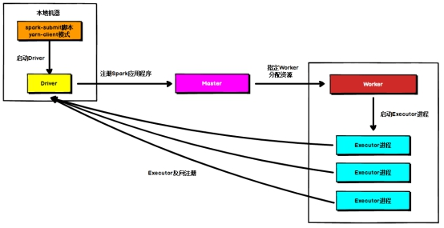
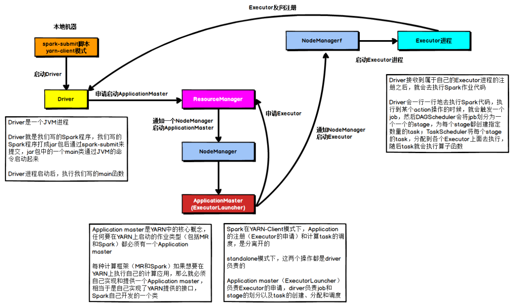

# Spark部署模式

- Spark支持3种集群管理器（Cluster Manager）
  - Standalone
    - 独立模式，Spark原生的简单集群管理器，自带完整的服务，可单独部署到一个集群中，无需依赖任何其他资源管理系统，使用Standalone可以很方便地搭建一个集群
  - Apache Mesos
    - 一个强大的分布式资源管理框架，它允许多种不同的框架部署在其上，包括yarn
  - Hadoop YARN
    - 统一的资源管理机制，在上面可以运行多套计算框架
      - 如map reduce、storm等
    - 根据driver在集群中的位置不同分为，ApplicationMaster进程所在的位置
      - yarn client
      - yarn cluster
- 除了上述这些通用的集群管理器外，Spark内部也提供了一些方便用户测试和学习的简单集群部署模式
- Spark的运行模式取决于传递给SparkContext的MASTER环境变量的值
- 个别模式还需要辅助的程序接口来配合使用

## 模式配置

| **Master URL**        | **Meaning**                                                  |
| --------------------- | ------------------------------------------------------------ |
| **local**             | 在本地运行，只有一个工作进程，无并行计算能力。               |
| **local[K]**          | 在本地运行，有K个工作进程，通常设置K为机器的CPU核心数量。    |
| **local[\*]**         | 在本地运行，工作进程数量等于机器的CPU核心数量。              |
| **spark://HOST:PORT** | 以Standalone模式运行，这是Spark自身提供的集群运行模式，默认端口号: 7077。详细文档见:Spark standalone cluster。 |
| **mesos://HOST:PORT** | 在Mesos集群上运行，Driver进程和Worker进程运行在Mesos集群上，部署模式必须使用固定值:--deploy-mode cluster。详细文档见:MesosClusterDispatcher. |
| **yarn-client**       | 在Yarn集群上运行，Driver进程在本地，Executor进程在Yarn集群上，部署模式必须使用固定值:--deploy-mode client。Yarn集群地址必须在HADOOP_CONF_DIR or YARN_CONF_DIR变量里定义。 |
| **yarn-cluster**      | 在Yarn集群上运行，Driver进程在Yarn集群上，Work进程也在Yarn集群上，部署模式必须使用固定值:--deploy-mode cluster。Yarn集群地址必须在HADOOP_CONF_DIR or YARN_CONF_DIR变量里定义。 |

- 用户在提交任务给Spark处理时，以下参数共同决定了Spark的运行方式
  - –master MASTER_URL
    - 决定了Spark任务提交给哪种集群处理
  - –deploy-mode DEPLOY_MODE
    - 决定了Driver的运行方式
    - 可选值为Client或者Cluster
- 注意：spark-shell不支持cluster，只支持client

## Standalone 模式运行机制

- spark的standalone出现的早
- Standalone集群有四个重要组成部分，分别是
  - Driver：是一个进程，我们编写的Spark应用程序就运行在Driver上，由Driver进程执行
  - Master(RM)：是一个进程，主要负责资源的调度和分配，并进行集群的监控等职责
  - Worker(NM)：是一个进程，一个Worker运行在集群中的一台服务器上，主要负责两个职责，一个是用自己的内存存储RDD的某个或某些partition；另一个是启动其他进程和线程（Executor），对RDD上的partition进行并行的处理和计算
  - Executor：是一个进程，一个Worker上可以运行多个Executor，Executor通过启动多个线程（task）来执行对RDD的partition进行并行计算，也就是执行我们对RDD定义的例如map、flatMap、reduce等算子操作

### Standalone Client 模式

- 没有container，因为standalone的work只有spark使用
- 注意：此图中CoarseGrainedExecutorBackend是进程，而Executor是CoarseGrainedExecutorBackend对象内的对象

- 在Standalone Client模式下，Driver在任务提交的本地机器上运行，ApplicationMaster启动后启动Driver线程并向Master注册应用程序，Master根据submit脚本的资源需求找到内部资源至少可以启动一个ExecutorBackend的所有Worker，然后在这些Worker之间分配ExecutorBackend，Worker上的ExecutorBackend启动后会创建Executor对象并向Driver反向注册，所有的Executor注册完成后，Driver开始执行main函数，之后执行到Action算子时，开始划分stage，每个stage生成对应的taskSet，之后将task分发到各个Executor上执行

### Standalone Cluster 模式

- 在Standalone Cluster模式下，任务提交后，Master会找到一个Worker启动ApplicationMaster进程，进程内部启动Driver线程， Driver启动后向Master注册应用程序，Master根据submit脚本的资源需求找到内部资源至少可以启动一个Executor的所有Worker，然后在这些Worker之间分配Executor，Worker上的ExecutorBackend启动后创建Executor对象，并向Driver反向注册，所有的Executor注册完成后，Driver开始执行main函数，之后执行到Action算子时，开始划分stage，每个stage生成对应的taskSet，之后将task分发到各个Executor上执行。
- ==注意，Standalone的两种模式下（client/Cluster），Master在接到Driver注册Spark应用程序的请求后，会获取其所管理的剩余资源能够启动一个Executor的所有Worker，然后在这些Worker之间分发Executor，此时的分发只考虑Worker上的资源是否足够使用，直到当前应用程序所需的所有Executor都分配完毕，Executor反向注册完毕后，Driver开始执行main程序==

## YARN模式运行机制

### Yarn Client模式

- 此处申请启动ApplicationMaster有问题
- 申请Executor更改为
  - 申请资源，返回可执行的NodeManager的Container（包含cpu，内存）
- nmClient通知NodeManger内Container启动ExecutorBackend进程，然后创建ExecutorBackend对象里面的Excutor对象

- 在YARN Client模式下，Driver在任务提交的本地机器上运行，Driver启动后会和ResourceManager通讯申请启动ApplicationMaster，随后ResourceManager分配container，在合适的NodeManager上启动ApplicationMaster，此时的ApplicationMaster的功能相当于一个ExecutorLaucher，只负责向ResourceManager申请Executor内存。
- ResourceManager接到ApplicationMaster的资源申请后会分配container，然后ApplicationMaster在资源分配指定的NodeManager上启动ExecutorBackend进程，并创建Executor对象，随后会向Driver反向注册，Executor全部注册完成后Driver开始执行main函数，之后执行到Action算子时，触发一个job，并根据宽依赖开始划分stage，每个stage生成对应的taskSet，之后将task分发到各个Executor上执行

### Yarn Cluster模式

- 在YARN Cluster模式下，任务提交后会和ResourceManager通讯申请启动ApplicationMaster，随后ResourceManager分配container，在合适的NodeManager上启动ApplicationMaster，此时在ApplicationMaster内部启动Driver线程。
- Driver启动后向ResourceManager申请Executor内存，ResourceManager接到ApplicationMaster的资源申请后会分配container，然后在合适的NodeManager上启动ExecutorBackend进程，并创建Executor对象，随后会向Driver反向注册，Executor全部注册完成后Driver开始执行main函数，之后执行到Action算子时，触发一个job，并根据宽依赖开始划分stage，每个stage生成对应的taskSet，之后将task分发到各个Executor上执行

