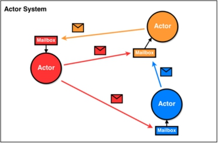
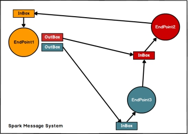
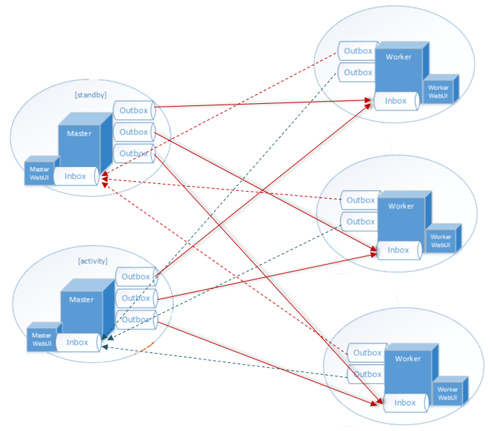

# 通信架构

- Linux支持EPOLL，是NIO，同步非阻塞IO
- Netty基于EPOLL，是NIO，而Windows支持AIO
- NIO比AIO的好处是在于耦合性低
  - Linux系统不需要知道目标客户端的地址去通知它

## 概述

- Spark2.x版本使用Netty通讯框架作为内部通讯组件
- spark 基于netty新的rpc框架借鉴了Akka中的设计，它是基于Actor模型

 

- Spark通讯框架中各个组件（Client/Master/Worker）可以认为是一个个独立的实体，各个实体之间通过消息来进行通信

 

- Endpoint（Client/Master/Worker）有
  - 1个InBox
  - N个OutBox（N>=1，N取决于当前Endpoint与多少其他的Endpoint进行通信，一个与其通讯的其他Endpoint对应一个OutBox）
- Endpoint接收到的消息被写入InBox
- 发送出去的消息写入OutBox并被发送到其他Endpoint的InBox中

## 解析

 

- RpcEndpoint：RPC终端，Spark针对每个节点（Client/Master/Worker）都称之为一个Rpc终端，且都实现RpcEndpoint接口，内部根据不同终端的需求，设计不同的消息和不同的业务处理，如果需要发送（询问）则调用Dispatcher；
- RpcEnv：RPC上下文环境，每个RPC终端运行时依赖的上下文环境称为RpcEnv；
- Dispatcher：消息分发器（调度器）
  - 针对于RPC终端需要发送消息或者从远程RPC接收到的消息，分发至对应的指令收件箱/发件箱。如果指令接收方是自己则存入收件箱，如果指令接收方不是自己，则放入发件箱；
- Inbox：指令消息收件箱，一个本地RpcEndpoint对应一个收件箱，Dispatcher在每次向Inbox存入消息时，都将对应EndpointData加入内部ReceiverQueue中，另外Dispatcher创建时会启动一个单独线程进行轮询ReceiverQueue，进行收件箱消息消费；
- RpcEndpointRef：RpcEndpointRef是对远程RpcEndpoint的一个引用。当我们需要向一个具体的RpcEndpoint发送消息时，一般我们需要获取到该RpcEndpoint的引用，然后通过该应用发送消息。（也就是地址）
- OutBox：指令消息发件箱，对于当前RpcEndpoint来说，一个目标RpcEndpoint对应一个发件箱，如果向多个目标RpcEndpoint发送信息，则有多个OutBox。当消息放入Outbox后，紧接着通过TransportClient将消息发送出去。消息放入发件箱以及发送过程是在**同一个线程中进行**；
- RpcAddress：表示远程的RpcEndpointRef的地址，Host + Port。
- TransportClient
  - Netty通信客户端，一个OutBox对应一个TransportClient，TransportClient不断轮询OutBox，根据OutBox消息的receiver信息，请求对应的远程TransportServer；
- TransportServer
  - Netty通信服务端，一个RpcEndpoint对应一个TransportServer，接受远程消息后调用Dispatcher分发消息至对应收发件箱

 