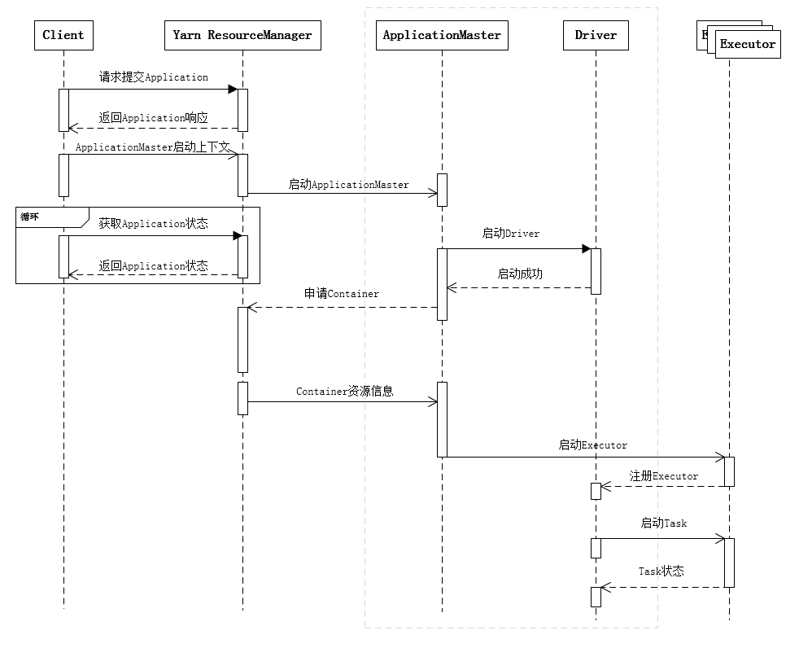
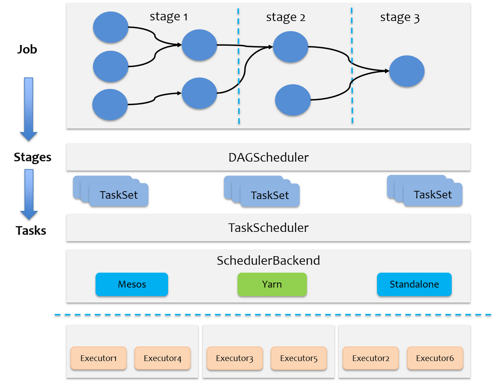
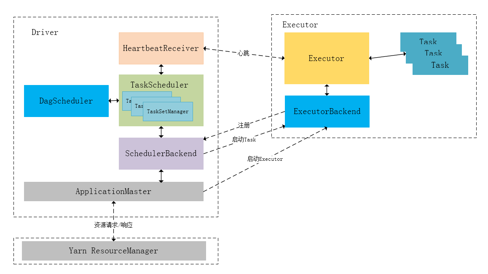
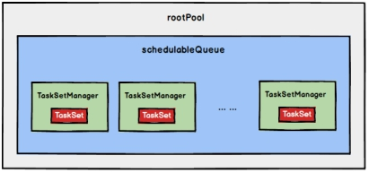
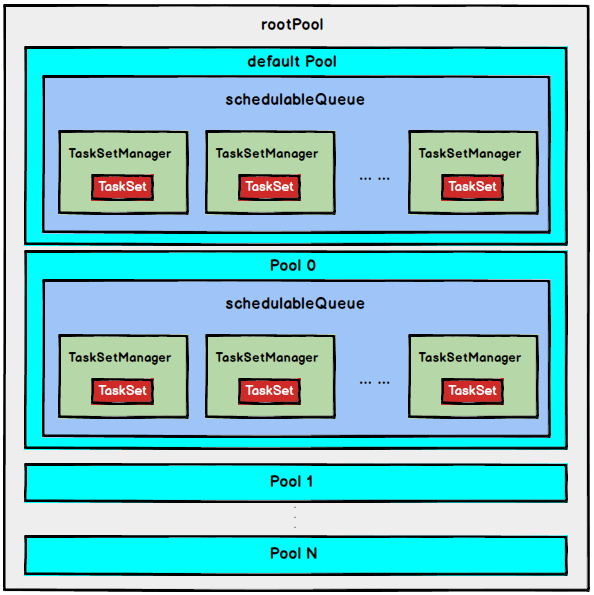

# Spark 任务调度机制

在生产环境下，Spark集群的部署方式一般为YARN-Cluster模式，之后的内核分析内容中默认集群的部署方式为YARN-Cluster模式


## 任务提交流程

在上一章中我们讲解了Spark YARN-Cluster模式下的任务提交流程，如下图所示

 

下面的时序图清晰地说明了一个Spark应用程序从提交到运行的完整流程

 

- 提交一个Spark应用程序，首先通过Client向ResourceManager请求启动一个Application，检查是否有足够的资源满足Application的需求，如果资源条件满足，则准备ApplicationMaster的启动上下文，交给ResourceManager，并循环监控Application状态
- 当提交的资源队列中有资源时，ResourceManager会在某个NodeManager上启动ApplicationMaster进程，ApplicationMaster会单独启动Driver后台线程
  - 当Driver启动后，ApplicationMaster会通过本地的RPC连接Driver，并开始向ResourceManager申请Container资源运行Executor进程（一个Executor对应与一个Container）
  - 当ResourceManager返回Container资源，ApplicationMaster则在对应的Container上启动Executor

- Driver线程主要是初始化SparkContext对象，准备运行所需的上下文
  - 保持与ApplicationMaster的RPC连接，通过ApplicationMaster申请资源
  - 根据用户业务逻辑开始调度任务，将任务下发到已有的空闲Executor上
- 当ResourceManager向ApplicationMaster返回Container资源时，ApplicationMaster就尝试在对应的Container上启动Executor进程，Executor进程起来后，会向Driver反向注册，注册成功后保持与Driver的心跳，同时等待Driver分发任务，当分发的任务执行完毕后，将任务状态上报给Driver
- 从上述时序图可知，Client只负责提交Application并监控Application的状
- 对于Spark的任务调度主要是集中在两个方面: **资源申请和任务分发**
  - 主要是通过ApplicationMaster、Driver以及Executor之间来完成


## 调度概述

当Driver起来后，Driver则会根据用户程序逻辑准备任务，并根据Executor资源情况逐步分发任务。在详细阐述任务调度前，首先说明下Spark里的几个概念。一个Spark应用程序包括Job、Stage以及Task三个概念

- Job是以Action方法为界，遇到一个Action方法则触发一个Job；
- Stage是Job的子集，以RDD宽依赖(即Shuffle)为界，遇到Shuffle做一次划分；
- Task是Stage的子集，以并行度(分区数)来衡量，分区数是多少，则有多少个task
- Spark的任务调度总体来说分两路进行，一路是Stage级的调度，一路是Task级的调度

 

- Spark RDD通过其Transactions操作，形成了RDD血缘关系图，即DAG，最后通过Action的调用，触发Job并调度执行
- **DAGScheduler负责Stage级的调度**
  - 主要是将job切分成若干Stages，并将每个Stage打包成TaskSet交给TaskScheduler调度
- **TaskScheduler负责Task级的调度**
  - 将DAGScheduler给过来的TaskSet按照指定的调度策略分发到Executor上执行
- SchedulerBackend负责提供可用资源，**SchedulerBackend有多种实现，分别对接不同的资源管理系统**

 

- 注意
  - Task的对象的传输通过序列化，在Driver上进行序列化之后，传递给ExecutorBackEnd，然后进行反序列化给Executor执行
  - 上图中Driver可以更改为SparkContext更合适
  - ApplicationMaster放在最外层
  - ExecutorBackEnd放在最外层
- 模块交互过程


- ==终端发送消息是发送给ExecutorBackend（是一个进程），而不是Executor（只是进程中的一个对象）==
- Driver初始化SparkContext过程中，会分别初始化DAGScheduler、TaskScheduler、SchedulerBackend以及HeartbeatReceiver，并启动SchedulerBackend以及HeartbeatReceiver。SchedulerBackend通过ApplicationMaster申请资源，并不断从TaskScheduler中拿到合适的Task分发到Executor执行。HeartbeatReceiver负责接收Executor的心跳信息，监控Executor的存活状况，并通知到TaskScheduler


## Stage 调度 [DAGScheduler]

- Spark的任务调度是从DAG切割开始，主要是由DAGScheduler来完成。当遇到一个Action操作后就会触发一个Job的计算，并交给DAGScheduler来提交，下图是涉及到Job提交的相关方法调用流程图

 

- Job由最终的RDD和Action方法封装而成，SparkContext将Job交给DAGScheduler提交，它会根据RDD的血缘关系构成的DAG进行切分，将一个Job划分为若干Stages，具体划分策略是，由最终的RDD不断通过依赖回溯判断父依赖是否是宽依赖，即以Shuffle为界，划分Stage，窄依赖的RDD之间被划分到同一个Stage中，可以进行pipeline式的计算
  - 如上图紫色流程部分，划分的Stages分两类
    - ResultStage，为DAG最下游的Stage，由Action方法决定
    - ShuffleMapStage，为下游Stage准备数据
- 下面看一个简单的例子WordCount

 

- Job由saveAsTextFile触发，该Job由RDD-3和saveAsTextFile方法组成，根据RDD之间的依赖关系从RDD-3开始回溯搜索，直到没有依赖的RDD-0，在回溯搜索过程中，RDD-3依赖RDD-2，并且是宽依赖，所以在RDD-2和RDD-3之间划分Stage，RDD-3被划到最后一个Stage，==即ResultStage（也叫FinalStage）中==，RDD-2依赖RDD-1，RDD-1依赖RDD-0，这些依赖都是窄依赖，所以将RDD-0、RDD-1和RDD-2划分到同一个Stage，==即ShuffleMapStage中==，实际执行的时候，数据记录会一气呵成地执行RDD-0到RDD-2的转化。不难看出，其本质上是一个深度优先搜索算法
- ==一个Stage是否被提交，需要判断它的父Stage是否执行，只有在父Stage执行完毕才能提交当前Stage，如果一个Stage没有父Stage，那么从该Stage开始提交==
- Stage提交时会将Task信息（分区信息以及方法等）==序列化==并被打包成TaskSet交给TaskScheduler，一个Partition对应一个Task，另一方面TaskScheduler会监控Stage的运行状态，只有Executor丢失或者Task由于Fetch失败才需要重新提交失败的Stage以调度运行失败的任务，其他类型的Task失败会在TaskScheduler的调度过程中重试

相对来说DAGScheduler做的事情较为简单，仅仅是在Stage层面上划分DAG，提交Stage并监控相关状态信息。TaskScheduler则相对较为复杂


## Task 调度 [TaskScheduler]

- Spark Task的调度是由TaskScheduler来完成，DAGScheduler将Stage打包到TaskSet交给TaskScheduler
- TaskScheduler将TaskSet封装为**TaskSetManager**加入到调度队列中

 

- TaskSetManager负责监控管理同一个Stage中的Tasks
- TaskScheduler就是以==TaskSetManager为单元==来调度任务
- TaskScheduler初始化后会启动SchedulerBackend
  - 负责跟外界打交道，接收Executor的注册信息
  - 维护Executor的状态
  - 定期询问TaskScheduler并获取TaskSetManager
  - 所以说SchedulerBackend是管“粮食”的，同时它在启动后会定期地去“询问”TaskScheduler有没有任务要运行，也就是说，它会定期地“问”TaskScheduler“我有这么余量，你要不要啊”，TaskScheduler在SchedulerBackend“问”它的时候，会从调度队列中按照指定的调度策略选择TaskSetManager去调度运行

 

- 将TaskSetManager加入rootPool调度池中之后，调用SchedulerBackend的reviveOffers方法给driverEndpoint发送ReviveOffer消息
- ==driverEndpoint收到ReviveOffer消息后调用makeOffers方法，过滤出活跃状态的Executor（这些Executor都是任务启动时反向注册到Driver的Executor），然后将Executor封装成WorkerOffer对象；准备好计算资源（WorkerOffer）后，taskScheduler基于这些资源调用resourceOffer在Executor上分配task==


### 调度策略

- TaskScheduler先把DAGScheduler给过来的TaskSet封装成TaskSetManager扔到任务队列里，然后再从任务队列里按照一定的规则把它们取出来在SchedulerBackend给过来的Executor上运行
  - 调度过程实际是比较粗粒度的，是面向TaskSetManager的
- TaskScheduler是以树的方式来管理任务队列，树中的节点类型为Schdulable，叶子节点为TaskSetManager，非叶子节点为Pool，下图是它们之间的继承关系

 

- TaskScheduler支持两种调度策略
  - FIFO，默认的调度策略
  - FAIR
- 在TaskScheduler初始化过程中会实例化rootPool，表示树的根节点，是Pool类型

```scala
// TaskSchedulerImpl.scala

def initialize(backend: SchedulerBackend) {
    this.backend = backend
    // temporarily set rootPool name to empty
    rootPool = new Pool("", schedulingMode, 0, 0)
    schedulableBuilder = {
        schedulingMode match {
            case SchedulingMode.FIFO =>
            new FIFOSchedulableBuilder(rootPool)
            case SchedulingMode.FAIR =>
            new FairSchedulableBuilder(rootPool, conf)
            case _ =>
            throw new IllegalArgumentException(s"Unsupported spark.scheduler.mode: $schedulingMode")
        }
    }
    schedulableBuilder.buildPools()
}
```


#### FIFO

- 采用FIFO调度策略，则直接简单地将TaskSetManager按照先来先到的方式入队，出队时直接拿出最先进队的TaskSetManager，其树结构如下图所示，TaskSetManager保存在一个FIFO队列中

 


#### FAIR

- FAIR调度策略的树结构如下图所示

 

- FAIR模式中有一个rootPool和多个子Pool，各个子Pool中存储着所有待分配的TaskSetMagager
- ==在FAIR模式中，需要先对子Pool进行排序，再对子Pool里面的TaskSetMagager进行排序，因为Pool和TaskSetMagager都继承了Schedulable特质，因此使用相同的排序算法==
- 排序过程的比较是基于 Fair-share 来比较的，每个要排序的对象包含三个属性
  - runningTasks值（正在运行的Task数）
  - minShare值
  - weight值
- 比较时会综合考量runningTasks值，minShare值以及weight值
- 注意，minShare、weight的值均在公平调度配置文件fairscheduler.xml中被指定，调度池在构建阶段会读取此文件的相关配置
  - 如果A对象的runningTasks大于它的minShare（阈值），B对象的runningTasks小于它的minShare，那么B排在A前面
    - **runningTasks比minShare小的先执行**
  - 如果A、B对象的runningTasks都小于它们的minShare，那么就比较runningTasks与minShare的比值（minShare使用率），谁小谁排前面
    - **minShare使用率低的先执行**
  - 如果A、B对象的runningTasks都大于它们的minShare，那么就比较runningTasks与weight的比值（**权重使用率**），谁小谁排前面
    - **权重使用率低的先执行**
  - 如果上述比较均相等，则比较名字
- ==整体上来说就是通过minShare和weight这两个参数控制比较过程，做到让minShare使用率和权重使用率少（实际运行task比例较少）的先运行==
- FAIR模式排序完成后，所有的TaskSetManager被放入一个ArrayBuffer里，之后依次被取出并发送给Executor执行
- 从调度队列中拿到TaskSetManager后，由于TaskSetManager封装了一个Stage的所有Task，并负责管理调度这些Task，那么接下来的工作就是TaskSetManager按照一定的规则一个个取出Task给TaskScheduler，TaskScheduler再交给SchedulerBackend去发到Executor上执行


### 本地化调度

- ==移动数据不如移动计算==
- DAGScheduler切割Job，划分Stage, 通过调用submitStage来提交一个Stage对应的tasks，submitStage会调用submitMissingTasks，submitMissingTasks 确定每个需要计算的 task 的preferredLocations（最优位置，即计算位于数据所在的节点）
- 通过调用getPreferrdeLocations()得到partition 的优先位置，由于一个partition对应一个task，此partition的优先位置就是task的优先位置，对于要提交到TaskScheduler的TaskSet中的每一个task，该task优先位置与其对应的partition对应的优先位置一致
- 从调度队列中拿到TaskSetManager后，那么接下来的工作就是TaskSetManager按照一定的规则一个个取出task给TaskScheduler，TaskScheduler再交给SchedulerBackend去发到Executor上执行。前面也提到，TaskSetManager封装了一个Stage的所有task，并负责管理调度这些task
- 根据每个task的优先位置，确定task的Locality级别，Locality一共有五种，优先级由高到低顺序

| **名称**                               | **解析**                                                     |
| -------------------------------------- | ------------------------------------------------------------ |
| PROCESS_LOCAL                          | 进程本地化，task和数据在同一个Executor中，性能最好。         |
| NODE_LOCAL（同一个节点有多个Executor） | 节点本地化，task和数据在同一个节点中，但是task和数据不在同一个Executor中，数据需要在进程间进行传输。==每一个ExecutorBackend只对应一个Executor，它是ExecutorBackend的一个属性== |
| RACK_LOCAL                             | 机架本地化，task和数据在同一个机架的两个节点上，数据需要通过网络在节点之间进行传输 |
| NO_PREF                                | 对于task来说，从哪里获取都一样，没有好坏之分，==数据不在当前的集群当中== |
| ANY                                    | task和数据可以在集群的任何地方，而且不在一个机架中，性能最差 |

- 在调度执行时，Spark调度总是会尽量让每个task以最高的本地性级别来启动，当一个task以X本地性级别启动，但是该本地性级别对应的所有节点都没有空闲资源而启动失败，此时**并不会**马上**降低本地性级别**启动而是在某个时间长度内再次以X本地性级别来启动该task，若超过限时时间则降级启动，去尝试下一个本地性级别，依次类推
- 可通过**调大**每个类别的**最大容忍延迟时间**，在等待阶段对应的Executor可能就会有相应的资源去执行此task，这就在在一定程度上提到了运行性能


### 失败重试

- 除了选择合适的Task调度运行外，还需要监控Task的执行状态，前面也提到，与外部打交道的是SchedulerBackend，Task被提交到Executor启动执行后，Executor会将执行状态上报给SchedulerBackend，SchedulerBackend则告诉TaskScheduler，TaskScheduler找到该Task对应的TaskSetManager，并通知到该TaskSetManager，这样TaskSetManager就知道Task的失败与成功状态
- ==对于失败的Task，会记录它失败的次数，如果失败次数还没有超过最大重试次数，那么就把它放回待调度的Task池子中，否则整个Application失败==


### 黑名单

- 在记录Task失败次数过程中，会记录它上一次失败所在的Executor Id和Host，这样下次再调度这个Task时，会使用黑名单机制，避免它被调度到上一次失败的节点上
- 节点宕机等情况导致失败或者超过最大重试次数就放到黑名单中
- 起到一定的容错作用
- 黑名单记录Task上一次失败所在的Executor Id和Host，以及其对应的“拉黑”时间，“拉黑”时间是指这段时间内不要再往这个节点上调度这个Task了