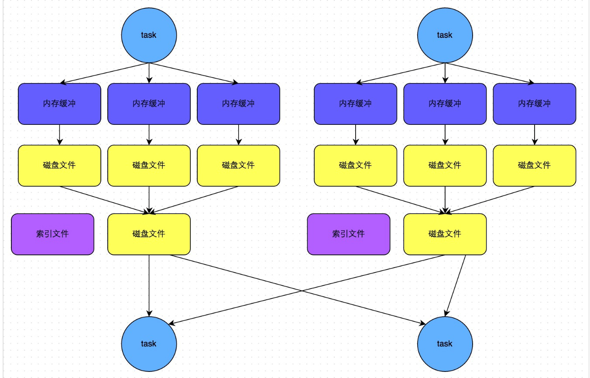

# ShuffleMapStage&ResultStage

 

- 在划分stage时，最后一个stage称为finalStage，它本质上是一个ResultStage对象，前面的所有stage被称为ShuffleMapStage。
- ==ShuffleMapStage（对应ShuffleMapTask）的结束伴随着shuffle文件的写磁盘==
  - Shuffle过程一定会写磁盘
- 两个阶段之间靠文件建立联系，前一个阶段写文件，后一个阶段读文件
  - 读写文件靠Task
- ResultStage（对应ResultTask）基本上对应代码中的action算子
  - 将一个函数应用在RDD的各个partition的数据集上，意味着一个job的运行结束


## 写文件解析

```scala
// DAGScheduler.scala
private def submitMissingTasks(stage: Stage, jobId: Int) {
    ...
    val tasks: Seq[Task[_]] = try {
        stage match {
            // 
            case stage: ShuffleMapStage =>
            partitionsToCompute.map { id =>
                val locs = taskIdToLocations(id)
                val part = stage.rdd.partitions(id)
                // ShuffleMapTask 写文件
                new ShuffleMapTask(stage.id, stage.latestInfo.attemptId,
                                   taskBinary, part, locs, stage.latestInfo.taskMetrics, properties, Option(jobId),Option(sc.applicationId), sc.applicationAttemptId)
            }

            // 
            case stage: ResultStage =>
            partitionsToCompute.map { id =>
                val p: Int = stage.partitions(id)
                val part = stage.rdd.partitions(p)
                val locs = taskIdToLocations(id)
                // 读文件
                new ResultTask(stage.id, stage.latestInfo.attemptId,
                               taskBinary, part, locs, id, properties, stage.latestInfo.taskMetrics,Option(jobId), Option(sc.applicationId), sc.applicationAttemptId)
            }
        }
    } catch {
        case NonFatal(e) =>
        abortStage(stage, s"Task creation failed: $e\n${Utils.exceptionString(e)}", Some(e))
        runningStages -= stage
        return
    }
...
}
```

- Executor执行读写Shuffle操作

```scala
// CoarseGrainedExecutorBackend.scala

override def receive: PartialFunction[Any, Unit] = {
...
    case LaunchTask(data) =>
    if (executor == null) {
        exitExecutor(1, "Received LaunchTask command but executor was null")
    } else {
        val taskDesc = ser.deserialize[TaskDescription](data.value)
        logInfo("Got assigned task " + taskDesc.taskId)
        // 启动Task --1
        executor.launchTask(this, taskId = taskDesc.taskId, attemptNumber = taskDesc.attemptNumber,
                            taskDesc.name, taskDesc.serializedTask)
    }
...
}
```

-  executor.launchTask

```scala
// Executor.scala
def launchTask(
    context: ExecutorBackend,
    taskId: Long,
    attemptNumber: Int,
    taskName: String,
    serializedTask: ByteBuffer): Unit = {
    val tr = new TaskRunner(context, taskId = taskId, attemptNumber = attemptNumber, taskName,serializedTask)
    runningTasks.put(taskId, tr)
    threadPool.execute(tr)
}

// TaskRunner run()
 val res = task.run(
            taskAttemptId = taskId,
            attemptNumber = attemptNumber,
            metricsSystem = env.metricsSystem)
// task : run
runTask(context)

// task --> ShuffleMapTask : runTask
var writer: ShuffleWriter[Any, Any] = null
writer.write(rdd.iterator(partition, context).asInstanceOf[Iterator[_ <:Product2[Any, Any]]])

// writer --> SortShuffleWriter : write
val output = shuffleBlockResolver.getDataFile(dep.shuffleId, mapId)
val tmp = Utils.tempFileWith(output)
shuffleBlockResolver.writeIndexFileAndCommit(dep.shuffleId, mapId, partitionLengths, tmp)

//shuffleBlockResolver --> IndexShuffleBlockResolver : writeIndexFileAndCommit
// 进行写文件，索引文件和数据文件
val indexFile = getIndexFile(shuffleId, mapId)
val indexTmp = Utils.tempFileWith(indexFile)
val dataFile = getDataFile(shuffleId, mapId)
System.arraycopy(existingLengths, 0, lengths, 0, lengths.length)
```


## 读文件解析

```scala
// ResultTask.scala
override def runTask(context: TaskContext): U = {
    ...
    func(context, rdd.iterator(partition, context))
}

// RDD.scala
final def iterator(split: Partition, context: TaskContext): Iterator[T] = {
    if (storageLevel != StorageLevel.NONE) {
        getOrCompute(split, context)
    } else {
        computeOrReadCheckpoint(split, context)
    }
}

// getOrCompute 
computeOrReadCheckpoint(partition, context)
-->	 compute(split, context)

// compute --> ShuffleRDD : compute
SparkEnv.get.shuffleManager.getReader(dep.shuffleHandle, split.index, split.index + 1, context).read().asInstanceOf[Iterator[(K, C)]]

// read --> BlockStoreShuffleReader : read
```


## Shuffle中任务个数设置

- Spark Shuffle分为map阶段和reduce阶段
  - 或者称之为ShuffleRead阶段和ShuffleWrite阶段，那么对于一次Shuffle，map过程和reduce过程都会由若干个task来执行
- 那么map task和reduce task的数量是如何确定的呢
  - 如果Spark任务从HDFS中读取数据，那么==初始RDD分区个数由该文件的split个数决定==
    - 一个split对应生成的RDD的一个partition，假设初始partition个数为N
    - 初始RDD经过一系列算子计算后
      - 如果没有执行repartition和coalesce算子进行重分区，则分区个数不变，仍为N
      - 如果经过重分区算子，那么分区个数变为M
    - 假设分区个数不变，当执行到Shuffle操作时，map端的task个数和partition个数一致
      - 即map task为N个
- reduce端的stage默认取==spark.default.parallelism==这个配置项的值作为分区数
  - 如果没有配置，则以map端的最后一个RDD的分区数作为其分区数（也就是N）
    - 分区数就决定了reduce端的task的个数
  - ==设置了默认并行度就按这个数量，没设置就按上一个RDD的分区数==


## reduce 端数据的读取

- 根据stage的划分我们知道，map端task和reduce端task不在相同的stage中，map task位于ShuffleMapStage，reduce task位于ResultStage，map task会先执行，那么后执行的reduce task如何知道从哪里去拉取map task落盘后的数据呢
- reduce端的数据拉取过程如下
  - map task 执行完毕后会将计算状态以及磁盘小文件位置等信息封装到MapStatus对象中，然后由本进程中的MapOutPutTrackerWorker对象将mapStatus对象发送给Driver进程的MapOutPutTrackerMaster对象
  - ==在reduce task开始执行之前会先让本进程中的MapOutputTrackerWorker向Driver进程中的MapoutPutTrakcerMaster发动请求，请求磁盘小文件位置信息==
  - ==当所有的Map task执行完毕后，Driver进程中的MapOutPutTrackerMaster就掌握了所有的磁盘小文件的位置信息==
    - 此时MapOutPutTrackerMaster会告诉MapOutPutTrackerWorker磁盘小文件的位置信息
  - 完成之前的操作之后，由BlockTransforService去Executor0所在的节点拉数据，默认会启动五个子线程。每次拉取的数据量不能超过48M（reduce task每次最多拉取48M数据，将拉来的数据存储到Executor内存的20%内存中）


# HashShuffle 解析

- 以下的讨论都假设每个Executor有1个CPU core

- 老版本使用HashShuffle，理解之后对SortShuffle解析的理解有好处

  

## 未优化的HashShuffleManager

- shuffle write阶段在一个stage结束计算之后，为了下一个stage可以执行shuffle类的算子（比如reduceByKey），而将每个task处理的数据按key进行“划分”
  - 对相同的key执行hash算法
- ==将相同key都写入同一个磁盘文件中，而每一个磁盘文件都只属于下游stage的一个task==
- 在将数据写入磁盘之前先将数据写入内存缓冲中，**当内存缓冲填满之后，才会溢写到磁盘文件中去**
- 下一个stage的task有多少个，当前stage的每个task就要创建多少份磁盘文件
  - 如下一个stage总共有100个task，那么当前stage的**每个task**都要创建100份磁盘文件
  - 如当前stage有50个task，总共有10个Executor，每个Executor执行5个task，那么每个Executor上总共就要创建5*100个磁盘文件，所有Executor上会创建5000个磁盘文件
  - 未经优化的shuffle write操作所产生的磁盘文件的数量是极其惊人的
- shuffle read阶段，通常就是一个stage刚开始时要做的事情，此时该stage的每一个task就需要将上一个stage的计算结果中的所有相同key，从各个节点上通过网络都拉取到自己所在的节点上，然后进行key的聚合或连接等操作。由于shuffle write的过程中，map task给下游stage的每个reduce task都创建了一个磁盘文件，因此shuffle read的过程中，每个reduce task只要从上游stage的所有map task所在节点上，拉取属于自己的那一个磁盘文件即可
- ==shuffle read的拉取过程是一边拉取一边进行聚合的==
  - 每个shuffle read task都会有一个自己的buffer缓冲，每次都只能拉取与buffer缓冲相同大小的数据，然后通过内存中的一个Map进行聚合等操作
  - 聚合完一批数据后，再拉取下一批数据，并放到buffer缓冲中进行聚合操作。以此类推，直到最后将所有数据到拉取完，并得到最终的结果

 


## 优化后的HashShuffleManager

- 为了优化HashShuffleManager可设置 spark.shuffle. consolidateFiles
  - 默认值为false
  - 设置为true即可开启优化机制
  - 建议开启这个选项
- 开启consolidate机制之后，在shuffle write过程中，task就不是为下游stage的每个task创建一个磁盘文件了
- shuffleFileGroup
  - 每个shuffleFileGroup会对应一批磁盘文件，磁盘文件的数量与下游stage的task数量是相同的
  - 一个Executor上有多少个CPU core，就可以并行执行多少个task
  - 第一批并行执行的每个task都会创建一个shuffleFileGroup，并将数据写入对应的磁盘文件内
  - 当Executor的CPU core执行完一批task，接着执行下一批task时，下一批task就会复用之前已有的shuffleFileGroup，包括其中的磁盘文件
    - task会将数据写入已有的磁盘文件中，而不会写入新的磁盘文件中
  - consolidate机制允许不同的task复用同一批磁盘文件，可有效将多个task的磁盘文件进行一定程度上的合并，大幅度减少磁盘文件的数量，提升shuffle write的性能
- 假设第二个stage有100个task，第一个stage有50个task，总共还是有10个Executor（Executor CPU个数为1），每个Executor执行5个task
  - 使用未经优化的HashShuffleManager时所有Executor会产生5000个磁盘文件
  - 使用优化后，每个Executor创建的磁盘文件的数量的计算公式为：CPU core的数量 * 下一个stage的task数量，也就是说，每个Executor此时只会创建100个磁盘文件，所有Executor只会创建1000个磁盘文件

 


# SortShuffle 解析 [ indexFile & dataFile ]

- 是HashShuffle的再优化，在输出不使用多个文件，而是一个dataFile和一个indexFile，提高IO传输效率
- SortShuffleManager的运行机制
  - 普通运行机制
    - ==会排序==
  - bypass运行机制
    - 不排序
    - 进行普通的HashShuffle
- 当shuffle read task的数量<=`spark.shuffle.sort.bypassMergeThreshold`参数值时启用bypass机制
  - 默认为200


## 普通运行机制，排序

- 数据会先写入一个内存数据结构中，此时根据不同的shuffle算子，可能选用不同的数据结构
  - reduceByKey
    - 这种聚合类的shuffle算子
    - 选用Map数据结构，一边通过Map进行聚合，一边写入内存
  - join
    - 这种普通的shuffle算子
    - 会选用Array数据结构，直接写入内存
- 接着每写一条数据进入内存数据结构之后，会判断是否达到了某个临界阈值
  - 如果达到临界阈值就会尝试将内存数据结构中的数据溢写到磁盘，然后清空内存数据结构
  - 在溢写到磁盘文件之前先根据key对内存数据结构中已有的数据进行排序
  - 排序过后会分批将数据写入磁盘文件
  - 默认的batch数量是1万条，排序好的数据会以每批1万条数据的形式分批写入磁盘文件
  - 写入磁盘文件是通过Java的BufferedOutputStream实现
    - BufferedOutputStream是Java的缓冲输出流，首先会将数据缓冲在内存中，当内存缓冲满溢之后再一次写入磁盘文件中，可减少磁盘IO次数，提升性能
  - 一个task将所有数据写入内存数据结构的过程中，会发生多次磁盘溢写操作，也就会产生多个临时文件
  - 最后会将之前所有的临时磁盘文件都进行合并，就是merge过程
    - 会将之前所有临时磁盘文件中的数据读取出来，然后依次写入最终的磁盘文件之中
    - 一个task就只对应一个磁盘文件，还会单独写一份==索引文件==，标识了下游各个task的数据在文件中的start offset与end offset
- SortShuffleManager由于有一个磁盘文件merge的过程，减少了文件数量
  - 如第一个stage有50个task，总共有10个Executor，每个Executor执行5个task
  - 第二个stage有100个task
  - 每个task最终只有一个磁盘文件，每个Executor上只有5个磁盘文件，所有Executor只有50个磁盘文件

 


## bypass运行机制，不排序

- 触发条件
  - shuffle map task数量小于`spark.shuffle.sort.bypassMergeThreshold`参数的值
    - 默认值200
  - 不是聚合类的shuffle算子
- ==每个task会为每个下游task都创建一个临时磁盘文件，根据key的hash值，将key写入对应的磁盘文件之中==
- 写入磁盘文件时也是先写入内存缓冲，缓冲写满之后再溢写到磁盘文件的
- 最后会将所有临时磁盘文件都合并成一个磁盘文件，并创建一个单独的索引文件
- 该过程的磁盘写机制其实跟未经优化的HashShuffleManager是一模一样的，因为都要创建数量惊人的磁盘文件，只是在最后会做一个磁盘文件的合并
  - 少量的最终磁盘文件让该机制相对未经优化的HashShuffleManager来说，shuffle read的性能会更好
- 与普通SortShuffleManager运行机制的不同在于
  - 磁盘写机制不同
  - 不会进行排序
- 好处
  - shuffle write过程中，不需要进行数据的排序操作，节省掉了这部分的性能开销


 