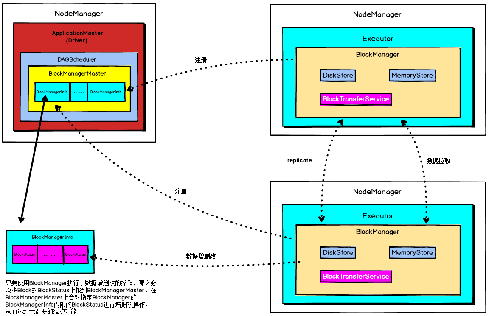
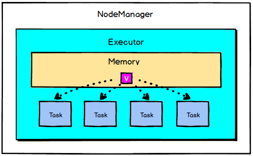
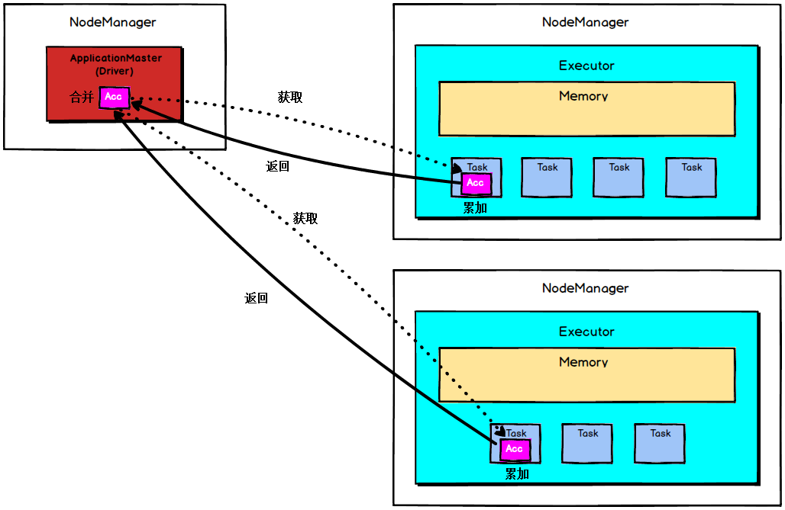

# Spark 核心组件解析

- spark三大核心数据结构
  - RDD
    - DataFrame
    - DataSet
  - 广播变量
    - 分布式只读变量
    - 在Executor只读
  - 累加器
    - 分布式只写变量
    - 在Driver读
    - 在Executor写

## BlockManager

- 底层数据交互变量
- BlockManager是整个Spark底层负责数据存储与管理的一个组件，**Driver**和**Executor**的所有数据都由对应的BlockManager进行管理
- Driver上有==BlockManagerMaster==，负责对各个节点上的BlockManager内部管理的数据的元数据进行维护，比如block的增删改等操作，都会在这里维护好元数据的变更
- 每个节点都有一个==BlockManager==，每个BlockManager创建之后，第一件事即使去向BlockManagerMaster进行注册，此时BlockManagerMaster会为其创建对应的BlockManagerInfo

 

- BlockManagerMaster与BlockManager的关系非常像NameNode与DataNode的关系，BlockManagerMaster中保存中BlockManager内部管理数据的元数据，进行维护，当BlockManager进行Block增删改等操作时，都会在BlockManagerMaster中进行元数据的变更，这与NameNode维护DataNode的元数据信息，DataNode中数据发生变化时NameNode中的元数据信息也会相应变化是一致的
- 每个节点上都有一个BlockManager
- BlockManager中有3个非常重要的组件
  - DiskStore：负责对磁盘数据进行读写
  - MemoryStore：负责对内存数据进行读写
  - BlockTransferService
    - 负责建立BlockManager到远程其他节点的BlockManager的连接
    - 负责对远程其他节点的BlockManager的数据进行读写
- 每个BlockManager创建之后，做的第一件事就是想BlockManagerMaster进行注册，此时BlockManagerMaster会为其创建对应的BlockManagerInfo
- 使用BlockManager进行写操作时，如RDD运行过程中的一些中间数据，或者手动指定了persist()，会优先将数据写入内存中，如果内存大小不够，会使用自己的算法，将内存中的部分数据写入磁盘
  - 此外如果persist()指定了要replica，那么会使用BlockTransferService将数据replicate一份到其他节点的BlockManager上去
- 使用BlockManager进行读操作时，比如shuffleRead操作，如果能从本地读取，就利用DiskStore或者MemoryStore从本地读取数据，但是本地没有数据的话，那么会用BlockTransferService与有数据的BlockManager建立连接，然后用BlockTransferService从远程BlockManager读取数据
  - 如shuffle Read操作中，很有可能要拉取的数据在本地没有，那么此时就会到远程有数据的节点上，找那个节点的BlockManager来拉取需要的数据
- 只要使用BlockManager执行了数据增删改的操作，那么必须将Block的BlockStatus上报到BlockManagerMaster，在BlockManagerMaster上会对指定BlockManager的BlockManagerInfo内部的BlockStatus进行增删改操作，从而达到元数据的维护功能

## 共享变量底层

- Spark一个非常重要的特性就是共享变量
- 默认情况下，如果在一个算子的函数中使用到了某个外部的变量，那么这个变量的值会被拷贝到每个task中，此时每个task只能操作自己的那份变量副本。如果多个task想要共享某个变量，那么这种方式是做不到的。
- Spark为此提供了两种共享变量
  - Broadcast Variable（广播变量）
    - 将用到的变量，仅仅为每个节点拷贝一份，即每个Executor拷贝一份，更大的用途是优化性能，减少网络传输以及内存损耗
    - Broadcast Variable是共享读变量，task不能去修改它，而Accumulator可以让多个task操作一个变量
  - Accumulator（累加变量）
    - 可让多个task共同操作一份变量，主要进行累加操作

### 广播变量

广播变量允许编程者在每个Executor上保留外部数据的只读变量，而不是给每个任务发送一个副本 

每个task都会保存一份它所使用的外部变量的副本，当一个Executor上的多个task都使用一个大型外部变量时，对于Executor内存的消耗是非常大的，因此，我们可以将大型外部变量封装为广播变量，此时一个Executor保存一个变量副本，此Executor上的所有task共用此变量，不再是一个task单独保存一个副本，这在一定程度上降低了Spark任务的内存占用

- Task使用外部变量

 

- 使用广播变量

 

- Spark还尝试使用高效的广播算法分发广播变量，以降低通信成本。
- Spark提供的Broadcast Variable是只读的，并且在每个Executor上只会有一个副本，而不会为每个task都拷贝一份副本，因此，它的最大作用，就是减少变量到各个节点的网络传输消耗，以及在各个节点上的内存消耗。此外，Spark内部也使用了高效的广播算法来减少网络消耗。
- 可通过调用SparkContext的broadcast()方法来针对每个变量创建广播变量。然后在算子的函数内，使用到广播变量时，每个Executor只会拷贝一份副本了，每个task可以使用广播变量的value()方法获取值
- 在任务运行时，Executor并不获取广播变量，当task执行到 使用广播变量的代码时，会向Executor的内存中请求广播变量，如下

 

- 之后Executor会通过BlockManager==向Driver拉取广播变量==，然后提供给task进行使用，如下

 

- 广播大变量是Spark中常用的基础优化方法，通过减少内存占用实现任务执行性能的提升

### 累加器

- 累加器（accumulator）
  - 仅仅被相关操作累加的变量，因此可以在并行中被有效地支持
  - 用于实现计数器（如MapReduce）或总和计数
- Accumulator是**存在于Driver端**的，集群上运行的task进行Accumulator的累加，随后把值发到Driver端，在Driver端汇总（Spark UI在SparkContext创建时被创建，即在Driver端被创建，因此它可以读取Accumulator的数值），由于Accumulator存在于Driver端，从节点读取不到Accumulator的数值
- Spark提供的Accumulator主要用于多个节点对一个变量进行共享性的操作
  - 只提供了累加的功能
  - 提供了多个task对于同一个变量并行操作的功能
  - task只能对Accumulator进行累加操作，不能读取它的值
  - Driver程序可以读取Accumulator的值

 