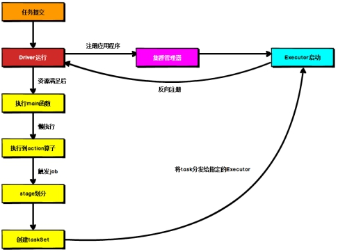

# 内核概述

- Spark内核泛指Spark的核心运行机制
  - Spark核心组件的运行机制
  - Spark任务调度机制
  - Spark内存管理机制
  - Spark核心功能的运行原理等


# 核心组件


## Driver

- ApplicationMaster内启动了一个名为Driver线程，执行含SparkContext代码的main方法

- Spark驱动器节点，用于执行Spark任务中的main方法，负责实际代码的执行工作

- Driver在Spark作业执行时主要负责

  - 将用户程序转化为作业 [job]

  - 在Executor之间调度任务 [task]

  - 跟踪Executor的执行情况

  - 通过UI展示查询运行情况

    

## Executor

- Spark Executor节点是一个JVM进程（executor是一个对象，用来做计算）
  - 是CoarseGrainedExecutorBackend对象内部含有Executor对象
    - Coarse Grained 粗粒度
  - CoarseGrainedExecutorBackend是一个进程，用于消息通信，不进行计算
  - Executor对象进行计算
- 负责在 Spark 作业中运行具体任务
  - 任务彼此之间相互独立
- Spark 应用启动时，Executor节点被同时启动，并且始终伴随着整个 Spark 应用的生命周期而存在
- 如有Executor节点发生了故障或崩溃，Spark 应用也可以继续执行，会将出错节点上的任务调度到其他Executor节点上继续运行
- Executor有两个核心功能
  - 负责运行组成Spark应用的任务，将结果返回给驱动器进程
  - 通过自身的块管理器（Block Manager）为用户程序中要求缓存的 RDD 提供内存式存储
    - RDD 是直接缓存在Executor进程内，任务可在运行时充分利用缓存数据加速运算
- Executor会向Driver发送心跳，维护关系
  - 10s一次
  - 如果Executor挂了，Driver会重新申请资源

```scala
// Executor.scala
private def startDriverHeartbeater(): Unit = {
    val intervalMs = conf.getTimeAsMs("spark.executor.heartbeatInterval", "10s")

    // Wait a random interval so the heartbeats don't end up in sync
    val initialDelay = intervalMs + (math.random * intervalMs).asInstanceOf[Int]

    val heartbeatTask = new Runnable() {
        override def run(): Unit = Utils.logUncaughtExceptions(reportHeartBeat())
    }
    heartbeater.scheduleAtFixedRate(heartbeatTask, initialDelay, intervalMs, TimeUnit.MILLISECONDS)
}
```


## Spark通用运行流程

- RM通知NM启动ApplicationMaster进程，然后再启动Driver线程

 

- 不论Spark以何种模式进行部署，任务提交后，都会先启动ApplicationMaster进程，再启动Driver线程，随后Driver进程向集群管理器注册应用程序，之后集群管理器根据此任务的配置文件分配Executor并启动
- 当Driver所需的资源全部满足后，Driver开始执行main函数，Spark查询为懒执行，当执行到action算子时开始反向推算，根据宽依赖进行stage的划分
  - 随后每一个stage对应一个taskset
  - taskset中有多个task
- 根据本地化原则，task会被分发到指定的Executor去执行
- 在任务执行的过程中，Executor也会不断与Driver进行通信，报告任务运行情况
