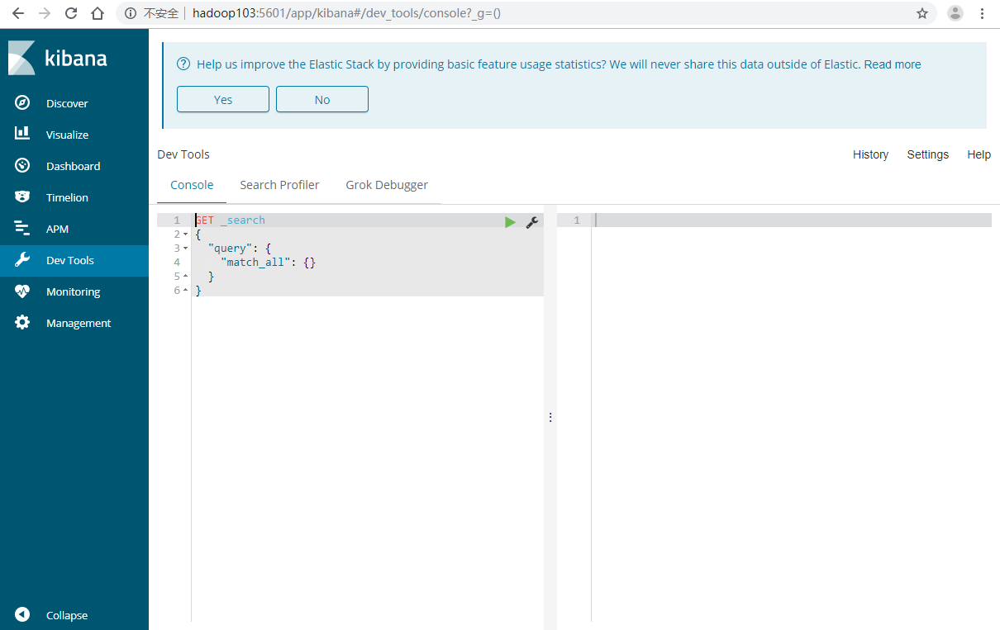

# 安装

- 下载地址：

  https://www.elastic.co/cn/downloads/kibana

- 解压

```bash
[ttshe@hadoop103 software]$ tar -zvxf kibana-6.3.1-linux-x86_64.tar.gz -C /opt/module/
[ttshe@hadoop103 module]$ mv kibana-6.3.1-linux-x86_64/ kibana/
```

- 修改配置

```bash
[ttshe@hadoop103 config]$ vim kibana.yml 
# 修改如下配置
server.port: 5601
server.host: "hadoop103" #默认localhost，只能本地访问
elasticsearch.url: "http://hadoop103:9200"
kibana.index: ".kibana"
```

- Server.host/server.port:访问的端口号和地址(地址设置后才能被外网访问)
- Elasticsearch.url:访问elasticserach的地址


# 启动

```bash
[ttshe@hadoop103 kibana]$ bin/kibana
# 使用nohup启动，将日志打印到nohup.out文件中
[ttshe@hadoop103 kibana]$ nohup bin/kibana &
```


# 关闭

- 查找kibana进程
- 使用node.js编写，查找node关键字或者/src/cli

```bash
[ttshe@hadoop102 kibana]$ ps -ef | grep /src/cli
           PID
ttshe      8338   2915  3 17:23 pts/1    00:00:16 bin/../node/bin/node --no-warnings bin/../src/cli
```

- kill 进程关闭


# 访问

http://hadoop103:5601




Discover:数据搜索查看

Visualize:图表制作

Dashboard:仪表盘制作

Timeline:时序数据的高级可视化分析

DevTools:开发者工具

Management:kibana相关配置

