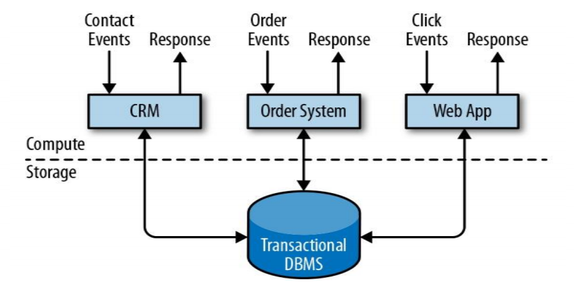
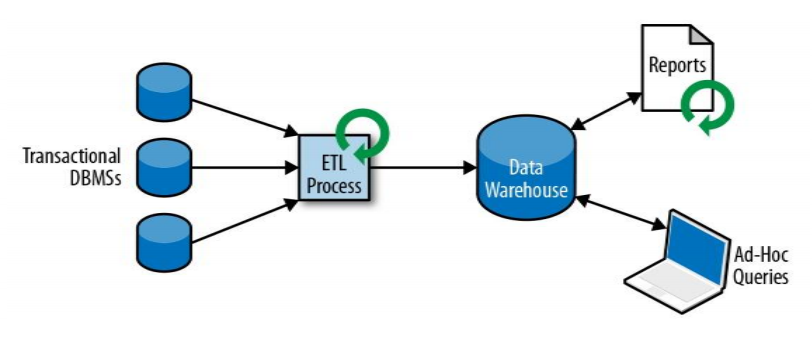
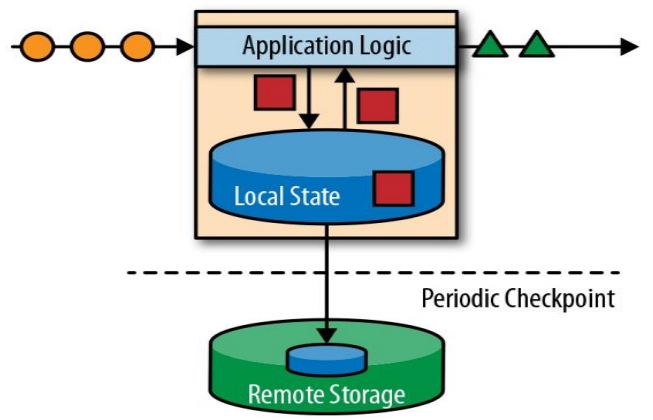
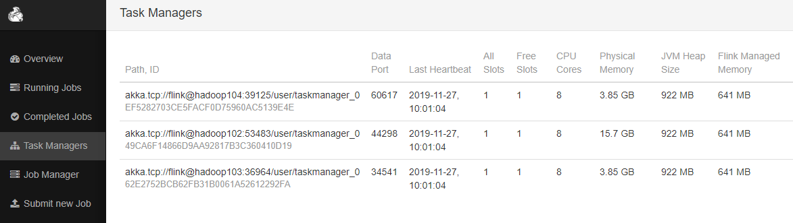
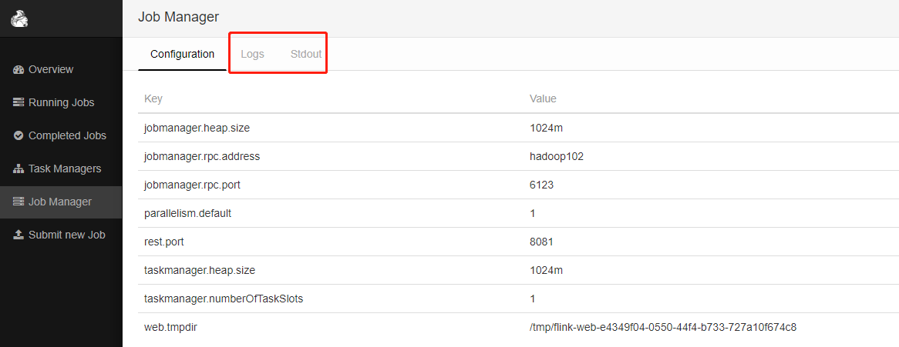
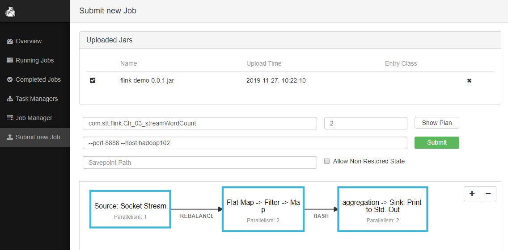
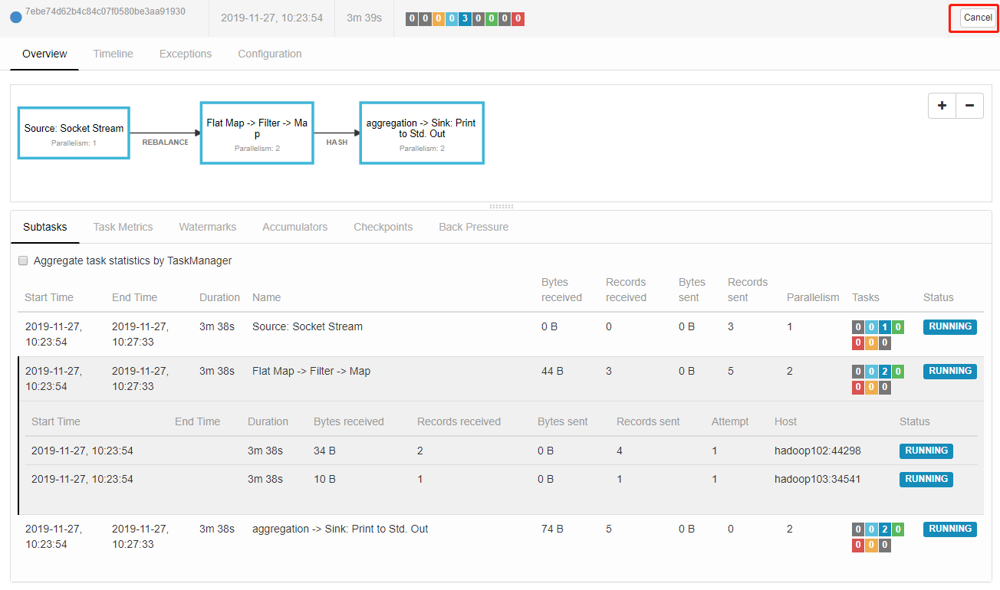

# 概述

- 官网
  - https://flink.apache.org/


- Flink 是什么

  - flink 德语，敏捷

  - apache顶级项目

  - 2014年

  - Apache Flink is a framework and distributed processing engine for stateful computations over unbounded and bounded data streams

  - Apache Flink 是一个==框架==和==分布式==处理引擎，用于对==无界和有界数据流==进行==状态==计算\

    

- 为什么要用 Flink

  - 流数据更真实地反映了我们的生活方式

  - 传统的数据架构是基于有限数据集的

  - 我们的目标

    - 低延迟

    - 高吞吐

    - 结果的准确性和良好的容错性

- flink 几大模块
  - Flink Table & SQL
  - Flink Gelly 图计算
  - Flink CEP 复杂事件处理


## 传统数据处理架构


### 事务处理

- OLTP




### 分析处理

- 将数据从业务数据库复制到数仓，再进行分析和查询
- Ad-Hoc 即席查询



### 有状态的流式处理



- 哪些行业需要处理流数据
  - 电商和市场营销
    - 数据报表、广告投放、业务流程需要
  - 物联网（IOT）
    - 传感器实时数据采集和显示、实时报警，交通运输业
  - 电信业
    - 基站流量调配
  - 银行和金融业
    - 实时结算和通知推送，实时检测异常行为


## 流处理的发展和演变

- 传统的流处理，牺牲了数据的准确性，保证了低延时
  - 分布式架构中，数据有先后到达与数据先后产生可能是不一致的
  - storm框架
    - 数据量不能太大，吞吐量高的时候处理不过来
    - 准确性不高，精确一次做不到，数据只处理一次
    - 勉强达到最少一次，可能会多次处理一个消息
    - 没有保障
- spark中，通过延时，积累一批数据进行处理
  - spark-streaming框架
    - 高吞吐，在压力下保持正确
    - 延时是秒级别的


### lambda架构

- 用2套架构，同时保证低延时和结果准确

- 2层系统同时处理，一层批处理，一层实时处理，最后获取2个结果进行合并修正
- 同样的系统使用了2套实现相同的业务逻辑
  - 开发代价大
- 实时结果显示不准确，最终结果准确
- 实现复杂


### 流处理的演变


## Flink 的主要特点

- 支持事件事件 event-time 和 支持处理时间 processing-time 语义
- 精确一次 exactly-once 的状态一致性保证
- 低延时，每秒处理数百万个时间，毫秒级延时
- 与常用存储系统的连接
- 高可用，动态扩展


### 事件驱动 Event-driven


### 基于流

- 在flink中，一切都是由流组成
- 有界流：离线数据
- 无界流：实时数据


### 分层API

- 分三层
  - SQL / Table API
    - dynamic tables
      - 表会动态的变化
    - 以表为中心的声明式编程
    -  表有二维数据结构 schema 类似于数据库中的表
    - 提供select project join group-by aggregate等操作
    - 可提供用户自定义UDF扩展
  - DataStream API 有界或无界流数据
    - Core API 核心API
    - stream windows
    - DataSet API 有界数据集
      - 循环
      - 迭代
    - 提供通用构建模块
      - 转换 transformations
      - 连接 join
      - 聚合 aggregation
      - 窗口操作 windows
  - ProcessFunction 底层过程函数
    - event state time
- 顶层抽象，含义简明，使用方便
- 底层具体，表述丰富，使用灵活

 


## Flink vs Spark Streaming

- spark 是批处理

- 流 stream 和 微批 micro-batching
  - 流可以看做是特殊的微批

 

### 数据模型

- spark采用RDD模型
- spark-streaming 的 DStream 也是一组小批量的RDD的集合
- flink基本数据模型是数据流，以及==事件 Event 序列==


### 运行时架构

- spark 是批计算，将DAG划分为不同的stage，一个计算完成后才可以计算下一个
- flink 是标准的流执行模式，一个事件在一个节点处理完成后可以直接发往下一个节点处理（类似storm）


# 入门示例


## pom

```xml
<?xml version="1.0" encoding="UTF-8"?>
<project xmlns="http://maven.apache.org/POM/4.0.0"
         xmlns:xsi="http://www.w3.org/2001/XMLSchema-instance"
         xsi:schemaLocation="http://maven.apache.org/POM/4.0.0 http://maven.apache.org/xsd/maven-4.0.0.xsd">
    <modelVersion>4.0.0</modelVersion>

    <groupId>com.stt.flink</groupId>
    <artifactId>flink-demo</artifactId>
    <version>1.0-SNAPSHOT</version>


    <dependencies>
        <dependency>
            <groupId>org.apache.flink</groupId>
            <artifactId>flink-scala_2.11</artifactId>
            <version>1.7.2</version>
        </dependency>
        <!-- https://mvnrepository.com/artifact/org.apache.flink/flink-streaming-scala -->
        <dependency>
            <groupId>org.apache.flink</groupId>
            <artifactId>flink-streaming-scala_2.11</artifactId>
            <version>1.7.2</version>
        </dependency>
    </dependencies>


    <build>
        <plugins>
            <!-- 该插件用于将Scala代码编译成class文件 -->
            <plugin>
                <groupId>net.alchim31.maven</groupId>
                <artifactId>scala-maven-plugin</artifactId>
                <version>3.4.6</version>
                <executions>
                    <execution>
                        <!-- 声明绑定到maven的compile阶段 -->
                        <goals>
                            <goal>testCompile</goal>
                        </goals>
                    </execution>
                </executions>
            </plugin>
            <plugin>
                <groupId>org.apache.maven.plugins</groupId>
                <artifactId>maven-assembly-plugin</artifactId>
                <version>3.0.0</version>
                <configuration>
                    <descriptorRefs>
                        <descriptorRef>jar-with-dependencies</descriptorRef>
                    </descriptorRefs>
                </configuration>
                <executions>
                    <execution>
                        <id>make-assembly</id>
                        <phase>package</phase>
                        <goals>
                            <goal>single</goal>
                        </goals>
                    </execution>
                </executions>
            </plugin>
        </plugins>
    </build>

</project>
```


## 批处理wordCount

- 在resources文件夹下创建01_wordCount.txt文件

```text
hello flink
hello flink
```

- 代码

```scala
package com.stt.flink

import org.apache.flink.api.scala.{AggregateDataSet, DataSet, ExecutionEnvironment}
import org.apache.flink.api.scala._
import org.apache.flink.core.fs.FileSystem.WriteMode // 隐式转换需要

// 批处理wordCount程序
object Ch_01_wordCount {
  def main(args: Array[String]): Unit = {
    // 创建运行环境
    val env = ExecutionEnvironment.getExecutionEnvironment

    // 从文件中读取数据
    val inputPath = this.getClass.getClassLoader.getResource("01_wordCount.txt").getPath

    val inputDS: DataSet[String] = env.readTextFile(inputPath)

    // 分词之后，对单词进行groupby 分组，然后用sum进行聚合
    val wordCountDS: DataSet[(String, Int)] = inputDS
      .flatMap(_.split("\\s+")) // 对每一行进行空格分隔
      .map((_, 1)) // 转换为元组
      .groupBy(0) // 对第一个元素进行分组
      .sum(1)

    // 打印输出
    wordCountDS.print()
    // 输出到本地
    wordCountDS.writeAsCsv("ss.csv",writeMode = WriteMode.OVERWRITE)
      .setParallelism(1)

    env.execute("ch01_wordCount")
  }
}
```

- 结果

```text
(flink,2)
(hello,2)
```


## 流处理wordCount

- 启动netcat服务
  - nc是netcat的简写
  - l 启动一个server listen一个端口，默认一个连接
    - k 表示这个socket保持被多个连接打开

```bash
[ttshe@hadoop102 module]$ sudo yum install -y nc
hello flink
flink
hello
```

- 代码
  - 运行时注意添加--host和--port参数

```scala
package com.stt.flink

import org.apache.flink.api.java.utils.ParameterTool
import org.apache.flink.api.scala._
import org.apache.flink.streaming.api.scala.{DataStream, StreamExecutionEnvironment} // 隐式转换需要

// 流处理wordCount程序 含有入参
object Ch_03_streamWordCount {
  def main(args: Array[String]): Unit = {

    val tool: ParameterTool = ParameterTool.fromArgs(args)
    // 从参数--host 和 --port 中获取
    val (host,port) = (tool.get("host") , tool.getInt("port"))

    // 创建流式处理的执行环境
    val env: StreamExecutionEnvironment = StreamExecutionEnvironment.getExecutionEnvironment

    // 接收一个socket文本流
    val socketDataStream: DataStream[String] = env.socketTextStream(host,port)

    // 对每条数据进行处理
    val wordCountDataStream: DataStream[(String, Int)] = socketDataStream
      .flatMap(_.split("\\s+"))
      .filter(_.nonEmpty)
      .map((_, 1))
      .keyBy(0) // DataSet 有groupBy操作，在DataStream中有keyBy操作相似的效果
      .sum(1)

    wordCountDataStream.print()

    // 启动executor
    env.execute()
  }
}
```

- 结果
  - 结果中有编号
    - 表示taskSlot的索引
    - 并行度，默认依赖于cpu核数

```text
4> (hello,1)
10> (flink,1)
10> (flink,2)
4> (hello,2)
```


## 注意

- 输出到本地方法writeAsText可用使用，但是writeAsCsv不行，可能是版本bug


# 安装


## Standalone 模式

- 这里使用的版本没有包含hadoop相关组件

- 解压

```bash
[ttshe@hadoop102 software]$ tar -zvxf flink-1.7.2-bin-scala_2.11.tgz -C /opt/module/
[ttshe@hadoop102 module]$ mv flink-1.7.2/ flink/
```


### flink-conf.yaml

- 修改flink/conf/flink-conf.yaml

```yml
# 配置jobmanager地址
jobmanager.rpc.address: hadoop102
jobmanager.rpc.port: 6123
# jobmanager的堆大小
jobmanager.heap.size: 1024m
# taskmanager的堆大小
taskmanager.heap.size: 1024m
# 每个taskManager划分slot的个数，默认值是1
taskmanager.numberOfTaskSlots: 1
# 并行度，默认值1，每个任务可以使用多个并行度，开启多个线程在slot中运行
parallelism.default: 1

# web UI访问地址
rest.port: 8081
```


### slaves

- 配置taskManager的hostname

```text
hadoop102
hadoop103
hadoop104
```

- 分发给其他机器

```bash
[ttshe@hadoop102 module]$ xsync flink/
```


### 启动

```bash
[ttshe@hadoop102 flink]$ bin/start-cluster.sh 
Starting cluster.
Starting standalonesession daemon on host hadoop102.
Starting taskexecutor daemon on host hadoop102.
Starting taskexecutor daemon on host hadoop103.
Starting taskexecutor daemon on host hadoop104.

[ttshe@hadoop102 flink]$ xcall.sh jps
--------- hadoop102 ----------
38404 StandaloneSessionClusterEntrypoint
38921 TaskManagerRunner
--------- hadoop103 ----------
25723 TaskManagerRunner
--------- hadoop104 ----------
27759 TaskManagerRunner
```


### 访问

- http://hadoop102:8081/#/overview


- 查看taskManager



- 查看jobManager
  - 在logs 查看日志
  - 在stdout查看输出运行的结果信息




### 提交任务

- 对代码进行打包flink-demo-0.0.1.jar
  - 该jar包不包含其他依赖的jar包
- 将jar进行上传，填写相应的参数



- 点击提交
  - 如果要取消操作job的执行，点击cancel



- 在hadoop102的8888端口上发送数据
- 在某个taskManager中查询得到结果
  - 说明每个任务的执行，最终不会汇聚到jobManager中，而是在各自的taskManager中输出


### 注意

- 关于并行度和slot的关系
  - 集群是3台机器，默认配置1个slot，总共3个slot
  - 启动的job配置的是4个并行度，缺少一个可用的slot，造成了任务的等待
    - 最终job取消，状态failed
  - 并行度最大值不能超过可用slot的值
  - 如果资源slot不够，即使有新的任务，并行度是1，也会失败


## Yarn 模式

以 Yarn 模式部署 Flink 任务时，要求 Flink 是有 Hadoop 支持的版本，Hadoop 环境需要保证版本在 2.2 以上，并且集群中安装有 HDFS 服务

- 启动hadoop集群
- 启动yarn-session
  - -n(--container)：TaskManager 的数量
  - -s(--slots)： 每个 TaskManager 的 slot 数量，默认一个 slot 一个 core，默认每个taskmanager 的 slot 的个数为 1，有时可以多一些 taskmanager，做冗余
  - -jm：JobManager 的内存（单位 MB)
  - -tm：每个 taskmanager 的内存（单位 MB)
  - -nm：yarn 的 appName(现在 yarn 的 ui 上的名字)
  - -d：后台执行

```bash
./yarn-session.sh -n 2 -s 2 -jm 1024 -tm 1024 -nm test -d
```

- 执行命令
  - 需要指定-m 是yarn-cluster

```bash
./flink run -m yarn-cluster -c com.stt.flink.app.BatchWcApp 
/ext/flink0503-1.0-SNAPSHOT.jar --input /applog/flink/input.txt --output 
/applog/flink/output5.csv
```

- 去 yarn 控制台查看任务状态


## Kubernetes 部署

容器化部署时目前业界很流行的一项技术，基于 Docker 镜像运行能够让用户更加方便地对应用进 行管 理 和运 维。 容器管理工具中最为流行 的就 是 Kubernetes  而 Flink 也在最近的版本中支持了 k8s 部署模式

- 搭建Kubernetes集群

- 配置各个组件的yaml文件

在 k8s 上构建 Flink Session Cluster，需要将 Flink 集群的组件对应的 docker 镜像分别在 k8s 上启动，包括 JobManager、TaskManager、JobManagerService 三个镜像服务。每个镜像服务都可以从中央镜像仓库中获取

- 启动flink-session cluster

```bash
// 启动 jobmanager-service 服务
kubectl create -f jobmanager-service.yaml
// 启动 jobmanager-deployment 服务
kubectl create -f jobmanager-deployment.yaml
// 启动 taskmanager-deployment 服务
kubectl create -f taskmanager-deployment.yaml
```

- 访问flink ui页面

集群启动后，就可以通过 JobManagerServicers 中配置的 WebUI 端口，用浏览器输入以下 url 来访问 Flink UI 页面

```http
http://{JobManagerHost:Port}/api/v1/namespaces/default/services/flink-jobmanager:ui/proxy
```


# 命令操作


## 提交job

- 注意
  - -c在前面，然后是jar包地址
  - 如果上传jar包之后不需要再写jar包的本地路径，直接使用-c指定main函数
  - -p表示并行度

```bash
[ttshe@hadoop102 flink]$ bin/flink run -c com.stt.flink.Ch_03_streamWordCount ./flink-demo-0.0.2.jar --port 8888 --host hadoop102 -p 2 
Starting execution of program
```


## 查看job列表

```bash
[ttshe@hadoop102 flink]$ bin/flink list
Waiting for response...
------------------ Running/Restarting Jobs -------------------
27.11.2019 15:09:31 : a08e5ededb0fb56d8aa87d8611ee267b : Flink Streaming Job (RUNNING)
--------------------------------------------------------------
No scheduled jobs.
```


## 取消job

- 得到指定的jobId，取消该job执行

```bash
[ttshe@hadoop102 flink]$ bin/flink cancel a08e5ededb0fb56d8aa87d8611ee267b
Cancelling job a08e5ededb0fb56d8aa87d8611ee267b.
Cancelled job a08e5ededb0fb56d8aa87d8611ee267b.
```

- 查看所有job
  - 包括取消的job

```bash
[ttshe@hadoop102 flink]$ bin/flink list -all
Waiting for response...
No running jobs.
No scheduled jobs.
---------------------- Terminated Jobs -----------------------
27.11.2019 15:09:31 : a08e5ededb0fb56d8aa87d8611ee267b : Flink Streaming Job (CANCELED)
--------------------------------------------------------------
```


## 关闭集群

```bash
[ttshe@hadoop102 flink]$ bin/stop-cluster.sh 
Stopping taskexecutor daemon (pid: 38921) on host hadoop102.
Stopping taskexecutor daemon (pid: 25723) on host hadoop103.
Stopping taskexecutor daemon (pid: 27759) on host hadoop104.
Stopping standalonesession daemon (pid: 38404) on host hadoop102.
```


