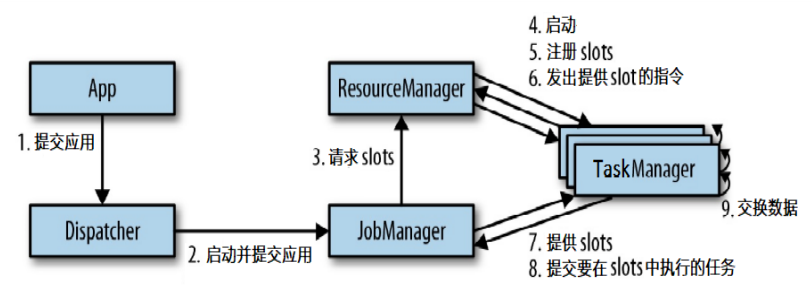
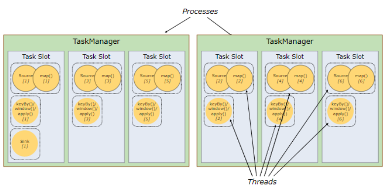
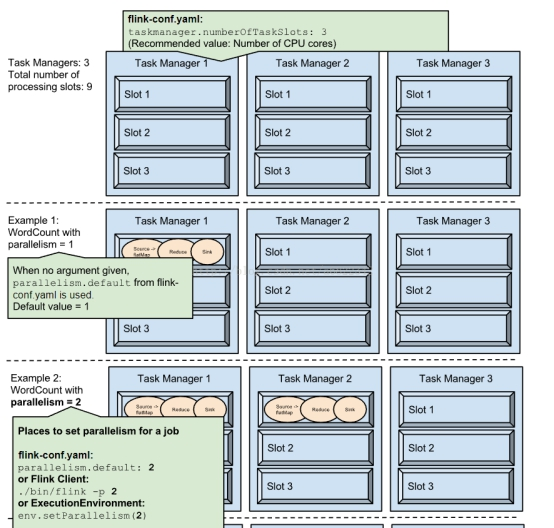
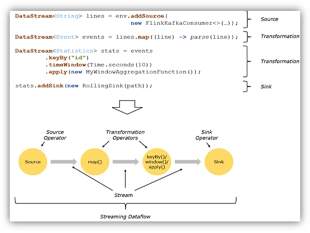

# 运行时组件

 


## client 客户端


## JobManager

- 控制一个应用程序执行的主进程
- 每个应用程序都会被一个不同的 JobManager 所控制执行
- JobManager 会先接收到要执行的应用程序，包含
  - 作业图 JobGraph
  - 逻辑数据流图 logical dataflow graph
  - 打包了所有的类、库和其它资源的 JAR 包
- JobManager把 JobGraph 转换成一个物理层面的数据流图
  - 执行图 ExecutionGraph
  - 包含所有可以并发执行的任务
- JobManager 会向资源管理器（ResourceManager）请求执行任务必要的资源：
  - 任务管理器（TaskManager）上的插槽（slot）
- JobManager 获取到了足够的资源，就会将执行图分发到真正运行它们的TaskManager 上
- 在运行过程中，JobManager 会负责所有需要中央协调的操作
  - 如检查点（checkpoints）的协调


## TaskManager

- Flink 中的工作进程
- 在 Flink 中会有多个 TaskManager 运行
- 每一个 TaskManager都包含了一定数量的插槽（slots）
  - 插槽的数量限制了 TaskManager 能够执行的任务数量

- 启动之后，TaskManager 会向资源管理器注册它的插槽
- TaskManager 收到资源管理器的指令后， 会将一个或者多个插槽提供给 JobManager 调用
  - JobManager 向插槽分配任务（tasks）来执行
  - 在执行过程中，一个 TaskManager 可以跟其它运行同一应用程序的 TaskManager 交换数据


## ResourceManager

- 主要负责管理任务管理器（TaskManager）的插槽（slot）
- TaskManger 插槽是 Flink 中定义的处理资源单元
- Flink 为不同的环境和资源管理工具提供了不同资源管理器
  - 如 YARN、Mesos、K8s，以及 standalone 部署
- 当 JobManager 申请插槽资源时，ResourceManager 会将有空闲插槽的 TaskManager 分配给JobManager
- 如果 ResourceManager 没有足够的插槽 来满足 JobManager 的请求，它还可向资源提供平台发起会话，以提供启动 TaskManager 进程的容器
- ResourceManager 负责终止空闲的 TaskManager 释放计算资源


## Dispatcher

- 可跨作业运行，它为应用提交提供了 REST 接口
- 当一个应用被提交执行时，分发器就会启动并将应用移交给一个 JobManager
- 由于是 REST 接口，所以 Dispatcher 可以作为集群的一个 HTTP 接入点，这样就能够不受防火墙阻挡
- Dispatcher 也会启动一个 Web UI，用来方便地展示和监控作业执行的信息
- Dispatcher 在架构中可能并不是必需的，这取决于应用提交运行的方式


# 任务提交流程


## standalone

 


## yarn


# 任务调度原理


- 代码优化生成Dataflow graph
- 由client通过akka通信将程序提供给jobManager
- 任务的状态，心跳，统计信息会返回到jobManager中


- 客户端
  - 不是运行时和程序执行的一部分
  - 用于准备并发送dataflow(JobGraph)给Master(JobManager)，然后，客户端断开连接或者维持连接以等待接收计算结果

- 当 Flink 集群启动后，首先会启动一个 JobManger 和一个或多个的 TaskManager
- 由 Client 提交任务给 JobManager，JobManager 再调度任务到各个 TaskManager 去执行，然后 TaskManager 将心跳和统计信息汇报给 JobManager
- TaskManager 之间以流的形式进行数据的传输
- 上述三者均为独立的 JVM 进程


- **Client** 为提交 Job 的客户端
  - 是运行在任何机器上
    - 与 JobManager 环境连通即可
  - 提交 Job 后，Client 可以结束进程（Streaming的任务）也可不结束并等待结果返回

- **JobManager** 
  - 主要负责调度 Job 并协调 Task 做 checkpoint，职责上很像 Storm 的 Nimbus
  - 从 Client 处接收到 Job 和 JAR 包等资源后，会生成优化后的执行计划，并以 Task 的单元调度到各个 TaskManager 去执行

- **TaskManager** 在启动的时候就设置好了槽位数（Slot）
  - 每个 slot 能启动一个 Task，Task 为线程
  - 从 JobManager 处接收需要部署的 Task，部署启动后，与自己的上游建立 Netty 连接，接收数据并处理


## TaskManager 与 Slots

- TaskManager 是一个 **JVM** **进程**，在**独立的线程**上执行一个或多个 subtask
- 一个TaskManager 至少有一个task slot
- slot
  - 推荐使用cpu核数的倍数进行划分
  - 只划分内存，对内存进行隔离
  - 每个slot内的subtask不需要同其他slot的subTask进行内存资源的竞争
  - 每个slot可以运行同一个job的不同subTask，但是不能运行不同job的不同subTask
    - 一旦slot被使用，就不能分配给其他job
  - 每一个subTask由一个线程执行
  - 极端情况：一个slot运行该job的所有task
  
- 一个job的最大并行度不能超过==当前可用slot总数==，否则执行失败


- slot共享
  - 一个job内的所有task，取得并行度最高的，分配slot，其余的task可共享分配的slot
  - 如下图6个并行度，每个slot都被不同的算子公用



- 示例
  - 9个slot，执行wordCount
  - 案例1：并行度1，所有算子在一个slot中执行（默认并行度）
  - 案例2：并行度2，所有算子分配到2个slot上执行，未指定sink的个数，同并行度2
  - 案例3：并行度9，则所有算子占满9个slot
  - 案例4：并行度9，设置sink的并行度是1，那么除了sink的算子占满9个slot，1个sink和其中一个slot共享

  


## 程序与数据流

 

- Flink程序由三部分组成
  - Source
    - 负责读取数据源
  - Transformation
    - 利用各种算子进行处理加工
  - Sink
    - 负责输出


- Flink上运行的程序会被映射成streaming dataflows 包含三部分
  - 每一个dataflow以一个或多个sources开始以一个或多个sinks结束
  - dataflow类似于任意的有向无环图（DAG）
  - 特定形式的环可以通过iteration构建
  - 大部分情况下，程序中的transformations跟dataflow中的operator是一一对应的关系
  - 有时一个transformation可能对应多个operator

 


## 执行图概念

- 由 Flink 程序直接映射成的数据流图是 StreamGraph，也被称为逻辑流图
- 因为它们表示的是计算逻辑的高级视图
- 为了执行一个流处理程序，Flink 需要将逻辑流图转换为物理数据流图（也叫执行图），详细说明程序的执行方式

- Flink 中的执行图可以分成四层：StreamGraph -> JobGraph -> ExecutionGraph ->  物理执行图


### StreamGraph

- 是根据用户通过 Stream API 编写的代码生成的最初的图
- 用来表示程序的拓扑结构
- client客户端提交时对代码进行优化生成jobGraph


### JobGraph

- StreamGraph 经过优化后生成了 JobGraph，提交给 JobManager 的数据结构

- 主要优化将多个符合条件的节点 chain 在一起作为一个节点

  - 可减少数据在节点之间流动所需要的序列化/反序列化/传输消耗

  

### ExecutionGraph

- JobManager 根据 JobGraph 生成 ExecutionGraph
- 是 JobGraph 的并行化版本，是调度层==最核心的数据结构==


### 物理执行图

- JobManager 根据 ExecutionGraph 对 Job 进行调度后，在各个TaskManager 上部署 Task 后形成的“图”，并不是一个具体的数据结构
- 分为3个部分
  - Client生成的图：StreamGraph-->JobGraph
  - JobManager上生成的图：ExecutionGraph
  - TaskManager上运行的图：物理执行图


## 并行度 Parallelism


- 一个特定算子的子任务 subtask 的个数被称之为其并行度parallelism
- 一般情况下，一个流程序的并行度，可认为就是其所有算子中最大的并行度
- 一个程序中，不同的算子可能具有不同的并行度

- 下例是并行度与subTask的关系示意图


- Stream 在算子之间传输数据的形式
  - one-to-one(forwarding)的模式（转发模式）
  - redistributing 的模式（重新分配模式）
  - 具体是哪一种形式，取决于算子的种类


### One-to-one 关系

- stream维护着分区以及元素的顺序

  - 如在 source 和 map 算子之间

- 意味着 map 算子的子任务看到的元素的个数以及顺序跟 source 算子的子任务生产的元素的个数、顺序相同

- map、fliter、flatMap 等算子都是 one-to-one 的对应关系

- 类似于 spark 中的窄 窄赖 依赖

  

### Redistributing 关系

- stream的==分区会发生改变==
  - map()跟 keyBy/window 之间或者 keyBy/window 跟 sink之间
- 每一个算子的子任务依据选择的 transformation 发送数据到不同的目标任务
  - 如
    - keyBy基于hashCode 重分区
    - broadcast，rebalance会随机重新分区
    - 这些算子都会引起 redistribute 过程，而redistribute 过程就类似于Spark 中的 shuffle 过程
- 类似于 spark 中的 宽依赖


## 任务链 Operator Chains


- Flink 如下情况同时满足的算子连接在一起形成一个 task
  - 算子之间相连
  - 相同并行度
  - one to one 操作
- 将算子链接成 task 是非常有效的优化
  - 减少线程之间的切换和基于缓存区的数据交换
  - 在减少时延的同时提升吞吐量


### API操作

链接的行为可在编程 API 中进行指定

- 初始情况：并行度都是1的情况下，除了聚合keyBy操作需要shuffle，其他阶段都合并在一起

 

```scala
// 创建流式处理的执行环境
val env: StreamExecutionEnvironment = StreamExecutionEnvironment.getExecutionEnvironment
// 全局不进行任务链优化
env.disableOperatorChaining()
```
- 不进行优化，同时并行度都是1的情况下，没有合并，会将任务完全拆开
 

- 局部不进行任务链优化

```scala
val wordCountDataStream: DataStream[(String, Int)] = socketDataStream
.flatMap(_.split("\\s+"))
.filter(_.nonEmpty).disableChaining() // 在filter阶段不进行任务链优化
.map((_, 1))
.keyBy(0) 
.sum(1)
```

 

- 定制化任务链优化，将filter和map进行合并一个任务链

```scala
val wordCountDataStream: DataStream[(String, Int)] = socketDataStream
.flatMap(_.split("\\s+")) 
.filter(_.nonEmpty).startNewChain() // 在filter阶段进行新的任务链优化
.map((_, 1))
.keyBy(0)
.sum(1)
```

 

