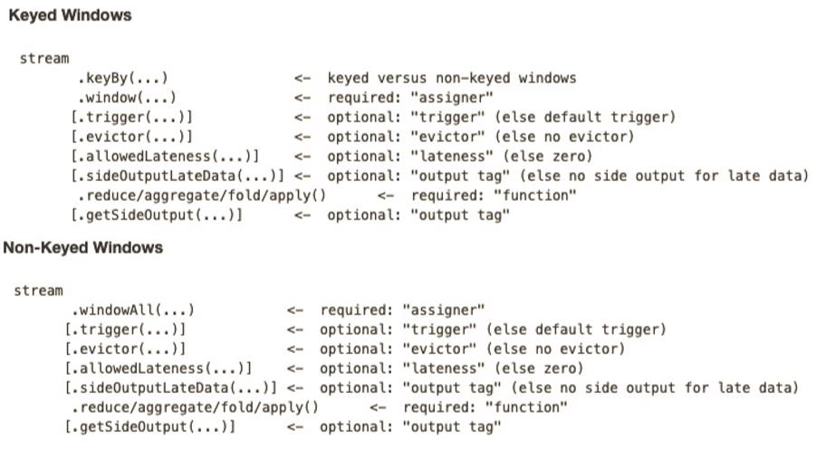
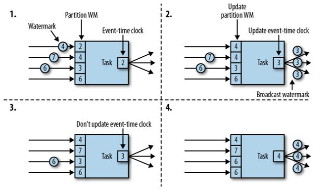

# 窗口 window

- streaming 流式计算是一种被设计用于处理无限数据集的数据处理引擎
- 无限数据集是指一种不断增长的本质上无限的数据集 
- window
  - 是一种切割无限数据集为有限块进行处理的手段
  - 无限数据流处理的核心
  -  将一个无限的 stream 拆分成有限大小的”buckets”桶，在这些桶上做计算操作


## 类型

- CountWindow
  - 按照指定数据条数生成一个window
  - 与时间无关
- TimeWindow
  - 按照时间生成的window
- 实现方式
  - Tumbling Window
    - 滚动窗口
  - Sliding Window
    - 滑动窗口
  - Session Window
    - 会话窗口


### 滚动窗口

- 将数据依据固定的窗口长度对数据进行切片
- 特点
  - 时间对齐，窗口长度固定，没有重叠
- 适用场景
  - 适合做 BI 统计等（做每个时间段的聚合计算）


### 滑动窗口

- 滑动窗口是固定窗口的更广义的一种形式，滑动窗口由固定的窗口长度和滑动间隔组成

- 特点：时间对齐，窗口长度固定，有重叠
  
- 滑动窗口分配器将元素分配到固定长度的窗口中，与滚动窗口类似
- 窗口的大小由窗口大小参数来配置
- 窗口滑动参数控制滑动窗口开始的频率
- 滑动窗口如果滑动参数小于窗口大小的话，窗口是可以重叠的
  - 在这种情况下元素会被分配到多个窗口中

 

- 适用场景
  - 对最近一个时间段内的统计（求某接口最近 5min 的失败率来决定是否要报警）


### 会话窗口

- 由一系列事件组合一个指定时间长度的 timeout 间隙组成，类似于 web 应用的session，也就是一段时间没有接收到新数据就会生成新的窗口

- 特点：时间无对齐
- session 窗口分配器通过 session 活动来对元素进行分组，session 窗口跟滚动窗口和滑动窗口相比，不会有重叠和固定的开始时间和结束时间的情况，相反，当它在一个固定的时间周期内不再收到元素，**即非活动间隔产生，那个这个窗口就会关闭**
- 一个 session 窗口通过一个 session 间隔来配置，这个 session 间隔定义了非活跃周期的长度，当这个非活跃周期产生，那么当前的 session 将关闭并且后续的元素将被分配到新的 session 窗口中去

 

## API

  


### TimeWindow

- 滚动窗口
  - Flink 默认的时间窗口根据 **Processing Time** 进行窗口的划分，将 Flink 获取到的数据根据进入 Flink 的时间划分到不同的窗口中
  - 时间间隔可以通过 Time.milliseconds(x)，Time.seconds(x)，Time.minutes(x)等其中的一个来指定

```scala
val minTempPerWindow = dataStream
.map(r => (r.id, r.temperature))
.keyBy(_._1)
.timeWindow(Time.seconds(15))
.reduce((r1, r2) => (r1._1, r1._2.min(r2._2)))
```

- 示例滚动窗口
  - 注意，没有数据则窗口即使到了10s也不会触发执行
  - 使用的时间默认是系统的处理时间

```scala
package com.stt.flink.window

import com.stt.flink.source.SensorEntity
import org.apache.flink.streaming.api.scala._
import org.apache.flink.streaming.api.windowing.time.Time

object TimeWindowTest {

  def main(args: Array[String]): Unit = {

    val env: StreamExecutionEnvironment = StreamExecutionEnvironment.getExecutionEnvironment
    val dataStream: DataStream[String] = env.socketTextStream("hadoop102",8888)

    val sensorStream: DataStream[SensorEntity] = dataStream
      .map(item => {
        val fields: Array[String] = item.split(",")
        SensorEntity(fields(0), fields(1).trim.toLong, fields(2).trim.toDouble)
      })


    // 统计10s内的最小温度
    val minTemperatureWindowStream: DataStream[(String, Double)] = sensorStream
      .map(data => (data.id, data.temperature))
      .keyBy(_._1)
      .timeWindow(Time.seconds(10)) // 开时间窗口
      .reduce((s1, s2) => (s1._1, s1._2.min(s1._2))) // reduce进行聚合操作

    minTemperatureWindowStream.print("timeWindow")

    sensorStream.print("input Data")

    env.execute("TimeWindowTest")
  }
}
```


- 滑动窗口
  - 滑动窗口和滚动窗口的函数名是完全一致的，只是在传参数时需要传入两个参数
    - window_size
    - sliding_size
  - 下面代码中的 sliding_size 设置为了 5s
  - 窗口每 5s 就计算一次，每一次计算的 window 范围是 15s 内的所有元素

```scala
val minTempPerWindow: DataStream[(String, Double)] = dataStream
.map(r => (r.id, r.temperature))
.keyBy(_._1)
.timeWindow(Time.seconds(15), Time.seconds(5))
.reduce((r1, r2) => (r1._1, r1._2.min(r2._2)))
// 可指定窗口的会话时长
.window(EventTimeSessionWindows.withGap(Time.minutes(10))
```


### CountWindow

- 根据窗口中相同 key 元素的数量来触发执行，执行时只计算元素数量达到窗口大小的 key 对应的结果
- 注意：CountWindow 的 window_size 指的是相同 Key 的元素的个数，**不是输入的所有元素的总数**

- 滚动窗口
  - 默认的 CountWindow 是一个滚动窗口，只需要指定窗口大小即可，当元素数量达到窗口大小时，就会触发窗口的执行

```scala
val minTempPerWindow: DataStream[(String, Double)] = dataStream
.map(r => (r.id, r.temperature))
.keyBy(_._1)
.countWindow(5)
.reduce((r1, r2) => (r1._1, r1._2.max(r2._2)))
```

- 滑动窗口
  - 滑动窗口和滚动窗口的函数名是完全一致的，只是在传参数时需要传入两个参数，一个是 window_size，一个是 sliding_size。下面代码中的 sliding_size 设置为了 2，也就是说，每收到两个相同 key 的数据就计算一次，每一次计算的 window 范围是 5 个元素

```scala
val keyedStream: KeyedStream[(String, Int), Tuple] = 
dataStream .map(r =>(r.id, r.temperature)) .keyBy(0)
// 每当某一个 key 的个数达到 2 的时候 , 触发计算，计算最近该 key 最近 10 个元素的内容
val windowedStream: WindowedStream[(String, Int), Tuple, GlobalWindow] =
keyedStream.countWindow(10,2)
val sumDstream: DataStream[(String, Int)] = windowedStream.sum(1)
```


### window function

- window function 定义了要对窗口中收集的数据做的计算操作，主要可以分为两类
  - 增量聚合函数（incremental aggregation functions）每条数据到来就进行计算，保持一个简单的状态，典型的增量聚合函数有ReduceFunction, AggregateFunction
  - 全窗口函数（full window functions）先把窗口所有数据收集起来，等到计算的时候会遍历所有数据。ProcessWindowFunction 就是一个全窗口函数


### trigger

- 触发器
- 定义 window 什么时候关闭，触发计算并输出结果


### evitor

- 移除器
- 定义移除某些数据的逻辑


### allowedLateness

- 允许处理迟到的数据

  

### sideOutputLateData

- 将迟到的数据放入侧输出流


### getSideOutput

- 获取侧输出流


# 时间语义 Time

- 默认的时间属性是 Processing Time

 

- Event Time
  - **事件创建的时间**
  - 它通常由事件中的时间戳描述
  - 如采集的日志数据中，每一条日志都会记录自己的生成时间，Flink 通过时间戳分配器访问事
    件时间戳
  - 在 Flink  的流式处理中，绝大部分的业务都会使用 eventTime，一般只在eventTime 无法使用时，才会被迫使用 ProcessingTime 或者 IngestionTime
- Ingestion Time
  - 数据进入 Flink 的时间
- Processing Time
  - 每一个执行基于时间操作的算子的**本地系统时间**，与机器相关


## eventTime的引入

```scala
val env = StreamExecutionEnvironment.getExecutionEnvironment
//从调用时刻开始给 env 创建的每一个 stream 追加时间特征
env.setStreamTimeCharacteristic(TimeCharacteristic.EventTime)
```


# Watermark

- 注意：基于EventTime处理时，与系统的处理时间无关

  - 如定义窗口10s，那么需要接收到数据的EventTime间隔10s才会触发窗口计算操作

  

- 流处理，对事件的处理按照事件的产生时间EventTime顺序时，由于网络以及分布式等原因，事件处理过程中有乱序的产生
- 乱序：事件不是按照EventTime顺序排列

 

- 如何处理？
  - 遇到一个时间戳到达了窗口关闭的时间，不立刻出发窗口计算，等待一段时间，等迟到的数据来了再关闭窗口
  - 在一个窗口时间内，等待一段时间，等到迟到的数据到来后，继续下一个窗口进行
  - waterMark与Window结合实现
  - 不会完全解决乱序问题，依据实际情况进行调节延时时间，同时增加测输出流进行收集迟到的数据
- 对于下图是有序事件，waterMark是0，没有延时等待

 

- 当有乱序时，需要设置一定的延时waterMark

 

- 具体流程
  - flink收到数据后，按照一定规则生成waterMark
  - waterMark是所有到达数据maxEventTime - 延时时长
  - waterMark是由数据携带的，当数据携带的waterMark比当前未触发的窗口停止时间晚，触发相应的窗口执行
  - 注意：==如果运行过程中无法获取新数据，那么没有触发的窗口将不会触发==
    - 窗口的触发基于waterMark
- 如设置延时为2s，窗口1是1s-5s，时间戳7s对应的waterMark是5s，7s事件到达后触发窗口1执行，窗口2是6s-10s，12s的时间戳对应的是waterMark是10s，触发窗口2执行
- waterMark就是触发前一个窗口的关窗时间，一旦触发关窗，当前时刻为准的窗口范围内的所有数据都会进行计算
- ==只要没有达到水位，那么无论现实中的时间推进了多久，都不会触发关窗==

- 如果第一个窗口是1s到5s，第一个到达的消息是10s，那么接收到15s的消息后，就要进行关窗，添加水位线之后，如是2s，那么收到消息至少要17s，才会触发关窗计算10到15s的数据，然后进行下一个窗口


## 特点

  

- waterMark是一条特殊数据记录
- waterMark只能单调递增，确保任务的事件时钟向前推进
- waterMark与数据的时间戳有关


## 传递

 


## 产生方式


### 指定字段

- eventTime 的使用一定要指定**数据源中的时间戳**
  - 如果数据源里的数据没有时间戳，就只能使用 Processing Time

```scala
dataStream.assignTimestampsAndWatermarks( 
    new BoundedOutOfOrdernessTimestampExtractor[SensorReading](Time.milliseconds(1000)) {
        override def extractTimestamp(element: SensorReading): Long = {
            element.timestamp * 1000 // 指定SensorReading对象中的timestamp作为eventTime
        }
    } 
)
```


### 自定义抽取

- 使用自定义接口实现抽取时间戳

```scala
val env = StreamExecutionEnvironment.getExecutionEnvironment
//  从调用时刻开始给 env 创建的每一个 stream 追加时间特性
env.setStreamTimeCharacteristic(TimeCharacteristic.EventTime)

val readings: DataStream[SensorReading] = env
.addSource(new SensorSource)
.assignTimestampsAndWatermarks(new MyAssigner())
```

- MyAssigner 有2种类型，都继承TimestampAssigner
  - AssignerWithPeriodicWatermarks
    - Periodic - 周期性的（一定时间间隔或者达到一定的记录条数）产生一个Watermark
    - 在实际的生产中Periodic的方式必须结合时间和积累条数两个维度继续周期性产生Watermark，否则在极端情况下会有很大的延时
  - AssignerWithPunctuatedWatermarks
    - Punctuated（标点） - 数据流中每一个递增的EventTime都会产生一个Watermark
    - 在实际的生产中Punctuated方式在TPS很高的场景下会产生大量的Watermark在一定程度上对下游算子造成压力
    - 只有在实时性要求非常高的场景才会选择Punctuated的方式进行Watermark的生成


#### AssignerWithPeriodicWatermarks

- 周期性的生成 watermark，并更新
- 系统会周期性的将 watermark 插入到流中
  - 水位线也是一种特殊的事件
- 默认周期是 200 毫秒
- 可使用ExecutionConfig.setAutoWatermarkInterval()方法进行设置

```scala
val env = StreamExecutionEnvironment.getExecutionEnvironment
env.setStreamTimeCharacteristic(TimeCharacteristic.EventTime)
//  每隔 5 秒产生一个 watermark
env.getConfig.setAutoWatermarkInterval(5000)
```

- Flink 会调用AssignerWithPeriodicWatermarks 的 getCurrentWatermark()方法
- 如果方法返回一个时间戳大于之前水位的时间戳，新的 watermark 会被插入到流中
  - 检查保证了水位线是单调递增的
- 如果方法返回的时间戳小于等于之前水位的时间戳，则不会产生新的 watermark

- 自定义一个周期性的时间抽取

```scala
class PeriodicAssigner extends AssignerWithPeriodicWatermarks[SensorReading] {
    
    val bound: Long = 60 * 1000 //  延时为 1 分钟
    var maxTs: Long = Long.MinValue //  观察到的最大时间戳
    
    override def getCurrentWatermark: Watermark = {
        new Watermark(maxTs - bound)
    }
    
    override def extractTimestamp(r: SensorReading, previousTS: Long) = {
        maxTs = maxTs.max(r.timestamp)
        r.timestamp
    }
}
```

- 一种简单的特殊情况是，如果我们事先得知数据流的时间戳是单调递增的，也就是说没有乱序，那我们可以使用 assignAscendingTimestamps，这个方法会直接使用数据的时间戳生成 watermark

```scala
val stream: DataStream[SensorReading] = ...
val withTimestampsAndWatermarks = stream
.assignAscendingTimestamps(e => e.timestamp)

>> result: E(1), W(1), E(2), W(2), ...
```

- 而对于乱序数据流，如果我们能大致估算出数据流中的事件的最大延迟时间，就可以使用如下代码

```scala
val stream: DataStream[SensorReading] = ...

val withTimestampsAndWatermarks = 
	stream.assignTimestampsAndWatermarks(new SensorTimeAssigner)

class SensorTimeAssigner extends
BoundedOutOfOrdernessTimestampExtractor[SensorReading](Time.seconds(5)) {
    //  抽取时间戳
	override def extractTimestamp(r: SensorReading): Long = r.timestamp
}

>> relust: E(10), W(0), E(8), E(7), E(11), W(1), ...
```


#### AssignerWithPunctuatedWatermarks

- 间断式地生成 watermark
- 和周期性生成的方式不同，这种方式不是固定时间的，可以根据需要对每条数据进行筛选和处理
- 示例：只给sensor_1 的传感器的数据流插入 watermark

```scala
class PunctuatedAssigner extends AssignerWithPunctuatedWatermarks[SensorReading] {

    val bound: Long = 60 * 1000

    override def checkAndGetNextWatermark(r: SensorReading,
                                          extractedTS: Long): Watermark = {
        if (r.id == "sensor_1") {
            new Watermark(extractedTS - bound)
        } else {
            null
        }
    }
    override def extractTimestamp(r: SensorReading,
                                  previousTS: Long): Long = {
        r.timestamp
    }
}
```


# EventTimeWindow API


## assignAscendingTimestamps

- 示例

```scala
package com.stt.flink.window

import com.stt.flink.source.SensorEntity
import org.apache.flink.streaming.api.TimeCharacteristic
import org.apache.flink.streaming.api.scala._
import org.apache.flink.streaming.api.windowing.time.Time

object EventTimeWindowTest {

  def main(args: Array[String]): Unit = {

    val env: StreamExecutionEnvironment = StreamExecutionEnvironment.getExecutionEnvironment

    env.setParallelism(1)
    // 指定eventTime
    env.setStreamTimeCharacteristic(TimeCharacteristic.EventTime)

    val dataStream: DataStream[String] = env.socketTextStream("hadoop102",8888)

    val sensorStream: DataStream[SensorEntity] = dataStream
      .map(item => {
        val fields: Array[String] = item.split(",")
        SensorEntity(fields(0), fields(1).trim.toLong, fields(2).trim.toDouble)
      })
      // 注意是ms，默认接收到的时间戳是升序，watermark 的延时时间为0
      .assignAscendingTimestamps(_.timestamp*1000)


    // 统计10s内的最小温度
    val minTemperatureWindowStream: DataStream[(String, Double)] = sensorStream
      .map(data => (data.id, data.temperature))
      .keyBy(_._1)
      .timeWindow(Time.seconds(10)) // 开时间窗口
      .reduce((s1, s2) => (s1._1, s1._2.min(s1._2))) // reduce进行聚合操作

    minTemperatureWindowStream.print("timeWindow")

    sensorStream.print("input Data")

    env.execute("TimeWindowTest")
  }
}
```


## TumblingEventTimeWindows

- 结果是按照Event Time的时间窗口计算得出的，而无关系统的时间（包括输入的快慢）

- 滚动窗口含watermark示例

```scala
package com.stt.flink.window

import com.stt.flink.source.SensorEntity
import org.apache.flink.streaming.api.TimeCharacteristic
import org.apache.flink.streaming.api.functions.AssignerWithPeriodicWatermarks
import org.apache.flink.streaming.api.functions.timestamps.BoundedOutOfOrdernessTimestampExtractor
import org.apache.flink.streaming.api.scala._
import org.apache.flink.streaming.api.watermark.Watermark
import org.apache.flink.streaming.api.windowing.time.Time

object EventTimeWindowTest2 {

  def main(args: Array[String]): Unit = {

    val env: StreamExecutionEnvironment = StreamExecutionEnvironment.getExecutionEnvironment

    env.setParallelism(1)
    // 指定eventTime
    env.setStreamTimeCharacteristic(TimeCharacteristic.EventTime)
    // 设置watermark生成的时间间隔
    env.getConfig.setAutoWatermarkInterval(300L)

    val dataStream: DataStream[String] = env.socketTextStream("hadoop102", 8888)

    val sensorStream: DataStream[SensorEntity] = dataStream
      .map(item => {
        val fields: Array[String] = item.split(",")
        SensorEntity(fields(0), fields(1).trim.toLong, fields(2).trim.toDouble)
      })
      //     .assignTimestampsAndWatermarks(new MyAssigner())
      // 自定义的逻辑有问题
      .assignTimestampsAndWatermarks(
      new BoundedOutOfOrdernessTimestampExtractor[SensorEntity](Time.seconds(1)) {
        override def extractTimestamp(t: SensorEntity): Long = t.timestamp * 1000
      }
    )

    // 统计10s内的最小温度
    val minTemperatureWindowStream: DataStream[(String, Double)] = sensorStream
      .map(data => (data.id, data.temperature))
      .keyBy(_._1)
      .timeWindow(Time.seconds(10)) // 开时间窗口
      .reduce((s1, s2) => (s1._1, s1._2.min(s1._2))) // reduce进行聚合操作

    minTemperatureWindowStream.print("timeWindow")

    sensorStream.print("input Data")

    env.execute("TimeWindowTest")
  }

  /**
    * 周期性生成一个waterMark
    */
  class MyAssigner() extends AssignerWithPeriodicWatermarks[SensorEntity] {

    val bound = 1 * 1000 // 单位ms
    var maxTs = Long.MinValue

    // 定义一个规则生成watermark
    override def getCurrentWatermark: Watermark = {
      new Watermark(maxTs - bound)
    }

    // 按照当前最大的时间戳
    override def extractTimestamp(t: SensorEntity, l: Long): Long = {
      maxTs = maxTs.max(t.timestamp * 1000)
      t.timestamp * 1000
    }
  }

}
```

- 结果
  - 10s的窗口，1s的水位线延时
  - 10s的设置将各个窗口的临界值预先划分，在每个10s的位置进行输出
    - 如下201-1=200 可以被10整除，200设置为窗口临界值，超过该值触发计算窗口
  - 当触发窗口计算时，属于下一个窗口的值，会在下一窗口进行计算
  - 每次触发窗口的eventTime都是下一个窗口的事件数据触发
  - 当每次水位线的值达到了窗口的临界值，触发窗口关闭，进行计算

```text
input Data> SensorEntity(s05,1547718199,35.80018327300259)
input Data> SensorEntity(s06,1547718201,15.402984393403084)
timeWindow> (s05,35.80018327300259)
input Data> SensorEntity(s07,1547718202,4.720945201171228)
input Data> SensorEntity(s07,1547718202,4.720945201171228)
input Data> SensorEntity(s08,1547718205,38.101067604893444)
input Data> SensorEntity(s07,1547718202,4.720945201171228)
input Data> SensorEntity(s07,1547718213,5.720945201171228)
timeWindow> (s06,15.402984393403084)
timeWindow> (s07,4.720945201171228)
timeWindow> (s08,38.101067604893444)
input Data> SensorEntity(s07,1547718214,6.720945201171228)
input Data> SensorEntity(s07,1547718219,6.720945201171228)
input Data> SensorEntity(s07,1547718220,6.720945201171228)
input Data> SensorEntity(s07,1547718221,7.720945201171228)
timeWindow> (s07,5.720945201171228)
```

- 注意水位线触发的窗口，在临界值位置是左闭右开


### 窗口创建源码解析

```scala
TumblingEventTimeWindows

@Override
public Collection<TimeWindow> assignWindows(Object element, long timestamp, WindowAssignerContext context) {
    if (timestamp > Long.MIN_VALUE) {
        // Long.MIN_VALUE is currently assigned when no timestamp is present
        long start = TimeWindow.getWindowStartWithOffset(timestamp, offset, size);
        return Collections.singletonList(new TimeWindow(start, start + size));
    } else {
...
    }
}
```


## SlidingEventTimeWindows

- 滑动窗口

```scala
package com.stt.flink.window

import com.stt.flink.source.SensorEntity
import org.apache.flink.streaming.api.TimeCharacteristic
import org.apache.flink.streaming.api.functions.timestamps.BoundedOutOfOrdernessTimestampExtractor
import org.apache.flink.streaming.api.scala._
import org.apache.flink.streaming.api.windowing.time.Time

// 滑动窗口
object EventTimeWindowTest3 {

  def main(args: Array[String]): Unit = {

    val env: StreamExecutionEnvironment = StreamExecutionEnvironment.getExecutionEnvironment

    env.setParallelism(1)
    // 指定eventTime
    env.setStreamTimeCharacteristic(TimeCharacteristic.EventTime)
    // 设置watermark生成的时间间隔
    env.getConfig.setAutoWatermarkInterval(300L)

    val dataStream: DataStream[String] = env.socketTextStream("hadoop102", 8888)

    val sensorStream: DataStream[SensorEntity] = dataStream
      .map(item => {
        val fields: Array[String] = item.split(",")
        SensorEntity(fields(0), fields(1).trim.toLong, fields(2).trim.toDouble)
      })
      .assignTimestampsAndWatermarks(
      new BoundedOutOfOrdernessTimestampExtractor[SensorEntity](Time.seconds(1)) {
        override def extractTimestamp(t: SensorEntity): Long = t.timestamp * 1000
      }
    )

    // 统计10s内的最小温度
    val minTemperatureWindowStream: DataStream[(String, Double)] = sensorStream
      .map(data => (data.id, data.temperature))
      .keyBy(_._1)
      .timeWindow(Time.seconds(15),Time.seconds(5)) // 滑动窗口，5s是滑动步长
      .reduce((s1, s2) => (s1._1, s1._2.min(s1._2))) // reduce进行聚合操作

    minTemperatureWindowStream.print("timeWindow")

    sensorStream.print("input Data")

    env.execute("EventTimeWindowTest3")
  }
}
```

- 对于滑动窗口而言，当满足到步长的临界值，就会输出窗口，窗口数据有叠加计算
- 注意，窗口的临界值是左闭右开

- 结果

```text
input Data> SensorEntity(s05,1547718500,35.80018327300259)
input Data> SensorEntity(s05,1547718501,36.80018327300259)
input Data> SensorEntity(s05,1547718511,37.0) # 步长跨过了2个窗口，触发了2个窗口的计算
timeWindow> (s05,35.80018327300259)
timeWindow> (s05,35.80018327300259)
input Data> SensorEntity(s05,1547718514,38.0)
input Data> SensorEntity(s05,1547718515,38.0)
input Data> SensorEntity(s05,1547718516,38.0)
timeWindow> (s05,35.80018327300259)
input Data> SensorEntity(s05,1547718517,30.0)
input Data> SensorEntity(s05,1547718520,30.0)
input Data> SensorEntity(s05,1547718521,29.0)
timeWindow> (s05,37.0)
```


### 窗口创建源码解析

```scala
SlidingEventTimeWindows
--assignWindows
----TimeWindow.getWindowStartWithOffset(timestamp, offset, slide); // 注意slide传参作为windowsize

/**
	 * Method to get the window start for a timestamp.
	 *
	 * @param timestamp epoch millisecond to get the window start.
	 * @param offset 时区，没有传则是0
	 * @param windowSize The size of the generated windows.
	 * @return window start
	 */
public static long getWindowStartWithOffset(long timestamp, long offset, long windowSize) {
    return timestamp - (timestamp - offset + windowSize) % windowSize;
}
```

- assignWindows方法进行分配窗口

```scala
public Collection<TimeWindow> assignWindows(Object element, long timestamp, WindowAssignerContext context) {
    if (timestamp > Long.MIN_VALUE) {
        List<TimeWindow> windows = new ArrayList<>((int) (size / slide));
        // 最近的起点，如计算出195
        long lastStart = TimeWindow.getWindowStartWithOffset(timestamp, offset, slide);
        // timestamp 是199，size是15,199-15 = 184 < 195
        for (long start = lastStart; start > timestamp - size; start -= slide) {
            // 添加 195 --210 窗口
            windows.add(new TimeWindow(start, start + size));
            // 195 - 5(步长) = 190 > 184 继续添加窗口 190--205
        }
        return windows;
    } else {
   		...
    }
}
```


## EventTimeSessionWindows

- 会话窗口
- 相邻两次数据的 EventTime 的时间差超过指定的时间间隔就会触发执行。如果加入 Watermark， 会在符合窗口触发的情况下进行延迟。到达延迟水位再进行窗口触发

```scala
def main(args: Array[String]): Unit = {
    //  环境
    val env: StreamExecutionEnvironment = StreamExecutionEnvironment.getExecutionEnvironment

    env.setStreamTimeCharacteristic(TimeCharacteristic.EventTime)
    env.setParallelism(1)

    val dstream: DataStream[String] = env.socketTextStream("localhost",7777)

    val textWithTsDstream: DataStream[(String, Long, Int)] = dstream.map { text =>
        val arr: Array[String] = text.split(" ")
        (arr(0), arr(1).toLong, 1)
    }
    val textWithEventTimeDstream: DataStream[(String, Long, Int)] = textWithTsDstream.assignTimestampsAndWatermarks(new BoundedOutOfOrdernessTimestampExtractor[(String, Long, Int)](Time.milliseconds(1000)) {
        override def extractTimestamp(element: (String, Long, Int)): Long = {

            return  element._2
        }
    })

    val textKeyStream: KeyedStream[(String, Long, Int), Tuple] = textWithEventTimeDstream.keyBy(0)
    textKeyStream.print("textkey:")

    val windowStream: WindowedStream[(String, Long, Int), Tuple, TimeWindow] = textKeyStream.window(EventTimeSessionWindows.withGap(Time.milliseconds(500)) )


    windowStream.reduce((text1,text2)=>
                        (  text1._1,0L,text1._3+text2._3)
                       )  .map(_._3).print("windows:::").setParallelism(1)

    env.execute()

}
```


