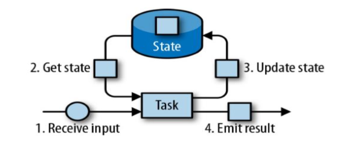
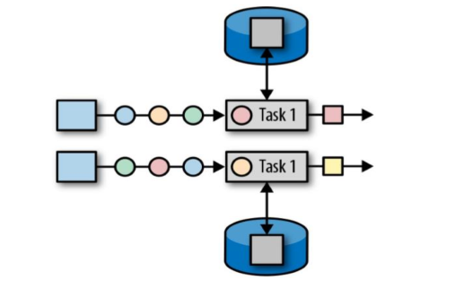
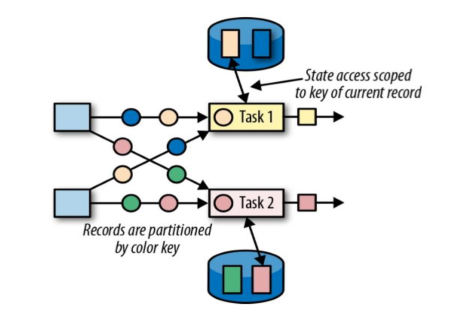
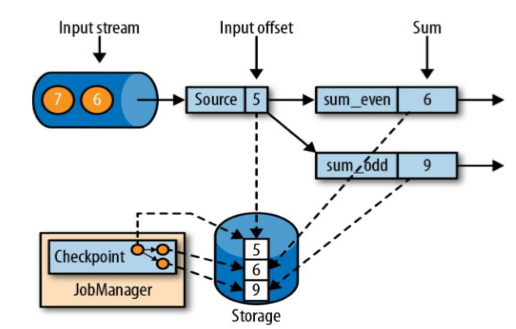
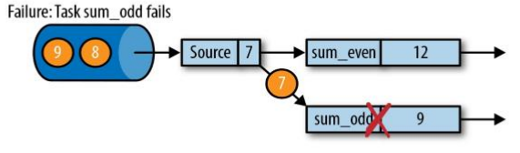
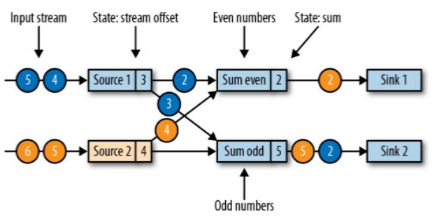
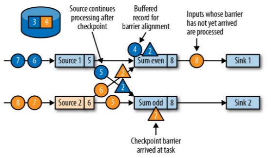
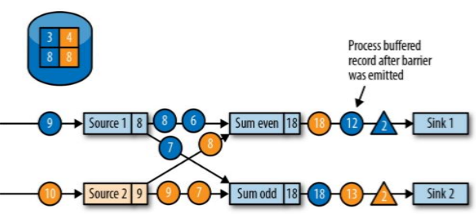
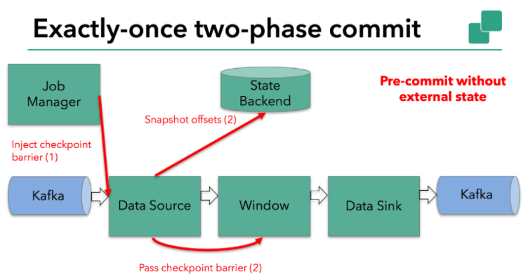
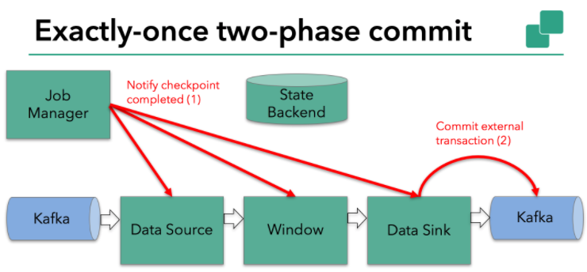

# 状态编程

流式计算分为无状态和有状态两种情况。无状态的计算观察每个独立事件，并
根据最后一个事件输出结果。例如，流处理应用程序从传感器接收温度读数，并在
温度超过 90 度时发出警告。有状态的计算则会基于多个事件输出结果
⚫ 所有类型的窗口。例如，计算过去一小时的平均温度，就是有状态的计算。
⚫ 所有用于复杂事件处理的状态机。例如，若在一分钟内收到两个相差 20 度以上的温度读数，则发出警告，这是有状态的计算。
⚫ 流与流之间的所有关联操作，以及流与静态表或动态表之间的关联操作，都是有状态的计算


## flink中的状态

 

- 状态会进行序列化存储
- 有一个任务维护，用来计算某个结果的所有数据，都属于这个任务的状态
- 认为状态就是一个本地变量，可以被任务的业务逻辑访问
- Flink会进行状态管理，包括一致性，故障处理，高效存储和访问
- 类型
  - 算子状态：作用范围为算子任务
  - 键控状态：根据输入数据流中定义的key进行维护和访问


### 算子状态 Operator State

 

- 作用范围限定为算子任务，==同一并行任务==所处理的所有数据都可以访问到相同的状态
- 状态对同一任务时共享的
- ==算子状态不能由相同或不同算子的另一个任务访问==


#### 数据结构

- 列表状态
  - list state
  - 将状态表示为一组数据的列表
- 联合列表状态
  - union list state
  - 将状态表示为数据的列表
  - 与常规列表状态的区别在于发生故障时，从保存点启动应用程序时如何恢复
- 广播状态
  - broadcast state
  - 如果一个算子有多项任务，它的每项任务状态又都相同，则适合使用广播状态


### 键控状态 Keyed State

 

- 键控状态是根据输入数据流中定义的键进行维护和访问
- 每个key维护一个状态实例，相同的key所有的数据分区到同一个算子任务中，这个任务会维护和处理这个key对应的状态
- 当任务处理一条数据时，自动将状态的访问范围限定为当前数据的key


#### 数据结构

- 值状态
  - 将状态表示为单个值
  - ValueState[T]
  - get：ValueState.value()
  - set:   ValueState.update(value:T)
- 列表状态
  - list state
  - 将状态表示为一组数据的列表
  - ListState.add(value:T)
  - ListState.addAll(values:java.util.List[T])
  - ListState.get() 返回 Iterable[T]
  - ListState.update(values:java.util.List[T])
- 映射状态
  - map state
  - 将状态表示为一组key-value
  - MapState.get(key:K)
  - MapState.put(key:K,value:V)
  - MapState.contains(key:K)
  - MapState.remove(key:K)
- 聚合状态
  - ReducingState[T]
  - AggregatingState[I,O]
  - 将状态表示为一个用于聚合操作的列表

- 声明一个键控状态

```scala
lazy val lastTemp:ValueState[Double] = getRuntimeContext.getState[Double](
	new ValueStateDescriptor[Double]("lastTemp",classOf[Double])
)
```

- 读取状态

```scala
val prevTemp = lastTemp.value()
```

- 对状态赋值

```scala
lastTemp.update(value.temperature)
```

- 清空操作
  - State.clear()


## 示例

```scala
package com.stt.flink.processFunction

import com.stt.flink.source.SensorEntity
import org.apache.flink.api.common.functions.RichFlatMapFunction
import org.apache.flink.api.common.state.{ValueState, ValueStateDescriptor}
import org.apache.flink.configuration.Configuration
import org.apache.flink.streaming.api.functions.KeyedProcessFunction
import org.apache.flink.streaming.api.scala._
import org.apache.flink.util.Collector

/**
  * 状态编程
  */
object StateTest {

  def main(args: Array[String]): Unit = {

    val env: StreamExecutionEnvironment = StreamExecutionEnvironment.getExecutionEnvironment
    env.setParallelism(1)

    val dataStream: DataStream[String] = env.socketTextStream("hadoop102", 8888)
    val sensorStream: DataStream[SensorEntity] = dataStream
      .map(item => {
        val fields: Array[String] = item.split(",")
        SensorEntity(fields(0), fields(1).trim.toLong, fields(2).trim.toDouble)
      })

    // 方式1.使用flatMap 函数类
    val warning1: DataStream[(String, Double, Double)] =
      sensorStream.keyBy(_.id).flatMap(new TemperatureChangeAlert(10.0))
    warning1.print("warning")

    // 方式2.使用keyed 函数类
    val warning2: DataStream[(String, Double, Double)] =
      sensorStream.keyBy(_.id).process(new TemperatureChangeAlert2(10.0))
    warning2.print("warning2")

    // 方式3.使用flatMapWithState
    // 第一个泛型是返回值，第二个参数是状态类型
    val warning3 = sensorStream.keyBy(_.id).flatMapWithState[(String,Double,Double),Double]{
      // 初始情况，第一次接收
      case (input: SensorEntity,None) => (List.empty,Some(input.temperature))
        // 第二次接收
      case (input: SensorEntity,lastTemp :Some[Double]) =>{
        val diff = (input.temperature - lastTemp.get).abs
        if(diff>10){
          (List((input.id,lastTemp.get,input.temperature)),Some(input.temperature))
        }else{
          (List.empty,Some(input.temperature))
        }
      }
    }

    warning3.print("warinng3")
    sensorStream.print("input Data")
    env.execute("StateTest")
  }

  /**
    * 功能：2次温度之间超过一定温度报警
    * 返回值：id，上次温度，本次温度
    * 由于没有key
    * 不使用FlatMapFunction的原因是没有包含上下文，无法记录状态
    *
    */
  class TemperatureChangeAlert(threshold: Double) extends RichFlatMapFunction[SensorEntity,(String,Double,Double)]{

    var lastTemperature:ValueState[Double] = _

    override def open(parameters: Configuration): Unit = {
      lastTemperature = getRuntimeContext.getState(
        new ValueStateDescriptor[Double]("lastTemp",classOf[Double])
      )
    }

    override def flatMap(in: SensorEntity, out: Collector[(String, Double, Double)]): Unit = {

      if((lastTemperature.value()-in.temperature).abs > threshold){
        out.collect((in.id, lastTemperature.value(),in.temperature))
      }
      lastTemperature.update(in.temperature)
    }

  }

  class TemperatureChangeAlert2(threshold: Double) extends KeyedProcessFunction[String,SensorEntity,(String,Double,Double)]{

    // 此处注意lazy关键字，getRuntimeContext需要先初始化
    lazy val lastTemperature = getRuntimeContext.getState(
      new ValueStateDescriptor[Double]("lastTemp",classOf[Double])
    )

    override def processElement(in: SensorEntity,
                                ctx: KeyedProcessFunction[String, SensorEntity, (String, Double, Double)]#Context,
                                out: Collector[(String, Double, Double)]): Unit = {
      if((lastTemperature.value()-in.temperature).abs > threshold){
        out.collect((in.id, lastTemperature.value(),in.temperature))
      }
      lastTemperature.update(in.temperature)

    }
  }
}
```


# 状态后端

- StateBackends
  - 状态的存储，访问，维护由该组件决定
  - 负责本地状态管理
  - 将检查点状态写入远程存储

- 每传入一条数据，有状态的算子任务都会读取和更新状态
- 由于有效的状态访问对于处理数据的低延时很重要，每个并行任务都会在本地维护其状态，确保快速访问


## 种类

- MemoryStateBackend

  - 默认配置
  - 内存级状态后端
  - 将键控状态作为内存中的对象进行管理
  - 存储在TaskManager的JVM上
  - 将CheckPoint存储在JobManager的内存中
  - 特点
    - 快速，低延时
    - 不稳定

- FsStateBackend

  - 将checkPoint存储到远程的持久化文件系统（FileSystem）上
  - 对于本地状态，与MemoryStateBackend一样，存储在TaskManager的JVM堆上
  - 同时拥有内存级的本地访问速度，更好的容错性

- RocksDBStateBackend

  - 将所有状态序列化之后，存入本地的RocksDB中

  - 需要引入依赖

  ```xml
  <dependency>
      <groupId>org.apache.flink</groupId>
      <artifactId>flink-statebackend-rocksdb_2.11</artifactId>
      <version>1.7.2</version>
  </dependency>
  ```


## 设置

```scala
val env = StreamExecutionEnvironment.getExecutionEnvironment

// 设置RocksDBStateBackend
env.setStateBackend(new RocksDBStateBackend(checkpointPath))

// 设置FsStateBackend
env.setStateBackend(new FsStateBackend("file:///tmp/checkpoints"))

// 启用检查点，默认关闭，1000表示每次检查点的时间间隔 单位ms
env.enableCheckpointing(1000)

// 配置重启策略
env.setRestartStrategy(RestartStrategies.fixedDelayRestart(60,Time.of(10,TimeUnit.SECONDS)))
```


# 容错机制


## 一致性检查点 [check point]

- flink 故障恢复机制的核心
  - 应用状态的一致性检查点
- 有状态流应用的一致检查点，就是所有任务的状态
- JobManager触发Checkpoint操作

 

- 示例：分别计算奇数和偶数和
  - 计算偶数，2,4,的和为6；奇数1,3,5的和9时，当前source的值是5
  - 存储在storage中的是奇数和与偶数和，以及source值为5时的偏移量
  - 将storage中存储的数据作为JobManager中的checkpoint进行存储

 

- 示例：sum_odd处理失败
  - 遇到故障之后，重启应用
  - 从checkpoint进行恢复，从source为5开始恢复，sum_even恢复成6，sum_odd恢复成9

 

- 第三步：开始消费并处理检查点到发生故障之间的所有数据
  - 在内部保证精确一次，如果在外部添加sink，那么会有多次触发


### 检查点算法

- 简单处理
  - 暂停应用，保存状态到检查点，再重新恢复应用
- flink的改进实现
  - 基于Chandy-Lamport算法的分布式快照
  - 将检查点的保存和数据处理分离开，不暂停整个应用


### 检查点分界线 checkpoint barrier

- checkpoint barrier是一个**特殊的数据形式**
- 用于将一条流上的数据按照不同的检查点分开
- 基于分界线之前的数据导致的状态更改，都会被包含在当前分界线所属的检查点中
- 基于分界线之后的数据导致的更改，会包含在之后的检查点中


### 算法思路

- 示例
  - 2个输入流的应用程序，并行的两个source任务读取
    - 蓝色和黄色分别表示各自数据流
    - 2个数据流传输的数据都是1,2,3,4,5,6
  - 功能：分别统计偶数和奇数和并分别输出
  - 在输出流中，如果是蓝色数据最新参与奇数或偶数计算，那么输出数据的颜色也是蓝色，反之黄色依然

 

- 阶段1
  
   
  
  - sum even 的值是2，输出黄色2（接收的黄色2）
  - sum odd 的是5，输出黄色5（蓝色结果2+黄色3），之前输出蓝色2（黄色1+蓝色1）

 

- 阶段2
  
   
  
  - JobManager会向每个source任务发送一个带有新检查点ID的消息，启动检查点
  - 如启动第二个检查点

 

- 阶段3
  
   
  
  - source将**当前状态**写入到检查点
    - 当前状态包含当前source的读取数据的偏移量返回值
    - Remote storage 存储source的偏移量信息（蓝色3，黄色4）
  - StateBackends 状态后端在收到source提供的检查点信息后，返回通知给source
  - source发送Acknowledge completion of task checkpoint 2 成功信息给JobManager，告知source端的【检查点2】已经成功存储
    - 图中黄色和蓝色三角2表示返回信息
  - source发出check point barrier（黄色与蓝色三角2）给下端组件

 

- 阶段4：分界线对齐
  
   
  
  - barrier传递到下游，sum任务会等待所有输入分区的barrier到达
  - 如果在barrier到达后，后期有数据传入，那么缓存到当前sum任务
    - 上图中数据蓝色4缓存到了Buffered record for barrier alignment
  - barrier还没有到达的sum任务，数据会被该sum任务正常处理

 

- 阶段5
  
   
  
  - sum任务都接收到分区的barrier时，sum任务将其状态保存到**状态后端的检查点中**
    - 这里各个sum节点是否会通知jobManager的sum的checkpoint是完成的呢？
      - 猜测在阶段4中所有的sum需要等待都接收到barrier后，才保存checkpoint到状态后端服务
      - 说明jobManager要与所有的sum任务节点通信，确认barrier是否到达，都到达之后，通知所有的sum任务节点保存checkpoint状态到任务后端
      - JobManager应该是知道sum节点checkpoint是否完成的
      - 这样的机制性能是否有损耗
        - sum都暂停处理数据
  - 然后，sum任务将检查点继续下发
  - 期间后续收到的数据都在各个sum任务缓存起来
  - 说明任务在处理checkpoint期间，是需要暂停数据处理的，等待其他相同的任务都接收到checkpoint barrier并都提交完成任务后，才会继续处理数据


- 阶段6
  
   
  
  - sum任务节点向下游转发检查点barrier信息，并继续处理后续正常的数据

 

- 阶段7
  
   
  
  - sink任务向JobManager确认状态保存到checkpoint完毕
  - 当所有任务都确认已成功将状态保存到检查点时，检查点真正完成


## 保存点 [save points]

- 类似于手动checkpoint
- 自定义镜像保存功能
- 原则上，创建保存点使用的算法与检查点完全相同，保存点可以认为有额外元数据的检查点
- Flink不会自动创建保存点，用户需要出发创建操作
- 使用场景
  - 故障恢复
  - 有计划的手动备份
  - 更新应用程序
  - 版本迁移
  - 暂停和重启应用等


## 检查点配置

- 可在flink-conf.yaml文件中配置全局job的checkpoint参数

```scala
val env: StreamExecutionEnvironment = StreamExecutionEnvironment.getExecutionEnvironment

// 触发checkpoint的时间间隔
env.enableCheckpointing(60*1000)

// 设置状态一致性的级别，默认的是EXACTLY_ONCE
env.getCheckpointConfig.setCheckpointingMode(CheckpointingMode.AT_LEAST_ONCE)

// 设置超时时间,checkpoint可能会IO保存超时
env.getCheckpointConfig.setCheckpointTimeout(100*1000)

// checkpoint保存异常，默认是true，表示如果checkpoint失败，则整个任务停止
env.getCheckpointConfig.setFailOnCheckpointingErrors(false)

// 同时checkpoint并行存在，由于IO导致有些checkpoint没有保存完成，默认值是1
env.getCheckpointConfig.setMaxConcurrentCheckpoints(1)

// 2次checkpoint操作的时间间隔
env.getCheckpointConfig.setMinPauseBetweenCheckpoints(100)

// checkpoint的外部持久化，job失败取消后，外部的checkpoint信息会被清除，设置RETAIN_ON_CANCELLATION，则需要手动清理
env.getCheckpointConfig.enableExternalizedCheckpoints(ExternalizedCheckpointCleanup.RETAIN_ON_CANCELLATION)

// 配置重启策略,job出现错误后，尝试3次，每次间隔500ms
env.setRestartStrategy(RestartStrategies.fixedDelayRestart(3,500))

// 失败率重启,5分钟失败率测量时间范围内，最多重启3次，每次10s的间隔，如果3次都失败，则job判断为失效
// 与 固定延时重启多了个5分钟内时间范围
env.setRestartStrategy(RestartStrategies.failureRateRestart(3,Time.minutes(5),Time.seconds(10)))
```


# 状态一致性

- 有状态的流处理，内部每个算子任务都可以有自己的状态
- 对于流处理器内部而言，状态一致性就是计算结果要保证准确
- 一条数据不会丢失，也不会重复计算
- 在故障恢复后重新计算结果也要完全正确


## 分类

- AT-MOST-ONCE
  - 最多处理一次事件
  - 当故障时，不恢复丢失的状态，不重播丢失的数据
- AT-LEAST-ONCE
  - 至少一次
  - 所有事件都得到了处理，可能会有多次
- EXACTLY-ONCE
  - 精确一次
  - 每一条数据，**内部状态只更新一次**
    - 内部状态可以重置，重新获取消息得到正确的状态


## checkpoint

- flink使用checkpoint 轻量级快照机制保证exactly once
- 所有任务状态，在某个时间点的一份拷贝，而该时间点应该是所有任务都正好处理完一个相同的数据数据
- 应用状态一致检查点是Flink故障机制恢复的核心


## 端到端状态一致性

- end to end

- 一致性是流处理器实现，在flink内部是有所保证

- 真实应用场景中，流处理应用还应该包括数据源和输出到持久化系统

- 端到端的一致性保证，要正确的结果贯穿整个流处理应用

  - 每一个组件都保证自己的一致性

- 一致性级别取决于所有组件中最弱的一个组件

- 实现端到端精确一次

  - 内部保证

    - checkpoint

  - source端

    - 可重设数据的读取位置

  - sink端

    - 从故障恢复时，数据不会重复写入外部系统

    - 幂等写入

    - 事务写入

      

### 幂等写入

- 一个操作可以重复多次执行
- 只导致一次的结果更改，重复执行不会生效


### 事务写入

- Transactional Writes
- 事务
  - Transaction
  - 应用程序中一系列严密的操作，所有操作必须完成，否则每个操作中所作的所有更改都会被撤销
  - 具有原子性
- 实现思路
  - 构建的事务对应checkpoint，等到checkpoint真正完成时，才将对应结果写入sink系统中
- 实现方式
  - 预写日志
  - 两阶段提交


#### 预写日志

- Write Ahead Log WAL
- 把结果数据先当成状态保存，在收到checkpoint完成的通知时，一次性写入sink系统
- 实现简单，数据提前在状态后端进行了缓存，对其他sink系统，都可以实现
- DataStream API 提供一个模板类实现该事务性Sink
  - GenericWriteAheadSink

- 问题
  - sink写失败，会有数据重复发送或丢失
  - 实时性不好


#### 两阶段提交

- two phase commit 
- 2PC
- 步骤
  - 对于每个checkpoint，sink任务会启动一个事务，将接下来所有接收的数据添加到事务中
  - 然后将这些数据写入到外部sink系统中，但是不提交
    - 预提交
  - 当sink任务收到checkpoint完成的通知，才正式提交事务，实现结果的真正写入
- 实现了exactly once，需要一个提供事务支出的外部sink系统
- flink提供TwoPhaseCommitSinkFunction接口
- 原理：
  - sink收到消息就发给外部，但是外部系统不生效，外部系统需要sink任务确定提交，才会生效
  - checkpoint完成，再出发sink任务对外部系统的事务的提交
  - 如果checkpoint失败，那么sink任务只是将数据写到外部系统没有提交，也就不会生效，可以进行恢复，重新写到外部系统，再提交生效
- 对外部系统要求
  - 外部sink必须提供事务支持，或sink可以模拟外部系统的事务
  - 在checkpoint 的间隔期间，必须可开启一个事务并接受数据的写入
  - 在收到checkpoint完成通知前，事务必须是等待提交状态
    - 在故障恢复情况下，需要一定时间，如果此时sink系统关闭事务（超时），那么未提交的数据会丢失
  - sink任务必须可以在进程失败后恢复事务
  - 提交事务必须是幂等操作
    - 重复提交相同数据不会生效


##### 自定义2PC

- 扩展TwoPhaseCommitSinkFunction类来实现一个简单的基于文件的sink
  - beginTransaction
    - 开启一个事务
    - 在临时目录下创建一个临时文件
    - 写入数据到临时文件
  - preCommit
    - flush缓存数据到磁盘，关闭该文件
    - 之后从该文件中只能读取数据
    - 开启一个新事务执行下一个checkpoint的写入操作
      - 串行处理机制，当前消息处理完成后，才能进行下一个消息的处理
  - commit
    - 原子性的方式将上一个阶段的文件写入真正的文件目录下
  - abort
    - 一旦事务终止，删除临时文件
- 出现崩溃情况
  - pre-commit 阶段完，commit还未开始
  - flink恢复到pre-commit完成状态，需要checkpoint保存足够的信息
    - 本例子中是临时文件存储的路径以及目标目录
  - 应用从checkpoint恢复后，TwoPhaseCommitSinkFunction发起一个抢占式commit
    - commit具有幂等性


## 不同source和sink的一致性

 


## Flink + Kafka 端到端的一致性保证

- 内部
  - 使用checkpoint 机制，将状态存盘，发生故障时可恢复
  - 保证内部的状态一致性
- source
  - kafka consumer作为source
  - 将偏移量保存，如果出现了故障，恢复时可以有连接器重置偏移量，重新消费
  - 保证一致性
- sink
  - kafka producer作为sink
  - 采用两阶段提交，需要实现TwoPhaseCommitSInkFunction


### 原理


- 阶段1
  - JobManager 协调各个TaskManager进行checkpoint存储
  - checkpoint保存在stateBackend中
    - 默认stateBackend 是内存级
    - 可以修改为文件级，进行持久化


- 阶段2
  - 当checkpoint启动，JobManager会将检查点分界线barrier 注入数据流中
  - barrier会在算子之间传递下去



- 阶段3
  - 每个算子会对当前状态做快照，保存到状态后端
  - checkpoint可以保持内存状态一致性


- 阶段4

  - 每个内部的transform 任务遇到barrier时，会把状态保存到checkpoint中

  - sink任务将状态保存到状态后端后，先把数据写入外部kafka

    - 数据写入到外部kafka时，在kafka端开辟一个新事务--预提交事务

      



- 阶段5
  - 当所有算子任务的快照完成，jobManager向所有任务发送通知，确认完成当前的checkpoint
  - sink任务收到确认通知后，提交kafka中的预提交事务，将kafka接收到的数据，但是没有确认的数据改为已确认


### 小结

- 对于sink任务，第一条数据来到，开启一个kafka事务，正常写入kafka分区日志，但标记为未提交----预提交过程
- jobManager触发checkpoint操作，barrier从source开始向下传递，遇到barrier的算子任务将状态保存到stateBackend，**通知jobManager**
- sink 收到barrier，保存当前状态，存入checkpoint，**通知jobManger**，开启下一个阶段kafka事务，用于提交下一检查点的数据
- jobManger接收到所有算子任务的状态提交完成通知，发送确认消息，表示checkpoint完成
- sink任务接收到jobManager的确认消息，正式提交checkpoint这期间的数据
- 外部kafka关闭事务，提交的数据可正常消费


### 配置

- kafka的事务的级别需要修改为读已提交
  - 默认读未提交
- 关于超时
  - sink默认超时1小时
  - kafka事务默认超时15分钟
  - 会导致kafka事务关闭了，sink的checkpoint还没有完成，造成checkpoint完成后，kafka的数据丢失了
  - 需要配置sink的超时时间比kafka的事务的超时时间短
  - 具体看官网配置

