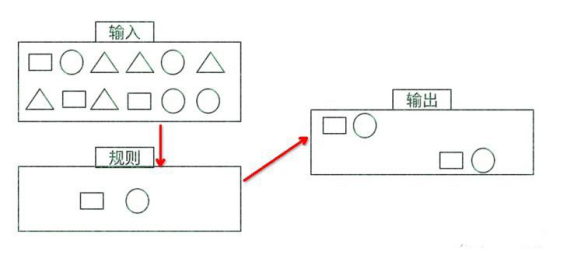
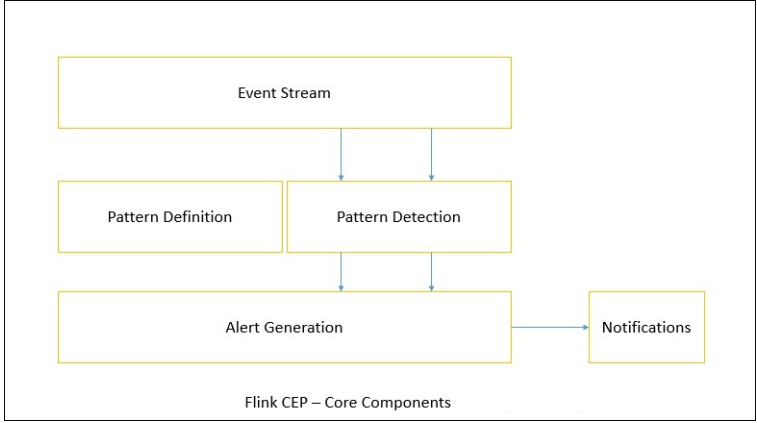

# 介绍


## CEP

-  Complex Event Processing

- 复杂事件处理
- 一个或多个由简单事件构成的事件流通过一定的规则匹配，然后输出用户想得到的数据
- 满足规则的复杂事件
- 特征
  - 目标：从有序的简单事件流中发现一些高阶特征
  - 输入：一个或多个由简单事件构成的事件流
  - 处理：识别简单事件之间的内在联系，多个符合一定规则的简单事件构成复杂事件
  - 输出：满足规则的复杂事件




- CEP用于分析低延迟、频繁产生的不同来源的事件流

- CEP可以帮助在复杂的、不相关的事件流中找出有意义的模式和复杂的关系，以接近实时或准实时的获得通知并阻止一些行为

- CEP支持在流上进行模式匹配，根据模式的条件不同，分为连续的条件或不连续的条件

  - 模式的条件允许有时间的限制，当在条件范围内没有达到满足的条件时，会导致模式匹配超时

    

## 功能

- 输入的流数据，尽快产生结果
- 在2个event流上，基于时间进行聚合类的计算
- 提供实时/准实时的警告和通知
- 在多样的数据源中产生关联并分析模式
- 高吞吐、低延迟的处理
- 市场上有多种CEP的解决方案
  - 如Spark、Samza、Beam等，但都没有提供专门的library支持
- Flink提供了专门的CEP library


# Flink CEP

Flink 为 CEP 提供了专门的 Flink CEP library，它包含如下组件

- Event Stream
- pattern 定义
- pattern 检测
- 生成 Alert




- 开发人员要在 DataStream 流上定义出模式条件，之后 Flink CEP 引擎进行模式检测，必要时生成告警


## pom

```xml
<dependency>
    <groupId>org.apache.flink</groupId>
    <artifactId>flink-cep-scala_${scala.binary.version}</artifactId>
    <version>${flink.version}</version>
</dependency>
```


## Pattern API

每个 Pattern 都应该包含几个步骤，或者叫做 state

从一个 state 到另一个 state，通常我们需要定义一些条件

- 处理事件的规则
- 示例

```scala
// 定义一个pattern
// 含有一个名为start的begin的state，获取id为42的Event对象
val pattern = Pattern.begin[Event]("start").where(_.getId == 42)
// begin的state后面是next的state，命名为middle
// next的state要求是SubEvent类型，且temp的值要>10.0
// 通过subtype来限制event的子类型
.next("middle").subtype(classof[SubEvent]).where(_.getTemp >= 10.0)
// followBy 模块命名为end，要求有个Event对象的name是end
.followBy("end").where(_.getName=="end")
```


### 个体模式 Individual Patterns

- 组成复杂规则的每一个单独的模式定义
- 示例
  - 在start模块中，匹配出现3次event满足behavior是fav

```scala
start.times(3).where(_.behavior.startsWith("fav"))
```


#### 单例模式

- 只接收一个事件


##### 量词 Quantifier


###### times

- 默认松散连贯

- 可以在一个个体模式后追加量词
- 指定循环次数

```scala
// 匹配出现4次
start.times(4)
// 匹配出现0 或4 次
start.times(4).optional
// 匹配出现2,3,4次
start.times(2,4)
// 匹配出现2,3,4次，并尽可能多的重复匹配
start.times(2,4).greedy
// 匹配出现1次或多次
start.oneOrMore
// 匹配出现0次，2次或多次，尽可能多的匹配
start.timeOrMore(2).optional.greedy
```


###### consecutive

- 表示连贯的，与times和oneMore配合使用，达到连续多个的效果


##### 条件 Condition

- 每个模式需要指定触发条件
- CEP中主要通过where，or，until指定


###### 简单条件

- 通过.where()方法对事件中的字段进行判断筛选

```scala
start.where(event => event.getName.startsWith("foo"))
```


###### 组合条件

- 将简单条件进行合并
- or方法表示逻辑相连，或操作
- where直接相连，与操作

```scala
pattern.where(event=> ...).or(event => ...)
```


###### 终止条件

- 使用了oneMore或者oneMore.optional，建议使用until作为终止条件
  - 便于清理状态，否则会一直在内存中


###### 迭代条件

- 可以对模式之前接收的所有数据进行事件清理
- 调用.where((value,ctx)=>{...})，可以调用ctx.getEventsForPattern("name")


#### 循环模式

- 可以接受多个事件


### 组合模式 Combining Patterns

- 模式序列

- 多个个体模式组合
- 模式必须有一个初始模式开始

```scala
val start = Pattern.begin("start")
```


#### 严格近邻 Strict Contiguity

- .next()

- 所有事件按照严格的顺序出现，中间没有任何不匹配的事件
- 如 a next b
  - [a,c,b1,b2] 没有匹配


#### 宽松近邻 Relaxed Contiguity

- .followedBy()
- 允许中间出现不匹配的事件
- 如 a followedBy b
  - [a,c,b1,b2] 匹配为{a,b1}


#### 非确定性宽松近邻 Non-Deterministic Relaxed Contiguity

- .followedByAny

- 进一步放宽条件，之前已经匹配过的事件可以再次使用
- 如 a followedByAny b
  - [a,c,b1,b2] 匹配为{a,b1},{a,b2}


#### 不出现近邻

- .notNext()
  - 不想让某个事件严格紧邻前一个事件发生
- .notFollowedBy()
  - 不想让某个事件在两个事件之间发生


#### 注意

- 所有模式序列必须以.begin()开始
- 模式序列不能以.notFollowedBy() 结束
- `not` 类型模式不能被optional修饰
- 给模式指定约束时间，用来要求在多长时间内匹配有效
  - 防止内存占用过多
  - next.within(Time.seconds(10))


### 模式组 Groups of patterns

- 将一个模式序列作为条件嵌套在个体模式中

  

## 模式检测

- 指定查找的模式序列后，可将其应用于输入流以检测潜在匹配
- 调用CEP.pattern()
  - 给定输入流和模式得到一个PatternStream

```scala
val input: DataStream[Event] = ...
val pattern: Pattern[Event,_] = ...
val patternStream: PatternStream[Event] = CEP.pattern(input,pattern)
```


## 匹配事件提取

- 创建PatternStream后，使用select或flatselect方法从检测的事件序列中提取事件
- select方法需要输入一个select function作为参数
  - 每个匹配成功的事件序列都会调用它
- select 以一个Map[String,Iterable[IN]]来接收匹配到的事件序列
  - key是每个模式的名称
  - value是所有接收到事件的iterable类型

```scala
def selectFn(pattern: Map[String,Iterable[IN]]): OUT = {
    val startEvent = pattern.get("start").get.next
    val endEvent = pattern.get("end").get.next
    OUT(startEvent,endEvent)
}
```


### 超时事件的提取

- 当一个模式通过within关键字定义了检测窗口时间，部分事件序列可能会因为超时窗口长度而被丢弃
- select和flatselect调用允许指定超时处理
  - 由一个OutputTag定义接收到的超时事件序列

```scala
val patternStream: PatternStream[Event] = CEP.pattern(input,pattern)
val outputTag = OutputTag[String]("side-output")
val result = patternStream.select(outputTag){
    (pattern: Map[String,Iterable[Event]], timestamp: Long) => TimeoutEvent()
}{
    pattern: Map[String,Iterable[Event]] => ComplexEvent()
}

val timeoutResult: DataStream[TimeoutEvent] = result.getSideOutput(outputTag)
```

