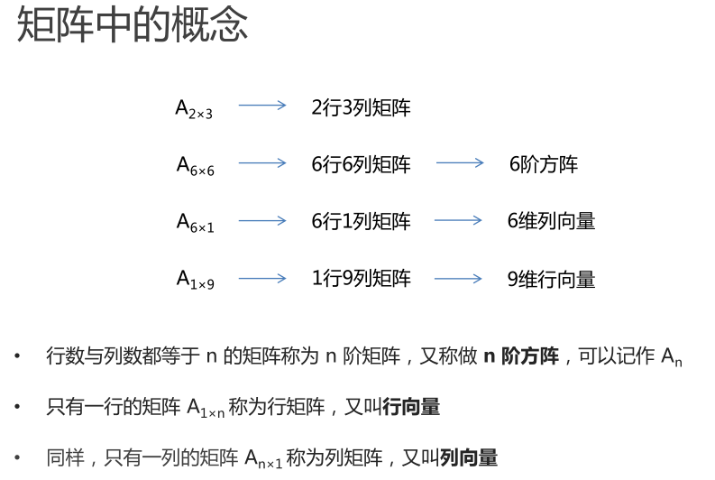
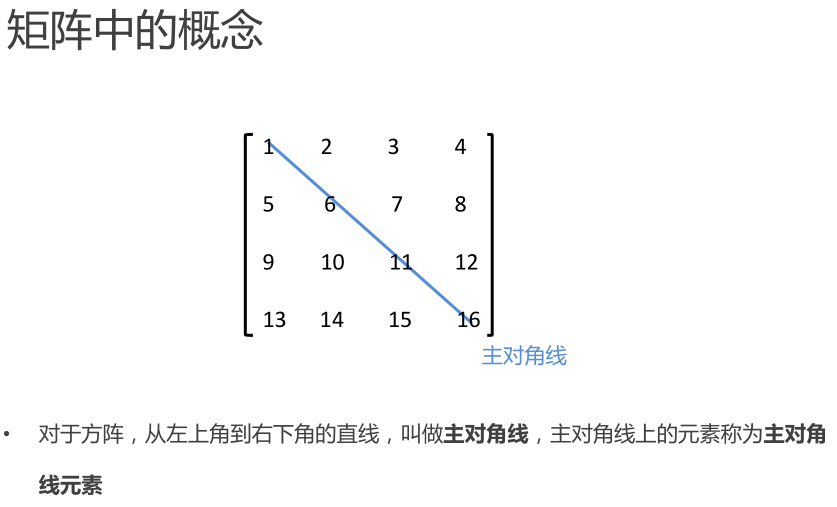
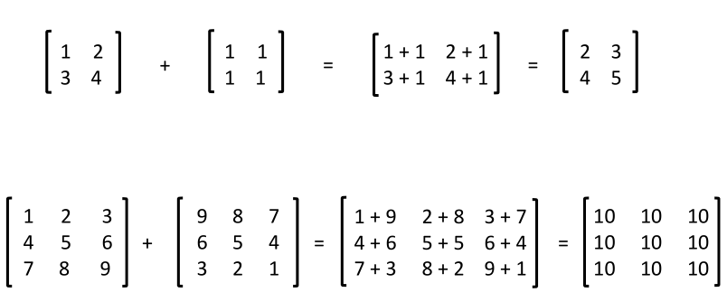
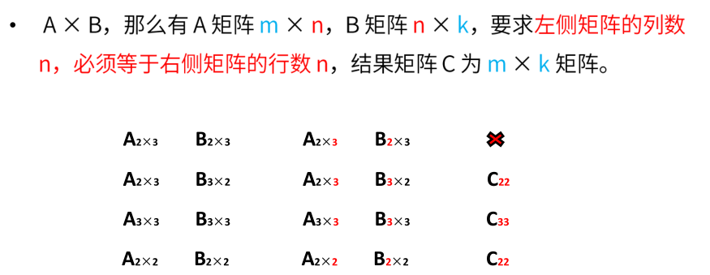
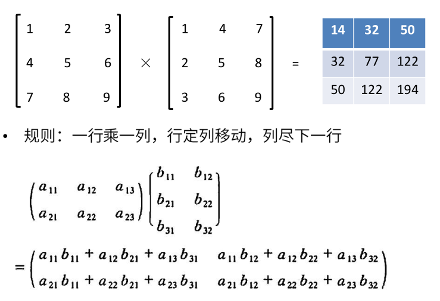
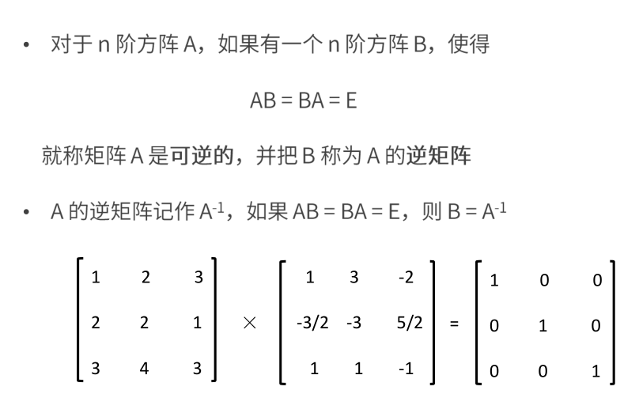
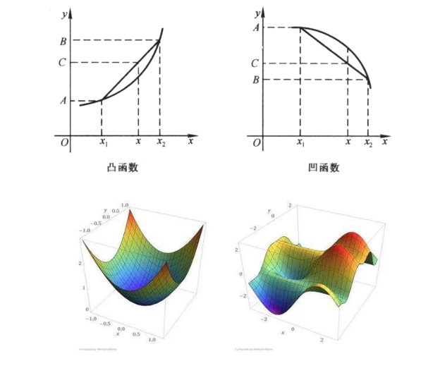
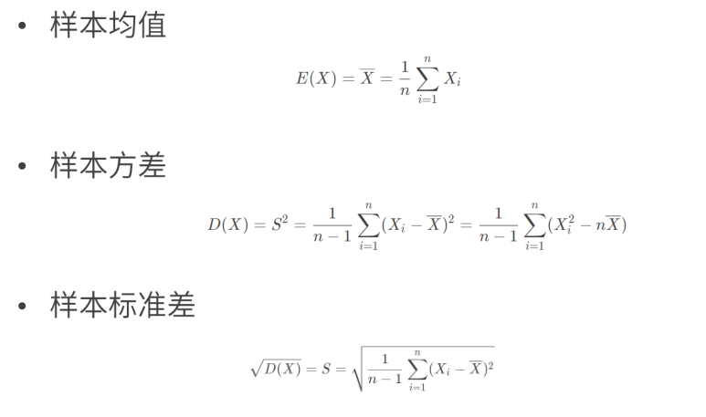

# 线性代数

概念

## 矩阵的加法

## 矩阵的乘法

## 矩阵的转置

## 矩阵的运算法则

## 矩阵的逆

# 微积分

## 导数

## 偏导数

## 方向导数

## 梯度 Gradient

## 凸函数和凹函数

- 凸函数，有极小值
  - 下凸函数
  - 斜线相交，交点内所有点均大于凸函数点
  - 反之凹函数

# 概率统计

## 常用统计变量

## 常见概率分布

## 常用概率公式

条件概率

- A发生的情况下B发生的概率

