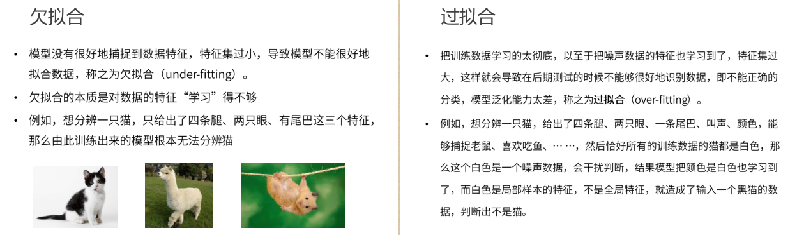
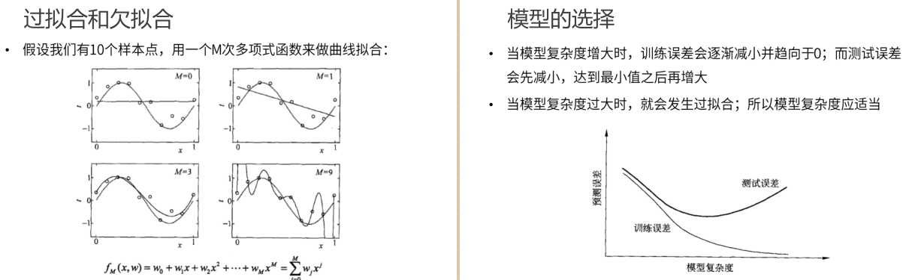
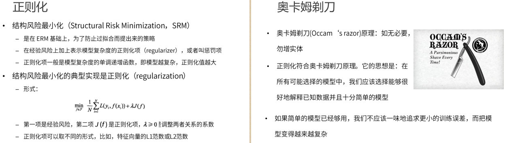
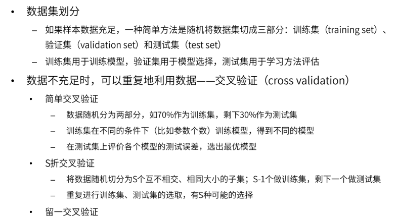
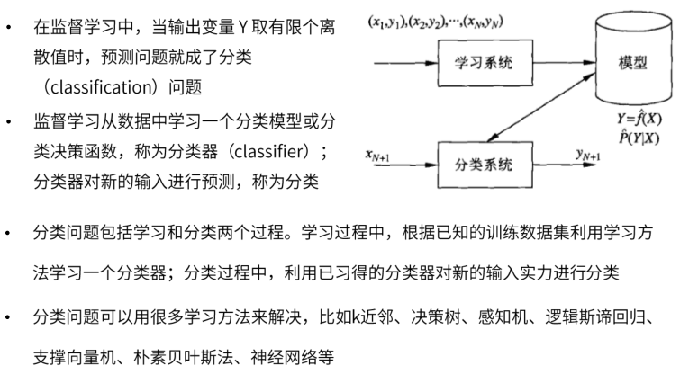
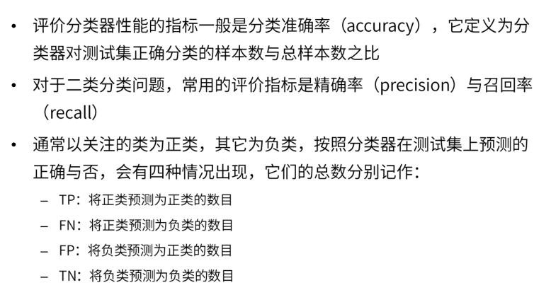
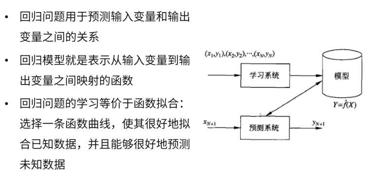
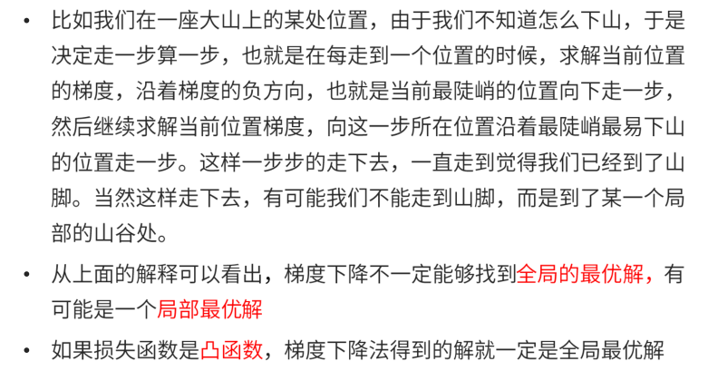

# 介绍

## 机器学习的分类

- 有监督学习
  - 提供数据并提供数据对应结果的机器学习过程
  - 有数据，有结果提供
- 无监督学习
  - 提供数据并且不提供数据对应结果的机器学习过程
  - 有数据，无结果

- 强化学习
  - 通过与环境交互获取延时返回进而改进行为的学习过程

### 无监督学习

- Unsupervised Learning
- 采用一组仅包含输入的数据，通过寻找数据中的内在结构来进行样本点的分组和聚类
- 算法是从没有被标记或分类的测试数据中学习
- 无监督学习算法不是响应反馈，而是要识别数据中的共性特征
  - 对于一个新数据，可以通过判断其中是否存在这种特征，来做出响应的反馈

- 核心应用
  - 统计学中的密度估计和聚类分析

- 应用

  - 谷歌新闻中每天收集新闻内容，对新闻内容分组，组成关联的新闻，按照主题显示给用户

  - 搜索新闻事件，自动的将他们聚类到一起，这些新闻都是同一主题的

### 监督学习

- Supervised Learning
- 构建了包含输入和所需输出的一组数据的数学模型
  - 数据为训练数据，由一组训练样本组成
- 监督学习主要包括==分类==和==回归==
- 分类算法
  - 当输出被限制为有限的一组值，离散值时使用
- 回归算法
  - 当输出可以具有范围内的任何数值（连续数值）时使用

- ==相似度学习==是回归与分类都密切相关的一类监督机器学习
  - 目标：使用相似性函数从样本中学习
  - 相似性函数可以度量两个对象之间的相似度或关联度
  - 场景
    - 排名，推荐系统，视觉识别跟踪，人脸识别等-
- 应用
  - 预测房价或房屋出售情况

### 强化学习

# 监督学习

## 三要素

- 模型 model
  - 总结数据的内在规律，用数学函数描述的系统
- 策略 strategy
  - 选取最优模型的评价准则
- 算法 algorithm
  - 选取最优模型的具体方法

## 实现步骤

- 一个有限的训练数据集
- 确定包含所有学习模型的集合
- 确定模型选择的准则---==学习策略==
- 实现求解最优模型的算法---==学习算法==

- 通过学习算法选择最优的模型
- 利用得到的最优模型，对新数据进行预测或分析

# 模型评估策略

- 模型评估
  - 训练集和测试集
  - 损失函数和经验风险
  - 训练误差和测试误差
- 模型选择
  - 过拟合和欠拟合
  - 正则化和交叉验证

## 训练集和测试集

- 训练集
  - 训练模型的数据
  - 输入到模型中对模型进行训练的数据集合
- 测试集
  - 测试模型的好坏的集合
  - 模型训练完成后，测试训练效果的数据集合

## 损失函数

- 用来衡量模型预测误差的大小
- 定义
  - 选取模型f为决策函数
  - 对于给定的输入参数X，f(X)为预测结果
  - Y为真实结果
  - L(Y,F(X))表示损失函数（loss function）
- 损失函数是系数的函数
- 损失函数值越小，模型越好

## 经验风险

## 训练误差和测试误差

# 过拟合与欠拟合

# 模型的选择

# 正则化

# 交叉验证

# 分类问题

# 精确率和召回率

# 回归问题

## 分类

# 模型求解算法

## 梯度下降法

## 牛顿法和拟牛顿法

