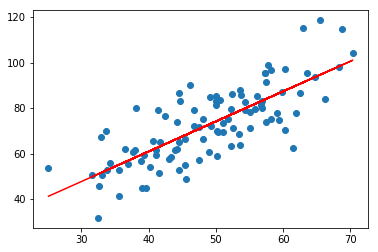

# 使用sklearn实现线性回归-最小二乘法

- from sklearn.linear_model import LinearRegression

```python
import numpy as np
import matplotlib.pyplot as plt

points = np.genfromtxt('data.csv', delimiter=',')

points[0,0]

# 提取points中的两列数据，分别作为x，y
x = points[:, 0]
y = points[:, 1]

# 用plt画出散点图
plt.scatter(x, y)
plt.show()
```


```python
# 损失函数是系数的函数，另外还要传入数据的x，y
def compute_cost(w, b, points):
    total_cost = 0
    M = len(points)
    
    # 逐点计算平方损失误差，然后求平均数
    for i in range(M):
        x = points[i, 0]
        y = points[i, 1]
        total_cost += ( y - w * x - b ) ** 2
    
    return total_cost/M
```


```python
# 使用sklearn框架，导入LinearRegression
from sklearn.linear_model import LinearRegression
lr = LinearRegression()

x_new = x.reshape(-1,1) # 将原先的一维数组转换为二维数组 -1 表示行数不限，1表示1列
y_new = y.reshape(-1,1)

# 要求传入的x和y是二维数组
lr.fit(x_new, y_new) 
```


    LinearRegression(copy_X=True, fit_intercept=True, n_jobs=None,
             normalize=False)


```python
# 从训练好的模型中提取系数和截距
print("w is",lr.coef_)
print("b is ",lr.intercept_)
```

    w is [[1.32243102]]
    b is  [7.99102098]

```python
w = lr.coef_[0][0]
b = lr.intercept_[0]

cost = compute_cost(w, b, points)

print("cost is: ", cost)
```

    cost is:  110.25738346621318

```python
plt.scatter(x, y)
# 针对每一个x，计算出预测的y值
pred_y = w * x + b

plt.plot(x, pred_y, c='r')
plt.show()
```




