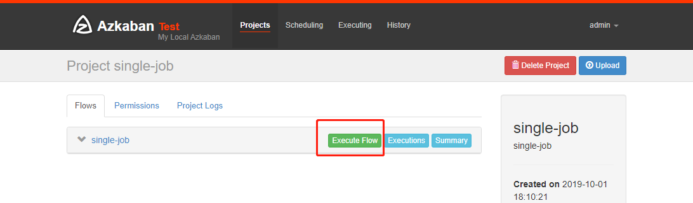
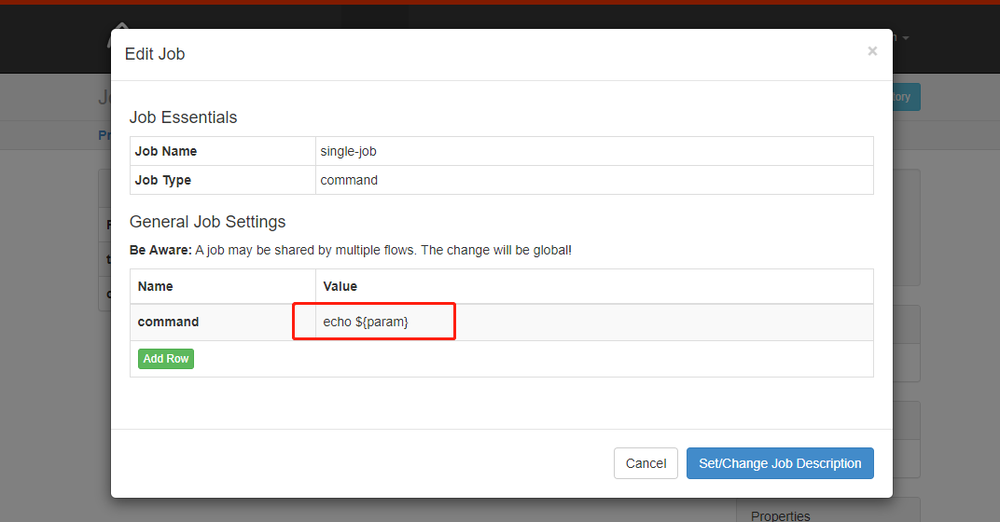
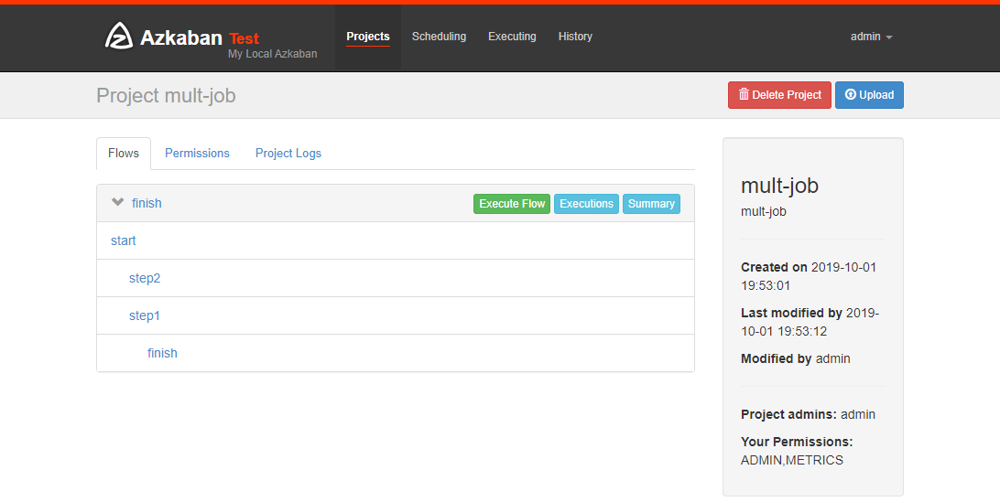
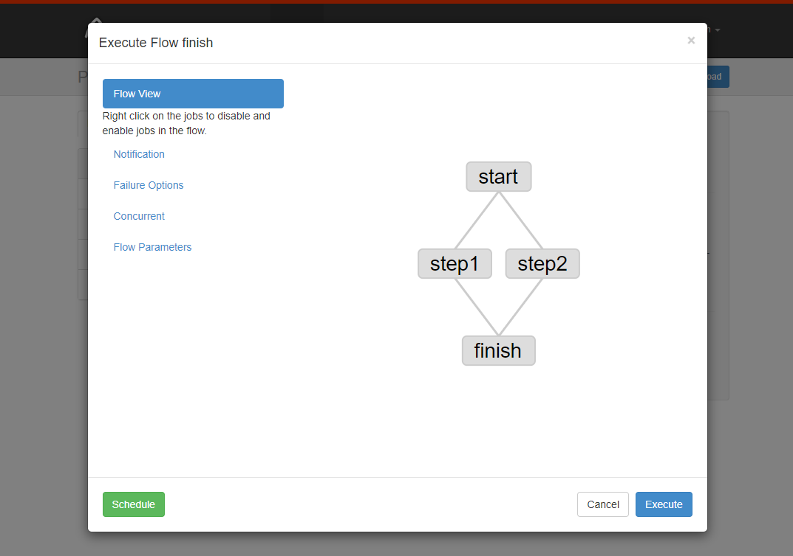
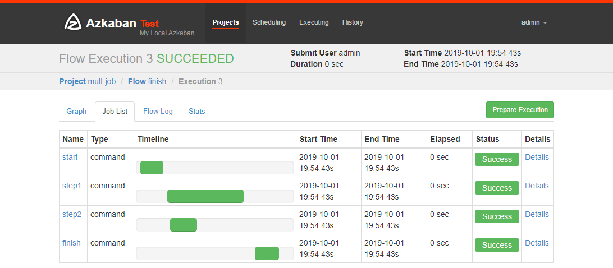

# 概述


## 为什么需要工作流调度系统

- 一个完整的数据分析系统通常都是由大量任务单元组成
  - shell脚本程序，java程序，mapreduce程序、hive脚本等

- 各任务单元之间存在时间先后及前后依赖关系

- 为了很好地组织起这样的复杂执行计划，需要一个工作流调度系统来调度执行

  - 如有这样一个需求，某个业务系统每天产生20G原始数据，每天都要对其进行处理

    - 通过Hadoop先将原始数据上传到HDFS上
      - HDFS的操作

    - 使用MapReduce对原始数据进行清洗
      - MapReduce的操作

    - 将清洗后的数据导入到hive表中
      - hive的导入操作

    - 对Hive中多个表的数据进行JOIN处理，得到一张hive的明细表
      - 创建中间表

    - 通过对明细表的统计和分析，得到结果报表信息
      - hive的查询操作


- 常见工作流调度系统
  - 简单的任务调度
    - 直接使用crontab实现
  - 复杂的任务调度
    - 开发调度平台或使用现成的开源调度系统
      - 如ooize、azkaban


## 什么是azkaban

- Azkaban是由Linkedin公司推出的一个批量工作流任务调度器
- 用于在一个工作流内以一个特定的顺序运行一组工作和流程
- 配置是通过简单的key:value对的方式
- 通过配置中的dependencies 来设置依赖关系
- Azkaban使用job配置文件建立任务之间的依赖关系
- 提供一个易于使用的web用户界面维护和跟踪你的工作流


- 区别
  - Oozie

    - workflow.xml，action节点，ok to
    - coordinator.xml 定时调度
    - 所有的信息存储在hdfs上，依赖hadoop版本
    - 调用hadoop接口

  - azkaban

    - a.job，dependencies=b.job

    - web

    - 所有调度信息存在mysql上，不依赖hadoop版本

    - 调用hadoop的shell命令

      

## 特点

- 兼容任何版本的hadoop

- 易于使用的Web用户界面

- 简单的工作流的上传

- 方便设置任务之间的关系

- 调度工作流

- 模块化和可插拔的插件机制

- 认证/授权(权限的工作)

- 能够杀死并重新启动工作流

- 有关失败和成功的电子邮件提醒


## 架构


- AzkabanWebServer
  - 是整个Azkaban工作流系统的主要管理者
  - 用户登录认证、负责project管理、定时执行工作流、跟踪工作流执行进度等一系列任务

-  AzkabanExecutorServer
  - 负责具体的工作流的提交、执行，它们通过mysql数据库来协调任务的执行

- 关系型数据库
  - MySQL
  - 存储大部分执行流状态


# 部署

- 下载地址:http://azkaban.github.io/downloads.html


## 准备

- 将Azkaban Web服务器、Azkaban执行服务器、Azkaban的sql执行脚本及MySQL安装包拷贝到hadoop103虚拟机/opt/software目录下
  - azkaban-web-server-2.5.0.tar.gz

  - azkaban-executor-server-2.5.0.tar.gz
  - azkaban-sql-script-2.5.0.tar.gz
  - mysql-libs.zip

- 选择Mysql作为Azkaban数据库，因为Azkaban建立了一些Mysql连接增强功能，以方便Azkaban设置。并增强服务可靠性


## 安装

- 解压

```bash
[ttshe@hadoop103 module]$ mkdir azkaban
[ttshe@hadoop103 software]$ tar -zxvf azkaban-web-server-2.5.0.tar.gz -C /opt/module/azkaban/
[ttshe@hadoop103 software]$ tar -zxvf azkaban-executor-server-2.5.0.tar.gz -C /opt/module/azkaban/
[ttshe@hadoop103 software]$ tar -zxvf azkaban-sql-script-2.5.0.tar.gz -C /opt/module/azkaban/
[ttshe@hadoop103 azkaban]$ mv azkaban-web-2.5.0/ server
[ttshe@hadoop103 azkaban]$ mv azkaban-executor-2.5.0/ executor
```

- sql脚本导入
  - 在hadoop102上传sql脚本
  - 进入mysql，创建azkaban数据库，并将解压的脚本导入到azkaban数据库
  - source后跟.sql文件，用于批量处理.sql文件中的sql语句

```bash
[ttshe@hadoop102 ~]$ mysql -u root -p123456
mysql> create database azkaban;
mysql> use azkaban;
mysql> source /opt/software/azkaban/azkaban-2.5.0/create-all-sql-2.5.0.sql;
```


### 生成秘钥对和证书

- 给web服务添加证书，用于https访问

- Keytool是java数据证书的管理工具，使用户能够管理自己的公/私钥对及相关证书
- -keystore
  - 指定密钥库的名称及位置
  - 产生的各类信息将存在.keystore文件中
- -genkey
  - 或者-genkeypair
  - 生成密钥对
- -alias
  - 为生成的密钥对指定别名
  - 如果没有默认是mykey
- -keyalg
  - 指定密钥的算法
    - RSA/DSA
    - 默认是DSA
- 生成 keystore的密码及相应信息的密钥库

```bash
[ttshe@hadoop103 azkaban-2.5.0]$ keytool -keystore keystore -alias jetty -genkey -keyalg RSA
输入密钥库口令: 123456 
再次输入新口令: 
您的名字与姓氏是什么?
  [Unknown]:  
您的组织单位名称是什么?
  [Unknown]:  
您的组织名称是什么?
  [Unknown]:  
您所在的城市或区域名称是什么?
  [Unknown]:  
您所在的省/市/自治区名称是什么?
  [Unknown]:  
该单位的双字母国家/地区代码是什么?
  [Unknown]:  
CN=Unknown, OU=Unknown, O=Unknown, L=Unknown, ST=Unknown, C=Unknown是否正确?
  [否]:  y
输入 <jetty> 的密钥口令
	(如果和密钥库口令相同, 按回车):  
You have new mail in /var/spool/mail/ttshe
```

- 密钥库的密码至少必须6个字符，可以是纯数字或者字母或者数字和字母的组合等等
- 密钥库的密码最好和<jetty> 的密钥相同，方便记忆

- 查看秘钥对

```bash
[ttshe@hadoop103 azkaban-2.5.0]$ keytool -keystore keystore -list
输入密钥库口令:  

密钥库类型: JKS
密钥库提供方: SUN

您的密钥库包含 1 个条目

jetty, 2019-10-1, PrivateKeyEntry, 
证书指纹 (SHA1): 49:14:5A:F4:8C:49:4E:B6:8B:B8:C8:44:A8:07:5A:79:15:52:2B:1A
```

- 将keystore 拷贝到 azkaban web服务器根目录中 

```bash
[ttshe@hadoop103 azkaban-2.5.0]$ mv keystore /opt/module/azkaban/server/
```


### 时间同步配置

- 先配置好服务器节点上的时区
- 如果在/usr/share/zoneinfo/这个目录下不存在时区配置文件Asia/Shanghai，就要用 tzselect 生成

```bash
[atguigu@hadoop102 azkaban]$ tzselect
Please identify a location so that time zone rules can be set correctly.
Please select a continent or ocean.
 1) Africa
 2) Americas
 3) Antarctica
 4) Arctic Ocean
 5) Asia
 6) Atlantic Ocean
 7) Australia
 8) Europe
 9) Indian Ocean
10) Pacific Ocean
11) none - I want to specify the time zone using the Posix TZ format.
#? 5
Please select a country.
 1) Afghanistan           18) Israel                35) Palestine
 2) Armenia               19) Japan                 36) Philippines
 3) Azerbaijan            20) Jordan                37) Qatar
 4) Bahrain               21) Kazakhstan            38) Russia
 5) Bangladesh            22) Korea (North)         39) Saudi Arabia
 6) Bhutan                23) Korea (South)         40) Singapore
 7) Brunei                24) Kuwait                41) Sri Lanka
 8) Cambodia              25) Kyrgyzstan            42) Syria
 9) China                 26) Laos                  43) Taiwan
10) Cyprus                27) Lebanon               44) Tajikistan
11) East Timor            28) Macau                 45) Thailand
12) Georgia               29) Malaysia              46) Turkmenistan
13) Hong Kong             30) Mongolia              47) United Arab Emirates
14) India                 31) Myanmar (Burma)       48) Uzbekistan
15) Indonesia             32) Nepal                 49) Vietnam
16) Iran                  33) Oman                  50) Yemen
17) Iraq                  34) Pakistan
#? 9
Please select one of the following time zone regions.
1) Beijing Time
2) Xinjiang Time
#? 1

The following information has been given:

        China
        Beijing Time

Therefore TZ='Asia/Shanghai' will be used.
Local time is now:      Thu Oct 18 16:24:23 CST 2018.
Universal Time is now:  Thu Oct 18 08:24:23 UTC 2018.
Is the above information OK?
1) Yes
2) No
#? 1

You can make this change permanent for yourself by appending the line
        TZ='Asia/Shanghai'; export TZ
to the file '.profile' in your home directory; then log out and log in again.

Here is that TZ value again, this time on standard output so that you
can use the /usr/bin/tzselect command in shell scripts:
Asia/Shanghai
```

- 拷贝该时区文件，覆盖系统本地时区配置

```bash
[atguigu@hadoop102 azkaban]$ cp /usr/share/zoneinfo/Asia/Shanghai /etc/localtime
```

- 集群时间同步（同时发给三个窗口）

```bash
[atguigu@hadoop102 azkaban]$ sudo date -s '2018-10-18 16:39:30'
```


### 配置


#### web服务配置

- 进入azkaban web服务器安装目录 conf目录

  

##### azkaban.properties

```bash
[ttshe@hadoop103 conf]$ pwd
/opt/module/azkaban/server/conf
[ttshe@hadoop103 conf]$ vim azkaban.properties 
```

```properties
#Azkaban Personalization Settings
#服务器UI名称,用于服务器上方显示的名字
azkaban.name=Test
#描述
azkaban.label=My Local Azkaban
#UI颜色
azkaban.color=#FF3601
azkaban.default.servlet.path=/index
#默认web server存放web文件的目录 ***
web.resource.dir=/opt/module/azkaban/server/web/
#默认时区,已改为亚洲/上海 默认为美国 ***
default.timezone.id=Asia/Shanghai

#Azkaban UserManager class
user.manager.class=azkaban.user.XmlUserManager
#用户权限管理默认类（绝对路径）***
user.manager.xml.file=/opt/module/azkaban/server/conf/azkaban-users.xml

#Loader for projects
#global配置文件所在位置（绝对路径）***
executor.global.properties=/opt/module/azkaban/executor/conf/global.properties
azkaban.project.dir=projects

#数据库类型
database.type=mysql
#端口号
mysql.port=3306
#数据库连接IP ***
mysql.host=hadoop102 
#数据库实例名
mysql.database=azkaban
#数据库用户名 ***
mysql.user=root
#数据库密码 ***
mysql.password=123456
#最大连接数
mysql.numconnections=100

# Velocity dev mode
velocity.dev.mode=false

# Azkaban Jetty server properties.
# Jetty服务器属性.
#最大线程数
jetty.maxThreads=25
#Jetty SSL端口
jetty.ssl.port=8443
#Jetty端口
jetty.port=8081
#SSL文件名（绝对路径）***
jetty.keystore=/opt/module/azkaban/server/keystore
#SSL文件密码 ***
jetty.password=123456
#Jetty主密码与keystore文件相同 ***
jetty.keypassword=123456
#SSL文件名（绝对路径）***
jetty.truststore=/opt/module/azkaban/server/keystore
#SSL文件密码 ***
jetty.trustpassword=123456

# Azkaban Executor settings
executor.port=12321

# mail settings
mail.sender=
mail.host=
job.failure.email=
job.success.email=

lockdown.create.projects=false
cache.directory=cache
```


##### azkaban-users.xml

- 在azkaban web服务器安装目录 conf目录
- 按照如下配置修改azkaban-users.xml 文件，增加管理员用户

```bash
[ttshe@hadoop103 conf]$ vim azkaban-users.xml 
```

```xml
<azkaban-users>
	<user username="azkaban" password="azkaban" roles="admin" groups="azkaban" />
	<user username="metrics" password="metrics" roles="metrics"/>
    <!--增加admin用户-->
	<user username="admin" password="admin" roles="admin,metrics"/>
	<role name="admin" permissions="ADMIN" />
	<role name="metrics" permissions="METRICS"/>
</azkaban-users>
```


#### executor服务器配置

- 进入执行服务器安装目录conf，打开azkaban.properties

```bash
[ttshe@hadoop103 conf]$ pwd
/opt/module/azkaban/executor/conf
[ttshe@hadoop103 conf]$ vim azkaban.properties
```

```properties
#Azkaban
#时区 ***
default.timezone.id=Asia/Shanghai

# Azkaban JobTypes Plugins
#jobtype 插件所在位置
azkaban.jobtype.plugin.dir=plugins/jobtypes

#Loader for projects ***
executor.global.properties=/opt/module/azkaban/executor/conf/global.properties
azkaban.project.dir=projects

database.type=mysql
mysql.port=3306
mysql.host=hadoop102
mysql.database=azkaban
mysql.user=root
mysql.password=123456
mysql.numconnections=100

# Azkaban Executor settings
#最大线程数
executor.maxThreads=50
#端口号(如修改,请与web服务中一致)
executor.port=12321
#线程数
executor.flow.threads=30
```


## 启动

- 先执行executor，再执行web，避免Web Server会因为找不到执行器启动失败

- 在executor服务器目录下执行启动命令

```bash
[ttshe@hadoop103 executor]$ pwd
/opt/module/azkaban/executor
[ttshe@hadoop103 executor]$ bin/azkaban-executor-start.sh
```

- 在azkaban web服务器目录下执行启动命令

```bash
[ttshe@hadoop103 server]$ pwd
/opt/module/azkaban/server
[ttshe@hadoop103 server]$ bin/azkaban-web-start.sh
```

- 查看jps

```bash
[ttshe@hadoop103 ~]$ jps
11889 AzkabanExecutorServer
12033 Jps
11973 AzkabanWebServer
```

- 访问https://hadoop103:8443/
  - 用户名和密码都是admin


# 使用

- Azkaba内置的任务类型支持
  - command
  - java
- 需要其他类型需要安装插件


## 单一job

- 创建job描述文件

```bash
[ttshe@hadoop103 server]$ mkdir job
[ttshe@hadoop103 server]$ cd job
[ttshe@hadoop103 job]$ vim single-job.job
```

```bash
type=command
command=echo 'this is my first job'
```

- 将job压缩成zip文件

```bash
[ttshe@hadoop103 job]$ zip single-job.zip single-job.job 
  adding: single-job.job (deflated 10%)
```

- Azkaban上传的工作流文件只支持xxx.zip文件
- zip应包含xxx.job运行作业所需的文件和任何文件
  - 文件名后缀必须以.job结尾，否则无法识别
  - 作业名称在项目中必须是唯一的

- 通过azkaban的web管理平台创建project并上传job的zip包
- 创建project


- 上传zip文件


- 执行工作流



- 执行


- 点击继续


- 执行成功


- 点击detail可以查看日志


### 页面修改job命令

- 从web页面中修改job，再执行




- 执行之前添加参数，再点击执行


## 多job

- 创建有依赖关系的多个job描述
- start.job

```bash
[ttshe@hadoop102 jobs]$ vim start.job
#start.job
type=command
command=touch /opt/module/kangkang.txt
```

- step1.job
  - step1.job依赖start.job

```bash
[ttshe@hadoop102 jobs]$ vim step1.job
#step1.job
type=command
dependencies=start
command=echo "this is step1 job"
```

- step2.job
  - step2.job依赖start.job

```bash
[ttshe@hadoop102 jobs]$ vim step2.job
#step2.job
type=command
dependencies=start
command=echo "this is step2 job"
```

- finish.job
  - finish.job依赖step1.job和step2.job

```bash
[ttshe@hadoop102 jobs]$ vim finish.job
#finish.job
type=command
dependencies=step1,step2
command=echo "this is finish job"
```

- 将所有job资源文件打到一个zip包中

```bash
[ttshe@hadoop102 jobs]$ zip jobs.zip start.job step1.job step2.job finish.job
updating: start.job (deflated 16%)
  adding: step1.job (deflated 12%)
  adding: step2.job (deflated 12%)
  adding: finish.job (deflated 14%) 
```

- 在azkaban的web管理界面创建工程并上传zip包





- 点击执行，查看结果



- 思考：将student.txt文件上传到hdfs，根据所传文件创建外部表，再将表中查询到的结果写入到本地文件


## java操作任务

- 使用Azkaban调度java程序

```java
import java.io.IOException;

public class AzkabanTest {
	public void run() throws IOException {
        // 根据需求编写具体代码
		FileOutputStream fos = new FileOutputStream("/opt/module/azkaban/output.txt");
		fos.write("this is a java progress".getBytes());
		fos.close();
    }

	public static void main(String[] args) throws IOException {
		AzkabanTest azkabanTest = new AzkabanTest();
		azkabanTest.run();
	}
}
```

- 方式1
  - 将java程序打成jar包，创建lib目录，将jar放入lib内
  - 编写job文件

```bash
[ttshe@hadoop103 azkaban]$ mkdir lib
[ttshe@hadoop103 azkaban]$ cd lib/
[ttshe@hadoop104 lib]$ ll

-rw-r--r--. 1 ttshe ttshe 170136 10月  1 20:01 big-data-0.0.1.jar
```

```text
[atguigu@hadoop102 jobs]$ vim azkabanJava.job
#azkabanJava.job
type=javaprocess
java.class=com.stt.azkaban.AzkabanTest
classpath=/opt/module/azkaban/lib/big-data-0.0.1.jar
```

- 方式2
  - 将java程序的jar包和job文件生成一个zip文件
  - 此时的job文件

```bash
type=javaprocess
java.class=com.stt.demo.azkaban.AzkabanTest
classpath=./big-data-0.0.1.jar
```


## HDFS操作任务

- job文件

```bash
[atguigu@hadoop102 jobs]$ vim fs.job
#hdfs job
type=command
command=/opt/module/hadoop-2.7.2/bin/hadoop fs -mkdir /azkaban
```

- 将job资源文件打包成zip文件
- 通过azkaban的web管理平台创建project并上传job压缩包
- 启动执行该job
- 查看结果


## MapReduce任务

- mapreduce任务依然可以使用azkaban进行调度

- 创建job描述文件，及mr程序jar包

```bash
[atguigu@hadoop102 jobs]$ vim mapreduce.job

type=command
command=/opt/module/hadoop-2.7.2/bin/hadoop jar /opt/module/hadoop-2.7.2/share/hadoop/mapreduce/hadoop-mapreduce-examples-2.7.2.jar wordcount /wordcount/input /wordcount/output
```

- 将所有job资源文件打到一个zip包

- 在azkaban的web管理界面创建工程并上传zip包

- 启动job

- 查看结果


## Hive脚本任务

- 创建job描述文件和hive脚本

- Hive脚本：student.sql

```sql
[atguigu@hadoop102 jobs]$ vim student.sql
use default;
drop table student;
create table student(id int, name string)
row format delimited fields terminated by '\t';
load data local inpath '/opt/module/datas/student.txt' into table student;
insert overwrite local directory '/opt/module/datas/student'
row format delimited fields terminated by '\t'
select * from student;
```

- Job描述文件：hive.job

```job
[atguigu@hadoop102 jobs]$ vim hive.job

type=command
command=/opt/module/hive/bin/hive -f /opt/module/azkaban/jobs/student.sql
```

- 将所有job资源文件打到一个zip包中
- 在azkaban的web管理界面创建工程并上传zip包
- 启动job
- 查看结果

```bash
[atguigu@hadoop102 student]$ cat /opt/module/datas/student/000000_0 

1001    yangyang
1002    huihui
1003    banzhang
1004    pengpeng
```


