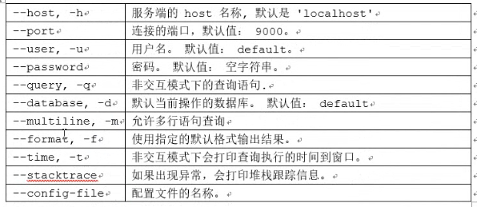
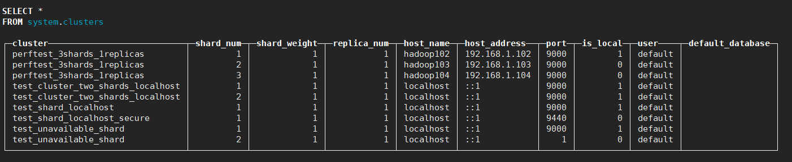
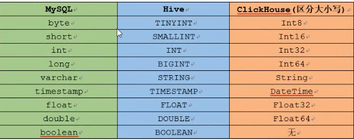
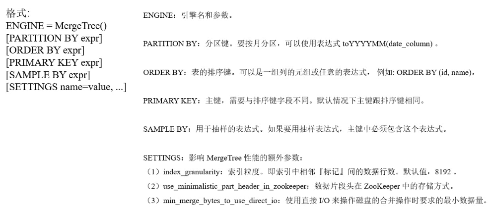
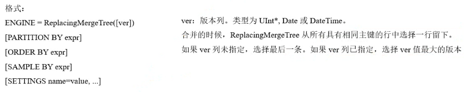
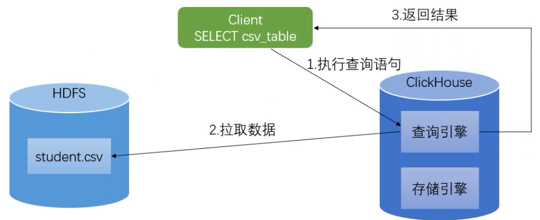
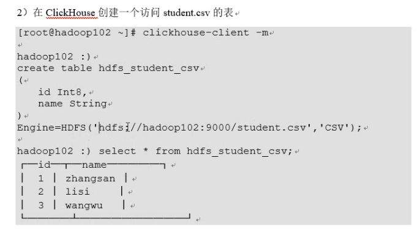
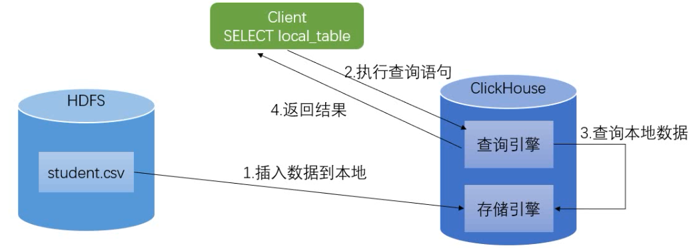

# 概述

- ClickHouse 是俄罗斯的Yandex于2016年开源的**列式存储数据库**（DBMS）
  - hbase也是列式存储

- 主要用于在线分析处理查询（OLAP），能够使用SQL查询实时生成分析数据报告。


## 关于列式存储


以下面的表为例：

| Id   | Name | Age  |
| ---- | ---- | ---- |
| 1    | 张三 | 18   |
| 2    | 李四 | 22   |
| 3    | 王五 | 34   |

- 采用行式存储时，数据在磁盘上的组织结构为：

| 1    | 张三 | 18   | 2    | 李四 | 22   | 3    | 王五 | 34   |
| ---- | ---- | ---- | ---- | ---- | ---- | ---- | ---- | ---- |
|      |      |      |      |      |      |      |      |      |

- 好处
  - 查某个人所有的属性时，可通过一次磁盘查找加顺序读取就可以

- 缺点
  - 当想查所有人的年龄时，需要不停的查找，或者全表扫描才行，遍历的很多数据都是不需要的

- 而采用列式存储时，数据在磁盘上的组织结构为：

| 1    | 2    | 3    | 张三 | 李四 | 王五 | 18   | 22   | 34   |
| ---- | ---- | ---- | ---- | ---- | ---- | ---- | ---- | ---- |
|      |      |      |      |      |      |      |      |      |

- 查所有人的年龄只需把年龄那一列拿出来


# 安装


## 准备

- CentOS取消打开文件数限制
  - 在/etc/security/limits.conf、/etc/security/limits.d/90-nproc.conf这2个文件的末尾加入一下内容

```bash
[root@hadoop102 software]# vim /etc/security/limits.conf
# 在文件末尾添加：
* soft nofile 65536 
* hard nofile 65536 
* soft nproc 131072 
* hard nproc 131072

[root@hadoop102 software]# vim /etc/security/limits.d/90-nproc.conf
# 在文件末尾添加：
* soft nofile 65536 
* hard nofile 65536 
* soft nproc 131072 
* hard nproc 131072
```

- 重启服务器之后生效，用ulimit -n 或者ulimit -a查看设置结果

```bash
[root@hadoop102 ~]# ulimit -n
65536
```

- CentOS取消SELINUX
  - 修改/etc/selinux/config中的SELINUX=disabled后重启

```bash
[root@hadoop102 ~]# vim /etc/selinux/config
SELINUX=disabled
```

- 关闭防火墙

```bash
[root@hadoop102 ~]# service iptables stop 
[root@hadoop102 ~]# service ip6tables stop
ip6tables：将 chains 设置为 ACCEPT 策略：filter            [确定]
ip6tables：清除防火墙规则：                                [确定]
：正在卸载模块：                                           [确定]
```

- 安装依赖

```bash
[root@hadoop102 ~]# yum install -y libtool
[root@hadoop102 ~]# yum install -y *unixODBC*
```


## 单机模式

- 注意在root用户模式下操作

- 上传安装包

```bash
[root@hadoop102 clickhouse]$ ll
总用量 33156
-rw-r--r-- 1 ttshe ttshe     6372 9月  10 01:01 clickhouse-client-19.7.3.9-1.el6.x86_64.rpm
-rw-r--r-- 1 ttshe ttshe 25761196 9月   9 23:06 clickhouse-common-static-19.7.3.9-1.el6.x86_64.rpm
-rw-r--r-- 1 ttshe ttshe  8163508 9月   9 22:46 clickhouse-server-19.7.3.9-1.el6.x86_64.rpm
-rw-r--r-- 1 ttshe ttshe     9940 9月   9 22:41 clickhouse-server-common-19.7.3.9-1.el6.x86_64.rpm
```

- 安装
  - 如果一个个安装，则有安装顺序的要求

```bash
[root@hadoop102 clickhouse]$ rpm -ivh *.rpm
```


### 常用命令

- 启动服务端

```bash
[root@hadoop102 software]# service clickhouse-server start
Start clickhouse-server service: Path to data directory in /etc/clickhouse-server/config.xml: /var/lib/clickhouse/
DONE
```

- 查看状态

```bash
[root@hadoop102 software]# service clickhouse-server status
clickhouse-server service is running
```

- 关闭服务

```bash
[root@hadoop102 software]# service clickhouse-server stop
```

- 启动客户端

```bash
[root@hadoop102 software]# clickhouse-client
```

- 查看帮助

```bash
[root@hadoop102 software]# clickhouse-client -help
```


### 客户端常用参数




## 集群模式

- 在hadoop103，hadoop104上面执行之前的所有步骤


### 配置


#### config.xml

- 三台机器修改配置文件config.xml

```bash
[root@hadoop102 ~]# vim /etc/clickhouse-server/config.xml

<listen_host>::</listen_host> # 解除注释，可以被其他的机器访问
<!-- <listen_host>::1</listen_host> -->
<!-- <listen_host>127.0.0.1</listen_host> -->

[root@hadoop103 ~]# vim /etc/clickhouse-server/config.xml

<listen_host>::</listen_host>

[root@hadoop104 ~]# vim /etc/clickhouse-server/config.xml
<listen_host>::</listen_host>
```


#### metrika.xml

- 在三台机器的etc目录下新建metrika.xml文件

```bash
[root@hadoop102 ~]# vim /etc/metrika.xml
#添加如下内容：一个集群，3个分片，1个副本
```

```xml
<yandex>
    <clickhouse_remote_servers>
        <perftest_3shards_1replicas> # 名称自定义
            <shard>
                <internal_replication>true</internal_replication> # 开启自动复制
                <replica>
                    <host>hadoop102</host>
                    <port>9000</port>
                </replica>
            </shard>
            <shard>
                <replica>
                    <internal_replication>true</internal_replication>
                    <host>hadoop103</host>
                    <port>9000</port>
                </replica>
            </shard>
            <shard>
                <internal_replication>true</internal_replication>
                <replica>
                    <host>hadoop104</host>
                    <port>9000</port>
                </replica>
            </shard>
        </perftest_3shards_1replicas>
    </clickhouse_remote_servers>

    <zookeeper-servers>
        <node index="1">
            <host>hadoop102</host>
            <port>2181</port>
        </node>
        <node index="2">
            <host>hadoop103</host>
            <port>2181</port>
        </node>
        <node index="3">
            <host>hadoop104</host>
            <port>2181</port>
        </node>
    </zookeeper-servers>

    <macros>
        <replica>r01</replica> #注意需要根据机器不同去修改,每台机器要不同
    </macros>

    <networks>
        <ip>::/0</ip>
    </networks>

    <clickhouse_compression>
        <case>
            <min_part_size>10000000000</min_part_size>
            <min_part_size_ratio>0.01</min_part_size_ratio>                                     
            <method>lz4</method>
        </case>
    </clickhouse_compression>
</yandex>
```


### 启动

- 启动zk
- 启动服务

```bash
[root@hadoop102 etc]# service clickhouse-server start
[root@hadoop103 etc]# service clickhouse-server start
[root@hadoop104 etc]# service clickhouse-server start
```

- 访问客户端

```bash
[root@hadoop102 etc]# clickhouse-client
```

- 查看集群

```sql
hadoop102 :) select * from system.clusters
```




# 数据类型




- 文档https://clickhouse.yandex/docs/zh/data_types/


## 整型

固定长度的整型，包括有符号整型或无符号整型。

整型范围（-2<sup>n-1</sup>~2<sup>n-1</sup>-1）：

Int8 - [-128 : 127]

Int16 - [-32768 : 32767]

Int32 - [-2147483648 : 2147483647]

Int64 - [-9223372036854775808 : 9223372036854775807]

无符号整型范围（0~2<sup>n-1</sup>）：

UInt8 - [0 : 255]

UInt16 - [0 : 65535]

UInt32 - [0 : 4294967295]

UInt64 - [0 : 18446744073709551615]


## 浮点型

Float32 - float

Float64 – double

- 建议尽可能以整数形式存储数据
  - 如将固定精度的数字转换为整数值
  - 如时间用毫秒为单位表示
  - 因为浮点型进行计算时可能引起四舍五入的误差
- 计算1-0.9得到的结果会有误差

```sql
hadoop102 :) select (1-0.9)

SELECT 1 - 0.9

┌───────minus(1, 0.9)─┐
│ 0.09999999999999998 │
└─────────────────────┘
```

与标准SQL相比，ClickHouse 支持以下类别的浮点数：

Inf-正无穷：

```sql
:) select 1/0

┌─divide(1, 0)─┐
│          inf │
└──────────────┘
```

-Inf-负无穷：

```sql
:) select -1/0

┌─divide(1, 0)─┐
│         -inf │
└──────────────┘
```

NaN-非数字：

```sql
:) select 0/0

┌─divide(0, 0)─┐
│          nan │
└──────────────┘
```


## 布尔类型

- 没有单独的类型来存储布尔值。可以使用 UInt8 类型，取值限制为 0 或 1

- 可以使用enum实现boolean类型


## 字符串


### String

字符串可以任意长度的。它可以包含任意的字节集，包含空字节


### FixedString(N)

固定长度 N 的字符串，N 必须是严格的正自然数。当服务端读取长度小于 N 的字符串时候，通过在字符串末尾添加空字节来达到 N 字节长度。 当服务端读取长度大于 N 的字符串时候，将返回错误消息。

与String相比，极少会使用FixedString，因为使用起来不是很方便


## 枚举类型

包括 Enum8 和 Enum16 类型。Enum 保存 'string'= integer 的对应关系。

Enum8 用 'String'= Int8 对描述。

Enum16 用 'String'= Int16 对描述。

用法演示：

创建一个带有一个枚举 Enum8('hello' = 1, 'world' = 2) 类型的列

```sql
CREATE TABLE t_enum(
    x Enum8('hello' = 1, 'world' = 2)
)
ENGINE = TinyLog
```

这个 x 列只能存储类型定义中列出的值：'hello'或'world'

- 如果尝试保存任何其他值，ClickHouse 抛出异常

```sql
:) INSERT INTO t_enum VALUES ('hello'), ('world'), ('hello')

INSERT INTO t_enum VALUES

Ok.

3 rows in set. Elapsed: 0.002 sec.

:) insert into t_enum values('a')

INSERT INTO t_enum VALUES

Exception on client:
Code: 49. DB::Exception: Unknown element 'a' for type Enum8('hello' = 1, 'world' = 2)
```

从表中查询数据时，ClickHouse 从 Enum 中输出字符串值

```sql
SELECT * FROM t_enum
```

如果需要看到对应行的数值，则必须将 Enum 值转换为整数类型

```sql
SELECT CAST(x, 'Int8') FROM t_enum

┌─CAST(x, 'Int8')─┐
│               1 │
│               2 │
│               1 │
└─────────────────┘
```


## 数组

- Array(T)
  - 由 T 类型元素组成的数组。
  - T 可以是任意类型，包含数组类型。 但不推荐使用多维数组
  - ClickHouse 对多维数组的支持有限
    - 如不能在 MergeTree 表中存储多维数组
- 可以使用array函数来创建数组

```sql
array(T)
```

- 可以使用方括号

```sql
[]
```

- 示例

```sql
hadoop102 :) select array(1,2,3) as arr,toTypeName(arr)

SELECT 
    [1, 2, 3] AS arr, 
    toTypeName(arr)

┌─arr─────┬─toTypeName(array(1, 2, 3))─┐
│ [1,2,3] │ Array(UInt8)               │
└─────────┴────────────────────────────┘
```


## 元组

- Tuple(T1,T2...) 
- 每个元素有单独的类型

- 示例

```sql
hadoop102 :) select tuple(1,'a') as tu ,toTypeName(tu)

SELECT 
    (1, 'a') AS tu, 
    toTypeName(tu)

┌─tu──────┬─toTypeName(tuple(1, 'a'))─┐
│ (1,'a') │ Tuple(UInt8, String)      │
└─────────┴───────────────────────────┘
```


## Date

- 日期类型，用两个字节存储，表示从 1970-01-01 (无符号) 到当前的日期值


# 表引擎

表引擎（即表的类型）决定了

1）数据的存储方式和位置，写到哪里以及从哪里读取数据

2）支持哪些查询以及如何支持。

3）并发数据访问。

4）索引的使用（如果存在）。

5）是否可以执行多线程请求。

6）数据复制参数。

- ClickHouse的表引擎有很多，下面介绍其中几种
- 其他引擎查阅官方文档：https://clickhouse.yandex/docs/zh/operations/table_engines/


## TinyLog

- 最简单的表引擎
- 将数据存储在磁盘上
- ==每列都存储在单独的压缩文件中==
- 写入时将数据附加到文件末尾

- 该引擎没有并发控制
  - 如果同时从表中读取和写入数据，则读取操作将抛出异常
  - 如果同时写入多个查询中的表，则数据将被破坏
  - 只能单线程

- 典型用法是 write-once
  - 只写入一次数据，根据需要多次读取
  - 适用于相对较小的表
    - 建议最多1,000,000行
  - 如果有许多小表，则使用此表引擎是适合的，因为它比需要打开的文件更少
  - 当拥有大量小表时，可能会导致性能低下，不支持索引

- 案例：创建一个TinyLog引擎的表并插入一条数据

```sql
:)create table t (a UInt16, b String) ENGINE=TinyLog;
:)insert into t (a, b) values (1, 'abc');
```

- 查看存储结构
  - a.bin 和 b.bin 是压缩过的对应的列的数据
  -  sizes.json 中记录了每个 *.bin 文件的大小

```bash
[root@hadoop102 t]# pwd
/var/lib/clickhouse/data/default/t
[root@hadoop102 t]# ll
总用量 12
-rw-r----- 1 clickhouse clickhouse 28 12月 23 19:37 a.bin
-rw-r----- 1 clickhouse clickhouse 30 12月 23 19:37 b.bin
-rw-r----- 1 clickhouse clickhouse 60 12月 23 19:37 sizes.json
[root@hadoop102 t]# cat sizes.json 
{"yandex":{"a%2Ebin":{"size":"28"},"b%2Ebin":{"size":"30"}}}
```


## Memory

- 内存引擎
- 数据以未压缩的原始形式直接保存在内存当中，服务器重启数据就会消失
- 读写操作不会相互阻塞
- 不支持索引
- 简单查询下有非常非常高的性能表现（超过10G/s）

- 一般用到它的地方不多，除了用来测试
  - 在需要非常高的性能，同时数据量又不太大（上限大概 1 亿行）的场景


## Merge

- 本身不存储数据
- 可用于同时从任意多个其他的表中读取数据
- 读是自动并行
- ==不支持写入==
- 读取时，那些被真正读取到数据的表的索引（如果有的话）会被使用

- 引擎的参数
  - 一个数据库名和一个用于匹配表名的正则表达式

- 案例
  - 先建t1，t2，t3三个表，然后用 Merge 引擎的 t 表再把它们链接起来

```sql
create table t1(id UInt16, name String) engine=TinyLog;
create table t2(id UInt16, name String) engine=TinyLog;
create table t3(id UInt16, name String) engine=TinyLog;

insert into t1(id,name) values(1,'first');
insert into t2(id,name) values(2,'seconde');
insert into t3(id,name) values(3,'three');

create table t4(id UInt16, name String) engine=Merge(currentDatabase(),'^t');

hadoop102 :) select * from t4;

┌─id─┬─name──┐
│  1 │ first │
└────┴───────┘
┌─id─┬─name────┐
│  2 │ seconde │
└────┴─────────┘
┌─id─┬─name──┐
│  3 │ three │
└────┴───────┘
```

- 查看数据文件
  - 在default文件夹中没有对应的数据，说明merge不产生表，只是将t1,t2,t3连接起来，存储在内存中


## MergeTree（重点）

- 合并树

- Clickhouse 中最强大的表引擎
  - 以及*MergeTree中的其他引擎
- 基本理念
  - 当==巨量数据==要插入到表中，要高效地一批批写入数据片段，并希望这些数据片段在后台按照一定规则合并
  - 相比在插入时不断修改（重写）数据进存储，这种策略会高效很多

- 特点
  - 数据按主键排序
  - 可使用分区
    - 如果指定了主键
  - 支持数据副本
  - 支持数据采样



- 数据大于10G，默认缓存IO，否则直接IO

```sql
ENGINE [=] MergeTree(date-column [, sampling_expression], (primary, key), index_granularity)
```

- 参数解读
  - date-column — 类型为 Date 的列名
  - ClickHouse 会自动依据这个列按月创建分区
  - 分区名格式为 "YYYYMM" 
  - sampling_expression — 采样表达式
    - (primary, key) — 主键。类型为Tuple()
    - index_granularity — 索引粒度
    - 即索引中相邻”标记”间的数据行数
    - 设为 8192 可以适用大部分场景

- 案例
  - 分区只能按照月进行分区

```sql
create table mt_table (date  Date, id UInt8, name String) engine=MergeTree(date, (id, name), 8192);

# 等价于
create table mt_table(date Date, id UInt8, name String)
engine=MergeTree()
partition by date
order by (id,name) # 按照id和name进行排序，且将id和name作为主键
settings index_granularity=8192;

insert into mt_table values ('2019-05-01', 1, 'zhangsan');
insert into mt_table values ('2019-06-01', 2, 'lisi');
insert into mt_table values ('2019-05-03', 3, 'wangwu');
```

- 在/var/lib/clickhouse/data/default/mt_tree下可以看到
  - 一条数据一个文件夹
  - 后期后台会进行合并

```bash
[root@hadoop102 mt_table]# ll
总用量 20
drwxr-x--- 2 clickhouse clickhouse 4096 12月 23 20:55 20190501_20190501_1_1_0
drwxr-x--- 2 clickhouse clickhouse 4096 12月 23 20:55 20190503_20190503_3_3_0
drwxr-x--- 2 clickhouse clickhouse 4096 12月 23 20:55 20190601_20190601_2_2_0
drwxr-x--- 2 clickhouse clickhouse 4096 12月 23 20:55 detached
-rw-r----- 1 clickhouse clickhouse    1 12月 23 20:55 format_version.txt

```

- 随便进入一个目录
  - *.bin是按列保存数据的文件
  - *.mrk保存块偏移量
  - primary.idx保存主键索引

```sql
[root@hadoop102 20190501_20190501_1_1_0]# ll
总用量 36
-rw-r----- 1 clickhouse clickhouse 255 12月 23 20:55 checksums.txt
-rw-r----- 1 clickhouse clickhouse  74 12月 23 20:55 columns.txt
-rw-r----- 1 clickhouse clickhouse  28 12月 23 20:55 date.bin
-rw-r----- 1 clickhouse clickhouse  16 12月 23 20:55 date.mrk
-rw-r----- 1 clickhouse clickhouse  27 12月 23 20:55 id.bin
-rw-r----- 1 clickhouse clickhouse  16 12月 23 20:55 id.mrk
-rw-r----- 1 clickhouse clickhouse  35 12月 23 20:55 name.bin
-rw-r----- 1 clickhouse clickhouse  16 12月 23 20:55 name.mrk
-rw-r----- 1 clickhouse clickhouse  10 12月 23 20:55 primary.idx
```

- 等待一段时间或`optimize table mt_table` 手动触发 merge 后查询

```sql
hadoop102 :) optimize table mt_table;
```

- 该操作会引发大量数据的读写，实际不要使用


## ReplacingMergeTree

- 这个引擎是在 MergeTree 的基础上，添加了“处理重复数据”的功能
- 该引擎和MergeTree的不同之处在于它会删除具有**相同主键**的重复项
- 数据的去重只会在合并的过程中出现
- 合并会在未知的时间在后台进行，所以无法预先作出计划
- 有一些数据可能仍未被处理
  - ReplacingMergeTree 适用于在后台清除重复的数据以节省空间
  - 不保证没有重复的数据出现

```格式
ENGINE [=] ReplacingMergeTree(date-column [, sampling_expression], (primary, key), index_granularity, [ver])
```

- 比MergeTree只多了一个ver，这个ver指代版本列



- 案例

```sql
create table rmt_table (date  Date, id UInt8, name String,point UInt8) ENGINE= ReplacingMergeTree(date, (id, name), 8192,point);

create table rmt_table(date Date, id UInt8, name String, point UInt8)
engine = ReplacingMergeTree(point) # point作为版本列
partition by date
order by(id,name)

插入一些数据：
insert into rmt_table values ('2019-07-10', 1, 'a', 20);
insert into rmt_table values ('2019-07-10', 1, 'a', 30);
insert into rmt_table values ('2019-07-11', 1, 'a', 20);
insert into rmt_table values ('2019-07-11', 1, 'a', 30);
insert into rmt_table values ('2019-07-11', 1, 'a', 10);

等待一段时间或optimize table rmt_table手动触发merge，后查询
:) select * from rmt_table;
┌───────date─┬─id─┬─name─┬─point─┐
│ 2019-07-11 │  1 │ a    │    30 │
└────────────┴────┴──────┴───────┘
```


## SummingMergeTree

- 该引擎继承自 MergeTree
- 区别在于，当合并 SummingMergeTree 表的数据片段时
  - ClickHouse 会把所有具有==相同主键==的行**合并**为一行
  - 该行包含了被合并的行中具有数值数据类型的列的汇总值，==累加操作==
- 如果主键的组合方式使得单个键值对应于大量的行，则可以显著的减少存储空间并加快数据查询的速度
- 对于不可加的列，==会取一个最先出现的值==

- 语法
  - columns 包含将要被汇总的列的列名的元祖

```bash
ENGINE = SummingMergeTree([columns])
[PARTITION BY expr]
[ORDER BY expr]
[SAMPLE BY expr]
[SETTINGS name=value,...]
```

- 案例

```sql
create table smt_table (date Date, name String, a UInt16, b UInt16) ENGINE=SummingMergeTree(date, (date, name), 8192, (a))

create table smt_table (date Date, name String, sum UInt16, not_sum UInt16)
engine = SummingMergeTree(sum) # 将sum进行累加，not_sum取得最先值
partition by date
order by (date,name)


插入数据：
insert into smt_table values ('2019-07-10', 'a', 1, 2);
insert into smt_table values ('2019-07-10', 'b', 2, 1);
insert into smt_table values ('2019-07-11', 'b', 3, 9);
insert into smt_table values ('2019-07-11', 'b', 3, 8);
insert into smt_table values ('2019-07-11', 'a', 3, 1);
insert into smt_table values ('2019-07-12', 'c', 1, 3);
```

- 结果

```sql
hadoop102 :) optimize table smt_table; # 实际工作中一般不使用该语言
hadoop102 :) select * from smt_table;

┌───────date─┬─name─┬─sum─┬─not_sum─┐
│ 2019-07-12 │ c    │   1 │       3 │
└────────────┴──────┴─────┴─────────┘
┌───────date─┬─name─┬─sum─┬─not_sum─┐
│ 2019-07-11 │ a    │   3 │       1 │
│ 2019-07-11 │ b    │   6 │       9 │
└────────────┴──────┴─────┴─────────┘
┌───────date─┬─name─┬─sum─┬─not_sum─┐
│ 2019-07-10 │ b    │   2 │       1 │
└────────────┴──────┴─────┴─────────┘
┌───────date─┬─name─┬─sum─┬─not_sum─┐
│ 2019-07-10 │ a    │   1 │       2 │
└────────────┴──────┴─────┴─────────┘
```


## Distributed（重点）

- 分布式引擎，本身不存储数据, 但可以在多个服务器上进行分布式查询
- 读是自动并行的
- 读取时，远程服务器表的索引（如果有的话）会被使用

- 格式
  - cluster_name  - 服务器配置文件中的集群名,在/etc/metrika.xml中配置的
  - database – 数据库名
  - table – 表名
  - sharding_key – 数据分片键

```bash
Distributed(cluster_name, database, table [, sharding_key])
```

- 示例
  - 在hadoop102，hadoop103，hadoop104上分别创建一个表t

```bash
:)create table t(id UInt16, name String) ENGINE=TinyLog;
```

- 在==三台机器==的t表中插入一些数据

```bash
insert into t(id, name) values (1, 'zhangsan');
insert into t(id, name) values (2, 'lisi');
```

- 在hadoop102上创建分布式表

```bash
create table dis_table(id UInt16, name String) engine=Distributed(perftest_3shards_1replicas, default, t, id);
```

- 查询

```bash
hadoop102 :) select * from dis_table;

┌─id─┬─name─────┐
│  1 │ zhangsan │
│  2 │ lisi     │
└────┴──────────┘
┌─id─┬─name─────┐
│  1 │ zhangsan │
│  2 │ lisi     │
└────┴──────────┘
┌─id─┬─name─────┐
│  1 │ zhangsan │
│  2 │ lisi     │
└────┴──────────┘
```

- 往dis_table中插入数据

```bash
insert into dis_table select * from t;
```

- 查看数据量

```bash
select count() from dis_table;
┌─count()─┐
│       8 │
└─────────┘
select count() from t
┌─count()─┐
│       3 │
└─────────┘
```

- 在其他节点上查询
  - 对Distributed的表进行插入操作，会均匀的分布到其他节点上

```bash
hadoop102 :) select * from t;

┌─id─┬─name─────┐
│  1 │ zhangsan │
│  2 │ lisi     │
└────┴──────────┘

hadoop103 :) select * from t;

┌─id─┬─name─────┐
│  1 │ zhangsan │
│  2 │ lisi     │
│  1 │ zhangsan │
└────┴──────────┘

hadoop104 :) select * from t;

┌─id─┬─name─────┐
│  1 │ zhangsan │
│  2 │ lisi     │
│  2 │ lisi     │
└────┴──────────┘
```


# SQL


## CREATE


### CREATE DATABASE

用于创建指定名称的数据库，语法如下

```bash
CREATE DATABASE [IF NOT EXISTS] db_name
```

如果查询中存在IF NOT EXISTS，则当数据库已经存在时，该查询不会返回任何错误

```sql
:) create database test;
```


### CREATE TABLE

对于创建表，语法如下

```sql
CREATE TABLE [IF NOT EXISTS] [db.]table_name [ON CLUSTER cluster](
	name1 [type1] [DEFAULT|MATERIALIZED|ALIAS expr1],
	name2 [type2] [DEFAULT|MATERIALIZED|ALIAS expr2],
	...
) ENGINE = engine

DEFAULT expr – 默认值，用法与SQL类似。
MATERIALIZED expr – 物化表达式，被该表达式指定的列不能被INSERT，因为它总是被计算出来的。 对于INSERT而言，不需要考虑这些列。 另外，在SELECT查询中如果包含星号，此列不会被查询
ALIAS expr – 别名
```

- 有三种方式创建表
  - 直接创建

```bash
:) create table t1(id UInt16,name String) engine=TinyLog
```

- 创建一个与其他表具有相同结构的表

```bash
CREATE TABLE [IF NOT EXISTS] [db.]table_name AS [db2.]name2 [ENGINE = engine]
```

- 可对其指定不同的表引擎声明
- 如果没有表引擎声明，则创建的表将与db2.name2使用相同的表引擎

```sql
:) create table t2 as t1 engine=Memory
:) desc t2
DESCRIBE TABLE t2

┌─name─┬─type───┬─default_type─┬─default_expression─┐
│ id   │ UInt16 │              │                    │
│ name │ String │              │                    │
└──────┴────────┴──────────────┴────────────────────┘
```

- 使用指定的引擎创建一个与SELECT子句的结果具有相同结构的表，并使用SELECT子句的结果填充它
- 语法

```sql
CREATE TABLE [IF NOT EXISTS] [db.]table_name ENGINE = engine AS SELECT ...
```

- 实例
  - 先在t2中插入几条数据

```sql
:) insert into t1 values(1,'zhangsan'),(2,'lisi'),(3,'wangwu')
:) create table t3 engine=TinyLog as select * from t1
:) select * from t3

┌─id─┬─name─────┐
│  1 │ zhangsan │
│  2 │ lisi     │
│  3 │ wangwu   │
└────┴──────────┘
```


## INSERT INTO

主要用于向表中添加数据，基本格式如下

```sql
INSERT INTO [db.]table [(c1, c2, c3)] VALUES (v11, v12, v13), (v21, v22, v23), ...
```

实例

```sql
:) insert into t1 values(1,'zhangsan'),(2,'lisi'),(3,'wangwu')
```

还可以使用select来写入数据

```sql
INSERT INTO [db.]table [(c1, c2, c3)] SELECT ...
```

实例

```sql
:) insert into t2 select * from t3
:) select * from t2

┌─id─┬─name─────┐
│  1 │ zhangsan │
│  2 │ lisi     │
│  3 │ wangwu   │
└────┴──────────┘
```

- ClickHouse不支持的修改数据的查询：UPDATE, DELETE, REPLACE, MERGE, UPSERT, INSERT UPDATE

  

## ALTER

- ALTER只支持MergeTree系列，Merge和Distributed引擎的表
- 基本语法

```sql
ALTER TABLE [db].name [ON CLUSTER cluster] ADD|DROP|MODIFY COLUMN ...
```

- 参数解析
  - ADD COLUMN – 向表中添加新列
  - DROP COLUMN – 在表中删除列
  - MODIFY COLUMN – 更改列的类型

- 案例演示
  - 创建一个MergerTree引擎的表
  - 向表中插入一些值
  - 在末尾添加一个新列age
  - 更改age列的类型
  - 删除刚才创建的age列

```sql
create table mt_table (date  Date, id UInt8, name String) ENGINE=MergeTree(date, (id, name), 8192);

insert into mt_table values ('2019-05-01', 1, 'zhangsan');
insert into mt_table values ('2019-06-01', 2, 'lisi');
insert into mt_table values ('2019-05-03', 3, 'wangwu');

alter table mt_table add column age UInt8;
desc mt_table

┌─name─┬─type───┬─default_type─┬─default_expression─┐
│ date │ Date   │              │                    │
│ id   │ UInt8  │              │                    │
│ name │ String │              │                    │
│ age  │ UInt8  │              │                    │
└──────┴────────┴──────────────┴────────────────────┘

select * from mt_table

┌───────date─┬─id─┬─name─┬─age─┐
│ 2019-06-01 │  2 │ lisi │   0 │
└────────────┴────┴──────┴─────┘

┌───────date─┬─id─┬─name─────┬─age─┐
│ 2019-05-01 │  1 │ zhangsan │   0 │
│ 2019-05-03 │  3 │ wangwu   │   0 │
└────────────┴────┴──────────┴─────┘

alter table mt_table modify column age UInt16
desc mt_table

┌─name─┬─type───┬─default_type─┬─default_expression─┐
│ date │ Date   │              │                    │
│ id   │ UInt8  │              │                    │
│ name │ String │              │                    │
│ age  │ UInt16 │              │                    │
└──────┴────────┴──────────────┴────────────────────┘

alter table mt_table drop column age
desc mt_table

┌─name─┬─type───┬─default_type─┬─default_expression─┐
│ date │ Date   │              │                    │
│ id   │ UInt8  │              │                    │
│ name │ String │              │                    │\
└──────┴────────┴──────────────┴────────────────────┘
```


## DESCRIBE TABLE

- 查看表结构

```sql
desc mt_table

┌─name─┬─type───┬─default_type─┬─default_expression─┐
│ date │ Date   │              │                    │
│ id   │ UInt8  │              │                    │
│ name │ String │              │                    │
└──────┴────────┴──────────────┴────────────────────┘
```


## CHECK TABLE

检查表中的数据是否损坏，他会返回两种结果：

0 – 数据已损坏

1 – 数据完整

该命令只支持Log，TinyLog和StripeLog引擎


# HDFS操作

- 18.16.0支持从HDFS读取文件
- 19.1.6支持从HDFS读和写
- 19.4 版本支持parquet格式


## 查询HDFS的csv文件

- 通过clickHouse操作hdfs上的数据，clickHouse不存储数据

- 通过clickHouse中的表去访问HDFS上的数据
- 把HDFS当成一个外部存储
- 由于需要去HDFS上拉取数据，相比于clickHouse本地存储速度要慢



- 数据准备

- 将数据上传到hdfs上



- 如果关闭hdfs或者删除hdfs文件则会出现查询异常


## 导入HDFS文件

- 把数据存储在存储引擎，不受HDFS影响
- 将上节读取的数据保存到本地表



- 准备本地表

```sql
create table stu_local(id Int8,name String) engine = TinyLog;
```

- 从hdfs上的表读取数据并插入

```sql
insert into stu_local select * from hdfs_stu_csv;
```


# 注意点


## max_table_size_to_drop

- 在/etc/clickhouse-server/config.xml中
- 设置小于该值的表可以删除成功
- 应用于删除表或分区的情况
- 默认50G
- 设置为0，表示无论数据多大都可以删除


## max_memory_usage

- /etc/clickhouse-server/user.xml中
- 单次Query占用内存最大值
- 超过本值则Query失败


## 删除多个节点上的同一张表

```sql
drop table t on cluster clickhouse_cluster
```


## 自动数据备份

- 只有MergetTree 系列里的表可以支持副本，在表引擎上加上replicated前缀
- 如ReplicatedMergeTree
- 需要配置Zookeeper
- 在metrika.xml添加配置

```xml
<yandex>
    <clickhouse_remote_servers>
        <perftest_3shards_1replicas> # 名称自定义
            <shard>
                <internal_replication>true</internal_replication> # 开启自动复制
                <replica>
                    <host>hadoop102</host>
                    <port>9000</port>
                </replica>
                <!--备份节点配置-->
                <replica>
                    <host>hadoop105</host>
                    <port>9000</port>
                </replica>
            </shard>
            <shard>
                <replica>
                    <internal_replication>true</internal_replication>
                    <host>hadoop103</host>
                    <port>9000</port>
                </replica>
            </shard>
            <shard>
                <internal_replication>true</internal_replication>
                <replica>
                    <host>hadoop104</host>
                    <port>9000</port>
                </replica>
            </shard>
        </perftest_3shards_1replicas>
    </clickhouse_remote_servers>

    <zookeeper-servers>
        <node index="1">
            <host>hadoop102</host>
            <port>2181</port>
        </node>
        <node index="2">
            <host>hadoop103</host>
            <port>2181</port>
        </node>
        <node index="3">
            <host>hadoop104</host>
            <port>2181</port>
        </node>
    </zookeeper-servers>

    <macros>
        <replica>r01</replica> # 副本 注意需要根据机器不同去修改,每台机器要不同
        <shared>s01</shared> # 分片
    </macros>

    <networks>
        <ip>::/0</ip>
    </networks>

    <clickhouse_compression>
        <case>
            <min_part_size>10000000000</min_part_size>
            <min_part_size_ratio>0.01</min_part_size_ratio>                                     
            <method>lz4</method>
        </case>
    </clickhouse_compression>
</yandex>
```

- 关于shard和replica配置的关系

```text
hadoop1: shard=01, replica=01
hadoop2: shard=01, replica=02
hadoop3: shard=02, replica=01
hadoop4: shard=02, replica=02
hadoop5: shard=03, replica=01
hadoop6: shard=03, replica=02
```

- 在6台节点上分别创建

  - /clickhouse/tables为公共前缀，zookeeper的节点地址
  - {shard}是分片标识，会自动获取macros中的配置
  - table_name为该表在Zookeeper中的名字，一般与表名相同
  - {replica} 为副本标识，会自动获取macros中的配置
  - https://clickhouse.yandex/docs/zh/operations/table_engines/replication/

  

```sql
create table table_name
{
...
}
engine = ReplicatedMergeTree('/clickhouse/tables/{shard}/table_name','{replica}')
partition by expr
order by expr
sample by expr
```

