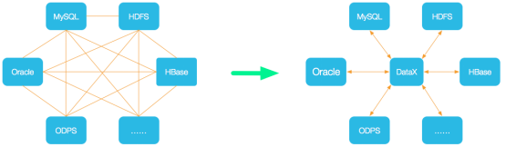
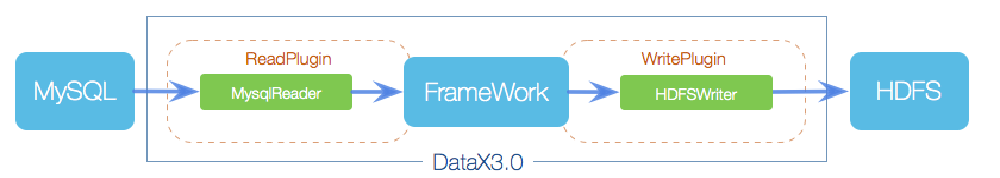
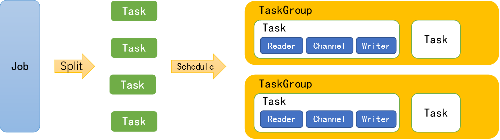

# 概述

​	DataX 是阿里巴巴开源的一个异构数据源离线同步工具，致力于实现包括关系型数据库(MySQL、Oracle等)、HDFS、Hive、ODPS、HBase、FTP等各种异构数据源之间稳定高效的数据同步功能


- 为了解决异构数据源同步问题，DataX将复杂的网状的同步链路变成了星型数据链路，DataX作为中间传输载体负责连接各种数据源

- 当需要接入一个新的数据源的时候，只需要将此数据源对接到DataX，便能跟已有的数据源做到无缝数据同步





## 框架设计



### Reader

数据采集模块，负责采集数据源的数据，将数据发送给Framework。


### Writer

数据写入模块，负责不断向Framework取数据，并将数据写入到目的端。


### Framework

用于连接reader和writer，作为两者的数据传输通道，并处理缓冲，流控，并发，数据转换等核心技术问题


## 运行原理




### Job

单个作业的管理节点，负责数据清理、子任务划分、TaskGroup监控管理


### Task

由Job切分而来，是DataX作业的最小单元，每个Task负责一部分数据的同步工作


### Schedule

将Task组成TaskGroup，单个TaskGroup的并发数量为5


### TaskGroup

负责启动Task


# 安装

- 下载地址：http://datax-opensource.oss-cn-hangzhou.aliyuncs.com/datax.tar.gz

- 源码地址：https://github.com/alibaba/DataX

- Linux
- JDK(1.8以上，推荐1.8)
- Python(推荐Python2.6.X)

- 解压

```bash
[ttshe@hadoop102 software]$ tar -zxvf datax.tar.gz -C /opt/module/
```

- 运行自检脚本
  - 运行官方job成功说明环境正常

```bash
[ttshe@hadoop102 bin]$ pwd
/opt/module/datax/bin
[ttshe@hadoop102 bin]$ python datax.py /opt/module/datax/job/job.json
```


## 安装mongodb

MongoDB 是由C++语言编写的，是一个基于分布式文件存储的开源数据库系统。MongoDB 旨在为WEB应用提供可扩展的高性能数据存储解决方案。MongoDB 将数据存储为一个文档，数据结构由键值(key=>value)对组成。MongoDB 文档类似于 JSON 对象。字段值可以包含其他文档，数组及文档数组

优点：

	1. MongoDB 是一个面向文档存储的数据库，操作起来比较简单和容易；
	2.内置GridFS，支持大容量的存储；
	3. 可以在MongoDB记录中设置任何属性的索引；
	4. MongoDB支持各种编程语言:RUBY，PYTHON，JAVA，C++，PHP，C#等多种语言；
	5.安装简单；
	6.复制（复制集）和支持自动故障恢复；
	7. MapReduce 支持复杂聚合。


缺点：

​	1.不支持事务；
​	2.占用空间过大；
​	3.不能进行表关联；
​	4.复杂聚合操作通过MapReduce创建，速度慢；

	5. MongoDB 在你删除记录后不会在文件系统回收空间。除非你删掉数据库


| **SQL术语/概念** | **MongoDB术语/概念** | **解释/说明**                       |
| ---------------- | -------------------- | ----------------------------------- |
| database         | database             | 数据库                              |
| table            | collection           | 数据库表/集合                       |
| row              | document             | 数据记录行/文档                     |
| column           | field                | 数据字段/域                         |
| index            | index                | 索引                                |
| table joins      | 不支持               | 表连接,MongoDB不支持                |
| primary key      | primary key          | 主键,MongoDB自动将_id字段设置为主键 |


- 下载地址https://www.mongodb.com/download-center#community

- 上传压缩包到虚拟机中
- 解压

```bash
[ttshe@hadoop102 software]$ tar -zxvf mongodb-linux-x86_64-4.0.10.tgz -C /opt/module/
[ttshe@hadoop102 module]$ mv mongodb-linux-x86_64-4.0.10/ mongodb
```

- 创建数据库目录
  - MongoDB的数据存储在data目录的db目录下，但是这个目录在安装过程不会自动创建，所以需要手动创建data目录，并在data目录中创建db目录

```bash
[ttshe@hadoop102 module]$ sudo mkdir -p /data/db
[ttshe@hadoop102 mongodb]$ sudo chmod 777 -R /data/db/
```

- 启动

```bash
[ttshe@hadoop102 mongodb]$ bin/mongod
```

- 进入shell页面

```bash
[atguigu@hadoop102 mongodb]$ bin/mongo
```


### 基本概念

#### 数据库

- 一个mongodb中可以建立多个数据库。MongoDB的默认数据库为"db"，该数据库存储在data目录中。MongoDB的单个实例可以容纳多个独立的数据库，每一个都有自己的集合和权限，不同的数据库也放置在不同的文件中

  - 显示所有数据库
    - test没有显示，因为test没有任何数据

  ```bash
  \> show dbs
  admin   0.000GB
  config  0.000GB
  local   0.000GB
  ```

  - admin：从权限的角度来看，这是"root"数据库。要是将一个用户添加到这个数据库，这个用户自动继承所有数据库的权限。一些特定的服务器端命令也只能从这个数据库运行，比如列出所有的数据库或者关闭服务器
  - local：这个数据永远不会被复制，可以用来存储限于本地单台服务器的任意集合
  - config：当Mongo用于分片设置时，config数据库在内部使用，用于保存分片的相关信息。

- 显示当前使用的数据库

```bash
\> db
test
```

- 切换数据库

```bash
\> use local
switched to db local
\> db
local
```


#### 集合

集合就是 MongoDB 文档组，类似于MySQL中的table。

集合存在于数据库中，集合没有固定的结构，这意味着你在对集合可以插入不同格式和类型的数据，但通常情况下我们插入集合的数据都会有一定的关联性。

MongoDB 中使用 createCollection() 方法来创建集合。

语法格式：

db.createCollection(name, options)

参数说明：

- name: 要创建的集合名称

- options: 可选参数, 指定有关内存大小及索引的选项，可以是如下参数：

| **字段**    | **类型** | **描述**                                                     |
| ----------- | -------- | ------------------------------------------------------------ |
| capped      | 布尔     | （可选）如果为 true，则创建固定集合。固定集合是指有着固定大小的集合，当达到最大值时，它会自动覆盖最早的文档。 **当该值为 true 时，必须指定 size 参数。** |
| autoIndexId | 布尔     | （可选）如为 true，自动在 _id 字段创建索引。默认为 false。   |
| size        | 数值     | （可选）为固定集合指定一个最大值（以字节计）。 **如果 capped 为 true，也需要指定该字段。** |
| max         | 数值     | （可选）指定固定集合中包含文档的最大数量。                   |


##### 案例1

- 在test库中创建一个atguigu的集合

```bash
\> use test
switched to db test
\> db.createCollection("atguigu")
{ "ok" : 1 }
\> show collections
Atguigu

//插入数据
\> db.atguigu.insert({"name":"atguigu","url":"www.atguigu.com"})
WriteResult({ "nInserted" : 1 })

//查看数据
\> db.atguigu.find()
{ "_id" : ObjectId("5d0314ceecb77ee2fb2d7566"), "name" : "atguigu", "url" : "www.atguigu.com" }
```

- 说明
  - ObjectId 类似唯一主键，可以很快的去生成和排序，包含 12 bytes
    - 含义
      - 前 4 个字节表示创建 unix 时间戳
      - 接下来的 3 个字节是机器标识码
      - 紧接的两个字节由进程 id 组成 PID
      - 最后三个字节是随机数

##### 案例2

创建一个固定集合mycol

```bash
\> db.createCollection("mycol",{ capped : true,autoIndexId : true,size : 6142800, max : 1000})

\> show tables;
atguigu
mycol
```


##### 案例3

- 自动创建集合
- 在 MongoDB 中，你不需要创建集合。当你插入一些文档时，MongoDB 会自动创建集合

```bash
\> db.mycol2.insert({"name":"atguigu"})
WriteResult({ "nInserted" : 1 })
\> show collections
atguigu
mycol
mycol2
```


##### 案例4

删除集合

```bash
\> db.mycol2.drop()
True
\> show tables;
atguigu
mycol
```


#### 文档(Document)

文档是一组键值(key-value)对组成。MongoDB 的文档不需要设置相同的字段，并且相同的字段不需要相同的数据类型，这与关系型数据库有很大的区别，也是 MongoDB 非常突出的特点。

一个简单的例子：

{"name":"atguigu"}

注意：

1.文档中的键/值对是有序的。

2.MongoDB区分类型和大小写。

3.MongoDB的文档不能有重复的键。

4.文档的键是字符串。除了少数例外情况，键可以使用任意UTF-8字符。


# 使用案例


## 从stream流读取数据打印到控制台

- 查看配置的模板

```bash
[ttshe@hadoop102 bin]$ python datax.py -r streamreader -w streamwriter

DataX (DATAX-OPENSOURCE-3.0), From Alibaba !
Copyright (C) 2010-2017, Alibaba Group. All Rights Reserved.

Please refer to the streamreader document:
     https://github.com/alibaba/DataX/blob/master/streamreader/doc/streamreader.md 

Please refer to the streamwriter document:
     https://github.com/alibaba/DataX/blob/master/streamwriter/doc/streamwriter.md 
 
Please save the following configuration as a json file and  use
     python {DATAX_HOME}/bin/datax.py {JSON_FILE_NAME}.json 
to run the job.
{
    "job": {
        "content": [
            {
                "reader": {
                    "name": "streamreader", 
                    "parameter": {
                        "column": [], # 输入的数据
                        "sliceRecordCount": "" # 打印次数
                    }
                }, 
                "writer": {
                    "name": "streamwriter", 
                    "parameter": {
                        "encoding": "",  # 字符编码
                        "print": true # 是否打印到控制台
                    }
                }
            }
        ], 
        "setting": {
            "speed": {  # 并发度
                "channel": "" # 指定channel个数
            }
        }
    }
}
```

- 根据模板编写配置文件stream2stream.json

```json
{
    "job": {
        "content": [
            {
                "reader": {
                    "name": "streamreader", 
                    "parameter": {
                        "column": [
                            {
                                "type":"long",
                                "value":10
                            },
                            {
                                "type":"string",
                                "value":"hello datax"
                            }
                        ], 
                        "sliceRecordCount": "3" 
                    }
                }, 
                "writer": {
                    "name": "streamwriter", 
                    "parameter": {
                        "encoding": "utf-8",  
                        "print": true
                    }
                }
            }
        ], 
        "setting": {
            "speed": {
                "channel": 2
            }
        }
    }
}
```

- 执行job

```bash
[ttshe@hadoop102 bin]$ python datax.py /opt/module/datax/job/stream2stream.job 
```

- 结果
  - 打印了2遍，如果是mysql等channel设置为2，则表示并行度是2，每条数据执行一遍

```text
rted
2019-12-23 11:28:43.720 [taskGroup-0] INFO  TaskGroupContainer - taskGroup[0] taskId[1] attemptCount[1] is started
10	hello datax
10	hello datax
10	hello datax
10	hello datax
10	hello datax
10	hello datax
2019-12-23 11:28:43.821 [taskGroup-0] INFO
```


## mysql2hdfs

- 查看模板

```bash
[ttshe@hadoop102 bin]$ python datax.py -r mysqlreader -w hdfswriter

{
    "job": {
        "content": [
            {
                "reader": {
                    "name": "mysqlreader", 
                    "parameter": {
                        "column": [],  # 需要同步的列集合，使用json数组描述自带信息，* 代表所有列
                        "connection": [ # 对数据库的jdbc连接,使用json数组描述，支持多个连接地址
                            {
                                "jdbcUrl": [], 
                                "table": [], # 需要同步的表，支持多个
                				【"querySql":[]】 # 自定义sql，mysqlreader会忽略table，column，where关键字
                            }
                        ], 
                        "password": "", # 数据库对应的密码
                        "username": "", # 数据库对应的用户名称
                        【"where": ""】 # 筛选条件
    					【"splitPk":""】  # 数据分片字段，一般是主键，仅支持整型
                    }
                }, 
                "writer": {
                    "name": "hdfswriter", 
                    "parameter": {
                        "column": [], # 写入数据的字段，name指定字段名，type指定类型，不能用*代替
                        "compress": "",  # hdfs文件压缩类型，默认不填写说明没有压缩
                        "defaultFS": "", # hdfs中namenode节点的地址，hdfs://ip:port
                        "fieldDelimiter": "",  # 字段分隔符
                        "fileName": "", # 写入文件名
                        "fileType": "", # 文件类型，支持text，orc
                        "path": "", # hdfs文件系统的路径
                        "writeMode": ""  # 写入数据清理前数据模式：append，追加；nonConfict:如果目录下有fileName前缀文件，直接报错
                    }
                }
            }
        ], 
        "setting": {
            "speed": {
                "channel": ""
            }
        }
    }
}
```

- 在mysql中创建数据库，插入数据

```bash
mysql> create database datax;
mysql> use datax;
mysql> create table student(id int,name varchar(20));
mysql> insert into student values(1,'lis'),(2,'wang'),(3,'she');
```

- 创建路径

```bash
[ttshe@hadoop102 zeppelin]$ hadoop fs -mkdir /datax
```

- 编写job

```json
{
    "job": {
        "content": [
            {
                "reader": {
                    "name": "mysqlreader", 
                    "parameter": {
                        "column": [
                            "id","name"
                        ], 
                        "connection": [
                            {
                                "jdbcUrl": ["jdbc:mysql://hadoop102:3306/datax"], 
                                "table": ["student"]
                            }
                        ], 
                        "username": "123456", 
                        "password": "root"
                    }
                }, 
                "writer": {
                    "name": "hdfswriter", 
                    "parameter": {
                        "column": [
                            {
                                "type":"int",
                                "name":"id"
                            },
                            {
                                "type":"string",
                                "name":"name"
                            }
                        ], 
                        "defaultFS": "hdfs://hadoop102:9000", 
                        "fieldDelimiter": ";", 
                        "fileName": "student.txt", 
                        "fileType": "text", 
                        "path": "/datax", 
                        "writeMode": "append"
                    }
                }
            }
        ], 
        "setting": {
            "speed": {
                "channel": "2"
            }
        }
    }
}
```

- 执行job

```bash
[ttshe@hadoop102 bin]$ python datax.py /opt/module/datax/job/mysql2hdfs.json
```

- 查看结果

```bash
hadoop fs -cat /datax/student.txt__471d8905_bd69_4c43_ae56_69e54304183f
```


## hdfs2mysql

- 将上个案例上传的文件改名

```bash
[ttshe@hadoop102 ~]$ hadoop fs -mv /datax/student.txt* /datax/student.txt
```

- 查看官方模板

```bash
[ttshe@hadoop102 bin]$ python datax.py -r hdfsreader -w mysqlwriter

DataX (DATAX-OPENSOURCE-3.0), From Alibaba !
Copyright (C) 2010-2017, Alibaba Group. All Rights Reserved.

Please refer to the hdfsreader document:
     https://github.com/alibaba/DataX/blob/master/hdfsreader/doc/hdfsreader.md 

Please refer to the mysqlwriter document:
     https://github.com/alibaba/DataX/blob/master/mysqlwriter/doc/mysqlwriter.md 
 
Please save the following configuration as a json file and  use
     python {DATAX_HOME}/bin/datax.py {JSON_FILE_NAME}.json 
to run the job.

{
    "job": {
        "content": [
            {
                "reader": {
                    "name": "hdfsreader", 
                    "parameter": {
                        "column": [], 
                        "defaultFS": "", 
                        "encoding": "UTF-8", 
                        "fieldDelimiter": ",", 
                        "fileType": "orc", 
                        "path": ""
                    }
                }, 
                "writer": {
                    "name": "mysqlwriter", 
                    "parameter": {
                        "column": [], 
                        "connection": [
                            {
                                "jdbcUrl": "", 
                                "table": []
                            }
                        ], 
                        "password": "", 
                        "preSql": [], 
                        "session": [], 
                        "username": "", 
                        "writeMode": ""
                    }
                }
            }
        ], 
        "setting": {
            "speed": {
                "channel": ""
            }
        }
    }
}
```

- 创建配置文件hdfs2mysql.json

```json
{
    "job": {
        "content": [
            {
                "reader": {
                    "name": "hdfsreader", 
                    "parameter": {
                        "column": [
                            {
                                "index":0,
                                "type":"long"
                            },
                            {
                                "index":1,
                                "type":"string"
                            }
                        ], 
                        "defaultFS": "hdfs://hadoop102:9000", 
                        "encoding": "UTF-8", 
                        "fieldDelimiter": ";", 
                        "fileType": "text", 
                        "path": "/datax/student.txt"
                    }
                }, 
                "writer": {
                    "name": "mysqlwriter", 
                    "parameter": {
                        "column": ["id","name"], 
                        "connection": [
                            {
                                "jdbcUrl": "jdbc:mysql://hadoop102:3306/datax", 
                                "table": ["student"]
                            }
                        ], 
                        "username": "root", 
                        "password": "123456", 
                        "preSql": [], 
                        "session": [], 
                        "writeMode": "insert"
                    }
                }
            }
        ], 
        "setting": {
            "speed": {
                "channel": "1"
            }
        }
    }
}
```

- 执行

```bash
python datax.py /opt/module/datax/job/hdfs2mysql.json
```


## mongoDb2hdfs

```json
{
    "job": {
        "content": [
            {
                "reader": {
                    "name": "mongodbreader", 
                    "parameter": {
                        "address": ["127.0.0.1:27017"], 
                        "collectionName": "student", 
                        "column": [
                        	{
                        		"name":"name",
                        		"type":"string"
                        	},
                        	{
                        		"name":"url",
                        		"type":"string"
                        	}
                        ], 
                        "dbName": "test", 
                    }
                }, 
                "writer": {
                    "name": "hdfswriter", 
                    "parameter": {
                        "column": [
                        	{
                        		"name":"name",
                        		"type":"string"
                        	},
                        	{
                        		"name":"url",
                        		"type":"string"
                        	}
                        ], 
                        "defaultFS": "hdfs://hadoop102:9000", 
                        "fieldDelimiter": ";", 
                        "fileName": "mongo.txt", 
                        "fileType": "text", 
                        "path": "/", 
                        "writeMode": "append"
                    }
                }
            }
        ], 
        "setting": {
            "speed": {
                "channel": "1"
            }
        }
    }
}
```

- 参数
  - address
    - MongoDB的数据地址信息，因为MonogDB可能是个集群，则ip端口信息需要以Json数组的形式给出。【必填】
  - userName：MongoDB的用户名。【选填】
  - userPassword： MongoDB的密码。【选填】
  - collectionName： MonogoDB的集合名。【必填】
  - column：MongoDB的文档列名。【必填】
  - name：Column的名字。【必填】
  - type：Column的类型。【选填】
  - splitter：因为MongoDB支持数组类型，但是Datax框架本身不支持数组类型，所以mongoDB读出来的数组类型要通过这个分隔符合并成字符串。【选填】

  

## mongodb2mysql

```json
{
    "job": {
        "content": [
            {
                "reader": {
                    "name": "mongodbreader", 
                    "parameter": {
                        "address": ["127.0.0.1:27017"], 
                        "collectionName": "student", 
                        "column": [
                        	{
                        		"name":"name",
                        		"type":"string"
                        	},
                        	{
                        		"name":"url",
                        		"type":"string"
                        	}
                        ], 
                        "dbName": "test", 
                    }
                }, 
                "writer": {
                    "name": "mysqlwriter", 
                    "parameter": {
                        "column": ["*"], 
                        "connection": [
                            {
                                "jdbcUrl": "jdbc:mysql://hadoop102:3306/test", 
                                "table": ["student"]
                            }
                        ], 
                        "password": "123456", 
                        "username": "root", 
                        "writeMode": "insert"
                    }
                }
            }
        ], 
        "setting": {
            "speed": {
                "channel": "1"
            }
        }
    }
}
```


# 问题


## oracle和mysql中处理的区别

- oracle使用datax事务提交的时候，是手动提交，需要处理
- mysql使用datax事务提交的时候，是自动提交